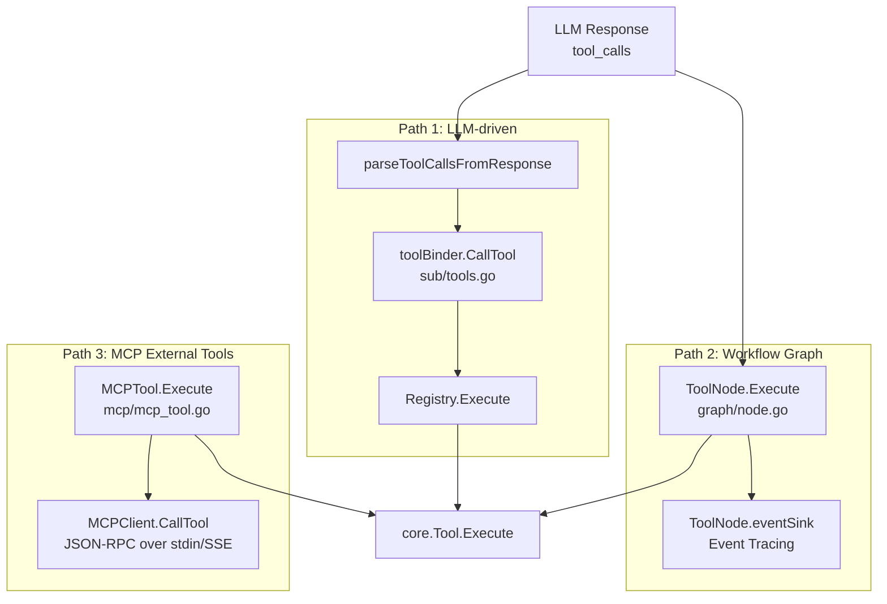
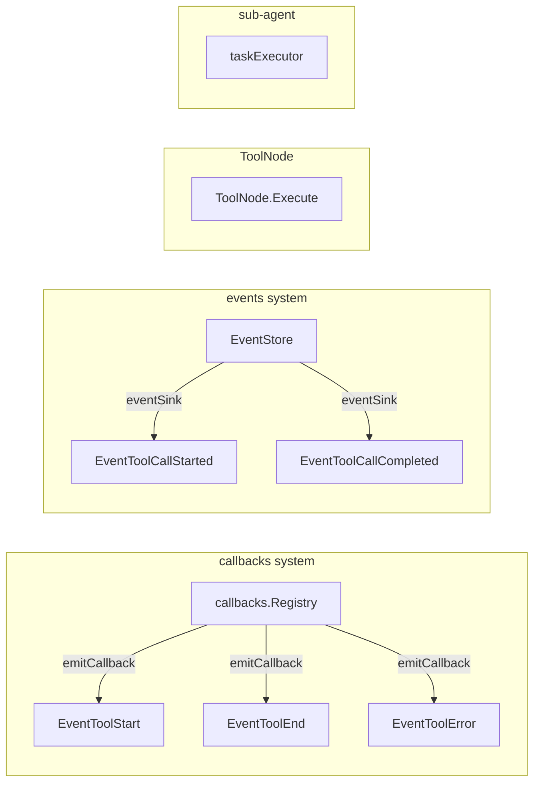

# ares Architecture Deep Dive (V): Tool Invocation Layer -- Three Paths and One Gap

> After registering all 22 tools, I thought I was done. Then the first integration test brought me back to reality — the parameters generated by the LLM caused a panic because a type assertion failed.
> I realized something: defining tools is just the first step. What's really complex is the **invocation chain** — how tools actually get called.
> How do parameters go from the LLM's JSON into Go functions? How do results get back? Who handles timeouts? Who handles retries? This is where the real complexity of the tool system lives.

## 1. Three Invocation Paths

A lot of people see the tool registration system and think tool invocation is just `registry.Execute(name, params)` — one call to rule them all. But in practice, there are three completely different invocation paths, each with its own tradeoffs:



When the LLM decides to call a tool, the data flows like this:

```
LLM returns tool_calls (OpenAI JSON)
    ↓
parseToolCallsFromResponse()     [internal/llm/output/openai.go]
    ↓ ToolCallResponse { ToolCalls: [{ID, Name, Arguments}] }
sub-agent executor               [internal/agents/sub/executor.go]
    ↓ iterate ToolCalls
toolBinder.CallTool(name, args)  [internal/agents/sub/tools.go]
    ↓ lookup closure mapping
Registry.Execute(ctx, params)    [internal/tools/resources/core/registry.go]
    ↓ lookup by name
Tool.Execute(ctx, params)        [core/tool.go]
    ↓
core.Result { Success, Data, Error }
```

This is the **most common** path, and also the one with the most issues. Let's break each one down.

---

## 2. Path 1: LLM-Driven Tool Invocation

### 2.1 toolBinder: The Bridge from Registry to Agent

The sub-agent doesn't use `GlobalRegistry` directly. There's a `toolBinder` layer in between:

```go
// internal/agents/sub/tools.go
type toolBinder struct {
    mu       sync.RWMutex
    tools    map[string]func(ctx context.Context, args map[string]any) (any, error)
    registry *core.Registry
}

func (b *toolBinder) BridgeFromRegistry(registry *core.Registry) {
    // iterate registry, create a closure for each tool
    // effectively: b.tools[name] = func(ctx, args) { return t.Execute(ctx, args) }
}
```

Why this extra layer? Three reasons:

1. **Interface isolation**: The sub-agent doesn't need to know about `Registry` — it just needs to "call a function by name"
2. **Local-first**: `toolBinder.GetTool` has a local → Registry fallback chain, supporting private tool injection per sub-agent
3. **Testability**: Tests can mock toolBinder directly without bootstrapping the entire Registry

### 2.2 LLM Tool Call Protocol Adapter

The path from the LLM's JSON to Go's `map[string]interface{}` looks simple on the surface, but hides a subtle complexity:

```go
// internal/llm/output/openai.go
func parseToolCallsFromResponse(choice *Choice) (*ToolCallResponse, error) {
    // OpenAI's tool_calls structure:
    // {
    //   "tool_calls": [{
    //     "id": "call_xxx",
    //     "function": {
    //       "name": "calculator",
    //       "arguments": "{\"expression\": \"1+1\"}"
    //     }
    //   }]
    // }
    // arguments is a JSON **string**, not an object
    // requires double deserialization
}
```

There's an easily overlooked detail here: `arguments` is a JSON `string`, not a JSON `object`. If the LLM returns malformed JSON, it panics here. And OpenAI and Anthropic have different tool call formats — Anthropic embeds the JSON object directly in a content block.

To unify this, the framework defines its own abstraction:

```go
// internal/llm/output/toolcall.go
type ToolCapable interface {
    GenerateWithTools(ctx context.Context, prompt string, 
        tools []ToolDefinition, choice ToolChoice) (*ToolCallResponse, error)
    SendToolResult(ctx context.Context, messages []map[string]interface{},
        toolResults []ToolResult) (*ToolCallResponse, error)
}

type ToolCall struct {
    ID        string `json:"id"`
    Name      string `json:"name"`
    Arguments string `json:"arguments"`  // JSON string
}
```

Each LLM vendor's adapter is responsible for converting its format to `ToolCallResponse`. This makes **tool registration, dispatch, and execution** completely transparent to the LLM vendor.

### 2.3 The Parameter Validation Gap

This is the issue that keeps me up at night. Look at this code:

```go
// internal/tools/resources/builtin/math/calculator.go
func (t *Calculator) Execute(ctx context.Context, params map[string]interface{}) (core.Result, error) {
    expression, ok := params["expression"].(string)  // manual type assertion
    if !ok || expression == "" {
        return core.NewErrorResult("invalid_expression"), nil
    }
    // ...
}
```

**What's the problem?** `ParameterSchema` defines the types, formats, enums of all parameters, but **there is no generic code that validates parameters before calling `Execute`**.

```go
// core/tool.go - ParameterSchema definition
type ParameterSchema struct {
    Type       string                `json:"type"`
    Properties map[string]*Parameter `json:"properties"`
    Required   []string              `json:"required"`
}

// core/registry.go - Execute implementation
func (r *Registry) Execute(ctx context.Context, name string, params map[string]interface{}) (Result, error) {
    tool := r.Get(name)
    if tool == nil {
        return NewErrorResult("tool not found"), nil
    }
    return tool.Execute(ctx, params)  // directly executes, no schema validation
}
```

This means `ParameterSchema` is only "informational" for the LLM — it has no binding power over code execution. Each tool manually writes `params["xxx"].(string)` type assertions. If they get it right, fine. If not — panic.

I know about this gap and haven't fixed it. Why? A parameter validator would need to handle nested JSON Schema, enums, min/max, patterns — that's heavy in Go. More importantly, sometimes the LLM passes parameters that are in edge cases of validation (like extra fields), and lenient parameter handling is actually more robust. It's a tradeoff — I chose "trust the LLM + tool self-protection."

---

## 3. Path 2: Workflow Graph's ToolNode

The second invocation path uses the Workflow engine's graph execution mechanism.

```go
// internal/workflow/graph/node.go
type ToolNode struct {
    tool        core.Tool
    nodeID      string
    executionID string
    eventSink   func(ctx context.Context, eventType events.EventType, payload map[string]any)
}

func (n *ToolNode) Execute(ctx context.Context, state *State) error {
    // 1. Generate deterministic inputHash
    inputHash := n.hashInput(params)
    // 2. Generate tool_call_id
    toolCallID := fmt.Sprintf("tool_%s_%s", n.nodeID, inputHash)
    // 3. Pre-hook: emit EventToolCallStarted
    n.eventSink(ctx, EventToolCallStarted, map[string]any{
        "tool_call_id":  toolCallID,
        "execution_id":  n.executionID,
        "input_hash":    inputHash,
        "tool_name":     n.tool.Name(),
        "params":        params,
    })
    // 4. Execute tool
    result, err := n.tool.Execute(ctx, params)
    // 5. Post-hook: emit EventToolCallCompleted
    status := "success"
    if err != nil || !result.Success { status = "error" }
    n.eventSink(ctx, EventToolCallCompleted, map[string]any{
        "status":      status,
        "summary":     truncateString(fmt.Sprintf("%v", result.Data), 200),
        "duration_ms": time.Since(start).Milliseconds(),
    })
    // 6. Write to state
    state.Set("node."+toolName, result.Data)
}
```

How does this differ from the LLM-driven path?

| Dimension | Path 1: LLM-driven | Path 2: ToolNode |
|-----------|-------------------|------------------|
| **Parameter source** | LLM-generated | Workflow state or upstream nodes |
| **Invocation trigger** | Agent conversation loop | Deterministic graph execution |
| **Event tracing** | callbacks.EventToolStart/End/Error | eventSink + ToolCallStarted/Completed |
| **Result handling** | Formatted as text back to LLM | Written to state for downstream nodes |
| **Repeatability** | May differ each conversation | Deterministic (same inputHash = same result) |

ToolNode's design hints at a different use case: **when you don't need LLM decision-making**. For example, a fixed pipeline: "scrape web page → extract text → summarize" — no need for the LLM to make decisions at every step; just use graph orchestration.

---

## 4. Path 3: MCP External Tool Adapter

MCP (Model Context Protocol) is Anthropic's standardized tool protocol using JSON-RPC over stdin/SSE. ares's MCP adapter wraps external tools as standard `core.Tool`:

```go
// internal/mcp/mcp_tool.go
type MCPTool struct {
    *base.BaseTool
    client     *MCPClient
    serverName string
    toolDef    *MCPToolDef
}

func NewMCPTool(client *MCPClient, serverName string, def *MCPToolDef) *MCPTool {
    // MCP's InputSchema is JSON Schema format
    // needs conversion to ares's ParameterSchema
    params := ConvertJSONSchema(def.InputSchema)
    // Naming convention: "mcp.{serverName}.{toolName}"
    name := fmt.Sprintf("mcp.%s.%s", serverName, def.Name)
    return &MCPTool{...}
}

func (t *MCPTool) Execute(ctx context.Context, params map[string]interface{}) (core.Result, error) {
    result, err := t.client.CallTool(ctx, t.toolDef.Name, params)
    if err != nil {
        return core.NewErrorResult(err.Error()), nil
    }
    // MCP returns a Content array; extract text content
    text := extractText(result.Content)
    return core.NewResult(true, map[string]interface{}{
        "content": text,
        "blocks":  result.Content,
    }), nil
}
```

Key design decisions:

1. **Naming isolation**: `"mcp.{serverName}.{toolName}"` avoids conflicts with built-in tool names
2. **Schema conversion**: `ConvertJSONSchema()` translates MCP's JSON Schema to `ParameterSchema` — again, only used for LLM tool definitions, not runtime validation
3. **Result adaptation**: MCP returns Content Block arrays (multiple types: text/image/resource), extracts text as primary content while retaining blocks for advanced use

MCP's strength is **standardization** — an MCP server can be reused in any MCP-compatible framework. The downside is performance — every tool call incurs JSON-RPC serialization/deserialization overhead.

---

## 5. Result Formatting: The Underestimated Layer

After a tool executes and returns `core.Result`, it can't be thrown directly back to the LLM — the LLM needs **human-readable text**. That's `ResultFormatter`'s job.

```go
// internal/tools/resources/formatter/result_formatter.go
func (rf *ResultFormatter) Format(
    toolName string, 
    params map[string]interface{}, 
    result core.Result, 
    duration time.Duration,
) string {
    if !result.Success {
        return fmt.Sprintf("Error calling tool %s: %s", toolName, result.Error)
    }
    return rf.formatByToolType(toolName, params, result)
}

func (rf *ResultFormatter) formatByToolType(
    toolName string, 
    params map[string]interface{}, 
    result core.Result,
) string {
    switch toolName {
    case "datetime":   return rf.formatDateTime(params, result.Data)
    case "calculator": return rf.formatCalculator(params, result.Data)
    case "file_tools": return rf.formatFileTools(params, result.Data)
    case "web_scraper": return rf.formatWebScraper(params, result.Data)
    // ... ~15 tool-specific formatters
    default: return rf.formatDefault(toolName, params, result.Data)
    }
}
```

The formatter matters at two levels:

**Level 1: Format quality directly affects LLM comprehension.**

Calculator formatting:

```go
func (rf *ResultFormatter) formatCalculator(params map[string]interface{}, data interface{}) string {
    resultMap, _ := data.(map[string]interface{})
    expression, _ := resultMap["expression"].(string)
    result, _ := resultMap["result"].(float64)
    return fmt.Sprintf("Expression `%s` evaluates to: **%s**", expression, formatNumber(result))
}
```

When the LLM reads "Expression `100*(100+1)/2` evaluates to: **5050**", it doesn't need to parse — it can use it directly.

**Level 2: Formatters are hardcoded by tool name.**

With `switch toolName`, adding a new tool means you must also update the formatter. If you forget, it falls through to `formatDefault` — a plain JSON dump. The LLM can still read it, but the experience is noticably worse.

I'm still not satisfied with this layer. The ideal solution would route formatting by `ToolCategory` or `Capability`, but it's never been high enough priority.

---

## 6. Events and Callbacks: Two Coexisting Systems

During tool invocation, two independent event systems operate:



Why two systems?

The `callbacks` system is the earlier design — a general-purpose event hook system supporting logging and metrics emission on `EventToolStart`. The `events` system (EventStore) was designed for event sourcing and ReAct Runtime Trace — it records more granular execution context (execution_id, tool_call_id, input_hash).

Historical reason: callbacks came first, events came later, and they haven't been merged. Currently they operate independently and don't interfere with each other.

---

## 7. Cross-Cutting Concerns

### 7.1 Timeout Control

Currently, tool invocation timeouts rely entirely on `context.Context`:

```go
// sub/executor.go
ctx, cancel := context.WithTimeout(parentCtx, 30*time.Second)
defer cancel()
result, err := toolBinder.CallTool(ctx, name, args)
```

But this is a **caller-set** timeout, not a uniform tool-layer timeout. Different callers might set different timeouts — sub-agent sets 30s, ToolNode sets 60s — with no uniform fallback. If a caller forgets to set a timeout, the tool could run forever.

### 7.2 Concurrency and Rate Limiting

`GlobalRegistry` itself is concurrency-safe (`sync.RWMutex`), but it **does not provide concurrency control per individual tool**. This means:

- If 10 sub-agents call `CodeRunner` simultaneously, there's no queuing mechanism
- No tool-level rate limiting (e.g., WebScraper max 5 calls/second)
- No quota management (e.g., how many CodeRunner calls per user per day)

The current strategy is "trust the Agent's serial calling pattern" — within a single Agent conversation, tool calls are serial. But cross-Agent concurrent calls are real and unprotected.

### 7.3 Logging and Tracing

Tool invocation logs are scattered across three locations:

1. `callbacks.Emit(EventToolStart)` — simple lifecycle logging
2. `ToolNode.eventSink` — detailed execution tracing (with execution_id)
3. `events.EventStore` — complete event sourcing

This makes debugging unfriendly — if you need to trace a single tool call, you have to check three different places.

---

## 8. Known Issues & Design Flaws

### 8.1 Missing Parameter Validation (Most Critical)

As discussed earlier, `ParameterSchema` defines a comprehensive set of type constraints, but **there is no code that validates parameters before `Execute`**. If the LLM passes `"expression": 123` instead of `"expression": "1+1"`, `params["expression"].(string)` will panic.

**Short-term fix**: Add automated validation in `Registry.Execute` using a Go JSON Schema implementation (e.g., `gojsonschema`).

**Long-term solution**: Make `ParameterSchema` support `Validate(params) error` and integrate it into the standard invocation chain.

### 8.2 ResultFormatter Hardcoded Matching

`formatByToolType` hardcodes about 15 tool formatters with `switch toolName`. Adding a new tool means:

- Either remember to update the formatter (easy to forget)
- Or fall through to `formatDefault` (JSON dump, poor LLM experience)

**Ideal solution**: Move formatting into the tool itself — add a `FormatResult(data interface{}) string` method to the `Tool` interface. Then when a new tool is added, its formatting logic is registered alongside it.

### 8.3 No Unified Retry Mechanism

When a tool call fails due to network flakiness or transient errors, there's no retry mechanism. `CodeRunner` times out? It fails — no retry.

Not all tools should be retried (e.g., `KnowledgeAdd` should not be called twice), but at least retryable tools (like `HTTPRequest`, `WebScraper`) should have a unified retry middleware.

### 8.4 ToolNode and sub-agent Overlap

The two invocation paths (ToolNode and sub-agent toolBinder) have significant functional overlap — parameter passing, result handling, event tracing. If ToolNode's event system were unified with the sub-agent, there would be less duplication.

But they currently exist in separate packages, unaware of each other. This "not knowing" is intentional — I don't want the agent layer to depend on the workflow layer. But if someone wants to use ToolNode's event model in the agent layer later, they'll have to rebuild it.

### 8.5 MCP Naming Conflict Risk

`NewMCPTool` names tools as `"mcp.{serverName}.{toolName}"`, but `BridgeFromRegistry` uses `tool.Name()` directly as the key in `toolBinder.tools`. This means:

- The Agent sees the full name `"mcp.weather-server.get_weather"`
- The LLM might not understand the prefix, or might generate tool calls without the `mcp.` prefix
- If two MCP servers expose tools with the same name (unlikely but possible), silent overwriting occurs

**On the plus side**: The namespace prefix reduces collision risk with built-in tools. This is still better than flat-naming everything.

---

## 9. Summary

Looking back, the tool invocation layer is far more complex than the tool **definition** layer. Three invocation paths:

- **LLM-driven** (sub-agent toolBinder) — most commonly used, but parameter validation is wide open
- **Workflow Graph** (ToolNode) — deterministic, complete event tracing
- **MCP external tools** — standardized integration, but with serialization overhead

What bothers me most is the parameter validation gap — `ParameterSchema` defines the rules, but nobody enforces them. This "definition-execution disconnect" might be tolerable in other systems, but in tool invocation, the uncertainty of LLM-generated parameters makes it critical.

But that's the reality of building an Agent framework — you can't enforce compile-time type safety on LLM output. What you can do is: catch errors at runtime, log everything, and format results well. Get these three things right, and the invocation layer is solid enough.

Next up: **Memory system and knowledge distillation** — how the Agent remembers important information across conversations, so it's not "nice to meet you" every single time.

---

**Appendix: Key File Index**

| Component | File Path |
|-----------|-----------|
| Core Tool interface | `internal/tools/resources/core/tool.go` |
| Registry | `internal/tools/resources/core/registry.go` |
| CapabilityEngine | `internal/tools/resources/core/capability.go` |
| Tool binder | `internal/agents/sub/tools.go` |
| Sub-agent executor | `internal/agents/sub/executor.go` |
| LLM tool call protocol | `internal/llm/output/toolcall.go` |
| OpenAI adapter | `internal/llm/output/openai.go` |
| Result formatter | `internal/tools/resources/formatter/result_formatter.go` |
| ToolNode (Workflow) | `internal/workflow/graph/node.go` |
| MCP tool adapter | `internal/mcp/mcp_tool.go` |
| MCP client | `internal/mcp/client.go` |
| Callback system | `internal/callbacks/callbacks.go` |
| Event system | `internal/events/` |
| Builtin tool registration | `internal/tools/resources/builtin/builtin.go` |