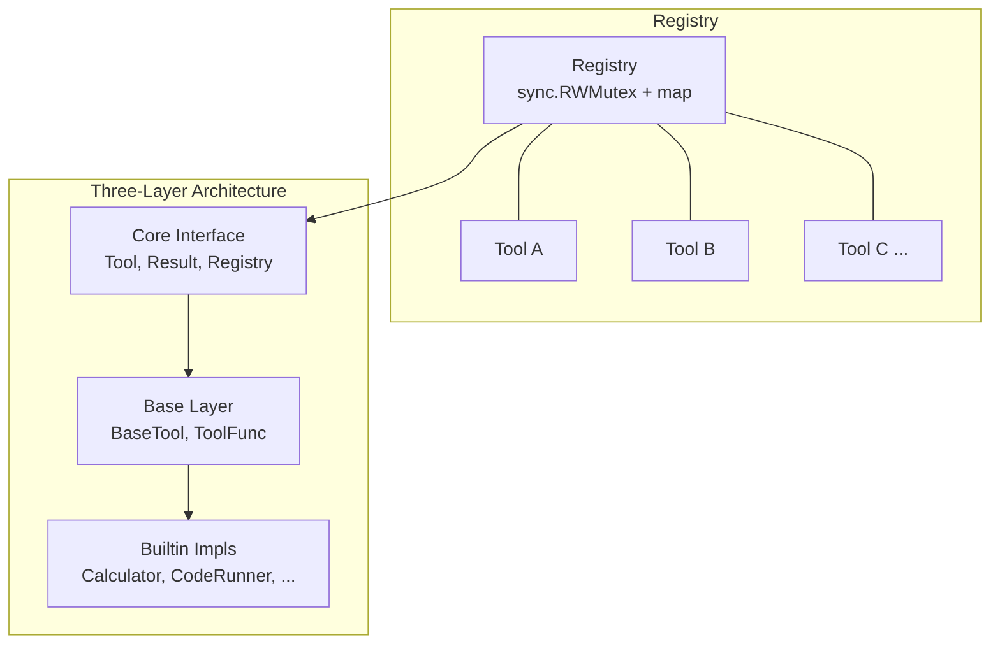

# GoAgentX Architecture Deep Dive (V): Tool System -- Capability Matrix & Secure Execution

> No matter how smart an Agent is, if it can't use tools, it's useless. Ever seen one of those Agents that talks the talk but doesn't walk? "Let me look that up for you" -- and then nothing happens.
> I thought to myself back then: An Agent's capability boundary is determined by what tools it can invoke. So I designed the tool system to be the thickest layer in the entire framework.
> 22 built-in tools, from calculator to code executor, from web scraping to knowledge base CRUD. This isn't about padding numbers -- each one has a reason to exist.

## 1. Why the Tool Layer Is So Thick

What's the most awkward moment when writing an Agent? The Agent says "Let me look up some information for you" -- and then nothing happens -- because it doesn't have a web search tool. Or the Agent says "Let me calculate that" -- and then gives you a text-based formula -- because it can't call a calculator.

My first Python solution registered tools by stuffing functions into a giant dict. Later I realized it was completely unmaintainable: no parameter validation, no error handling, no security isolation. One broken tool would take down the entire Agent.

So when designing GoAgentX's tool system, I set down a few hard rules:

1. **Every tool is an independent citizen** -- with its own name, description, parameter schema, and capability tags
2. **Centralized registry management** -- no scattering code everywhere
3. **Security is not an afterthought** -- high-risk tools like code execution and file operations had multi-layered protection from day one
4. **Capabilities must be discoverable** -- the Agent needs to know what tools it can call, no hardcoding allowed

## 2. Architecture Overview: Three-Layer Architecture + Registry Pattern

GoAgentX's tool system adopts a classic three-layer architecture, combined with the Registry pattern for tool management and scheduling.



### 2.1 Core Interface Layer

The Core Interface Layer is defined under `/src/goagent/internal/tools/resources/core/` and serves as the foundation contract for the entire tool system.

**Tool Interface** (`tool.go`):

```go
type Tool interface {
    Name() string
    Description() string
    Category() ToolCategory
    Capabilities() []Capability
    Execute(ctx context.Context, params map[string]interface{}) (Result, error)
    Parameters() *ParameterSchema
}
```

Each tool must implement six methods:
- `Name()` -- globally unique tool identifier for registration and lookup
- `Description()` -- tool functionality description for LLM to understand when to use it
- `Category()` -- tool category (System / Core / Data / Knowledge / Memory / Domain / External)
- `Capabilities()` -- capability tag array, supporting runtime capability filtering
- `Execute()` -- actual tool execution logic, receiving `map[string]interface{}` parameters
- `Parameters()` -- parameter schema metadata definition for parameter validation and guiding LLM parameter generation

**Result Struct** (`result.go`):

```go
type Result struct {
    Success  bool                   `json:"success"`
    Data     interface{}            `json:"data,omitempty"`
    Error    string                 `json:"error,omitempty"`
    Metadata map[string]interface{} `json:"metadata,omitempty"`
}
```

The Result struct uses the `Success` field to distinguish success from failure, `Data` carries the execution result, and `Metadata` carries execution metadata. The companion helper functions `NewResult()`, `NewErrorResult()`, and `ResultWithTiming()` provide convenient constructors.

**Registry** (`registry.go`):

```go
type Registry struct {
    tools map[string]Tool
    mu    sync.RWMutex
}

func NewRegistry() *Registry
func (r *Registry) Register(tool Tool) error
func (r *Registry) Get(name string) Tool
func (r *Registry) List() []Tool
func (r *Registry) Execute(ctx context.Context, name string, params map[string]interface{}) (Result, error)
func (r *Registry) Filter(filter ToolFilter) []Tool
```

The Registry uses `sync.RWMutex` for concurrency safety, providing core operations like `Register`, `Unregister`, `Get`, `List`, `Execute`, and `Filter`. The companion `ToolGroup` type supports logical grouping of tools, and `ToolFilter` supports runtime filtering by Enabled/Disabled/Categories.

The global singleton `GlobalRegistry` and package-level convenience functions (`Register`, `Get`, `List`, `Execute`) make tool registration and usage very clean.

**Capability Tag System**:

```go
const (
    CapabilityMath     Capability = "math"
    CapabilityKnowledge Capability = "knowledge"
    CapabilityMemory   Capability = "memory"
    CapabilityNetwork  Capability = "network"
    CapabilityFile     Capability = "file"
    CapabilityText     Capability = "text"
    CapabilityTime     Capability = "time"
    CapabilityExternal Capability = "external"
)
```

The capability tag system supports filtering available tools based on the Agent's permissions. For example, an Agent with network access disabled will not be able to call tools tagged with `CapabilityNetwork`.

### 2.2 Base Layer

The Base Layer is defined under `internal/tools/resources/base/`.

**BaseTool Struct**:

```go
type BaseTool struct {
    name, description string
    category          core.ToolCategory
    capabilities      []core.Capability
    parameters        *core.ParameterSchema
    metadata          *core.ToolMetadata
}
```

BaseTool provides default implementations for 5 of the `Tool` interface's methods (except `Execute`), so developers only need to focus on implementing the `Execute` method. The companion `ToolLifecycle` interface supports `Init()` and `Stop()` lifecycle hooks (default no-op).

**ToolFunc Functional Adapter**:

```go
func ToolFunc(name, description string, category core.ToolCategory,
    capabilities []core.Capability, params *core.ParameterSchema,
    execute func(context.Context, map[string]interface{}) (core.Result, error)) *BaseTool
```

ToolFunc provides a functional way to define tools, suitable for simple tools that don't require defining a new struct type.

**Factory Functions**:

```go
func NewBaseTool(name, description string, category core.ToolCategory, params *ParameterSchema) *BaseTool
func NewBaseToolWithCapabilities(name, description string, category core.ToolCategory,
    capabilities []core.Capability, params *ParameterSchema) *BaseTool
func NewBaseToolWithCategory(name, description string, category core.ToolCategory, params *ParameterSchema) *BaseTool
```

Note: Tools created with `NewBaseToolWithCategory` have an empty `capabilities` list, which is a known issue (see below for details).

### 2.3 Registration Entry Point

The registration entry point is defined in `internal/tools/resources/builtin/builtin.go`:

```go
func RegisterGeneralTools() {
    // -- System Tools --
    Register(NewIDGenerator())
    // -- Execution Tools --
    Register(NewCodeRunner())
    // -- File Tools --
    Register(NewFileTools())
    // -- Math Tools --
    Register(NewCalculator())
    Register(NewDateTime())
    Register(NewTextProcessor())
    // -- Data Tools --
    Register(NewJSONTools())
    Register(NewDataValidation())
    Register(NewDataTransform())
    Register(NewRegexTool())
    // -- Log Analysis --
    Register(NewLogAnalyzer())
    // -- Network Tools --
    Register(NewHTTPRequest())
    Register(NewWebScraper(nil))
    // -- Planning Tools --
    Register(NewTaskPlanner(nil))
    // -- Knowledge Base Tools --
    Register(NewKnowledgeSearch(nil))
    Register(NewKnowledgeAdd(nil))
    Register(NewKnowledgeUpdate(nil))
    Register(NewKnowledgeDelete(nil))
    Register(NewCorrectKnowledge(nil))
    // -- Memory Tools --
    Register(NewMemorySearch(nil))
    Register(NewUserProfile(nil, nil))
    Register(NewDistilledMemorySearch(nil))
}
```

A total of 22 tools are registered, covering 8 major categories.

## 3. 22+ Tool Capability Matrix

### 3.1 System Tools (System Category)

**IDGenerator** (`internal/tools/resources/builtin/system/id_generator.go`)

IDGenerator uses the `github.com/google/uuid` library to generate UUID v4 and short IDs (first 8 characters of a UUID). It supports batch generation (1-100 IDs), suitable for scenarios requiring unique identifiers.

### 3.2 Execution Tools

**CodeRunner** (`internal/tools/resources/builtin/execution/code_runner.go`)

CodeRunner is the highest-risk tool in the system, which is why it employs multi-layered security protection:

1. **Dangerous Pattern Detection**: Intercepts 18 dangerous code patterns (import os, import subprocess, eval(, exec(, open(, system(, etc.)
2. **Obfuscation Detection**: Intercepts 7 obfuscation patterns (chr(, ord(, \\x, base64., getattr, setattr, compile()
3. **Timeout Control**: Default 30s, maximum 60s
4. **Output Limit**: Default 10KB output, minimum 1KB
5. **Code Length Limit**: Maximum 10000 characters
6. **Process Group Isolation**: `cmd.SysProcAttr = &syscall.SysProcAttr{Setpgid: true}`, allows terminating the entire process tree independently
7. **Temporary Working Directory**: Execution takes place in a temporary directory, automatically cleaned up after execution

### 3.3 File Tools

**FileTools** (`internal/tools/resources/builtin/file/file_tools.go`)

FileTools supports read, write, and list file operations, implementing **security scope control**:

```go
type FileTools struct {
    *base.BaseTool
    allowedDir string
}
```

Security Mechanisms:
- `allowedDir` field restricts the scope of file operations (set via the `WithAllowedDir` option)
- On write, if the parent directory doesn't exist, it is automatically created (`os.MkdirAll(dir, 0750)`)
- On read, supports `offset`/`limit` paginated reading
- When a file doesn't exist, provides path suggestions via `findSimilarFiles()`
- Listing files supports recursion, hidden file filtering, and Glob pattern matching

### 3.4 Math & Text Tools

**Calculator** (`internal/tools/resources/builtin/math/calculator.go`)

Calculator implements a complete recursive descent parser, supporting `+`, `-`, `*`, `/`, `()`:

```go
evaluateExpression("100*(100+1)/2")  // 5050
```

Parsing flow: `parseAddSub` -> `parseMulDiv` -> `parseFactor` -> `parseNumber`, correctly handling operator precedence and nested parentheses.

**DateTime** supports five operations: now/format/parse/add/diff, with automatic recognition of multiple common time formats.

**TextProcessor** supports seven operations: count/split/replace/uppercase/lowercase/trim/contains.

**JSONTools** (`internal/tools/resources/builtin/text/json_tools.go`)

JSONTools supports four operations: parse/extract/merge/pretty. The `extract` operation supports dot-notation navigation (`user.name`) and array indexing (`items[0]`), while `merge` implements deep recursive merging.

**DataValidation** (`internal/tools/resources/builtin/text/data_validation.go`)

Supports validate_json / validate_email (simplified RFC 5322) / validate_url (http/https only) / validate_schema (simplified JSON Schema validation).

**DataTransform** (`internal/tools/resources/builtin/text/data_transform.go`)

Supports csv_to_json (header/row modes) / json_to_csv (automatically extracts all keys) / flatten_json (recursive flattening with configurable separator).

**RegexTool** (`internal/tools/resources/builtin/text/regex_tool.go`)

Supports match/extract (capture groups)/replace, supports i/m/s regex flags, and max_results to limit the number of matches.

### 3.5 Log Analysis

**LogAnalyzer** (`internal/tools/resources/builtin/text/log_analyzer.go`)

LogAnalyzer supports three operations:
- `parse_log` -- automatically detects JSON / Common Log Format / Combined Log Format / Simple Format, returns structured entries
- `find_errors` -- uses 8 default error patterns (error, exception, failed, fatal, panic, stack trace, timeout, denied)
- `extract_metrics` -- uses 6 default metric patterns (response_time_ms, latency_seconds, request_count, memory_mb, cpu_percent, throughput_rps), supports custom patterns

**Known Issue**: LogAnalyzer uses `NewBaseToolWithCategory()` instead of `NewBaseToolWithCapabilities()`, resulting in an empty `capabilities` list, which may cause it to be incorrectly excluded when filtering by capability.

### 3.6 Network Tools

**HTTPRequest** (`internal/tools/resources/builtin/network/http_request.go`)

Supports five methods: GET/POST/PUT/DELETE/PATCH, automatically parses JSON responses, supports custom headers, and supports dependency injection of the HTTP client via `SetClient()`.

**WebScraper** (`internal/tools/resources/builtin/network/web_scraper.go`)

Removes non-content elements like script/style/nav/header/footer via regexp, extracts title/body/links. Supports dependency injection via the `HTTPGetter` interface, defaults to `DefaultHTTPClient`.

### 3.7 Planning Tools

**TaskPlanner** (`internal/tools/resources/builtin/planning/task_planner.go`)

TaskPlanner is the only tool in the system driven by an LLM, supporting three operations:

```go
type TaskPlanner struct {
    *base.BaseTool
    llmClient *llm.Client
}
```

- `plan_tasks` -- generates a complete task plan based on the goal and available tools
- `decompose_task` -- breaks down complex tasks into smaller subtasks, with dependency relationships and priorities
- `estimate_time` -- estimates task completion time (returns a default of 30 minutes when LLM is unavailable)

The core implementation includes a clever `extractJSON()` function that correctly handles nested brackets, escape sequences, and quoted strings to extract JSON blocks from LLM text responses:

```go
func extractJSON(text string) string {
    start := strings.Index(text, "{")
    // Bracket counting + quoted-string state machine + escape handling
    for i := start; i < len(text); i++ {
        if escapeNext { escapeNext = false; continue }
        if char == '\\' { escapeNext = true; continue }
        if char == '"' { inString = !inString; continue }
        if !inString {
            if char == '{' { braceCount++ }
            if char == '}' { braceCount--; if braceCount == 0 { return text[start:i+1] } }
        }
    }
}
```

### 3.8 Knowledge Base Tools

The knowledge base tool group includes four CRUD operation tools: `KnowledgeSearch`, `KnowledgeAdd`, `KnowledgeUpdate`, `KnowledgeDelete`, plus a dedicated `CorrectKnowledge`.

These tools implement **multi-tenant isolation** -- all operations require a `tenant_id` parameter. They use interfaces (`KnowledgeSearcher`, `KnowledgeService`) for dependency injection, making them easy to test and replace implementations.

```go
type KnowledgeSearcher interface {
    Search(ctx context.Context, tenantID, query string) ([]*RetrievalResult, error)
}

type KnowledgeService interface {
    GetKnowledge(ctx context.Context, tenantID, itemID string) (*KnowledgeItem, error)
    UpdateKnowledge(ctx context.Context, tenantID string, item *KnowledgeItem) (*KnowledgeItem, error)
    AddKnowledge(ctx context.Context, item *KnowledgeItem) (*KnowledgeItem, error)
    DeleteKnowledge(ctx context.Context, tenantID, itemID string) error
}
```

`KnowledgeUpdate` uses a "read-modify-write" pattern: it first retrieves the existing entry, then only overwrites the changed fields, preserving all other fields. This allows the LLM to trigger an update by only providing the changed portions.

`CorrectKnowledge` (`internal/tools/resources/builtin/knowledge/correct_knowledge.go`) directly operates on `repositories.KnowledgeRepositoryInterface`, tracking corrections by adding `corrected_at` and `correction` metadata tags.

### 3.9 Memory Tools

The memory tool group includes three tools:

**MemorySearch** -- performs semantic search via `MemoryManager.SearchSimilarTasks()`, results are organized into a unified memory format, limit range 1-20.

**UserProfile** -- extracts user profiles from distilled memory, including tech stack (parsed from keywords like "proficient in"/"skilled at") and preferences (parsed from keywords like "likes"/"prefers").

**DistilledMemorySearch** -- searches directly from the database's distilled memory, supporting queries by `user_id` or vector search (vector search is currently a placeholder).

## 4. Security Model

GoAgentX's tool system security model employs a **defense-in-depth** strategy:

### 4.1 CodeRunner Sandbox

CodeRunner is the tool with the largest attack surface, and its security protections span multiple layers:

| Security Layer | Measure | Implementation |
|----------------|---------|----------------|
| Static Analysis | Dangerous Pattern Detection (18 patterns) | `strings.Contains` matching |
| Static Analysis | Obfuscation Detection (7 patterns) | `strings.Contains` matching |
| Runtime | Timeout Control | `context.WithTimeout` |
| Process Isolation | Process Group Isolation | `Setpgid: true` |
| Resource Limits | Output Size Limit | Truncation + max length |
| Resource Limits | Code Length Limit | 10000 characters |
| Environment Isolation | Temporary Working Directory | `os.MkdirTemp` |
| Environment Isolation | Minimal Environment Variables | Only provides PATH |
| Feature Toggle | Python/JS independently enabled | `enablePython` / `enableJS` |

### 4.2 FileTools Scope Control

FileTools implements path whitelisting through `allowedDir`, with all file paths being validated before any operation:

```
if t.allowedDir != "" {
    absPath, _ := filepath.Abs(filePath)
    absDir, _ := filepath.Abs(t.allowedDir)
    if !strings.HasPrefix(absPath, absDir) {
        return core.NewErrorResult("access denied: path is outside allowed directory")
    }
}
```

### 4.3 Knowledge Base Multi-Tenant Isolation

All knowledge base tools require a `tenant_id` parameter, enforcing tenant isolation at the data layer.

### 4.4 LLM Parameter Guidance

`ParameterSchema` provides guidance for LLM parameter generation through fields like `Type`, `Description`, `Enum`, and `Required`, reducing the risk of parameter injection errors.

## 5. Extensibility Design

GoAgentX's tool system extensibility manifests across multiple dimensions:

1. **Interface-driven**: The `Tool` interface means adding a new tool only requires implementing the interface methods
2. **Functional Adapter**: `ToolFunc` supports zero-boilerplate tool definitions
3. **Dependency Injection**: Interfaces like `KnowledgeSearcher`, `KnowledgeService`, `HTTPGetter`, `MemoryManager` are all supported
4. **Decorator Pattern**: The `WithMetadata` function wrapper adds metadata without modifying tool code
5. **Composite Pattern**: `ToolGroup` supports logical grouping of tools
6. **Runtime Filtering**: `ToolFilter` and `Registry.Filter()` support dynamic runtime selection

## 6. Known Issues & Design Flaws

### 6.1 LogAnalyzer Missing Capability Tags

```go
// Problematic code (NewBaseToolWithCategory does not set capabilities)
BaseTool: base.NewBaseToolWithCategory("log_analyzer", "Parse logs...", core.CategoryCore, params),

// Should use (NewBaseToolWithCapabilities sets capabilities)
BaseTool: base.NewBaseToolWithCapabilities("log_analyzer", "Parse logs...", core.CategoryCore,
    []core.Capability{core.CapabilityText}, params),
```

### 6.2 UserProfile Preference Extraction Flaw

In `memory_tools.go`, the `extractPreferences` function has several flaws:

1. **"不喜欢" (dislike) falsely matched by "喜欢" (like)**: `strings.Contains(content, "喜欢")` will match content containing "不喜欢", causing incorrect preference extraction
2. **Only processes the first "喜欢"**: `strings.Split(content, "喜欢")` only processes the first element after splitting
3. **Missing case sensitivity**: Although `addUniqueString` uses `strings.EqualFold` for deduplication, the preference extraction logic does not use it

### 6.3 CodeRunner Static Analysis Limitations

The current dangerous pattern detection is based on simple `strings.Contains` string matching, which can be easily bypassed:

- String concatenation: `"im" + "port os"` can bypass `"import os"` detection
- Encoding bypass: Code decoded from Base64 can completely bypass all pattern detection
- Unicode obfuscation: Unicode homoglyph characters can bypass keyword matching

I've filed these issues in the TODO list -- we'll address them when there's demand. That's the reality of open source projects -- you never know how users will use your tools.

### 6.4 TaskPlanner's LLM Dependency

TaskPlanner can only return a default value (30-minute estimate) when the LLM is unavailable, which is honestly a bit half-baked. We should add a fallback strategy for the no-LLM scenario, such as statistical estimation based on historical execution times.

## 7. Summary

22 built-in tools, from calculator to code executor, from web scraping to knowledge base CRUD. To be honest, this number isn't that large, but every single one was born from scenarios I've actually encountered in practice. No tools were added just to pad the numbers -- each one has a reason to exist.

What I'm most satisfied with isn't the tool count -- it's the security design. The Registry pattern for centralized management, the Capability tag system for fine-grained control, multi-layered security protection (static detection → process isolation → timeout control → scope restriction) -- this setup lets me sleep at night.

Of course, there are plenty of imperfections: LogAnalyzer forgot to have its capability tags set, CodeRunner's static analysis isn't smart enough yet... But these are all lying in the TODO list, waiting for users to come knocking before we fix them. That's the reality of open source -- you never know how users will use your tools, and when they find a bug, they'll naturally open an issue. 😄

Next up, we'll talk about the **event system and observability** -- how we log everything the Agent does so we can trace issues when things go wrong.
