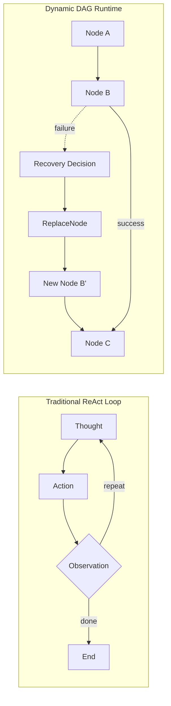
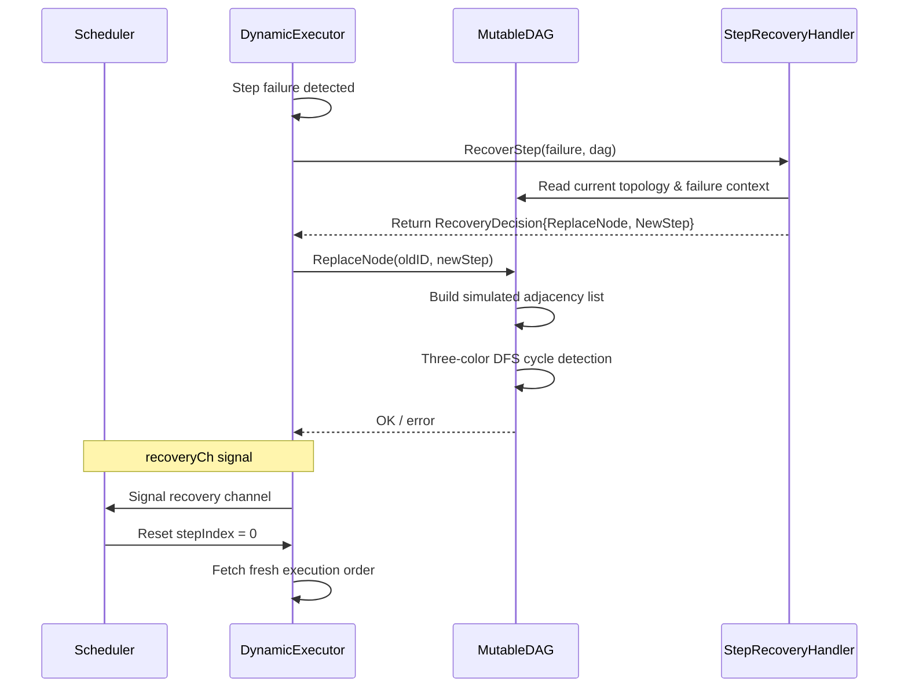
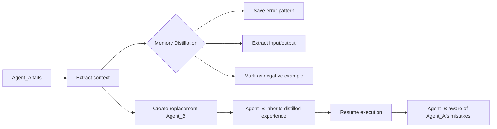

# ares Architecture Deep Dive (4): Workflow Engine -- From DAG to Dynamic Orchestration

> I used to hardcode workflows. If step 1 finishes, run step 2. If step 2 finishes, run step 3.
> Then requirements changed. Logic got tangled. Code turned into spaghetti.
> I thought: **workflows shouldn't be hardcoded. They should be like LEGO — snap together, pull apart, swap pieces at runtime.**
> That's why ares has two workflow systems. Yes, two. I built one, found it wasn't enough, then built another.

## Why Two?

Let me explain the backstory. I started with one — the config-driven Workflow Engine. The idea was simple: define task dependencies in YAML, the engine auto-resolves the topological order, parallelizes independent tasks, handles retries and timeouts. Sounded perfect.

But after using it for a while, I hit a wall: **config-driven isn't flexible enough**. Sometimes I need to add or remove nodes dynamically in code, branch based on conditions, mutate the topology at runtime. YAML files can't do that.

So I built a second system — the Graph System. This time with a Fluent Builder API, so you construct workflow graphs directly in Go code. Conditional edges, pluggable schedulers, runtime topology changes — all there.

Now the project carries two workflow systems:

1. **Workflow Engine** (`internal/workflow/engine/`) — config-driven DAG, strongly typed, hot-reloadable, Human-in-the-Loop. For ops folks who want to define workflows in YAML.
2. **Graph System** (`internal/workflow/graph/`) — code-driven graph orchestration, Fluent Builder, conditional edges, pluggable schedulers. For developers who want maximum flexibility.

They coexist, serving different users. Codebase doubled, but I avoided the "one-size-fits-all" compromise. Was it worth it? I think so.

---

## 1. The Workflow Engine: Configuration-Driven Orchestration

### 1.1 Core Data Model

The foundational types are defined in `internal/workflow/engine/types.go`. The system models workflows as a collection of `Step` instances, each with explicit dependency declarations:

```go
type Step struct {
    ID          string            `json:"id"`
    Name        string            `json:"name"`
    AgentType   string            `json:"agent_type"`
    Input       string            `json:"input"`
    DependsOn   []string          `json:"depends_on"`
    Timeout     time.Duration     `json:"timeout"`
    RetryPolicy *RetryPolicy      `json:"retry_policy,omitempty"`
    Interrupt   *InterruptConfig  `json:"interrupt,omitempty"`
    Status      StepStatus        `json:"status"`
    Output      string            `json:"output,omitempty"`
    Error       string            `json:"error,omitempty"`
    StartedAt   time.Time         `json:"started_at,omitempty"`
    FinishedAt  time.Time         `json:"finished_at,omitempty"`
    Metadata    map[string]string `json:"metadata,omitempty"`
}
```

Each step declares its dependencies through `DependsOn`, a string slice of upstream step IDs. This design achieves **Inversion of Control**: steps do not call each other; they declare what they need, and the engine resolves execution order. The `AgentType` field connects each step to a registered agent factory through the `AgentRegistry`, enabling polymorphic step execution without coupling to specific agent implementations.

The `Workflow` type aggregates steps along with metadata:

```go
type Workflow struct {
    ID          string            `json:"id"`
    Name        string            `json:"name"`
    Version     string            `json:"version"`
    Description string            `json:"description"`
    Steps       []*Step           `json:"steps"`
    Variables   map[string]string `json:"variables,omitempty"`
    Metadata    map[string]string `json:"metadata,omitempty"`
    CreatedAt   time.Time         `json:"created_at"`
    UpdatedAt   time.Time         `json:"updated_at"`
}
```

### 1.2 DAG Construction and Cycle Detection

The `DAG` type in `types.go` converts flat step lists into a navigable graph structure:

```go
type DAG struct {
    Nodes map[string]*DAGNode
    Edges map[string][]string
}

type DAGNode struct {
    StepID    string
    InDegree  int
    OutDegree int
}
```

Construction via `NewDAG(steps []*Step)` performs the following in sequence:

1. **Node Registration**: Iterates over all steps and inserts nodes. Critically, it enforces the invariant that step IDs are unique -- a fix (labeled "H4 fix" in the source) replaced silent overwriting with an explicit error return:
   ```go
   if _, exists := dag.Nodes[step.ID]; exists {
       return nil, fmt.Errorf("duplicate step ID %q: %w", step.ID, ErrDuplicateID)
   }
   ```

2. **Edge Construction**: For each step, every `DependsOn` entry is validated as an existing node. If a dependency references a nonexistent step, `ErrInvalidDependency` is returned immediately.

3. **Cycle Detection**: The private `hasCycle()` method runs a DFS-based cycle detection using a recursion stack:
   ```go
   func (d *DAG) hasCycle() bool {
       visited := make(map[string]bool)
       recStack := make(map[string]bool)
       // ... standard DFS cycle detection
   }
   ```

4. **Topological Sort**: `GetExecutionOrder()` implements Kahn's algorithm (BFS-based in-degree removal). This produces a linear ordering that respects all dependency constraints while identifying parallelizable steps (nodes at the same topological level).

### 1.3 The Retry Policy

The `RetryPolicy` type (`types.go`) provides configurable retry behavior per step:

```go
type RetryPolicy struct {
    MaxAttempts       int           `json:"max_attempts"`
    InitialDelay      time.Duration `json:"initial_delay"`
    MaxDelay          time.Duration `json:"max_delay"`
    BackoffMultiplier float64       `json:"backoff_multiplier"`
}
```

The retry logic in `executor.go` (`executeWithRetry`) uses exponential backoff:

```go
delay := initialDelay
for attempt := 1; attempt <= maxAttempts; attempt++ {
    output, err := e.executeSingle(ctx, step, input)
    if err == nil {
        return output, nil
    }
    lastErr = err
    if attempt < maxAttempts {
        select {
        case <-ctx.Done():
            return "", ctx.Err()
        case <-time.After(delay):
        }
        delay = time.Duration(float64(delay) * step.RetryPolicy.BackoffMultiplier)
        if delay > step.RetryPolicy.MaxDelay {
            delay = step.RetryPolicy.MaxDelay
        }
    }
}
```

A noteworthy fix (labeled "M5 fix") clamps `MaxAttempts` to a minimum of 1, preventing a `MaxAttempts=0` configuration from silently skipping execution entirely.

### 1.4 Template Variable Resolution

Steps can reference outputs from other steps using `{{.step_id}}` template syntax. The `replaceTemplateVariables` method in `executor.go` performs string-based substitution:

```go
func (e *Executor) replaceTemplateVariables(input, initialInput string, completed map[string]bool, outputStore *OutputStore) string {
    result := input
    result = strings.ReplaceAll(result, "{{.input}}", initialInput)
    for stepID := range completed {
        if output, exists := outputStore.Get(stepID); exists {
            replacements[fmt.Sprintf("{{.%s}}", stepID)] = output.Output
        }
    }
    for template, value := range replacements {
        result = strings.ReplaceAll(result, template, value)
    }
    return result
}
```

This design is intentionally simple: it uses `strings.ReplaceAll` rather than a full template engine (like Go's `text/template`). The tradeoff is reduced expressiveness in exchange for zero runtime dependencies and predictable O(n*m) behavior.

---

## 2. Parallel Execution Model

### 2.1 The Executor Architecture

The `Executor` (`executor.go`) manages workflow execution. Its `Execute` method orchestrates the entire lifecycle:

1. **DAG Construction**: Builds a `DAG` from workflow steps and computes topological order.
2. **Execution Initialization**: Creates a `WorkflowExecution` with step states and an execution-scoped `OutputStore`.
3. **Concurrent Step Execution**: Launches `runSteps` as a goroutine managed by an `errgroup`, while the main goroutine collects results from channels.

The concurrency model uses three key primitives:

- **`errgroup`**: Manages the lifecycle of the `runSteps` goroutine, propagating cancellation.
- **`sem chan struct{}`**: A buffered channel acting as a semaphore, limiting concurrent step execution to `maxParallel` (default 10).
- **`stepDone chan struct{}`**: A notification channel used to signal the scheduler when any step completes, enabling dependency re-checking without false deadlock detection.

### 2.2 The Scheduling Loop

The `runSteps` method in `executor.go` implements a non-blocking scheduling loop:

```go
for stepIndex < len(executionOrder) {
    stepID := executionOrder[stepIndex]
    step := e.findStep(workflow.Steps, stepID)

    mu.Lock()
    canExec := e.canExecute(step, completed)
    alreadyProcessed := processed[stepID]
    mu.Unlock()

    if !canExec {
        if alreadyProcessed {
            stepIndex++
            continue
        }
        // Wait for any step to complete via stepDone channel
        // with a 5-second deadlock detection timeout
        ...
    }

    sem <- struct{}{}  // Acquire semaphore slot
    stepIndex++

    wg.Add(1)
    go func() {
        defer func() { <-sem; wg.Done() }()
        result := e.executeStep(...)
        resultChan <- result
    }()
}
```

The `canExecute` function is a simple dependency check:

```go
func (e *Executor) canExecute(step *Step, completed map[string]bool) bool {
    for _, dep := range step.DependsOn {
        if !completed[dep] {
            return false
        }
    }
    return true
}
```

This loop design addresses a subtle concurrency challenge: when a step cannot execute because its dependencies are not yet met, the loop must not spin-wait. Instead, it waits on `stepDone` with a timeout. The "H3 fix" replaced the original `wg.Wait()` call (which blocks until ALL goroutines finish) with `stepDone` channel signaling, preventing a race condition between `stepEg.Go()` calls and `stepEg.Wait()` checks.

### 2.3 Deadlock Detection

A 5-second timeout on the `stepDone` channel acts as a deadlock detector. If no goroutine completes within 5 seconds while a step is waiting for dependencies, the workflow is aborted with a `"workflow deadlock detected"` error. This is a pragmatic compromise between responsiveness and false positives.

---

## 3. Human-in-the-Loop (HITL)

### 3.1 Interrupt Architecture

HITL is supported through the types defined in `internal/workflow/engine/hitl.go`:

```go
type InterruptPoint struct {
    StepID  string         `json:"step_id"`
    Message string         `json:"message"`
    Payload map[string]any `json:"payload,omitempty"`
}

type InterruptResult struct {
    Approved bool           `json:"approved"`
    Feedback string         `json:"feedback,omitempty"`
    Data     map[string]any `json:"data,omitempty"`
}

type InterruptHandler func(ctx context.Context, point *InterruptPoint) (*InterruptResult, error)
```

The `InterruptHandler` is a function type that blocks until a human provides input. This clean abstraction allows different frontends (CLI, WebSocket, REST API) to provide their own handler implementation.

### 3.2 Crash Recovery with InterruptStore

The `InterruptStore` interface provides persistence for interrupt state:

```go
type InterruptStore interface {
    Save(ctx context.Context, executionID string, point *InterruptPoint) error
    Load(ctx context.Context, executionID string, stepID string) (*InterruptResult, error)
    Delete(ctx context.Context, executionID string, stepID string) error
    ListPending(ctx context.Context, executionID string) ([]*InterruptPoint, error)
    SaveResult(ctx context.Context, executionID string, stepID string, result *InterruptResult) error
}
```

The `MemoryInterruptStore` is provided as an in-memory implementation with full RWMutex protection. Production deployments can implement this interface with a database backend to survive process crashes.

The HITL flow in the `Executor` works as follows:

1. **Check**: `handleInterrupt` checks if a step has `InterruptConfig` set.
2. **Save**: The interrupt point is persisted via `InterruptStore.Save`.
3. **Block**: The `InterruptHandler` is called and blocks for human input.
4. **Decide**: If rejected, the step is marked `Skipped`. If approved, the step proceeds.
5. **Cleanup**: The interrupt state is deleted from the store after resolution.

---

## 4. Configuration Loading and Hot Reload

### 4.1 Multi-Format File Loading

The loader architecture (`internal/workflow/engine/loader.go`) supports both JSON and YAML through a `Decoder` interface:

```go
type WorkflowLoader interface {
    Load(ctx context.Context, source string) (*Workflow, error)
}

type Decoder interface {
    Decode(data []byte, v interface{}) error
}

type JSONDecoder struct{}
type YAMLDecoder struct{}
```

The `FileLoader` wraps a decoder with path validation:

```go
type FileLoader struct {
    decoder    Decoder
    allowedDir string
}
```

The `WithAllowedDir` option enforces that workflow files must reside within a specified directory, providing a basic security boundary against path traversal attacks.

The `DirectoryLoader` iterates over directory entries, loads all valid JSON/YAML files, and returns a map of workflow ID to `*Workflow`. Duplicate IDs across files are detected and rejected.

### 4.2 Hot Reload with FileWatcher

The `FileWatcher` (`internal/workflow/engine/reloader.go`) provides hot reloading with a dual strategy:

1. **Event-driven (primary)**: Uses `fsnotify` to receive real-time file change events. If initialization fails (e.g., on systems without `inotify`), it logs a warning and falls back to polling.

2. **Polling (fallback)**: Periodically scans the directory every 5 seconds, comparing file modification times against the cached workflow `UpdatedAt` timestamps.

The `scanAndLoad` method uses a compare-and-swap pattern protected by a mutex to prevent TOCTOU (Time-of-Check-Time-of-Use) races:

```go
// M6 fix: hold Lock across the entire compare-and-swap cycle
w.mu.Lock()
// compare-and-swap
w.mu.Unlock()
```

The `WorkflowReloader` aggregates the watcher with callback management:

```go
type WorkflowReloader struct {
    loader    WorkflowLoader
    workflows map[string]*Workflow
    callbacks map[string]ReloadCallback
    watcher   *FileWatcher
    // ...
}
```

Callbacks receive a deep copy of the workflows map to prevent mutation of internal state by external code (marked as "M7 fix").

---

## 5. Dynamic Execution: Runtime DAG Mutation

### 5.1 The MutableDAG

The `MutableDAG` (`internal/workflow/engine/mutable_dag.go`) extends the base `DAG` with thread-safe mutation operations:

```go
type MutableDAG struct {
    mu      sync.RWMutex
    dag     *DAG
    steps   map[string]*Step
    version uint64
    hub     *GraphEventHub
}
```

Key operations:

- **`AddNode`**: Validates dependencies, performs incremental cycle detection via `wouldCreateCycle`, and supports atomic rollback on failure.
- **`RemoveNode`**: Checks for dependent nodes before removal to prevent orphaned references.
- **`AddEdge` / `RemoveEdge`**: Fine-grained edge operations with cycle detection.

Each mutation increments a `version` counter, enabling consumers to detect changes without polling.

### 5.2 Incremental Cycle Detection

The `wouldCreateCycle` method performs BFS from the target node:

```go
func (m *MutableDAG) wouldCreateCycle(from, to string) bool {
    visited := make(map[string]bool)
    queue := []string{to}
    for len(queue) > 0 {
        current := queue[0]
        queue = queue[1:]
        if current == from { return true }
        if visited[current] { continue }
        visited[current] = true
        for _, neighbor := range m.dag.Edges[current] {
            if !visited[neighbor] { queue = append(queue, neighbor) }
        }
    }
    return false
}
```

Rather than re-running full topological sort on every mutation, this incremental check runs in O(V+E) per operation -- acceptable for graphs under the `DefaultMaxWorkflowSize` of 100 nodes.

### 5.3 Snapshot Isolation

The `SnapshotWithSteps` method provides atomic read isolation under a single read lock:

```go
func (m *MutableDAG) SnapshotWithSteps() (*DAG, map[string]*Step) {
    m.mu.RLock()
    defer m.mu.RUnlock()
    dagCopy := m.snapshotDAGLocked()
    stepsCopy := make(map[string]*Step, len(m.steps))
    for id, step := range m.steps { stepsCopy[id] = step }
    return dagCopy, stepsCopy
}
```

The DAG topology is deep-copied, while step references are shallow-copied (same `*Step` pointers). This design acknowledges that step mutations are infrequent compared to topology queries.

### 5.4 The DynamicExecutor

The `DynamicExecutor` (`internal/workflow/engine/dynamic_executor.go`) extends the base `Executor` with mid-execution mutation support:

```go
type DynamicExecutor struct {
    *Executor
    applyMode   ApplyMode
    hitlHandler InterruptHandler
    hitlStore   InterruptStore
}

type ApplyMode int

const (
    ApplyAtCheckpoint ApplyMode = iota  // recompute after each step completes
    ApplyImmediate                       // recompute before each step starts
)
```

Two application modes provide different tradeoffs:

- **`ApplyAtCheckpoint`**: The execution order is recomputed only after a step completes. This minimizes version checks but defers mutation visibility.
- **`ApplyImmediate`**: The execution order is checked before each step, ensuring mutations are visible as soon as possible.

The `recomputeOrder` method checks the DAG version and appends new steps to the current order:

```go
func (e *DynamicExecutor) recomputeOrder(
    mutableDAG *MutableDAG,
    lastVersion *uint64,
    currentOrder *[]string,
    ...
) {
    mu.Lock()
    defer mu.Unlock()
    currentVersion := mutableDAG.Version()
    if *lastVersion == currentVersion { return }
    newOrder, err := mutableDAG.GetExecutionOrder()
    // ...
    for _, id := range newOrder {
        if !existing[id] {
            *currentOrder = append(*currentOrder, id)
        }
    }
}
```

The "M9 fix" ensures that `recomputeOrder` holds the mutex across the entire version-check-and-update operation, preventing concurrent calls from both detecting the same version change and appending duplicate steps.

### 5.5 Graph Event Hub

The `GraphEventHub` (`internal/workflow/engine/graph_events.go`) implements a publish-subscribe pattern for graph mutation events:

```go
type GraphEventHub struct {
    mu          sync.RWMutex
    subscribers map[string]chan GraphEvent
    nextID      int
}
```

Events are published non-blockingly -- if a subscriber's channel buffer (64 events) is full, events are dropped for that subscriber. This "best-effort" delivery is intentional: event consumers (such as monitoring dashboards) should tolerate message loss without affecting execution correctness.

### 5.6 ReplaceNode: Atomic Edge Migration

`ReplaceNode` is the core mutation primitive that enables mid-execution step substitution. Defined in `internal/workflow/engine/mutable_dag.go`:

```go
func (m *MutableDAG) ReplaceNode(oldID string, newStep *Step) error {
    m.mu.Lock()
    defer m.mu.Unlock()

    if _, exists := m.steps[oldID]; !exists {
        return fmt.Errorf("node %q not found: %w", oldID, ErrNodeNotFound)
    }
    if newStep.ID != oldID {
        if _, exists := m.steps[newStep.ID]; exists {
            return fmt.Errorf("new node ID %q already exists: %w", newStep.ID, ErrDuplicateID)
        }
    }
    // Build simulated adjacency list for pre-mutation cycle validation
    adjList := make(map[string][]string)
    for id, step := range m.steps {
        if id != oldID { adjList[id] = step.DependsOn }
    }
    adjList[newStep.ID] = newStep.DependsOn
    for id, deps := range adjList {
        for i, dep := range deps {
            if dep == oldID { adjList[id][i] = newStep.ID }
        }
    }
    if m.hasCycleInAdjList(adjList) {
        return fmt.Errorf("replacement would create a cycle: %w", ErrCycleDetected)
    }
    // Perform the atomic replacement
    delete(m.steps, oldID)
    m.steps[newStep.ID] = newStep
    m.recalculateDegrees()
    m.version++
    m.hub.Publish(GraphEvent{
        Change: GraphChange{
            Type:     ChangeReplaceNode,
            NodeID:   newStep.ID,
            OldNodeID: oldID,
            Step:     newStep,
            Timestamp: time.Now(),
        },
    })
    return nil
}
```

**Two scenarios:**

| Scenario | oldID == newStep.ID | Behavior |
|----------|---------------------|----------|
| **Same-ID update** | Yes | In-place replacement. Edges preserved via `recalculateDegrees()`. No simulated remapping needed. |
| **Different-ID migration** | No | Complete edge migration. Old node's edges are atomically transferred to the new node. |

**Cycle detection via simulated adjacency list:** Before any mutation, `ReplaceNode` constructs an adjacency list that mirrors the *post-replacement* topology — the old node's edges are remapped to the new node. The three-color DFS (`hasCycleInAdjList`) runs on this simulated graph:

```go
func (m *MutableDAG) hasCycleInAdjList(adjList map[string][]string) bool {
    const (white, gray, black = 0, 1, 2)
    color := make(map[string]int)
    for node := range adjList { color[node] = white }
    var dfs func(node string) bool
    dfs = func(node string) bool {
        color[node] = gray
        for _, neighbor := range adjList[node] {
            switch color[neighbor] {
            case gray:  return true
            case white: if dfs(neighbor) { return true }
            }
        }
        color[node] = black
        return false
    }
    for node := range adjList {
        if color[node] == white && dfs(node) { return true }
    }
    return false
}
```

If a cycle is detected, the operation is rejected *before any real mutation occurs*. After a successful replacement, `recalculateDegrees()` rebuilds in-degree/out-degree from scratch, and a `ChangeReplaceNode` event is published to the `GraphEventHub`.

### 5.7 Node-Level Recovery: From ReAct to Dynamic Runtime

The traditional ReAct pattern is a tight loop: Thought → Action → Observation → (repeat). It works for simple agents, but fails at three things:

1. **Brittle linearity** -- one failed step derails the entire chain with no escape hatch
2. **Fixed topology** -- the loop structure is hardcoded, can't re-route around failures
3. **Stateless recovery** -- a replacement agent starts from zero with no memory of what went wrong

ares replaces this with a **Dynamic DAG Runtime**:



#### 5.7.1 Step Failure Abstraction

Types in `internal/workflow/engine/types.go`:

```go
type RecoveryStrategy int

const (
    RecoveryRetry       RecoveryStrategy = iota
    RecoveryReplaceNode
    RecoveryFailFast
)

type RecoveryPolicy struct {
    MaxRetries int
    RetryDelay time.Duration
}

type StepFailure struct {
    StepID    string
    StepName  string
    Error     string
    Input     string
    Output    string
    Attempts  int
    ExecTime  time.Duration
}

type RecoveryDecision struct {
    Strategy RecoveryStrategy
    NewStep  *Step   // used only for RecoveryReplaceNode
    Delay    time.Duration
    Reason   string
}

type StepRecoveryHandler interface {
    RecoverStep(ctx context.Context, failure StepFailure, dag *MutableDAG) (*RecoveryDecision, error)
}
```

| Strategy | When | Effect |
|----------|------|--------|
| `RecoveryRetry` | Transient errors (network timeout, rate-limit) | Re-execute the same step after delay |
| `RecoveryReplaceNode` | Semantic failure (wrong LLM output, logic error) | Swap the failed step via `ReplaceNode` |
| `RecoveryFailFast` | Fatal errors (invalid config, auth failure) | Propagate error up, abort workflow |

#### 5.7.2 RecoveryReplaceNode Flow

The `DynamicExecutor` integrates recovery via the `handleStepFailure` method:



Key implementation details:

- **`handleStepFailure`** checks if a `StepRecoveryHandler` is configured and the step still exists in the DAG (not already replaced by a concurrent recovery)
- **`recoveryCh`** is a dedicated channel that wakes the scheduler loop, which then resets `stepIndex = 0` and re-fetches the full execution order via `GetExecutionOrder()`
- **5-round cap**: The `processed` map prevents infinite recovery loops — each step ID can be recovered at most once (with 5 total recovery rounds as a safety limit)
- **`recomputeOrder` now replaces the entire order**: Instead of appending new steps, it re-fetches the full topological sort from `GetExecutionOrder()`, critical for ensuring the replacement node is correctly positioned before downstream steps

#### 5.7.3 Memory Distillation Integration

When `RecoveryReplaceNode` fires, the failed node's execution record is fed into the Memory/Distillation system:



The `WithRecoveryEventSink` option on `DynamicExecutor` connects recovery events to the distillation pipeline. This is what the user calls "秽土转生" (Edo Tensei / reincarnation from impure soil):

> "如果你的 Agent 挂了……Runtime Manager 能够带着刚才的认知记忆，瞬间在 DAG 图上秽土转生"

---

## 6. The Agent Registry and Output Store

### 6.1 Agent Registry

The `AgentRegistry` (`internal/workflow/engine/registry.go`) provides type-based agent lookup via a factory pattern:

```go
type AgentFactory func(ctx context.Context, config interface{}) (base.Agent, error)

type AgentRegistry struct {
    factories map[string]AgentFactory
    mu        sync.RWMutex
}
```

The `AgentExecutor` bridges the registry with step execution:

```go
func (e *AgentExecutor) Execute(ctx context.Context, step *Step, input string, taskCtx *models.TaskContext) (string, error) {
    agent, err := e.registry.CreateAgent(ctx, step.AgentType, step.Input)
    result, err := agent.Process(ctx, input)
    // ...
}
```

This indirection enables the workflow engine to remain completely agnostic about what agents do -- it only needs a string identifier to dispatch execution.

### 6.2 OutputStore Isolation

Each execution creates a fresh `OutputStore` instance. This is critical for thread safety: if multiple workflows execute concurrently, their output stores are fully isolated. The `OutputStore` provides fine-grained read access with `GetMultiple`:

```go
func (s *OutputStore) GetMultiple(stepIDs []string) map[string]*StepOutput {
    s.mu.RLock()
    defer s.mu.RUnlock()
    result := make(map[string]*StepOutput, len(stepIDs))
    for _, id := range stepIDs {
        if output, exists := s.outputs[id]; exists {
            result[id] = output
        }
    }
    return result
}
```

---

## 7. The Graph System: Programmatic Orchestration

While the Workflow Engine focuses on config-driven execution, the Graph System (`internal/workflow/graph/`) provides a code-first approach with more flexible scheduling.

### 7.1 Core Types

The `Graph` (`internal/workflow/graph/graph.go`) is constructed through a fluent builder API:

```go
type Graph struct {
    id        string
    nodes     map[string]Node
    edges     map[string][]*Edge
    start     string
    scheduler Scheduler
    tracer    observability.Tracer
    limiter   ratelimit.Limiter
}

type Edge struct {
    from string
    to   string
    cond Condition
}
```

Constructor panics on invalid input (empty ID, nil tracer) -- a deliberate design choice documented as "fatal startup failures that should prevent application launch."

### 7.2 Node Types

Three node types are available (`internal/workflow/graph/node.go`):

| Type | Wraps | Use Case |
|------|-------|----------|
| `AgentNode` | `base.Agent` | AI agent tasks |
| `ToolNode` | `core.Tool` | Tool execution |
| `FuncNode` | `func(context.Context, *State) error` | Custom logic |

All three implement the `Node` interface:

```go
type Node interface {
    Execute(ctx context.Context, state *State) error
    ID() string
}
```

### 7.3 Conditional Edges

Edges can carry a `Condition` predicate:

```go
type Condition func(state *State) bool

func IfFunc(fn func(state *State) bool) Condition { return fn }
```

During execution, only edges with satisfied conditions (or no condition) are traversed. The `hasAnySatisfiedEdge` function ensures correct handling: a node with multiple incoming conditional edges is enqueued as soon as at least one condition is satisfied and all structural dependencies are met. This prevents two classes of bugs: "silent node loss" (a node not executed when it should be) and "ghost execution" (a node executed when no path to it should have been taken).

### 7.4 Pluggable Schedulers

Three schedulers are provided (`internal/workflow/graph/scheduler.go`):

```go
type Scheduler interface {
    Select(ready []string) string
}
```

| Scheduler | Selection Strategy | Use Case |
|-----------|-------------------|----------|
| `DefaultScheduler` | FIFO (first-in-first-out) | Simple, predictable ordering |
| `PriorityScheduler` | Highest priority first | Critical-path prioritization |
| `ShortJobScheduler` | Shortest estimated time first | Throughput optimization |

The `ShortJobScheduler` uses a reasonable default estimate of 1000ms for unknown nodes, ensuring they are still schedulable while preferring known short jobs.

### 7.5 BFS Execution with In-Degree Tracking

The `Execute` method (`internal/workflow/graph/executor.go`) implements single-threaded BFS execution:

```go
// Build in-degree map
inDegree := make(map[string]int, len(g.nodes))
for _, edges := range g.edges {
    for _, edge := range edges { inDegree[edge.to]++ }
}

// Seed ready queue with nodes having no predecessors
readyQueue := make([]string, 0)
for id, deg := range inDegree {
    if deg == 0 { readyQueue = append(readyQueue, id) }
}

// BFS execution loop
for len(readyQueue) > 0 {
    nodeID := g.scheduler.Select(readyQueue)
    // ... execute node ...
    for _, edge := range g.edges[nodeID] {
        inDegree[edge.to]--
        if inDegree[edge.to] == 0 && !executed[edge.to] && !readySet[edge.to] {
            if hasAnySatisfiedEdge(g, edge.to, state) {
                readyQueue = append(readyQueue, edge.to)
                readySet[edge.to] = true
            }
        }
    }
}
```

Key characteristics:
- **Single-threaded**: No goroutines or mutexes needed for shared state.
- **Deterministic execution**: Given the same scheduler and graph, execution is reproducible.
- **Observability**: Integrated with `observability.Tracer` for agent step recording and error tracking.
- **Rate limiting**: Optional `ratelimit.Limiter` integration for execution throttling.

The "C7 fix" ensures correct in-degree decrement semantics for conditional edges, preventing silent node loss when a node has multiple predecessors with mixed conditional edges.

---

## 8. Comparative Analysis: Workflow Engine vs. Graph System

| Aspect | Workflow Engine | Graph System |
|--------|----------------|--------------|
| **Configuration** | YAML/JSON files | Code (Fluent Builder API) |
| **Execution Model** | Parallel (errgroup + semaphore) | Single-threaded BFS |
| **Concurrency** | Concurrent steps up to `maxParallel` | Sequential node execution |
| **Dependency** | Declarative `DependsOn` | Programmatic edges with conditions |
| **Scheduling** | Topological order (fixed) | Pluggable (FIFO, Priority, SJF) |
| **HITL** | Native (InterruptHandler + InterruptStore) | Not supported |
| **Retry** | Native (exponential backoff) | Not supported |
| **Hot Reload** | Native (fsnotify + polling) | Not supported |
| **Runtime Mutation** | MutableDAG.ReplaceNode + DynamicExecutor | Not supported |
| **Recovery** | RecoveryReplaceNode + StepRecoveryHandler + Memory Distillation | Not supported |
| **Template Variables** | `{{.input}}` + `{{.step_id}}` | Not supported |
| **State Passing** | OutputStore (key-value) | State (key-value) |
| **Observability** | Basic logging | Integrated tracer |
| **Primary Use Case** | Production workflows, HITL workflows, config-driven pipelines | In-code orchestration, conditional branching, custom scheduling |

### 8.1 When to Use Each

**Choose the Workflow Engine when:**
- Workflows need to be defined or modified without recompilation
- Human approval is required at specific steps
- Steps need automatic retry with backoff
- Workflow files need hot reloading
- Maximum parallelism is desired

**Choose the Graph System when:**
- Workflow topology is constructed programmatically
- Conditional branching based on runtime state is needed
- Custom scheduling strategies are required
- Observability tracing is desired
- Simplicity and determinism are priorities

---

## 9. Design Patterns and Tradeoffs

### 9.1 Panic-on-Invalid-Parameter in Fluent Builders

The Graph System's builder methods (`Node()`, `Edge()`, `Start()`, `SetScheduler()`) panic on nil receivers and invalid parameters. This is documented as intentional: "invalid parameters represent fatal startup failures that should prevent application launch." This follows the principle that initialization-time errors should fail fast and loudly, while runtime errors should return errors gracefully.

### 9.2 errgroup + Semaphore for Concurrency

The Workflow Engine uses `errgroup` for lifecycle management (first error cancels the group) and a buffered channel semaphore for concurrency limiting. This pattern:
- Ensures that a single step failure cancels the entire workflow promptly
- Prevents unlimited goroutine creation
- Maintains bounded resource usage (default 10 concurrent steps)

### 9.3 Versioned Mutability

The `MutableDAG.version` counter enables lock-free change detection. Consumers can cache the last seen version and only recompute when a mutation occurs. This is more efficient than periodic polling or requiring consumers to subscribe to events.

### 9.4 Mediator Pattern (GraphEventHub)

The `GraphEventHub` decouples graph mutations from their consumers. By publishing typed events, it allows multiple independent subscribers (monitoring, logging, triggers) without the graph object knowing about them.

### 9.5 OutputStore Isolation

Each execution gets its own `OutputStore`, preventing data races between concurrent executions. This per-execution isolation is a form of **Scoped Instance** pattern from the Dependency Injection world.

### 9.6 Layered Architecture

The codebase follows a clean layered architecture:

```
Workflow Files (YAML/JSON) -> Loader -> Workflow -> DAG -> Executor -> Result
                                                                    |
                                                              [AgentRegistry]
```

Each layer has a single responsibility: loading, parsing, graph construction, execution orchestration, and agent dispatch.

---

## 10. Honest Reflections — The Price of Breaking Paradigms

This section isn't about bugs. It's about design choices I've been wrestling with. I'm not here to tell you what's right — honestly, I'm not even sure I got it right. I just want to share some thought processes that might be useful if you're building a workflow system too.

If you see things differently, I'd love to hear it. I'm genuinely curious how others approach these problems.

### 10.1 One workflow engine or two?

Here's a problem I've been wrestling with.

I started out wanting to build one universal workflow engine — one solution for everything. But as I got deeper into it, I realized that workflow usage patterns are fundamentally different. Some people want to write a few lines of YAML and be done with a flow. Others need precise programmatic control over every step. Try to serve both with a single abstraction, and you end up satisfying neither.

So I split it into two: a config-driven Workflow Engine (YAML/JSON) and a code-driven Graph System (Fluent Builder). Each does one thing well.

The cost is obvious: two codebases, two docs, two learning curves. And I'm just one person — I have to write and maintain both. Sometimes I wonder: if I'd picked one path from the start, would I have saved half the effort? I still don't have a clear answer to that.

### 10.2 Static topology or let it evolve?

In most workflow systems, topology is set in stone at definition time. If a step fails, the whole thing rolls back or retries. Simple, predictable.

But in LLM Agent scenarios, the workflow path is fundamentally unknowable at definition time — the model's output determines what happens next, and model outputs are inherently dynamic. Working with static topology in this context means pre-drawing every possible path, which is basically a giant state machine. More work than just writing the code.

So I built MutableDAG — the topology can change during execution. Add nodes, replace nodes, attach Recovery Handlers, all without stopping the workflow.

The catch: you can no longer assume the DAG is immutable. Every operation needs concurrency safety, cycle detection, version locks. ReplaceNode's three-color DFS looks elegant in a textbook, but in practice it only catches what the graph structure can express. If your application logic misses an edge, no graph algorithm will save you. It's a reliable primitive, not a safety net.

### 10.3 Do you always need to retry everything?

Most workflow systems handle failure by retrying the whole thing. Maybe with exponential backoff, maybe you tweak the retry count.

I've never been comfortable with this. An LLM call returns malformed JSON — why roll back the entire Workflow? Why not just swap in a different model and retry that one node?

I borrowed this idea from operating systems, not workflow systems. In a microkernel, when a service crashes, you restart that service, not the whole kernel. Same logic should apply here.

So I built node-level RecoveryReplaceNode: replace only the failed node, preserve everything else. I even tried piping the failed node's context through distillation and injecting the result into the replacement node as structured experience.

That said, I'm not confident this is production-ready yet. It needs full execution context tracking — which nodes ran, what they output, who they depended on. The recovery strategy engine is v0.1 (the 5-round cap was a gut feel number). The distillation pipeline is basic: push errors into EventSink, hope something useful comes out. The direction feels right, but the engineering has catching up to do.

### 10.4 What does it mean to wait for a human?

The typical approach to Human-in-the-Loop is: pause the workflow, wait for human input, resume. The human is a synchronous blocking gate in the pipeline.

I've been thinking about whether HITL can just be a regular node on the workflow graph. It pauses execution, waits for an async event (someone types something), then continues downstream. The scheduler is never blocked, no goroutine is held, no resources consumed while waiting.

This naturally supports "go do other things while waiting for someone to respond." The downside: no approval chains, no timeout auto-escalation, no multi-person decision-making. These are table stakes for production HITL, and I don't have them yet.

I'm OK with this tradeoff for now — at least HITL doesn't become a system bottleneck. But if your use case needs complex approval workflows, this probably isn't enough.

### 10.5 Do you need to restart for a config change?

The standard playbook: change config → send signal → restart process. Simple, reliable, but your service goes down.

I went with runtime hot reload instead — atomic swap of the entire Workflow map on file change, no restart, no dropped requests. The implementation is straightforward: fsnotify watcher, compare-and-swap under lock, deep-copy callbacks.

What caught me off guard was the cross-platform gap. inotify (Linux) and kqueue (macOS) don't behave the same way. On macOS, some file events simply never fire. I ended up adding a polling fallback (5-second interval) to guarantee availability, but it's too slow for some scenarios.

This made me question whether "no restart" was worth the complexity. If your SLA allows a few seconds of downtime, restarting is probably the simpler, better choice. It's not a technical decision — it's an SLA decision.

---

These are the choices I keep revisiting. I'm writing them down not because I think they're right, but because the thinking process itself might be useful to someone facing similar problems.

If you've dealt with any of these in your own system, I'd love to hear how you handled them. I'm still figuring this out.

## 11. Default Configuration Constants

The constants in `internal/workflow/engine/constants.go` provide sensible defaults:

```go
const (
    DefaultMaxParallel        = 10
    DefaultStepTimeout        = 10 * time.Second
    DefaultInitialDelay       = 10 * time.Millisecond
    DefaultMaxDelay           = 100 * time.Millisecond
    DefaultRetryAttempts      = 3
    DefaultWorkflowTimeout    = 5 * time.Minute
    DefaultStepWaitDuration   = 100 * time.Millisecond
    DefaultDAGTraversalTimeout = 1 * time.Minute
    DefaultMaxWorkflowSize    = 100
    DefaultMaxDependencies    = 10
)
```

These constants establish a conservative baseline: workflows of up to 100 steps with up to 10 dependencies each, a step timeout of 10 seconds, and a workflow-level timeout of 5 minutes.

---

## 12. Summary

Two workflow systems. Double the code. Was it worth it?

I've asked myself this more than once. But every time I watch an ops person modify a YAML file and deploy a new workflow without touching Go code, or a developer spin up a complex conditional workflow in five minutes with the Fluent Builder — I know the answer.

The philosophy fits in one sentence: **Workflow Engine is for people who don't want to write code. Graph System is for people who do.**

- **Workflow Engine**: config-driven, hot-reloadable, HITL, retry-aware, node-level recovery with memory distillation. Modify a JSON file to adjust a production workflow.
- **Graph System**: Fluent Builder, conditional edges, pluggable schedulers. Compose workflows in Go code.

The concurrency model (errgroup + WaitGroup + semaphore + stepDone channels), the `ReplaceNode` atomic edge migration, and the `RecoveryReplaceNode` fault self-healing mechanism are the parts I'm most proud of.

### File Reference Index

- Core types (incl. RecoveryStrategy, StepRecoveryHandler): `internal/workflow/engine/types.go`
- Executor: `internal/workflow/engine/executor.go`
- Dynamic Executor (incl. handleStepFailure): `internal/workflow/engine/dynamic_executor.go`
- Mutable DAG (incl. ReplaceNode): `internal/workflow/engine/mutable_dag.go`
- HITL support: `internal/workflow/engine/hitl.go`
- File loading: `internal/workflow/engine/loader.go`
- Hot reload: `internal/workflow/engine/reloader.go`
- Agent registry: `internal/workflow/engine/registry.go`
- Constants: `internal/workflow/engine/constants.go`
- Graph events: `internal/workflow/engine/graph_events.go`
- Graph system core: `internal/workflow/graph/graph.go`
- Nodes: `internal/workflow/graph/node.go`
- Executor: `internal/workflow/graph/executor.go`
- Schedulers: `internal/workflow/graph/scheduler.go`
- State: `internal/workflow/graph/state.go`
