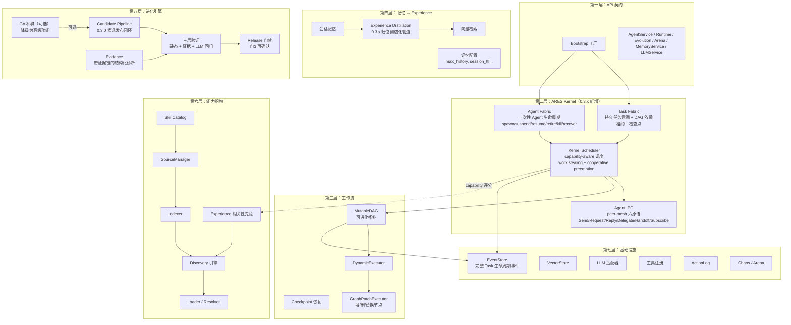

# ares 架构拆解 (I)：全局视角——为什么又一个 Agent 框架？（0.3.x）

我一开始不是要造框架。我是要解决一个问题：**Agent 老死，而且查不出原因。**

起因是一个简单的聊天机器人。一个 Leader，两个 Sub，几个工具。开发环境跑得好好的。上了生产，Leader 跑 20 分钟就不响应了。没有报错，没有 panic，没有崩溃日志。就是……沉默。

调试了三天，找到了：LLM 客户端的 goroutine 泄漏。每个请求泄漏一个 goroutine，最终打到操作系统线程上限。修复就一行代码。但找到它花了 72 小时，因为我对 Agent 在干什么**零可见**。

那一刻我意识到：问题不是"怎么让 Agent 调 LLM"，问题是"怎么让 Agent 在生产环境活下来"。

---

## 三个问题

每个 Agent 框架回答一个问题："怎么让 Agent 调 LLM？" 这是最简单的部分。难的问题是：

1. **Agent 死了怎么办？**（复活）
2. **它怎么记得之前在干什么？**（状态恢复）
3. **我怎么知道哪里出了问题？**（可观测）

ares 围绕这三个问题构建。0.3.x 的核心转变是：**不再问"怎么让 Agent 调 LLM"，而是问"怎么让 Agent 在运行时活下来"**。ARES 从"Agent 编排框架"（Leader + Sub）演进为**"面向 Agent 的动态计算运行时"**——Agents are not orchestrated. They are scheduled.

---

## 架构：七层（0.3.x）

**第一层：API 契约** — 外界看到的。只有接口，没有实现。Bootstrap 工厂把所有东西接在一起。调 `ares_bootstrap.Bootstrap()` 就得到一个完整连接的系统——Kernel、Memory、Knowledge/AKG、Evolution、Storage、Embedding、MCP、Flight Recorder、EventStore——全部从单个配置结构体组装。0.3.x 新增 `system_runtime.Orchestrator` 管理组件生命周期（Construct → Bind → Start → Ready，逆序 Stop → Wait → Close）。

**第二层：ARES Kernel（0.3.x 新增）** — 系统的心脏。替代了 0.2.x 的 Leader/Sub 运行时。三支柱 + IPC：
- **Task Fabric**（`internal/taskfabric`）：持久任务意图，持有 capability/state/lease/checkpoint。六个核心原语：Acquire / Release / Yield / Checkpoint / Steal / Preempt。所有带所有权的操作携带 fencing token（epoch），防止过期持有者的迟到操作
- **Agent Fabric**（`internal/agentfabric`）：一次性 Agent 生命周期管理。Agent 是同级认知进程（A ≡ B ≡ C），父子只有 spawn provenance，不构成权限层级。Process Tree ≠ Scheduling Graph
- **Kernel Scheduler**（`internal/kernelscheduler`）：capability-aware 调度。`score = capability_overlap × (1 - load) × confidence`。Execution Quantum 边界 yield，cooperative preemption 不做 OS 硬抢占。支持 event-driven drain（GAP 6）
- **Agent IPC**（`internal/agentipc`）：peer-mesh 消息总线，六原语 Send / Request / Reply / Delegate / Handoff / Subscribe。Context 三层分离：Task Shared / Agent Private / IPC Messages

**第三层：工作流** — 工作怎么流。MutableDAG 定义任务依赖，且拓扑本身可进化。DynamicExecutor 按拓扑序执行。**GraphPatchExecutor** 可以在运行时增删替换节点——这就是 DAG 拓扑进化的机理。Checkpoint Resume 让你在崩溃后从断点恢复。0.3.x 中 DAG 直接作为调度源——Task A completed → B ready / C ready → Scheduler，不需要 leader 分发。

**第四层：记忆 → Experience** — Agent 记住什么。0.3.x 将记忆蒸馏归位到进化管道：Trace（发生了什么）→ Experience（说明了什么）→ Memory（正式知识）。候选知识与正式知识分库存放。一条经验须 ≥2 条非失败轨迹支持才能转正。Conversation 不嵌入向量——对话历史是线性叙事，经验是网状知识。

**第五层：进化引擎** — Agent 怎么自我改进。0.3.x 主力模式：**Failure → Diagnosis → Patch → Verify**。0.3.0 候选发布闭环：Candidate → 三层验证（门1 静态 + 门2 证据 + 门3 LLM 回归）→ Release 发布门禁（门3 再确认）→ SetStable → Promoted。**候选生成容易，上线难——发布这道门禁决定进化系统的安全性。** GA 降级为可选高级功能。Evidence 不再返回标量分数，而是带证据链的结构化诊断。

**第六层：能力织物** — 框架原生的技能发现、索引和加载系统。跨层存在——运行时（Agent 需要技能）、工作流层（任务调用技能）和进化引擎（策略可优化技能选择）都会用到它。SkillCatalog 配合 SourceManager 聚合多种技能来源，五件套 catalog 工具（skill_search/load/activate/list/experience）实现 Level-0/1/2 渐进披露。Experience 模块从历史使用中学习相关性先验，常用的技能在发现结果中排名更高。

**第七层：基础设施** — 什么支撑一切。EventStore 记录一切——0.3.x 事件类型升级为完整 Task 生命周期（Created/Ready/Acquired/Started/Yielded/Checkpointed/Preempted/Released/Completed/Failed/Expired/Stolen）。VectorStore 索引记忆。LLM 适配器对接提供商。工具注册管理能力。ActionLog 记录执行事实审计。Chaos/Arena 做 Failure Injection + Recovery Verification。

### 跨层能力：SkillCatalog / Capability Fabric

0.3.x 中 Capability Fabric 的重要性上升了——它直接成为 Kernel Scheduler 的 capability-aware 评分来源（`score = capability_overlap × (1 - load) × confidence`）。这让 skill-first 设计被真正用起来。

核心是 **SkillCatalog**，通过 **SourceManager** 聚合多种技能来源——MCP 服务器、Git 仓库、本地可执行文件、HTTP 清单都是一等公民。**Indexer** 构建可搜索的技能索引，**Discovery** 引擎在运行时发现相关技能，**Loader** 解析和实例化技能，**Resolver** 处理依赖关系。**Experience** 模块从历史使用中学习相关性先验，常用的技能在发现结果中排名更高。

五件套 catalog 工具（`skill_search`/`skill_load`/`skill_activate`/`skill_list`/`skill_experience`）实现 Level-0/1/2 渐进披露：1000 个工具也不进 context，`skill_activate` 是 MCP server 的唯一连接时机。AgentLoop 引擎中的 **ToolExpander** 接口让运行时发现的技能名称可以即时解析为 LLM 工具定义，Agent 无需重启即可获取新技能。

---

## 设计原则

**1. Agent 是一次性的，Task 是持久的。**

这是最重要的原则。0.3.x 把它升级为：**Agent 死亡 ≠ Task 死亡**。Agent 不是珍稀动物——它是一个带心跳的 goroutine。如果它死了，Agent Fabric 创建一个新的，Task Fabric 从检查点恢复进度。这听起来浪费，直到你意识到这是唯一保证恢复的方式。

**坦诚反思**：我们考虑过让 Agent 长期存活、有弹性。试过熔断器、重试循环、优雅降级。有效——直到没效。问题是你无法预测每种失败模式。goroutine 泄漏、死锁、OOM kill——再多防御性编码也覆盖不了。让 Agent 一次性的意味着任何失败都可恢复，因为你总有一个全新的起点。0.3.x 的 Execution Quantum 进一步强化了这一点：每个 quantum 结束 yield，检查点已落盘，Agent 即使死了下一个 quantum 也能从检查点恢复。

**2. 记录一切，回放一切。**

每个动作——LLM 调用、工具调用、任务分配、记忆查询——都是 EventStore 里的一个事件。想知道发生了什么？回放事件。想恢复状态？回放事件。想调试？回放事件。

**3. 插件，不硬编码。**

PluginBus 让你不改核心代码就能扩展行为。检查点快照、路由决策、工具调用——全由插件处理。Runtime 不知道也不关心哪些插件是活跃的。

**4. API 层是契约，不是实现。**

`api/core/` 定义接口。`internal/` 实现它们。`api/bootstrap/` 把它们接在一起。你可以换实现而不改契约。这在你想用 mock 测试或从内存切到 PostgreSQL 时很重要。

---

## 有什么不同

大多数 Agent 框架是"LLM 编排引擎"——聚焦在 prompt 链和工具调用。ares 0.3.x 是一个 **Agent 运行时**——聚焦在让 Agent 在生产环境活下来。核心命题从"怎么编排 Agent"变成了"怎么调度 Agent"：**Agents are not orchestrated. They are scheduled.**

| 能力 | 典型框架 | ares 0.3.x |
|------|---------|------|
| Agent 生命周期 | 启动然后祈祷 | Agent Fabric：spawn → suspend → resume → retire → kill → recover；**Agent 死亡 ≠ Task 死亡** |
| 调度模型 | Leader 分发 / 中央编排 | **Agents are not orchestrated. They are scheduled.** Kernel Scheduler + capability-aware work stealing + cooperative preemption |
| 状态管理 | 内存结构体 | 事件溯源 + 检查点 + fencing token（epoch）|
| 失败处理 | try/catch | Execution Quantum + 检查点恢复 + lease 过期自动 requeue |
| 可观测 | 日志 | 日志 + 事件 + 指标 + 链路追踪 + Scheduling Observatory（决策记录）|
| 扩展性 | 继承 | 插件系统 + 能力织物（Capability Fabric），支持动态技能发现 |
| 自我改进 | 无 | 候选发布闭环：Candidate → 三层验证 → Release 门禁 → SetStable。GA 降级为可选。Evidence 带证据链而非标量分数 |
| Agent 通信 | HTTP/gRPC/消息队列 | Agent IPC peer-mesh 六原语（Send/Request/Reply/Delegate/Handoff/Subscribe）+ 旧 AHP 兼容 |
| 技能发现 | 硬编码工具注册 | SkillCatalog 配合 SourceManager、Indexer、Discovery、Loader 和经验相关性学习；五件套 catalog 工具渐进披露 |
| 并发控制 | 无或外部锁 | 通用 Lease（TaskLease/ResourceLease/CapabilityLease）+ fencing token |
| Agent 架构 | 层级化（Leader/Sub）| 同级认知进程（A ≡ B ≡ C），spawn 是 syscall 不是编排 API |
| 生命周期管理 | 手动 | system_runtime.Orchestrator：Construct → Bind → Start → Ready，逆序 Shutdown |

---

## 坦诚说

这个项目从一个聊天机器人开始，长成了我没计划的样子。进化引擎不在任何路线图里——它来自"如果 Agent 能自己优化 prompt 呢？"混沌工程竞技场来自"如果我能杀掉一个 Agent 然后看它恢复呢？"插件系统来自"如果我能不改执行器就加检查点支持呢？"

每个功能都来自真实问题，不是功能清单。这就是架构看起来这样的原因——不是自上而下设计的，是自下而上进化出来的。

**坦诚反思**：代码库比需要的大。量化交易模块、面试 demo、MCP dashboard——这些是实验，应该放在独立仓库。核心（Kernel + Workflow + Memory + Events）是坚实的。外围还在找自己的形状。

但真实项目就是这样运作的。你不会在第一天设计完美架构。你解决问题、积累代码、偶尔停下来重构。v0.3.x 做的重构——Leader/Sub → Kernel、AHP → Agent IPC、记忆蒸馏归位、候选发布闭环——就是那种"停下来清理"的时刻。0.3.x 的核心哲学从"Agent 编排"变成了"Agent 运行时"——这不是计划出来的，是被实际问题逼出来的。

---

## 系列文章

| # | 主题 | 你会学到什么 |
|---|------|-------------|
| I | **本文** | 全局视角 |
| II | Agent 和声协议 | Agent 怎么通信 |
| III | 记忆蒸馏 | Agent 怎么记住和遗忘 |
| IV | 工作流引擎 | 任务怎么在 DAG 里流 |
| V | 工具调用层 | Agent 怎么用工具 |
| VI | 安全与可观测 | 怎么看到发生了什么 |
| VII | 运行时与生命周期 | Agent 怎么活和死 |
| VIII | 事件系统 | 状态怎么记录和恢复 |
| IX | 竞技场 / 故障注入 | 怎么故意搞破坏 |
| X | 检索系统 | 怎么找到相关记忆 |
| XI | 自主进化 | Agent 怎么自我改进 |
| XII | 安全加固 | 怎么防御威胁 |
| XIII | Bootstrap 与 API 层 | 怎么无痛接线 |
| XIV | 插件系统 | 怎么不改代码就扩展 |
| XV | MCP 集成 | 怎么教 Agent 用工具 |
| XVI | Flight Recorder | 怎么记录和重放执行 |
| 00 | **SkillCatalog & Capability Fabric** | 框架原生技能发现、索引和加载——MCP 服务器、Git 仓库、本地可执行文件、HTTP 清单 |
| 00 | **SDK 层** | 一行代码启动 Agent；bootstrap_runtime、团队编排、事件驱动蒸馏 |
| 00 | **知识图谱构建** | 从 markdown 到 27K 条边（AKG） |
| 00 | **存储层** | postgres/embedding/models/query/repositories/services |
| 00 | **LLM 客户端层** | Failover、DeepSeek Reasoning、多 provider 抽象 |
| 00 | **评估框架** | EvaluatorRegistry、LLMJudge、Bench |
| 00 | **配置系统** | ares.yaml schema、YAML-driven flags |
| 00 | **量化交易模块** | 我们坦诚面对的实验 |

每篇文章遵循同一个模式：**问题 → 设计旅程 → 权衡取舍 → 坦诚反思。**

不营销。不"比 X 快 10 倍"。只有工程师聊工程。
