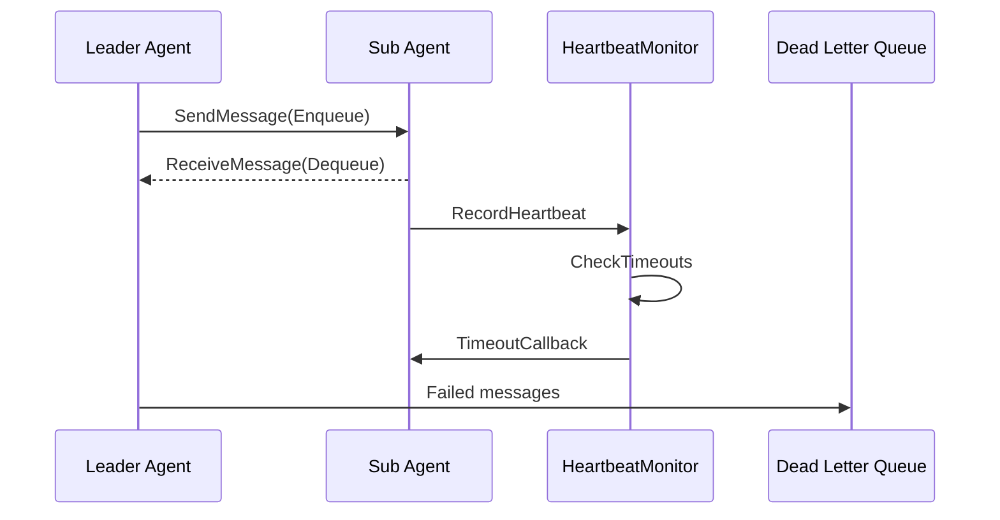

# ares 架构深度解析（二）：Agent Harmony Protocol — 多智能体的通信基石

> 聊到多 Agent 系统，很多人第一反应是："Agent 之间怎么说话？用 HTTP 还是 WebSocket？走消息队列？"
> 我的回答比较粗暴：**同一个进程里跑着，聊个天还要走网络？直接用 Go channel 干不就完了。**
> 于是就有了 AHP——一个不走网线的通信协议。

## 写在前面

做多 Agent 系统最烦的一件事是什么？不是 Agent 不够聪明——是 Agent 之间不说话。

Leader 派了个活给 Sub，Sub 干完了想汇报，结果发现 Leader 已经超时了。Sub 想说自己干到哪一步了，发现没地方说。Leader 想知道 Sub 还活着吗，发现没有心跳机制。

我刚开始用 Python 搭的时候，用的是 Redis 队列。后来换 Go，想找个更正式的方案，花了整整两天折腾 RabbitMQ——第一天装 Erlang、配 vhost、建 exchange、画 binding key 的映射关系，第二天写了 200 多行胶水代码才把一条消息从 Agent A 送到 Agent B。

测完一看，端到端延迟从 channel 的 <1μs 涨到了 2ms+——这个 2000 倍的差距还不是网络导致的，因为两个 Agent 在同一个进程里跑。纯纯的序列化+消息路由开销。我就想：**同一个进程，两个 goroutine，发条消息还要经过网络？脑子有病吧。**

所以我写了一个纯进程内的通信协议：不走网络、不序列化、不依赖中间件。就是 channel + 共享内存。

## 一、为什么自己造轮子？

ares 里有两种角色：Leader Agent（管分活的）和 Sub Agent（管干活的）。它俩之间通信需要搞定的破事：

- **异步发消息**：Leader 把任务丢出去就能干别的，不用等 Sub 搞完
- **进度反馈**：Sub 干到 50% 了，得让 Leader 知道
- **心跳检测**：Leader 得知道 Sub 是不是挂了
- **容错处理**：消息发失败了得有个兜底

我当时调研了一圈，发现要么太重（RabbitMQ），要么太慢（Redis 走网络），要么和 Go 的哲学不对付。最后决定：**自己搓一个。**

理由其实特简单：

1. **快**：channel 传东西 vs 网络 RTT——这差距大到不用比
2. **简单**：不用管序列化、网络抖动、分区容错那些分布式噩梦
3. **好改**：以后真要上微服务了，把底层从 channel 换成 gRPC 就行，上面业务代码一行不用动

## 二、全局架构

AHP 的整体架构可以概括为一张图：



核心组件包括：

| 组件 | 职责 | 实现亮点 |
|------|------|----------|
| `Protocol` | 统一门面，组合所有子组件 | Facade 模式，提供一站式接口 |
| `MessageQueue` | 每个 Agent 独立的消息队列 | 基于 buffered channel + backup buffer + atomic.Bool |
| `HeartbeatMonitor` | 心跳检测 + 超时回调 | 共享实例，分布式系统无需额外组件 |
| `DLQ` | 死信消息存储与重试 | 支持自定义处理器和自动重试 |
| `QueueRegistry` | 管理所有 Agent 的队列 | 懒加载 + 双检锁 |
| `Codec` | 消息序列化 | JSON 实现，CodecRegistry 可扩展 |

## 三、消息模型

### 3.1 五种消息类型

AHP 定义了 5 种消息类型，覆盖 Agent 间通信的全部场景：

```go
const (
    AHPMethodTask      AHPMethod = "TASK"      // 任务分配
    AHPMethodResult    AHPMethod = "RESULT"     // 任务结果
    AHPMethodProgress  AHPMethod = "PROGRESS"   // 进度反馈
    AHPMethodACK       AHPMethod = "ACK"        // 确认回复
    AHPMethodHeartbeat AHPMethod = "HEARTBEAT"  // 心跳信号
)
```

### 3.2 消息结构

```go
type AHPMessage struct {
    MessageID   string         `json:"message_id"`
    Method      AHPMethod      `json:"method"`
    AgentID     string         `json:"agent_id"`
    TargetAgent string         `json:"target_agent"`
    TaskID      string         `json:"task_id"`
    SessionID   string         `json:"session_id"`
    Payload     map[string]any `json:"payload"`
    Timestamp   time.Time      `json:"timestamp"`
}
```

### 3.3 MessageID 生成

MessageID 的设计是一个三段式 ID：

```go
func generateMessageID() string {
    id := atomic.AddUint64(&messageIDCounter, 1)
    randSuffix := getRandomSuffix()
    return fmt.Sprintf("%s.%d.%s",
        time.Now().Format("20060102150405.000000"), id, randSuffix)
}
```

- **时间戳前缀**：可读性强，方便排查问题
- **原子计数器**：同一纳秒内多个消息的序号递增
- **随机后缀**：多进程场景下避免冲突

这个方案不依赖全局协调器，在进程内就能保证唯一性。

### 3.4 辅助构造函数

AHP 提供了一系列构造函数，屏蔽消息构建的细节：

```go
NewMessage(method, agentID, targetAgent, taskID, sessionID)
NewTaskMessage(agentID, targetAgent, taskID, sessionID, payload)
NewResultMessage(agentID, targetAgent, taskID, sessionID, result)
NewProgressMessage(agentID, targetAgent, taskID, sessionID, progress)
NewACKMessage(agentID, targetAgent, taskID, sessionID)
NewHeartbeatMessage(agentID)
```

值得注意的是 `NewResultMessage`：它将 `*models.TaskResult` 封装到 `Payload["result"]` 中，而 `GetResult()` 方法需要处理 JSON 反序列化后类型丢失的问题——`TaskResult` 会变为 `map[string]any`。`GetResult()` 内部实现了 `reconstructTaskResult` 函数，通过反射和字段映射来重建原始结构体。

## 四、消息队列：MessageQueue

### 4.1 核心实现

`MessageQueue` 基于 buffered Go channel 实现：

```go
type MessageQueue struct {
    messages     chan *AHPMessage
    agentID      string
    opts         *QueueOptions
    backupBuffer []*AHPMessage
    backupMu     sync.Mutex
    closed       atomic.Bool
    closeOnce    sync.Once
}
```

### 4.2 入队：非阻塞写入

```go
func (q *MessageQueue) Enqueue(ctx context.Context, msg *AHPMessage) (retErr error) {
    if q.closed.Load() { return errors.ErrQueueClosed }
    defer func() {
        if r := recover(); r != nil { retErr = errors.ErrQueueClosed }
    }()
    select {
    case q.messages <- msg:
        return nil
    default:
        return errors.ErrQueueFull
    }
}
```

设计亮点：

1. **非阻塞**：channel 满时立即返回 `ErrQueueFull`，不阻塞调用方
2. **atomic.Bool 判断关闭**：无锁检查关闭标志
3. **defer recover 兜底**：`send on closed channel` 的 panic 被优雅捕获
4. **context 参数未使用**：`default` 分支永远不会选择 `ctx.Done()`，这里的 context 形同虚设

### 4.3 出队：阻塞读取

```go
func (q *MessageQueue) Dequeue(ctx context.Context) (*AHPMessage, error) {
    q.backupMu.Lock()
    if len(q.backupBuffer) > 0 {
        msg := q.backupBuffer[0]
        q.backupBuffer = q.backupBuffer[1:]
        q.backupMu.Unlock()
        return msg, nil
    }
    q.backupMu.Unlock()
    select {
    case msg, ok := <-q.messages:
        if !ok { return nil, errors.ErrQueueClosed }
        return msg, nil
    case <-ctx.Done():
        return nil, ctx.Err()
    }
}
```

出队支持 context 取消，这是 Go 标准的可取消阻塞模式。

### 4.4 Peek 与 Backup Buffer

`Peek()` 允许在不移除消息的情况下查看队首。核心难题是：从 channel 取出消息后，如果 channel 已满就无法放回。解决方案是有 `backupBuffer` 作为溢出存储，`Dequeue` 优先从 backupBuffer 读取。

### 4.5 QueueRegistry：队列管理器

`QueueRegistry` 的 `GetOrCreate` 方法使用**双检锁**（Double-Checked Locking）模式:

```go
func (r *QueueRegistry) GetOrCreate(agentID string) *MessageQueue {
    r.mu.RLock()
    q, ok := r.queues[agentID]
    r.mu.RUnlock()
    if ok { return q }
    r.mu.Lock()
    defer r.mu.Unlock()
    if q, ok := r.queues[agentID]; ok { return q } // 双检
    q = NewMessageQueue(agentID, r.defaultOpts)
    r.queues[agentID] = q
    return q
}
```

## 五、心跳检测：HeartbeatMonitor

### 5.1 核心流程

- 各 Agent 按固定间隔（默认 5s）发送心跳
- HeartbeatMonitor 记录最近一次心跳时间
- 超过超时时间（默认 30s）且连续错过次数达到阈值（默认 3 次），标记为离线

### 5.2 超时检测算法

```go
func (m *HeartbeatMonitor) CheckTimeouts() []string {
    timedOut := m.checkAndMarkOffline()  // 写锁下检测
    for _, agentID := range timedOut {
        m.notifyCallbacks(agentID)        // 锁外执行回调
    }
    return timedOut
}
```

关键边界条件处理：

1. **渐进式超时**：错过 3 次心跳才判定离线，避免网络偶发延迟导致误杀
2. **避免重复回调**：已 Offline 的 Agent 不会再次触发回调
3. **回调在锁外执行**：`notifyCallbacks` 复制回调列表后释放锁再执行，这是防止死锁的关键

### 5.3 两种 HeartbeatSender

1. **`ahp.HeartbeatSender`**：发送 `AHPMethodHeartbeat` 消息到目标的 `MessageQueue`，属于**带内**心跳
2. **`heartbeatSender`**（在 `internal/agents/sub/`）：直接调用 `HeartbeatMonitor.RecordHeartbeat`，属于**带外**心跳

目前 Sub Agent 使用第二种方式，在单体部署下更高效。

## 六、死信队列：DLQ

当 `Enqueue` 返回错误时，`Protocol.SendMessage` 将失败消息路由到 DLQ：

```go
func classifyEnqueueError(err error) string {
    switch {
    case errors.Is(err, apperrors.ErrQueueClosed):  return "queue_closed"
    case errors.Is(err, apperrors.ErrQueueFull):    return "queue_full"
    case errors.Is(err, context.Canceled):          return "context_canceled"
    case errors.Is(err, context.DeadlineExceeded):  return "context_deadline"
    default:                                        return "unknown"
    }
}
```

`DLQProcessor` 支持按错误类型注册自定义处理器，并支持自动重试：

- `MaxRetries = 0`：无限重试
- `MaxRetries > 0`：达到次数后标记为 exhausted
- 当前无指数退避，这是可改进点

## 七、Protocol 门面

```go
type Protocol struct {
    registry  *QueueRegistry
    dlq       *DLQ
    codec     Codec
    heartbeat *HeartbeatMonitor
    config    *ProtocolConfig
}
```

| 方法 | 功能 |
|------|------|
| `SendMessage(ctx, msg)` | 发送消息，失败自动入 DLQ |
| `ReceiveMessage(ctx, agentID)` | 接收消息，阻塞等待 |
| `SendTask/SendResult` | 便捷发送 |
| `RecordHeartbeat(agentID)` | 记录心跳 |
| `CheckTimeouts()` | 检查超时 |
| `Stats()` | 运行状态快照 |
| `Close()` | 关闭所有资源 |

## 八、Agent 中的 AHP 集成

### 8.1 Messenger 接口

```go
type Messenger interface {
    SendMessage(ctx context.Context, msg *ahp.AHPMessage) error
    ReceiveMessage(ctx context.Context) (*ahp.AHPMessage, error)
}
```

Leader Agent 和 Sub Agent 都实现了此接口。构造时通过依赖注入传入 `MessageQueue` 和 `HeartbeatMonitor`。

### 8.2 Dispatcher 的任务分发

`taskDispatcher` 同时支持**本地执行**和**分布式分发**两种模式，核心逻辑在 `executeTask` 中：

```go
if executor, ok := d.executorFuncs[task.Type]; ok {
    return executor(ctx, task, agentAddr, sessionID)  // 本地执行
}
if d.messageSender == nil { /* return error */ }
msg := ahp.NewTaskMessage(...)                        // 通过 AHP 发送
d.messageSender.Send(ctx, agentAddr, msg)
return d.waitForResult(ctx, task.TaskID)              // 阻塞等待结果
```

这种设计使得 Agent 通信模式可以在单体部署和分布式部署间无缝切换。

## 九、设计模式总结

| 模式 | 位置 | 说明 |
|------|------|------|
| **Facade** | `Protocol` | 统一接口，组合所有组件 |
| **Registry** | `QueueRegistry`, `CodecRegistry` | 具名实例管理，懒加载 |
| **Strategy** | `Codec` 接口 | 可替换的序列化策略 |
| **Observer** | `TimeoutCallback` | 心跳超时回调 |
| **Dead Letter Queue** | `DLQ` + `DLQProcessor` | 失败消息存储与重试 |
| **Double-Checked Locking** | `GetOrCreate` | 兼顾性能与正确性 |
| **Panic Recovery** | `Enqueue` | `defer recover()` 应对并发关闭 |
| **Lock-Free Read** | `atomic.Bool` | 无锁读取关闭状态 |

## 十、关键设计决策

### 10.1 为什么非阻塞 Enqueue？

- Agent 是多线程环境，阻塞可能导致级联等待
- DLQ 提供了更好的容错语义，失败消息可重试
- 调用方有更大的控制权：立即重试、稍后重试、或舍弃

### 10.2 TOCTOU 避免

`SendMessage` 有一个关键设计：**不先检查 IsFull 再入队**。如果先检查再入队，检查到入队之间队列可能从不满变为满（TOCTOU 竞态），导致消息丢失。直接执行操作并处理错误更健壮。

### 10.3 序列化预留扩展

当前 AHP 是纯进程内通信，JSON 够用。但 Codec 接口预留了两个方向的扩展：
1. **跨进程通信**：protobuf/msgpack 可提供更小的载荷
2. **持久化**：DLQ 消息若落盘，二进制格式更有优势

## 十一、还差什么？（坦诚环节）

说实话，AHP 不是完美的。我自己用的时候也踩过一些坑，有的坑还挺疼：

1. **纯进程内**：跨不了进程，真要上分布式得换 MessageQueue 实现。这不是"换个实现"四个字就能解决的——channel 的同步语义和网络消息队列的异步语义有本质区别，切换的时候有不少边界情况要处理
2. **没有广播**：要给多个 Sub 发消息，就得老老实实在 Leader 里 for 循环逐个发。有一次我需要同时通知 6 个 Sub 执行任务，Leader 发完第 3 个的时候第 1 个 Sub 已经跑完了——串行发送成了整个工作流的瓶颈
3. **重试策略太憨**：DLQ 重试间隔是固定的，没做指数退避。有次下游 API 挂了 10 分钟，DLQ 在这 10 分钟里以固定间隔疯狂重试，把本来就脆弱的下游打得更惨了。事后我才加的熔断判断——应该一开始就做了
4. **路由太死板**：不支持基于内容的动态路由或者 Topic 订阅。当前的路由就是"发给这个 AgentID"，偶尔想根据消息类型做分流，得自己在业务层写 if-else

还有一个不太明显的代价：**"以后换底层就行"这个假设，在短期内可能是错的。** 因为 AHP 用的很多语义（非阻塞 Enqueue、backup buffer、共享内存方式的 Heartbeat）都依赖 channel 的同步特性。真要切到 gRPC 或 RabbitMQ 的时候，这些行为的移植难度比表面上大得多——你需要重新实现一整套"看起来像 channel"的异步语义。抽象层能隔离接口，但隔离不了语义差异。

不过话说回来，这些 limitation 在单体阶段都是**可以接受的取舍**——channel 方案帮我省掉了 90% 的分布式复杂度。如果一开始上了 RabbitMQ，可能 Agent 之间的通信也稳定了，但项目启动时间会多花一到两周，还不算后面的运维成本。对于创业阶段的项目，这个账怎么算都是划算的。

## 总结

AHP 是我给 ares 搓的通信轮子。channel 传消息、DLQ 兜底、HeartbeatMonitor 看死活——三个东西加一起，多 Agent 通信的基础设施就齐活了。

代码里留的那些接口（Codec、DLQ handler、MessageSender），说白了就是给自己留的后路：以后要上 gRPC 还是 RabbitMQ，换一层实现就完事，上面业务代码不用动。这种设计在创业项目里特别重要——你永远不知道明天架构要改成啥样。

下一篇聊聊**记忆蒸馏**——Agent 怎么从几百条对话历史里把有用的经验提炼出来，下次遇到类似问题直接复用。