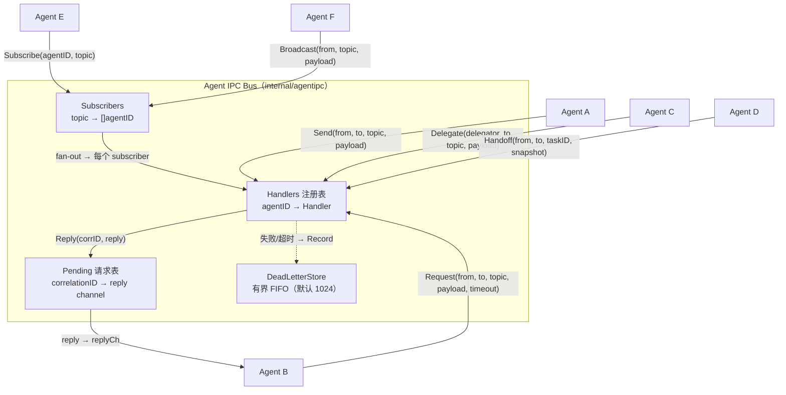

# ares 架构深度解析（二）：Agent IPC — Peer-Mesh 通信原语（0.3.x）

> 聊到多 Agent 系统，很多人第一反应是："Agent 之间怎么说话？用 HTTP 还是 WebSocket？走消息队列？"
> 0.2.x 的回答是 AHP——一个纯进程内的 channel 通信协议。0.3.x 的回答变了：**Agent 是同级认知进程，通信不需要 Leader 中转。**
> 于是就有了 Agent IPC——一个 peer-mesh 消息总线，六原语，不走 Leader。

## 写在前面

做多 Agent 系统最烦的一件事是什么？不是 Agent 不够聪明——是 Agent 之间不说话。

0.2.x 的时候，Leader 派了个活给 Sub，Sub 干完了想汇报，结果发现 Leader 已经超时了。Sub 想说自己干到哪一步了，发现没地方说。Leader 想知道 Sub 还活着吗，发现没有心跳机制。所有通信都经过 Leader——Leader 挂了，整个通信网就断了。

0.3.x 改了这个。**Agent 是同级认知进程（A ≡ B ≡ C）**——父子只有 spawn provenance，不构成权限层级。Process Tree ≠ Scheduling Graph。这意味着任何 Agent 可以直接和任何 Agent 通信，不需要 Leader 中转。

我刚开始用 Python 搭的时候，用的是 Redis 队列。后来换 Go，想找个更正式的方案，花了整整两天折腾 RabbitMQ——第一天装 Erlang、配 vhost、建 exchange、画 binding key 的映射关系，第二天写了 200 多行胶水代码才把一条消息从 Agent A 送到 Agent B。

测完一看，端到端延迟从 channel 的 <1μs 涨到了 2ms+——这个 2000 倍的差距还不是网络导致的，因为两个 Agent 在同一个进程里跑。纯纯的序列化+消息路由开销。我就想：**同一个进程，两个 goroutine，发条消息还要经过网络？脑子有病吧。**

所以我写了一个纯进程内的通信协议：不走网络、不序列化、不依赖中间件。就是 channel + 共享内存。0.2.x 叫 AHP。0.3.x 把它升级为 **Agent IPC**——peer-mesh 消息总线，六原语。

## 一、从 AHP 到 Agent IPC：变了什么？

| 维度 | AHP（0.2.x） | Agent IPC（0.3.x） |
|------|-------------|-------------------|
| 拓扑 | Leader → Sub（星型） | peer-mesh（任意 Agent → 任意 Agent） |
| 原语数 | 5（Task/Result/Progress/ACK/Heartbeat） | 6（Send/Request/Reply/Delegate/Handoff/Subscribe） |
| 语义 | 消息类型驱动（method 字段） | 通信意图驱动（原语即 API） |
| 广播 | 无（Leader for 循环） | Subscribe + Broadcast（原生 fan-out） |
| 任务转移 | 无 | Handoff（peer-to-peer 任务所有权转移） |
| 请求转交 | 无 | Delegate（"我处理不了，帮你转给能处理的人"） |
| 死信 | DLQ（固定间隔重试） | DeadLetterStore（有界 FIFO，可观测+可重投） |
| 兼容 | — | 旧 AHP 路径保留（peer.Registry 并行运行） |

核心区别：AHP 的五种消息类型是"发什么消息"，Agent IPC 的六个原语是"做什么通信动作"。**你不需要在 payload 里塞一个 method 字段来表达意图——你调用的原语本身就是意图。**

## 二、全局架构

Agent IPC 的整体架构：


```mermaid
graph TB
    subgraph Bus ["Agent IPC Bus（internal/agentipc）"]
        Handlers["Handlers 注册表<br/>agentID → Handler"]
        Pending["Pending 请求表<br/>correlationID → reply channel"]
        Subs["Subscribers<br/>topic → []agentID"]
        DL["DeadLetterStore<br/>有界 FIFO（默认 1024）"]
    end

    A1["Agent A"] -->|"Send(from, to, topic, payload)"| Handlers
    A2["Agent B"] -->|"Request(from, to, topic, payload, timeout)"| Handlers
    Handlers -->|"Reply(corrID, reply)"| Pending
    Pending -->|"reply → replyCh"| A2
    A3["Agent C"] -->|"Delegate(delegator, to, topic, payload)"| Handlers
    A4["Agent D"] -->|"Handoff(from, to, taskID, snapshot)"| Handlers
    A5["Agent E"] -->|"Subscribe(agentID, topic)"| Subs
    A6["Agent F"] -->|"Broadcast(from, topic, payload)"| Subs
    Subs -->|"fan-out → 每个 subscriber"| Handlers
    Handlers -.->|"失败/超时 → Record"| DL
```

核心组件：

| 组件 | 职责 | 实现亮点 |
|------|------|----------|
| `Bus` | peer-mesh 消息总线，持有所有状态 | `sync.RWMutex` 保护 handlers/subscribers/pending |
| `Handler` | 消息处理函数，`func(ctx, *Message) (*Message, error)` | 返回 reply 或 error |
| `Message` | 通信单元，携带 topic/payload/correlationID | 轻量结构体，无 JSON 序列化 |
| `DeadLetterStore` | 失败请求的有界存储 | 环形 FIFO，默认 1024 条，可观测+可重投 |
| `PolicyFlag` | 双轨调度标志（legacy vs task fabric） | `atomic.Int64`，运行时翻转不需重启 |

## 三、六原语

### 3.1 Send — 发了就忘

```go
func (b *Bus) Send(ctx context.Context, from, to, topic string, payload any) error
```

最简单的原语：把消息投递给目标 Agent，不等回复。目标不存在或 handler 失败时，记录到 DeadLetterStore。**Send 不配对 Reply**——如果需要请求/回复语义，用 Request。

### 3.2 Request — 请求/回复

```go
func (b *Bus) Request(ctx context.Context, from, to, topic string, payload any, timeout time.Duration) (*Message, error)
```

同步请求/回复原语：发送消息并等待回复。Bus 分配 correlationID，注册 pending reply channel。目标 handler 可以：
- **同步回复**：handler 直接返回 `(*Message, error)`，Bus 在 managed goroutine 里 stamping 后投递
- **异步回复**：handler 返回 `(nil, nil)`，稍后调用 `Reply(corrID, reply)` 完成回复

超时或 context 取消时，pending entry 被清理，返回 `ErrTimeout`。B16 修复：timeout ≤ 0 时使用 30s 默认值，不再无限阻塞。

### 3.3 Reply — 异步回复

```go
func (b *Bus) Reply(corrID string, reply *Message) error
```

当 handler 不能立即返回回复时，可以稍后调用 Reply。correlationID 把回复和原始请求配对。对于已超时/取消的请求，Reply 是 best-effort drop——不会阻塞或 panic。

### 3.4 Delegate — 请求转交

```go
func (b *Bus) Delegate(ctx context.Context, delegator, to, topic string, payload any, timeout time.Duration) (*Message, error)
```

"I can't handle this — let me ask someone who can." 委托者把自己的 ID 作为 From 发起 Request。原始请求者的 correlationID 端到端保留，回复可以链式返回。**这是 Agent 之间协作转交的原语——不需要 Leader 中转。**

### 3.5 Handoff — 任务转移

```go
func (b *Bus) Handoff(ctx context.Context, from, to, taskID string, contextSnapshot map[string]any, timeout time.Duration) (*Message, error)
```

Peer-to-peer 任务所有权转移。与 Send 不同，Handoff 携带结构化的转移 payload（task id + context snapshot + artifacts），接收方确认接受。**发送方让出任务，接收方接手。这是 Agent 之间直接转移任务的原语——不经过 Scheduler。**

### 3.6 Subscribe / Broadcast — 订阅/广播

```go
func (b *Bus) Subscribe(agentID, topic string) error
func (b *Bus) Broadcast(ctx context.Context, from, topic string, payload any) int
```

"I found X — anyone interested in X should know." Agent 订阅感兴趣的 topic，任何 Agent 可以向某个 topic 广播。Broadcast 是 fire-and-forget fan-out：每个 subscriber 的 handler 被调用，单个 handler 失败不中断 fan-out，返回成功投递数。B16 修复：Subscribe 去重，同一 agent 不会重复加入同一 topic。

## 四、Message 模型

```go
type Message struct {
    ID            string    // Bus 生成的唯一 ID
    From          string    // 发送者 agent id
    To            string    // 目标 agent id（"" = 广播给 subscribers）
    Topic         string    // 消息主题（如 "verify-conclusion", "handoff-task"）
    CorrelationID string    // 请求/回复配对 ID（fire-and-forget 时为空）
    Payload       any       // 消息体
    At            time.Time  // 发送时间戳
}
```

对比 AHP 的 `AHPMessage`：没有 `Method` 字段了——**原语本身就是 method**。调用 `Send` 就是 fire-and-forget，调用 `Request` 就是请求/回复，不需要在 payload 里塞一个 `"method": "TASK"` 来表达意图。

## 五、DeadLetterStore：有界可观测

0.3.x 把 AHP 的 DLQ 升级为 `DeadLetterStore`：

```go
type DeadLetterStore struct {
    mu       sync.Mutex
    next     uint64
    capacity int       // 默认 1024
    entries  []DeadLetter
}
```

关键变化：
- **有界 FIFO**：满了就踢最老的（环形策略，与 flight aggregates 一致）
- **原生可观测**：introspect 面板和 ops 工具可以直接 `Snapshot()` 读取
- **可重投**：失败请求保留 From/To/Topic/Payload/Reason，可以手动重投
- **不记录 context 取消**：`ctx.Done()` 不是投递失败——请求可能已被投递和处理，只是调用方取消了等待。把取消记进 DLQ 会挤掉真正的投递失败

对比 AHP 的 DLQ：没有自动重试了。0.2.x 的 DLQ 有固定间隔重试，打了下游更惨。0.3.x 改为记录 + 可观测 + 手动重投——让人决定，不自动打。

## 六、双轨调度：PolicyFlag

0.3.x 的 `agentipc` 包里有一个 `PolicyFlag`——双轨调度标志：

```go
const (
    PolicyLegacy     ExecutionPolicy = iota  // 旧 leader+sub 路径
    PolicyTaskFabric                          // Kernel 路径：Task Fabric → Scheduler → Agent
)
```

`DualTrackDispatcher` 持有两条路径的 dispatcher，flag 选择哪条是 active。当 shadow 模式开启时，inactive 路径也跑，对比结果——**这是"双轨等价"验证：同一个 task 走两条路，结果必须一致**。

生产环境只有 `PolicyTaskFabric`——Leader 运行时已移除。但保留 legacy 常量是为了双轨验证的 shadow 模式。

## 七、旧 AHP 兼容

Agent IPC 不替代旧的 AHP——两者并行运行：

- **`internal/ares_protocol/ahp`**：旧的 AHP 协议，channel + MessageQueue + HeartbeatMonitor + DLQ
- **`internal/agents/peer/Registry`**：peer-to-peer 直投 Send（基于 AHP 消息）
- **`internal/agentipc/Bus`**：新的 peer-mesh 六原语总线

`peer.Registry` 的 Send 路径仍然使用 `ahp.AHPMessage`，直接调用目标 Agent 的 `SendFunc`。这跟 `agentipc.Bus` 的 Send 互补：旧路径处理 Leader 分发的遗留场景，新路径处理 peer-mesh 协作。

**坦诚反思**：两套通信系统并行运行是迁移期的必要代价。长期目标是 AHP 退化到只做兼容层，所有新通信走 Agent IPC。但短期内，leader-dispatched 路径和 peer IPC 并行 + feature flag gradual cutover 是最安全的方式。

## 八、Context 三层分离

Agent IPC 是 0.3.x Context 三层分离的第三层：

| 层 | 内容 | 生命周期 |
|----|------|---------|
| Task Shared | 任务上下文（DAG、检查点、lease） | Task 级别——Agent 死了 Task 不死 |
| Agent Private | Agent 私有状态（LLM 对话、中间结果） | Agent 级别——Agent 死了就没了 |
| IPC Messages | Agent 间消息（Send/Request/Handoff...） | 消息级别——投递完就完事 |

这个分离意味着：Agent 死了，它的 Agent Private context 丢了，但 Task Shared context 还在（在 Task Fabric 的检查点里），IPC Messages 也在（Bus 的 pending/dead letters 里）。新 Agent 被 spawn 出来，从检查点恢复 Task context，继续干活。

## 九、关键设计决策

### 9.1 为什么 Request 用 managed goroutine？

Request 的 handler 在一个独立 goroutine 里执行：

```go
go func() {
    reply, err := h(reqCtx, req)
    // ...
}()
```

原因：handler 可能很慢（调 LLM、查数据库），如果在调用方 goroutine 里同步执行，调用方无法被 timeout 或 context 取消。managed goroutine + child context 意味着 timeout 到了 handler 会被 cancel——**handler 不再泄漏**（B16 修复）。

### 9.2 为什么 Reply 是 best-effort drop？

如果 correlationID 已不在 pending 表里（说明请求已超时/取消），Reply 直接返回 nil，不报错不 panic。原因：在分布式系统里，"回复到达时请求已超时"是常态不是异常。如果 Reply 报错，调用方还得处理这个错误——但调用方大概率已经不关心了。

### 9.3 为什么 Handoff 不经过 Scheduler？

Handoff 是 peer-to-peer 任务转移——Agent 之间直接交接。原因：有些场景下 Agent 知道谁适合接手（比如"我做不了验证，但 Agent C 擅长验证"），不需要 Scheduler 重新调度。Scheduler 是"我不知道谁该干"时的路径，Handoff 是"我知道谁该干"时的路径。

## 十、还差什么？（坦诚环节）

说实话，Agent IPC 也不是完美的：

1. **纯进程内**：跟 AHP 一样，跨不了进程。真要上分布式，Bus 的 `map[string]Handler` 得换成某种分布式服务发现 + 网络传输。这个"换一层实现"的难度比看起来大——pending reply channel 的同步语义在网络环境下要重新设计
2. **没有背压**：Broadcast 是 fire-and-forget fan-out，如果 subscriber 处理慢，handler 调用会阻塞在那个 subscriber 上。目前没有 per-subscriber 的队列做缓冲——Broadcast 的 handler 是同步调用的
3. **DeadLetterStore 没有自动重投**：0.2.x 的 DLQ 至少有自动重试（虽然打得更惨了）。0.3.x 改为纯记录——但如果你不主动去看 DeadLetterStore，失败的消息就永远丢了。需要一个告警机制：DeadLetter count 超过阈值时通知
4. **Subscribe 没有模式匹配**：只支持 exact topic match。不支持通配符或模式订阅（如 `task.*` 匹配所有 task 相关 topic）。当前够用，但长期可能需要

还有一个不太明显的设计代价：**六个原语看起来简单，但组合使用时的边界情况很多。** 比如 Delegate + Handoff 的组合——Agent A 委托 Agent B 处理，B 处理到一半发现需要 C 接手，B 能不能把 A 委托给自己的任务 Handoff 给 C？correlationID 怎么链式传递？这些场景的语义目前是清楚的，但缺乏充分的测试覆盖。

不过话说回来，相比 0.2.x 的 AHP，Agent IPC 解决了两个核心问题：**不再依赖 Leader 中转，以及原生支持任务转移和广播**。这两个能力是 peer-mesh 协作的基础——没有它们，"同级认知进程"就是空话。

## 总结

Agent IPC 是 0.3.x 给 ares 造的新通信轮子。六原语覆盖 peer-mesh 协作的全部场景：Send 发了就忘，Request/Reply 请求回复，Delegate 请求转交，Handoff 任务转移，Subscribe/Broadcast 订阅广播。DeadLetterStore 有界可观测。双轨调度并行运行 + feature flag 渐进切换。

旧 AHP 保留为兼容层——leader-dispatched 路径和 peer IPC 并行运行，慢慢切换。这种"双轨等价"的方式在大型重构里特别重要——你不能一次性切，只能并行跑、对比结果、慢慢切换。

下一篇聊聊**记忆蒸馏**——Agent 怎么从几百条对话历史里把有用的经验提炼出来，下次遇到类似问题直接复用。
