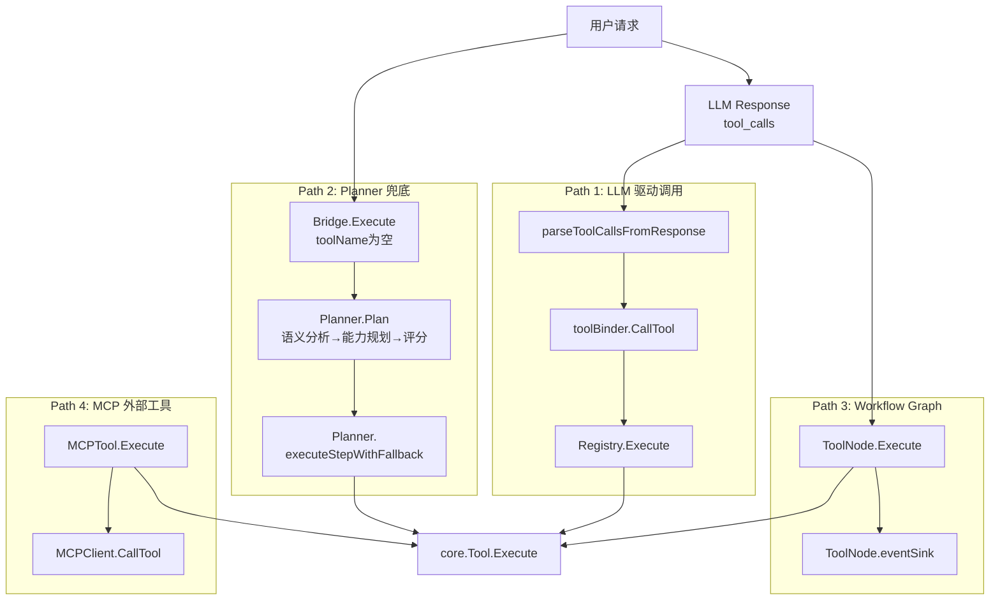

# ares 架构深度解析（五）：工具调用层拆解 -- 四条路径与一个兜底

> 22 个工具注册好之后，我以为万事大吉了。结果第一个集成测试就把我打回了原型——LLM 生成的参数传进去直接 panic，因为类型断言失败了。
> 我意识到一件事：定义工具只是第一步。真正复杂的，是工具**怎么被调起来**的这条链路。
> 后来我又意识到另一件事：LLM 不是每次都靠谱。它可能选错工具、可能传错参数、甚至根本不知道用什么工具。
> 所以我又加了第四条路——当 LLM 不靠谱的时候，用确定性引擎兜底。

## 一、工具调用的四条路径

很多人看完工具注册那一套，以为工具调用就是 `registry.Execute(name, params)` 一把梭。但实际跑起来，你会发现有四条完全不同的调用路径，各有各的考量：



当 LLM 决定调用一个工具时，数据长这样流：

```
LLM 返回 tool_calls (OpenAI JSON)
    ↓
parseToolCallsFromResponse()     [internal/llm/output/openai.go]
    ↓ ToolCallResponse { ToolCalls: [{ID, Name, Arguments}] }
sub-agent executor               [internal/agents/sub/executor.go]
    ↓ 遍历 ToolCalls
toolBinder.CallTool(name, args)  [internal/agents/sub/tools.go]
    ↓ 查找闭包映射
Registry.Execute(ctx, params)    [internal/tools/resources/core/registry.go]
    ↓ 按名查找 Tool
Tool.Execute(ctx, params)        [core/tool.go]
    ↓
core.Result { Success, Data, Error }
```

但这里有个隐藏分支：如果 LLM 返回的 `tool_name` 在 Registry 里不存在，或者 LLM 根本没返回 `tool_calls`，那就走 **Path 2**——Planner 兜底。

---

## 二、路径一：LLM 驱动的工具调用

### 2.1 toolBinder：Registry 到 Agent 的桥梁

子 Agent 不能直接拿 `GlobalRegistry` 到处用。中间隔了一层 `toolBinder`：

```go
// internal/agents/sub/tools.go
type toolBinder struct {
    mu       sync.RWMutex
    tools    map[string]func(ctx context.Context, args map[string]any) (any, error)
    registry *core.Registry
}

func (b *toolBinder) BridgeFromRegistry(registry *core.Registry) {
    // 遍历 registry，为每个工具创建闭包
    // 实际效果：b.tools[name] = func(ctx, args) { return t.Execute(ctx, args) }
}
```

为什么多这一层？三个理由：

1. **接口隔离**：子 Agent 不需要知道 `Registry` 的存在，它只需要 "按名字调函数"
2. **本地优先**：`toolBinder.GetTool` 有本地 → Registry 的 fallback 链，支持子 Agent 注入私有工具
3. **测试友好**：测试时可以直接 mock toolBinder，不需要启动整个 Registry

### 2.2 LLM 工具调用协议适配

参数从 LLM 的 JSON 到 Go 的 `map[string]interface{}`，这条链路看起来简单，实际上藏着不少弯弯绕：

```go
// internal/llm/output/openai.go
func parseToolCallsFromResponse(choice *Choice) (*ToolCallResponse, error) {
    // OpenAI 返回的 tool_calls 是这种结构：
    // {
    //   "tool_calls": [{
    //     "id": "call_xxx",
    //     "function": {
    //       "name": "calculator",
    //       "arguments": "{\"expression\": \"1+1\"}"
    //     }
    //   }]
    // }
    // arguments 是 JSON **字符串**，不是对象
    // 需要二次反序列化
}
```

这里有个容易忽略的点：`arguments` 是 JSON `string`，不是 JSON `object`。如果 LLM 返回非法 JSON，就会在这里崩。OpenAI 和 Anthropic 的工具调用格式还不一样——Anthropic 的 content block 里直接带 JSON object。

为了统一，框架内部定义了自己的抽象：

```go
// internal/llm/output/toolcall.go
type ToolCapable interface {
    GenerateWithTools(ctx context.Context, prompt string, 
        tools []ToolDefinition, choice ToolChoice) (*ToolCallResponse, error)
    SendToolResult(ctx context.Context, messages []map[string]interface{},
        toolResults []ToolResult) (*ToolCallResponse, error)
}

type ToolCall struct {
    ID        string `json:"id"`
    Name      string `json:"name"`
    Arguments string `json:"arguments"`  // JSON string
}
```

每一家 LLM 的 adapter 自己负责把供应商格式转成 `ToolCallResponse`。这样一来，**工具注册、调度、执行**对 LLM 供应商完全透明。

### 2.3 参数校验的缺口

这是整个调用链路里最让我睡不着的一个问题。看代码：

```go
// internal/tools/resources/builtin/math/calculator.go
func (t *Calculator) Execute(ctx context.Context, params map[string]interface{}) (core.Result, error) {
    expression, ok := params["expression"].(string)  // 手动类型断言
    if !ok || expression == "" {
        return core.NewErrorResult("invalid_expression"), nil
    }
    // ...
}
```

每个工具自己 `params["key"].(string)` 断言参数类型。没有统一校验层。这意味着：

- LLM 传了 `"expression": 123`（数字不是字符串）→ panic
- LLM 传了 `"expression": null` → panic
- LLM 忘了传 `expression` → `ok` 为 false，返回 "invalid_expression"，LLM 和用户都看不懂

更麻烦的是，这个错误信息会在 LLM 对话里继续传播——"invalid_expression" 被送回 LLM，LLM 重新生成参数，又传错，又回来，循环。我在实际测试中见过 5 轮以上的这种死循环。

**根本原因**：`ParameterSchema` 定义了一套完整的参数规则，但没有任何代码在 `Execute` 之前校验它。定义和执行之间，隔了一层空气。

---

## 三、路径二：Capability Planner 兜底调度

这是后来加的第四条路——不对，在文章结构里是第二条路。因为它在执行链路上的位置，排在 LLM 驱动之后、Workflow 之前。

### 3.1 为什么需要这条路径

Path 1 有一个前提假设：**LLM 知道要调哪个工具**。但这个假设不是每次都成立：

- 新工具刚上线，LLM 的训练数据还没覆盖到
- 用户描述需求时没提到工具名（"计算1+1" 而不是 "调calculator算1+1"）
- LLM 生成 tool_name 时幻觉了，写了个不存在的名字
- 工具被卸载/重命名了，LLM 不知道

这些场景下，Path 1 直接失败。传统的做法是返回一个错误让 LLM 重试，但重试只是碰运气——LLM 大概率生成同样的错误名字。

所以核心思路变了：**LLM 不知道用什么工具 → 我替它选**。

### 3.2 ToolExecutionBridge：统一入口

`ToolExecutionBridge` 是两条路径的分叉点：

```go
// internal/tools/planner/bridge.go
func (b *ToolExecutionBridge) Execute(ctx, toolName, params, userRequest) (Result, error) {
    // Path 1: LLM 给了工具名且存在 → 直接执行
    if toolName != "" {
        tool, exists := b.registry.Get(toolName)
        if exists {
            return tool.Execute(ctx, params)
        }
        log.Warn("tool not found, triggering planner fallback")
    }

    // Path 2: Planner 兜底
    plan, _ := b.planner.Plan(ctx, userRequest)
    return b.executePlan(ctx, plan, params)
}
```

逻辑很简单：

| 条件 | 行为 |
|---|---|
| LLM 给了工具名 + 存在 | 直接执行（Path 1） |
| LLM 给了工具名 + 不存在 | 日志警告 → 走 Planner |
| LLM 没给工具名 + 有用户请求 | 走 Planner |
| 两者都没有 | 返回错误 |

### 3.3 Planner 的五步流水线

Planner 接到请求后，执行五步确定性流水线：

```text
用户请求 "计算1到100万的和"
    ↓
Step 1: 语义分析  (SemanticAnalyzer)
    → Intent{goal: "mathematical computation", capabilities: ["Summation"]}
    ↓
Step 2: 能力规划  (CapabilityPlanner)
    → [CapabilityRequirement{Name: "Summation", Tool: "calculator"}]
    ↓
Step 3: 工具解析  (ToolResolver)
    → [ToolCandidate{Name: "calculator", Score: 0, Cost: 1}]
    ↓
Step 4: 证据评分  (ToolScorer)
    → calculator 28.5分 vs web_search 15.3分
    ↓
Step 5: 参数提取  (ParameterExtractor)
    → {"expression": "1000000*(1000000+1)/2"}
    ↓
执行计划 → Bridge.Execute()
```

**Step 1：语义分析**

`SemanticAnalyzer` 是一个规则引擎，目前内置了 20 条规则，覆盖中英文：

```go
// internal/tools/planner/analyzer.go
func defaultRules() []intentRule {
    return []intentRule{
        {keywords: []string{"累加", "求和"},
            capabilities: []string{"Summation", "Arithmetic"}},
        {keywords: []string{"pdf", "document"},
            capabilities: []string{"PDFParsing", "TextExtraction"}},
        {keywords: []string{"hash", "sha256", "md5"},
            capabilities: []string{"Hashing"}},
        {keywords: []string{"mean", "stddev", "average", "平均", "方差"},
            capabilities: []string{"Statistics", "Arithmetic"}},
        {keywords: []string{"factorial", "permutation", "组合", "阶乘", "离散"},
            capabilities: []string{"DiscreteMath", "Arithmetic"}},
        // ... 共 20 条规则
    }
}
```

匹配逻辑是 OR——任意一个关键词命中就返回对应的 intent。规则按优先级排序，更具体的规则（如"累加"）排在通用规则（如"计算"）前面。

**Step 2：能力规划**

CapabilityPlanner 把 Intent 里的能力列表转成有序的 `CapabilityRequirement`。大部分请求是单步的，直接 1:1 映射。复杂请求（如 PDF→Text→Embedding）会生成多步依赖链。

有个关键去重逻辑：如果 `Summation` 已出现，自动消融 `Arithmetic`，因为求和隐含了算术能力。

**Step 3：工具解析**

ToolResolver 将能力映射到具体的工具。既有静态映射表（calculator→Arithmetic），也会查询 provider 的 `GetToolCapabilities()` 来发现动态注册的工具（如 MCP 工具）。

只有实际注册在 provider 里的工具才会进入候选列表。

**Step 4：证据评分**

这是整个 planner 里唯一用"历史经验"的地方。评分公式：

```
BaseScore = (1 / Cost) × 10 + (Deterministic ? 3 : 0) + (Composable ? 2 : 0)
EvidenceScore = SuccessRate × 20 - latencyPenalty - failurePenalty
Penalty = SideEffects ? 5 : 0
Final = BaseScore + EvidenceScore - Penalty
```

- calculator（cost=1, deterministic, composable）→ base=15
- 100% 成功率 + 1ms 延迟 → evidence ≈ 20
- 无副作用 → penalty=0
- **总计 ≈ 35 分**

- http_request（cost=5, 有副作用）→ base=2
- 90% 成功率 + 300ms 延迟 → evidence ≈ 15
- 副作用惩罚 → penalty=5
- **总计 ≈ 12 分**

calculator 比 http_request 高 20 多分，这是确定性 + 低成本 + 高成功率的累积优势。

证据来自 `EvidenceStore`，每次工具执行结果都会被记录并聚合。没有历史数据时，使用静态默认值。

**Step 5：参数提取**

`ParameterExtractor` 把自然语言里的数字和操作提取出来，生成工具的参数字段：

```
"从1累加到100万"   → expression="1000000*(1000000+1)/2"  (高斯公式)
"2的10次方"       → expression="2**10"
"根号16"          → expression="sqrt(16)"
"12和18的最大公约数" → expression="gcd(12,18)"
"计算1,2,3,4,5的平均值" → expression="mean(1,2,3,4,5)"
"10的阶乘"         → expression="factorial(10)"
```

参数提取器仅对常见模式生效。不在模式里的请求，保持空参数让 LLM 后续决定。

### 3.4 多步 DAG 执行

Planner 支持多步执行。当请求需要多个工具协作时（如"下载 PDF → 提取文字 → 向量化"），会生成 DAG：

```go
ExecutionPlan{
    PlanID: "uuid",
    IsMultiStep: true,
    Steps: [
        {StepID: "fetch", Tool: "web_search", DependsOn: []},
        {StepID: "extract", Tool: "pdf_tool", DependsOn: ["fetch"]},
        {StepID: "embed", Tool: "embedding", DependsOn: ["extract"]},
    ],
}
```

执行前会经过 `DAGValidator` 校验：

| 校验项 | 阻断执行？ |
|---|---|
| 循环依赖（A→B→C→A） | ✅ 阻断 |
| 依赖的工具不存在 | ✅ 阻断 |
| IO 类型不兼容 | ✅ 阻断 |
| 重复 StepID | ✅ 阻断 |
| 空执行计划 | ✅ 阻断 |

通过校验后，`Bridge.executeMultiStep()` 用拓扑排序确定执行顺序，逐步骤执行，每步支持 fallback 工具。

### 3.5 23 条用例实测

我用本地 Ollama 的 llama3.2（3B 小模型）测了 22 条请求，真实工具执行（不是 mock）：

```
calculator("1+1")             = 2          ✅
calculator("100*(100+1)/2")   = 5050       ✅ 高斯公式
calculator("sin(pi/2)+cos(0)")= 2          ✅ 三角函数
calculator("gcd(12,18)")      = 6          ✅ 最大公约数
calculator("factorial(10)")   = 3628800    ✅ 阶乘
calculator("nCr(10,3)")       = 120        ✅ 组合数
calculator("variance(1..5)")  = 2          ✅ 方差
calculator("isPrime(17)")     = 1          ✅ 素数判断
hash_tool sha256("hello")     = 2cf24dba.. ✅
string_utils upper            = HELLO WORLD ✅
```

22/22 全部通过。更重要的是，**换模型不需要改代码**——LLM 只负责生成 tool_name 和参数，实际执行规则由 planner 的确定性引擎保证。

---

## 四、路径三：Workflow Graph 的 ToolNode

当工具调用发生在 Workflow 编排中时，走的是 ToolNode 路径。这一条路径相对封闭，与 agent 层隔离。

```go
// internal/workflow/graph/node.go (ToolNode)
func (n *ToolNode) Execute(ctx context.Context, state State) (State, error) {
    // 1. 从 state 提取工具名和参数
    toolName := state.Get("tool_name").(string)
    params := state.Get("params").(map[string]any)
    
    // 2. 从全局 Registry 获取工具
    tool, err := n.registry.Get(toolName)
    
    // 3. 执行并写回 state
    result, err := tool.Execute(ctx, params)
    state.Set("result", result)
    return state, nil
}
```

ToolNode 做了三件事：
1. 从 `State` 中提取输入（工具名 + 参数）
2. 从 Registry 获取工具、执行
3. 把结果写回 `State`

没有参数校验，没有重试，没有结果格式化。这些问题在 workflow 体系下被 ToolNode 的 `eventSink` 机制部分补偿了——每次执行都有完整的事件追踪和 execution_id，方便后续 debug。

ToolNode 目前不支持 Planner 兜底。如果要加，需要在 ToolNode 的执行逻辑里加一个 `Bridge.Execute` 的调用分支。这是个已知缺口——workflow 和 planner 两条路径目前还没有打通。

---

## 五、路径四：MCP 外部工具适配

当 Agent 需要调用外部系统（如数据库查询、第三方 API、自定义脚本）时，走 MCP 路径。

```go
// internal/ares_mcp/mcp_tool.go
type MCPTool struct {
    client     *MCPClient
    serverName string
    toolDef    *MCPToolDef
}

func (t *MCPTool) Execute(ctx context.Context, params map[string]interface{}) (core.Result, error) {
    // 1. 参数序列化成 JSON
    // 2. 通过 MCPClient 发送 JSON-RPC 请求（stdio/SSE）
    // 3. 反序列化返回结果
    return result, nil
}
```

MCP 工具在 Registry 里和内置工具完全平级。调用方不需要知道这个工具是 Go 代码还是远程进程。

---

## 六、结果格式化：被低估的一层

工具执行完成后，结果怎么从 `core.Result` 变成 LLM 能看懂的文字？这个环节比大多数人想象的重要。

工具执行返回的 `Result.Data` 通常是 `map[string]interface{}`：

```json
{"result": 5050, "expression": "100*(100+1)/2"}
```

LLM 不是 JSON 解析器。它需要自然语言形式的结果描述。但问题来了——不同工具的输出形状完全不同，无法用一个统一的模板填充。

目前的方案是 `formatByToolType`，一个 15 条 case 的 switch：

```go
// internal/ares_runtime/tool.go
func formatByToolType(toolName, rawJSON string) string {
    switch toolName {
    case "calculator":
        return fmt.Sprintf("计算结果: %v", data)
    case "web_search":
        return fmt.Sprintf("搜索结果: %d 条", len(results))
    // ... 还有 13 个工具
    }
}
```

每新增一个工具，都要来这里加一行。忘了加就走到 `formatDefault`——直接把 JSON dump 给 LLM。

---

## 七、事件与回调：两套系统并存

工具调用的生命周期事件由两套系统同时追踪：

1. **callbacks.Emit**——简单的生命周期钩子，由 sub-agent executor 触发
2. **ToolNode.eventSink**——Workflow 层面的事件追踪，粒度更细，含 execution_id

两套系统互不感知。同一个工具调用，在 sub-agent 路径下走 callbacks，在 Workflow 路径下走 eventSink。后续应该把事件模型统一，但目前各自为政。

---

## 八、横切关注点

### 8.1 超时

工具调用的超时完全靠 `context.Context`：

```go
// sub/executor.go
ctx, cancel := context.WithTimeout(parentCtx, 30*time.Second)
defer cancel()
result, err := toolBinder.CallTool(ctx, name, args)
```

调用方各自设 timeout，没有统一兜底。

### 8.2 并发与限流

`GlobalRegistry` 本身是并发安全的（`sync.RWMutex`），但它**没有为单个工具提供并发控制**。如果 10 个子 Agent 同时调同一个 `CodeRunner`，没有排队机制。

### 8.3 日志与追踪

工具调用的日志散布在三个地方：
1. `callbacks.Emit(EventToolStart)` —— 简单的生命周期日志
2. `ToolNode.eventSink` —— Workflow 级别的执行追踪
3. `events.EventStore` —— 事件溯源

调试时需要翻三个地方。

---

## 九、已知问题与设计缺陷

### 9.1 参数校验缺失（最严重）

如前所述，`ParameterSchema` 定义了一大堆类型约束，但没有任何代码在 `Execute` 之前做校验。

### 9.2 Planner 与 Workflow 未打通

目前 planner 的 `ToolExecutionBridge` 只覆盖了 agent 级别的工具调用。Workflow 里的 ToolNode 还没有接入 planner fallback。如果 workflow 中的 LLM 调用了一个不存在的工具，会直接失败，不会尝试 planner 兜底。

### 9.3 MCP 命名冲突风险

`NewMCPTool` 的命名是 `"mcp.{serverName}.{toolName}"`。LLM 可能不理解 `mcp.` 前缀，生成的 tool call 里可能不带这个前缀。

### 9.4 内置工具自动注册的缺口（已修复）

早期 `NewRegistry()` 返回空注册表，需要手动调用 `RegisterBuiltinTools()`。现已修复——`NewRegistry()` 构造时自动注册全部内置工具。

---

## 十、总结

四条路径，一种归宿：

| 路径 | 触发条件 | 典型场景 | 状态 |
|---|---|---|---|
| Path 1: LLM 驱动 | LLM 给出 tool_name | 标准对话 | ✅ 完善 |
| Path 2: Planner 兜底 | LLM 没给工具名 / 工具不存在 | 新工具 / LLM 未知 | ✅ 已实现 |
| Path 3: Workflow Graph | Workflow 编排 | 确定性业务流程 | ✅ 完善 |
| Path 4: MCP 外部 | 跨进程工具 | 数据库 / 第三方 API | ✅ 完善 |

回头看，工具调用层比工具**定义**层复杂得多。定义一个工具只需要几十行代码和两行注册。但让工具在四条路径下都能被正确调用、参数校验、结果格式化、超时处理、重试策略、事件追踪——这才是真正的复杂度。

Planner 的加入把"LLM 选错了工具怎么办"这个问题解决了。但参数校验这个缺口还在——这是下一轮要啃的硬骨头。
