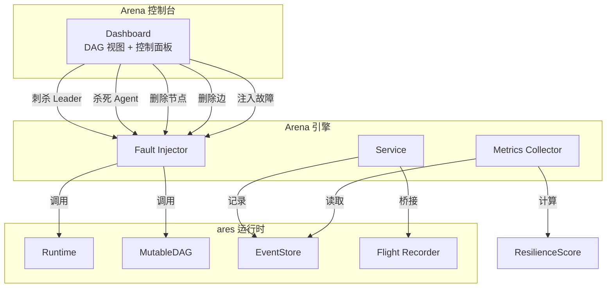
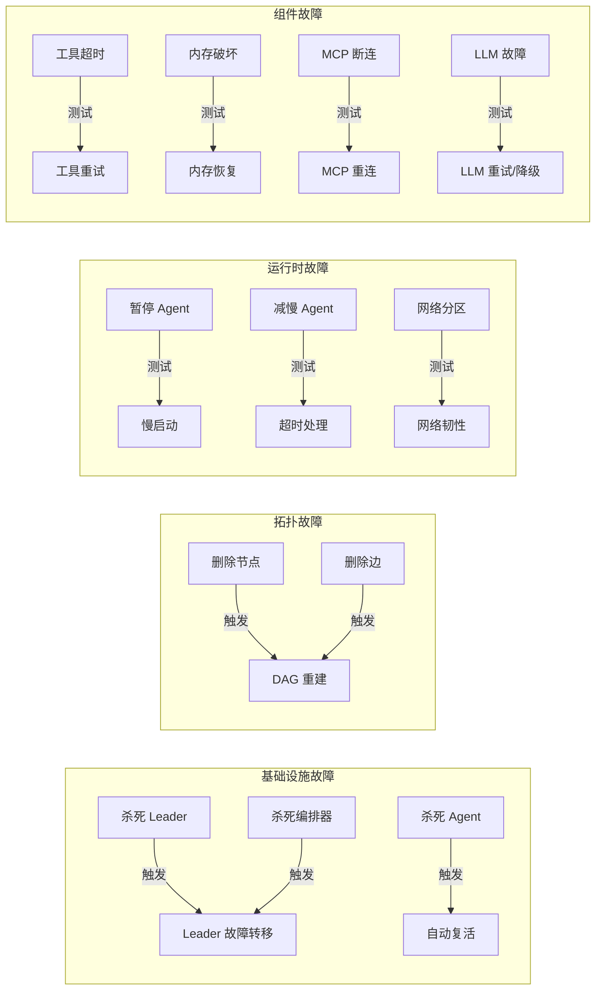
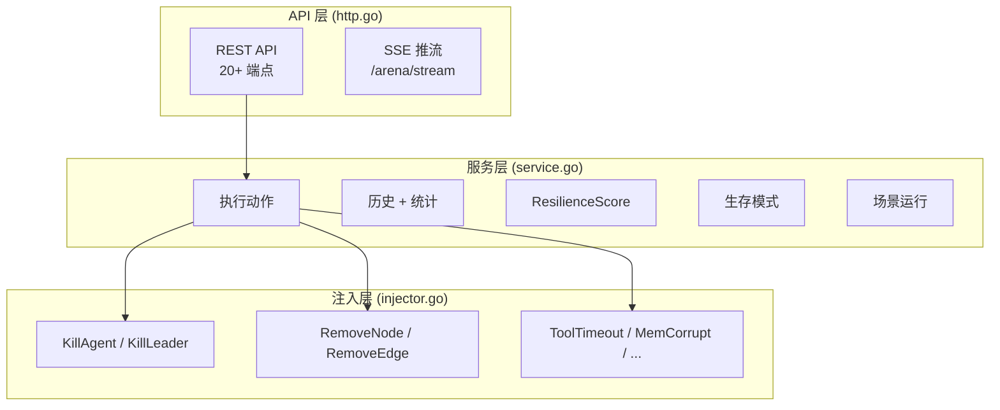
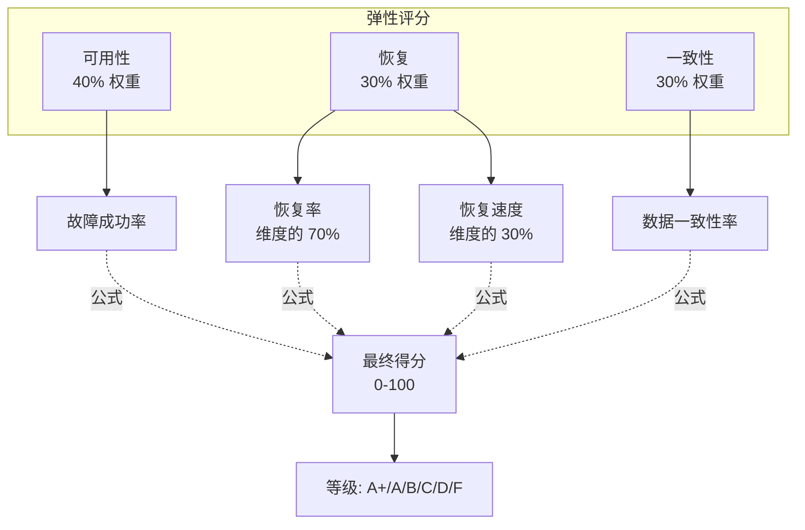
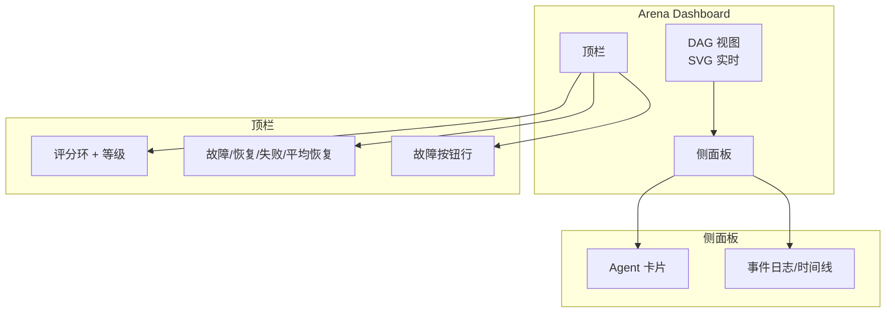
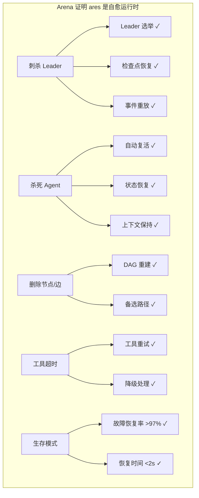

# ares 架构深度解析（九）：Arena / 故障注入 — 故意破坏，见证自愈

> 别的 Agent 框架给你展示的是 Agent 有多聪明：对话流利、推理能力强、工具用得溜。
> ares 展示的是另一件事：**当你故意杀死它的 Agent 时，它能不能活下来。**
> 我管这个叫"秽土转生验证"——在 Dashboard 上点一个按钮，暗杀正在工作的 Agent，看它能不能自己爬起来。

---

## 一、我为什么做了一个"搞破坏"的功能

说起来你可能不信，Arena 模块的灵感来自于一次生产事故。

当时我在测试 Agent 的稳定性，手动 kill 了一个进程。结果发现 Agent 自动复活了，而且继续干之前没干完的活。我当时很兴奋，但转念一想：**这只是我手动测的，能不能自动化测试？**

于是就有了 Arena——一个专门用来"搞破坏"的模块。它不是用来展示 Agent 有多聪明的，是用来展示 Agent 在持续被搞的情况下能不能活下来的。

Arena 的秘密其实很简单：**它不自己实现任何 Runtime、DAG 或恢复逻辑。它只是故意调用现有的危险 API（StopAgent、RemoveNode、RemoveEdge），然后等着看系统自己修好自己。**



核心文件：

| 文件 | 用途 |
|------|------|
| `internal/arena/types.go` | ActionType、Action、Result、Stats |
| `internal/arena/injector.go` | FaultInjector — 包装 Runtime + DAG API |
| `internal/arena/service.go` | Arena Service — 执行动作、记录历史 |
| `internal/arena/http.go` | REST API + SSE 推流 |
| `internal/arena/scenario.go` | 场景编排器 |
| `internal/arena/survival.go` | 生存模式 — 持续随机故障 |
| `internal/arena/metrics.go` | MetricsCollector — 恢复耗时 + 计数 |
| `internal/arena/score.go` | ResilienceScore — 三维评分 |
| `internal/arena/integration.go` | FlightBridge — Arena → Flight Recorder |
| `internal/dashboard/static/app.js` | 前端：DAG 可视化、控制面板、事件日志 |
| `cmd/arena/main.go` | CLI：run / validate / list / survival / inspect / serve |

---

## 二、架构

### 2.1 核心设计原则

Arena **不实现自己的** Runtime、DAG 或恢复系统。它是一个薄层，直接调用已有 API：

```go
func (in *Injector) KillAgent(ctx context.Context, id string) error {
    return in.runtime.StopAgent(ctx, id)
    // 复活由现有的 Resurrection 插件自动处理
}

func (in *Injector) RemoveNode(ctx context.Context, id string) error {
    return in.dag.RemoveNode(ctx, id)
    // MutableDAG 自动重建拓扑
}
```

### 2.2 十三种混沌动作



### 2.3 三层架构



---

## 三、故障注入

### 3.1 注入器设计

`Injector` 依赖两个接口——`RuntimeProvider` 和 `DAGProvider`——它们都是完整 Runtime/DAG 能力的一个子集。这种基于接口的设计意味着 Arena 不需要引入具体的 Runtime 或 DAG 包，只需要很小的 API 面。任何实现这些接口的类型都可以使用，使 Arena 可以轻松地用 mock 进行测试。

### 3.2 刺杀 Leader — 招牌动作

刺杀 Leader 是 Arena 最具冲击力的演示，一次性证明三种能力：

```go
func (in *Injector) KillLeader(ctx context.Context) (string, error) {
    leaderID := ""
    for _, info := range in.runtime.ListAgents() {
        if info.Type == "leader" {
            leaderID = info.ID
            break
        }
    }
    if leaderID == "" {
        return "", ErrLeaderNotFound
    }
    if err := in.runtime.StopAgent(ctx, leaderID); err != nil {
        return "", fmt.Errorf("arena: kill leader %s: %w", leaderID, err)
    }
    return leaderID, nil
}
```

因果链：
1. Arena 调用 `StopAgent("leader-1")`
2. Runtime 标记 Agent 为停止状态
3. Agent goroutine 退出
4. `NotifyAgentDead` 被调用
5. LeaderSupervisor 检测到 Leader 缺失
6. 故障转移触发：选举 → 检查点恢复 → 事件重放
7. 新 Leader 在数秒内被推举并运行

---

## 四、服务层

### 4.1 动作执行

```go
func (s *Service) Execute(ctx context.Context, action Action) Result {
    start := time.Now()
    var err error

    switch action.Type {
    case ActionKillLeader:
        _, err = s.injector.KillLeader(ctx)
    case ActionKillAgent:
        err = s.injector.KillAgent(ctx, action.TargetID)
    // ... 13 种 case
    }

    result := Result{Success: err == nil, Duration: time.Since(start)}
    s.recordMetrics(action.Type, result.Success, result.Duration)
    s.emitEvent(ctx, action, result)
    return result
}
```

每个动作结果都会被发射为 EventStore 中的事件，通过 SSE 推送到 Dashboard 前端实时展示。

---

## 五、弹性评分

### 5.1 三维评分系统



| 分数范围 | 等级 |
|---------|------|
| ≥ 95 | A+ |
| ≥ 90 | A |
| ≥ 80 | B |
| ≥ 70 | C |
| ≥ 60 | D |
| < 60 | F |

---

## 六、场景编排器

YAML 定义混沌动作的编排序列：

```yaml
name: leader-failover-storm
actions:
  - delay: 0s
    action:
      type: kill_leader
  - delay: 8s
    action:
      type: kill_agent
  - delay: 5s
    action:
      type: slow_agent
      metadata:
        duration: 8s
```

两个内置场景：
- **`leader_assassination.yaml`**：4 阶段 — 刺杀 Leader → 验证新 Leader → 随机杀 Agent → 负载下减慢 Agent
- **`cascading_storm.yaml`**：7 阶段 — 网络分区 → 杀死 → 工具超时 → 内存破坏 → MCP 断连 → LLM 故障 → 级联减慢

---

## 七、生存模式

生存模式在配置的持续时间内持续注入随机故障：

```bash
ares arena survival --addr http://localhost:8080 --duration 30m --interval 10s
```

实时输出：

```
Elapsed: 12s         Actions: 1     Score: 100.0 (A+)
Elapsed: 22s         Actions: 2     Score: 97.3 (A+)
```

13 种故障类型随机选择目标。Ctrl+C 停止并打印最终报告。

---

## 八、Dashboard 集成

### 8.1 前端

Arena 标签页提供：



**13 个故障按钮**：☠Leader / ⚙Orch / Kill / ✕Node / ✕Edge / ⏸Pause / ▶Resume / 🐌Slow / 🗡Partition / ⏰Timeout / 📚MemCorrupt / 📱MCP DC / 🧠LLM Fail

**事件日志**实时滚动恢复叙事：

```
10:01:02 ✗ kill_leader → Leader killed
10:01:04 ✓ kill_leader → New leader elected
10:01:06 ✓ workflow → Workflow resumed
```

### 8.2 事后 inspect

```bash
ares arena inspect --addr http://localhost:8080
```

```
═══════════════════════════════════════════════════════
  Arena Inspection Report
═══════════════════════════════════════════════════════

  Score:          92.4 (A)
  Recovery Rate:  92.9%
  Faults:         32 total, 31 recovered, 1 failed
  Diagnostics:
    concurrency_error    3  (37.5%)
    tool_timeout         2  (25.0%)
```

---

## 九、CLI 命令速查

| 命令 | 说明 |
|------|------|
| `ares arena run <scenario.yaml>` | 对远程服务器运行场景 |
| `ares arena validate <scenario.yaml>` | 本地验证场景文件 |
| `ares arena list [dir]` | 列出目录中的场景文件 |
| `ares arena serve [--addr]` | 启动 Arena HTTP 服务器 |
| `ares arena survival [--addr] [--duration]` | 启动生存模式（实时进度） |
| `ares arena inspect [--addr]` | 事后分析报告 |

---

## 十、架构总结

### 设计模式

| 模式 | 位置 | 用途 |
|------|------|------|
| 外观模式 | `Injector` | 将 Runtime + DAG 包装为统一的混沌接口 |
| 策略模式 | `ActionType` → `Service.Execute` | 分发 13 种故障类型 |
| 观察者模式 | SSE 推流 | 实时事件推送至 Dashboard |
| 装饰器模式 | `FlightBridge` | 用飞行记录增强 Arena 动作 |
| 组合模式 | `Scenario` | 多个编排动作作为一次运行 |
| CLI 命令模式 | `cmd/arena/main.go` | 6 个子命令 |

### Arena 证明的自愈能力



---

## 十一、结语

Arena 是我觉得 ares 最有意思的功能。不是因为技术多牛——是因为它展示了别的框架不太会展示的东西：**系统在被持续破坏的时候能不能活下来。**

13 种故障类型、场景编排、生存模式、实时 Dashboard、Flight Recorder 集成、三维弹性评分……这些东西堆在一起，让 `ares arena run cascading_storm.yaml` 不再是一个测试命令——它是一个"看我系统有多抗造"的 Demo。

有一次我给朋友演示：打开 Dashboard，点击"刺杀 Leader"，Agent 挂了……然后 1.4 秒后自动复活。朋友说："卧槽，还带这样的？"

我心想：**对，就是这样。这就是我花这么多时间做这套系统的原因。**

> "故意破坏，见证自愈。"——这是 ares 最令人印象深刻的 Demo，也是我写这个框架最大的成就感来源。
