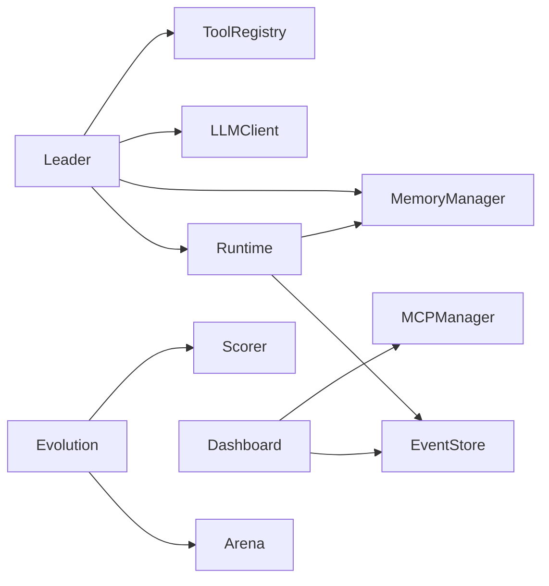

# ares 架构拆解 (XIII)：Bootstrap 与 API 层——无痛接线

每个框架都有那么一个时刻，用户的问题从"怎么调 LLM"变成了"怎么把这些东西接在一起"。那一刻，你需要 bootstrap。

早期，启动 ares 意味着手动创建 15 个对象，按正确顺序互相传递，祈祷没漏掉一个依赖。看起来像这样：

```go
eventStore := events.NewMemoryEventStore()
memMgr, _ := memory.NewMemoryManager(memory.DefaultMemoryConfig())
llmClient, _ := llm.NewClient(llm.Config{...})
leader := leader.New(leader.Config{...}, memMgr, llmClient, ...)
rt := runtime.New(runtime.Config{...}, eventStore, memMgr)
rt.RegisterAgent(leader, func() base.Agent { return leader.New(...) })
rt.Start(ctx)
```

六行接线才能干正事。漏一个依赖？凌晨三点 runtime panic。改一个构造函数签名？修 20 个调用点。

bootstrap 解决了这个问题：`ares, _ := bootstrap.New(ctx, bootstrap.DefaultConfig())`。一行代码。所有依赖接好。所有模块连上。

---

## 问题：依赖地狱

ares 的每个模块都依赖其他模块：



手动接线就像玩积木。顺序搞错？循环依赖。忘了 nil 检查？运行时 panic。

**坦诚反思**：我们考虑过依赖注入框架（Wire、Dig、fx）。它们解决了接线问题，但增加了复杂度和魔法。当启动失败时，你盯着一个从没见过的生成文件，试图理解为什么 DI 容器解析不了 `MemoryManager`。我宁可有我能读和调试的显式代码。

---

## 设计：接口先行

API 层有一条规则：**没有实现**。

```
api/
├── core/        # 只有接口：AgentService、Runtime、Evolution、Arena……
├── errors/      # 错误类型
├── client/      # Go SDK（调服务器）
├── handler/     # HTTP handler（薄委托）
├── router/      # 路由注册
└── bootstrap/   # 工厂——接线 internal/ 的实现
```

`api/core/` 定义模块*做什么*，不定义*怎么做*。`Runtime` 接口说"你可以启动、停止、注册 Agent、获取统计"。它不说 Agent 是 goroutine、线程还是远程进程。

```go
// api/core/runtime.go
type Runtime interface {
    RegisterAgent(agent Agent, factory AgentFactory)
    StartAgent(ctx context.Context, agent Agent) error
    StopAgent(ctx context.Context, agentID string) error
    GetAgent(agentID string) Agent
    Start(ctx context.Context) error
    Stop() error
    Stats() RuntimeStats
}
```

实现在 `internal/ares_runtime/manager.go`。bootstrap 把它们接在一起。

**坦诚反思**：我们有 7 个服务实现在 `api/service/` 里。它们充满了业务逻辑——内存缓存、重试循环、错误处理。这违背了 API 层的目的。v0.2.4 把所有实现移到了 `internal/`，`api/` 只留纯契约。迁移很痛苦（30+ 文件移动，50+ import 路径更新），但结果干净：`api/` 是契约，`internal/` 是实现。

---

## Bootstrap：一行搞定

```go
// api/bootstrap/bootstrap.go
func New(ctx context.Context, cfg *Config) (*ARES, error) {
    eventStore := ares_events.NewMemoryEventStore()
    rt := ares_runtime.New(cfg.Runtime, eventStore, nil)
    memMgr, _ := memory.NewMemoryManager(cfg.Memory)
    evoSvc, _ := evolution.NewService(cfg.Evolution)
    arenaSvc := arena.NewService(cfg.ArenaInjector, eventStore)
    mcpMgr, _ := mcp.NewMCPManager(cfg.MCP, nil)
    dashOrch := dashboard.NewOrchestrator(nil, nil)
    flightRec := flight.NewFlightRecorder(*cfg.Flight)

    return &ARES{
        Runtime:    rt,
        Memory:     memMgr,
        Evolution:  evoSvc,
        Arena:      arenaSvc,
        MCP:        mcpMgr,
        Dashboard:  dashOrch,
        Flight:     flightRec,
        EventStore: eventStore,
    }, nil
}
```

`ARES` 结构体是容器——持有所有模块的引用。直接访问：

```go
ares, _ := bootstrap.New(ctx, bootstrap.DefaultConfig())
ares.Start(ctx)
ares.Runtime.Stats()
ares.RunEvolution(ctx, 10)
ares.ExecuteArenaAction(ctx, action)
```

**坦诚反思**：bootstrap 不是依赖注入容器。它是硬编码接线的工厂函数。如果你需要自定义依赖（比如用 PostgreSQL 事件存储代替内存），你自己接线。bootstrap 覆盖 90% 的场景。剩下 10% 可以直接调构造函数。

---

## 模块日志：谁说的？

ares 的每个模块都有作用域 logger：

```go
// internal/logger/logger.go
func Module(name string) *slog.Logger {
    return slog.Default().With("module", name)
}

// internal/ares_runtime/log.go
var log = logger.Module("runtime")
```

现在 Runtime 的每条日志带 `module=runtime`。Workflow 带 `module=workflow`。Memory 带 `module=memory`。

听起来微不足道，直到凌晨三点你盯着日志：
```
INFO started agents=3
INFO started agents=2
INFO started agents=1
```

哪个模块启动了哪些 Agent？没有模块标签，你不知道。有了：
```
INFO started agents=3 module=runtime
INFO started agents=2 module=workflow
INFO started agents=1 module=memory
```

**坦诚反思**：我们考虑过通过 context 传递 logger。Context 日志"更正确"——自动沿调用链传播。但实际上 Runtime 不会调 Workflow 不会调 Memory 形成整齐的链。它们是平级的。包级 logger 是务实选择。如果你需要关联，那是 trace ID 干的事。

---

## Event.ModuleName：谁干的？

事件系统也有同样的问题。回放事件流时：

```json
{"type": "step.started", "payload": {"step_id": "s1"}}
{"type": "tool.call.completed", "payload": {"tool": "search"}}
```

`step.started` 是谁发的？工作流引擎？运行时？插件总线？payload 里没说。

给 `Event` 结构体加 `ModuleName` 迫使签名变更：

```go
// 之前：来源模糊
Emit(ctx, store, streamID, eventType, payload)

// 之后：来源明确
Emit(ctx, store, streamID, eventType, "runtime", payload)
```

这破坏了所有调用者。30 多个。但这是正确的决定——在调用点显式声明来源，意味着你不可能在不表明身份的情况下发出事件。

---

## 教训

API 层和 bootstrap 不是光鲜的功能。它们不好演示。你不能给投资人看一个工厂函数说"看，它接线依赖！"

但它们是"用着爽"和"想砸电脑"之间的区别。每分钟花在接线上的时间，就是一分钟没花在用户真正的问题上。

**最好的 API 是你注意不到的那个。** 你调 `bootstrap.New()`，得到一个能用的系统，专注你的 Agent 逻辑。接线是隐形的。这就是目的。
