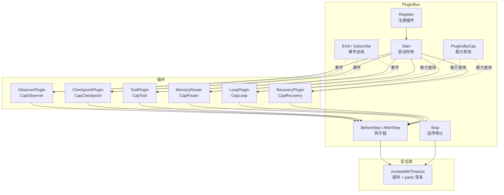
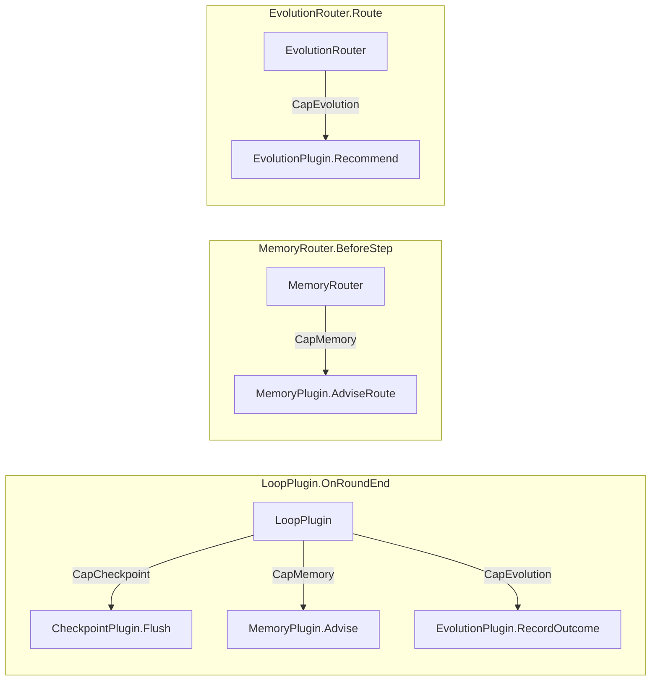
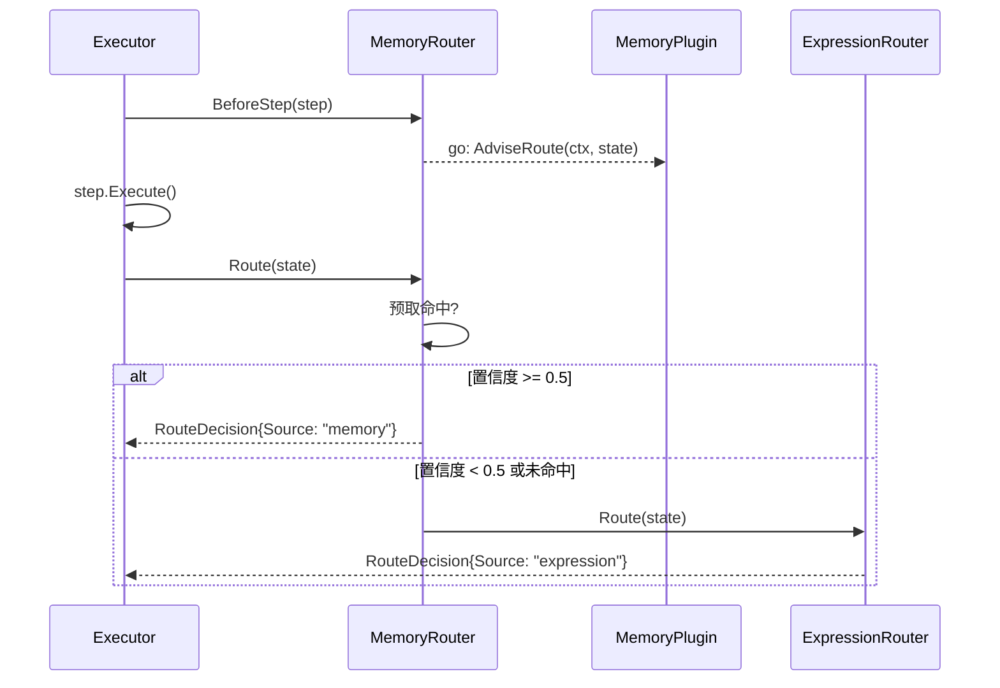

# ares 架构拆解（XIV）：插件系统——不改代码就能扩展

> 有一天我在 executor 里写了第四个 `if` 分支来处理"执行完一步之后要不要记录 checkpoint"这件事，突然意识到：这坨代码已经没法看了。
> 每加一个功能，executor 就膨胀一圈。记录日志？加个 if。路由决策？加个 switch。记忆预取？加个 goroutine。
> executor 从一个"执行步骤"的简单循环，变成了一个什么都管的上帝对象。
> 我需要一种机制，让 executor 只管执行，其他事情让别人来——但"别人"是谁，executor 不应该知道。

---

## 一、问题：executor 不该是个上帝对象

最早的 executor 长这样（伪代码）：

```go
for _, step := range workflow.Steps {
    // 记录开始事件
    eventStore.Append(streamID, EventStepStarted, ...)

    // 执行步骤
    result := step.Execute(ctx)

    // 记录结束事件
    eventStore.Append(streamID, EventStepCompleted, ...)

    // 保存 checkpoint
    checkpoint.Save(executionID, step, result)

    // 记录工具调用
    if toolName, ok := result.Metadata["tool_name"]; ok {
        collector.RecordTool(step.ID, toolName, ...)
    }

    // 路由决策
    nextStep := router.Route(ctx, result)

    // 记忆预取
    if memPlugin != nil {
        memPlugin.AdviseRoute(ctx, state)
    }
}
```

每加一个功能，executor 就多一个 `if`。更糟糕的是，这些功能之间还有隐式依赖——checkpoint 要在事件记录之后、路由决策之前保存；记忆预取要在步骤开始时异步启动，步骤结束后同步获取结果。这些时序关系全靠代码顺序保证，没有任何声明式的约束。

我当时的想法是：**把这些"旁路逻辑"抽成独立的模块，executor 只在固定的扩展点调用它们。** 扩展点是什么？步骤执行前、步骤执行后。就这么简单。

但"简单"的设计很快就变复杂了——模块之间怎么发现彼此？出错了怎么办？超时了怎么办？一个模块 panic 了会不会拖垮整个执行流程？

---

## 二、整体架构：PluginBus 是插件的家



`PluginBus` 是整个插件系统的中枢。它做了四件事：

1. **注册和生命周期管理**——Register、Start、Stop
2. **钩子链调度**——BeforeStep、AfterStep，每个钩子都包裹在超时和 panic 恢复里
3. **事件总线**——Emit/Subscribe，非阻塞，带过滤
4. **能力发现**——PluginsByCap，插件之间松耦合协作

核心代码在 `internal/ares_runtime/bus.go`，结构体定义：

```go
type PluginBus struct {
    plugins       []RuntimePlugin
    hooks         []namedHook
    caps          map[Capability][]RuntimePlugin
    subscribers   []*subscriber
    mu            sync.RWMutex
    started       bool
    pluginTimeout time.Duration
    logger        *slog.Logger
}
```

`caps` 字段是能力索引——注册时自动按 `Capabilities()` 建立倒排索引，运行时通过 `PluginsByCap()` 查询。`hooks` 字段存放实现了 `WorkflowHook` 接口的插件，**注册时自动检测**，不需要显式声明。

---

## 三、RuntimePlugin 接口：四方法，够用就好

```go
// internal/ares_runtime/plugin.go
type RuntimePlugin interface {
    Name() string
    Capabilities() []Capability
    Start(ctx context.Context, bus EventBus) error
    Stop(ctx context.Context) error
}
```

四个方法。Name 返回唯一标识，Capabilities 返回能力标签，Start 初始化（接收 EventBus 用于发/收事件），Stop 清理资源。

为什么 Start 接收 `EventBus` 而不是 `*PluginBus`？因为我不想让插件依赖 Bus 的具体实现。插件只需要能发事件、收事件就够了——不需要知道 Bus 内部有 hooks、有 caps、有 subscribers。

**反思**：Start 的注释里写了"MUST be non-blocking"，但没有任何代码强制这一点。如果一个插件在 Start 里阻塞了，整个 Bus 的 Start 流程就会卡住。虽然 `invokeWithTimeout` 会兜底（30 秒后超时），但这 30 秒内其他插件都启动不了。应该考虑并发启动，但并发启动又引入了依赖顺序问题——比如 CheckpointPlugin 依赖 ExecutionCollector，如果它在 Collector 之前 Start 就会 nil pointer。目前用顺序启动回避了这个问题，但牺牲了启动速度。

---

## 四、注册时的自动检测：你实现了 WorkflowHook？那自动加入钩子链

这是整个设计里我最喜欢的一个细节。注册代码（`bus.go` 第 62-86 行）：

```go
func (b *PluginBus) Register(plugin RuntimePlugin) error {
    // ... nil 检查、重复名检查、已启动检查 ...

    b.plugins = append(b.plugins, plugin)
    for _, cap := range plugin.Capabilities() {
        b.caps[cap] = append(b.caps[cap], plugin)
    }
    // 自动检测：如果插件实现了 WorkflowHook，自动注册为钩子
    if hook, ok := plugin.(WorkflowHook); ok {
        b.hooks = append(b.hooks, namedHook{pluginName: plugin.Name(), hook: hook})
    }
    return nil
}
```

`CheckpointPlugin`、`ToolPlugin`、`MemoryRouter`、`LoopPlugin`、`InterruptPlugin`、`ArenaPlugin`——这些插件都同时实现了 `RuntimePlugin` 和 `WorkflowHook`。注册时 Bus 自动发现它们有 BeforeStep/AfterStep 方法，就把它们加入钩子链。不需要任何额外配置。

这意味着：**你想加一个"步骤执行前后做点什么"的逻辑，只需要实现 WorkflowHook 接口，Register 一下就行。** executor 的代码一行都不用改。

---

## 五、WorkflowHook：BeforeStep / AfterStep 拦截器

```go
// internal/ares_runtime/plugin.go
type WorkflowHook interface {
    BeforeStep(ctx context.Context, executionID string, step *Step) error
    AfterStep(ctx context.Context, executionID string, result *StepResult) error
}
```

钩子是同步调用的——executor 调 `bus.BeforeStep()`，Bus 遍历所有注册的钩子，逐个调用。每个钩子都包裹在 `invokeWithTimeout` 里。关键的设计决策：**log-and-continue**。

```go
// internal/ares_runtime/bus.go 第 156-175 行
func (b *PluginBus) BeforeStep(ctx context.Context, executionID string, step *Step) error {
    // ... 复制钩子列表 ...

    var errs []error
    for _, nh := range hooks {
        if err := invokeWithTimeout(ctx, b.pluginTimeout, nh.pluginName+":beforeStep", func(sctx context.Context) error {
            return nh.hook.BeforeStep(sctx, executionID, step)
        }); err != nil {
            b.logger.Warn("runtime: before step hook failed (continuing)",
                "plugin", nh.pluginName, "error", err,
            )
            errs = append(errs, fmt.Errorf("runtime: before step hook %s: %w", nh.pluginName, err))
        }
    }
    return errors.Join(errs...)
}
```

一个钩子失败了（报错、panic、超时），不影响其他钩子执行。最终返回 `errors.Join` 聚合的所有错误。executor 拿到这个错误后，可以选择忽略（因为步骤本身已经执行完了），也可以记录到错误日志。

为什么是 log-and-continue 而不是 fail-fast？因为钩子是"旁路逻辑"——checkpoint 没保存成功，不应该阻止下一个步骤执行；tool 记录失败了，不应该中断整个工作流。旁路逻辑的失败不应该影响主路径。

---

## 六、invokeWithTimeout：每个插件调用的安全气囊

这是整个系统的安全基石（`bus.go` 第 300-324 行）：

```go
func invokeWithTimeout(ctx context.Context, timeout time.Duration, pluginName string, fn func(context.Context) error) (err error) {
    callCtx, cancel := context.WithTimeout(ctx, timeout)
    defer cancel()

    done := make(chan error, 1)
    go func() {
        defer func() {
            if r := recover(); r != nil {
                done <- &PluginError{
                    PluginName: pluginName,
                    Err:        ErrPluginPanic,
                    Recovered:  r,
                }
            }
        }()
        done <- fn(callCtx)
    }()

    select {
    case err = <-done:
        return err
    case <-callCtx.Done():
        return fmt.Errorf("%w: %w", ErrPluginTimeout, callCtx.Err())
    }
}
```

三件事：
1. **超时控制**——`context.WithTimeout`，默认 30 秒
2. **panic 恢复**——`defer recover()`，把 panic 值包装成 `PluginError`
3. **非阻塞等待**——`select` 同时等 done channel 和 context 取消

`PluginError` 是自定义错误类型，保留了插件名和 panic 原始值：

```go
type PluginError struct {
    PluginName string
    Err        error
    Recovered  any
}

func (e *PluginError) Error() string {
    if e.Recovered != nil {
        return fmt.Sprintf("plugin %q: %v (panic: %v)", e.PluginName, e.Err, e.Recovered)
    }
    return fmt.Sprintf("plugin %q: %v", e.PluginName, e.Err)
}
```

**反思**：`invokeWithTimeout` 启动了一个 goroutine，如果插件真的卡死了（比如 `select {}` 永久阻塞），goroutine 泄漏是不可避免的。context 取消后，主调方拿到了 timeout 错误，但那个 goroutine 还活着，直到进程退出。ArenaPlugin 故意利用了这个特性来测试超时场景——`select {}` 就是模拟"插件卡死"。但在生产环境里，如果插件真的卡死了，你只能靠进程重启来回收 goroutine。这是一个已知的、被接受的局限。

---

## 七、EventBus：非阻塞的事件总线

```go
// internal/ares_runtime/plugin.go
type EventBus interface {
    Emit(ctx context.Context, streamID string, eventType ares_events.EventType, moduleName string, payload map[string]any)
    Subscribe(ctx context.Context, filter ares_events.EventFilter) (<-chan *ares_events.Event, error)
}
```

PluginBus 本身就实现了 EventBus。插件在 Start 时拿到 EventBus 引用，之后就可以发事件、收事件了。

### 7.1 非阻塞 Emit

```go
// internal/ares_runtime/bus.go 第 204-237 行
func (b *PluginBus) Emit(ctx context.Context, streamID string, eventType ares_events.EventType, moduleName string, payload map[string]any) {
    evt := &ares_events.Event{ /* ... */ }

    // 复制订阅者列表（读锁）
    b.mu.RLock()
    subs := make([]*subscriber, len(b.subscribers))
    copy(subs, b.subscribers)
    b.mu.RUnlock()

    for _, s := range subs {
        if !matchFilter(evt, s.filter) {
            continue
        }
        func() {
            defer func() { _ = recover() }()
            select {
            case s.ch <- evt:
            case <-ctx.Done():
                return
            default:
                // 缓冲满了就丢弃
            }
        }()
    }
}
```

三个关键设计：

1. **非阻塞**——`select` 的 `default` 分支保证 Emit 永远不会阻塞。缓冲满了？丢。这是刻意的——事件是旁路信号，不应该反压主路径。
2. **defer recover()**——防止 send-on-closed-channel panic。订阅者的 cleanup goroutine 可能在 Emit 复制列表和实际发送之间关闭了 channel。
3. **过滤**——每个订阅者带一个 `EventFilter`，匹配 `Types` 和 `StreamIDs`。空数组匹配一切。

### 7.2 Subscribe 与自动清理

```go
// internal/ares_runtime/bus.go 第 242-268 行
func (b *PluginBus) Subscribe(ctx context.Context, filter ares_events.EventFilter) (<-chan *ares_events.Event, error) {
    ch := make(chan *ares_events.Event, 64)  // 缓冲 64
    sub := &subscriber{ch: ch, filter: filter}

    b.mu.Lock()
    b.subscribers = append(b.subscribers, sub)
    b.mu.Unlock()

    // context 取消时自动清理
    go func() {
        <-ctx.Done()
        b.mu.Lock()
        defer b.mu.Unlock()
        for i, s := range b.subscribers {
            if s == sub {
                b.subscribers = append(b.subscribers[:i], b.subscribers[i+1:]...)
                close(ch)
                return
            }
        }
    }()

    return ch, nil
}
```

订阅者不需要手动取消订阅——传入的 context 取消后，cleanup goroutine 自动移除订阅者并关闭 channel。这避免了"订阅者忘了取消订阅导致内存泄漏"的经典问题。

---

## 八、能力发现：PluginsByCap 的松耦合魔法

```go
// internal/ares_runtime/bus.go 第 271-281 行
func (b *PluginBus) PluginsByCap(cap Capability) []RuntimePlugin {
    b.mu.RLock()
    defer b.mu.RUnlock()
    plugins := b.caps[cap]
    if len(plugins) == 0 {
        return nil
    }
    result := make([]RuntimePlugin, len(plugins))
    copy(result, plugins)
    return result
}
```

返回防御性拷贝——调用方改不了内部数据。

这个机制有多重要？举几个例子：

- `MemoryRouter` 在 `BeforeStep` 里通过 `PluginsByCap(CapMemory)` 找到记忆插件，异步预取路由建议
- `EvolutionRouter` 通过 `PluginsByCap(CapEvolution)` 找到进化插件，获取路由偏好
- `LoopPlugin.OnRoundEnd` 通过 `PluginsByCap(CapCheckpoint)` 找到 checkpoint 插件调 Flush，通过 `PluginsByCap(CapMemory)` 通知记忆插件，通过 `PluginsByCap(CapEvolution)` 记录执行结果



插件之间不需要知道彼此的具体类型——只需要知道能力标签。`LoopPlugin` 不关心 CheckpointPlugin 的具体实现，它只关心"谁有 `CapCheckpoint` 能力"。这就是**依赖倒置**在运行时的体现。

---

## 九、ExecutionCollector：线程安全的数据聚合器

```go
// internal/ares_runtime/collector.go
type ExecutionCollector struct {
    mu           sync.Mutex
    executionID  string
    routeHistory []RouteRecord
    toolHistory  []ToolRecord
    memoryHits   []MemoryHitRecord
    interruptLog []InterruptRecord
    errorLog     []ErrorRecord
}
```

五种记录：路由决策、工具调用、记忆命中、中断操作、错误日志。每个 Record 方法都加锁，每个 History 访问器都返回防御性拷贝。

Collector 的核心集成点是 `MergeInto`——把收集到的数据灌入 `ExperienceCheckpoint`，然后被 CheckpointPlugin 持久化：

```go
// internal/ares_runtime/collector.go 第 227-264 行
func (c *ExecutionCollector) MergeInto(ckpt *ExperienceCheckpoint) {
    c.mu.Lock()
    defer c.mu.Unlock()
    for _, r := range c.routeHistory {
        ckpt.RouteHistory = append(ckpt.RouteHistory, RouteEntry{
            FromStepID: r.StepID,
            ToStepID:   r.Decision,
            Reason:     r.Reason,
        })
    }
    // ... toolHistory, memoryHits, interruptLog, errorLog ...
}
```

`MergeInto` 之后紧跟 `Reset()`——防止重复数据在下次 save 时被重复灌入。

测试里有一个并发安全测试：三个 goroutine 同时做 100 次 Record 和 Read，验证不会有数据竞争。这种测试看起来无聊，但插件系统的钩子是被 executor 的 goroutine 调用的，而 checkpoint save 可能在另一个 goroutine 里触发——并发安全不是可选项。

---

## 十、内置插件巡礼

### 10.1 ObserverPlugin——事件持久化

订阅工作流生命周期事件（started/completed/failed、step started/completed/failed、checkpoint saved），写入 EventStore。Start 时创建独立的 `context.WithCancel(context.Background())`，这样即使 Start 的 context 超时了，后台的事件循环也不会被杀死。Capabilities: `[CapObserver]`。

### 10.2 CheckpointPlugin——快照保存

在 BeforeStep/AfterStep 时保存 `ExperienceCheckpoint` 快照。支持可配置的 flush 间隔——`WithFlushInterval(0)` 表示每次都存，`WithFlushInterval(5)` 表示每 5 次钩子调用存一次。实现了 `Flusher` 接口，LoopPlugin 可以在每轮结束时强制 flush。Capabilities: `[CapCheckpoint]`。

### 10.3 ToolPlugin——工具调用记录

AfterStep 时检查 `result.Metadata` 里的 `PayloadKeyToolName`，如果有就通过 Collector 记录一次工具调用。维护一个工具名注册表，`RegisterTool` / `IsRegistered` 用于工具白名单。Capabilities: `[CapTool]`。

### 10.4 ExpressionRouter——规则路由

默认的路由插件。按顺序评估一组 `RouteRule`，返回第一个匹配的：

```go
type RouteRule struct {
    FromStepID string                                           // 空 = 匹配任何来源
    ToStepID   string
    Condition  func(output string, vars map[string]any) bool
    Reason     string
}
```

Capabilities: `[CapRouter]`。

### 10.5 MemoryRouter——记忆增强路由

嵌入 ExpressionRouter，增加了记忆感知能力。**关键创新：异步预取。** BeforeStep 时启动一个后台 goroutine 查询 MemoryPlugin（通过 `PluginsByCap(CapMemory)` 发现），Route() 被调用时直接使用预取好的结果。如果记忆的置信度低于阈值（默认 0.5），降级到表达式规则。



### 10.6 EvolutionRouter——进化增强路由

嵌入 ExpressionRouter，通过 `PluginsByCap(CapEvolution)` 找到进化插件，获取 `RuntimeRecommendation`。`AgentStepResolver` 函数把推荐的 `PreferredAgent` 名映射到目标步骤 ID。只处理置信度 >= 0.3 的推荐。`RouterWeight` 是偏向信号而非目标步骤，所以只有 weight 没有 agent 的推荐会 fallthrough 到表达式规则。

### 10.7 FallbackRouter——路由降级链

组合多个 RouterPlugin，按顺序尝试。第一个返回非 nil 决策的路由器获胜。所有路由器都返回 nil？返回一个 `Source: "fallback"` 的空决策，告诉 executor 走默认 DAG 遍历。子路由器报错？日志记录，跳过，继续下一个。

### 10.8 LoopPlugin——进化外循环管理

管理"整个 DAG 重新执行 + 变异"的外循环。不驱动循环本身（那是 executor 的事），提供两个关键方法：

- `ShouldExecuteRound(nextRound, vars)`——检查最大迭代次数和 until 条件
- `OnRoundEnd(ctx, round, executionID)`——每轮结束时的编排工作：flush checkpoint、通知 memory、记录 evolution outcome

三个 companion 插件全靠 `PluginsByCap` 发现。

### 10.9 BasicRecoveryPlugin——基于白名单的恢复

```go
type RecoveryPlugin interface {
    RuntimePlugin
    ShouldRecover(ctx context.Context, failure StepFailure, state ExecutionState) bool
}
```

`AllowStep(stepID)` / `RevokeStep(stepID)` 管理白名单。只有白名单里的步骤失败时才会触发恢复。`RecoverSnapshotOrEvents` 辅助方法提供"先快照、再事件"的恢复策略。Capabilities: `[CapRecovery]`。

### 10.10 InterruptPlugin——HITL 中断记录

观察人机交互生命周期事件。AfterStep 时检查 `result.Metadata` 里的中断动作和反馈，记录到 Collector，发出 `EventInterruptCreated`。Capabilities: nil（纯观测插件）。

### 10.11 ArenaPlugin——故障注入

用于健壮性测试的插件。支持三种故障类型：

```go
case FaultPluginPanic:
    panic(fmt.Sprintf("arena: injected panic for plugin %q", f.name))
case FaultPluginTimeout:
    select {} // 永久阻塞——bus 的 timeout 机制会介入
case FaultPluginError:
    return fmt.Errorf("%w: %s", ErrFaultInjected, f.name)
```

`ScheduleFault(pluginName, faultType)` 安排故障，`CancelFault(pluginName)` 取消。测试里用它验证 invokeWithTimeout 的 panic 恢复和超时机制是否正常工作。Capabilities: nil。

---

## 十一、Stop 的逆序关闭

一个容易被忽略但很重要的细节——Stop 是**逆序**关闭的：

```go
// internal/ares_runtime/bus.go 第 115-142 行
func (b *PluginBus) Stop(ctx context.Context) error {
    // ...
    for i := len(b.plugins) - 1; i >= 0; i-- {
        p := b.plugins[i]
        if err := invokeWithTimeout(ctx, b.pluginTimeout, p.Name(), func(sctx context.Context) error {
            return p.Stop(sctx)
        }); err != nil {
            // 记录错误，继续关闭下一个
        }
    }
}
```

为什么逆序？因为后注册的插件可能依赖先注册的插件。比如 LoopPlugin 依赖 CheckpointPlugin——LoopPlugin 后注册，Stop 时先关闭 LoopPlugin（它需要在关闭前 flush checkpoint），再关闭 CheckpointPlugin。如果正序关闭，CheckpointPlugin 先停了，LoopPlugin 的 flush 就会失败。

**反思**：这个"后注册依赖先注册"的隐式假设没有被文档化。如果有人调整了注册顺序，Stop 的正确性就可能被破坏。更好的做法是显式声明依赖图，按拓扑序关闭。但目前的规模下（十几个插件），手动维护注册顺序的负担还可以接受。

---

## 十二、坦诚反思：设计权衡与已知问题

### 12.1 能力发现是运行时的，不是编译时的

`PluginsByCap(CapMemory)` 返回 `[]RuntimePlugin`，调用方需要做类型断言才能使用具体接口：

```go
memPlugins := pb.PluginsByCap(CapMemory)
mp, ok := memPlugins[0].(MemoryPlugin)
```

如果注册的插件不满足 `MemoryPlugin` 接口，类型断言会 panic 或返回 false。这个错误只在运行时暴露。编译时无法保证"声明了 `CapMemory` 的插件一定实现了 `MemoryPlugin` 接口"。

**缓解措施**：在 `Register` 时可以加一个校验——如果你声明了 `CapMemory`，Bus 检查你是否实现了 `MemoryPlugin`。但这又引入了 Bus 对具体接口的感知，破坏了松耦合。目前的选择是"信任插件开发者"。

### 12.2 事件丢弃是特性还是 bug？

Emit 在缓冲满时静默丢弃事件。这意味着在高负载下，ObserverPlugin 可能漏掉一些事件，CheckpointPlugin 可能收不到 checkpoint saved 的通知。

设计意图是"旁路逻辑不反压主路径"。但如果你把事件用于审计追踪（合规要求），丢事件就是不可接受的。

**可能的改进**：区分"可丢弃事件"和"关键事件"。关键事件用同步 Emit，可丢弃事件用非阻塞 Emit。但这会增加 API 复杂度。

### 12.3 钩子顺序是注册顺序，没有优先级

钩子按注册顺序依次执行。如果你需要"CheckpointPlugin 一定在 ToolPlugin 之前执行"，你必须控制注册顺序。没有优先级机制，没有 `Before(hook)` / `After(hook)` 的声明式排序。

在当前规模下这不是问题——十几个插件，手动控制注册顺序足够了。但如果插件数量增长到几十个，这就成了维护负担。

### 12.4 goroutine 泄漏的妥协

`invokeWithTimeout` 在插件卡死时会泄漏 goroutine。`Subscribe` 的 cleanup goroutine 在 context 取消前一直活着。ObserverPlugin 的后台事件循环用 `context.Background()` 创建独立 context，需要显式调 `Stop` 才能回收。

这些是 Go 并发模型的固有约束——没有类似 Java 的 `Thread.interrupt()` 机制。我们能做的就是在 Stop 时尽量清理，接受"极端情况下可能有泄漏"的现实。

### 12.5 Collector 的 Reset 时机

`MergeInto` 之后紧跟 `Reset()`。如果在 MergeInto 和 Reset 之间有新的 Record 调用（并发场景），这些记录会被 Reset 丢掉。虽然概率极低（时间窗口极短），但在理论上是可能的。

**理想方案**：MergeInto 和 Reset 合并成一个原子操作。当前实现用的是 `sync.Mutex`，但 MergeInto 和 Reset 是两个独立的方法调用。

---

## 十三、已知问题与设计缺陷

**1. 插件启动顺序无显式依赖声明**

注册顺序即启动顺序、即关闭顺序。没有依赖图、没有拓扑排序。如果两个插件有循环依赖，无法表达。

**2. EventBus 不支持通配符过滤**

`EventFilter` 的 `Types` 和 `StreamIDs` 是精确匹配列表。想订阅"所有 step.* 事件"需要手动枚举。不支持前缀匹配或通配符。

**3. RouterPlugin 和 RecoveryPlugin 的接口不在 plugin.go 里**

这两个接口定义在 plugin.go 里，但它们的返回类型（`RouteDecision`、`StepFailure`）定义在 types.go 里。找一个路由器的完整接口定义需要翻两个文件。应该考虑把路由相关的类型集中到一个文件。

**4. FallbackRouter 的错误处理过于宽松**

子路由器报错时，FallbackRouter 只是日志记录然后跳过。如果所有子路由器都报错，最终返回一个空决策——executor 会走默认 DAG 遍历。这在某些场景下是错误行为（比如路由失败应该终止执行，而不是盲目继续）。

**5. Capability 是字符串常量，没有编译时保证**

`CapMemory` 是一个 `string` 类型的常量。拼写错误（比如 `"memroy"`）在编译时不会被捕获。应该考虑用结构体或枚举，但 Go 的 type system 对这种约束支持有限。

---

## 十四、架构总结

| 模式 | 解决的问题 | 代价 |
|------|-----------|------|
| PluginBus 集中注册 | executor 不再是上帝对象 | 多了一层间接性 |
| 自动 WorkflowHook 检测 | 零配置加入钩子链 | 依赖类型断言，运行时才发现错误 |
| invokeWithTimeout | panic 不扩散、超时不卡死 | 极端情况下 goroutine 泄漏 |
| 非阻塞 Emit | 旁路不反压主路径 | 高负载下事件可能丢失 |
| PluginsByCap 能力发现 | 插件间松耦合 | 运行时类型断言，编译时无保证 |
| log-and-continue 钩子策略 | 单个插件故障不影响执行 | 错误可能被忽略 |
| 逆序 Stop | 后注册插件先关闭 | 依赖隐式的注册顺序 |
| ExecutionCollector | 线程安全的数据聚合 | MergeInto/Reset 之间的竞态窗口 |

回到最开始的问题——"怎么让 executor 不再膨胀"。答案是：**把旁路逻辑抽成插件，让 executor 只在 BeforeStep 和 AfterStep 两个扩展点调用 Bus。** 插件之间通过能力标签发现彼此，通过事件总线通信，通过超时和 panic 恢复保证安全。

executor 从一个什么都管的上帝对象，变成了一个干净的循环：执行步骤、调钩子、处理结果。其他事情——日志、checkpoint、路由、记忆、进化、恢复——全部交给插件。

**不改代码就能扩展**，这句话的代价是：你需要信任插件开发者遵守 Start 的非阻塞约定、Capabilities 的接口契约、以及事件缓冲满了会被丢弃的现实。这些信任关系没有编译时保证，只有运行时约定和测试覆盖。

但在 Agent 框架的语境下，这个 trade-off 是值得的。因为扩展性比安全性更重要——你总能通过测试和 ArenaPlugin 故障注入来验证插件的健壮性，但你无法在编译时预见未来需要什么扩展点。

---

**附录：关键文件索引**

| 组件 | 文件路径 |
|------|----------|
| RuntimePlugin 接口 | `internal/ares_runtime/plugin.go` |
| WorkflowHook 接口 | `internal/ares_runtime/plugin.go` |
| EventBus 接口 | `internal/ares_runtime/plugin.go` |
| MemoryPlugin / EvolutionPlugin 接口 | `internal/ares_runtime/plugin.go` |
| PluginBus 实现 | `internal/ares_runtime/bus.go` |
| 超时与 panic 恢复 | `internal/ares_runtime/bus.go` (invokeWithTimeout) |
| 错误类型 | `internal/ares_runtime/errors.go` |
| ExecutionCollector | `internal/ares_runtime/collector.go` |
| ObserverPlugin | `internal/ares_runtime/observer.go` |
| CheckpointPlugin | `internal/ares_runtime/checkpoint.go` |
| ToolPlugin | `internal/ares_runtime/tool.go` |
| ExpressionRouter | `internal/ares_runtime/router.go` |
| MemoryRouter | `internal/ares_runtime/router_memory.go` |
| EvolutionRouter | `internal/ares_runtime/router_evolution.go` |
| FallbackRouter | `internal/ares_runtime/router_fallback.go` |
| LoopPlugin | `internal/ares_runtime/loop.go` |
| BasicRecoveryPlugin | `internal/ares_runtime/recovery.go` |
| InterruptPlugin | `internal/ares_runtime/interrupt.go` |
| ArenaPlugin | `internal/ares_runtime/arena.go` |
| EvolutionPlugin 实现 | `internal/ares_runtime/evolution_plugin.go` |
