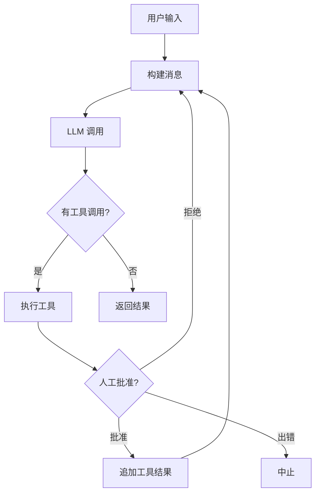
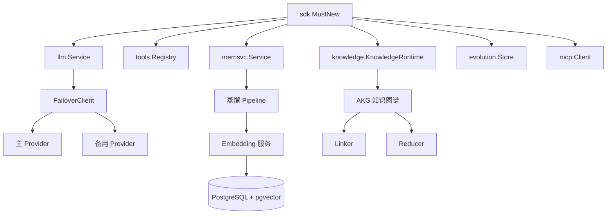

# ares 架构拆解 (XVII)：SDK 层——一行代码启动一个 Agent

每个框架都有同样的最后一公里问题。内部很漂亮——干净的接口、可插拔的 provider、可组合的 pipeline。然后用户来了，问："怎么让它跑起来？"

早期 ares 没有 SDK。你想要一个 Agent？这是食谱：

```go
eventStore := events.NewMemoryEventStore()
memMgr, _ := memory.NewMemoryManager(memory.DefaultMemoryConfig())
llmClient, _ := llm.NewClient(llm.Config{...})
toolReg := tools.NewRegistry()
toolReg.Register(builtin.NewSearch())
leader := leader.New(leader.Config{...}, memMgr, llmClient, toolReg)
rt := runtime.New(runtime.Config{...}, eventStore, memMgr)
rt.RegisterAgent(leader, func() base.Agent { return leader.New(...) })
rt.Start(ctx)
```

十一行接线才能说"hello"。漏一个 nil 检查？凌晨三点 panic。改一个构造函数签名？修 20 个调用点。

SDK 解决了这个问题：`rt := ares.MustNew(ares.WithOpenAI("gpt-4o-mini"))`。一行。Provider、工具、内存，全部就绪。

---

## 问题：五个集成方，五种启动方式

v0.2.5 发布时，五个不同的团队在集成 ares。每个团队入口点都不同：

| 团队 | 想要什么 | 他们做了什么 |
|------|----------|-------------|
| 内部 CLI | 完整 Runtime | 复制 `cmd/ares` bootstrap，300 行 |
| 知识团队 | 只要 LLM + 工具 | 手动接线 `llm.Service` + `tools.Registry` |
| 评估团队 | 只要 LLM 做评判 | 直接调 `llm.NewClient` |
| 外部集成方 | 一个简单的 Agent | 读完 bootstrap 后放弃了 |
| 量化团队 | Agent + 内存 + 工具 | 自己写了 200 行 init |

五种启动方式意味着构造函数变更时要改五个地方。五种处理错误的方式。五种配置 LLM 的方式。

**坦诚反思**：我们试过从模板生成集成代码。用了一周就出问题——有人需要自定义内存后端，模板表达不了。模板是死板的，函数式选项是灵活的。

---

## 设计：函数式选项，合理的默认值

SDK 包（`sdk/`）是 ares 的单一入口。它把所有内部组件包装在生产友好的 API 后面。

### 核心契约

```go
// sdk/sdk.go
func MustNew(opts ...Option) *Runtime     // 出错就 panic，给 quickstart 用
func New(opts ...Option) (*Runtime, error) // 返回 error，给生产代码用
```

`Runtime` 是顶层容器。它持有：
- `llmSvc` — LLM 客户端（OpenAI、Anthropic、Ollama、OpenRouter）
- `toolReg` — 工具注册表
- `memSvc` — 内存服务（可选）
- `knowledgeRT` — AKF 知识图谱运行时（可选）
- `evolutionStore` — 策略进化存储（可选）
- `mcpClients` — MCP 服务器连接（可选）

### Option 模式

每个配置都是一个函数式选项：

```go
rt := ares.MustNew(
    ares.WithOpenAI("gpt-4o-mini"),
    ares.WithDefaultMemory(),
    ares.WithEvolution(),
    ares.WithKnowledge(),
    ares.WithMCP(ares.MCPConn{
        Name:    "filesystem",
        Command: "/usr/local/bin/mcp-fs",
    }),
)
```

完整的选项表面：

| 选项 | 做什么 |
|------|--------|
| `WithOpenAI(model)` | 配置 OpenAI provider |
| `WithOllama(model)` | 配置 Ollama provider |
| `WithAnthropic(model)` | 配置 Anthropic provider |
| `WithOpenRouter(model)` | 配置 OpenRouter provider |
| `WithBaseURL(url)` | 覆盖默认 API base URL |
| `WithAPIKey(key)` | 显式设置 API key |
| `WithFallbackLLM(cfg)` | 添加自动故障转移 provider |
| `WithDefaultMemory()` | 启用内存会话存储 |
| `WithMemoryConfig(maxHist, maxSess)` | 调整内存大小 |
| `WithDistillation(threshold)` | 启用内存蒸馏 |
| `WithEmbeddingService(url, model)` | 注入外部 embedding 服务 |
| `WithPostgres(cfg)` | 启用 PostgreSQL 内存 |
| `WithKnowledgeConfig(cfg)` | 调整检索分块和相似度 |
| `WithEvolution()` | 启用策略进化 |
| `WithKnowledge()` | 启用 AKF 知识图谱 pipeline |
| `WithMCP(conn)` | 连接 MCP 服务器，注册它的工具 |
| `WithTrace(enabled)` | 切换逐步 trace 日志 |

**坦诚反思**：我们考虑过配置结构体。`Config{Provider: "openai", Model: "gpt-4o", Memory: true, ...}`。但结构体不能组合——你没法说"给我生产配置但禁用内存"。函数式选项可以组合，而且我们能加新选项而不破坏现有调用方。

---

## Agent：20 行的 ReAct 循环

有了 `Runtime`，创建 Agent 就很简单了：

```go
agent := rt.NewAgent("assistant",
    ares.WithInstruction("You are a helpful assistant."),
    ares.WithTools(searchTool, calcTool),
    ares.WithHumanInput(approveFunc),
    ares.WithMaxIterations(10),
)

result, err := agent.Run(ctx, "What's 2+2?")
```

`Agent.Run` 执行一个 ReAct（Reasoning + Acting）循环：



`Result` 结构体给你一切：

```go
type Result struct {
    Output     string        `json:"output"`
    ToolCalls  int           `json:"tool_calls"`
    MemoryUsed bool          `json:"memory_used"`
    TokenUsage TokenUsage    `json:"token_usage"`
    Duration   time.Duration `json:"duration"`
}
```

### 流式

`Stream` 返回一个 channel 用于异步流式响应：

```go
ch, err := agent.Stream(ctx, "hello")
for chunk := range ch {
    if chunk.Err != nil { return chunk.Err }
    fmt.Print(chunk.Content)
}
```

**坦诚反思**：当前的 `Stream` 模拟流式——它先跑完完整的 `agent.Run`，然后把输出按 10 个 rune 一块发送。真正的 token 级流式需要对 LLM 客户端做更深的改造。这是已知限制。

---

## Team：多 Agent 编排

```go
team := rt.NewTeam("research-team",
    ares.WithAutoSplit(),
    ares.WithVerifier(2),
    ares.WithMaxConcurrency(3),
)
result, err := team.Run(ctx, "Research the top 3 LLM frameworks")
```

Team 选项：

| 选项 | 做什么 |
|------|--------|
| `WithTeamConfig(cfg)` | 应用完整 TeamConfig |
| `WithAutoSplit()` | Leader 自动拆分任务（默认） |
| `WithExplicitGroups(groups...)` | 手动分配模式 |
| `WithVerifier(index)` | 按 member 索引设置验证 Agent |
| `WithMaxConcurrency(n)` | 限制同时执行的 member 数 |

---

## 配置驱动

生产环境用 YAML 配置比堆 10 个选项更干净：

```go
cfg, err := ares.LoadConfigFile("ares.yaml")
opts := cfg.ToOptions()
rt := ares.MustNew(opts...)
```

`ares.yaml`：
```yaml
llm:
  provider: openai
  model: gpt-4o-mini
  api_key: ${OPENAI_API_KEY}

memory:
  enabled: true
  max_history: 20
  max_sessions: 100

evolution:
  enabled: true

knowledge:
  enabled: true
  chunk_size: 512
  top_k: 5
```

**坦诚反思**：YAML schema 是有机生长的。每个新功能加一个新 section。到 v0.2.7，schema 变成了不相关旋钮的大杂烩。v0.2.8 在所有示例配置中把 `distillation_threshold` 和 `max_history`/`max_sessions` 作为注释掉的默认值加入，指向 `examples/12-yaml-driven-flags` 查看语义。目标：零值意味着"用组件默认值"，所以你只需取消注释你想调的旋钮。

---

## 完整栈

当所有选项启用时，SDK 接出这个栈：



---

## 教训

SDK 层不光鲜。你不能给投资人演示 `MustNew` 然后说"看，一行！"

但它是"5 分钟集成 ares"和"读完 bootstrap 后放弃"之间的区别。花在接线上的每一分钟都是没花在用户真正问题上的时间。

**最好的 SDK 是你注意不到的那个。** 你调 `MustNew`，得到一个能用的 Agent，专注你的逻辑。接线是隐形的。这就是目的。
