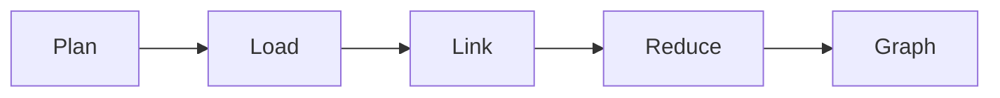

# ares 架构拆解 (XVIII)：知识图谱构建——从 markdown 到 27K 条边（AKG）

第 X 篇讲的是*检索*——怎么找到相关记忆。这篇讲的是*构建*——那些记忆是怎么变成知识图谱的。

AKF 知识图谱（`internal/knowledge/`）是把原始 provider 数据转成可查询图谱的引擎。v0.2.7 发布，v0.2.8 通过公共 `api/knowledge` API 暴露出来。

---

## 问题：三个 Provider，没有边

三个团队各自建自己的知识库：

| 团队 | 数据源 | 存储 | 有边吗？ |
|------|--------|------|----------|
| Memory | 对话轮次 | PostgreSQL + pgvector | 没有 |
| Evolution | 策略决策 | 内存 | 没有 |
| Code | 源文件 | SQLite | 没有 |

每个团队都有节点。没人有边。当有人问"哪个决策导致了这次代码变更？"，答案需要手动 join 三个存储。

**坦诚反思**：我们先试了统一 SQL schema。花了两周，破坏了三个集成，还是表达不了"策略 S 取代了策略 T，因为决策 D 选择了方案 A"。当数据本质上是图形状时，关系模型会和你作对。

---

## 设计：Plan → Load → Link → Reduce → Graph

`KnowledgeRuntime` 编排一个五阶段 pipeline：



### 阶段 1：Plan

`KnowledgePlanner` 决定*加载什么*。默认 planner 加载所有注册的 provider：

```go
// internal/knowledge/planner/default.go
type DefaultPlanner struct{}

func (p *DefaultPlanner) Plan(ctx context.Context, intent Intent) (*Plan, error) {
    sources := p.discovery.Discover(ctx, intent)
    return &Plan{Sources: sources}, nil
}
```

`Intent` 描述 runtime 想要什么（"为这个任务构建一个图"）。planner 把 intent 映射到数据源。

### 阶段 2：Load

Provider 从它们的后端存储加载原始 `KnowledgeObject`：

```go
// internal/knowledge/provider/interface.go
type Provider interface {
    Name() string
    Load(ctx context.Context) ([]*knowledge.KnowledgeObject, error)
}
```

六个内置 provider：

| Provider | 数据源 | 对象类型 |
|----------|--------|----------|
| `memory.Provider` | 对话轮次 | `ObjectMemory` |
| `evolution.Provider` | 策略决策 | `ObjectDecision` |
| `code.Provider` | 源文件 | `ObjectCode` |
| `mysql.Provider` | MySQL 行 | `ObjectDocument` |
| `postgres.Provider` | PostgreSQL 行 | `ObjectDocument` |
| `vector.Provider` | pgvector embedding | `ObjectMemory` |

### 阶段 3：Link

魔法在这里。四个 `Linker` 插件生成边：

| Linker | 边类型 | 逻辑 |
|--------|--------|------|
| `DecisionLinker` | `decided_by`, `rationale_for` | 对 summary/tag 做关键词打分 |
| `ArchitectureLinker` | `depends_on`, `implements` | 代码实体 ↔ 架构决策 |
| `SimilarityLinker` | `similar_to` | token 重叠相似度（默认 ≥ 0.3） |
| `TimelineLinker` | `supersedes`, `generated_by` | 按 `CreatedAt` 时间排序 |

每个 Linker 独立且可插拔。加一个新关系类型意味着实现 `runtime.Linker` 并注册它——不需要改核心 pipeline。

### 阶段 4：Reduce

`Reducer` 修剪和排序图谱。不剪枝的话，147 个节点的图会爆炸到 50K+ 条边（相似度是 O(n²)）。reducer 应用：

1. **边类型限制**——限制每个节点的 `similar_to` 边数
2. **分数阈值**——丢掉低于 `MinScore` 的边
3. **冗余移除**——折叠同类型的平行边

基准测试：**147 个节点，27K 条边，构建耗时 73ms。**

### 阶段 5：Graph

最终的 `KnowledgeGraph` 存在可插拔的 `Store` 里：

| Store | 后端 | 用例 |
|-------|------|------|
| `memory.Store` | 内存 map | 测试，小图 |
| `sqlite.Store` | SQLite | 单节点部署 |
| `postgres.Store` | PostgreSQL + pgvector | 生产，分布式 |

---

## 懒图

不是每个查询都需要完整图。`lazy_graph.go` 按需构建子图：

```go
// internal/knowledge/runtime/lazy_graph.go
func (r *KnowledgeRuntime) GetSubgraph(ctx context.Context, rootID string, depth int) (*knowledge.KnowledgeGraph, error)
```

这就是 `agent.Run` 在启用 `WithKnowledge()` 时调用的——它围绕当前任务构建一个小子图，而不是整个语料库。

**坦诚反思**：懒图是个性能 hack，后来变成了架构。最初我们每次都构建完整图。500 个节点时构建时间 2 秒。1000 个时 8 秒。懒图把典型查询带回 ~50ms。

---

## 公共 API

v0.2.8 通过 `api/knowledge` 暴露知识图谱：

```go
// api/knowledge/knowledge.go
type KnowledgeObject struct {
    ID       string
    Type     ObjectType
    Summary  string
    Tags     []string
    Payload  map[string]any
    CreatedAt time.Time
}

type KnowledgeGraph struct {
    Objects  []*KnowledgeObject
    Relations []Relation
}
```

外部集成方现在可以构建和查询知识图谱，而无需导入 `internal/`：

```go
graph, err := runtime.GetSubgraph(ctx, taskID, 2)
for _, obj := range graph.Objects {
    fmt.Printf("%s: %s\n", obj.Type, obj.Summary)
}
```

---

## Adapter 桥

`internal/knowledge/service/adapter.go`（v0.2.8，+126 行）把公共 `api/knowledge` API 桥接到内部知识图谱 runtime。它转换：

- 公共 `KnowledgeObject` ↔ 内部 `knowledge.KnowledgeObject`
- 公共 `KnowledgeGraph` ↔ 内部 `knowledge.KnowledgeGraph`
- 公共查询 API ↔ 内部 `retriever.Retriever`

这就是模式：公共 API 在 `api/`，实现在 `internal/`，adapter 在 `internal/<module>/service/adapter.go`。

---

## 教训

AKG 知识图谱是 ares 里最复杂的模块。它有六个子包、四个 Linker、三个 Store、六个 Provider。但核心洞察很简单：**知识是图，不是表。**

当你停止对抗图的形状并拥抱它——生成边的 Linker、剪枝的 Reducer、按需构建的懒图——系统变得更简单，而不是更复杂。

**最好的知识系统是知道自己的数据是什么形状的。** 对 ares 来说，那个形状是图。
