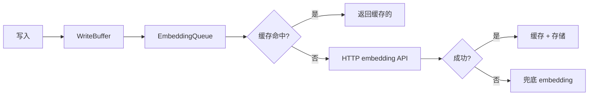

# ares 架构拆解 (XIX)：存储层——一切的基石

ares 里的每个模块——Memory、Evolution、Knowledge、Events——最终都要落地到存储。这是 `internal/storage/` 的故事：57 个文件，14,112 行代码，所有其他模块都站在它上面。

---

## 问题：三个存储，三个 Bug

早期 ares 有三条独立的存储路径：

| 模块 | 存储 | 问题 |
|------|------|------|
| Memory | 裸 `database/sql` 调用 | 负载下连接泄漏 |
| Knowledge | 手写 pgvector 查询 | 向量搜索在 10K 行时超时 |
| Evolution | 内存 map（无持久化） | 重启即丢失策略 |

三条路径意味着三个出 bug 的地方。Memory 团队在 50 个并发 Agent 时撞上"too many connections"。Knowledge 团队看着向量搜索从 50ms 退化到 8 秒。Evolution 团队只能接受重启清空一切。

**坦诚反思**：我们试过给每条路径加自己的重试逻辑。能用——直到级联失败让三者同时重试并搞垮 PostgreSQL。集中式存储不是设计选择，是生存需要。

---

## 设计：Pool、Breaker、Buffer、Timeout

`internal/storage/postgres/` 提供四层保护：

### 1. Pool — 连接管理

```go
// internal/storage/postgres/pool.go
type Pool struct {
    cfg          *Config
    db           *sql.DB
    mu           sync.RWMutex
    waitCount    int
    waitDuration time.Duration
}
```

Pool 包装 `sql.DB`，加使用追踪。`Get() → usage → Release()` 模式确保连接即使 panic 也能回到池里。

**关键洞察**：`ErrMissingTenantID` 在 pool 层强制执行。任何没有 tenant ID 的租户感知查询会快速失败——防止静默的跨租户数据泄漏（P1-11 安全修复）。

### 2. CircuitBreaker — 故障隔离

```go
// internal/storage/postgres/circuit_breaker.go
type CircuitBreaker struct {
    state            CircuitBreakerState  // closed | open | half-open
    failureCount     int                  // 连续失败数
    failureThreshold int                  // N 次连续失败后开启
    openTimeout      time.Duration        // 开启状态持续时间
    halfOpenInflight atomic.Int32         // half-open 探针限制
}
```

三个状态：
- **Closed** — 正常运行，`failureCount` 追踪连续失败
- **Open** — 快速失败，不调 DB，等待 `openTimeout`
- **Half-Open** — 允许一个探针，成功 → Closed，失败 → Open

**坦诚反思**：最初的断路器追踪*累计*失败。一次短暂的网络抖动就会触发它，然后保持开启 30 秒，即使 DB 已经恢复。切换到*连续*失败（每次成功重置）让它既灵敏又不过度反应。

### 3. WriteBuffer — 批量写入

```go
// internal/storage/postgres/write_buffer.go
type WriteBuffer struct {
    db            *Pool
    buffer        chan *WriteItem
    batchSize     int
    flushInterval time.Duration
    queue         *EmbeddingQueue
}
```

写入先进内存 channel。后台 goroutine 在 `batchSize` 条累积或 `flushInterval` 到时刷新。

这把 embedding API 调用削减了 80%——不再是每次写入一个 embedding 请求，buffer 攒 50 条然后发一个批量 embedding 请求。

### 4. Timeout — 操作级超时

```go
// internal/storage/postgres/timeout.go
var DefaultTimeouts = struct {
    Query        time.Duration  // 30s
    Insert       time.Duration  // 20s
    Update       time.Duration  // 20s
    Delete       time.Duration  // 20s
    Transaction  time.Duration  // 60s
    VectorSearch time.Duration  // 10s
}{}
```

每种操作类型有自己的超时。向量搜索 10 秒（快速失败，让断路器跳闸）。事务 60 秒（复杂操作需要空间）。

---

## Embedding 子系统

`internal/storage/postgres/embedding/` 是存储里最复杂的部分：

```
embedding/
├── service.go      # EmbeddingClient — 实现 api/embedding.EmbeddingService
├── client.go       # embedding API 的 HTTP 客户端
├── cache.go        # 内存 embedding 缓存
├── fallback.go     # 主 embedding 失败时的兜底
├── embedding_queue.go  # 异步 embedding 队列
└── log.go          # 作用域 logger
```

流程：


**坦诚反思**：embedding 缓存有个微妙的 bug，我们在 v0.2.7 修了——缓存键没考虑模型。如果你切换了 embedding 模型，你会拿到旧模型的陈旧向量。修复：在缓存键里包含 `embedding_model`。很简单，但找出来花了一次生产事故。

---

## Repository 模式

存储按域组织：

```
repositories/
├── conversation_repository.go
├── distilled_memory_repository.go
├── experience_repository.go
├── knowledge_repository.go
├── secret_repository.go
├── strategy_repository.go
├── task_result_repository.go
└── tool_repository.go
```

每个 repository 遵循同样的模式：
1. 接口在 `repositories/*_interface.go`
2. 实现在 `repositories/*_repository.go`
3. 模型在 `models/`
4. 查询在 `query/`

这种分离让测试变得简单——mock 接口，不是实现。

---

## 迁移系统

```go
// internal/storage/postgres/migrate.go
func Migrate(ctx context.Context, pool *Pool) error
```

迁移是版本化且幂等的：
- `migrate_storage.go` — 基础 schema
- `migrate_eval.go` — 评估表
- `migrate_evolution.go` — 策略谱系表

每次迁移检查当前 schema 版本，只应用缺失的迁移。启动时运行是安全的。

---

## 教训

存储是没人谈论直到它出问题的层。Pool 泄漏、断路器配置错误、缺失的缓存键——每一个都花了一次生产事故才被发现。

四层保护（Pool → Breaker → Buffer → Timeout）看起来像是过度设计，直到你在凌晨三点试图搞清楚为什么 PostgreSQL 有 500 个空闲连接。

**最好的存储层是你忘记它存在的那个。** 它工作，它快，它安全——它让每个其他模块专注于自己的工作，而不是担心数据库。
