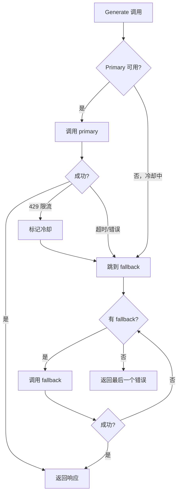

# ares 架构拆解 (XX)：LLM 客户端层——Failover、DeepSeek 与多 Provider 抽象

第 V 篇（工具系统）讲的是工具怎么被调用——四条路径。但是*谁*在调用 LLM？那就是 `internal/llm/` 层：两个包共 5,799 行代码，让 ares 能和 OpenAI、Anthropic、Ollama、OpenRouter 对话而不关心是谁在回答。

---

## 问题：一个 Provider，三种故障

v0.2.4 只有一个 `llm.Client` 对接一个 provider。能用——直到用不了：

| 故障 | 症状 | 影响 |
|------|------|------|
| 超时 | 挂 60 秒后报错 | Agent 看起来冻住 |
| 限流（429） | 立即拒绝 | 突发流量杀死 Agent |
| Provider 宕机 | 连接被拒 | 全面停机 |

量化团队在一个下午把这三种都撞了一遍。他们的修复：一个每 5 分钟重启 Agent 的 shell 脚本。那不是修复，那是放弃。

**坦诚反思**：我们考虑过负载均衡器——在 provider 之间轮询。但 provider 不可互换。GPT-4o 的回答和 Claude 3 Haiku 不一样。负载均衡器会悄悄改变你 Agent 的行为。Failover 是显式的：先用 primary，失败才用 fallback。

---

## 设计：FailoverClient

```go
// internal/llm/failover.go
type FailoverClient struct {
    clients          []*Client       // primary + fallback，按顺序尝试
    timeout          time.Duration   // 每次调用超时
    cooldownDuration time.Duration   // 限流 provider 跳过多久
    mu               sync.RWMutex
    cooldowns        map[string]time.Time  // provider+model → 冷却到期时间
}
```

流程：



关键特性：

### 1. 感知限流的冷却

当 provider 返回 HTTP 429 时，`FailoverClient` 把它标记为冷却状态，持续 `cooldownDuration`（默认 60 秒）。后续调用直接跳过冷却中的 provider，转去 fallback。

```go
// internal/llm/failover.go
func (fc *FailoverClient) isAvailable(idx int) bool {
    fc.mu.RLock()
    defer fc.mu.RUnlock()
    key := fc.clientKey(idx)
    if expiry, ok := fc.cooldowns[key]; ok {
        return time.Now().After(expiry)
    }
    return true
}
```

这防止了"重试风暴"——不是反复撞击限流的 provider，而是在冷却到期前完全跳过它。

### 2. 每次调用独立超时

每次调用都有自己的 `context.WithTimeout`。慢 provider 上的 30 秒超时不会阻塞快速 fallback。

### 3. 有序的 Fallback

Fallback 按注册顺序尝试。如果你配置：

```go
ares.WithFallbackLLM(&core.LLMConfig{Provider: "anthropic", Model: "claude-3-haiku"}),
ares.WithFallbackLLM(&core.LLMConfig{Provider: "ollama", Model: "llama3.2"}),
```

……那么顺序是 primary（OpenAI）→ Anthropic → Ollama。第一个成功者胜出。

**坦诚反思**：我们没有加"首选 provider"的概念。如果 Anthropic 是你的 fallback 并成功了，下次你仍然用 OpenAI。这意味着你不是在负载均衡——你只在 primary 失败时才 fallback。这就是设计意图。

---

## DeepSeek ReasoningContent 修复

DeepSeek 的 API 返回的 thinking-mode 响应里有一个独立的 `reasoning_content` 字段，和常规 `content` 分开。早期 ares 完全忽略这个字段——思考链被悄悄丢弃。

v0.2.7 的修复给 `Message` 和 `AssistantMsg` 都加了 `ReasoningContent`：

```go
// internal/core/models/message.go
type Message struct {
    Role             string
    Content          string
    ReasoningContent string  // 新增：DeepSeek 思考链
    ToolCalls        []ToolCall
}
```

`toMap()` 序列化也更新了，确保该字段能正确往返。没有这个修复，DeepSeek 响应会丢失推理链——让调试变得不可能。

**坦诚反思**：这是 provider 专属特性泄漏进核心模型。 "干净"的设计应该是 `ProviderMetadata map[string]any` 字段。但有类型的 `ReasoningContent` 字段更容易使用和文档化。我们选择了务实而非纯粹。

---

## Output Adapter

`internal/llm/output/` 处理一个混乱的现实：每个 provider 的响应格式都不一样：

```
output/
├── openai.go        # OpenAI 响应解析
├── ollama.go        # Ollama 响应解析
├── openrouter.go    # OpenRouter 响应解析
├── adapter.go       # 统一 adapter
├── parser.go        # 响应解析
├── validator.go     # 响应校验
├── toolcall.go      # 工具调用提取
├── template.go      # prompt 模板
└── timeout.go       # 输出超时
```

每个 provider 文件实现同一接口。`adapter.go` 根据 `LLMConfig.Provider` 选对的解析器：

```go
// internal/llm/output/adapter.go
func NewAdapter(provider string) (OutputAdapter, error) {
    switch provider {
    case core.LLMProviderOpenAI:
        return &OpenAIAdapter{}, nil
    case core.LLMProviderOllama:
        return &OllamaAdapter{}, nil
    case core.LLMProviderOpenRouter:
        return &OpenRouterAdapter{}, nil
    default:
        return nil, fmt.Errorf("unsupported provider: %s", provider)
    }
}
```

**坦诚反思**：Anthropic 用和 OpenAI 不同的消息格式。我们最初试图在 adapter 层把一切归一到 OpenAI 格式。简单情况能用，但工具调用上崩了——Anthropic 的工具调用格式在结构上就不同。最终设计：每个 adapter 处理自己的格式，`parser.go` 做最终归一化。

---

## Service 层

`internal/llmservice/service.go` 把 client 包装成 service：

```go
// internal/llmservice/service.go
type Service struct {
    client          LLMClient
    repo            core.LLMRepository
    config          *core.BaseConfig
    llmConfig       *core.LLMConfig
    embeddingClient any
}
```

`LLMClient` 是 `*llm.Client` 和 `*llm.FailoverClient` 都满足的接口：

```go
type LLMClient interface {
    Generate(ctx context.Context, prompt string) (string, error)
    GenerateStream(ctx context.Context, prompt string) (<-chan llm.StreamChunk, error)
    Chat(ctx context.Context, messages []*core.LLMMessage, tools []core.Tool, params map[string]any) (*core.GenerateResponse, error)
    IsEnabled() bool
    GetProvider() string
    GetModel() string
    Close()
}
```

这就是 SDK（`sdk/sdk.go`）调用的东西。Service 层加了：
- 请求日志（通过 `repo`）
- embedding client 注入（可选）
- Tracer 集成（通过 `ares_observability`）

---

## 教训

LLM 客户端层在工作时是隐形的。你不会注意到 failover，直到你查日志看到"primary 失败，用 fallback"。你不会注意到冷却，直到你发现突发流量没触发一个 429。

**最好的客户端层是让故障变无聊的那个。** Provider 宕机应该是一条日志行，而不是凌晨三点的告警。Failover、冷却和每次调用独立超时把灾难性故障变成小麻烦。
