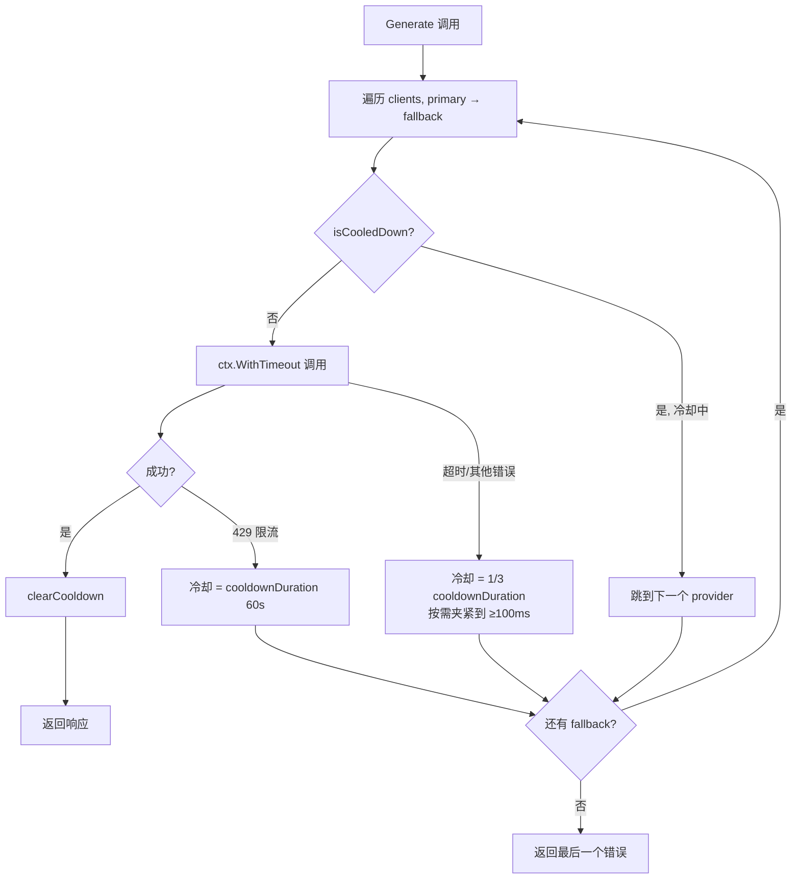
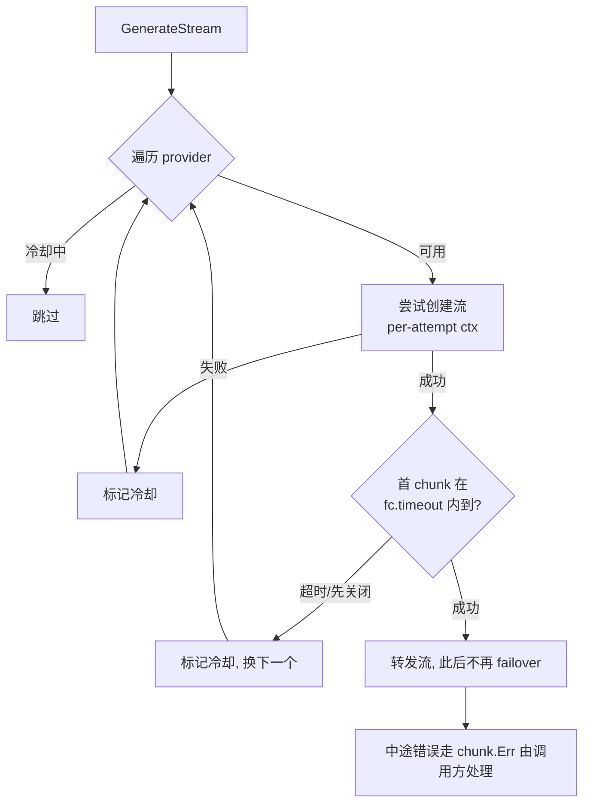
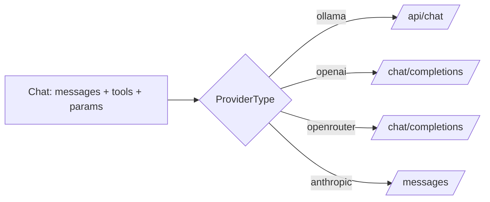

# ares 架构拆解 (XX)：LLM 客户端层——Client、Failover 与多 Provider 抽象（0.3.x）

第 V 篇（工具系统）讲的是工具怎么被调用。但*谁*在调用 LLM？那是 `internal/llm/` 层——如今是**单个包**（`Client`、`FailoverClient`，含测试约 5.4k 行），让 ares 能跟 OpenAI、Ollama、OpenRouter、Anthropic 对话，而不必关心是谁在回答。

> **0.4 删除记录**：ReAct 时代的姊妹包 `internal/llm/output`（per-provider adapter 与响应解析，含测试约 5.8k 行）自 0.3.1 起**生产零调用**（independent-review F-07），已整包删除。运行期 provider 降级只剩 `internal/llm` 的 `FailoverClient` 一条链；工具调用的消息/工具类型存活在 `internal/llmcore`（`ToolCall`、`LLMMessage` 等），由 `internal/llm/chat.go` 按 provider 归一化。被删包的历史描述仅保留在 `CHANGELOG.md` 与 `docs/reviews/`。

---

## 问题：一个 Provider，三种故障

单靠一个 `*llm.Client` 对接单一 provider，能用——直到用不了：

| 故障 | 症状 | 影响 |
|------|------|------|
| 超时 | 挂到超时再报错 | Agent 看起来冻住 |
| 限流（429） | 立即拒绝 | 突发流量杀死 Agent |
| Provider 宕机 | 连接被拒 | 全面停机 |

**坦诚反思**：我们没选负载均衡器——在 provider 间轮询。provider 不可互换，GPT 的回答和 Claude 不一样，轮询会悄悄改变 Agent 行为。failover 是显式的：先用 primary，失败才走 fallback。

---

## 设计：`Client` 与 `FailoverClient`

### 底层 `Client`（internal/llm/client.go）

每个 provider 都是一份 `llm.Config`（`Provider`/`APIKey`/`BaseURL`/`Model`/`Timeout`/`MaxTokens`/`MaxPromptLength`/`Extra`），`NewClient` 用它构造带 `http.Client` 的实例，可选挂载回调、限流、重试、熔断、脱敏：

```go
// internal/llm/client.go
const (
    defaultTimeoutSeconds = 60
    maxPromptLength       = 8192
    defaultMaxTokens      = 4096
)

type Client struct {
    config         *Config
    httpClient     *http.Client      // 带 Timeout，普通请求
    streamClient   *http.Client      // 无 Timeout——流式超时全走 context
    tracer         observability.Tracer
    ares_callbacks ares_callbacks.Emitter
    limiter        ares_ratelimit.Limiter
    sanitizer      *ares_security.Sanitizer
    retryPolicy    RetryPolicy       // 默认 3 次指数退避
    circuit        *CircuitBreaker   // 默认开启
    closeOnce      sync.Once
}

func NewClient(config *Config, opts ...Option) (*Client, error)
```

`Client` 自带防御层：429/5xx/传输错误按 `retryPolicy` 指数退避重试，熔断器在 provider 持续故障时快速失败。`IsEnabled()` 对 openai/openrouter/anthropic 要求 `APIKey` 非空，ollama 永远返回 true。

### 高层 `FailoverClient`（internal/llm/failover.go）

```go
type FailoverClient struct {
    clients          []*Client              // primary + fallback，按顺序尝试
    timeout          time.Duration          // 每次调用超时
    cooldownDuration time.Duration          // 默认 60s
    mu               sync.RWMutex
    cooldowns        map[string]time.Time   // provider+model → 冷却到期时间
}

func NewFailoverClient(configs []*Config, timeout time.Duration,
    rate float64, burst int, opts ...FailoverOption) (*FailoverClient, error)
```

要点：`configs[0]` 是 primary，`configs[1:]` 是 fallback。构造时会给每个底层 client 关掉内部重试与熔断（`RetryPolicy{MaxAttempts:1}` + `WithCircuitBreaker(nil)`）——**failover 层自己负责切换，不希望底层的重试掩盖故障**。令牌桶限流只加在 primary（`i == 0`）。


```mermaid
flowchart TD
    R[Generate 调用] --> L[遍历 clients, primary → fallback]
    L --> C{isCooledDown?}
    C -->|是, 冷却中| SKIP[跳到下一个 provider]
    C -->|否| CALL[ctx.WithTimeout 调用]
    CALL --> OK{成功?}
    OK -->|是| CLR[clearCooldown] --> RET[返回响应]
    OK -->|429 限流| CD1[冷却 = cooldownDuration 60s] --> NEXT
    CALL -->|超时/其他错误| CD2[冷却 = 1/3 cooldownDuration<br/>按需夹紧到 ≥100ms] --> NEXT
    SKIP --> NEXT
    NEXT{还有 fallback?} -->|是| L
    NEXT -->|否| ERR[返回最后一个错误]
```

**冷却是有层次的，不是一律 60 秒**。`cooldownForError` 对 429 用完整 `cooldownDuration`，对其他临时错误只用 1/3（夹在 100ms 与完整时长之间），这样"撞上的 provider"会快点被重试，但不会被每次都打一遍：

```go
func (fc *FailoverClient) cooldownForError(err error) time.Duration {
    if isRateLimitError(err) {
        return fc.cooldownDuration
    }
    short := fc.cooldownDuration / 3
    if short < 100*time.Millisecond {
        short = 100 * time.Millisecond
    }
    if short > fc.cooldownDuration {
        short = fc.cooldownDuration
    }
    return short
}
```

这防止"重试风暴"：冷却中的 provider 被直接跳过而不是反复撞击。

**坦诚反思**：没有"首选 provider"的概念。Anthropic 作为 fallback 成功了，下次仍用 OpenAI。你不是在负载均衡——只在 primary 失败时才 fallback。这是设计意图。

---

## 流式：只覆盖"建连"，不覆盖"中途"

`GenerateStream` 有个容易被忽略的关键语义：failover 只覆盖**流的创建**（HTTP 握手）。`fc.timeout` 也只用来等**第一个 chunk**——固定 30s 请求超时会一刀切掉长的流式输出（代码里的 H8 注释）。每个尝试有自己的 `context.WithCancel`，握手没动静就换下一个 provider；一旦首 chunk 到达，流就一直跑到完成，此后中途断流以 `StreamChunk.Err` 上报，failover 层不再接管（N6）。


```mermaid
flowchart TD
    FS[GenerateStream] --> P{遍历 provider}
    P -->|冷却中| SKIP[跳过]
    P -->|可用| CRE[尝试创建流<br/>per-attempt ctx]
    CRE -->|失败| CD[标记冷却] --> P
    CRE -->|成功| FIRST{首 chunk 在<br/>fc.timeout 内到?}
    FIRST -->|超时/先关闭| TF[标记冷却, 换下一个] --> P
    FIRST -->|成功| OPEN[转发流, 此后不再 failover]
    OPEN --> MID[中途错误走 chunk.Err 由调用方处理]
```

```go
// 每个尝试一个 context，静默 provider 失败时只在它自己的 ctx 上取消
attemptCtx, attemptCancel := context.WithCancel(ctx)
ch, err := client.GenerateStream(attemptCtx, prompt)
```

---

## Chat 路由与工具调用

`Chat(ctx, messages []*core.LLMMessage, tools []core.Tool, params map[string]any)` 是工具调用路径（`params` 是 evolution 策略下发的温度/tokens/top_k 覆盖）。按 provider 分派到不同端点：


```mermaid
flowchart LR
    CTX[Chat: messages + tools + params] --> SW{ProviderType}
    SW -->|ollama| OA[/api/chat/]
    SW -->|openai| OO[/chat/completions/]
    SW -->|openrouter| OR[/chat/completions/]
    SW -->|anthropic| AN[/messages/]
```

Ollama 工具调用走 **`/api/chat`**（用它的 `tools` 字段），已核实：

```go
// internal/llm/chat.go chatOllama
baseURL := c.config.BaseURL
if baseURL == "" {
    baseURL = DefaultOllamaBaseURL // http://localhost:11434
}
req, _ := http.NewRequestWithContext(ctx, "POST", baseURL+"/api/chat", bytes.NewBuffer(jsonBody))
```

响应里的 `message.tool_calls` 会归一化成 `llmcore.ToolCall`（`internal/llmcore/llm.go`）——工具调用的共享消息/工具类型（`ToolCall`、`LLMMessage`、`Tool`、`GenerateResponse`），每个 provider 的 `chatXxx` 路径都写入这套类型。

---

## Service 层与 bootstrap 接线

`internal/llmservice/service.go` 的 `LLMClient` 是 `*llm.Client` 和 `*llm.FailoverClient` 都满足的接口，`Service` 把它包起来：

```go
// internal/llmservice/service.go
type LLMClient interface {
    Generate(ctx context.Context, prompt string) (string, error)
    GenerateStream(ctx context.Context, prompt string) (<-chan llm.StreamChunk, error)
    Chat(ctx context.Context, messages []*core.LLMMessage, tools []core.Tool, params map[string]any) (*core.GenerateResponse, error)
    IsEnabled() bool
    GetProvider() string
    GetModel() string
    Close()
}

type Service struct {
    client          LLMClient
    repo            core.LLMRepository
    config          *core.BaseConfig
    llmConfig       *core.LLMConfig
    embeddingClient any
}
```

`NewService` 在 `config.Fallbacks` 非空时构造 `FailoverClient`，否则单 `Client`；`Service.Generate` 在带工具或 `hasToolMessages` 时自动改走 Chat 路由。

bootstrap 侧（`internal/ares_bootstrap/provide_llm.go` 的 `ProvideLLM`）把 `ares_config.LLMConfig` 折进 `llm.Config`，构造**单个** `llm.NewClient`，挂上 callback registry、`Sanitizer`、W1 的 `MetricsTracer` + `CostDashboard`，返回 `LLMComponents{Client, CallbackReg, CostDashboard}`，并在 compat 层按 provider 注册 `ollama.New` / `openai.New`。

> 核实备注：`ProvideLLM` 目前只建单个 client，**没有**在这里拼 `FailoverClient`。failover 的声明式入口是 `llm.LLMConfig.Fallbacks` 走 `llmservice.NewService`，或在 SDK 侧用 `sdk.WithFallbackLLM(&core.LLMConfig{...})`（`sdk/options.go`，可多次调用追加多个 fallback）。另外 `llm.NewClientFromEnv` 已在 D13 移除（0 生产调用）。

---

## 教训

LLM 客户端层在工作时是隐形的。你不会注意到 failover，直到日志里看到"冷却中，跳过"；你不会注意到冷却分档，直到发现低等级错误被很快重试、429 却真的被晾了 60 秒。

**最好的客户端层是让故障变无聊的那个。** provider 宕机应该是一行日志，而不是凌晨三点的告警。failover + 分档冷却 + 按调用/按尝试的超时，把灾难性故障变成小麻烦——只要记住：**流式只保护到首 chunk，握手之后由调用方对 `chunk.Err` 负责**。