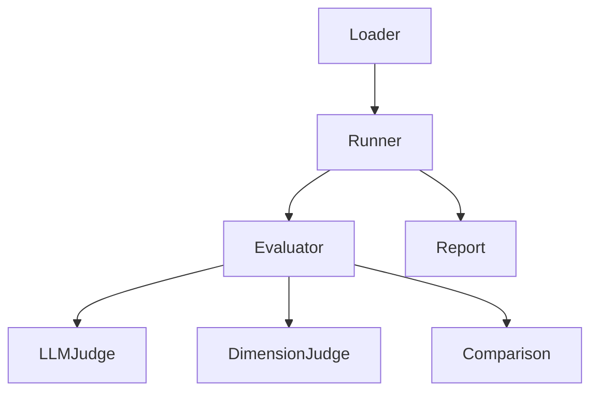

# ares 架构拆解 (XXI)：评估框架——怎么知道 Agent 真的好了

"你怎么知道你的 Agent 改进了？"这个问题在 v0.2.5 一直困扰我们。进化引擎在生成新策略，竞技场在跑对战——但我们没有客观方法说"策略 A 比策略 B 好 12%"。

评估框架（`internal/ares_eval/`，3,390 行）就是答案。它把"我觉得看起来更好"变成可复现的分数。

---

## 问题：凭感觉评估

早期 ares 有三条评估路径，都是坏的：

| 路径 | 方法 | 问题 |
|------|------|------|
| 人工 | "读输出，看起来对吗？" | 不可扩展，偏见严重 |
| 单元测试 | 硬编码期望输出 | 脆弱，LLM 输出会变 |
| Token 计数 | "更多 token = 更深入" | GPT-4o-mini 500 token 胜过 GPT-4 2000 token |

我们试过自建评分规则。用了一周就出问题——有人问"任务 X 上的 7/10 怎么和任务 Y 上的 8/10 比？"答案：不能比，除非你有框架。

**坦诚反思**：我们考虑过用现有 eval 框架（promptfoo、langchain eval）。它们对单模型评估很好。但 ares 需要*比较*评估——策略 A 在同一任务上比策略 B 好吗？这是不同的问题。

---

## 设计：三层



### 第 1 层：测试用例（`loader.go`、`types.go`）

```go
// internal/ares_eval/types.go
type TestCase struct {
    ID          string
    Input       string
    Expected    string  // 可选参考答案
    Category    string  // "reasoning", "coding", "chat" 等
    Difficulty  string  // "easy", "medium", "hard"
    Metadata    map[string]any
}

type TestResult struct {
    TestCaseID string
    Output     string
    Scores     []EvalScore
    Duration   time.Duration
    Error      error
}

type EvalScore struct {
    EvaluatorName string
    Score         float64
    MaxScore      float64
    Reasoning     string
}
```

测试用例从 YAML 或 JSON 加载：

```yaml
- id: reasoning_01
  input: "If A > B and B > C, what's the relationship between A and C?"
  expected: "A > C"
  category: reasoning
  difficulty: easy
```

### 第 2 层：评估器（`evaluator.go`、`llm_judge.go`、`dimension_judge.go`）

核心接口：

```go
// internal/ares_eval/evaluator.go
type Evaluator interface {
    Name() string
    Evaluate(ctx context.Context, tc TestCase, result TestResult) ([]EvalScore, error)
}
```

三个内置评估器：

#### LLMJudgeEvaluator

用 LLM-as-judge 给输出打分。支持三种量表：

```go
// internal/ares_eval/llm_judge.go
const (
    ScaleOneToTen  ScaleType = iota + 1  // 1-10 打分
    ScaleOneToFive                       // 1-5 打分
    ScalePassFail                        // 二元通过/失败
)
```

judge prompt（简化版）：

```
你在评估一个 AI 助手的回复。

任务：{input}
期望：{expected}
实际：{output}

给回复打 1-10 分：
- 10：完美，达到或超过期望
- 7-9：好，有小问题
- 4-6：部分，缺关键元素
- 1-3：差，错误或无关

返回 JSON：{"score": N, "reasoning": "..."}
```

**坦诚反思**：LLM-as-judge 有已知偏见——它偏好更长、更啰嗦的回复。我们在 judge prompt 里加了长度惩罚，但那是创可贴。真正的修复是针对人工评估校准 judge，我们还没做。

#### DimensionJudgeEvaluator

跨多个维度打分：

```go
// internal/ares_eval/dimension_judge.go
type Dimension struct {
    Name      string  // "accuracy", "completeness", "clarity"
    Weight    float64
    MaxScore  float64
}
```

每个维度得一个分，然后加权汇总。这是进化引擎用来做适应度评估的。

### 第 3 层：Runner 和比较（`runner.go`、`comparison.go`、`concurrent_runner.go`）

```go
// internal/ares_eval/runner.go
type Runner struct {
    evaluators []Evaluator
    loader     *Loader
}

func (r *Runner) RunAll(ctx context.Context) (*Report, error)
func (r *Runner) RunScenario(ctx context.Context, scenario string) (*Report, error)
```

**比较**层是魔法所在：

```go
// internal/ares_eval/comparison.go
type Comparison struct {
    Baseline     *Report
    Candidate    *Report
    Improvements []ScoreDelta
    Regressions  []ScoreDelta
}
```

这让我们能说：

```
策略 A（基线）：平均分 7.2/10
策略 B（候选）：平均分 8.1/10
改进：+12.5%
```

`concurrent_runner.go` 并行跑测试用例，把 100 个用例的评估时间从 30 分钟砍到 3 分钟。

---

## 与进化集成

评估框架是 GA 引擎的适应度函数（第 XI 篇）：

```go
// internal/ares_bootstrap/bootstrap.go（简化）
func SetupEvaluators(llmClient *llm.Client, registry *eval.EvaluatorRegistry) error {
    judge, err := eval.NewLLMJudgeEvaluator(llmClient,
        eval.WithScale(eval.ScaleOneToTen),
        eval.WithMaxRetries(3),
    )
    if err != nil {
        return err
    }
    registry.Register(judge)

    dimJudge, err := eval.NewDimensionJudgeEvaluator(llmClient,
        eval.WithDimensions(defaultDimensions),
    )
    if err != nil {
        return err
    }
    registry.Register(dimJudge)

    return nil
}
```

当进化运行时，它：
1. 生成新策略（通过变异）
2. 让 Agent 跑一遍
3. 用 `LLMJudgeEvaluator` 评估输出
4. 把分数用作选择的适应度

**坦诚反思**：LLM judge 很贵——每次评估是一次 LLM 调用。100 个用例 + 每代 10 个策略 = 每代 1000 次 LLM 调用。我们加了缓存（相同输入 → 相同分数）和"快速模式"（只评估 10 个随机用例）。但根本成本还在。

---

## Service 层

`internal/ares_eval/service/` 通过 HTTP 暴露评估框架：

```
service/
├── handler.go       # HTTP handler
├── router.go        # 路由注册
├── service.go       # 业务逻辑
├── repository.go    # 结果持久化
└── types.go         # API 类型
```

端点：
- `POST /eval/run` — 跑一个评估套件
- `GET /eval/results/{id}` — 获取结果
- `POST /eval/compare` — 比较两次运行

---

## 教训

评估框架是 ares 里最被低估的模块。没人会在 demo 里问"你怎么评估？"但没有它，进化只是随机变异——没有适应度函数，没有选择压力，没有改进。

**最好的评估框架是让"它更好吗？"变成有数字答案的问题。** 感觉不能扩展。可复现的分数可以。
