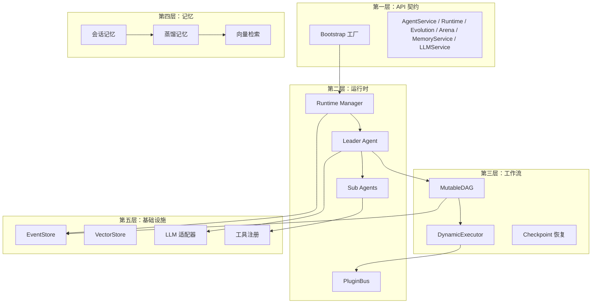

# ares 架构拆解 (I)：全局视角——为什么又一个 Agent 框架？

我一开始不是要造框架。我是要解决一个问题：**Agent 老死，而且查不出原因。**

起因是一个简单的聊天机器人。一个 Leader，两个 Sub，几个工具。开发环境跑得好好的。上了生产，Leader 跑 20 分钟就不响应了。没有报错，没有 panic，没有崩溃日志。就是……沉默。

调试了三天，找到了：LLM 客户端的 goroutine 泄漏。每个请求泄漏一个 goroutine，最终打到操作系统线程上限。修复就一行代码。但找到它花了 72 小时，因为我对 Agent 在干什么**零可见**。

那一刻我意识到：问题不是"怎么让 Agent 调 LLM"，问题是"怎么让 Agent 在生产环境活下来"。

---

## 三个问题

每个 Agent 框架回答一个问题："怎么让 Agent 调 LLM？" 这是最简单的部分。难的问题是：

1. **Agent 死了怎么办？**（复活）
2. **它怎么记得之前在干什么？**（状态恢复）
3. **我怎么知道哪里出了问题？**（可观测）

ares 围绕这三个问题构建。其他一切——DAG 引擎、记忆系统、进化引擎——都是因为正确回答这些问题需要大量基础设施。

---

## 架构：五层

**第一层：API 契约** — 外界看到的。只有接口，没有实现。Bootstrap 工厂把所有东西接在一起。调 `bootstrap.New()` 就得到一个完整连接的系统。

**第二层：运行时** — 谁干活。Runtime Manager 管理 Agent 生命周期：出生、死亡、复活。Leader 规划和分发。Sub Agent 执行。PluginBus 把一切连起来。

**第三层：工作流** — 工作怎么流。MutableDAG 定义任务依赖。DynamicExecutor 按拓扑序执行。Checkpoint Resume 让你在崩溃后从断点恢复。

**第四层：记忆** — Agent 记住什么。会话记忆是短期的。蒸馏记忆是长期压缩知识。检索通过向量搜索找到相关记忆。

**第五层：基础设施** — 什么支撑一切。EventStore 记录一切。VectorStore 索引记忆。LLM 适配器对接提供商。工具注册管理能力。

---

## 设计原则

**1. Agent 是一次性的。**

这是最重要的原则。Agent 不是珍稀动物——它是一个带心跳的 goroutine。如果它死了，Runtime 创建一个新的，从 EventStore 恢复状态。这听起来浪费，直到你意识到这是唯一保证恢复的方式。

**坦诚反思**：我们考虑过让 Agent 长期存活、有弹性。试过熔断器、重试循环、优雅降级。有效——直到没效。问题是你无法预测每种失败模式。goroutine 泄漏、死锁、OOM kill——再多防御性编码也覆盖不了。让 Agent 一次性的意味着任何失败都可恢复，因为你总有一个全新的起点。

**2. 记录一切，回放一切。**

每个动作——LLM 调用、工具调用、任务分配、记忆查询——都是 EventStore 里的一个事件。想知道发生了什么？回放事件。想恢复状态？回放事件。想调试？回放事件。

**3. 插件，不硬编码。**

PluginBus 让你不改核心代码就能扩展行为。检查点快照、路由决策、工具调用——全由插件处理。Runtime 不知道也不关心哪些插件是活跃的。

**4. API 层是契约，不是实现。**

`api/core/` 定义接口。`internal/` 实现它们。`api/bootstrap/` 把它们接在一起。你可以换实现而不改契约。这在你想用 mock 测试或从内存切到 PostgreSQL 时很重要。

---

## 有什么不同

大多数 Agent 框架是"LLM 编排引擎"——聚焦在 prompt 链和工具调用。ares 是一个 **Agent 操作系统**——聚焦在让 Agent 在生产环境活下来。

| 能力 | 典型框架 | ares |
|------|---------|------|
| Agent 生命周期 | 启动然后祈祷 | 出生 → 死亡 → 复活 |
| 状态管理 | 内存结构体 | 事件溯源 + 检查点 |
| 失败处理 | try/catch | 自动复活 + 状态恢复 |
| 可观测 | 日志 | 日志 + 事件 + 指标 + 链路追踪 |
| 扩展性 | 继承 | 插件系统 + 能力发现 |
| 自我改进 | 无 | 遗传算法 + Dream Cycle |

---

## 坦诚说

这个项目从一个聊天机器人开始，长成了我没计划的样子。进化引擎不在任何路线图里——它来自"如果 Agent 能自己优化 prompt 呢？"混沌工程竞技场来自"如果我能杀掉一个 Agent 然后看它恢复呢？"插件系统来自"如果我能不改执行器就加检查点支持呢？"

每个功能都来自真实问题，不是功能清单。这就是架构看起来这样的原因——不是自上而下设计的，是自下而上进化出来的。

**坦诚反思**：代码库比需要的大。量化交易模块、面试 demo、MCP dashboard——这些是实验，应该放在独立仓库。核心（Runtime + Workflow + Memory + Events）是扎实的。外围还在找自己的形状。

但真实项目就是这样运作的。你不会在第一天设计完美架构。你解决问题、积累代码、偶尔停下来重构。v0.2.4 做的重构——统一命名、API 层瘦身、模块日志——就是那种"停下来清理"的时刻。

---

## 系列文章

| # | 主题 | 你会学到什么 |
|---|------|-------------|
| I | **本文** | 全局视角 |
| II | Agent 和声协议 | Agent 怎么通信 |
| III | 记忆蒸馏 | Agent 怎么记住和遗忘 |
| IV | 工作流引擎 | 任务怎么在 DAG 里流 |
| V | 工具调用层 | Agent 怎么用工具 |
| VI | 安全与可观测 | 怎么看到发生了什么 |
| VII | 运行时与生命周期 | Agent 怎么活和死 |
| VIII | 事件系统 | 状态怎么记录和恢复 |
| IX | 竞技场 / 故障注入 | 怎么故意搞破坏 |
| X | 检索系统 | 怎么找到相关记忆 |
| XI | 自主进化 | Agent 怎么自我改进 |
| XII | 安全加固 | 怎么防御威胁 |

每篇文章遵循同一个模式：**问题 → 设计旅程 → 权衡取舍 → 坦诚反思。**

不营销。不"比 X 快 10 倍"。只有工程师聊工程。
