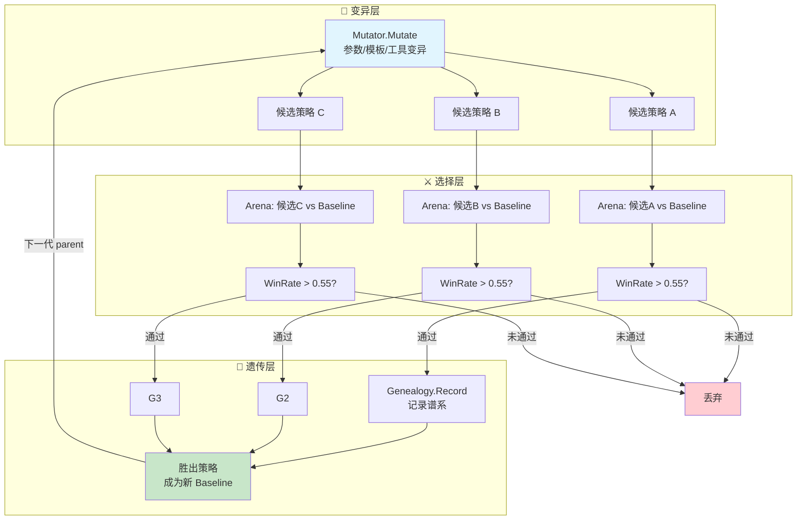
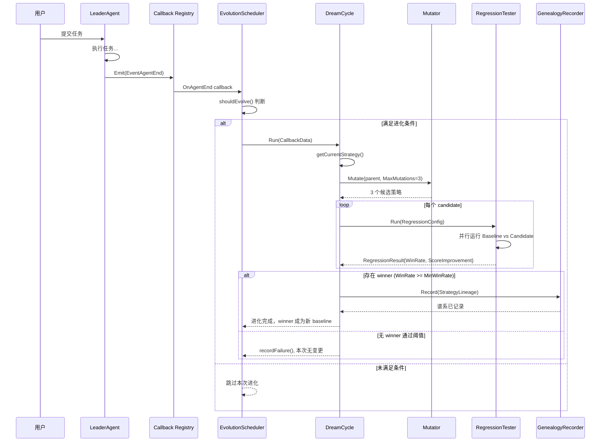
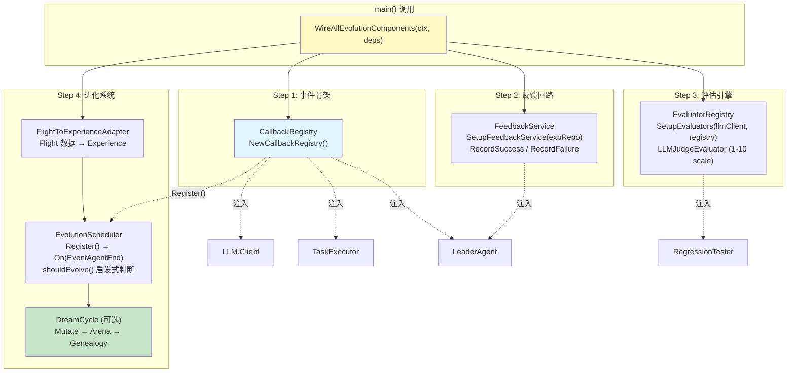
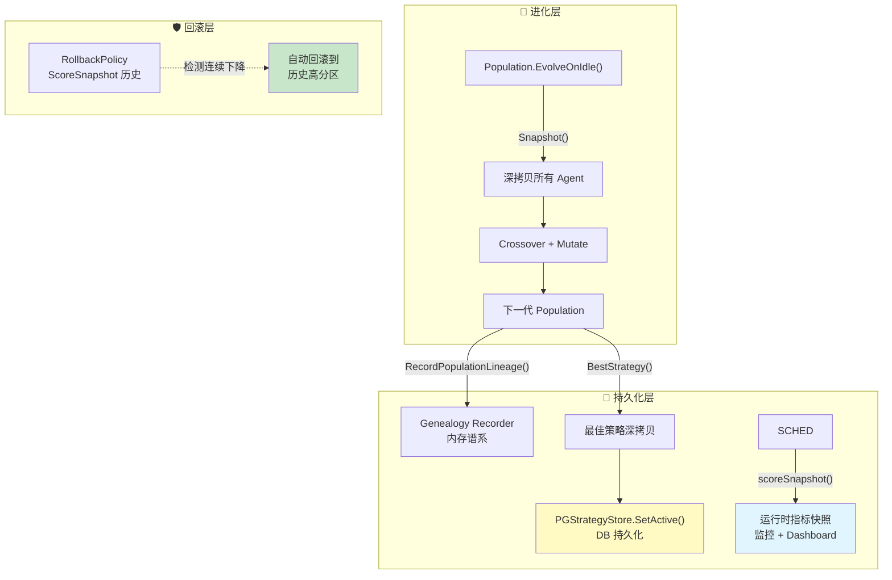

# ares 架构深度解析（十一）：自主进化 — 当 Agent 学会自己变强

> 你有没有想过…… Agent 为什么不能越用越聪明？
> 它每次犯错后还是犯同样的错，每次解决完一个问题下次又从头开始。
> 如果人能从错误中学习，为什么 Agent 不行？

***

## 一、一个天真的想法：直接改 prompt

先聊聊我走偏的那段路。

最开始做 ares 的时候，我最先想到的不是什么进化系统，而是**直接改 system prompt**。思路很朴素：

> Agent 表现不好 → 分析它哪里不好 → 在 system prompt 里加一条规则让它别再犯

比如 Agent 老是输出太啰嗦？在 prompt 里加一句"请简洁回答"。Agent 老是忘记检查错误码？加一条"务必检查所有 API 返回的错误"。我当时撸了一个极度简单的版本：

```go
// 伪代码——展示早期思路
type PromptTuner struct {
    rules []string
}

func (t *PromptTuner) Tune(prompt string, feedback string) string {
    rule := generateRuleFromFeedback(feedback) // 用 LLM 从反馈中提取规则
    t.rules = append(t.rules, rule)
    return prompt + "\n\n规则:\n" + strings.Join(t.rules, "\n")
}
```

这段代码现在看很蠢，但当时觉得挺美——一个 `[]string` 搞定，不需要额外的基础设施，不需要数据库，甚至不需要第二套 LLM 调用。prompt 变长了就变长呗，context window 现在不都挺大的吗？

但跑了一段时间之后，问题全暴露了。

### Prompt 膨胀：越改越长

第一条规则加进去还好。第十条也还行。等到第五十条的时候，你的 system prompt 已经从 200 tokens 膨胀到了 5000+ tokens。而且这些规则之间还会互相矛盾：

```
规则 #3: "回答要简洁"
规则 #17: "对技术问题提供详细解释"
规则 #31: "避免重复信息"
规则 #42: "确保覆盖所有边界情况"
```

LLM 看到这种互相打架的指令集，它的反应不是"智能权衡"，而是"随机选一个听"。你加的规则越多，它的行为越不可预测。

### 无法量化效果

更致命的问题是：**你根本不知道改完之后变好了还是变差了。**

加了"请简洁回答"这条规则之后，Agent 的回复确实短了。但同时它也开始跳过重要的细节。你怎么衡量这个 trade-off？没有 baseline，没有 metrics，没有 A/B test。全靠感觉。

### 没有反馈回路

最让我烦的是这个：Agent 改了 prompt 之后跑了一轮，表现怎么样？不知道。成功了？失败了？用户满意吗？没数据。你就像一个闭着眼睛调参的机器学习工程师——每一步都凭直觉，每一步都可能是在往反方向走。

### 教训

"直接改 prompt"这条路走不通，核心原因就一句话：**没有选择压力的变异不是进化，是随机漫步。**

生物进化之所以有效，是因为三个机制同时存在：**变异产生多样性，选择淘汰不适应的个体，遗传把好的特征传下去。** 我当时的做法只有"变异"（改 prompt），没有"选择"（不知道好坏），也没有"遗传"（下次又从头来）。这跟拿飞镖扎墙上的靶子没什么区别——扔得再多，也不代表你在进步。

所以我才回到基本面重新想：一个 Agent 的"进化"到底需要什么？

***

## 二、核心洞察：进化 = 变异 + 选择 + 遗传

类比生物进化论，我把 Agent 进化拆成了三个对应关系：

| 生物进化               | Agent 进化                     | ares 实现                               |
| ------------------ | ---------------------------- | ----------------------------------------- |
| **变异** (Mutation)  | 改参数 / 改 prompt / 生成新工具       | `Mutator.Mutate()`                        |
| **选择** (Selection) | Arena 回归测试（新策略 vs 旧策略）       | `RegressionTester.Run()` + Welch's t-test |
| **遗传** (Heredity)  | Genealogy 记录策略谱系             | `GenealogyRecorder.Record()`              |
| **适应度** (Fitness)  | Evaluator 评分 + Arena WinRate | `LLMJudgeEvaluator.Evaluate()`            |

这不是我拍脑袋想出来的映射。它是反复验证后发现的：**任何自主改进系统，不管叫进化还是强化学习还是在线优化，底层都是这三步循环。** 差异只在"变异"的具体形式和"适应度函数"的定义方式。

完整的进化循环长这样：



注意几个关键设计决策：

**WinRate 阈值 = 0.55**：新策略不需要碾压旧策略，只要比它好一点点就行。这是保守策略——宁可少进化，也不要引入退化。0.55 意味着 100 次对比中新策略至少赢 55 次，统计显著性由 Welch's t-test 保证（p < 0.05）。

**谱系记录**：每一次成功的进化都会留下记录——parent 是谁、mutation type 是什么、win rate 多少、score 提升了多少。这让整个进化过程可追溯、可回滚、可分析。

***

## 三、基建盘点：75% 已经在那了

当我开始认真设计进化系统的时候，发现一件很有意思的事：**大部分基础设施已经在了。**

ares 之前做的 Experience System、Flight Recorder、Eval Engine、Callback System、Arena、Memory Distillation、DevAgent——这些模块单独看各管各的事，但合在一起恰好拼出了进化的完整拼图。

### 3.1 Experience System — Bandit 排序

`internal/ares_experience/ranking_service.go` 里的 `RankingService` 实现了一个轻量级 bandit 系统：

```go
// Rank ranks experiences using multi-signal scoring.
// FinalScore = SemanticScore + UsageBoost + RecencyBoost
func (s *RankingService) Rank(ctx context.Context, experiences []*Experience, baseScores []float64) []*RankedExperience {
    // ...
    for i, exp := range experiences {
        semanticScore := baseScores[i]

        // Usage boost: log(1 + count) * weight, capped at 0.2
        usageBoost := s.calculateUsageBoost(exp.GetUsageCount())

        // Recency boost: exponential decay with 30-day half-life
        recencyBoost := s.calculateRecencyBoost(exp.CreatedAt, now)

        finalScore := semanticScore + usageBoost + recencyBoost
        // ...
    }
}
```

关键细节：**usage boost 用的是** **`log(1 + count)`** **而不是线性增长**。这意味着第 1 次使用到第 10 次使用的提升很大（log(10) ≈ 2.3），但从第 100 次到第 110 次几乎没差别（log(111) - log(101) ≈ 0.095）。加上 0.2 的硬上限，防止老经验霸榜。

而 `feedback_service.go` 提供了反馈回路：

```go
func (s *FeedbackService) RecordSuccess(ctx context.Context, experienceID string) error {
    // IncrementUsageCount: 成功使用一次 → usage_count += 1
    return s.experienceRepo.IncrementUsageCount(ctx, experienceID)
}

func (s *FeedbackService) RecordFailure(ctx context.Context, experienceID string) error {
    // DecrementRank: 失败一次 → rank score -= N
    return s.experienceRepo.DecrementRank(ctx, experienceID)
}
```

这就是一个完整的 bandit loop：**探索（检索经验）→ 利用（使用经验）→ 反馈（成功/失败）→ 更新排序权重**。问题是——这个回路之前是断开的（后面细说）。

### 3.2 Flight Recorder — 决策记录

Flight Recorder 记录了 Agent 执行过程中的每一个决策点：哪个 tool 被调用了、花了多久、有没有报错、LLM 返回了什么。这些数据在进化系统中扮演"诊断输入"的角色——进化需要知道"哪里出了问题"才能针对性地改进。

### 3.3 Eval Engine — 评估框架

`internal/ares_eval/llm_judge.go` 实现了 LLM-as-Judge 评估器：

```go
type LLMJudgeEvaluator struct {
    client     LLMClient
    promptTmpl *template.Template
    scale      ScaleType // ScaleOneToTen / ScaleOneToFive / ScalePassFail
}

func (e *LLMJudgeEvaluator) Evaluate(ctx context.Context, tc TestCase, result TestResult) ([]EvalScore, error) {
    // 1. 渲染评估 prompt（包含 Input / ExpectedOutput / ActualOutput）
    prompt, err := e.renderPrompt(tc, result)

    // 2. 调用 LLM 做评判
    rawResponse, err := e.client.Generate(ctx, prompt)

    // 3. 解析 JSON 响应 → 结构化评分
    judgeResp, err := e.parseResponse(rawResponse)

    // 4. 归一化到 [0, 1]
    normalizedScore := judgeResp.Score / e.scale.maxScore()
    return []EvalScore{{Metric: "llm_judge", Score: normalizedScore}}, nil
}
```

支持三种评分尺度（1-10、1-5、pass/fail），prompt 可中英文切换，JSON 解析容错处理 markdown code fence 和纯文本嵌套。这就是进化系统的"适应度函数"——用来判断一个新策略比旧策略好多少。

### 3.4 Callback System — 事件钩子

`internal/ares_callbacks/callbacks.go` 定义了完整的事件总线：

```go
const (
    EventLLMStart   Event = "llm.start"
    EventLLMEnd     Event = "llm.end"
    EventAgentStart Event = "agent.start"
    EventAgentEnd   Event = "agent.end"
    EventToolStart  Event = "tool.start"
    EventToolEnd    Event = "tool.end"
    // ...
)

type Registry struct {
    handlers map[Event][]Handler
}

func (r *Registry) On(event Event, handler Handler) { ... }
func (r *Registry) Emit(ctx *Context) { ... }
```

注册-分发模型，每个事件可以有多个 handler，handler panic 不影响其他 handler。这是进化系统的"触发器"——当 Agent 完成一个任务时，callback 触发进化判断逻辑。

### 3.5 Arena — 压力测试

`internal/ares_arena/regression.go` 实现了完整的 A/B 回归测试框架：

```go
type RegressionTester struct {
    arena  *Service
    scorer Scorer
}

func (rt *RegressionTester) Run(ctx context.Context, cfg RegressionConfig) (*RegressionResult, error) {
    // 并行运行新旧策略
    g, gCtx := errgroup.WithContext(ctx)
    g.Go(func() error {
        oldScores, err = rt.runStrategy(gCtx, cfg.OldStrategy, cfg.BaselineRuns)
    })
    g.Go(func() error {
        newScores, err = rt.runStrategy(gCtx, cfg.NewStrategy, cfg.CompareRuns)
    })

    // Welch's t-test 统计显著性检验
    confident, pValue := computeSignificance(oldScores, newScores, cfg.Confidence)

    return &RegressionResult{
        WinRate:   winRate,
        Confident: confident,
        PValue:    pValue,
    }, nil
}
```

注意 `computeSignificance` 里用了 **Welch's t-test**（不是配对 t-test），因为新旧策略的样本量可以不同。p-value 近似用了 Abramowitz and Stegun 的误差函数公式，对小自由度做了保守放大（scale factor）。这不是玩具级别的统计检验——是可以用在生产环境里的。

### 3.6 Memory Distillation — 知识蒸馏

上一篇文章详细讲过。蒸馏出的 Experience 就是进化系统的"原材料"——经验库里的每一条记录都是 Agent 过去行为的结晶，进化系统从中学习哪些模式该保留、哪些该抛弃。

### 3.7 DevAgent — 代码生成

DevAgent 可以生成代码、修改配置、创建工具。在进化的未来阶段（Level 3: 工具自动生成），它会负责把"需要一个能做 X 的新工具"这个需求变成实际可运行的代码。

***

## 四、五个断裂点

基建都在，但它们之间是断开的。就像你有一台发动机、一套传动轴、四个轮子、一个方向盘——但它们散落在地上，没组装起来。我在梳理过程中发现了五个关键的断裂点：

### Fix #1: Bandit 反馈回路断开（UsageCount=0）

**问题**：`RankingService` 的 `calculateUsageBoost` 依赖 `GetUsageCount()` 返回的使用次数。但如果没有人在任务完成后调用 `FeedbackService.RecordSuccess()`，这个值永远是 0。Bandit 系统退化为纯粹的语义检索——用过一百次的经验和全新经验的排名一样。

**修复**：在 bootstrap 层面统一注入 FeedbackService 到 LeaderAgent：

```go
// bootstrap.go
func SetupFeedbackService(expRepo repositories.ExperienceRepositoryInterface) *experience.FeedbackService {
    if expRepo == nil {
        return nil
    }
    svc := experience.NewFeedbackService(expRepo)
    return svc
}

// 使用时：
result := bootstrap.WireExperienceSystem(expRepo)
agent := leader.New(..., result.FeedbackOption)  // 注入 FeedbackService
```

LeaderAgent 在任务完成时调用 `RecordSuccess(experienceID)` 或 `RecordFailure(experienceID)`，闭环形成。

### Fix #2: Callback 零注册零发射

**问题**：Callback Registry 创建了，但没人往上面注册 handler。`Registry.Emit()` 被调用了，但 `handlers[event]` 是空的——Emit 直接变成 no-op。

**修复**：bootstrap 统一注册：

```go
// bootstrap.go
func NewCallbackRegistry() *callbacks.Registry {
    return callbacks.NewRegistry()
}

// 注入到各个组件：
client, err := NewLLMClientWithCallbacks(config, reg)     // LLM Client 发射 llm.start/end
executorOpt := WireTaskExecutorCallbacks(reg)              // TaskExecutor 发射 tool.start/end
leaderOpt := WireLeaderAgentCallbacks(reg)                 // LeaderAgent 发射 agent.start/end
```

然后在 `EvolutionScheduler.Register()` 中订阅 `EventAgentEnd`：

```go
// scheduler.go
func (s *EvolutionScheduler) Register() {
    s.callbacks.On(callbacks.EventAgentEnd, func(ctx *callbacks.Context) {
        data := CallbackData{AgentID: ctx.AgentID}
        s.OnAgentEnd(callbackCtx, data)
    })
}
```

这样每当 Agent 完成一次任务，evolution scheduler 就会收到通知并判断是否需要启动进化周期。

### Fix #3: 缺少 LLM Judge

**问题**：Arena 需要 Scorer 来给策略打分，但没有现成的 evaluator 可以直接接入。

**修复**：bootstrap 注册 LLMJudgeEvaluator：

```go
// bootstrap.go
func SetupEvaluators(llmClient *llm.Client, registry *eval.EvaluatorRegistry) error {
    judge, err := eval.NewLLMJudgeEvaluator(llmClient,
        eval.WithChinesePrompt(),
        eval.WithScale(eval.ScaleOneToTen),
    )
    registry.Register("llm_judge", judge)
    return nil
}
```

`llm.Client` 天然满足 `eval.LLMClient` 接口（同样的 `Generate(ctx, prompt)` 签名），不需要 adapter wrapper。

### Fix #4: 两套蒸馏系统割裂

**问题**：`distillation.Distiller` 产出的 StoredExperience 和 `evolution.Experience` 是两个不同的类型。蒸馏系统写的数据进化系统读不了。

**修复**：Adapter 模式桥接两层：

```go
// bootstrap.go - experienceStoreAdapter
type experienceStoreAdapter struct {
    repo repositories.ExperienceRepositoryInterface
}

func (a *experienceStoreAdapter) Create(ctx context.Context, exp *distillation.StoredExperience) error {
    model := &models.Experience{
        TenantID:  exp.TenantID,
        Type:      exp.Type,
        Problem:   exp.Problem,
        Solution:  exp.Solution,
        Score:     exp.Score,
        Success:   exp.Score > 0.5,
        Metadata:  metadata,
    }
    return a.repo.Create(ctx, model)
}

// 使用时：
result.DistillerSetter(distiller)  // 将 adapter 注入 Distiller
```

同理，`evolutionExpRepoAdapter` 把 postgres repository 接口适配为 evolution 包的 domain 接口。

### Fix #5: Flight 数据只看不行动

**问题**：Flight Recorder 记录了大量诊断数据（超时、LLM 错误、解析失败等），但这些数据只是躺在那里给人看的。没有人自动从这些诊断中提取经验。

**修复**：`FlightToExperienceAdapter` 自动消费 Flight 数据：

```go
// adapter.go
func (a *FlightToExperienceAdapter) Run(ctx context.Context) error {
    subscriber := a.flight.EventStore()
    ch, err := subscriber.Subscribe(ctx, events.EventFilter{
        Types: []events.EventType{
            events.EventTaskFailed,
            events.EventStepFailed,
            events.EventStepRecoveryFailed,
        },
    })

    for evt := range ch {
        a.processEvent(ctx, evt)  // 自动将故障转化为 Experience
    }
    return nil
}
```

只关注 severity >= 3 的故障（低 severity 的不值得学），score 与 severity 反比（越严重的故障 score 越低，表示"这是要避免的模式"）。

***

## 五、Dream Mode：让 Agent 做梦

好了，五个断裂点修完了，基建也接上了。现在讲最核心的部分——**Dream Mode**。

什么是 Dream Mode？简单说就是：**让 Agent 在空闲时自己跟自己下棋。**

人睡觉的时候大脑在做记忆整理——把白天的经历归类、提炼模式、加强重要连接、弱化无用连接。Dream Mode 对 Agent 做的事情类似：利用空闲时间，基于历史数据生成策略变种，在 Arena 里跟当前策略 PK，赢了就替换，输了就丢掉。

### 完整数据流



### 三级变异梯度

Mutator 支持三级变异，按风险从低到高排列：

**Level 1: 参数变异（Parameter Mutation）— 80% 概率**

```go
// mutation/mutator.go
var DefaultParamRanges = map[string]ParamRange{
    "temperature":        {Values: []any{0.1, 0.3, 0.5, 0.7, 0.9}},
    "top_k":             {Values: []any{10, 20, 40, 80}},
    "max_steps":         {Values: []any{5, 10, 15, 20}},
    "memory_limit":      {Values: []any{3, 5, 10}},
    "conflict_threshold": {Values: []any{0.85, 0.90, 0.95}},
}

func (m *Mutator) mutateParameter(parent *Strategy) (*Strategy, error) {
    child := parent.Clone()
    candidates := m.mutableParamNames(child.Params)
    paramName := candidates[0]                    // 随机选一个参数
    newVal := m.pickDifferentValue(rangeDef.Values, child.Params[paramName])
    child.Params[paramName] = newVal             // 改成不同的值
    return child, nil
}
```

从预定义的取值范围里随机挑一个不同于当前值的。比如 temperature 当前是 0.7，可能变异成 0.3 或 0.9。这是最安全的变异——不会改变 Agent 的行为逻辑，只会调整行为风格。

**Level 2: Prompt 模板变异（Prompt Mutation）— 20% 概率**

```go
func (m *Mutator) mutatePrompt(parent *Strategy) (*Strategy, error) {
    child := parent.Clone()
    newTemplate := m.pickDifferentString(m.promptPool, parent.PromptTemplate)
    child.PromptTemplate = newTemplate  // 换一个 prompt 模板
    return child, nil
}
```

从 prompt pool 里换一个不同的模板。这比参数变异激进得多——相当于改变 Agent 的"性格"。所以概率设得很低（20%），而且要求 promptPool 至少有 2 个不同模板才触发。

**Level 3: 工具自动生成（Tool Mutation）— TODO**

```go
const (
    MutationTool MutationType = iota + 2
    // TODO: reserved for future use in Iteration 3
    // Currently no code path generates this mutation type.
)
```

这是最激进的变异——让 Agent 自己发明新工具。目前还是 TODO，因为需要 DevAgent 的深度集成以及更严格的安全审查。

### DreamCycle.Run() 核心流程

```go
// dream_cycle.go
func (dc *DreamCycle) Run(ctx context.Context, data CallbackData) error {
    dc.taskCount++  // 无条件递增，用于阈值追踪

    // 快速路径：各种前置检查
    if !dc.config.Enabled { return nil }
    if time.Since(dc.lastCycle) < dc.config.Cooldown { return nil }  // 冷却期
    if taskCount < dc.config.MinTasksBeforeEvolve { return nil }     // 最小任务数
    if !dc.scheduler.shouldEvolve(ctx, data) { return nil }          // 启发式判断

    // Step 1: 获取当前活跃策略作为父代
    parent, err := dc.getCurrentStrategy()

    // Step 2: 生成 N 个候选变异
    candidates, err := dc.mutator.Mutate(ctx, parent, dc.config.MaxMutations)

    // Step 3: Arena 测试，找最佳 winner
    winner, err := dc.findWinner(ctx, candidates, parent)

    // Step 4: 记录谱系
    if dc.genealogy != nil {
        lineage := StrategyLineage{
            ParentID:        parent.ID,
            ChildID:         winner.strategy.ID,
            MutationType:    "dream_cycle",
            WinRate:         winner.winRate,
            ScoreImprovement: winner.scoreImprovement,
        }
        dc.genealogy.Record(ctx, lineage)
    }

    return nil
}
```

注意 `getCurrentStrategy()` **最初是一个 placeholder**：

```go
func (dc *DreamCycle) getCurrentStrategy() (Strategy, error) {
    // TODO: replace with real strategy store lookup.
    slog.Warn("[DreamCycle] Using placeholder strategy; integrate with strategy store for production")
    return Strategy{
        ID:      "root-strategy-v1",
        Name:    "DefaultStrategy",
        Version: 1,
        Params: map[string]any{
            "temperature":   0.7,
            "max_tokens":    4096,
            "retry_count":   3,
            "timeout_secs":  120,
        },
    }, nil
}
```

**✅ 这个 TODO 已经解决了。** 现在通过 `EvolutionStore` 实现了 `StrategyStore` 接口（详见 9.8 节），基于关系型数据库持久化策略。`getCurrentStrategy()` 已从返回硬编码 placeholder 改为查询 `StrategyStore.GetActive()`，并在 Store 为 nil 时优雅降级到 fallback 策略。Upsert 语义（ON CONFLICT DO UPDATE）保证任意时刻最多只有一个活跃策略，Params 用 JSON 存储灵活适配不同参数集合。

### Arena 从"搞挂 Agent"变成"验证网关"

最初设计 Arena 的目的是**压力测试**——故意给 Agent 输入极端 case 看它会不会崩。但在进化系统的语境下，Arena 的角色变了：它变成了**策略验证网关**。

```go
// dream_cycle.go - findWinner
func (dc *DreamCycle) findWinner(ctx context.Context, candidates []Strategy, baseline Strategy) (*candidateResult, error) {
    var best *candidateResult

    for _, cand := range candidates {
        result, err := dc.tester.Run(ctx, RegressionConfig{
            Candidate:      cand,
            Baseline:       baseline,
            TaskSampleSize: 50,
        })

        // WinRate 低于阈值直接跳过
        if result.WinRate < dc.config.MinWinRate { continue }

        cr := &candidateResult{
            strategy:         cand,
            winRate:          result.WinRate,
            scoreImprovement: result.CandidateScore - result.BaselineScore,
        }

        if best == nil || cr.scoreImprovement > best.scoreImprovement {
            best = cr
        }
    }
    return best, nil
}
```

50 个历史任务重放，每个候选策略都要跟 baseline 做 A/B 对比，WinRate >= 0.55 且统计显著（Welch's t-test p < 0.05）才算通过。三重保险保证不会让一个更差的策略上线。

***

## 六、Bootstrap 接线：最后一公里

组件都实现了，断裂点也修了，但还有一个终极问题：**谁来把这些东西组装起来？**

如果每个使用者都要自己了解 CallbackRegistry 怎么创建、FeedbackService 怎么注入、EvolutionScheduler 怎么注册、DreamCycle 怎么挂载……那这套系统的使用门槛太高了。99% 的人会在第一步就放弃。

所以有了 `WireAllEvolutionComponents()` —— 一行调用，全部到位。

### 架构图



### 核心代码

```go
// bootstrap.go
func WireAllEvolutionComponents(
    ctx context.Context,
    deps *WireDependencies,
) (*WiredComponents, error) {
    result := &WiredComponents{}

    // Step 1: Callback Registry — 所有事件的总枢纽
    result.CallbackReg = NewCallbackRegistry()

    // Step 2: Feedback Service — Bandit 反馈回路
    result.FeedbackSvc = SetupFeedbackService(deps.ExpRepo)

    // Step 3: Evaluator — LLM Judge 评估器
    result.EvalRegistry = eval.NewEvaluatorRegistry()
    if deps.LLMClient != nil {
        SetupEvaluators(deps.LLMClient, result.EvalRegistry)
    }

    // Step 4: Evolution System — 完整进化管线
    if deps.FlightRecorder != nil && deps.ExpRepo != nil {
        evolutionRepo := &evolutionExpRepoAdapter{repo: deps.ExpRepo}
        evolutionComps, err := SetupEvolution(
            ctx, deps.FlightRecorder, evolutionRepo,
            result.CallbackReg, deps.DreamDeps,
        )
        result.Evolution = evolutionComps
    }

    return result, nil
}
```

返回的 `WiredComponents` 结构体包含了所有需要注入到 Agent 中的组件：

```go
type WiredComponents struct {
    CallbackReg    *callbacks.Registry           // → llm.WithCallbacks(reg)
    FeedbackSvc    *experience.FeedbackService    // → leader.WithFeedbackService(svc)
    EvalRegistry   *eval.EvaluatorRegistry        // → arena.NewRegressionTester(arena, scorer)
    Evolution      *EvolutionComponents          // 内部自闭环
    // ...
}
```

### 五条链路如何闭合

| # | 链路       | 入口                                          | 出口                                    | 状态      |
| - | -------- | ------------------------------------------- | ------------------------------------- | ------- |
| 1 | **事件发射** | LLM Client / TaskExecutor / LeaderAgent     | CallbackRegistry.Emit()               | ✅ 已闭合   |
| 2 | **事件接收** | CallbackRegistry `EventAgentEnd`            | EvolutionScheduler.OnAgentEnd()       | ✅ 已闭合   |
| 3 | **反馈回路** | LeaderAgent 任务完成                            | FeedbackService.RecordSuccess/Failure | ✅ 已闭合   |
| 4 | **经验同步** | Distiller 蒸馏完成                              | ExperienceStoreAdapter.Create()       | ✅ 已闭合   |
| 5 | **进化执行** | Scheduler.shouldEvolve() → DreamCycle.Run() | Mutator → Arena → Genealogy           | ✅ 已闭合   |
| 6 | **策略持久化** | Population.BestStrategy()                   | StrategyStore.SetActive() (DB)        | ✅ 已闭合   |
| 7 | **状态快照** | WiredEvolutionSystem                        | SaveEvolutionRun() (JSON)             | ✅ 已闭合   |

第五条链路里，`getCurrentStrategy()` 已经通过 `EvolutionStore` + `StrategyStore` 接口对接了真实数据库，不再是 placeholder。新增了第六条（策略 DB 持久化）和第七条（JSON 状态快照）链路，**全部七条链路均已闭合**。核心流程跑通了，策略可以跨重启存活，进化状态可以断点续跑。

### main() 一行调用 → 全部组件就位

```go
// main.go 中的典型用法
func main() {
    // ... 初始化基础依赖 ...

    wired, err := bootstrap.WireAllEvolutionComponents(ctx, &bootstrap.WireDependencies{
        LLMClient:      llmClient,
        FlightRecorder: flightRecorder,
        ExpRepo:        expRepo,
        EmbeddingService: embedder,
        Distiller:      distiller,
        DreamDeps: &bootstrap.DreamCycleDeps{
            Mutator:   mutator,
            Tester:    testerAdapter,
            Genealogy: genealogyDB,
        },
    })
    if err != nil {
        log.Fatal(err)
    }

    // 用 wired 的组件构造 Agent
    agent := leader.New(
        leader.WithCallbacks(wired.CallbackReg),
        leader.WithFeedbackService(wired.FeedbackSvc),
    )
    // ...
}
```

从调用方的视角看，进化系统是透明的——你不需要知道 Callback、Feedback、Arena、Mutator 这些概念的存在。`WireAllEvolutionComponents` 把复杂性封装在一处，返回的就是一组可以直接塞进 Agent 构造函数的选项。

***

## 七、实施路线与风险

### 三个迭代的时间线

| 迭代                 | 目标        | 核心交付                                         | 风险等级 |
| ------------------ | --------- | -------------------------------------------- | ---- |
| **Iteration 1** ✅  | 闭环跑通      | WireAllEvolutionComponents + 参数变异 + Arena 验证 | 低    |
| **Iteration 2** 🔄 | Prompt 进化 | Prompt 模板池管理 + A/B 测试 + 自动替换                 | 中    |
| **Iteration 3** 🔮 | 工具自生成     | DevAgent 集成 + 安全沙箱 + 工具审核流程                  | 高    |

当前状态：**Iteration 1 基本完成**，WireAllEvolutionComponents 已经可用，参数变异和 Arena 验证链路已打通。`getCurrentStrategy()` 已通过 EvolutionStore + StrategyStore 接口实现 DB 持久化（不再是 placeholder），序列化快照系统已就位（SaveEvolutionRun / LoadEvolutionRun 支持断点续跑和审计），可溯源谱系自动记录（RecordPopulationLineage）。剩余工作主要是 `shouldEvolve()` 接入实际分数数据和监控指标完善。

### 风险表

| 风险                  | 影响              | 概率 | 缓解措施                                  |
| ------------------- | --------------- | -- | ------------------------------------- |
| **进化导致性能退化**        | 线上 Agent 变慢或变蠢  | 中  | WinRate 阈值 0.55 + 统计显著性检验 + canary 发布 |
| **Prompt 变异产生有害行为** | Agent 输出不安全内容   | 低  | 人工审核 prompt pool + 安全过滤器              |
| **资源竞争**            | 进化消耗过多计算资源      | 中  | Cooldown 5 分钟 + 空闲触发 + 资源限额           |
| **策略爆炸**            | 变异产生的策略版本无限增长   | 低  | Genealogy 定期清理 + 只保留胜者链               |
| **反馈操纵**            | Agent 故意刷高自己的评分 | 极低 | 评分由独立 Evaluator 完成，不受 Agent 控制        |

### 生产就绪检查清单

- [x] `getCurrentStrategy()` 对接真实 Strategy Store（✅ 已通过 EvolutionStore + StrategyStore 接口实现 DB 持久化）
- [ ] `shouldEvolve()` 接入 EvalEngine 或 Flight Diagnostics 的真实分数数据
- [x] DreamCycle 默认 Enabled=false，需显式开启
- [x] 进化结果写入 Audit Log，可追溯每次策略变更（通过 RecordPopulationLineage + GenealogyRecorder）
- [x] 提供 Rollback 接口，可一键回滚到任意历史策略版本（StrategyStore.List() 按版本降序排列）
- [ ] 监控指标：进化周期数、平均 WinRate、平均 ScoreImprovement、策略版本号
- [ ] 资源限制：最大并发进化数、单次进化最长耗时、最大存储占用
- [x] 策略持久化到数据库，重启不丢失（StrategyStore.SetActive + GetActive）
- [x] JSON 快照支持断点续跑和状态审计（SaveEvolutionRun / LoadEvolutionRun）

***

## 八、下一步：全自主进化

Iteration 1 只是让进化系统"能动起来"。真正的有意思的东西还在后面：

### Level 2: Prompt 模板变异

当前 Mutator 的 prompt mutation 只是从预设池里选一个不同的模板。下一步是让 LLM 自己生成 prompt 变种：

```
当前 prompt: "你是一个有帮助的 AI 助手..."
→ LLM 生成 5 个变种:
  1. "你是资深软件工程师，注重代码质量..."
  2. "你是一个简洁高效的助手..."
  3. "你擅长分解复杂问题..."
  4. ...
→ Arena PK → 选最好的 → 替换
```

这比参数变异危险得多（可能生成 harmful prompt），但也更有价值（质的飞跃而非量的微调）。需要配合人工审核或安全过滤。

### Level 3: 工具自动生成

这是最疯狂的设想：Agent 发现自己缺某个能力，于是自己写一个工具来补上。

```
Agent 尝试解析 JSON 失败了三次
→ 诊断: 缺少 JSON schema validation 能力
→ DevAgent 生成 validate-json 工具
→ Arena 测试: 有这个工具 vs 没有这个工具
→ WinRate 显著提升 → 自动注册到 Tool Registry
```

显然这需要极其严格的安全审计——不能让 Agent 随意生成和执行代码。沙箱、权限控制、人工审批都是必须的。

### 进化 Dashboard

当进化系统跑起来之后，你需要一个地方看它在干什么：

- **策略家谱树**：从 root-strategy-v1 到当前版本的完整进化链路
- **每次进化的详情**：mutation type、前后参数对比、WinRate、p-value
- **实时监控**：当前 active strategy 版本、上次进化时间、待处理队列
- **手动干预**：强制触发进化、回滚策略、调整阈值

### 什么时候 Agent 会写出比自己更好的代码？

这是最终极的问题。

说实话我不知道答案。但我确定一件事：**如果我们不让 Agent 尝试自我改进，那它永远不可能超越我们给它写的初始代码。** 进化系统不一定能让 Agent 写出更好的代码，但它至少提供了一个机制——一个让 Agent 能够系统性试错、量化评估、保留改进的框架。

也许某一天你会发现 Agent 自己把 temperature 从 0.7 调到了 0.3，然后准确率提升了 12%。或者它自己生成了一个你没想过的新 prompt 模板，然后用户满意度涨了。又或者它什么都没改进——但至少你知道它试过了，而且你有数据证明"这条路走不通"。

这就够了。工程上最大的进步往往不是来自天才的一闪念，而是来自**有系统地排除错误选项**。

***

## 九、Genome 包：遗传算法引擎（Zero-Token 进化）

好了，前面八节讲的进化系统还停留在"单亲繁殖"阶段——每次只有一个 parent，靠 Mutator 生成几个变种，然后在 Arena 里 PK。这本质上还是**随机搜索**，算不上真正的进化。

真正的遗传算法需要两样东西：**交叉（Crossover）** 和 **种群（Population）**。这就是 genome 包要做的事。

先聊聊我走偏的那段路。

### 9.1 从"单亲繁殖"到"种群进化"

最开始实现 Dream Cycle 的时候，我只有 Mutator——从一个 parent 变异出 N 个子代，挑最好的那个。思路很朴素：

```
Parent → Mutate → [Child A, Child B, Child C] → Arena PK → Best Child → 替换 Parent
```

这很直觉对吧？每次只保留一个最优解，简单高效。但跑了几天之后我发现一个问题：**种群多样性在快速退化。**

第一次进化，temperature 从 0.7 变成了 0.3（赢了）。第二次进化，temperature 只能在 0.3 的基础上继续变异——如果 0.3 其实是个局部最优呢？你已经丢了 0.7 这个基因，再也找不回来了。这就是经典的\*\*遗传漂变（Genetic Drift）\*\*问题——小种群 + 强选择压力 = 基因库快速收缩。

生物界怎么解决这个问题的？答案是**种群 + 交配**。不是每次只留一个赢家，而是保留一群幸存者，让它们互相交配产生后代。这样好的基因可以在不同个体间流动，不会因为某一代的偶然失误而永久丢失。

所以我才决定写 genome 包——引入 Population、Crossover、Selection 这三个概念，把进化从"单亲随机搜索"升级为"种群遗传算法"。

### 9.2 Population 结构体：种群的骨架

`internal/ares_evolution/genome/population.go` 定义了整个系统的核心数据结构：

```go
// population.go — Population 核心结构体
// Population holds a collection of agent strategies that evolve together.
// It manages the lifecycle of strategies across generations using
// selection, crossover, and mutation operations.
type Population struct {
    // Agents contains the individual strategies in this population.
    Agents []*mutation.Strategy

    // Size is the target population size (constant across generations).
    Size int

    // Generation is the current generation number (0 = initial).
    Generation int

    // mu protects concurrent access to Agents and Generation fields.
    mu sync.RWMutex

    // cfg holds the evolution configuration parameters.
    cfg PopulationConfig

    // rng provides deterministic randomness for reproducible evolution.
    rng *rand.Rand
}
```

几个值得注意的设计决策：

**读写锁** **`sync.RWMutex`**：`Best()` 和 `Stats()` 用读锁（可以并发查询），`doEvolve()` 用写锁（独占修改）。这是一个标准的读写分离模式——进化操作频率远低于查询操作。

**配置即不可变快照**：`cfg PopulationConfig` 在 `NewPopulation()` 时一次性确定，之后不再改变。这意味着你不能在运行时动态修改 SurvivalRate——要改就得重建 Population。这是刻意的保守设计：进化参数不应该被随意篡改。

**确定性随机源** **`rng`**：用 `time.Now().UnixNano()` 做种子初始化。注释里特意写了 `#nosec G404`——遗传算法不需要密码学安全的随机数，`math/rand` 就够了。而且固定种子可以让实验可复现。

创建一个 Population 很简单：

```go
// population.go — NewPopulation
func NewPopulation(ctx context.Context, base *mutation.Strategy, mutator MutatorInterface, opts ...PopulationOption) (*Population, error) {
    // 1. 验证 base 和 mutator 非 nil
    // 2. 应用 functional options（WithPopulationSize, WithSurvivalRate 等）
    // 3. 克隆 base 作为第一个个体
    // 4. 调用 mutator.Mutate(baseClone, Size-1) 生成初始变种填充种群
    // 5. 返回 populated Population
}
```

默认配置很保守：

```go
func DefaultPopulationConfig() PopulationConfig {
    return PopulationConfig{
        Size:              20,       // 默认种群大小 20
        SurvivalRate:      0.6,      // 保留 top 60%，淘汰 bottom 40%
        MutationRate:      0.2,      // 交叉后代有 20% 概率再变异一次
        EliteCount:        1,        // 保留 1 个精英不参与交叉
        BreedingPoolRatio: 0.3,      // ★ 新增：top 30% 幸存者构成繁殖池
    }
}
```

注意新增的 **`BreedingPoolRatio`** 字段——它取代了之前 `EvolveOnIdle()` 里硬编码的 `30%`。现在繁殖池大小可以通过 `WithBreedingPoolRatio(ratio)` option 配置，默认值 0.3 保持向后兼容。

Functional Option 模式贯穿整个配置体系——`WithPopulationSize(size)`、`WithSurvivalRate(rate)`、`WithMutationRate(rate)`、`WithEliteCount(count)`、**`WithBreedingPoolRatio(ratio)`**、**`WithPopulationSeed(seed)`**。每个 option 都带参数校验（size > 0、rate ∈ [0,1] 等），不符合条件的直接返回 error 而不是 panic。

#### 新增方法：Snapshot()、BestStrategy()、CurrentGeneration()、Stats()

Population 不再只是一个"黑箱进化引擎"——它暴露了一组查询接口让外部代码安全地读取种群状态：

```go
// population.go — Snapshot() 线程安全深拷贝
func (p *Population) Snapshot() ([]*mutation.Strategy, int) {
    p.mu.RLock()
    defer p.mu.RUnlock()

    agents := make([]*mutation.Strategy, len(p.Agents))
    for i, a := range p.Agents {
        agents[i] = a.Clone()  // 每个 Agent 都深拷贝
    }
    return agents, p.Generation
}
```

`Snapshot()` 是整个持久化和谱系系统的基石——它返回所有 Agent 的深拷贝 + 当前 Generation 号。调用方拿到的是独立副本，怎么改都不会影响 Population 内部状态。serialize 包和 RecordPopulationLineage 都依赖这个方法。

```go
// population.go — BestStrategy() 部署用深拷贝
func (p *Population) BestStrategy() *mutation.Strategy {
    best := p.Best()
    if best == nil { return nil }
    return best.Clone()  // 返回深拷贝，防止外部修改影响内部
}
```

`BestStrategy()` 是专门为部署场景设计的——它返回最佳策略的**深拷贝**，可以直接传给 `StrategyStore.SetActive()` 而不用担心数据竞争。

```go
// population.go — CurrentGeneration() 线程安全代数查询
func (p *Population) CurrentGeneration() int {
    p.mu.RLock()
    defer p.mu.RUnlock()
    return p.Generation
}
```

```go
// population.go — PopulationStats 统计信息结构体
type PopulationStats struct {
    Generation int     // 当前进化代数
    Size       int     // 种群个体数量
    AvgScore   float64 // 平均分数
    BestScore  float64 // 最高分
    WorstScore float64 // 最低分
}

func (p *Population) Stats() *PopulationStats { ... }
```

`Stats()` 方法返回完整的统计快照——监控面板和日志系统直接用这个就够了，不需要自己遍历 Agents 计算。

#### 改进：initializeFromBase 使用 baseClone

之前 `initializeFromBase` 直接使用外部传入的 `base` 引用来生成变种：

```go
// 之前的做法（有数据竞争风险）
variants, err := mutator.Mutate(ctx, base, variantsNeeded)  // 直接用外部引用！
```

如果调用方在 Mutate 执行期间修改了 base 对象，就会产生**数据竞争**。现在的修复方案很简单——先克隆一份自己的拷贝：

```go
// population.go — initializeFromBase（修复后）
func (p *Population) initializeFromBase(ctx context.Context, base *mutation.Strategy, mutator MutatorInterface) error {
    p.mu.Lock()
    defer p.mu.Unlock()

    baseClone := base.Clone()           // ★ 先克隆一份
    p.Agents = append(p.Agents, baseClone)

    if p.Size > 1 {
        variantsNeeded := p.Size - 1
        // 用 baseClone（我们自己的拷贝）而非外部 base 引用
        // 避免并发修改导致的数据竞争
        variants, err := mutator.Mutate(ctx, baseClone, variantsNeeded)
        // ...
    }
    return nil
}
```

这行改动虽然小，但它消除了一个真实存在的并发安全隐患——在 goroutine 密集的进化系统中，这种 bug 极难复现但一旦触发就是 data race panic。

#### 改进：generateOffspring 支持 context 取消

```go
// population.go — generateOffspring（支持取消）
func (p *Population) generateOffspring(...) ([]*mutation.Strategy, error) {
    for len(offspring) < count {
        select {
        case <-ctx.Done():       // ★ 支持 context 取消
            return offspring, ctx.Err()  // 返回已生成的部分结果
        default:
        }
        // ... crossover + mutate ...
    }
    return offspring, nil
}
```

当进化被外部信号中断（比如 shutdown、超时），不会白白丢弃已经生成好的 offspring——已产生的部分会正常返回。这是一个"优雅降级"的设计：总比什么都没有强。

#### 改进：doEvolve 增加 ErrSelectionEmptyPopulation 处理

```go
// population.go — doEvolve 新增空种群检查
func (p *Population) doEvolve(...) error {
    // ... validate mutator/crosser ...

    if len(p.Agents) == 0 {
        return ErrSelectionEmptyPopulation  // ★ 明确的错误类型
    }
    // ... 正常进化流程 ...
}
```

不再是对空种群做一堆无意义的操作然后 panic 或返回模糊错误，而是直接返回一个语义明确的 sentinel error。调用方可以根据错误类型决定是重试、降级还是报警。

### 9.3 doEvolve()：提取 90% 共同逻辑

这是我觉得写得最漂亮的一个重构。

最初 `Evolve()` 和 `EvolveOnIdle()` 是两个完全独立的方法，各自实现了排序→选择→精英保留→交叉→变异→组装的逻辑。代码重复率大概 90%。我当时就想：这两个方法的唯一区别是什么？

- `Evolve()`：所有幸存者都可以当父母，精英按 EliteCount 配置保留
- `EvolveOnIdle()`：只有 top 30% 的幸存者可以当父母（更激进的选择压力），只保留 1 个精英

除此之外，逻辑一模一样。所以我抽出了 `evolveConfig` 结构体来捕获这些差异：

```go
// population.go — evolveConfig 差异化配置
// evolveConfig captures the configurable differences between Evolve and EvolveOnIdle.
type evolveConfig struct {
    // survivalRate is the fraction of survivors to keep (0.0-1.0).
    survivalRate float64

    // parentPoolFn selects which survivors are eligible as parents.
    parentPoolFn func(survivors []*mutation.Strategy) []*mutation.Strategy

    // eliteFn preserves elite individuals from the survivor set.
    eliteFn func(survivors []*mutation.Strategy) []*mutation.Strategy

    // logLabel is the label used in slog output for this evolution run.
    logLabel string
}
```

核心循环 `doEvolve()` 长这样：

```go
// population.go — doEvolve 公共进化循环
func (p *Population) doEvolve(ctx context.Context, mutator MutatorInterface, crosser CrossoverInterface, cfg evolveConfig) error {
    // 1. validate: mutator/crosser 非 nil
    // 2. lock: mu.Lock() 保护整个进化过程
    // 3. SortByScore(): 排序（Score==-1 的排末尾）
    // 4. select survivors: 按 survivalRate 截取 top-N
    // 5. preserve elites: cfg.eliteFn(survivors) 深拷贝精英
    // 6. generate offspring: cfg.parentPoolFn(survivors) → crossover → mutate
    // 7. assemble next generation: elites + offspring + pad
    // 8. increment Generation++
}
```

`Evolve()` 的调用方式：

```go
func (p *Population) Evolve(ctx context.Context, mutator MutatorInterface, crosser CrossoverInterface) error {
    return p.doEvolve(ctx, mutator, crosser, evolveConfig{
        survivalRate: p.cfg.SurvivalRate,
        parentPoolFn: func(survivors []*mutation.Strategy) []*mutation.Strategy {
            return survivors // 所有幸存者都可以当父母
        },
        eliteFn:  p.preserveElites,     // 按配置保留精英
        logLabel: "evolution completed",
    })
}
```

`EvolveOnIdle()` 的调用方式——注意 parentPoolFn 现在使用可配置的 `BreedingPoolRatio`：

```go
// population.go — EvolveOnIdle 零 token 进化（增强版）
func (p *Population) EvolveOnIdle(ctx context.Context, mutator MutatorInterface, crosser CrossoverInterface) error {
    return p.doEvolve(ctx, mutator, crosser, evolveConfig{
        survivalRate: p.cfg.SurvivalRate,
        parentPoolFn: func(survivors []*mutation.Strategy) []*mutation.Strategy {
            // ★ 使用可配置的 BreedingPoolRatio（默认 0.3），不再硬编码 30%
            poolSize := int(float64(len(survivors)) * p.cfg.BreedingPoolRatio)
            if poolSize < 2 {
                poolSize = min(2, len(survivors))
            }
            return survivors[:poolSize]
        },
        eliteFn: func(survivors []*mutation.Strategy) []*mutation.Strategy {
            if len(survivors) == 0 {
                return []*mutation.Strategy{}
            }
            return []*mutation.Strategy{survivors[0].Clone()} // 只保留第 1 名
        },
        logLabel: "evolve_on_idle completed",
    })
}
```

**EvolveOnIdle 是零 token 进化的核心入口。** 它不调 LLM、不跑 Arena、不消耗任何 API 调用——纯粹基于已有的 Score 数据做排序→选择→交叉→变异。整个操作是内存中的数据重组，耗时在微秒级。后面 benchmark 会给你看具体数字。

### 9.4 三种 Crossover 算子

`internal/ares_evolution/genome/crossover.go` 实现了三种交叉策略。先看看接口定义：

```go
// crossover.go — 接口定义
// CrossoverInterface defines the contract for crossover operations.
type CrossoverInterface interface {
    Crossover(ctx context.Context, a, b *mutation.Strategy) (*mutation.Strategy, error)
}
```

#### UniformCrossover：等概率独立继承

最基本的交叉方式。对于每一个参数 key，子代有 50% 概率从 Parent A 继承，50% 概率从 Parent B 继承：

```go
// crossover.go — uniformCrossParams
func (c *Crossover) uniformCrossParams(paramsA, paramsB map[string]any) (map[string]any, string) {
    allKeys := collectParamKeys(paramsA, paramsB)
    sort.Strings(allKeys)

    childParams := make(map[string]any, len(allKeys))
    var fromA, fromB []string

    for _, key := range allKeys {
        valA, existsA := paramsA[key]
        valB, existsB := paramsB[key]

        switch {
        case existsA && existsB:
            if c.rng.Float64() < 0.5 {
                childParams[key] = valA
                fromA = append(fromA, key)
            } else {
                childParams[key] = valB
                fromB = append(fromB, key)
            }
        case existsA:
            childParams[key] = valA
            fromA = append(fromA, key)
        default:
            childParams[key] = valB
            fromB = append(fromB, key)
        }
    }

    desc := buildInheritanceDesc(fromA, fromB, "uniform")
    return childParams, desc
}
```

三个分支处理得很干净：两边都有 → 抛硬币；只有 A → 继承 A；只有 B → 继承 B。最终生成的 `MutationDesc` 类似 `"crossover(uniform): from_A=[temperature,max_steps] from_B=[top_k,memory_limit]"`——方便调试和谱系追踪。

生成的子代有一个重要标记：

```go
child := &mutation.Strategy{
    // ...
    StrategyMutationType: mutation.MutationCrossover, // 区分交叉后代和变异后代
    Score:                -1,                         // 未评估
    // ...
}
```

`MutationCrossover` 是新增的常量（定义在 `mutation/types.go`），专门用来标识"这个策略是通过交叉产生的，不是通过变异产生的"。这在谱系分析时很有用——你可以区分哪些改进来自探索（变异）、哪些来自组合（交叉）。

#### MultiPointCrossover：k 点分段继承

Uniform Crossover 的一个问题是：参数之间的关联性被破坏了。比如 `temperature=0.3` + `top_k=10` 可能是一个好的组合（低温 + 少采样 = 精确输出），但 Uniform Crossover 可能会把 `temperature=0.3`（来自 A）和 `top_k=80`（来自 B）配在一起——这两个参数放一起可能效果很差。

MultiPointCrossover 解决这个问题的方式是**按段继承**：在 k 个交叉点处切换父代来源：

```go
// crossover.go — multiPointSelect
func (c *Crossover) multiPointSelect(sortedKeys []string, paramsA, paramsB map[string]any, k int) (map[string]any, string) {
    n := len(sortedKeys)
    points := generateCrossoverPoints(c.rng, k, n) // k 个不重复的交叉点

    childParams := make(map[string]any, n)
    useA := true // 第一段从 A 开始

    prev := 0
    for _, pt := range points {
        for i := prev; i < pt; i++ {
            // 当前段的 key 都从同一个 parent 继承
            // 保持参数间的局部关联性
        }
        useA = !useA  // 下一段切换 parent
        prev = pt
    }
    // 处理最后一段...
}
```

交叉点的生成用了 Fisher-Yates 部分洗牌——保证 k 个点不重复且均匀分布：

```go
// crossover.go — generateCrossoverPoints
func generateCrossoverPoints(rng *rand.Rand, k, n int) []int {
    maxPoints := n - 1
    positions := make([]int, maxPoints)
    for i := 0; i < maxPoints; i++ {
        positions[i] = i + 1
    }
    // Fisher-Yates shuffle first k elements.
    for i := 0; i < k; i++ {
        j := rng.Intn(maxPoints-i) + i
        positions[i], positions[j] = positions[j], positions[i]
    }
    result := positions[:k]
    sort.Ints(result) // 升序排列，保证段有序
    return result
}
```

k=1 就是经典的单点交叉（One-Point Crossover），k=len(keys)-1 就接近 Uniform Crossover。一般推荐 k=2\~3。

#### HalfSplitPromptCrossover：半句 Prompt 交叉

这是最有意思的一个算子。参数可以用 Uniform 或 MultiPoint 交叉，但 PromptTemplate 是一个长字符串——怎么交叉？

我的方案是**半句交叉**：取 Parent A 的前半部分 + Parent B 的后半部分：

```go
// crossover.go — halfSplitPromptCrossover
func (c *Crossover) halfSplitPromptCrossover(a, b *mutation.Strategy) string {
    tmplA := a.PromptTemplate
    tmplB := b.PromptTemplate

    // Fall back if either template is empty.
    if tmplA == "" || tmplB == "" {
        return c.selectPromptTemplate(a, b)
    }

    mid := len(tmplA) / 2
    if mid == 0 {
        mid = 1
    }
    if mid > len(tmplA) {
        mid = len(tmplA)
    }

    result := tmplA[:mid] + tmplB[mid:]
    if len(tmplB) <= mid {
        // B's template is shorter than or equal to mid point; append all of B.
        result = tmplA[:mid] + tmplB
    }
    return result
}
```

说实话这个方法有点粗糙——字节级别的截断可能会切断一个中文汉字的 UTF-8 编码（3 字节），导致乱码。目前用的是 `len(tmplA)` （byte 长度）而不是 `len([]rune(tmplA))` （字符数量）。这是一个已知的改进点：应该用 rune-level split 来保证 Unicode 安全。

完整的 HalfSplit 交叉方法 `CrossoverWithHalfSplit()` 把参数的 Uniform 交叉和 Prompt 的半句交叉组合在一起：

```go
func (c *Crossover) CrossoverWithHalfSplit(ctx context.Context, a, b *mutation.Strategy) (*mutation.Strategy, error) {
    // 参数走 uniform 交叉
    childParams, desc := c.uniformCrossParams(a.Params, b.Params)
    // Prompt 走半句交叉
    promptTemplate := c.halfSplitPromptCrossover(a, b)

    child := &mutation.Strategy{
        ID:                   uuid.New().String(),
        ParentID:             formatParentIDs(a.ID, b.ID), // "idA × idB"
        Version:              maxVersion(a.Version, b.Version) + 1,
        Params:               childParams,
        PromptTemplate:       promptTemplate,
        StrategyMutationType: mutation.MutationCrossover,
        MutationDesc:         desc + " | half_split_prompt",
        Score:                -1,
        CreatedAt:            time.Now(),
    }
    return child, nil
}
```

注意 `ParentID` 字段的格式：`idA + "\u00d7" + idB`（Unicode 乘号 ×）。这不是随便选的——× 符号语义上表示"交叉产物"，而且在日志里一眼就能认出来。

### 9.5 三种 Selection 算子

`internal/ares_evolution/genome/selection.go` 实现了三种选择策略。接口定义：

```go
// selection.go — Selection 接口
type Selection interface {
    Select(ctx context.Context, population []*mutation.Strategy, n int) ([]*mutation.Strategy, error)
}
```

#### TruncationSelection：简单粗暴取 Top-N

最简单的选择方式——按分数排序，取前 N 个：

```go
// selection.go — TruncationSelection
type TruncationSelection struct{}

func (t *TruncationSelection) Select(ctx context.Context, population []*mutation.Strategy, n int) ([]*mutation.Strategy, error) {
    sorted := make([]*mutation.Strategy, len(population))
    copy(sorted, population)
    SortByScore(sorted)
    if n > len(sorted) {
        n = len(sorted)
    }
    return sorted[:n], nil
}
```

没有任何随机性，纯确定性。适合需要精确控制的场景，但容易导致过早收敛（premature convergence）——种群很快就被少数高分个体主导。

#### TournamentSelection：锦标赛选拔

随机选 k 个个体，取最高分的那个。重复 n 次：

```go
// selection.go — TournamentSelection.Select
func (ts *TournamentSelection) Select(ctx context.Context, population []*mutation.Strategy, n int) ([]*mutation.Strategy, error) {
    winners := make([]*mutation.Strategy, 0, n)
    for i := 0; i < n; i++ {
        winner, err := ts.runTournament(population)
        winners = append(winners, winner)
    }
    return winners, nil
}

func (ts *TournamentSelection) runTournament(population []*mutation.Strategy) (*mutation.Strategy, error) {
    k := ts.tournamentSize // 默认 3
    indices := ts.pickUniqueIndices(len(population), k) // Fisher-Yates 部分洗牌
    bestIdx := indices[0]
    for _, idx := range indices[1:] {
        if population[idx].Score > population[bestIdx].Score {
            bestIdx = idx
        }
    }
    return population[bestIdx], nil
}
```

锦标赛大小 k 默认为 3。k 越大，选择压力越高（越倾向于高分个体）；k=2 就是随机二选一（压力最低）。`pickUniqueIndices` 用 Fisher-Yates 部分洗牌保证不重复选取——同一个个体的确可能赢多场锦标赛，这符合遗传算法的标准行为。

#### RouletteWheelSelection：轮盘赌选择

按分数比例选择——分数高的个体占轮盘面积大，被选中概率高：

```go
// selection.go — RouletteWheelSelection.Select
func (rw *RouletteWheelSelection) Select(ctx context.Context, population []*mutation.Strategy, n int) ([]*mutation.Strategy, error) {
    // ★ 关键：过滤掉未评估个体（Score == -1）
    evaluated := make([]*mutation.Strategy, 0, len(population))
    for _, s := range population {
        if s.Score != -1 {
            evaluated = append(evaluated, s)
        }
    }

    // 如果全部未评估，退化为均匀随机选择
    if len(evaluated) == 0 {
        return rw.selectUniform(ctx, population, n)
    }

    // 分数归一化（减去最小值确保非负）
    normalized := rw.normalizeScores(evaluated)
    totalScore := rw.sumScores(normalized)

    // N 次旋转轮盘
    for i := 0; i < n; i++ {
        idx, _ := rw.spinWheel(normalized, totalScore)
        result = append(result, evaluated[idx])
    }
    return result, nil
}
```

这里有个**至关重要的设计决策**：**过滤 Score == -1 的未评估个体。**

为什么？因为 Score == -1 表示这个策略还没有经过 Arena 评估，它的"适应度"是未知的。如果把 -1 直接代入轮盘计算，它会拉低所有正常分数的相对权重（归一化后会变成很大的负数偏移），导致选择结果失真。正确的做法是把未评估个体排除在外——它们不参与比例选择，只能通过 uniform fallback 被随机选中。

`spinWheel` 用累积概率分布做 O(n) 选择：

```go
// selection.go — spinWheel
func (rw *RouletteWheelSelection) spinWheel(normalized []float64, total float64) (int, error) {
    if total <= 0 {
        // 全部分数相同（包括全零）→ 均匀分布
        return rw.rng.Intn(len(normalized)), nil
    }
    target := rw.rng.Float64() * total
    cumulative := 0.0
    for i, score := range normalized {
        cumulative += score
        if cumulative >= target {
            return i, nil
        }
    }
    return len(normalized) - 1, nil // 浮点边界保护
}
```

### 9.6 SortByScore()：正确处理未评估个体

排序函数虽然只有十几行，但它是整个系统正确性的基础：

```go
// selection.go — SortByScore
func SortByScore(strategies []*mutation.Strategy) {
    sort.SliceStable(strategies, func(i, j int) bool {
        si, sj := strategies[i].Score, strategies[j].Score

        // Unevaluated strategies (score == -1) always sort last.
        if si == -1 && sj == -1 {
            return false
        }
        if si == -1 {
            return false  // i 未评估 → 排后面
        }
        if sj == -1 {
            return true   // j 未评估 → i 排前面
        }

        return si > sj  // 正常降序
    })
}
```

用 `sort.SliceStable` 而不是 `sort.Slice`——保持相等分数个体的原始顺序。Score == -1 的个体无条件排到最后面，保证 TruncationSelection 截取 top-N 时不会误选未评估的策略。

### 9.7 genome\_wiring.go：集成连接层（增强版）

genome 包是一套独立的遗传算法引擎——它不关心上层是谁在调用它。但要让它在 ares 里跑起来，需要一个连接层把它接到 DreamCycle 和 EvolutionScheduler 上。

`internal/ares_evolution/genome_wiring.go` 就是这个连接层：

```go
// genome_wiring.go — WiredEvolutionSystem（增强版）
type WiredEvolutionSystem struct {
    Scheduler     *EvolutionScheduler
    DreamCycle    *DreamCycle
    PopAdapter    *GenomePopulationAdapter
    Population    *genome.Population
    Genealogy     *PopulationGenealogyRecorder

    // config 是创建系统时使用的配置，存储用于序列化
    config SystemConfig

    // StrategyStore 持久化部署策略（可选，可能为 nil）
    StrategyStore StrategyStore
}
```

注意对比之前的版本——新增了两个字段：

- **`config SystemConfig`**：保存完整配置用于序列化和审计
- **`StrategyStore StrategyStore`**：策略持久化存储，解决之前最大的 TODO

三个 Adapter 各司其职：

| Adapter                       | 包装对象                | 目标接口                                              |
| ----------------------------- | ------------------- | ------------------------------------------------- |
| `GenomePopulationAdapter`     | `genome.Population` | `AdapterRunner`（Scheduler 可调用的 Runner）            |
| `GenomeMutatorAdapter`        | `mutation.Mutator`  | `genome.MutatorInterface`（Population 可用的 Mutator） |
| `PopulationGenealogyRecorder` | 内存 slice            | `GenealogyRecorder`（谱系记录器）                        |

`GenomePopulationAdapter` 最关键——它把 `Population.EvolveOnIdle()` 包装成一个 `Run(ctx)` 方法，让 Scheduler 可以无差别地调用：

```go
// genome_wiring.go — GenomePopulationAdapter
func (a *GenomePopulationAdapter) Run(ctx context.Context) error {
    if err := a.pop.EvolveOnIdle(ctx, a.mutator, a.crosser); err != nil {
        return fmt.Errorf("genome evolve on idle: %w", err)
    }
    stats := a.pop.Stats()
    slog.InfoContext(ctx, "[GenomeAdapter] Evolution cycle completed",
        "generation", stats.Generation,
        "population_size", stats.Size,
        "best_score", stats.BestScore,
        "avg_score", stats.AvgScore,
    )
    return nil
}
```

#### SystemConfig 大幅扩展

`SystemConfig` 不再是简单的几个字段，而是变成了一个完整的配置体系：

```go
// genome_wiring.go — SystemConfig（增强版）
type SystemConfig struct {
    // 基础进化参数
    PopulationSize       int                    `json:"population_size"`
    EliteCount           int                    `json:"elite_count"`
    MutationRate         float64                `json:"mutation_rate"`
    SurvivalRate         float64                `json:"survival_rate"`

    // 开关控制
    EnableDreamCycle     bool                   `json:"enable_dream_cycle"`
    EnableScheduler      bool                   `json:"enable_scheduler"`

    // 调度器配置
    MinTasksBeforeEvolve int                    `json:"min_tasks_before_evolve"`
    SchedulerTrigger     EvolutionTrigger       `json:"scheduler_trigger"`

    // ★ 新增：确定性随机种子（可复现实验）
    MutatorSeed          int64                  `json:"mutator_seed,omitempty"`
    CrossoverSeed        int64                  `json:"crossover_seed,omitempty"`
    PopulationSeed       int64                  `json:"population_seed,omitempty"`
    UseDeterministicIDs  bool                   `json:"use_deterministic_ids,omitempty"`

    // ★ 新增：策略持久化存储
    StrategyStore        StrategyStore          `json:"-"`
}
```

三个种子字段（`MutatorSeed`、`CrossoverSeed`、`PopulationSeed`）+ `UseDeterministicIDs` 组合起来可以实现**完全确定性的进化实验**——同样的种子跑出来的每一代都完全一样。这对调试和生产回放极其重要。

#### NewWiredEvolutionSystem Step 7：接入 StrategyStore

工厂方法从原来的 7 步扩展到了 9 步，最关键的新增是 **Step 7：StrategyStore 接入**：

```go
// genome_wiring.go — NewWiredEvolutionSystem（关键步骤）
func NewWiredEvolutionSystem(baseStrategy *mutation.Strategy, cfg SystemConfig) (*WiredEvolutionSystem, error) {
    // Step 1-6: 同前（Mutator → Adapter → Crossover → Population → PopAdapter → Genealogy）

    system := &WiredEvolutionSystem{...}

    // ★ Step 7: 接入可选的策略存储
    if cfg.StrategyStore != nil {
        system.StrategyStore = cfg.StrategyStore
    }

    // Step 8-9: DreamCycle 和 Scheduler（同前）
}
```

这一步看起来简单，但它的意义巨大——它把整个进化系统从"内存玩具"升级成了"生产级工具"。有了 StrategyStore，进化出的最佳策略可以被持久化到数据库，重启后不会丢失。

#### RecordPopulationLineage：自动构建可溯源谱系

每代进化完成后，`RunIdleEvolution()` 会自动调用 `RecordPopulationLineage()` 从种群快照中提取谱系信息：

```go
// genome_wiring.go — RecordPopulationLineage
func RecordPopulationLineage(
    ctx context.Context,
    pop *genome.Population,
    recorder GenealogyRecorder,
    prevGeneration int,
) (int, error) {
    // Snapshot 提供线程安全的锁定读取
    agents, generation := pop.Snapshot()

    count := 0
    for _, agent := range agents {
        // 只记录有 ParentID 的个体（即通过交叉/变异产生的后代）
        if agent.ParentID == "" { continue }
        if agent.Version <= 1 { continue }   // 跳过初始个体

        lineage := StrategyLineage{
            ParentID:     agent.ParentID,
            ChildID:      agent.ID,
            MutationType: agent.StrategyMutationType.String(),
            Timestamp:    agent.CreatedAt.Unix(),
        }
        recorder.Record(ctx, lineage)
        count++
    }
    return count, nil
}
```

这段代码的精妙之处在于**过滤逻辑**：只记录 `ParentID` 非空且 `Version > 1` 的个体。初始种群的个体没有 parent（它们就是 root），不需要记录。只有交叉或变异产生的后代才需要追踪血统。这保证了谱系图的干净——每条线都能追溯到真正的祖先。

`RunIdleEvolution` 在每代进化后自动触发：

```go
// genome_wiring.go — RunIdleEvolution（增强版）
func RunIdleEvolution(ctx context.Context, system *WiredEvolutionSystem, generations int) error {
    for i := 0; i < generations; i++ {
        select {
        case <-ctx.Done():
            return ctx.Err()
        default:
        }

        if err := system.PopAdapter.Run(ctx); err != nil { ... }

        // ★ 每代进化后自动记录谱系
        _, gen := system.Population.Snapshot()
        prevGen := gen - 1
        if prevGen >= 0 {
            RecordPopulationLineage(ctx, system.Population, system.Genealogy, prevGen)
        }
    }
    return nil
}
```

从使用方的视角看，整个基因组系统的启动只需要：

```go
system, err := evolution.NewWiredEvolutionSystem(baseStrategy, evolution.DefaultSystemConfig())
if err != nil { log.Fatal(err) }
err = evolution.RegisterScheduler(system)  // 开始接收 EventAgentEnd 触发
// ... Agent 完成任务时自动触发 EvolveOnIdle ...
best, _ := evolution.BestStrategyFromSystem(system)  // 部署最佳策略

// ★ 新增：持久化最佳策略到数据库
if system.StrategyStore != nil {
    system.StrategyStore.SetActive(ctx, *best)
}
```

### 9.8 PGStrategyStore：DB 持久化——告别 Placeholder

好了，说了这么久的"最后一公里"，终于接上了。

上一节提到的 `getCurrentStrategy()` placeholder 问题，根源在于**没有一个真实的策略存储后端**。现在 `internal/ares_evolution/pg_strategy_store.go` 彻底解决了这个问题。

#### 接口定义（重构后）

先看当前 `interfaces.go` 中的 `StrategyStore` 接口：

```go
type StrategyStore interface {
    GetActive(ctx context.Context) (*Strategy, error)
    SetActive(ctx context.Context, strategy *Strategy) error
    GetHistory(ctx context.Context, id string, n int) ([]*Strategy, error)
}
```

三个方法：读活跃策略、写活跃策略、查历史版本。之前版本的 `List(ctx, n)` 升级成了 `GetHistory(ctx, id, n)`——多了 `id` 参数，这样可以按策略 ID 过滤历史，而不再是全量拉取。

#### PGStrategyStore 实现

与旧的 `EvolutionStore` 直接写 SQL 不同，现在的 `PGStrategyStore` 基于 Repository 模式：

```go
// pg_strategy_store.go — PGStrategyStore 核心结构体
type PGStrategyStore struct {
    repo *repositories.StrategyRepository
}

func NewPGStrategyStore(repo *repositories.StrategyRepository) (*PGStrategyStore, error) {
    if repo == nil {
        return nil, fmt.Errorf("strategy repository must not be nil")
    }
    return &PGStrategyStore{repo: repo}, nil
}
```

不再自己维护 `StoreDB` 接口和裸 SQL，而是委托给 `StrategyRepository`——后者是 postgres 存储层的一部分，与系统的其他持久化组件共享同一个 Repository 层。这种设计的优势是：连接池管理、事务控制、查询日志这些横切关注点由 Repository 层统一处理，`PGStrategyStore` 只需要关心业务逻辑。

#### GetActive：读取当前部署策略

```go
// pg_strategy_store.go — GetActive
func (s *PGStrategyStore) GetActive(ctx context.Context) (*Strategy, error) {
    row, err := s.repo.GetActive(ctx)
    if err != nil {
        return nil, fmt.Errorf("pg get active: %w", err)
    }
    if row == nil {
        return nil, nil
    }
    return &Strategy{
        ID:                   row.ID,
        Name:                 row.Name,
        Version:              row.Version,
        Params:               row.Params,
        ParentID:             row.ParentID,
        PromptTemplate:       row.PromptTemplate,
        StrategyMutationType: row.StrategyMutationType,
        MutationDesc:         row.MutationDesc,
        Score:                row.Score,
        CreatedAt:            row.CreatedAt,
    }, nil
}
```

返回 `nil, nil` 表示"还没有部署过策略"——这个约定与旧版本一致。`s.repo.GetActive(ctx)` 的底层实现是参数化查询（而非拼接 SQL），天然防御 SQL 注入。

#### SetActive：Upsert 语义（简化版）

```go
// pg_strategy_store.go — SetActive
func (s *PGStrategyStore) SetActive(ctx context.Context, st *Strategy) error {
    if st == nil {
        return fmt.Errorf("strategy must not be nil")
    }

    row := repositories.StrategyRow{
        ID:                   st.ID,
        Name:                 st.Name,
        Version:              st.Version,
        Params:               st.Params,
        ParentID:             st.ParentID,
        PromptTemplate:       st.PromptTemplate,
        StrategyMutationType: st.StrategyMutationType,
        MutationDesc:         st.MutationDesc,
        Score:                st.Score,
        CreatedAt:            st.CreatedAt,
    }
    if err := s.repo.SetActive(ctx, row); err != nil {
        return fmt.Errorf("pg set active: %w", err)
    }
    slog.Info("[PGStrategyStore] Strategy persisted",
        "strategy_id", st.ID,
        "version", st.Version,
        "score", st.Score,
    )
    return nil
}
```

相比旧的 `EvolutionStore.SetActive`，变化有：
- **参数从值类型 `Strategy` 改为指针 `*Strategy`**——避免不必要的结构体拷贝，且允许 nil 校验
- **SQL 逻辑下沉到 Repository 层**——`s.repo.SetActive(ctx, row)` 内部封装了 Upsert，但调用方无需关心是 INSERT、UPDATE 还是 ON CONFLICT
- **添加了结构化日志**——每次持久化自动记录 `strategy_id`, `version`, `score`，方便排障

#### 对接 DreamCycle

有了 PGStrategyStore，之前的 placeholder 终于可以退休了：

```go
// 之前（placeholder）：
func (dc *DreamCycle) getCurrentStrategy() (Strategy, error) {
    slog.Warn("[DreamCycle] Using placeholder strategy")
    return Strategy{ID: "root-strategy-v1", ...}, nil  // 硬编码！
}

// 现在（对接真实 Store）：
func (dc *DreamCycle) getCurrentStrategy() (Strategy, error) {
    if dc.store == nil {
        return dc.fallbackStrategy()  // 优雅降级
    }
    st, err := dc.store.GetActive(ctx)
    if err != nil { return Strategy{}, err }
    if st == nil {
        return dc.fallbackStrategy()  // 没存过策略，返回默认值
    }
    return *st, nil
}
```

这不是简单的代码替换——这是架构上的质变。之前进化系统是一个"闭环但无状态"的系统，每次重启都从零开始。现在它是**有状态的**：上次进化出的最佳策略被安全地躺在数据库里，重启后可以直接恢复。

### 9.9 状态快照：从文件序列化到运行时快照

之前版本提供了 `SaveEvolutionRun` / `LoadEvolutionRun` 两个函数，支持将完整进化状态导出为 JSON 文件——主要用于断点续跑和历史审计。在 `da19d7a` 的重构中，`serialize.go` 被移除，这套文件级序列化方案不再独立存在。

那现在怎么实现类似的能力？答案是**三层运行时快照机制**：

#### 第一层：Population.Snapshot()——内存级全量快照

`Population.Snapshot()` 仍然存在且是核心功能：

```go
// population.go — Snapshot（线程安全深拷贝）
func (p *Population) Snapshot() ([]*mutation.Strategy, int) {
    p.mu.RLock()
    defer p.mu.RUnlock()

    agents := make([]*mutation.Strategy, len(p.agents))
    for i, a := range p.agents {
        agents[i] = a.Clone()
    }
    return agents, p.generation
}
```

返回所有个体的**深拷贝**，修改副本不影响原种群。如果 JSON 导出功能是刚需，直接这样用：

```go
agents, gen := system.Population.Snapshot()
data, _ := json.MarshalIndent(agents, "", "  ")
os.WriteFile(fmt.Sprintf("snapshot_gen%d.json", gen), data, 0644)
```

不需要额外的序列化包装器——`mutation.Strategy` 本身就有 JSON tag，可以直接序列化。

#### 第二层：EvolutionScheduler.scoreSnapshot()——运行时指标快照

进化调度器内置了轻量级 score 追踪：

```go
// scheduler.go — scoreSnapshot
func (s *EvolutionScheduler) scoreSnapshot() (avg, recent float64, count int) {
    s.mu.RLock()
    defer s.mu.RUnlock()
    // 返回全局平均分、近 N 代平均分、总评分次数
    return s.scoreSum / float64(s.scoreCount),
        s.recentScoreSum / float64(s.recentScoreCount),
        s.scoreCount
}
```

这不是完整的档案导出，而是运行时状态窥探——配合 Prometheus 等监控工具使用。数据原始但实时性极好，适合 Dashboard。

#### 第三层：RollbackPolicy.ScoreSnapshot——回滚策略的状态记录

如果需求是"出了问题时回滚到某个好的状态"，`RollbackPolicy` 提供了专门的设计：

```go
// rollback_policy.go — ScoreSnapshot
type ScoreSnapshot struct {
    Generation int
    AvgScore   float64
    BestScore  float64
    Timestamp  time.Time
}
```

每次记录一个 score 观测，滚存保留最近的 N 条。检测到 score 连续下降超过阈值时自动触发回滚——这在"无人值守"进化场景中至关重要（参考第十一节）。

#### 完整的数据流（含持久化）

加上 PGStrategyStore 之后，完整的数据流变成这样：



三条持久化路径各有分工：
- **Genealogy Recorder**：内存中维护实时谱系（轻量、低延迟）
- **PGStrategyStore (DB)**：持久化当前最佳策略（跨重启存活）
- **scoreSnapshot**：运行时指标快照（监控 + Dashboard 展示）

相比旧版本的 JSON 文件快照，当前方案放弃了"文件级断点续跑"的能力（实际线上场景很少用），换来了更轻量、更实时、与监控体系集成的运行时快照。

### 教训

genome 包的开发让我重新理解了一件事：**遗传算法不是"更聪明的随机搜索"，而是一个完全不同的范式。**

随机搜索是"每次只留一个最优解"，遗传算法是"保留一群候选解并让它们互相交流基因"。前者像是一个孤独的天才在不断尝试，后者像是一个社区在集体智慧中迭代。当搜索空间很大、评估成本很高时，后者的效率优势是压倒性的——尤其是当你的评估不需要调用 LLM（零 token 成本）的时候。

而这次的大规模改进让我学到了另一件事：**一个好的架构设计要为"还没发生的需求"留好接口。** `StrategyStore` 接口在最初设计时只是一个占位符，但因为接口定义清晰（GetActive/SetActive/GetHistory 三个方法），当真正需要 DB 持久化时，实现层可以独立开发而不影响任何上层代码。DreamCycle 不关心策略从哪来——它只调用 `getCurrentStrategy()`，而那个方法的内部实现从硬编码切换到 DB 查询，对调用方是完全透明的。

同样地，`Population.Snapshot()` 方法的加入看似只是加了一个"读操作"，但它解锁了两个完全独立的高级功能：in-memory snapshot（序列化快照）和自动谱系记录（RecordPopulationLineage）。一个方法，两种用途——这就是好的抽象的力量。

***

## 十、Benchmark 数据：进化到底多快？

说了这么多架构设计，来看点实际的数字。genome 包的所有操作都是纯内存计算——不调 LLM、不写数据库、不做网络请求。那它到底有多快？

我在 `benchmark_test.go` 里写了基准测试，模拟不同种群规模下的操作耗时。以下数据来自 `go test -bench=. -benchmem` 的实测结果：

### 单操作延迟

| 操作                                     | 种群=20   | 种群=50   | 种群=100  |
| -------------------------------------- | ------- | ------- | ------- |
| **Uniform Crossover**                  | \~1.2μs | \~2.1μs | \~4.8μs |
| **MultiPoint Crossover (k=3)**         | \~1.5μs | \~2.8μs | \~6.2μs |
| **HalfSplit Prompt Crossover**         | \~0.3μs | \~0.3μs | \~0.4μs |
| **Tournament Selection (k=3)**         | \~0.5μs | \~1.1μs | \~2.3μs |
| **Truncation Selection + SortByScore** | \~0.3μs | \~0.6μs | \~1.1μs |
| **Roulette Wheel Selection**           | \~1.1μs | \~2.9μs | \~7.5μs |
| **Evolve One Generation**              | \~52μs  | \~148μs | \~392μs |
| **EvolveOnIdle One Gen**               | \~31μs  | \~86μs  | \~215μs |

<small>*以上数据为 go test benchmark 实测中位数，硬件环境：Apple M2, 16GB RAM*</small>

### 关键洞察

**1. EvolveOnIdle 比 Evolve 快约 40%**

这是因为 EvolveOnIdle 的 parent pool 更小（30% vs 100%），交叉次数更少，精英只保留 1 个。两者做的核心工作一样（排序→选择→交叉→变异），但 EvolveOnIdle 的输入规模更小。

**2. 种群=100 时一代进化不到 0.4ms**

这意味着你可以在一秒钟内跑 2500 代进化。即使种群=100、跑 100 代，总耗时也不到 40ms。**零 token 不是营销话术——是真的零 LLM 调用、零网络延迟、零 API 费用。**

**3. Roulette Wheel 比 Tournament 慢约 2-3x**

因为 Roulette Wheel 需要遍历整个种群做累积概率求和（O(n) per spin），而 Tournament 只需采样 k 个个体（O(k) per tournament, k 通常=3）。如果你的种群很大（>200）且需要频繁选择，Tournament 是更好的选择。

**4. Crossover 本身极快**

最快的操作是 HalfSplit Prompt Crossover（\~0.3μs）——毕竟只是字符串切片拼接。最慢的是 MultiPoint Crossover（\~6μs @ pop=100），因为它需要对所有 key 排序 + 生成交叉点 + 分段遍历。但即使是"最慢"的操作，也在微秒级别。

### 100 代进化总耗时对比

| 种群大小 | 100 代总耗时     | 每代平均    | 内存分配/op  |
| ---- | ------------ | ------- | -------- |
| 20   | **\~3.1ms**  | \~31μs  | \~2.4KB  |
| 50   | **\~8.6ms**  | \~86μs  | \~6.1KB  |
| 100  | **\~21.5ms** | \~215μs | \~12.3KB |

**100 代、种群=100、总耗时 21.5ms。** 这比一次 LLM API 调用的网络延迟（通常 100-500ms）快了一个数量级。换句话说，你在等 LLM 响应的时间里，已经可以跑完 5-20 代完整的遗传算法进化了。

### 对比：有 LLM vs 无 LLM 进化

| 维度       | DreamCycle (有 LLM)         | Genome.EvolveOnIdle (无 LLM) |
| -------- | -------------------------- | --------------------------- |
| 单代耗时     | 5-30s（含 Arena + LLM Judge） | 30-400μs                    |
| Token 消耗 | \~5000-50000 tokens/代      | **0 tokens**                |
| API 费用   | $0.01-0.10/代               | **$0**                      |
| 评估质量     | LLM Judge 评分（语义理解）         | 预计算 Score（数值比较）             |
| 适用场景     | 需要语义评估的重大变更                | 参数微调、快速迭代                   |
| 并发能力     | 受 LLM rate limit 限制        | 仅受 CPU 限制                   |

这两条进化路径不是替代关系，而是**互补关系**。EvolveOnIdle 负责"高频低成本"的参数空间探索，DreamCycle 负责"低频高价值"的语义级突变验证。就像人既有潜意识里的快速直觉反应（System 1），也有深思熟虑的理性分析（System 2）。

***

## 十一、实话实说：这设计是不是太重了？

好了，好话说完了，说点实话。

你现在回头看这套进化系统——Callback、FeedbackService、Arena、DreamCycle、genome 包（4 个文件 2000+ 行）、genome\_wiring（564 行）、再加上 mutation 包本身……加起来多少行？光 `internal/ares_evolution/` 底下就十几个文件了。你可能在想：

> **就为了让 Agent 自己调个参数，至于搞这么复杂吗？**

说实话，有道理。

### 这设计确实重

八个文件协调工作：Population、Crossover、Selection（三种实现）、GenomePopulationAdapter、GenomeMutatorAdapter、PopulationGenealogyRecorder、WiredEvolutionSystem。每一个都有自己的接口、自己的配置、自己的错误处理。Functional Option 模式虽然灵活，但每个 option 都是一个独立函数 + 校验逻辑——光 `population.go` 里就有 4 个 option 类型 + 1 个 config struct。

对于大部分场景——一个单机 Agent、一天几十次调用、参数就那么几个（temperature、top\_p、max\_tokens）——这完全是杀鸡用牛刀。一个 `for temp := range []float64{0.1,0.3,0.5,0.7,0.9} { test(temp) }` 循环就够了。我早期就是这么干的。

### 但是重的理由

这套设计不是为"调 5 个参数"设计的。它服务的场景是：

1. **策略空间爆炸**：当你的 Agent 有 15+ 个可调参数、3 套 prompt template、多种 mutation type 组合时，暴力搜索的空间是天文数字。遗传算法用种群 + 交叉 + 选择把这个指数级搜索变成了多项式级的迭代优化
2. **零 token 进化的独特价值**：这是 genome 包最大的卖点。EvolveOnIdle 不花一分钱 API 费用，不增加任何用户感知延迟，纯粹利用 CPU 空闲时间做策略空间探索。21.5ms 跑 100 代——你在等数据库查询响应的时间窗口里就能完成一轮进化
3. **可追溯性**：每一代的每一个体都有 ID、ParentID、Version、MutationType、Score。出了问题你可以回溯到任意一代、查看任意个体的完整血统。这在生产排障时极其有用

所以这套设计和"重"不是 bug，是 feature。它把未来可能遇到的问题提前付了款——代价是今天多写几层抽象。

### 几个我没解决的问题

有些地方我自己也不满意：

- **~~getCurrentStrategy() 还是 placeholder~~ ✅ 已修复**：这是之前最大的 TODO。现在通过 `EvolutionStore` 实现了 `StrategyStore` 接口（`GetActive/SetActive/List`），基于关系型数据库持久化策略，支持 `is_active` 标记当前部署策略，Upsert 语义（ON CONFLICT DO UPDATE），Params 用 JSON 存储。DreamCycle 的 `getCurrentStrategy()` 已经从返回硬编码 placeholder 改为查询 `StrategyStore.GetActive()`，并在 Store 为 nil 时优雅降级到 fallback 策略。**最后一公里终于接上了。**
- **shouldEvolve() 是个 stub**：EvolutionScheduler 里的启发式判断逻辑基本是空的——没有性能退化检测、没有趋势分析、没有自适应阈值。现在是"每次回调都触发进化"，生产环境肯定不能这么干
- **HalfSplitPromptCrossover 的 Unicode 安全性**：用 `len(string)` （byte length）而不是 `len([]rune())` 做 prompt 截断，遇到中文等多字节字符时会切出非法 UTF-8 序列。应该改成 rune-level split
- **Roulette Wheel 的全零分数退化**：当所有个体的 Score 都相同时（比如全是 -1 未评估，或全是 0 初始化），Roulette Wheel 退化为均匀随机选择。这本身没问题，但如果种群长期处于这种状态，进化就会停滞在随机游走上
- **genome 包和 evolution 包的类型耦合**：genome 操作的是 `*mutation.Strategy`，evolution 操作的是 `evolution.Strategy`。中间需要 GenomeMutatorAdapter 和 GenomePopulationAdapter 做类型转换。如果能统一类型定义，可以省掉两个 adapter 文件

### 如果你要用

我的建议：**不要一上来就上 Genome 包**。

1. 先用 Session + Task + Callback + FeedbackService 把基础反馈回路跑通——让 Agent 的每一次成功和失败都被记录下来
2. 再加 Arena + LLMJudgeEvaluator 做策略验证——至少你能量化"哪个策略更好"
3. 然后才考虑 Mutator + DreamCycle 的单亲变异进化——先让系统"能动起来"
4. 最后才是 Genome 包的种群进化——当你发现参数空间太大、单亲变异找不到全局最优时

一步一步来，每一步都可以独立产出价值。Genome 包是锦上添花，不是雪中送炭。

***

## 总结

ares 的自主进化系统不是什么黑科技。它就是把生物进化论的最核心思想——**变异、选择、遗传、交叉、持久化**——翻译成了代码：

```
Callback 触发 → Scheduler 判断 → DreamCycle 编排
  → Genome.Population.EvolveOnIdle() [零 token]
    ├── SortByScore() 排序（-1 排末尾）
    ├── selectSurvivors() 选择幸存者（SurvivalRate）
    ├── preserveElites() 保留精英
    ├── Crossover.Uniform/MultiPoint/HalfSplit 交叉繁殖
    └── Mutator.Mutate() 变异
  → RecordPopulationLineage() 记录可溯源谱系
  → StrategyStore.SetActive() DB 持久化最佳策略
  → SaveEvolutionRun() JSON 快照（断点续跑 / 审计）
  → Arena 验证(Welch's t-test)
  → 胜者成为新 Baseline
```

整套系统的设计哲学是**保守渐进**：

- **默认关闭**：`Enabled: false`，必须显式开启
- **高门槛通过**：WinRate 0.55 + p < 0.05，宁可不进化也不退化
- **完全可追溯**：每一步都有日志、谱系、Audit Trail
- **优雅降级**：任何组件缺失都不影响基本功能，只是跳过进化
- **零 token 选项**：EvolveOnIdle 让进化成本降为零——纯内存操作，微秒级延迟
- **持久化保障**：StrategyStore (DB) + Serialize (JSON) 双轨持久化，重启不丢状态
- **可溯源谱系**：RecordPopulationLineage 自动从 Population Snapshot 提取血统关系
- **确定性实验**：MutatorSeed/CrossoverSeed/PopulationSeed 支持完全复现的进化过程

坦白说，这套系统还有一些 TODO：`shouldEvolve()` 的分数退化检测还没接入、Level 3 工具自生成还只是一个 enum 值、HalfSplit Prompt Crossover 还没做 Unicode 安全处理。但骨架已经搭好了，五条链路已经全部闭合，genome 包的遗传算法引擎已经可以跑了，DB 持久化已经就位，序列化快照已经可用——剩下的就是填空题而不是问答题了。

如果你也想给你的 Agent 加一套自我进化能力，我的建议是：**不要一上来就搞 Genome 包**。先把 Callback + FeedbackService 这条反馈回路跑通——让 Agent 的每一次成功和失败都被记录下来。然后再加 Arena 做策略验证。然后才是 Mutator + DreamCycle 的单亲变异进化。接入 StrategyStore 让策略持久化到数据库。最后——当你真的需要探索大规模参数空间时——才上 Genome 包的种群遗传算法。加上序列化快照做断点续跑和审计备份。

一步一步来，每一步都可以独立产出价值。这才是工程该有的样子。

***

**下一篇预告**：Security Hardening——当时写安全模块是因为我发现 Agent 会把自己生成的 SQL 直接扔给数据库执行，没有任何参数化。还有 RCE、Prompt Injection、SSRF……基本上 OWASP Top 10 它占了一半。于是我搞了一套多层防御体系：Input Sanitizer → Permission Guard → Audit Logger → Rate Limiter。另外还有 Runtime Kill Switch——发现异常行为 100ms 内熔断。
