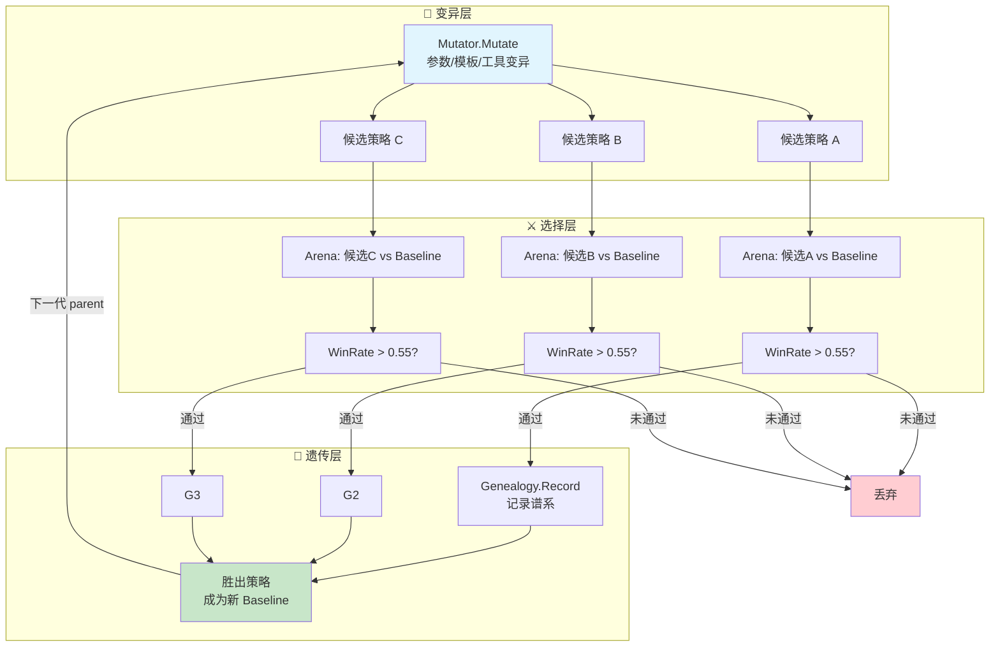
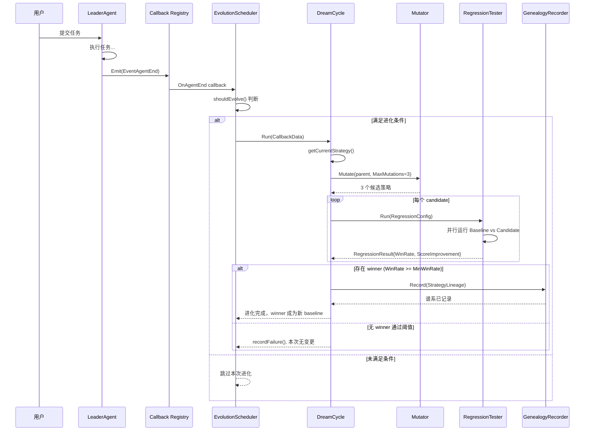
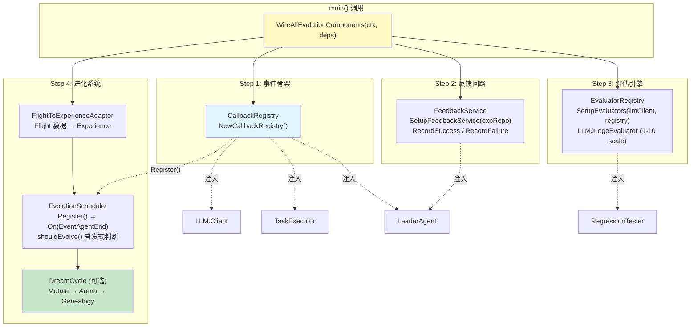

# GoAgentX 架构深度解析（十一）：自主进化 — 当 Agent 学会自己变强

> 你有没有想过…… Agent 为什么不能越用越聪明？
> 它每次犯错后还是犯同样的错，每次解决完一个问题下次又从头开始。
> 如果人能从错误中学习，为什么 Agent 不行？

---

## 一、一个天真的想法：直接改 prompt

先聊聊我走偏的那段路。

最开始做 GoAgentX 的时候，我最先想到的不是什么进化系统，而是**直接改 system prompt**。思路很朴素：

> Agent 表现不好 → 分析它哪里不好 → 在 system prompt 里加一条规则让它别再犯

比如 Agent 老是输出太啰嗦？在 prompt 里加一句"请简洁回答"。Agent 老是忘记检查错误码？加一条"务必检查所有 API 返回的错误"。我当时撸了一个极度简单的版本：

```go
// 伪代码——展示早期思路
type PromptTuner struct {
    rules []string
}

func (t *PromptTuner) Tune(prompt string, feedback string) string {
    rule := generateRuleFromFeedback(feedback) // 用 LLM 从反馈中提取规则
    t.rules = append(t.rules, rule)
    return prompt + "\n\n规则:\n" + strings.Join(t.rules, "\n")
}
```

这段代码现在看很蠢，但当时觉得挺美——一个 `[]string` 搞定，不需要额外的基础设施，不需要数据库，甚至不需要第二套 LLM 调用。prompt 变长了就变长呗，context window 现在不都挺大的吗？

但跑了一段时间之后，问题全暴露了。

### Prompt 膨胀：越改越长

第一条规则加进去还好。第十条也还行。等到第五十条的时候，你的 system prompt 已经从 200 tokens 膨胀到了 5000+ tokens。而且这些规则之间还会互相矛盾：

```
规则 #3: "回答要简洁"
规则 #17: "对技术问题提供详细解释"
规则 #31: "避免重复信息"
规则 #42: "确保覆盖所有边界情况"
```

LLM 看到这种互相打架的指令集，它的反应不是"智能权衡"，而是"随机选一个听"。你加的规则越多，它的行为越不可预测。

### 无法量化效果

更致命的问题是：**你根本不知道改完之后变好了还是变差了。**

加了"请简洁回答"这条规则之后，Agent 的回复确实短了。但同时它也开始跳过重要的细节。你怎么衡量这个 trade-off？没有 baseline，没有 metrics，没有 A/B test。全靠感觉。

### 没有反馈回路

最让我烦的是这个：Agent 改了 prompt 之后跑了一轮，表现怎么样？不知道。成功了？失败了？用户满意吗？没数据。你就像一个闭着眼睛调参的机器学习工程师——每一步都凭直觉，每一步都可能是在往反方向走。

### 教训

"直接改 prompt"这条路走不通，核心原因就一句话：**没有选择压力的变异不是进化，是随机漫步。**

生物进化之所以有效，是因为三个机制同时存在：**变异产生多样性，选择淘汰不适应的个体，遗传把好的特征传下去。** 我当时的做法只有"变异"（改 prompt），没有"选择"（不知道好坏），也没有"遗传"（下次又从头来）。这跟拿飞镖扎墙上的靶子没什么区别——扔得再多，也不代表你在进步。

所以我才回到基本面重新想：一个 Agent 的"进化"到底需要什么？

---

## 二、核心洞察：进化 = 变异 + 选择 + 遗传

类比生物进化论，我把 Agent 进化拆成了三个对应关系：

| 生物进化 | Agent 进化 | GoAgentX 实现 |
|---------|-----------|--------------|
| **变异** (Mutation) | 改参数 / 改 prompt / 生成新工具 | `Mutator.Mutate()` |
| **选择** (Selection) | Arena 回归测试（新策略 vs 旧策略） | `RegressionTester.Run()` + Welch's t-test |
| **遗传** (Heredity) | Genealogy 记录策略谱系 | `GenealogyRecorder.Record()` |
| **适应度** (Fitness) | Evaluator 评分 + Arena WinRate | `LLMJudgeEvaluator.Evaluate()` |

这不是我拍脑袋想出来的映射。它是反复验证后发现的：**任何自主改进系统，不管叫进化还是强化学习还是在线优化，底层都是这三步循环。** 差异只在"变异"的具体形式和"适应度函数"的定义方式。

完整的进化循环长这样：



注意几个关键设计决策：

**WinRate 阈值 = 0.55**：新策略不需要碾压旧策略，只要比它好一点点就行。这是保守策略——宁可少进化，也不要引入退化。0.55 意味着 100 次对比中新策略至少赢 55 次，统计显著性由 Welch's t-test 保证（p < 0.05）。

**谱系记录**：每一次成功的进化都会留下记录——parent 是谁、mutation type 是什么、win rate 多少、score 提升了多少。这让整个进化过程可追溯、可回滚、可分析。

---

## 三、基建盘点：75% 已经在那了

当我开始认真设计进化系统的时候，发现一件很有意思的事：**大部分基础设施已经在了。**

GoAgentX 之前做的 Experience System、Flight Recorder、Eval Engine、Callback System、Arena、Memory Distillation、DevAgent——这些模块单独看各管各的事，但合在一起恰好拼出了进化的完整拼图。

### 3.1 Experience System — Bandit 排序

`internal/experience/ranking_service.go` 里的 `RankingService` 实现了一个轻量级 bandit 系统：

```go
// Rank ranks experiences using multi-signal scoring.
// FinalScore = SemanticScore + UsageBoost + RecencyBoost
func (s *RankingService) Rank(ctx context.Context, experiences []*Experience, baseScores []float64) []*RankedExperience {
    // ...
    for i, exp := range experiences {
        semanticScore := baseScores[i]

        // Usage boost: log(1 + count) * weight, capped at 0.2
        usageBoost := s.calculateUsageBoost(exp.GetUsageCount())

        // Recency boost: exponential decay with 30-day half-life
        recencyBoost := s.calculateRecencyBoost(exp.CreatedAt, now)

        finalScore := semanticScore + usageBoost + recencyBoost
        // ...
    }
}
```

关键细节：**usage boost 用的是 `log(1 + count)` 而不是线性增长**。这意味着第 1 次使用到第 10 次使用的提升很大（log(10) ≈ 2.3），但从第 100 次到第 110 次几乎没差别（log(111) - log(101) ≈ 0.095）。加上 0.2 的硬上限，防止老经验霸榜。

而 `feedback_service.go` 提供了反馈回路：

```go
func (s *FeedbackService) RecordSuccess(ctx context.Context, experienceID string) error {
    // IncrementUsageCount: 成功使用一次 → usage_count += 1
    return s.experienceRepo.IncrementUsageCount(ctx, experienceID)
}

func (s *FeedbackService) RecordFailure(ctx context.Context, experienceID string) error {
    // DecrementRank: 失败一次 → rank score -= N
    return s.experienceRepo.DecrementRank(ctx, experienceID)
}
```

这就是一个完整的 bandit loop：**探索（检索经验）→ 利用（使用经验）→ 反馈（成功/失败）→ 更新排序权重**。问题是——这个回路之前是断开的（后面细说）。

### 3.2 Flight Recorder — 决策记录

Flight Recorder 记录了 Agent 执行过程中的每一个决策点：哪个 tool 被调用了、花了多久、有没有报错、LLM 返回了什么。这些数据在进化系统中扮演"诊断输入"的角色——进化需要知道"哪里出了问题"才能针对性地改进。

### 3.3 Eval Engine — 评估框架

`internal/eval/llm_judge.go` 实现了 LLM-as-Judge 评估器：

```go
type LLMJudgeEvaluator struct {
    client     LLMClient
    promptTmpl *template.Template
    scale      ScaleType // ScaleOneToTen / ScaleOneToFive / ScalePassFail
}

func (e *LLMJudgeEvaluator) Evaluate(ctx context.Context, tc TestCase, result TestResult) ([]EvalScore, error) {
    // 1. 渲染评估 prompt（包含 Input / ExpectedOutput / ActualOutput）
    prompt, err := e.renderPrompt(tc, result)

    // 2. 调用 LLM 做评判
    rawResponse, err := e.client.Generate(ctx, prompt)

    // 3. 解析 JSON 响应 → 结构化评分
    judgeResp, err := e.parseResponse(rawResponse)

    // 4. 归一化到 [0, 1]
    normalizedScore := judgeResp.Score / e.scale.maxScore()
    return []EvalScore{{Metric: "llm_judge", Score: normalizedScore}}, nil
}
```

支持三种评分尺度（1-10、1-5、pass/fail），prompt 可中英文切换，JSON 解析容错处理 markdown code fence 和纯文本嵌套。这就是进化系统的"适应度函数"——用来判断一个新策略比旧策略好多少。

### 3.4 Callback System — 事件钩子

`internal/callbacks/callbacks.go` 定义了完整的事件总线：

```go
const (
    EventLLMStart   Event = "llm.start"
    EventLLMEnd     Event = "llm.end"
    EventAgentStart Event = "agent.start"
    EventAgentEnd   Event = "agent.end"
    EventToolStart  Event = "tool.start"
    EventToolEnd    Event = "tool.end"
    // ...
)

type Registry struct {
    handlers map[Event][]Handler
}

func (r *Registry) On(event Event, handler Handler) { ... }
func (r *Registry) Emit(ctx *Context) { ... }
```

注册-分发模型，每个事件可以有多个 handler，handler panic 不影响其他 handler。这是进化系统的"触发器"——当 Agent 完成一个任务时，callback 触发进化判断逻辑。

### 3.5 Arena — 压力测试

`internal/arena/regression.go` 实现了完整的 A/B 回归测试框架：

```go
type RegressionTester struct {
    arena  *Service
    scorer Scorer
}

func (rt *RegressionTester) Run(ctx context.Context, cfg RegressionConfig) (*RegressionResult, error) {
    // 并行运行新旧策略
    g, gCtx := errgroup.WithContext(ctx)
    g.Go(func() error {
        oldScores, err = rt.runStrategy(gCtx, cfg.OldStrategy, cfg.BaselineRuns)
    })
    g.Go(func() error {
        newScores, err = rt.runStrategy(gCtx, cfg.NewStrategy, cfg.CompareRuns)
    })

    // Welch's t-test 统计显著性检验
    confident, pValue := computeSignificance(oldScores, newScores, cfg.Confidence)

    return &RegressionResult{
        WinRate:   winRate,
        Confident: confident,
        PValue:    pValue,
    }, nil
}
```

注意 `computeSignificance` 里用了 **Welch's t-test**（不是配对 t-test），因为新旧策略的样本量可以不同。p-value 近似用了 Abramowitz and Stegun 的误差函数公式，对小自由度做了保守放大（scale factor）。这不是玩具级别的统计检验——是可以用在生产环境里的。

### 3.6 Memory Distillation — 知识蒸馏

上一篇文章详细讲过。蒸馏出的 Experience 就是进化系统的"原材料"——经验库里的每一条记录都是 Agent 过去行为的结晶，进化系统从中学习哪些模式该保留、哪些该抛弃。

### 3.7 DevAgent — 代码生成

DevAgent 可以生成代码、修改配置、创建工具。在进化的未来阶段（Level 3: 工具自动生成），它会负责把"需要一个能做 X 的新工具"这个需求变成实际可运行的代码。

---

## 四、五个断裂点

基建都在，但它们之间是断开的。就像你有一台发动机、一套传动轴、四个轮子、一个方向盘——但它们散落在地上，没组装起来。我在梳理过程中发现了五个关键的断裂点：

### Fix #1: Bandit 反馈回路断开（UsageCount=0）

**问题**：`RankingService` 的 `calculateUsageBoost` 依赖 `GetUsageCount()` 返回的使用次数。但如果没有人在任务完成后调用 `FeedbackService.RecordSuccess()`，这个值永远是 0。Bandit 系统退化为纯粹的语义检索——用过一百次的经验和全新经验的排名一样。

**修复**：在 bootstrap 层面统一注入 FeedbackService 到 LeaderAgent：

```go
// bootstrap.go
func SetupFeedbackService(expRepo repositories.ExperienceRepositoryInterface) *experience.FeedbackService {
    if expRepo == nil {
        return nil
    }
    svc := experience.NewFeedbackService(expRepo)
    return svc
}

// 使用时：
result := bootstrap.WireExperienceSystem(expRepo)
agent := leader.New(..., result.FeedbackOption)  // 注入 FeedbackService
```

LeaderAgent 在任务完成时调用 `RecordSuccess(experienceID)` 或 `RecordFailure(experienceID)`，闭环形成。

### Fix #2: Callback 零注册零发射

**问题**：Callback Registry 创建了，但没人往上面注册 handler。`Registry.Emit()` 被调用了，但 `handlers[event]` 是空的——Emit 直接变成 no-op。

**修复**：bootstrap 统一注册：

```go
// bootstrap.go
func NewCallbackRegistry() *callbacks.Registry {
    return callbacks.NewRegistry()
}

// 注入到各个组件：
client, err := NewLLMClientWithCallbacks(config, reg)     // LLM Client 发射 llm.start/end
executorOpt := WireTaskExecutorCallbacks(reg)              // TaskExecutor 发射 tool.start/end
leaderOpt := WireLeaderAgentCallbacks(reg)                 // LeaderAgent 发射 agent.start/end
```

然后在 `EvolutionScheduler.Register()` 中订阅 `EventAgentEnd`：

```go
// scheduler.go
func (s *EvolutionScheduler) Register() {
    s.callbacks.On(callbacks.EventAgentEnd, func(ctx *callbacks.Context) {
        data := CallbackData{AgentID: ctx.AgentID}
        s.OnAgentEnd(callbackCtx, data)
    })
}
```

这样每当 Agent 完成一次任务，evolution scheduler 就会收到通知并判断是否需要启动进化周期。

### Fix #3: 缺少 LLM Judge

**问题**：Arena 需要 Scorer 来给策略打分，但没有现成的 evaluator 可以直接接入。

**修复**：bootstrap 注册 LLMJudgeEvaluator：

```go
// bootstrap.go
func SetupEvaluators(llmClient *llm.Client, registry *eval.EvaluatorRegistry) error {
    judge, err := eval.NewLLMJudgeEvaluator(llmClient,
        eval.WithChinesePrompt(),
        eval.WithScale(eval.ScaleOneToTen),
    )
    registry.Register("llm_judge", judge)
    return nil
}
```

`llm.Client` 天然满足 `eval.LLMClient` 接口（同样的 `Generate(ctx, prompt)` 签名），不需要 adapter wrapper。

### Fix #4: 两套蒸馏系统割裂

**问题**：`distillation.Distiller` 产出的 StoredExperience 和 `evolution.Experience` 是两个不同的类型。蒸馏系统写的数据进化系统读不了。

**修复**：Adapter 模式桥接两层：

```go
// bootstrap.go - experienceStoreAdapter
type experienceStoreAdapter struct {
    repo repositories.ExperienceRepositoryInterface
}

func (a *experienceStoreAdapter) Create(ctx context.Context, exp *distillation.StoredExperience) error {
    model := &models.Experience{
        TenantID:  exp.TenantID,
        Type:      exp.Type,
        Problem:   exp.Problem,
        Solution:  exp.Solution,
        Score:     exp.Score,
        Success:   exp.Score > 0.5,
        Metadata:  metadata,
    }
    return a.repo.Create(ctx, model)
}

// 使用时：
result.DistillerSetter(distiller)  // 将 adapter 注入 Distiller
```

同理，`evolutionExpRepoAdapter` 把 postgres repository 接口适配为 evolution 包的 domain 接口。

### Fix #5: Flight 数据只看不行动

**问题**：Flight Recorder 记录了大量诊断数据（超时、LLM 错误、解析失败等），但这些数据只是躺在那里给人看的。没有人自动从这些诊断中提取经验。

**修复**：`FlightToExperienceAdapter` 自动消费 Flight 数据：

```go
// adapter.go
func (a *FlightToExperienceAdapter) Run(ctx context.Context) error {
    subscriber := a.flight.EventStore()
    ch, err := subscriber.Subscribe(ctx, events.EventFilter{
        Types: []events.EventType{
            events.EventTaskFailed,
            events.EventStepFailed,
            events.EventStepRecoveryFailed,
        },
    })

    for evt := range ch {
        a.processEvent(ctx, evt)  // 自动将故障转化为 Experience
    }
    return nil
}
```

只关注 severity >= 3 的故障（低 severity 的不值得学），score 与 severity 反比（越严重的故障 score 越低，表示"这是要避免的模式"）。

---

## 五、Dream Mode：让 Agent 做梦

好了，五个断裂点修完了，基建也接上了。现在讲最核心的部分——**Dream Mode**。

什么是 Dream Mode？简单说就是：**让 Agent 在空闲时自己跟自己下棋。**

人睡觉的时候大脑在做记忆整理——把白天的经历归类、提炼模式、加强重要连接、弱化无用连接。Dream Mode 对 Agent 做的事情类似：利用空闲时间，基于历史数据生成策略变种，在 Arena 里跟当前策略 PK，赢了就替换，输了就丢掉。

### 完整数据流



### 三级变异梯度

Mutator 支持三级变异，按风险从低到高排列：

**Level 1: 参数变异（Parameter Mutation）— 80% 概率**

```go
// mutation/mutator.go
var DefaultParamRanges = map[string]ParamRange{
    "temperature":        {Values: []any{0.1, 0.3, 0.5, 0.7, 0.9}},
    "top_k":             {Values: []any{10, 20, 40, 80}},
    "max_steps":         {Values: []any{5, 10, 15, 20}},
    "memory_limit":      {Values: []any{3, 5, 10}},
    "conflict_threshold": {Values: []any{0.85, 0.90, 0.95}},
}

func (m *Mutator) mutateParameter(parent *Strategy) (*Strategy, error) {
    child := parent.Clone()
    candidates := m.mutableParamNames(child.Params)
    paramName := candidates[0]                    // 随机选一个参数
    newVal := m.pickDifferentValue(rangeDef.Values, child.Params[paramName])
    child.Params[paramName] = newVal             // 改成不同的值
    return child, nil
}
```

从预定义的取值范围里随机挑一个不同于当前值的。比如 temperature 当前是 0.7，可能变异成 0.3 或 0.9。这是最安全的变异——不会改变 Agent 的行为逻辑，只会调整行为风格。

**Level 2: Prompt 模板变异（Prompt Mutation）— 20% 概率**

```go
func (m *Mutator) mutatePrompt(parent *Strategy) (*Strategy, error) {
    child := parent.Clone()
    newTemplate := m.pickDifferentString(m.promptPool, parent.PromptTemplate)
    child.PromptTemplate = newTemplate  // 换一个 prompt 模板
    return child, nil
}
```

从 prompt pool 里换一个不同的模板。这比参数变异激进得多——相当于改变 Agent 的"性格"。所以概率设得很低（20%），而且要求 promptPool 至少有 2 个不同模板才触发。

**Level 3: 工具自动生成（Tool Mutation）— TODO**

```go
const (
    MutationTool MutationType = iota + 2
    // TODO: reserved for future use in Iteration 3
    // Currently no code path generates this mutation type.
)
```

这是最激进的变异——让 Agent 自己发明新工具。目前还是 TODO，因为需要 DevAgent 的深度集成以及更严格的安全审查。

### DreamCycle.Run() 核心流程

```go
// dream_cycle.go
func (dc *DreamCycle) Run(ctx context.Context, data CallbackData) error {
    dc.taskCount++  // 无条件递增，用于阈值追踪

    // 快速路径：各种前置检查
    if !dc.config.Enabled { return nil }
    if time.Since(dc.lastCycle) < dc.config.Cooldown { return nil }  // 冷却期
    if taskCount < dc.config.MinTasksBeforeEvolve { return nil }     // 最小任务数
    if !dc.scheduler.shouldEvolve(ctx, data) { return nil }          // 启发式判断

    // Step 1: 获取当前活跃策略作为父代
    parent, err := dc.getCurrentStrategy()

    // Step 2: 生成 N 个候选变异
    candidates, err := dc.mutator.Mutate(ctx, parent, dc.config.MaxMutations)

    // Step 3: Arena 测试，找最佳 winner
    winner, err := dc.findWinner(ctx, candidates, parent)

    // Step 4: 记录谱系
    if dc.genealogy != nil {
        lineage := StrategyLineage{
            ParentID:        parent.ID,
            ChildID:         winner.strategy.ID,
            MutationType:    "dream_cycle",
            WinRate:         winner.winRate,
            ScoreImprovement: winner.scoreImprovement,
        }
        dc.genealogy.Record(ctx, lineage)
    }

    return nil
}
```

注意 `getCurrentStrategy()` 目前返回的是一个 placeholder：

```go
func (dc *DreamCycle) getCurrentStrategy() (Strategy, error) {
    // TODO: replace with real strategy store lookup.
    slog.Warn("[DreamCycle] Using placeholder strategy; integrate with strategy store for production")
    return Strategy{
        ID:      "root-strategy-v1",
        Name:    "DefaultStrategy",
        Version: 1,
        Params: map[string]any{
            "temperature":   0.7,
            "max_tokens":    4096,
            "retry_count":   3,
            "timeout_secs":  120,
        },
    }, nil
}
```

这是一个明确的 TODO——生产环境需要对接真实的 Strategy Store 来读取当前活跃策略。placeholder 保证系统可以跑通流程，但进化出来的"更好策略"暂时还无法真正替换线上配置。

### Arena 从"搞挂 Agent"变成"验证网关"

最初设计 Arena 的目的是**压力测试**——故意给 Agent 输入极端 case 看它会不会崩。但在进化系统的语境下，Arena 的角色变了：它变成了**策略验证网关**。

```go
// dream_cycle.go - findWinner
func (dc *DreamCycle) findWinner(ctx context.Context, candidates []Strategy, baseline Strategy) (*candidateResult, error) {
    var best *candidateResult

    for _, cand := range candidates {
        result, err := dc.tester.Run(ctx, RegressionConfig{
            Candidate:      cand,
            Baseline:       baseline,
            TaskSampleSize: 50,
        })

        // WinRate 低于阈值直接跳过
        if result.WinRate < dc.config.MinWinRate { continue }

        cr := &candidateResult{
            strategy:         cand,
            winRate:          result.WinRate,
            scoreImprovement: result.CandidateScore - result.BaselineScore,
        }

        if best == nil || cr.scoreImprovement > best.scoreImprovement {
            best = cr
        }
    }
    return best, nil
}
```

50 个历史任务重放，每个候选策略都要跟 baseline 做 A/B 对比，WinRate >= 0.55 且统计显著（Welch's t-test p < 0.05）才算通过。三重保险保证不会让一个更差的策略上线。

---

## 六、Bootstrap 接线：最后一公里

组件都实现了，断裂点也修了，但还有一个终极问题：**谁来把这些东西组装起来？**

如果每个使用者都要自己了解 CallbackRegistry 怎么创建、FeedbackService 怎么注入、EvolutionScheduler 怎么注册、DreamCycle 怎么挂载……那这套系统的使用门槛太高了。99% 的人会在第一步就放弃。

所以有了 `WireAllEvolutionComponents()` —— 一行调用，全部到位。

### 架构图



### 核心代码

```go
// bootstrap.go
func WireAllEvolutionComponents(
    ctx context.Context,
    deps *WireDependencies,
) (*WiredComponents, error) {
    result := &WiredComponents{}

    // Step 1: Callback Registry — 所有事件的总枢纽
    result.CallbackReg = NewCallbackRegistry()

    // Step 2: Feedback Service — Bandit 反馈回路
    result.FeedbackSvc = SetupFeedbackService(deps.ExpRepo)

    // Step 3: Evaluator — LLM Judge 评估器
    result.EvalRegistry = eval.NewEvaluatorRegistry()
    if deps.LLMClient != nil {
        SetupEvaluators(deps.LLMClient, result.EvalRegistry)
    }

    // Step 4: Evolution System — 完整进化管线
    if deps.FlightRecorder != nil && deps.ExpRepo != nil {
        evolutionRepo := &evolutionExpRepoAdapter{repo: deps.ExpRepo}
        evolutionComps, err := SetupEvolution(
            ctx, deps.FlightRecorder, evolutionRepo,
            result.CallbackReg, deps.DreamDeps,
        )
        result.Evolution = evolutionComps
    }

    return result, nil
}
```

返回的 `WiredComponents` 结构体包含了所有需要注入到 Agent 中的组件：

```go
type WiredComponents struct {
    CallbackReg    *callbacks.Registry           // → llm.WithCallbacks(reg)
    FeedbackSvc    *experience.FeedbackService    // → leader.WithFeedbackService(svc)
    EvalRegistry   *eval.EvaluatorRegistry        // → arena.NewRegressionTester(arena, scorer)
    Evolution      *EvolutionComponents          // 内部自闭环
    // ...
}
```

### 五条链路如何闭合

| # | 链路 | 入口 | 出口 | 状态 |
|---|------|------|------|------|
| 1 | **事件发射** | LLM Client / TaskExecutor / LeaderAgent | CallbackRegistry.Emit() | ✅ 已闭合 |
| 2 | **事件接收** | CallbackRegistry `EventAgentEnd` | EvolutionScheduler.OnAgentEnd() | ✅ 已闭合 |
| 3 | **反馈回路** | LeaderAgent 任务完成 | FeedbackService.RecordSuccess/Failure | ✅ 已闭合 |
| 4 | **经验同步** | Distiller 蒸馏完成 | ExperienceStoreAdapter.Create() | ✅ 已闭合 |
| 5 | **进化执行** | Scheduler.shouldEvolve() → DreamCycle.Run() | Mutator → Arena → Genealogy | ⚠️ 部分闭合 |

第五条链路里，`getCurrentStrategy()` 还是 placeholder，`shouldEvolve()` 里的分数退化检测也是 TODO。核心流程跑通了，但"读取真实策略"和"检测性能退化"这两个环节还需要对接实际的数据源。

### main() 一行调用 → 全部组件就位

```go
// main.go 中的典型用法
func main() {
    // ... 初始化基础依赖 ...

    wired, err := bootstrap.WireAllEvolutionComponents(ctx, &bootstrap.WireDependencies{
        LLMClient:      llmClient,
        FlightRecorder: flightRecorder,
        ExpRepo:        expRepo,
        EmbeddingService: embedder,
        Distiller:      distiller,
        DreamDeps: &bootstrap.DreamCycleDeps{
            Mutator:   mutator,
            Tester:    testerAdapter,
            Genealogy: genealogyDB,
        },
    })
    if err != nil {
        log.Fatal(err)
    }

    // 用 wired 的组件构造 Agent
    agent := leader.New(
        leader.WithCallbacks(wired.CallbackReg),
        leader.WithFeedbackService(wired.FeedbackSvc),
    )
    // ...
}
```

从调用方的视角看，进化系统是透明的——你不需要知道 Callback、Feedback、Arena、Mutator 这些概念的存在。`WireAllEvolutionComponents` 把复杂性封装在一处，返回的就是一组可以直接塞进 Agent 构造函数的选项。

---

## 七、实施路线与风险

### 三个迭代的时间线

| 迭代 | 目标 | 核心交付 | 风险等级 |
|------|------|---------|---------|
| **Iteration 1** ✅ | 闭环跑通 | WireAllEvolutionComponents + 参数变异 + Arena 验证 | 低 |
| **Iteration 2** 🔄 | Prompt 进化 | Prompt 模板池管理 + A/B 测试 + 自动替换 | 中 |
| **Iteration 3** 🔮 | 工具自生成 | DevAgent 集成 + 安全沙箱 + 工具审核流程 | 高 |

当前状态：**Iteration 1 基本完成**，WireAllEvolutionComponents 已经可用，参数变异和 Arena 验证链路已打通。剩余工作主要是 `getCurrentStrategy()` 对接真实 Strategy Store 和 `shouldEvolve()` 接入实际分数数据。

### 风险表

| 风险 | 影响 | 概率 | 缓解措施 |
|------|------|------|---------|
| **进化导致性能退化** | 线上 Agent 变慢或变蠢 | 中 | WinRate 阈值 0.55 + 统计显著性检验 + canary 发布 |
| **Prompt 变异产生有害行为** | Agent 输出不安全内容 | 低 | 人工审核 prompt pool + 安全过滤器 |
| **资源竞争** | 进化消耗过多计算资源 | 中 | Cooldown 5 分钟 + 空闲触发 + 资源限额 |
| **策略爆炸** | 变异产生的策略版本无限增长 | 低 | Genealogy 定期清理 + 只保留胜者链 |
| **反馈操纵** | Agent 故意刷高自己的评分 | 极低 | 评分由独立 Evaluator 完成，不受 Agent 控制 |

### 生产就绪检查清单

- [ ] `getCurrentStrategy()` 对接真实 Strategy Store（非 placeholder）
- [ ] `shouldEvolve()` 接入 EvalEngine 或 Flight Diagnostics 的真实分数数据
- [ ] DreamCycle 默认 Enabled=false，需显式开启
- [ ] 进化结果写入 Audit Log，可追溯每次策略变更
- [ ] 提供 Rollback 接口，可一键回滚到任意历史策略版本
- [ ] 监控指标：进化周期数、平均 WinRate、平均 ScoreImprovement、策略版本号
- [ ] 资源限制：最大并发进化数、单次进化最长耗时、最大存储占用

---

## 八、下一步：全自主进化

Iteration 1 只是让进化系统"能动起来"。真正的有意思的东西还在后面：

### Level 2: Prompt 模板变异

当前 Mutator 的 prompt mutation 只是从预设池里选一个不同的模板。下一步是让 LLM 自己生成 prompt 变种：

```
当前 prompt: "你是一个有帮助的 AI 助手..."
→ LLM 生成 5 个变种:
  1. "你是资深软件工程师，注重代码质量..."
  2. "你是一个简洁高效的助手..."
  3. "你擅长分解复杂问题..."
  4. ...
→ Arena PK → 选最好的 → 替换
```

这比参数变异危险得多（可能生成有害 prompt），但也更有价值（质的飞跃而非量的微调）。需要配合人工审核或安全过滤。

### Level 3: 工具自动生成

这是最疯狂的设想：Agent 发现自己缺某个能力，于是自己写一个工具来补上。

```
Agent 尝试解析 JSON 失败了三次
→ 诊断: 缺少 JSON schema validation 能力
→ DevAgent 生成 validate-json 工具
→ Arena 测试: 有这个工具 vs 没有这个工具
→ WinRate 显著提升 → 自动注册到 Tool Registry
```

显然这需要极其严格的安全审计——不能让 Agent 随意生成和执行代码。沙箱、权限控制、人工审批都是必须的。

### 进化 Dashboard

当进化系统跑起来之后，你需要一个地方看它在干什么：

- **策略家谱树**：从 root-strategy-v1 到当前版本的完整进化链路
- **每次进化的详情**：mutation type、前后参数对比、WinRate、p-value
- **实时监控**：当前 active strategy 版本、上次进化时间、待处理队列
- **手动干预**：强制触发进化、回滚策略、调整阈值

### 什么时候 Agent 会写出比自己更好的代码？

这是最终极的问题。

说实话我不知道答案。但我确定一件事：**如果我们不让 Agent 尝试自我改进，那它永远不可能超越我们给它写的初始代码。** 进化系统不一定能让 Agent 写出更好的代码，但它至少提供了一个机制——一个让 Agent 能够系统性试错、量化评估、保留改进的框架。

也许某一天你会发现 Agent 自己把 temperature 从 0.7 调到了 0.3，然后准确率提升了 12%。或者它自己生成了一个你没想过的新 prompt 模板，然后用户满意度涨了。又或者它什么都没改进——但至少你知道它试过了，而且你有数据证明"这条路走不通"。

这就够了。工程上最大的进步往往不是来自天才的一闪念，而是来自**有系统地排除错误选项**。

---

## 总结

GoAgentX 的自主进化系统不是什么黑科技。它就是把生物进化论的最核心思想——**变异、选择、遗传**——翻译成了代码：

```
Callback 触发 → Scheduler 判断 → DreamCycle 编排
  → Mutator 变异(参数/Prompt/工具)
  → Arena 验证(Welch's t-test + WinRate ≥ 0.55)
  → Genealogy 记录谱系
  → 胜者成为新一代 Baseline
```

整套系统的设计哲学是**保守渐进**：

- **默认关闭**：`Enabled: false`，必须显式开启
- **高门槛通过**：WinRate 0.55 + p < 0.05，宁可不进化也不退化
- **完全可追溯**：每一步都有日志、谱系、Audit Trail
- **优雅降级**：任何组件缺失都不影响基本功能，只是跳过进化

坦白说，这套系统还有很多 TODO：`getCurrentStrategy()` 还是 placeholder、`shouldEvolve()` 的分数退化检测还没接入、Level 3 工具自生成还只是一个 enum 值。但骨架已经搭好了，五条链路已经闭合了四条半，剩下的就是填空题而不是问答题了。

如果你也想给你的 Agent 加一套自我进化能力，我的建议是：**不要一上来就搞 Dream Cycle**。先把 Callback + FeedbackService 这条反馈回路跑通——让 Agent 的每一次成功和失败都被记录下来。然后再加 Arena 做策略验证。最后才是 Mutator + DreamCycle 的完整进化循环。

一步一步来，每一步都可以独立产出价值。这才是工程该有的样子。

---

**下一篇预告**：Security Hardening——当时写安全模块是因为我发现 Agent 会把自己生成的 SQL 直接扔给数据库执行，没有任何参数化。还有 RCE、Prompt Injection、SSRF……基本上 OWASP Top 10 它占了一半。于是我搞了一套多层防御体系：Input Sanitizer → Permission Guard → Audit Logger → Rate Limiter。另外还有 Runtime Kill Switch——发现异常行为 100ms 内熔断。
