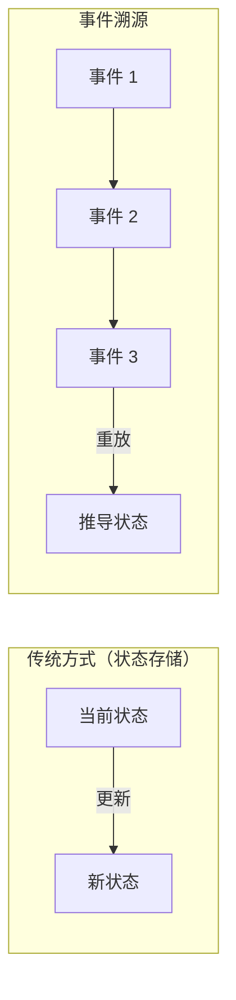
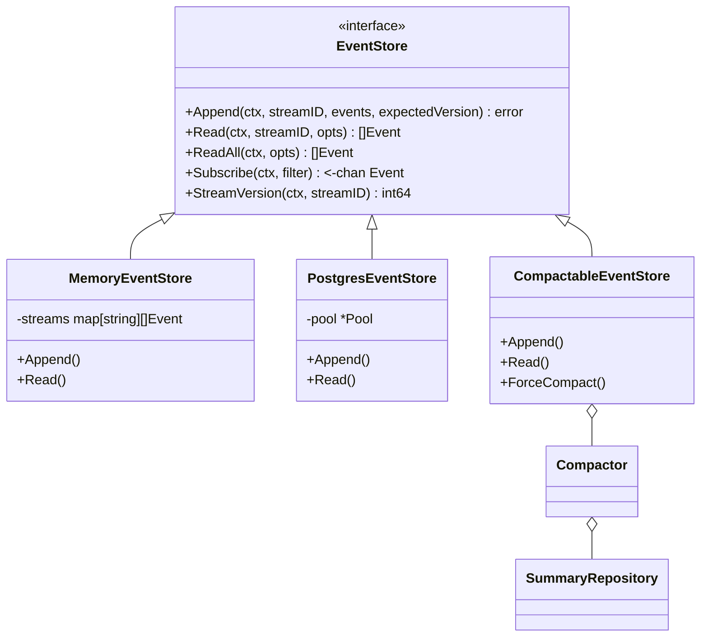
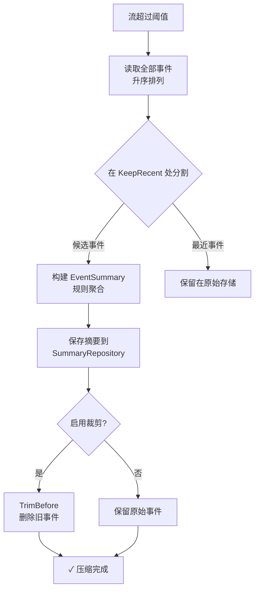
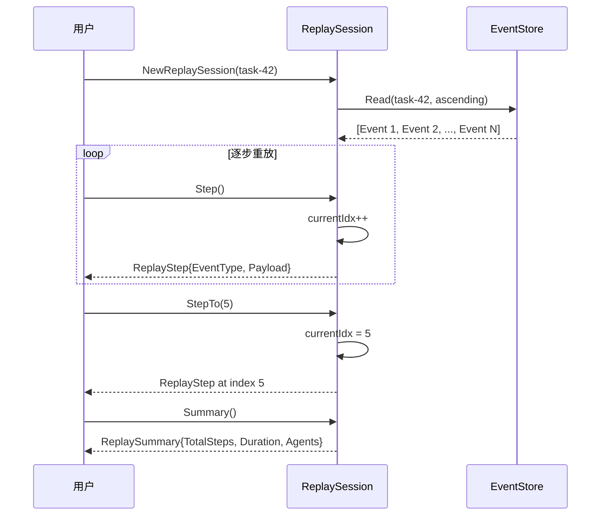
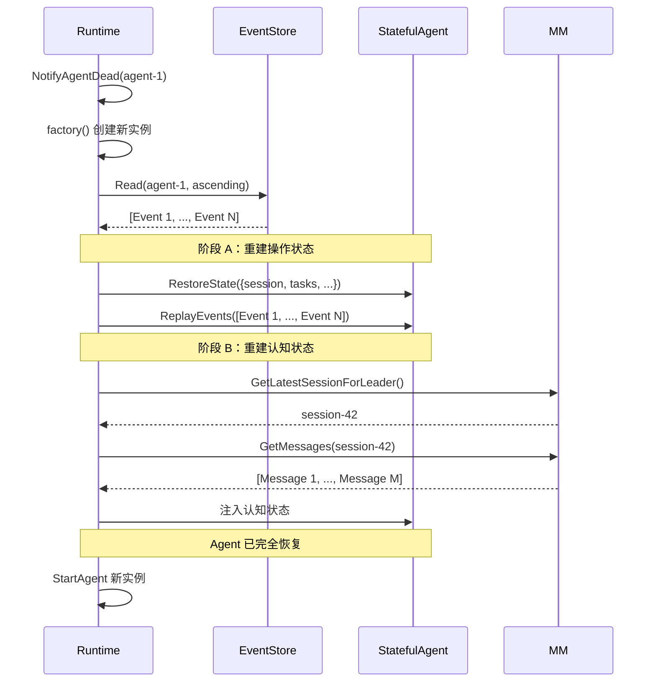
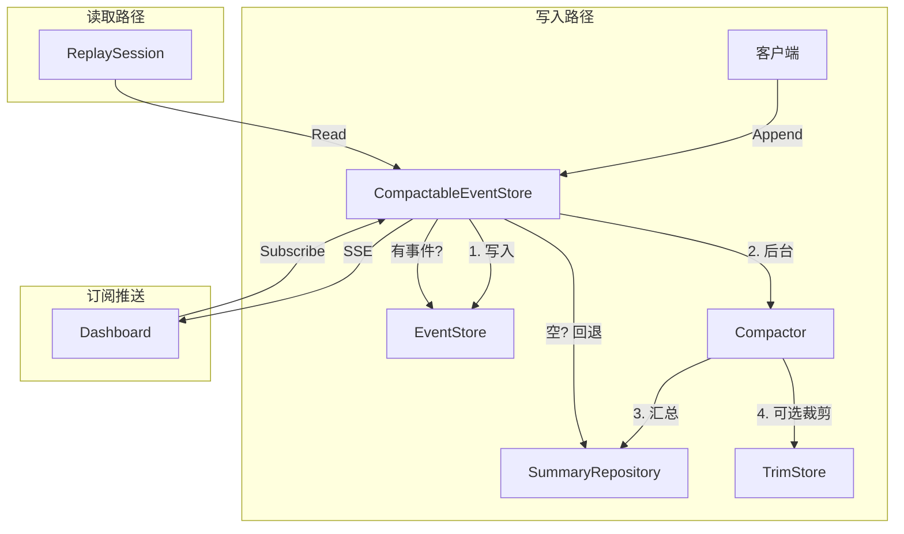

# GoAgentX 架构深度解析（八）：事件系统 — 状态恢复与审计追踪的事件溯源基石

> Agent 启动是个事件、任务分配是个事件、工具调用是个事件、LLM 返回是个事件、Agent 挂了也是个事件。
> 我当时就在想：**如果我把 Agent 干的每一件事都记下来，是不是就能在它挂了之后完全重建它的状态？**
> 答案是能。这就是 Event Sourcing 在 GoAgentX 里的玩法。

---

## 一、为什么非要记每一件事

最早我做 Agent 的时候，状态管理是用一个全局 struct 搞的。Agent 干到哪一步了、处理了什么数据、出了什么错——全塞在一个大 map 里。看起来简单，但问题来了——

我记得印象最深的一次：一个 Agent 在生产环境跑了一整个下午，处理了 30 多个用户请求，每个请求都涉及多轮对话和工具调用。突然进程挂了——oom killed，日志里只留下一行 "signal: killed"。

所有状态全部丢失。

没有 checkpoint，没有任何恢复手段，没有任何办法知道它死之前正在处理什么。用户来问："Agent 怎么不回我了？"我说："它失忆了。"那一刻我意识到：状态不持久化，Agent 就是个一次性的消耗品——用完就丢，丢了就找不回来。

说白了，全局 map 的方式有三个硬伤：

1. Agent 挂了，map 没了，状态丢了
2. 想查 Agent 五分钟前干了什么——没记录
3. 想审计 Agent 有没有越权调用工具——没日志

后来我研究了一下 Event Sourcing（事件溯源），发现它的思路完全相反：**不存当前状态，存状态变更的每一次操作。当前状态？重放事件自己算。**

这个模式在金融系统里用了很多年，但在 Agent 框架里用得不多。我当时就想：既然没人做，那就我来做。



这种架构提供了三个关键保障：
- **完整的审计轨迹**：每次状态变更都有时间戳和载荷记录
- **时间旅行查询**：系统可以回答"在 T 时刻状态是什么？"
- **状态重建**：任何 Agent 的状态都可以通过重放其事件流从零重建

核心文件：

| 文件 | 用途 |
|------|------|
| `internal/events/types.go` | Event 模型、EventStore 接口 |
| `internal/events/memory_store.go` | 内存版 EventStore |
| `internal/events/pg_store.go` | PostgreSQL 版 EventStore |
| `internal/events/compactor.go` | 事件压缩为摘要 |
| `internal/events/trim_store.go` | 压缩后删除旧事件 |
| `internal/events/compactable_store.go` | 自动压缩的 EventStore 包装器 |
| `internal/events/summary.go` | EventSummary 模型 + CompactionConfig |
| `internal/events/summary_repository.go` | PgSummaryRepository |
| `internal/events/memory_summary_repo.go` | 内存版 SummaryRepository |
| `internal/flight/replay.go` | ReplaySession 逐步重放 |

---

## 二、事件模型

### 2.1 事件结构

`internal/events/types.go` 定义了基础类型：

```go
type Event struct {
    ID        string         `json:"id"`
    StreamID  string         `json:"stream_id"`
    Type      EventType      `json:"type"`
    Payload   map[string]any `json:"payload"`
    Metadata  map[string]any `json:"metadata,omitempty"`
    Version   int64          `json:"version"`
    Timestamp time.Time      `json:"timestamp"`
}
```

每个事件属于一个**流**（由 `StreamID` 标识）。流是某个实体的只追加事件序列——通常是一个 Agent。`Version` 字段支持乐观并发控制，`Type` 字段用于路由和重放分类。

### 2.2 事件类型

```go
const (
    EventAgentStarted        EventType = "agent.started"
    EventAgentStopped        EventType = "agent.stopped"
    EventAgentFailed         EventType = "agent.failed"
    EventTaskCreated         EventType = "task.created"
    EventTaskAssigned        EventType = "task.assigned"
    EventTaskCompleted       EventType = "task.completed"
    EventTaskFailed          EventType = "task.failed"
    EventMessageAdded        EventType = "message.added"
    EventLLMCall             EventType = "llm.call"
    EventToolCall            EventType = "tool.call"
    EventSessionCreated      EventType = "session.created"
    EventFailoverTriggered   EventType = "failover.triggered"
    EventFailoverCompleted   EventType = "failover.completed"
)
```

### 2.3 EventStore 接口

```go
type EventStore interface {
    Append(ctx context.Context, streamID string, events []*Event, expectedVersion int64) error
    Read(ctx context.Context, streamID string, opts ReadOptions) ([]*Event, error)
    ReadAll(ctx context.Context, opts ReadOptions) ([]*Event, error)
    Subscribe(ctx context.Context, filter EventFilter) (<-chan *Event, error)
    StreamVersion(ctx context.Context, streamID string) (int64, error)
}
```



关键语义：
- `Append` 使用 `expectedVersion` 实现乐观并发控制：`0` 要求 stream 为空，`-1` 跳过检查，正值必须匹配
- `Read` 通过 `ReadOptions` 支持 `FromVersion`、`Limit`、`Direction`（升序/降序）
- `Subscribe` 返回匹配过滤器的事件 channel，context 取消时关闭

---

## 三、存储实现

### 3.1 MemoryEventStore

`internal/events/memory_store.go` 提供了内存实现，主要用于测试和演示模式：

```go
type MemoryEventStore struct {
    mu      sync.RWMutex
    streams map[string][]*Event
    events  []*Event
    version int64
}
```

`Append` 方法执行加锁 → 版本校验 → 分配序号 → 写入流存储和扁平存储 → 通知订阅者。`Subscribe` 创建容量为 100 的缓冲 channel，新事件广播到所有 channel，缓冲区满时丢弃（非阻塞发送）。

### 3.2 PostgresEventStore

`internal/events/pg_store.go` 提供生产级 PostgreSQL 实现：

```sql
INSERT INTO events (id, stream_id, type, payload, metadata, version, created_at, timestamp)
VALUES ($1, $2, $3, $4, $5, $6, $7, $8)
ON CONFLICT (stream_id, version) DO NOTHING
```

`ON CONFLICT DO NOTHING` 提供了幂等追加——同一事件因客户端重试而被重复插入时，第二次会被静默忽略。这对"至少一次"投递语义至关重要。

---

## 四、事件压缩管线

没有压缩的情况下，事件存储会无限增长。GoAgentX 的 Compactor 通过将旧事件汇总为紧凑摘要来解决这个问题。

### 4.1 CompactionConfig

```go
type CompactionConfig struct {
    Threshold              int           // 触发压缩的事件数（默认 500）
    KeepRecent             int           // 保留的原始事件数（默认 100）
    MaxSummariesPerStream  int           // 每流最大摘要数
    SummaryTTL             time.Duration // 摘要保留时长（默认 30 天）
    EnableTrimming         bool          // 压缩后是否删除原始事件
}
```

默认行为：当流超过 500 个事件时，将最旧的 400 个压缩为摘要，保留最新的 100 个作为原始事件。

### 4.2 压缩管线



### 4.3 DefaultSummarizer

规则摘要器无需 LLM 调用即可生成简明的英文摘要：

```
Agent agent-1 ran 3 task(s) [task-42, task-43, task-44],
called 5 tool(s) [search, book, weather, calculator, email],
emitted 23 events over 3m12s,
bound to user request: "Plan a trip to Tokyo",
result: completed
```

### 4.4 读取的摘要回退机制

如果原始事件已被裁剪，`Read` 会自动回退到摘要：

```go
func (s *CompactableEventStore) Read(ctx context.Context, streamID string, opts ReadOptions) ([]*Event, error) {
    events, err := s.EventStore.Read(ctx, streamID, opts)
    if err != nil {
        return nil, err
    }
    if len(events) > 0 {
        return events, nil
    }

    summaries, summaryErr := s.compactor.repo.FindByStreamID(ctx, streamID)
    if summaryErr != nil || len(summaries) == 0 {
        return events, nil
    }

    synthetic := make([]*Event, 0, len(summaries))
    for _, sum := range summaries {
        synthetic = append(synthetic, &Event{
            Type: EventType("event.summary"),
            Payload: map[string]any{
                "summary_text": sum.SummaryText,
                "event_count":  sum.EventCount,
                "outcome":      sum.Outcome,
            },
        })
    }
    return synthetic, nil
}
```

---

## 五、ReplaySession

`internal/flight/replay.go` 提供了任务的逐步事件重放：



核心方法：
- `Step()`：前进一个事件，返回该步
- `StepTo(n)`：跳转到指定步骤
- `Summary()`：返回概述（总步数、耗时、Agent ID 列表、事件类型分布）
- `Reset()`：回到起始位置

---

## 六、存储实现对比

| 特性 | MemoryEventStore | PostgresEventStore |
|------|-----------------|-------------------|
| 持久化 | 无（进程级） | 是（表存储） |
| 并发控制 | 互斥锁 | `ON CONFLICT DO NOTHING` |
| 订阅 | buffered channel + subscriber map | LISTEN/NOTIFY 或轮询 |
| 适用场景 | 测试、演示、单进程 | 生产环境、分布式部署 |

---

## 七、集成 Agent 复活

事件系统深度集成到 Runtime 的复活管线中：



双阶段恢复确保：
- **操作状态**（任务、会话、执行状态）从事件流重建
- **认知状态**（对话历史、记忆）从 MemoryManager 恢复
- **每个阶段独立可恢复**——部分恢复优于完全不恢复

---

## 八、架构总结

### 设计模式

| 模式 | 位置 | 用途 |
|------|------|------|
| 事件溯源 | `types.go` | 不可变只追加日志 |
| 乐观并发控制 | `Append(expectedVersion)` | 并发写入冲突检测 |
| CQRS | EventStore(写) + SummaryRepository(读) | 写优化原始存储 + 读优化摘要 |
| 观察者模式 | `Subscribe(channel)` | 实时事件流推送 |
| 策略模式 | `Summarizer` 函数类型 | 可插拔摘要生成（规则或 LLM） |
| 装饰器模式 | `CompactableEventStore` 包装 `EventStore` | 透明压缩，API 不变 |
| 防抖 | `lastChecked` 映射 | 避免冗余压缩检查 |

### 关键数据流



---

## 九、结语

Event Sourcing + CQRS + 可插拔存储 + 自动压缩——这套方案在企业级系统里并不新鲜，但放在 Agent 框架里，我觉得是个挺有意思的尝试。

最爽的一次体验是什么？有一个 Agent 在处理一个复杂的工作流时跑崩了——多轮对话里调了 search 工具，LLM 返回异常，后续工具全部报错。搁以前，我大概率只能望着日志猜：是 prompt 问题？是 LLM 抽风？还是工具传参错了？猜完改，改完再跑，跑完再看——循环个三四次才能定位。

但那次我打开 Dashboard，找到那个 Agent 的事件流，从头一步步回放。看到第 7 个事件的时候我笑了——Agent 在 `tool.call:7` 里调的 search 接口返回了空结果，然后它没做空值检查就把空结果直接拼到了下一个 LLM 调用的 prompt 里。不是 bug 有多复杂，而是我**看到了 bug 的完整因果链**——不是猜，是亲眼看到的。

那一刻我感觉自己不是在 debug——是在看黑匣子飞行记录。

**这就是事件系统的价值：它不是让你跑得更快，是让你在出事之后知道为什么出事。**

---

*下一篇预告：Arena / 故障注入——这可能是 GoAgentX 最"颠"的功能。你可以从 Dashboard 上点一个按钮，暗杀正在工作的 Agent，然后看着它秽土转生。*
