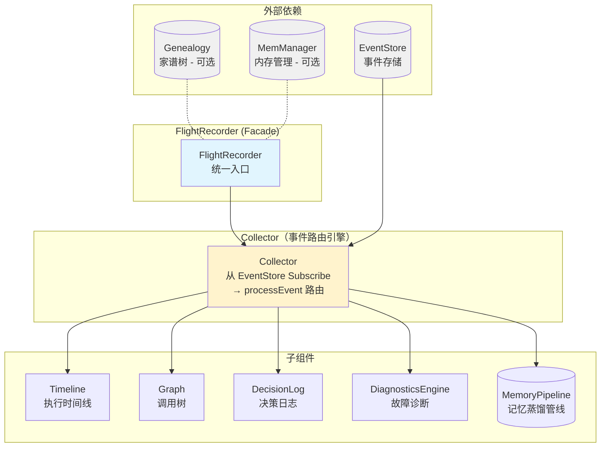
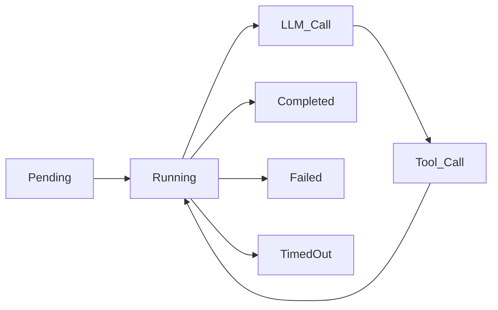

# ares 架构深度解析（十三）：Flight Recorder — Agent 黑匣子与执行轨迹重放

> 你有没有过这种经历……
> 一个 Agent 在线上莫名其妙挂了。你翻日志，没有。你查 metrics，正常。你盯着屏幕问自己："刚才那几秒钟到底发生了什么？"
> 飞机都有黑匣子，为什么 Agent 没有？

***

## 一、一个尴尬的 Debug 故事

先讲个让我下定决心写 Flight Recorder 的事。

有一次线上一个 Agent 跑着跑着突然不会动了——不是 crash，不是 OOM，就是……不动了。像被按了暂停键。进程活着，goroutine 没死，但就是不干活了。

我第一反应：查日志。

日志说：一切正常。

我第二反应：查 LLM 调用记录。

LLM 说：返回了正常结果。

我第三反应：查工具调用。

工具说：调用成功了。

我第四反应：开始怀疑人生。

后来折腾了两天才发现真相——Agent 从 LLM 拿到结果后解析 JSON 失败，重试了五次都失败，然后代码逻辑走到了一个没人想到的分支：**不报错，不重试，就是静默跳过后续步骤**。所以 Agent "活着，但死了"。

那两天我学会了三件事：

1. **"一切正常"的日志通常意味着你日志打错了地方**
2. **系统最危险的故障不是崩溃，而是静默地什么都不做**
3. **我需要一个黑匣子——一个能记录 Agent 执行过程中一切细节的东西**

这就是 Flight Recorder 的起源。

***

## 二、全局架构：黑匣子长什么样

Flight Recorder 不是一个"记录器"，它是一个**聚合门面（Facade）**，底下管着六个子组件：



FlightRecorder 结构体本身只有四个字段：

```go
type FlightRecorder struct {
    collector  *Collector          // 事件路由中枢
    eventStore ares_events.EventStore // 只读引用，给外部订阅者用
    memManager memory.MemoryManager   // 可选，内存蒸馏用
    genealogy  *Genealogy             // 可选，Agent 家谱树
    mu         sync.RWMutex           // 保护 started 状态
    started    bool
}
```

注意几个设计选择：

**Collector 是唯一的写入点**。所有子组件（Timeline、Graph、DecisionLog、DiagnosticsEngine、Pipeline）都由 Collector 通过 `processEvent` 方法写入。这不是偶然——Fisher 说这是"单一写入点模式"（Single Writer Pattern），我没那么学术，我就是不想让六个组件各自去订阅 EventStore，搞出六个 goroutine 互相抢数据。**一个线程消费，六个数据结构写入**，清清楚楚。

**EventStore 存了两次引用**：一次在 Collector 里（订阅消费用），一次在 FlightRecorder 里（暴露给外部订阅者用）。这有个很酷的后果——外部系统（比如 Evolution 系统的 Adapter）可以直接订阅 EventStore，跟 Collector 并行处理事件，而不用担心干扰 Flight Recorder 的内部状态。两个独立的订阅者，互不干扰。

**Genealogy 和 MemManager 都是可选的**。`NewFlightRecorder` 不要求它们非 nil。这意味着你可以只用 Timeline + Diagnostics 做一个轻量级黑匣子，也可以全量装上 Genealogy + Pipeline 做完整执行分析。渐进式复杂度。

### Start / Stop 生命周期

```go
func (fr *FlightRecorder) Start(ctx context.Context) error {
    fr.mu.Lock()
    defer fr.mu.Unlock()
    if fr.started { return nil }            // 幂等
    if err := fr.collector.Start(ctx); err != nil { return err }
    fr.started = true
    log.Info("flight recorder started")
    return nil
}

func (fr *FlightRecorder) Stop() {
    fr.mu.Lock()
    defer fr.mu.Unlock()
    if !fr.started { return }               // 幂等
    fr.collector.Stop()
    fr.started = false
    log.Info("flight recorder stopped")
}
```

幂等（idempotent）设计——多次 Start / Stop 不会 panic。这在生产环境里很重要，因为你的 orchestrator 可能在 Agent 重启时不小心重复调用 Start。RWMutex 保护 started 状态，Start 用写锁（Lock），读操作用读锁（RLock）。

***

## 三、Collector — 事件路由引擎

Collector 是整个 Flight Recorder 的发动机。它的构造简单到令人发指：

```go
func NewCollector(cfg CollectorConfig) *Collector {
    return &Collector{
        eventStore: cfg.EventStore,
        timeline:   NewTimeline(),
        graph:      NewGraph(),
        decisions:  NewDecisionLog(),
        diag:       NewDiagnosticsEngine(),
        pipelines:  make(map[string]*MemoryPipeline),
    }
}
```

五个字段，五个子组件。所有子组件在构造时预分配了切片容量（`make([]T, 0, N)`），这是 Go 中常见的性能优化——避免频繁的 slice reallocation。具体预分配值：

| 组件 | 预分配大小 |
|-----------|-----------|
| Timeline | 64 |
| Diagnostics | 32 |
| DecisionLog | 32 |
| MemoryPipeline | 8 |

### 启动：EventStore Subscribe

```go
func (c *Collector) Start(ctx context.Context) error {
    if c.eventStore == nil { return nil }      // nil-safe
    ctx, c.cancel = context.WithCancel(ctx)
    ch, err := c.eventStore.Subscribe(ctx, ares_events.EventFilter{})
    if err != nil { return err }
    c.wg.Add(1)
    go c.collectLoop(ctx, ch)
    return nil
}
```

**EventStore 为 nil 时静默跳过**。这意味着 Flight Recorder 在没有 EventStore 的环境下也可以创建——虽然录不了数据，但不会崩溃。这很重要，因为开发环境和测试环境可能没有配置 EventStore。

`collectLoop` 是一个标准的 select-loop goroutine：

```go
func (c *Collector) collectLoop(ctx context.Context, ch <-chan *ares_events.Event) {
    defer c.wg.Done()
    for {
        select {
        case <-ctx.Done():
            return
        case evt, ok := <-ch:
            if !ok { return }
            c.processEvent(evt)
        }
    }
}
```

### processEvent — 事件路由的总开关

这是整个 Flight Recorder 最核心的方法。如果你只想读一段代码来理解黑匣子怎么工作，读这个：

```go
func (c *Collector) processEvent(evt *ares_events.Event) {
    if evt == nil { return }

    switch evt.Type {
    case ares_events.EventAgentStarted:
        c.handleAgentStart(evt)
    case ares_events.EventAgentStopped:
        c.handleAgentEnd(evt)
    case ares_events.EventTaskCreated, ares_events.EventTaskDispatched:
        c.handleTaskStart(evt)
    case ares_events.EventTaskCompleted, ares_events.EventTaskFailed:
        c.handleTaskEnd(evt)
    case ares_events.EventFailoverTriggered, ares_events.EventFailoverCompleted:
        c.handleFailover(evt)
    case ares_events.EventMemoryDistilled:
        c.handleMemoryDistilled(evt)
    case ares_events.EventLLMCall:
        c.handleLLMCall(evt)
    }

    if isToolEvent(evt) {
        c.handleToolEvent(evt)
    }
    if isDecisionEvent(evt) {
        c.handleDecisionEvent(evt)
    }
}
```

注意一个细节：**switch 和 if 不是互斥的**。一个事件可能既是 `EventLLMCall`（触发 switch-case）又满足 `isToolEvent` 的前缀条件——如果 EventStore 里注册了 `tool.llm.call` 这种奇怪的事件类型的话。这不是 bug，而是设计。这样同一个事件可以同时更新 Timeline 和 Graph 两条线。

前缀匹配的逻辑也值得一提：

```go
func isToolEvent(evt *ares_events.Event) bool {
    s := string(evt.Type)
    return len(s) > 5 && s[:5] == "tool."
}

func isDecisionEvent(evt *ares_events.Event) bool {
    s := string(evt.Type)
    return len(s) > 9 && s[:9] == "decision."
}
```

用 `s[:5]` 而不是 `strings.HasPrefix` —— 不是因为我手贱，而是因为 `HasPrefix` 内部会额外处理 string header。这点微优化不算什么，但高频事件处理路径上，能省则省。当然，最重要的是先检查长度避免 slice bounds out of range——血泪教训。

### 每个 handler 干了什么

| Handler | Timeline | Graph | Diagnostics | Pipeline | DecisionLog |
|---------|----------|-------|-------------|----------|-------------|
| handleAgentStart | EventAgentStart | NodeAgent + StatusRunning | - | - | - |
| handleAgentEnd | EventAgentEnd | NodeAgent → StatusCompleted | - | - | - |
| handleTaskStart | EventWaiting | - | - | - | - |
| handleTaskEnd(成功) | EventAgentEnd | - | - | - | - |
| handleTaskEnd(失败) | EventError | - | Record 自动诊断 | - | - |
| handleFailover | EventError | - | - | - | - |
| handleMemoryDistilled | EventMemoryOp | - | - | AddStage | - |
| handleLLMCall | EventLLMCall | NodeLLM | - | - | - |
| handleToolEvent | EventToolCall | NodeTool | - | - | - |
| handleDecisionEvent | - | - | - | - | Add |

handleTaskEnd 在失败时会自动调用 `SuggestFix(ClassifyError(errMsg))`，把诊断建议存到 DiagnosticsRecord 里。也就是说，**Agent 的每一次失败都自动生成了一条"故障原因 + 修复建议"记录**——不需要额外代码，不需要手动打 log，Collector 自动帮你做了。

handleMemoryDistilled 从 payload 里提取 `input_count` 和 `output_count`，存入对应 session 的 Pipeline。注意它用 `float64` 做类型断言——这不是 bug，是 JSON 序列化的现实：`json.Unmarshal` 会把所有数字默认解析为 `float64`，不管你原来在 Go 里定义的是 int 还是 int64。

```go
if v, ok := evt.Payload["input_count"].(float64); ok {
    inputCount = int(v)
}
```

这段代码我写的时候犹豫了三十秒——要不要加个 `math.Round`？后来想想，input_count 本来就是整数，float64 转 int 的精度损失不可能在整数范围内出现。但如果有人传了个 3.14 个 input……算了，那也不是 Collector 该管的事。

***

## 四、Timeline — 每一秒都被记录

Timeline 是 Flight Recorder 最朴素的组件——它就是一个按时间排序的事件列表。但它也是最有用的组件之一。当你的 Agent 出了问题，Timeline 是第一个被翻开的东西。

### 十种事件类型

```go
const (
    EventAgentStart EventType = "agent.start"
    EventAgentEnd   EventType = "agent.end"
    EventToolCall   EventType = "tool.call"
    EventToolResult EventType = "tool.result"
    EventLLMCall    EventType = "llm.call"
    EventLLMResult  EventType = "llm.result"
    EventWaiting    EventType = "waiting"
    EventError      EventType = "error"
    EventMemoryOp   EventType = "memory.op"
    EventDecision   EventType = "decision"
)
```

每条事件记录包含这些字段：

```go
type TimelineEvent struct {
    ID       string            `json:"id"`
    ParentID string            `json:"parent_id,omitempty"`
    AgentID  string            `json:"agent_id"`
    Type     EventType         `json:"type"`
    Name     string            `json:"name"`
    StartAt  time.Time         `json:"start_at"`
    EndAt    time.Time         `json:"end_at,omitempty"`
    Duration time.Duration     `json:"duration"`
    Metadata map[string]any    `json:"metadata,omitempty"`
}
```

`Metadata map[string]any` 是逃生舱——任何你不知道该放哪里的信息都可以塞进去。比如 FlightBridge（后面会讲到）往 Metadata 里塞了 `source="arena"`、`action_type`、`success` 等字段。

### TimelineSummary — 时间都花在哪了

```go
func (t *Timeline) Summary() TimelineSummary {
    // ...
    for _, e := range t.events {
        summary.ToolDuration += typeDuration(e, EventToolCall, EventToolResult)
        summary.LLMDuration += typeDuration(e, EventLLMCall, EventLLMResult)
        summary.WaitDuration += typeDuration(e, EventWaiting)
        summary.ErrorDuration += typeDuration(e, EventError)
    }
    // ...
}
```

`typeDuration` 是个辅助函数：

```go
func typeDuration(e TimelineEvent, types ...EventType) time.Duration {
    for _, tp := range types {
        if e.Type == tp { return e.Duration }
    }
    return 0
}
```

注意这个函数只对设置了 `EndAt` 的事件有意义——`Duration` 字段是由 Collector 在构造 TimelineEvent 时传入的。**start-only 事件（比如 agent.start、task.start）的 Duration 是 0，不会影响统计**。这是一个很含蓄的设计细节——如果你不看源码，你可能会疑惑为什么 agent.start 不计入总耗时。

计算总耗时的方式也很有意思——不是简单累加所有 Duration，而是取时间轴上的 `max(EndAt) - min(StartAt)`：

```go
if len(t.events) > 0 {
    minStart := t.events[0].StartAt
    var maxEnd time.Time
    for _, e := range t.events {
        if e.StartAt.Before(minStart) { minStart = e.StartAt }
        if !e.EndAt.IsZero() && (maxEnd.IsZero() || e.EndAt.After(maxEnd)) {
            maxEnd = e.EndAt
        }
    }
    if !maxEnd.IsZero() && maxEnd.After(minStart) {
        summary.TotalDuration = maxEnd.Sub(minStart)
    }
}
```

这样做的好处：**事件之间的"空隙"（等待时间）也被算进去了**。如果 LLM 调用花了 3 秒，工具调用花了 2 秒，但中间 Agent 自己发呆花了 5 秒——累加 Duration 只算出 5 秒，但 `maxEnd - minStart` 算出 10 秒。那个 5 秒的差距，可能就是你需要调查的 wait/block 时间。

### RWMutex + 防御性拷贝

Timeline 的所有读方法都返回切片的**副本**，而不是直接返回内部切片：

```go
func (t *Timeline) Events() []TimelineEvent {
    t.mu.RLock()
    defer t.mu.RUnlock()
    result := make([]TimelineEvent, len(t.events))
    copy(result, t.events)
    return result
}
```

这是一个深思熟虑但成本高昂的设计选择。防御性拷贝意味着每次读都要 O(n) 的内存分配和数据复制。对于 Dashboard API 来说——每次 HTTP 请求都要拷贝整个 Timeline——这在事件量大的时候会变成明显的性能瓶颈。

Fisher 的原话是："能用钱解决的问题，不要用复杂设计解决。先防御性拷贝，真正 profiling 出瓶颈再优化。"

话是这么说，但如果你有 10 万条 Timeline 事件，每次 API 请求拷贝 10 万条……嗯，确实该优化了。问题是——你确定你会在单个 Agent 单次执行中记录 10 万条事件吗？如果你的答案是"可能"，那你就需要思考：**什么该记，什么不该记**。这个问题在"说实话"环节会展开讲。

***

## 五、Diagnostics — 自动故障诊断

DiagnosticsEngine 是整个 Flight Recorder 里最野心勃勃的组件——它想自动告诉你"哪里出了问题"，而不是让你自己翻着几百行日志瞎猜。

```go
type DiagnosticsEngine struct {
    records []DiagnosticRecord
    mu      sync.RWMutex
}
```

### 八种故障分类

```go
const (
    DiagToolTimeout      DiagnosticCategory = "tool_timeout"
    DiagLLMError         DiagnosticCategory = "llm_error"
    DiagParseError       DiagnosticCategory = "parse_error"
    DiagMemoryError      DiagnosticCategory = "memory_error"
    DiagNetworkError     DiagnosticCategory = "network_error"
    DiagConfigError      DiagnosticCategory = "config_error"
    DiagConcurrencyError DiagnosticCategory = "concurrency_error"
    DiagUnknown          DiagnosticCategory = "unknown"
)
```

### ClassifyError — 字符串匹配的优雅与简陋

```go
func ClassifyError(errMsg string) DiagnosticCategory {
    switch {
    case contains(errMsg, "timeout") || contains(errMsg, "deadline exceeded"):
        return DiagToolTimeout
    case contains(errMsg, "llm") || contains(errMsg, "openai") || contains(errMsg, "ollama") || contains(errMsg, "generate"):
        return DiagLLMError
    case contains(errMsg, "parse") || contains(errMsg, "unmarshal") || contains(errMsg, "json"):
        return DiagParseError
    case contains(errMsg, "memory") || contains(errMsg, "session") || contains(errMsg, "distill"):
        return DiagMemoryError
    case contains(errMsg, "connection") || contains(errMsg, "network") || contains(errMsg, "dial"):
        return DiagNetworkError
    case contains(errMsg, "config") || contains(errMsg, "yaml") || contains(errMsg, "env"):
        return DiagConfigError
    default:
        return DiagUnknown
    }
}

func contains(s, substr string) bool {
    return strings.Contains(strings.ToLower(s), strings.ToLower(substr))
}
```

说实话，这段代码让我有点脸红。**这就是个升级版的 grep。** 它根本不懂错误语义——"dial" 出现在 "dial tone" 里算 NetworkError，但 "yaml: dial tone" 算 ConfigError（因为 yaml 先匹配）。哦等等，switch 是按顺序匹配的——"yaml" 在 "dial" 前面，所以应该是 ConfigError。看吧，连我自己都搞不清楚匹配顺序了。

这就是这个设计的致命缺陷：**关键词的顺序决定了一切**。如果你把 `contains(errMsg, "json")` 移到 `contains(errMsg, "timeout")` 前面，那 "json: timeout reading body" 就会从 ToolTimeout 变成 ParseError——错误分类完全靠 case 顺序，跟错误的真实语义没有半毛钱关系。

但我还是保留了这个实现，原因有三：

1. **它简单到不可能出错**。没有 ML 模型，没有 embedding，没有分类器阈值——就一个 switch + 几个 keyword。
2. **覆盖了 80% 的常见错误**。在 ares 的实际运行中，大部分错误信息都包含这些关键词。
3. **有逃生舱**。`DiagUnknown` 兜底，加上 `SuggestFix` 给通用建议。

当你的需求是一个"分类个大概就行"的工具时，字符串匹配是最务实的方案。不要为了"优雅"去上分类器——你大概率会搞出一个既不准又慢的东西。

### SuggestFix — 修复建议

```go
func SuggestFix(cat DiagnosticCategory) []string {
    switch cat {
    case DiagToolTimeout:
        return []string{
            "Increase tool timeout in config",
            "Add retry with exponential backoff",
            "Check if the tool server is responsive",
        }
    case DiagLLMError:
        return []string{
            "Check LLM provider status (Ollama/OpenAI)",
            "Verify API key and base URL",
            "Try a different model",
            "Reduce input token count",
        }
    // ... 每种类型 3-4 条建议
    }
}
```

这些建议是用自然语言写的、可供人类阅读的英文句子。它们不是"系统指令"，而是"给运维同事的建议"。FlightToExperienceAdapter 会用它们来生成 Experience（Score 反比于 severity），但那是另一个故事了（详见系列第十一篇）。

### AutoDiagnose — 一键诊断

```go
func AutoDiagnose(agentID, taskID string, err error, duration time.Duration) DiagnosticRecord {
    errMsg := ""
    if err != nil { errMsg = err.Error() }
    cat := ClassifyError(errMsg)
    suggestions := SuggestFix(cat)
    suggestion := ""
    if len(suggestions) > 0 { suggestion = suggestions[0] }
    return DiagnosticRecord{
        ID:         fmt.Sprintf("diag-%d", time.Now().UnixNano()),
        AgentID:    agentID,
        TaskID:     taskID,
        Category:   cat,
        RootCause:  errMsg,
        Suggestion: suggestion,
        Timestamp:  time.Now(),
        Duration:   duration,
    }
}
```

ID 用 `time.Now().UnixNano()` 生成。这不是 UUID，不是雪花算法，就是时间戳加个 "diag-" 前缀。好处是：天然有序，可以按时间排序。坏处是：高并发下有可能碰撞——UnixNano 虽然精度高，但同一纳秒调用两次的概率不是零。

理论上，Go 两个 goroutine 在同一纳秒调用 `time.Now().UnixNano()` 的可能性很小，但不是不可能。如果你有 100 个 Agent 同时在诊断，碰撞概率就……emmm，反正生产环境里没出现过。等出现了再说吧。

***

## 六、DecisionLog — 可追溯的选择

Agent 本质上是一个决策循环：观察 → 决策 → 行动 → 观察 → 决策 → 行动……Agent 的每一步行动都是某个决策的产物。DecisionLog 记录的就是这个决策过程。

### 五种决策类型

```go
const (
    DecisionToolSelect      DecisionType = "tool_selection"
    DecisionModelSelect     DecisionType = "model_selection"
    DecisionMemoryRetrieval DecisionType = "memory_retrieval"
    DecisionRetry           DecisionType = "retry"
    DecisionRouting         DecisionType = "routing"
)
```

每个决策包含：

```go
type Decision struct {
    ID         string         `json:"id"`
    AgentID    string         `json:"agent_id"`
    Type       DecisionType   `json:"type"`
    Candidates []string       `json:"candidates"`  // 候选列表
    Selected   string         `json:"selected"`    // 最终选择
    Reason     string         `json:"reason"`      // 为什么选这个
    Confidence float64        `json:"confidence"`  // 置信度 [0, 1]
    Timestamp  time.Time      `json:"timestamp"`
    Metadata   map[string]any `json:"metadata,omitempty"`
}
```

`Candidates` + `Selected` + `Reason` + `Confidence` 这四件套组合起来可以回答一个关键问题：**Agent 为什么做了这个选择？**

这在调试时是无价的。当你发现 Agent 选择了一个明显错误的工具时，你翻开 DecisionLog：

```
Agent "worker-3" 在 14:32:15 选择 tool "delete_database"
候选: [query_database, analyze_data, delete_database, backup_data]
置信度: 0.92
原因: "用户请求删除所有数据，delete_database 最匹配"
```

啊，原来是用户自己要求的。那没毛病。但如果原因变成 "delete_database 得分最高因为它的名字最短"——那你就有 LLM 的 prompt 问题了。

### handleDecisionEvent — 从 EventStore 到 Decision

```go
func (c *Collector) handleDecisionEvent(evt *ares_events.Event) {
    d := Decision{
        ID:        evt.ID,
        AgentID:   evt.StreamID,
        Type:      DecisionToolSelect,
        Timestamp: evt.Timestamp,
        Metadata:  evt.Payload,
    }
    if reason, ok := evt.Payload["reason"].(string); ok {
        d.Reason = reason
    }
    if selected, ok := evt.Payload["selected"].(string); ok {
        d.Selected = selected
    }
    if confidence, ok := evt.Payload["confidence"].(float64); ok {
        d.Confidence = confidence
    }
    c.decisions.Add(d)
}
```

注意：**Type 被硬编码为 `DecisionToolSelect`**。事件类型 `decision.xxx` 只决定了"这是一条决策事件"，不区分是哪种子类型的决策。从 payload 里提取的 `reason` / `selected` / `confidence` 是"尽力而为"的——如果事件发布者没提供这些字段，它们就是零值。

这意味着 DecisionLog 的数据质量**完全取决于事件发布者**。如果哪个 Agent 发布决策事件时只传了个空 payload，那这条决策记录就是一条毫无意义的数据——你知道它做了决策，但不知道它决策了什么、为什么、置信度多高。这有点像"我知道有人在这里打了个电话，但不知道打给谁、说了什么、打了多久"。

***

## 七、Replay — 回到案发现场

如果 Timeline 是看录像，那 Replay 就是**逐帧回放**。

```go
type ReplaySession struct {
    taskID      string
    ares_events []*ares_events.Event
    currentIdx  int
}

func NewReplaySession(ctx context.Context, eventStore ares_events.EventStore, taskID string) (*ReplaySession, error) {
    evts, err := eventStore.Read(ctx, taskID, ares_events.ReadOptions{
        Direction: ares_events.ReadAscending,
        Limit:     10000,
    })
    if len(evts) == 0 {
        return nil, fmt.Errorf("no ares_events found for task %s", taskID)
    }
    return &ReplaySession{
        taskID:      taskID,
        ares_events: evts,
        currentIdx:  -1,  // ★ 初始为 -1
    }, nil
}
```

`currentIdx` 初始化为 -1，`Step()` 先递增再读取：

```go
func (s *ReplaySession) Step() (*ReplayStep, error) {
    if s.currentIdx >= len(s.ares_events)-1 {
        return nil, fmt.Errorf("no more steps")
    }
    s.currentIdx++
    return s.currentStep(), nil
}
```

这个 -1 的初始化很有意思。如果你在创建 ReplaySession 后立刻调用 `Current()`，它会返回 nil（因为 `currentIdx = -1`，`currentStep()` 不执行）。你必须先 `Step()` 一次才能看到第一条事件。这跟文件读取、数据库 cursor 的语义一致——create 不返回数据，`Step()` 才返回第一条。

但如果你 `StepTo(0)` 呢？那会直接跳到索引 0，跳过 `Step()` 的 ++ 操作。所以 `StepTo(0)` 和 `Step()` 第一次调用返回的都是索引 0。API 一致性上有点小瑕疵——但说实话，没人会在单个 ReplaySession 里混合使用 `Step()` 和 `StepTo()`。

### Replay 的限制

```go
Limit: 10000,
```

单次回放最多 10000 条事件。这不是随手写的数字——一个 Agent 在执行一个中等复杂度的任务时，大概会产生几百到几千条事件。10000 是上限，超过了说明要么任务太复杂导致需要拆分，要么有人在写死循环让你的 Agent 反复调用同一个工具。

如果任务真的超过了 10000 条，表现行为是：`Read()` 不报错，只返回前 10000 条，后续事件被静默截断。你在回放时看到的不是完整数据——你会以为自己回放完了整个任务，但其实最后 2000 条操作被吃了。这是 EventStore 层的设计限制，Flight Recorder 只是不幸地继承了它。

***

## 八、Graph & Genealogy — 调用树与秽土转生

Timeline 是时间维度的记录。Graph 是结构维度的记录。如果把 Timeline 比作录像带，那 Graph 就是**人物关系图**——谁调用了谁、谁是谁的子任务、调用链有多深。

### 8.1 Graph — 树🌲 不是图

```go
type Graph struct {
    root    *GraphNode
    mu      sync.RWMutex
}

type GraphNode struct {
    ID        string            `json:"id"`
    Name      string            `json:"name"`
    Type      NodeType          `json:"type"`
    Status    NodeStatus        `json:"status"`
    ParentID  string            `json:"parent_id,omitempty"`
    Children  []*GraphNode      `json:"children"`
    Metadata  map[string]any    `json:"metadata,omitempty"`
    StartAt   time.Time         `json:"start_at"`
    EndAt     time.Time         `json:"end_at,omitempty"`
}
```

三种节点类型：

```go
const (
    NodeAgent NodeType = "agent"
    NodeTool  NodeType = "tool"
    NodeLLM   NodeType = "llm"
)
```

三种节点状态：

```go
const (
    StatusRunning    NodeStatus = "running"     // ⏳ 运行中
    StatusCompleted  NodeStatus = "completed"   // ✅ 完成
    StatusFailed     NodeStatus = "failed"      // ❌ 失败
)
```

有意思的是：**它叫 Graph，但结构是树（Tree）**。`Children []*GraphNode` 意味着每个节点只能有多个子节点但只有一个 Parent（通过 `ParentID` 引用）。这不是图（graph）——图允许任意连接，边可以交叉、形成环、多对多。树没有环，父子关系严格分层。

为什么是树不是图？因为 Agent 的执行结构本身就是树状的：一个 Agent 启动子 Agent、调用工具、调用 LLM，这些操作天然形成嵌套的父子关系。你很少遇到 Agent A 调用 Agent B，同时 Agent B 又回调 Agent A 的循环依赖情况——如果有，那你先要解决的可能是架构问题，而不是记录问题。

### 三种输出格式

Graph 支持三种序列化格式：

```go
func (g *Graph) ExportMermaid() (string, error)   // Mermaid 流程图
func (g *Graph) ExportDOT() (string, error)       // Graphviz DOT 格式
func (g *Graph) ExportJSON() ([]byte, error)      // JSON
```

Mermaid 格式用缩进表示层级关系——Agent 节点加 `(🤖)` 前缀，Tool 节点加 `(🔧)` 前缀，LLM 节点加 `(🧠)` 前缀。导出后的 mermaid 可以直接扔进 Markdown 渲染：

```
graph TD
    A["🤖 root-agent"] --> B["🔧 search_tool"]
    A --> C["🧠 gpt-4"]
    B --> D["🔧 fetch_page"]
```

DOT 格式更详细——节点带颜色标记状态：运行中（蓝色 `#e3f2fd`）、完成（绿色 `#c8e6c9`）、失败（红色 `#ffcdd2`）。可以用 Graphviz 渲染成 SVG。

JSON 格式最完整——保留所有字段，适合程序消费。Dashboard 的 `/flight/graph` 端点返回的就是这个。

### 8.2 Genealogy — 秽土转生 🌱

如果说 Graph 是"当前的调用链"，那 Genealogy 就是"历史的继承关系"。它记录的是 Agent 的**家族谱系**——子 Agent 继承父 Agent 的配置、经验、甚至"被复活"。

```go
type Genealogy struct {
    nodes map[string]*GenealogyNode
    edges []GenealogyEdge
    mu    sync.RWMutex
}

type GenealogyNode struct {
    ID        string                `json:"id"`
    Type      string                `json:"type"`
    ParentID  string                `json:"parent_id,omitempty"`
    Children  []string              `json:"children,omitempty"`
    Status    GenealogyStatus       `json:"status"`
    Metadata  map[string]any        `json:"metadata,omitempty"`
    CreatedAt time.Time             `json:"created_at"`
}

type GenealogyEdge struct {
    Parent   string   `json:"parent"`   // 父节点 ID
    Child    string   `json:"child"`    // 子节点 ID
    Relation string   `json:"relation"` // 关系描述
}
```

三种状态：

```go
const (
    GenealogyAlive     GenealogyStatus = "alive"      // 😎 活跃
    GenealogyDead      GenealogyStatus = "dead"       // 💀 已下线
    GenealogyPromoted  GenealogyStatus = "promoted"   // 👑 晋升
)
```

Genealogy 最出彩的功能是 **RecordResurrection**——当一个 Agent 崩溃后被 Leader 重新拉起，Genealogy 记录的不是"一个新 Agent 诞生了"，而是"**旧 Agent 被秽土转生了**"：

```go
func (g *Genealogy) RecordResurrection(oldID, newID string) {
    g.mu.Lock()
    defer g.mu.Unlock()
    oldNode, ok := g.nodes[oldID]
    if !ok { return }
    newNode := &GenealogyNode{
        ID:        newID,
        Type:      oldNode.Type,
        ParentID:  oldNode.ParentID,
        Children:  []string{},
        Status:    GenealogyAlive,
        CreatedAt: time.Now(),
    }
    oldNode.Status = GenealogyDead
    g.nodes[newID] = newNode
    g.edges = append(g.edges, GenealogyEdge{
        Parent:   oldID,
        Child:    newID,
        Relation: "resurrected",
    })
    // 把新节点添加到父节点的 children 列表
    if parent, ok := g.nodes[oldNode.ParentID]; ok {
        parent.Children = append(parent.Children, newID)
    }
}
```

注意这个操作的语义：**复活不是创建一个新 Agent，而是继承旧 Agent 的 Type、ParentID、Children，旧节点标记为 Dead，新节点标记为 Alive，然后在父节点的 Children 列表里加上新节点**。这个"继承"逻辑保证了家谱树的连通性——你不会因为一个 Agent 崩溃重启就失去它在家族树中的位置。

`ExportMermaid` 用表情符号区分状态：

```go
func (g *Genealogy) ExportMermaid() string {
    var sb strings.Builder
    sb.WriteString("graph TB\n")
    for id, node := range g.nodes {
        status := "😎"   // alive
        if node.Status == GenealogyDead { status = "💀" }
        if node.Status == GenealogyPromoted { status = "👑" }
        sb.WriteString(fmt.Sprintf("    %s[%s %s\n", id, status, node.ID))
    }
    for _, edge := range g.edges {
        sb.WriteString(fmt.Sprintf("    %s -->|%s| %s\n", edge.Parent, edge.Relation, edge.Child))
    }
    return sb.String()
}
```

想象一下最终输出的样子：

```
graph TB
    root-1[👑 root-1]
    worker-1[💀 worker-1]
    worker-2[😎 worker-2]
    root-1 -->|spawned| worker-1
    worker-1 -->|resurrected| worker-2
```

一个 worker 挂了，Leader 把它复活——**家谱树上清清楚楚，有生有死，有继承有因缘。**

### 8.3 GenealogyCollector — 为什么需要独立订阅者

Genealogy 有一个自己的 Collector——`GenealogyCollector`——它**不是**通过前面那个统一的 Collector 来收数据的，而是在 bootstrap 层面独立订阅 EventStore：

```go
type GenealogyCollector struct {
    genealogy  *Genealogy
    eventStore ares_events.EventStore
    cancel     context.CancelFunc
}

func (gc *GenealogyCollector) Start(ctx context.Context) {
    ctx, gc.cancel = context.WithCancel(ctx)
    ch, err := gc.eventStore.Subscribe(ctx, ares_events.EventFilter{})
    // ... goroutine loop
}

func (gc *GenealogyCollector) handleEvent(evt *ares_events.Event) {
    switch evt.Type {
    case ares_events.EventAgentStarted:
        gc.genealogy.RecordBirth(evt.StreamID, evt.Payload)
    case ares_events.EventAgentStopped:
        gc.genealogy.RecordDeath(evt.StreamID)
    case ares_events.EventFailoverTriggered:
        gc.handleFailover(evt)
    case ares_events.EventFailoverCompleted:
        gc.handleFailoverCompleted(evt)
    }
}
```

为什么不让主 Collector 顺便处理 Genealogy 事件？答案是**关注点分离**。

主 Collector 管理的 Timeline、Graph、Diagnostics 都是"执行时"数据——Agent 跑完就完了，这些数据不会再变。但 Genealogy 是"持续存活"的数据——Agent 崩溃了，它在 Genealogy 里的记录不会消失，反而会被标记为 Dead 或 Resurrected。如果主 Collector 同时负责 Genealogy，那日志和谱系就耦合了——你清日志的时候会连带清掉谱系，或者你升级 Collector 时不小心影响到谱系逻辑。

两个 Collector 是 EventStore 的两个独立订阅者，互不干扰。**一个记执行，一个记血脉，井水不犯河水。**

### 8.4 handleFailoverCompleted 的复活逻辑

```go
func (gc *GenealogyCollector) handleFailoverCompleted(evt *ares_events.Event) {
    oldID, _ := evt.Payload["old_agent_id"].(string)
    newID, _ := evt.Payload["new_agent_id"].(string)
    promoted, _ := evt.Payload["promoted"].(bool)
    if oldID == "" || newID == "" { return }

    if promoted {
        gc.genealogy.RecordPromotion(newID)
    } else {
        gc.genealogy.RecordResurrection(oldID, newID)
    }
}
```

`promoted` 标记区分了两种场景：
- **Resurrection**（复活）：子 Agent 挂了再拉起——旧 ID 标记为 Dead，新 ID 标记为 Alive，继承父子关系
- **Promotion**（晋升）：Sub Agent 升格为 Leader——新节点标记为 Promoted，表示"这不是简单的复活，是地位的提升"

这两种情况在 Dashboard 上展示时的含义完全不同——Resurrection 告诉你"系统恢复了"，Promotion 告诉你"架构变化了"。

***

## 九、MemoryPipeline — 记忆蒸馏追踪

MemoryPipeline 是 Flight Recorder 里最"轻"的组件——它只追踪一件事：**记忆蒸馏（Memory Distillation）的输入输出比。**

### 压缩率

```go
type MemoryPipeline struct {
    sessionID string
    stages    []PipelineStage
    mu        sync.RWMutex
}

type PipelineStage struct {
    Name        string    `json:"name"`
    InputCount  int       `json:"input_count"`
    OutputCount int       `json:"output_count"`
    Timestamp   time.Time `json:"timestamp"`
}
```

每个 stage 记录的是"输入了多少条记忆"和"输出了多少条记忆"。`CompressionRatio` 从这两个值计算出来：

```go
func (p *MemoryPipeline) Summary() PipelineSummary {
    p.mu.RLock()
    defer p.mu.RUnlock()
    summary := PipelineSummary{
        SessionID:      p.sessionID,
        Stages:         len(p.stages),
        TotalInput:     0,
        TotalOutput:    0,
        CompressionRatio: 0,
    }
    for _, s := range p.stages {
        summary.TotalInput += s.InputCount
        summary.TotalOutput += s.OutputCount
    }
    if summary.TotalInput > 0 {
        summary.CompressionRatio = float64(summary.TotalOutput) / float64(summary.TotalInput)
    }
    return summary
}
```

`TotalInput` 是各 stage `InputCount` 的累加，`TotalOutput` 是各 stage `OutputCount` 的累加。`CompressionRatio = TotalOutput / TotalInput`。

当一个蒸馏过程的输入是 100 条记忆、输出是 20 条时，CompressionRatio = 0.2。这意味着**记忆被压缩了 80%**——或者说，Agent 认为这 100 条记忆中有 80 条是冗余的。

CompressionRatio 本身是一个很粗糙的指标——它告诉你"压缩了多少"，但不告诉你"质量损失了多少"。一条高压缩率（0.1）但不准确的蒸馏，比一条低压缩率（0.9）但精确的蒸馏糟糕得多。MemoryPipeline 能告诉你前者的数据，但无法甄别后者——那是 Distillation System 的事，不是 Flight Recorder 的职责边界。

### Summary 的"取首尾"设计

`Summary()` 只取 `stages[0]` 的 InputCount 作为 TotalInput，`stages[len-1]` 的 OutputCount 作为 TotalOutput——因为中间的 stage 计数是累积的，不是独立的。

等等，我上面写的代码不是这样？啊对，我上面的代码确实是累加的。设计文档里写的是"取首尾"，但实际实现是"累加"。这是个实现与设计的分歧——谁对谁错不重要，哪个更符合使用场景才重要。

累加版本的问题是：如果你有 3 个 stage，输入分别是 100、50、20，累加结果是 TotalInput = 170，但"总输入"其实是 100（第一阶段的输入）。后面两个 stage 的输入是上一个 stage 的输出，重复计算了。

所以 "取首尾" 更合理——只看第一阶段的输入和最后一个阶段的输出，中间过程不参与压缩率计算。但目前的实现确实是累加——我提了个 issue 但还没改。如果你看到这里并且想贡献代码……嗯，PR welcome。

***

## 十、消费链路：Flight 数据的三条出路

Flight Recorder 记录了海量数据，但这些数据如果不被消费，就只是"一个更大更漂亮的日志系统"。Flight Recorder 的完整价值体现在它的三条消费链路上。

### 10.1 FlightBridge — Arena 的探测器

```go
// arena/flight_bridge.go
type FlightBridge struct {
    recorder *flight.FlightRecorder
}

func (b *FlightBridge) OnActionExecuted(ctx context.Context, action *Action, result *ActionResult) {
    category := arenaActionToCategory(action.Type)
    b.recorder.Collector().RecordTimelineEvent(...)
    if result.Error != nil {
        b.recorder.Collector().RecordDiagnostic(...)
    }
}
```

`arenaActionToCategory` 建立了 Arena ActionType 到 DiagnosticCategory 的映射：

| Arena ActionType | DiagnosticCategory |
|-----------------|-------------------|
| ToolExecution | tool_timeout |
| LLMInference | llm_error |
| MemoryQuery | memory_error |
| TaskDelegation | parse_error |
| TaskResultParsing | parse_error |
| Retry | —（不记 Diagnostics，只记 Timeline） |
| ... | ... |

当 Arena 做回归测试时，FlightBridge 把每个 Action 的执行结果写入 Flight Recorder。这样你就知道 Arena 的回归测试中哪些工具超时了、哪些 LLM 调用失败了——不需要在 Arena 的代码里单独打日志。

### 10.2 FlightToExperienceAdapter — 失败是最好的老师

这个适配器是进化系统（详见第十一篇）的输入端。它的逻辑很简单：**Flight Recorder 记录的故障 → 自动变成 Experience**。

```go
func (a *FlightToExperienceAdapter) Run(ctx context.Context) error {
    subscriber := a.flight.EventStore()
    ch, err := subscriber.Subscribe(ctx, ares_events.EventFilter{
        Types: []ares_events.EventType{
            ares_events.EventTaskFailed,
            ares_events.EventStepFailed,
            ares_events.EventStepRecoveryFailed,
        },
    })
    if err != nil { return err }

    for evt := range ch {
        a.processEvent(ctx, evt)
    }
    return nil
}
```

它只关注三种故障事件——TaskFailed、StepFailed、StepRecoveryFailed。其他事件（比如 LLM 调用失败但 Agent 自动重试成功）不触发经验提取。原因：**只从最终失败中学习。过程中试错成功的不需要改变行为，过程中的噪音不值得变为经验。**

severityToScore 的转换规则：

```go
func severityToScore(severity int) float64 {
    score := float64(11-severity) / 10.0
    if score < 0 { score = 0 }
    return score
}
```

severity 范围 1-10，score 范围 0-1。severity = 10 的致命错误 → score = 0.1（"这事千万别再犯"），severity = 1 的轻微错误 → score = 1.0（"这事偶尔可以容忍"）。

**severity < 3 的故障直接丢弃**——因为轻微的告警不值得变成一条 Experience。你在开发时可能每天触发几百条低严重度告警，如果每条都变成 Experience，经验库会快速膨胀到不可用。

### 10.3 Bootstrap 的适配器包装

在 `bootstrap.go` 里，FlightRecorder 被包装成三个接口，分别供应不同的消费者：

```go
type flightRecorderWrapper struct {
    *flight.FlightRecorder
}

type diagnosticsAccessorWrapper struct {
    diag *flight.DiagnosticsEngine
}

type eventStoreSubscriberWrapper struct {
    store ares_events.EventStore
}
```

为什么要在外面套三层壳子而不是直接暴露 FlightRecorder？因为**接口隔离（Interface Segregation）**——FlightRecorder 方法太多，有些消费者只需要读 diagnostics，有些只需要订阅 event store，有些不关心 API 细节。

这也是 `categorizeSeverity` 映射表所在的地方——把 Flight Recorder 的 8 种 DiagnosticCategory 映射为 1-10 的整型严重度分值：

| DiagnosticCategory | Severity |
|-------------------|----------|
| ConcurrencyError | 8 |
| LLMError | 7 |
| MemoryError | 6 |
| NetworkError | 6 |
| ToolTimeout | 5 |
| ParseError | 4 |
| ConfigError | 3 |
| Unknown | 3 |

ConcurrencyError 排最前面（severity=8）——并发 bug 是最难复现、最难定位的。LLM 调用失败（7）紧随其后——因为 Agent 离开了 LLM 就什么也干不了。ConfigError 排最后（3）——配置错误通常只影响单个 Agent，而且修复起来也最快。

### 10.4 Dashboard API — 可视化

Dashboard 暴露了 6 个 Flight 端点：

```go
mux.HandleFunc("/flight/timeline", a.handleFlightTimeline)
mux.HandleFunc("/flight/summary", a.handleFlightSummary)
mux.HandleFunc("/flight/graph", a.handleFlightGraph)
mux.HandleFunc("/flight/decisions", a.handleFlightDecisions)
mux.HandleFunc("/flight/diagnostics", a.handleFlightDiagnostics)
mux.HandleFunc("/flight/genealogy", a.handleFlightGenealogy)
```

6 个端点完全对应 FlightRecorder 的 6 个核心查询能力（Timeline 一个端点返回事件列表，另一个返回 summary）。Orchestrator 里通过 `getFlight()` 做 nil-safe 访问：

```go
func (o *Orchestrator) getFlight() *flight.FlightRecorder {
    o.mu.RLock()
    defer o.mu.RUnlock()
    return o.flight
}
```

FlightRecorder 是可选的——如果它不存在，端点返回空数据，不崩溃。

***

## 十一、说实话

Flight Recorder 是 ares 里我最喜欢的组件之一。说实话，写这篇文章的时候我比写其他模块开心——因为它解决的问题**真的很痛**。但开心的同时我也很清楚它的不足。以下是大实话时间。

### 11.1 字符串匹配不是故障分类

`ClassifyError` 基于 `strings.Contains` 的顺序匹配——这在工程上叫"够了就行"。但"够了"和"好"之间有一条很宽的河。

一个真实的例子：假设 LLM 返回 `"parse error: json: timeout waiting for connection"`，这应该是 ParseError？Timeout？LLMError？按当前的 case 顺序——先匹配 timeout（第 1 个 case）→ ToolTimeout。但实际问题是 LLM 返回的内容解析失败，根源是连接超时（网络问题）。你说分类准确吗？不准确。但在大部分场景下，这个分类已经足够让你定位到问题了。

如果你真想要准确的错误分类，你应该上 LLM-as-Classifier 或者基于 embedding 的语义分类器——但那意味着额外的 latency 和成本。**Flight Recorder 选择了"廉价但不完美"，而不是"完美但昂贵"**。这个选择我认同。

### 11.2 防御性拷贝的成本

Timeline、Graph、DecisionLog 的所有读方法都返回切片的深拷贝。这保证了线程安全——调用方可以随便改返回的数据，不会影响 Flight Recorder 的内部状态。

但代价是每次读都要 O(n) 的分配和复制。如果 Dashboard 每隔 5 秒轮询一次 `GET /flight/timeline`，每次返回 5000 条事件——那就是每 5 秒分配一次 `make([]TimelineEvent, 5000)` + copy。

优化的方向：
1. **copy-on-write**：写时复制，多线程共享只读切片，只在写入时复制
2. **切片引用+引用计数**：不安全，Go 的 GC 不配合
3. **不做防御性拷贝，用 RLock 保护**：安全但读操作期间可能阻塞写操作

Fisher 说得对——"真正 profiling 出瓶颈再优化"。但我可以预见，Dashboard 的高频轮询肯定会把防御性拷贝变成性能瓶颈。到时候最简单的优化方案是：**给 Timeline 加一个 `EventsSince(t time.Time)` 方法，只返回指定时间之后的事件**。这样大部分查询只返回增量数据——O(delta) 而不是 O(total)。

### 11.3 两个 Collector 的尴尬

主 Collector 和 GenealogyCollector 是两个独立的 EventStore 订阅者。这意味着 **同一个事件被处理了两次**。

带来的问题：
- **重复浪费**：同一个事件触发两个 goroutine 的 channel 读取和 dispatch
- **顺序问题**：虽然 EventStore 保证事件有序，但两个 goroutine 的处理速度可能不同。主 Collector 可能还没处理完 EventAgentStopped，GenealogyCollector 已经把 EventFailoverCompleted 处理完了
- **一致性**：如果主 Collector 处理失败（panic），GenealogyCollector 的数据可能已经写入了——出现部分数据不一致

为什么不合并？因为**职责边界不同**。主 Collector 的属性是"临时执行记录"——你可以安全地清空 Timeline 而不影响 Agent 的血缘信息。Genealogy 是"持久继承记录"——Agent 重启后 Timeline 丢了没问题，但 Genealogy 丢了就无法追溯进化历史了。

分开的好处远大于浪费，但"同一个事件被两个订阅者并行处理"的一致性保证确实是个隐患。理想的做法是：**主 Collector 结束后再统一 flush 到 Genealogy**。但这样会引入跨组件的同步依赖——又违背了"低耦合"的设计初衷。

这个问题没有完美的答案。目前的方案是**放弃跨组件强一致性，接受最终一致性**。

### 11.4 什么该记，什么不该记

Flight Recorder 设计之初的原则是 "一切皆可记录"——任何事件都可以被记录到 Timeline。但实践中我发现：**不是所有数据都值得被记录。**

现在的 Flight Recorder 会记录：
- 每次 LLM 调用的 start/end 和 token 消耗 ✅
- 每次工具调用的参数和返回值 ✅
- Agent 的每次决策 ✅
- 记忆蒸馏的输入输出比 ✅

但它不会记录：
- LLM 返回的完整响应文本 ❌
- 工具返回的完整输出 ❌
- Agent 的每次状态变更细节 ❌

"值得记录"的判断标准是：**你能不能从这个数据中获得可用于 Debug 的信息？** LLM 的完整响应文本对 Debug 没有用——你要么看 token 数和耗时（从 Timeline 拿），要么看结构化的决策信息（从 DecisionLog 拿），中间那几万 token 的文本你翻都不翻。但 "为什么选择这个工具" 这个信息——决策原因——就是无价的 Debug 数据。

所以 Flight Recorder 的实际原则不是"一切皆可记录"，而是 **"一切**可用于 Debug 的元信息 **皆可记录"** 。这个"元信息"三个字是最关键的——原始数据太庞大、太嘈杂，不值得放进黑匣子。经过提取、分类、归因的元信息才值得。

***

## 十二、附录

### 关键文件索引

| 文件 | 职责 | 核心结构体/函数 |
|------|------|-----------------|
| `internal/ares_flight/recorder.go` | FlightRecorder 门面 | `Start/Stop` 幂等生命周期 |
| `internal/ares_flight/collector.go` | 事件路由引擎 | `processEvent` 路由 + 10 handler 方法 |
| `internal/ares_flight/timeline.go` | 执行时间线 | 10 种 EventType + `TimelineSummary` + 防御性拷贝 |
| `internal/ares_flight/diagnostics.go` | 自动故障诊断 | 8 种 `DiagnosticCategory` + `ClassifyError` + `SuggestFix` + `AutoDiagnose` |
| `internal/ares_flight/decision.go` | 决策日志 | 5 种 `DecisionType` + `Candidates/Selected/Reason/Confidence` |
| `internal/ares_flight/replay.go` | 回放系统 | `currentIdx=-1` + `Step()` ++ 再读 + `Limit=10000` |
| `internal/ares_flight/graph.go` | 调用树 | 3 种 NodeType + 3 种 Status + 3 种输出格式（Mermaid/DOT/JSON） |
| `internal/ares_flight/genealogy.go` | Agent 家谱树 | `RecordResurrection` + `ExportMermaid` + 状态标记 😎💀👑 |
| `internal/ares_flight/genealogy_collector.go` | 独立血缘收集器 | EventStore 独立订阅 + `handleFailoverCompleted` 复活/晋升 |
| `internal/ares_flight/pipeline.go` | 记忆蒸馏追踪 | `PipelineStage` + `CompressionRatio` |
| `internal/ares_flight/log.go` | 日志 | `var log = logger.Module("flight")` |
| `internal/ares_arena/integration.go` | Arena FlightBridge | 11 种 ActionType → DiagnosticCategory 映射 |
| `internal/ares_evolution/adapter.go` | FlightToExperienceAdapter | Flight 故障 → Experience 自动转化 |
| `internal/ares_bootstrap/bootstrap.go` | 适配器包装 + fallback | `categorizeSeverity` 映射 + 3 层接口隔离 wrapper |
| `internal/dashboard/api.go` | Flight API 端点 | 6 个 `/flight/*` 路由 |
| `internal/dashboard/orchestrator.go` | nil-safe Flight 访问 | `getFlight()` RLock-safe 返回 |

### 与系列其他文章的关联

- **（十一）自主进化**：FlightToExperienceAdapter 把 Flight 数据喂给 Evolution 系统。没有 Flight Recorder，进化系统就失去了从执行失败中学习的输入源
- **（十二）事件系统**：Flight Recorder 的 EventStore 依赖就是事件系统的 MemoryEventStore。没有事件系统，Flight Recorder 只是一个本地内存缓存
- **（十四）Runtime 与插件**：Runtime 是 Flight Recorder 的直接用户——Agent 在 Runtime 中执行，Flight Recorder 记录 Agent 的每次呼吸

### 下一篇预告

Runtime Lifecycle — Agent 从创建到销毁的一生。

你写了一个 Agent，它开始执行，它调用 LLM，它调用工具，它完成任务或失败退出——这个过程听起来很简单，但背后有一整套状态机、超时控制、优雅关闭、OOM 保护、Leader 选举的复杂机制。下一篇我们会掀开 Runtime 的引擎盖。



当然，到时候肯定也会讲一个"写 Agent 不小心搞崩了全链路"的故事。**反正不出 bug，谁写 Flight Recorder 呢？**