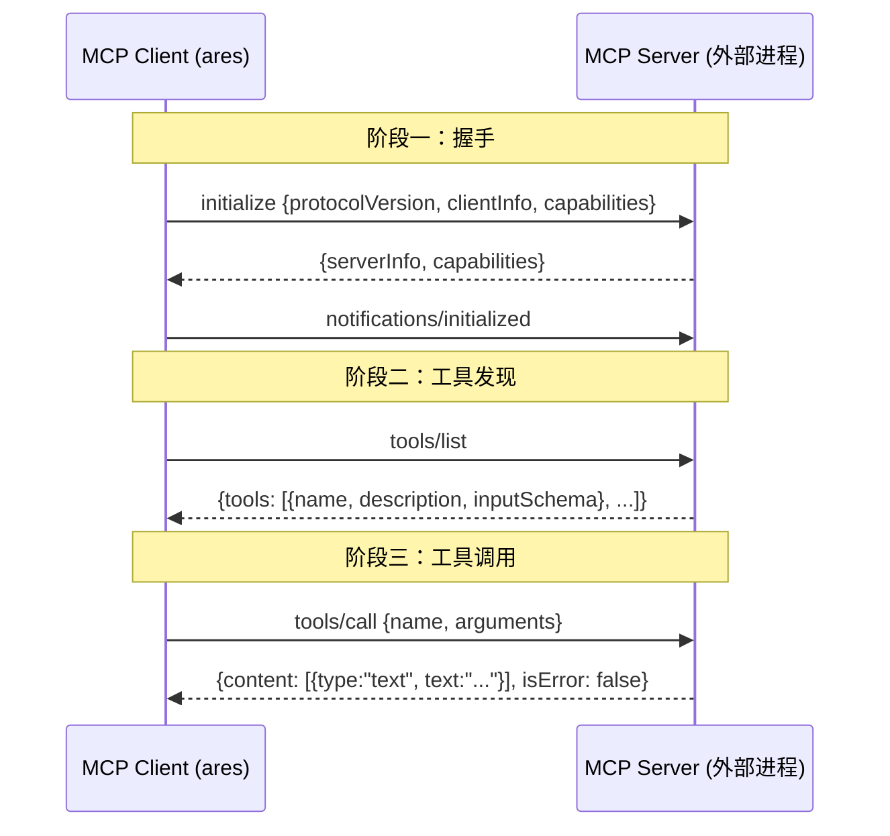
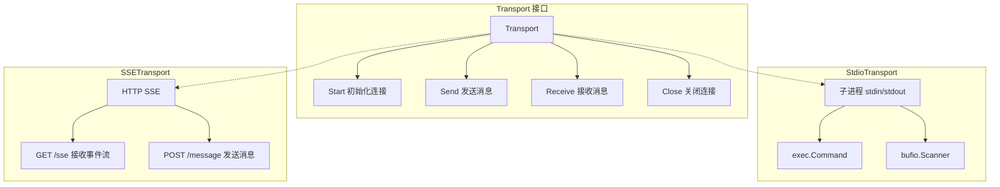
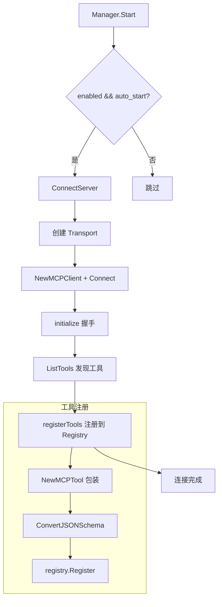

# ares 架构拆解 (XV)：MCP 集成——教 Agent 用工具

> 最早给 Agent 加工具的时候，我是这么干的：写一个 Go struct，实现 `core.Tool` 接口，注册到 `Registry`，完事。
> 每加一个工具，改一次代码，编译一次，部署一次。22 个内置工具写了我一礼拜。
> 直到有一天，产品经理跑过来说："用户想接他们自己的数据库查询工具，不用你写代码那种。"
> 我愣住了。现有的架构根本没考虑过"工具从外面来"这件事。

## 一、工具注册的困境

回头看，问题的根源在于工具和框架的耦合太紧了。每个工具都是编译时确定的：

```go
// internal/tools/resources/builtin/math/calculator.go
type Calculator struct {
    *base.BaseTool
}

func (t *Calculator) Execute(ctx context.Context, params map[string]interface{}) (core.Result, error) {
    expression, ok := params["expression"].(string)
    if !ok || expression == "" {
        return core.NewErrorResult("invalid_expression"), nil
    }
    // ...
}
```

工具的定义、实现、注册全部在 Go 代码里。想加一个新工具？写代码、编译、部署。想让用户自己定义工具？没门。

我当时想了三条路：

1. **嵌入脚本引擎**（Lua/JS）—— 太重，安全问题一堆
2. **HTTP 回调**—— 用户得自己起服务，协议得自己定，参数校验得自己写
3. **标准化协议**—— 有没有现成的，让外部程序自己暴露工具的协议？

答案是 MCP——Model Context Protocol。

---

## 二、MCP 协议：JSON-RPC 2.0 的一次实战

MCP 是 Anthropic 在 2024 年底发布的开放协议，核心思想很简单：**外部进程自己声明它有什么工具，框架通过标准协议去发现和调用。**

协议本身基于 JSON-RPC 2.0，分三个阶段：



为什么选 JSON-RPC 2.0 而不是 REST？我猜有几个原因：协议本身轻量（一个 `id` + `method` + `params` 就是一个请求），天然支持异步（通过 `id` 关联请求和响应），而且 notification 机制（无 `id` 的消息）很适合"服务器主动推送工具列表变更"这种场景。

在 `internal/ares_mcp/jsonrpc.go` 里，消息模型长这样：

```go
type JSONRPCMessage struct {
    JSONRPC string          `json:"jsonrpc"`
    ID      *int64          `json:"id,omitempty"`   // nil = notification
    Method  string          `json:"method,omitempty"`
    Params  json.RawMessage `json:"params,omitempty"`
    Result  json.RawMessage `json:"result,omitempty"`
    Error   *JSONRPCError   `json:"error,omitempty"`
}
```

`ID` 的有无决定了消息类型：有 `ID` 是请求/响应，没 `ID` 是通知。这个设计让 `receiveLoop` 里的分发逻辑特别干净：

```go
// internal/ares_mcp/client.go
func (c *MCPClient) receiveLoop() error {
    for {
        msg, err := c.transport.Receive(c.ctx)
        // ...
        switch {
        case IsResponse(msg) || IsError(msg):
            c.dispatchResponse(msg)
        case IsNotification(msg):
            c.handleNotification(msg)
        }
    }
}
```

---

## 三、Transport 层：两条路，一个接口

MCP 协议不关心消息怎么传输——它只定义了 JSON-RPC 的格式。具体怎么把消息从 A 点送到 B 点，是 Transport 层的事。

我们实现了两种 Transport：



### 3.1 Stdio：本地进程的标准姿势

Stdio 是最常用的 MCP 传输方式。外部工具以子进程启动，ares 通过 stdin 写入请求、stdout 读取响应。

```go
// internal/ares_mcp/transport_stdio.go
type StdioConfig struct {
    Command string            `yaml:"command" json:"command"`
    Args    []string          `yaml:"args" json:"args"`
    Env     map[string]string `yaml:"env" json:"env"`
    WorkDir string            `yaml:"work_dir" json:"work_dir"`
}
```

配置里写一个命令行，ares 负责 `exec.Command` 启动进程，然后用 newline-delimited JSON 通信。stderr 被单独 drain 走，打到 debug 日志里——这个设计救过我好几次，用户说"工具不工作"，看 stderr 日志就知道是权限问题还是依赖没装。

Stdio 有一个我踩过的坑：`bufio.Scanner` 的默认 buffer 只有 64KB。如果 MCP 服务器返回一个大 schema（比如带了几十个工具的完整定义），scan 直接报 `token too long`。解法是在 `Start` 里手动设 buffer：

```go
t.stdout = bufio.NewScanner(stdoutPipe)
t.stdout.Buffer(make([]byte, 0, stdoutBufferSize), stdoutBufferSize) // 1MB
```

### 3..2 SSE：远程服务器的 HTTP 方案

有些 MCP 服务器不是本地进程——它们跑在远程机器上，或者本身就是 Web 服务。这时候用 SSE（Server-Sent Events）。

```go
// internal/ares_mcp/transport_sse.go
type SSEConfig struct {
    URL     string            `yaml:"url" json:"url"`
    Headers map[string]string `yaml:"headers" json:"headers"`
    Timeout time.Duration     `yaml:"timeout" json:"timeout"`
}
```

SSE Transport 的通信模型和 Stdio 不一样：接收走 HTTP GET 长连接（SSE 流），发送走 HTTP POST。协议里有一个巧妙的设计——服务器可以通过 `event: endpoint` 事件动态告诉客户端"以后 POST 到这个 URL"：

```go
func (t *SSETransport) handleSSEEvent(ctx context.Context, eventType, data string) {
    switch eventType {
    case sseEventTypeEndpoint:
        t.mu.Lock()
        t.postURL = strings.TrimSpace(data)  // 动态更新 POST 目标
        t.mu.Unlock()
    case sseEventTypeMessage:
        var msg JSONRPCMessage
        json.Unmarshal([]byte(data), &msg)
        t.msgCh <- &msg
    }
}
```

这让服务器可以灵活控制消息路由，比如在负载均衡场景下把不同客户端导向不同的后端。

---

## 四、MCPManager：多服务器的生命线

单个 `MCPClient` 只能连一个服务器。实际场景里，用户可能同时连着一个数据库查询工具、一个代码搜索工具、一个文件操作工具——三个不同的 MCP 服务器。`MCPManager` 就是管这堆连接的。

```go
// internal/ares_mcp/manager.go
type MCPManager struct {
    clients  map[string]*managedClient
    registry *core.Registry       // 工具注册表
    mu       sync.RWMutex
    config   *MCPManagerConfig
}

type managedClient struct {
    client  *MCPClient
    config  MCPServerConfig
    connAt  time.Time
    lastErr error
    tools   []string  // 已注册的工具名列表
}
```

核心流程是这样的：



`ConnectServer` 是单个服务器的连接入口。它做了一件很关键的事：连接成功后，自动把服务器上的所有工具注册到 `core.Registry`：

```go
// internal/ares_mcp/manager.go
func (m *MCPManager) ConnectServer(ctx context.Context, name string) error {
    // ... 创建 transport、client、connect ...
    
    // 注册工具
    toolNames, err := m.registerTools(mc)
    if err != nil {
        _ = client.Close()
        return fmt.Errorf("register tools: %w", err)
    }
    mc.tools = toolNames
    
    m.mu.Lock()
    m.clients[name] = mc
    m.mu.Unlock()
    return nil
}
```

`registerTools` 遍历 `MCPClient` 发现的所有工具，为每个工具创建一个 `MCPTool` 包装器，然后调用 `registry.Register`。注册完之后，MCP 工具和内置工具在 Registry 里完全平级——调用方不需要知道这个工具到底是 Go 代码写的还是远程 MCP 服务器提供的。

断开连接时，`unregisterTools` 会把对应工具从 Registry 里清理掉：

```go
func (m *MCPManager) unregisterTools(mc *managedClient) {
    for _, name := range mc.tools {
        if err := m.registry.Unregister(name); err != nil {
            log.Warn("mcp: failed to unregister tool", "tool", name, "error", err)
        }
    }
    mc.tools = nil
}
```

---

## 五、MCPTool：让远程工具"假装"是本地的

`MCPTool` 是整个集成的关键适配器。它实现了 `core.Tool` 接口，但实际执行时把调用转发给 MCP 服务器：

```go
// internal/ares_mcp/mcp_tool.go
type MCPTool struct {
    *base.BaseTool
    client     *MCPClient
    serverName string
    toolDef    *MCPToolDef
}

func NewMCPTool(client *MCPClient, def *MCPToolDef) (*MCPTool, error) {
    schema, err := ConvertJSONSchema(def.InputSchema)  // JSON Schema → core.ParameterSchema
    // ...
    name := fmt.Sprintf("mcp.%s.%s", client.ServerName(), def.Name)
    // ...
}

func (t *MCPTool) Execute(ctx context.Context, params map[string]interface{}) (core.Result, error) {
    result, err := t.client.CallTool(ctx, t.toolDef.Name, params)
    if err != nil {
        return core.NewErrorResult(err.Error()), nil
    }
    if result.IsError {
        text := extractText(result.Content)
        return core.NewErrorResult(text), nil
    }
    text := extractText(result.Content)
    return core.NewResult(true, map[string]interface{}{
        "content": text,
        "blocks":  result.Content,
    }), nil
}
```

注意工具的命名规则：`mcp.{serverName}.{toolName}`。这个命名策略是刻意的——当用户配了多个 MCP 服务器时，不同服务器可能有同名工具（比如都叫 `search`），加前缀避免冲突。

### 5.1 Schema 转换：JSON Schema 到 ParameterSchema

MCP 工具的输入定义用的是标准 JSON Schema，但 ares 内部有自己的 `core.ParameterSchema`。`ConvertJSONSchema` 负责这个转换：

```go
// internal/ares_mcp/schema.go
func ConvertJSONSchema(raw json.RawMessage) (*core.ParameterSchema, error) {
    var schema jsonSchema
    json.Unmarshal(raw, &schema)
    
    result := &core.ParameterSchema{
        Type:       schema.Type,
        Properties: make(map[string]*core.Parameter),
        Required:   schema.Required,
    }
    for name, prop := range schema.Properties {
        result.Properties[name] = convertProperty(prop)
    }
    return result, nil
}
```

这个转换看起来简单，但它决定了 LLM 能不能正确理解工具的参数。如果 `inputSchema` 里写了 `"type": "integer", "minimum": 1, "maximum": 100`，转成 `ParameterSchema` 后 LLM 就知道这个参数是 1-100 的整数。**Schema 质量直接影响 LLM 的工具调用准确率。**

---

## 六、错误处理：超时、断连、和"服务器突然不说话了"

这是我在写这篇文章时最想吐槽自己的部分。

### 6.1 超时机制

每个 `MCPClient` 调用都有超时控制：

```go
// internal/ares_mcp/client.go
func (c *MCPClient) call(ctx context.Context, method string, params interface{}, result interface{}) error {
    // ... 发送请求 ...
    
    callCtx, callCancel := context.WithTimeout(ctx, c.timeout)
    defer callCancel()
    
    select {
    case <-callCtx.Done():
        return fmt.Errorf("timeout waiting for response to %s: %w", method, callCtx.Err())
    case resp, ok := <-ch:
        // ... 处理响应 ...
    }
}
```

默认超时 30 秒。用户可以在配置里按服务器自定义。

### 6.2 坦诚反思：重试和熔断在哪里？

说实话，**目前的实现里没有重试，也没有熔断器。**

如果一个 MCP 服务器挂了，`ConnectServer` 会返回 error，`Start` 会 log 一下然后继续连下一个服务器。但如果服务器在运行中突然断开——比如进程被 kill——当前的处理是 `receiveLoop` 返回 error，`MCPClient` 标记为 disconnected，但不会自动重连。

这意味着什么？如果用户配了 3 个 MCP 服务器，其中一个在运行中挂了，那个服务器上的工具会静默失败。不会 panic，不会崩溃，但也不会自动恢复。

我知道这是个问题。当时做第一版的时候，我的优先级是"先把协议跑通"，重连和熔断留到了后面。现在回头看，至少应该加这几个东西：

1. **自动重连**：`receiveLoop` 退出后，`MCPManager` 应该检测到断连并尝试重连
2. **指数退避**：重连不要死循环，用 exponential backoff
3. **熔断器**：连续失败 N 次后标记服务器为 unhealthy，停止尝试，定期探活
4. **工具级降级**：当服务器不可用时，`MCPTool.Execute` 应该返回明确的错误而不是超时

这些是下一个迭代要补的。写这篇文章的时候我特意把这些缺口列出来，因为**承认问题比假装没问题更重要**。

### 6.3 连接状态追踪

虽然没有自动重连，但至少有状态追踪。`MCPManager.ListServers()` 返回每个服务器的状态：

```go
// internal/ares_mcp/manager.go
type MCPServerStatus struct {
    Name      string    `json:"name"`
    Connected bool      `json:"connected"`
    ToolCount int       `json:"tool_count"`
    Version   string    `json:"version"`
    Error     string    `json:"error,omitempty"`
    ConnAt    time.Time `json:"connected_at,omitempty"`
}
```

Dashboard 用这个来展示 MCP 服务器的健康状态。至少用户能**看到**哪个服务器挂了，即使不能自动恢复。

---

## 七、Dashboard 集成：让用户看见

Dashboard 是用户和 MCP 子系统交互的唯一窗口。在 `internal/dashboard/api.go` 里，`/mcp` 路径暴露了服务器状态：

```go
// internal/dashboard/api.go
// /mcp — configure, inspect MCP servers
```

Dashboard 通过 `MCPStatusProvider` 接口获取 MCP 状态：

```go
// internal/dashboard/service.go
type MCPStatusProvider interface {
    ListServers() []MCPServerStatusView
}

type MCPServerStatusView struct {
    Name      string        `json:"name"`
    Connected bool          `json:"connected"`
    ToolCount int           `json:"tool_count"`
    Version   string        `json:"version"`
    Error     string        `json:"error,omitempty"`
    ConnAt    time.Time     `json:"connected_at,omitempty"`
    Tools     []MCPToolView `json:"tools"`
}
```

`MCPManager` 实现了这个接口。Dashboard 前端可以展示：哪些 MCP 服务器在线、每台服务器暴露了多少工具、连接时间、最后一次错误。

这里有一个设计决策值得注意：Dashboard 用的是 `MCPServerStatusView`（一个纯数据结构），而不是直接依赖 `MCPManager`。这是经典的**接口隔离**——Dashboard 不需要知道 MCP 的内部实现，只需要一个能返回状态的接口。

Arena（混沌工程模块）也参与了 MCP 的测试。在 `internal/dashboard/api.go` 里有一个 `ArenaActionMCPDisconnect`——可以在运行时模拟 MCP 服务器断连，测试系统的韧性。这个在 `api/core/arena.go` 里定义为 `FaultMCPDisconnect`。

---

## 八、配置驱动：YAML 里的工具声明

整个 MCP 集成是配置驱动的。用户在 YAML 里声明要连接哪些 MCP 服务器：

```yaml
# config.yaml
mcp:
  servers:
    - name: "code-search"
      transport:
        stdio:
          command: "mcp-code-search"
          args: ["--repo", "/path/to/repo"]
      timeout: 30s
      enabled: true
      auto_start: true
    - name: "database"
      transport:
        sse:
          url: "http://localhost:8080/sse"
          headers:
            Authorization: "Bearer xxx"
      timeout: 60s
      enabled: true
      auto_start: true
```

`MCPServerConfig` 里的 `Enabled` 和 `AutoStart` 两个字段提供了灵活性：`Enabled` 控制这个服务器是否在配置里生效，`AutoStart` 控制是否在 `Manager.Start()` 时自动连接。用户可以在运行时通过 `ConnectServer` / `DisconnectServer` 动态管理连接。

```go
// internal/ares_mcp/manager.go
func (m *MCPManager) Start(ctx context.Context) error {
    for _, sc := range m.config.Servers {
        if !sc.Enabled || !sc.AutoStart {
            continue
        }
        if err := m.ConnectServer(ctx, sc.Name); err != nil {
            log.Error("mcp: failed to connect to server", "server", sc.Name, "error", err)
            // 不 return！继续连下一个
        }
    }
    return nil
}
```

注意 `Start` 里连接失败不会中断整个启动流程。这是一个有意的设计：一个 MCP 服务器挂了不应该影响其他服务器和 Agent 的正常运行。

---

## 九、工厂模式：MCPToolFactory

除了通过 `MCPManager` 批量管理，MCP 工具还可以通过工厂模式动态创建：

```go
// internal/ares_mcp/factory.go
type MCPToolFactory struct {
    manager *MCPManager
}

func (f *MCPToolFactory) Name() string { return "mcp" }

func (f *MCPToolFactory) Create(config map[string]interface{}) (core.Tool, error) {
    // 从 config map 构建 MCPServerConfig
    // 创建临时 client，连接，发现工具
    // 返回第一个工具
}
```

`MCPToolFactory` 实现了 `core.ToolFactory` 接口，这让 MCP 工具可以像内置工具一样通过工厂创建。用户传一个 `config` map 进来，工厂负责连服务器、发现工具、创建 `MCPTool`。

---

## 十、Server 端：ares 自己也能当 MCP 服务器

到目前为止我们一直在说"ares 作为 MCP 客户端"。但 `internal/ares_mcp/server.go` 里还有另一面——ares 自己也能作为 MCP 服务器，把自己的能力暴露给其他 MCP 客户端。

```go
// internal/ares_mcp/server.go
type MCPServer struct {
    info         Implementation
    capabilities ServerCapabilities
    tools        map[string]*registeredTool
    resources    map[string]*registeredResource
    prompts      map[string]*registeredPrompt
    // ...
}
```

`MCPServer` 支持注册三种能力：Tools（工具调用）、Resources（资源读取）、Prompts（提示词模板）。它同样使用 `ServerTransport` 接口（`StdioServerTransport` 或 SSE），支持被其他 MCP 客户端连接。

这意味着 ares 既可以是 MCP 生态的消费者（调用别人的工具），也可以是生产者（暴露自己的能力）。双向打通。

---

## 坦诚反思：这条路走了多远，还差多远

写到这里，我想诚实地说说 MCP 集成目前的状态。

**做对了的事：**

1. **Transport 抽象干净**：`Transport` 接口只有 4 个方法，Stdio 和 SSE 两种实现互不影响。加新的传输方式（比如 WebSocket）只需要实现这个接口
2. **工具透明化**：MCP 工具在 Registry 里和内置工具平级，调用方完全不需要关心工具的来源
3. **Schema 自动转换**：JSON Schema 到 ParameterSchema 的转换让 LLM 自动获得工具的参数信息，不需要人工翻译
4. **配置驱动**：YAML 配置让用户不用写代码就能接入 MCP 工具

**还没做好的事：**

1. **没有自动重连**：运行中服务器断开后，工具静默失败
2. **没有重试机制**：一次调用失败就是失败，不会自动重试
3. **没有熔断器**：对不健康的服务器没有自动降级
4. **Factory 的 Create 返回第一个工具**：如果服务器有 10 个工具，只返回一个，这明显不合理
5. **SSE 的 POST URL 没有相对路径处理**：如果服务器返回相对路径，客户端会挂

这些都是真实的技术债，不是我编出来凑字数的。

---

## 尾声：协议的价值

回头看整个 MCP 集成，我最大的感悟是：**协议的价值不在于它有多复杂，而在于它在多大程度上解耦了生产者和消费者。**

在没有 MCP 之前，工具注册是编译时确定的——写代码、编译、部署。有了 MCP 之后，工具注册变成了运行时发现——启动子进程、握手、自动发现。

这个转变让 ares 从"一个有 22 个内置工具的 Agent 框架"变成了"一个可以接入任意工具的 Agent 平台"。用户不需要等我们写代码，他们自己写一个 MCP 服务器（几十行 Python/TypeScript 就能搞定），ares 就能自动发现并使用。

协议是基础设施。MCP 之于 Agent 工具，就像 HTTP 之于 Web 服务——它不解决具体问题，它让解决问题的方式变得标准化。

核心文件一览：

| 文件 | 职责 |
|------|------|
| `internal/ares_mcp/client.go` | MCP 客户端：连接、握手、工具发现、工具调用 |
| `internal/ares_mcp/manager.go` | 多服务器管理：连接生命周期、工具注册/注销 |
| `internal/ares_mcp/transport.go` | Transport 接口定义 |
| `internal/ares_mcp/transport_stdio.go` | Stdio 传输：子进程 stdin/stdout 通信 |
| `internal/ares_mcp/transport_sse.go` | SSE 传输：HTTP Server-Sent Events |
| `internal/ares_mcp/mcp_tool.go` | MCPTool 适配器：MCP 工具 → core.Tool |
| `internal/ares_mcp/schema.go` | JSON Schema → ParameterSchema 转换 |
| `internal/ares_mcp/jsonrpc.go` | JSON-RPC 2.0 消息模型和编解码 |
| `internal/ares_mcp/types.go` | MCP 协议类型定义 |
| `internal/ares_mcp/factory.go` | MCPToolFactory：工厂模式创建 MCP 工具 |
| `internal/ares_mcp/server.go` | MCP 服务端：ares 作为 MCP 服务器 |
| `internal/tools/resources/core/registry.go` | 工具注册表：MCP 工具的最终归宿 |
| `internal/dashboard/service.go` | Dashboard MCP 状态接口 |
| `internal/dashboard/api.go` | Dashboard /mcp API 端点 |
