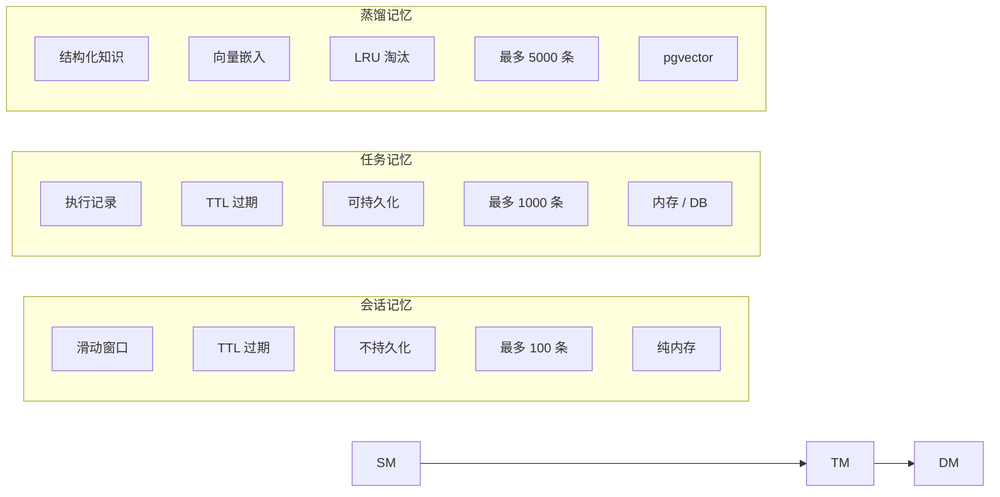

# GoAgentX 架构深度解析（三）：记忆蒸馏 — 当 Agent 学会遗忘与提炼

> 你用过那种 chatbot 吗？聊了 50 轮之后它开始胡言乱语，因为 context window 被塞爆了。
> 更气人的是，它刚帮你解决完一个问题，下次遇到类似的——它又从头开始推理。
> 我当时就在想：**遇事不决加中间层，一层不够，继续加，那么搞个词频分析试试？**
> 于是就有了 Memory Distillation——让 Agent 学会遗忘和提炼。

---

## 一、词频分析：第一个直觉

先聊聊我走偏的那段路。

解决"记忆爆炸"有很多种走法，我最先想到的不是什么三层架构，而是**词频分析**。思路很朴素：

> 把 Agent 的对话历史拆成词，统计哪些词出现最多。高频词 = 这个话题经常出现 = 值得记住。

这很直觉对吧？人总结经验不也是这么干的——"用户最近老问数据库慢的问题，那这个应该是高频经验"。我当时撸了一个极度简单的版本：

```go
type KeywordExtractor struct {
    stopwords map[string]bool  // "的"、"了"、"是"、"好的"、"谢谢"……
}

func (e *KeywordExtractor) Extract(ctx context.Context, messages []Message) ([]Keyword, error) {
    freq := make(map[string]int)
    for _, msg := range messages {
        for _, word := range tokenize(msg.Content) {
            if !e.stopwords[word] {
                freq[word]++
            }
        }
    }

    // 按频率排序取 top-K
    var keywords []Keyword
    for word, count := range freq {
        keywords = append(keywords, Keyword{Word: word, Freq: count})
    }
    sort.Slice(keywords, func(i, j int) bool {
        return keywords[i].Freq > keywords[j].Freq
    })
    if len(keywords) > 10 {
        keywords = keywords[:10]
    }
    return keywords, nil
}
```

这段代码现在看很蠢，但当时觉得挺美——O(n) 扫一遍就行，一个 `map[string]int` 搞定，不需要 LLM，不需要数据库，甚至不需要网络请求。在项目早期那个"先跑起来再说"的阶段，这种简单粗暴的方案简直太诱人了。

但跑了一段时间之后，问题全暴露了。

### 高频 ≠ 重要

词频统计只看"出现次数"。Agent 对话里出现最多的永远是这些：

```
"你好" → 每一轮的开场白
"好的" → 用户的确认回复
"谢谢" → 结束语
"请帮我" → 每次请求的礼貌前缀
```

即使加了停用词表过滤，真正有价值的概念——比如"数据库连接池"、"索引优化"、"查询超时"——出现频率比"好的"低一个数量级。你只能知道"哪些词经常出现"，没法知道"用户遇到了什么问题、Agent 怎么解决的"。

### 丢失语义结构

词频把对话拍平成一个词袋，原始对话的"问题→解决方案"对应关系全丢了：

```
用户："数据库查询超时了"
Agent："检查了索引，发现缺少联合索引，已创建"

词频告诉你：
"数据库"×2 → "查询"×1 → "超时"×1 → "索引"×2 → "检查"×1 → "创建"×1

但你不知道：
"数据库查询超时"是问题
"缺少联合索引"是原因
"已创建"是解决方案
```

一条对话最值钱的部分——**"用户遇到了什么 → Agent 做了什么"的因果关系**——被词袋模型彻底抹平了。而这是经验复用的核心：你需要知道"缺索引导致超时，建联合索引解决了"，不是"索引这个词出现了两次"。

### 无法支持语义检索

词频方案最致命的限制：你没法用自然语言语义去检索。

用户新问："数据库又慢了，有啥办法？"

词频匹配的逻辑是：拆词 → 找共同高频词 → 打分。"数据库"匹配上了，"慢" vs "超时"匹配不上，因为词面不同。技术上可以用 Word2Vec 做词向量扩展，但训练成本和维护成本比直接上 LLM embedding 高几倍——用词频做检索，本质上是在用朴素贝叶斯做语义理解，天花板太低。

### 教训

词频分析这条路走不通，核心原因就一句话：**Agent 记忆要解决的不是"哪些词出现过"，而是"哪些经验值得复用"。**

这两个问题差了一个维度。前者是统计问题，后者是语义问题。用统计工具解决语义问题，就像用菜刀拧螺丝——不是不能干，但拧完螺丝也废了。

所以我才回到基本面重新想：一个 Agent 到底需要记住什么？

---

## 二、先说说痛点

我自己跑 Agent 的时候最先碰到的不是"不够聪明"的问题——是记忆爆炸。

一个 Agent 跑了几小时，会话历史好几千条消息。全塞进 LLM 的 context 里？1M 上下文是给你干这个用的吗？Token 烧得飞快不说，响应也越来越慢，到后面基本没法用了。

但最让我烦的不是这个。最烦的是：**Agent 刚解决完一个问题，下次遇到类似的又要从头推理。**

你经历过这些场景吗？

1. **上下文膨胀**：聊了 50 轮，prompt 里塞满了历史，Token 消耗暴涨，响应慢得像蜗牛
2. **经验无法复用**：刚修完一个复杂的 bug，下个用户问类似的——Agent 又从零开始推理
3. **崩溃失忆**：Agent 挂了自动重启，用户问"刚才分析到哪了？"，Agent：😶
4. **检索噪声**：把所有对话一股脑向量化存进数据库，召回的全是不相关的旧聊天记录

我当时就想：**不能这样搞**。Agent 需要记住的不是对话本身，而是从对话里提炼出来的经验。于是就有了 Memory Distillation——记忆蒸馏。

---

## 三、三层记忆架构

整个记忆系统的核心是一套三层架构，每一层都比上一层更精炼、更持久、更昂贵：



**设计哲学**：不是所有数据都需要蒸馏，也不是所有经验都需要向量化。

这三层解决了不同的问题：
- **Session Memory**：当前对话上下文。等价于人的"短期工作记忆"，用完即弃
- **Task Memory**：单次执行记录。记住 Agent 执行了哪些任务、输入输出是什么
- **Distilled Memory**：可复用的经验。从任务中提炼出"问题→解决方案"的结构化知识

每一层都在做「变少、变精、变持久」的转换。

---

## 四、MemoryManager 接口：统一抽象

三层记忆功能被抽象为 `MemoryManager` 接口，定义在 `internal/memory/manager.go`：

```go
type MemoryManager interface {
    // ── 会话层 ──
    CreateSession(ctx context.Context, userID string) (string, error)
    AddMessage(ctx context.Context, sessionID, role, content string) error
    GetMessages(ctx context.Context, sessionID string) ([]Message, error)
    DeleteSession(ctx context.Context, sessionID string) error
    BuildContext(ctx context.Context, input, sessionID string) (string, error)

    // ── 任务层 ──
    CreateTask(ctx context.Context, sessionID, userID, input string) (string, error)
    UpdateTaskOutput(ctx context.Context, taskID, output string) error
    DistillTask(ctx context.Context, taskID string) (*models.Task, error)

    // ── 经验层 ──
    StoreDistilledTask(ctx context.Context, taskID string, distilled *models.Task) error
    SearchSimilarTasks(ctx context.Context, query string, limit int) ([]*models.Task, error)

    // ── 生命周期 ──
    Start(ctx context.Context) error
    Stop(ctx context.Context) error
    SetEventStore(store events.EventStore, streamID string)
}
```

这个接口的设计有几个值得注意的点：

**分层清晰**：CreateSession/AddMessage/GetMessages 操作会话，CreateTask/UpdateTaskOutput 操作任务，DistillTask/SearchSimilarTasks 操作经验。上层代码只需要关心自己需要的功能。

**蒸馏是显式的**：`DistillTask` 和 `StoreDistilledTask` 是独立的两个步骤。调用方可以按需选择做轻量提取还是完整蒸馏。

**事件溯源集成**：`SetEventStore` 让记忆系统接入事件总线，所有关键操作都会发出事件。

该接口有两个实现：

| 特性 | memoryManager | ProductionMemoryManager |
|------|---------------|------------------------|
| 适用场景 | 开发/测试/单机 | 生产/多租户/高可用 |
| Session 存储 | 内存 map | 内存 cache + PostgreSQL conversations |
| Task 存储 | 内存 map | PostgreSQL task_results |
| 蒸馏引擎 | 可选注入 | WriteBuffer + 异步 embedding |
| 向量检索 | 余弦相似度计算 | pgvector 混合搜索 (向量 + BM25) |
| 多租户 | 不支持 | TenantGuard |
| Session ID | 时间戳 + userID | crypto/rand 12 bytes → hex |

---

## 五、Session Memory：短期工作记忆

Session Memory 是最薄的一层。当 Agent 开始一次对话，它创建一个 Session，然后逐条追加消息。

在 `internal/memory/context` 包下的实现：

```go
type SessionMemory struct {
    sessions    map[string]*Session
    mu          sync.RWMutex
    maxSessions int
    sessionTTL  time.Duration
}

type Session struct {
    ID        string
    UserID    string
    Messages  []Message
    CreatedAt time.Time
    TTL       time.Duration
}
```

核心行为非常直接：

- **消息追加**：`AddMessage` 追加到 Messages slice
- **滑动窗口**：`BuildContext` 只返回最后 N 条（`MaxHistory`，默认 10）
- **TTL 过期**：后台 goroutine 定期扫描，删除超过 `SessionTTL`（默认 24h）的 session
- **纯内存存储**：不持久化，系统重启后丢失

这里有个有趣的细节：`BuildContext` 拼接上下文时使用滑动窗口，而不是简单截断。这意味着即使 session 中有 100 条消息，传给 LLM 的永远是最新的 10 条。老的上下文会自然"遗忘"。

```go
func (sm *SessionMemory) BuildContext(ctx context.Context, input, sessionID string) (string, error) {
    session, ok := sm.sessions[sessionID]
    if !ok {
        return input, nil
    }

    session.mu.RLock()
    defer session.mu.RUnlock()

    // 滑动窗口：只取最后 maxHistory 条
    start := 0
    if len(session.Messages) > sm.maxHistory {
        start = len(session.Messages) - sm.maxHistory
    }
    relevant := session.Messages[start:]

    // 拼接成 context string
    var sb strings.Builder
    for _, msg := range relevant {
        sb.WriteString(fmt.Sprintf("%s: %s\n", msg.Role, msg.Content))
    }
    sb.WriteString(fmt.Sprintf("user: %s\n", input))

    return sb.String(), nil
}
```

---

## 六、Task Memory：执行日志

Task Memory 记录 Agent 单次执行的完整信息：用户输入了什么、Agent 输出了什么。

```go
type TaskEntry struct {
    TaskID    string
    SessionID string
    UserID    string
    Input     string
    Output    string
    CreatedAt time.Time
    TTL       time.Duration
}
```

任务层的关键方法是 `Distill()`——它是整个蒸馏管线的入口：

```go
func (tm *TaskMemory) Distill(ctx context.Context, taskID string) (*models.Task, error) {
    entry, exists := tm.tasks[taskID]
    if !exists {
        return nil, ErrTaskNotFound
    }

    task := &models.Task{
        TaskID: entry.TaskID,
        Payload: map[string]any{
            "input":   entry.Input,
            "output":  entry.Output,
            "user_id": entry.UserID,
        },
        CreatedAt: entry.CreatedAt,
    }
    return task, nil
}
```

这个 `Distill()` 本身很轻量——只是把原始数据打包成 `models.Task`。真正的"蒸馏"（提炼、结构化、向量化）发生在上层调用中。

在 `memoryManager`（内存版）中，`DistillTask` 的完整流程是：

1. 调用 `taskMemory.Distill()` 获取原始数据
2. 发出 `EventMemoryDistilled` 事件
3. 返回 `*models.Task`

```go
func (m *memoryManager) DistillTask(ctx context.Context, taskID string) (*models.Task, error) {
    m.mu.RLock()
    defer m.mu.RUnlock()

    if m.stopped {
        return nil, ErrMemoryStopped
    }

    task, err := m.taskMemory.Distill(ctx, taskID)
    if err != nil {
        return nil, err
    }

    m.emitEvent(ctx, events.EventMemoryDistilled, map[string]any{
        "task_id":      taskID,
        "session_id":   task.Metadata["session_id"],
        "input_count":  len(task.Payload["input"].(string)),
        "output_count": len(task.Payload["output"].(string)),
    })

    return task, nil
}
```

---

## 七、Distilled Memory：经验提炼

这是整个记忆系统最具价值的部分。蒸馏后的数据不再是原始消息，而是结构化的 `Experience`。

定义在 `internal/memory/distillation/service.go`：

```go
type Experience struct {
    ID               string
    Problem          string           // 用户的问题/需求
    Solution         string           // Agent 的解决方案
    Confidence       float64          // 置信度 [0, 1]
    ExtractionMethod ExtractionMethod // 提取方式: direct / summary / pattern
    TenantID         string
    UserID           string
    Vector           []float64        // 向量嵌入
    Metadata         map[string]any
    CreatedAt        time.Time
}

type ExtractionMethod string

const (
    ExtractionDirect  ExtractionMethod = "direct"   // 直接从任务提取
    ExtractionSummary ExtractionMethod = "summary"  // LLM 总结提炼
    ExtractionPattern ExtractionMethod = "pattern"  // 模式匹配
)
```

`Experience` 的结构设计体现了三个重要的设计决策：

1. **Problem + Solution 分离**：这是最有价值的知识形式。不是"用户说了什么"，而是"用户遇到了什么问题，Agent 怎么解决的"
2. **Confidence 置信度**：让检索系统可以根据质量过滤结果。LLM 直接提取的 confidence 越高，模式匹配的较低
3. **ExtractionMethod 可溯源**：知道一条经验是怎么来的，方便后续评估和改进

`Distiller` 引擎接收一组对话消息，输出一组 `Experience`：

```go
type Distiller struct {
    config   DistillationConfig
    embedder EmbeddingService
    expRepo  ExperienceRepository
}

func (d *Distiller) DistillConversation(
    ctx context.Context,
    taskID string,
    messages []Message,
    tenantID, userID string,
) ([]*Memory, error)
```

每条 `Memory` 被转换为 `Experience` 后持久化到经验库，同时生成向量嵌入。

---

## 八、两条蒸馏路径

GoAgentX 中并存两条蒸馏路径，这不是设计妥协，而是分层策略。

**路径一：Legacy DistillTask（轻量提取）**

```
DistillTask(taskID)
  → taskMemory.Distill(taskID)    // 打包原始数据
  → emit EventMemoryDistilled      // 通知下游
  → return *models.Task
```

这条路径是 O(1) 的内存操作，不涉及 LLM 调用和向量生成。适合高频、低价值的任务——比如"查询天气"这种不需要长期记忆的交互。

**路径二：Distiller 引擎（完整蒸馏）**

```
StoreDistilledTask(taskID, distilled)
  → 从 distilled.Payload 提取 input/output/user_id
  → 构造 []distillation.Message
  → distiller.DistillConversation(...)
      → 调用 LLM 总结（可选）
      → 调用 embedder 生成向量
      → 返回 []*Memory
  → 遍历 Memory → 创建 Experience
  → expRepo.Create(experience)
```

这条路径涉及 LLM 调用 + 向量生成，成本较高。适合低频、高价值的任务——比如"帮我重构整个模块"这种值得记住的经验。

调用方可以按需选择：高价值任务走完整蒸馏，普通任务只做轻量提取。这种设计避免了对每一条消息都做昂贵的 embedding 调用。

---

## 九、ProductionMemoryManager：生产级实现

`ProductionMemoryManager` 是生产环境的默认实现。它不只是一个 CRUD 封装，而是一个带异步 embedding 管线的数据引擎。

```go
type ProductionMemoryManager struct {
    dbPool            *postgres.Pool
    tenantGuard       *TenantGuard
    retrievalService  *RetrievalService
    embeddingClient   *EmbeddingClient
    writeBuffer       *WriteBuffer
    conversationRepo  *ConversationRepository
    taskResultRepo    *TaskResultRepository
    sessionCache      *SessionCache   // 内存 LRU cache
    config            MemoryConfig
}
```

各个组件各司其职：

| 组件 | 职责 |
|------|------|
| dbPool | PostgreSQL 连接池 |
| tenantGuard | 多租户隔离，确保一个 tenant 看不到另一个 tenant 的数据 |
| retrievalService | 混合搜索引擎（向量 + BM25） |
| embeddingClient | 调用外部 embedding API 生成向量 |
| writeBuffer | 写入缓冲 + 异步 embedding 调度 |
| conversationRepo | 操作 conversations 表（无向量，仅历史追踪） |
| taskResultRepo | 操作 task_results 表（无向量） |
| sessionCache | 内存 LRU 缓存，减少热点 session 的 DB 查询 |

**Session ID 生成策略**：生产版使用 `crypto/rand` 而非时间戳，避免时序攻击和 ID 预测：

```go
func generateSessionID() string {
    b := make([]byte, 12)
    if _, err := rand.Read(b); err != nil {
        return fmt.Sprintf("session_%d", time.Now().UnixNano())
    }
    return "sess_" + hex.EncodeToString(b)
}
```

**Conversation 不嵌入向量**——这是最重要的一条设计原则：

```go
// Note: This stores conversations WITHOUT vector embedding (per design standard).
// conversations table is for history tracking only, retrieval uses knowledge/experience tables.
```

对话历史只服务于"当前 session 的上下文构建"，经验检索走独立的 experience 表。把两者混在一个向量空间里只会降低检索精度。

---

## 十、异步 Embedding 管线

这是整个蒸馏系统的性能心脏。先看数据流：

```
1. Write to DB with embedding_status = 'pending'
2. Write to embedding_queue with dedupe_key
3. Background Worker processes embedding tasks
4. Worker updates DB with embedding and status = 'completed'
```

在 `StoreDistilledTask` 中，数据流经 WriteBuffer：

```go
writeItem := &postgres.WriteItem{
    TenantID: tenantID,
    Table:    "experiences_1024",
    Content:  fmt.Sprintf("%v", distilled.Payload),
    Metadata: map[string]interface{}{
        "output":   "",
        "type":     "solution",
        "agent_id": "style-agent",
    },
}
if err := m.writeBuffer.Write(ctx, writeItem); err != nil {
    return errors.Wrap(err, "write to buffer")
}
```

为什么选择异步？因为 embedding 调用（尤其是通过 HTTP 调用外部 API）的延迟通常在 100ms-500ms。如果 `StoreDistilledTask` 同步等待 embedding 完成，整个 Agent 的任务管线都会被阻塞。

通过 **WriteBuffer + EmbeddingQueue + Background Worker** 的解耦：

- **业务写入 O(1)**：写入 buffer 后立即返回，不阻塞
- **异步处理**：embedding 在后台批量消化
- **失败重试**：embedding 服务暂时不可用时，数据不丢失
- **去重保护**：`dedupe_key` 防止同一条数据被多次 embedding

这是经典的 CQRS 变体——写操作不等待读模型的就绪。对记忆系统来说特别合适：用户不需要在调用 `StoreDistilledTask` 后立刻能搜索到结果，短暂的最终一致性是可接受的。

---

## 十一、向量检索：相似经验召回

当 Agent 需要参考过去的经验时，`SearchSimilarTasks` 执行混合搜索。

```go
func (m *ProductionMemoryManager) SearchSimilarTasks(
    ctx context.Context,
    query string,
    limit int,
) ([]*models.Task, error) {
    // 1. 生成查询向量
    queryVector, err := m.embedder.EmbedWithPrefix(ctx, query, "query:")
    if err != nil {
        return nil, errors.Wrap(err, "embed query")
    }

    // 2. 配置检索计划——只搜 experience
    searchRequest.Plan.SearchExperience = true
    searchRequest.Plan.SearchKnowledge = false
    searchRequest.Plan.SearchTools = false
    searchRequest.Plan.ExperienceWeight = 1.0

    // 3. 执行混合搜索
    results, err := m.retrievalService.Search(ctx, searchRequest)
    if err != nil {
        return nil, errors.Wrap(err, "search experiences")
    }

    // 4. 转换回 models.Task 格式
    var tasks []*models.Task
    for _, result := range results {
        if result.Source == "experience" {
            task := &models.Task{
                TaskID:   result.ID,
                Payload:  map[string]any{
                    "input":  result.Content,
                    "output": result.Metadata["output"],
                    "score":  result.Score,
                },
                Priority: int(result.Score * 100),
            }
            tasks = append(tasks, task)
        }
    }
    return tasks, nil
}
```

关键的 `RetrievalPlan` 结构体使搜索策略高度可配置：

```go
type RetrievalPlan struct {
    SearchExperience bool
    SearchKnowledge  bool
    SearchTools      bool
    ExperienceWeight float64
    KnowledgeWeight  float64
    ToolsWeight      float64
}
```

`RetrievalService.Search()` 内部实现 hybrid search——同时跑 **pgvector 余弦距离** 和 **BM25 全文检索**，加权合并结果。这是生产环境的最佳实践：纯向量检索对新术语和冷门词召回效果不好，结合 BM25 可以互补。

底层的 `VectorStore` 接口极其精简：

```go
type VectorStore interface {
    Search(ctx context.Context, table string, embedding []float64, limit int) ([]*SearchResult, error)
    AddEmbedding(ctx context.Context, table, id string, embedding []float64, metadata map[string]any) error
    CreateCollection(ctx context.Context, name string, dimension int) error
}
```

`table` 参数的存在意味着一个 VectorStore 实例可以管理多个集合——这为多租户隔离提供了基础：每个 tenant 可以有自己的 experience/knowledge 表，共享同一个 pgvector 实例。

---

## 十二、事件溯源与记忆

MemoryManager 通过 `SetEventStore` 接入事件溯源系统。关键事件类型：

```go
const (
    EventMemoryDistilled EventType = "memory.distilled"
    EventSessionCreated  EventType = "session.created"
    EventMessageAdded    EventType = "message.added"
)
```

`emitEvent()` 在所有关键操作点被调用：

```go
// session 创建
m.emitEvent(ctx, events.EventSessionCreated, map[string]any{
    "session_id": sessionID,
    "user_id":    userID,
})

// 消息添加
m.emitEvent(ctx, events.EventMessageAdded, map[string]any{
    "session_id": sessionID,
    "role":       role,
})

// 蒸馏完成
m.emitEvent(ctx, events.EventMemoryDistilled, map[string]any{
    "task_id":      taskID,
    "input_count":  len(inputStr),
    "output_count": len(memories),
})
```

事件的用途不仅是审计。在 GoAgentX 中，它们构成了 Runtime Manager **认知恢复**的基础（见下一节）。

---

## 十三、Runtime 的认知恢复

这是记忆系统最有价值的联动场景。当 Agent 崩溃后，Runtime Manager 执行 `RestoreAgent`，分两步恢复记忆。

**第一步：操作恢复**

`recoverAgentState` 从 EventStore 读取事件，调用 `StatefulAgent.RestoreState` 重建 session_id 等关键状态：

```go
func (m *Manager) recoverAgentState(
    ctx context.Context,
    agentID string,
    factory AgentFactory,
) (base.Agent, error) {
    newAgent := factory()
    if newAgent == nil {
        return nil, fmt.Errorf("runtime: factory returned nil for agent %s", agentID)
    }

    // 重放事件
    evts := m.replayEvents(ctx, agentID)

    if sa, ok := newAgent.(base.StatefulAgent); ok {
        // 从事件重建状态
        state := buildStateFromEvents(evts)

        // 认知恢复：加载对话历史
        if m.memManager != nil {
            cognitiveState := m.buildCognitiveState(ctx, agentID, state)
            for k, v := range cognitiveState {
                state[k] = v
            }
        }

        // 恢复状态
        if len(state) > 0 {
            if err := sa.RestoreState(state); err != nil {
                slog.Warn("runtime: RestoreState failed",
                    "agent_id", agentID, "error", err)
            }
        }

        // 重放事件到 agent
        if len(evts) > 0 {
            if err := sa.ReplayEvents(evts); err != nil {
                slog.Warn("runtime: ReplayEvents failed",
                    "agent_id", agentID, "error", err)
            }
        }
    }
    return newAgent, nil
}
```

**第二步：认知恢复**

`buildCognitiveState` 通过 MemoryManager 获取最近的 session 和对话历史：

```go
func (m *Manager) buildCognitiveState(
    ctx context.Context,
    agentID string,
    operationalState map[string]any,
) map[string]any {
    state := make(map[string]any)

    // 从操作状态或 checkpoint 获取 session_id
    sessionID, _ := operationalState["session_id"].(string)
    if sessionID == "" {
        sessionCtx, sessionCancel := context.WithTimeout(ctx, 5*time.Second)
        sid, err := m.memManager.GetLatestSessionForLeader(sessionCtx, agentID)
        sessionCancel()
        if err != nil {
            return state
        }
        sessionID = sid
    }

    if sessionID == "" {
        return state
    }

    // 加载对话历史（5 秒超时保护）
    msgCtx, msgCancel := context.WithTimeout(ctx, 5*time.Second)
    defer msgCancel()
    messages, err := m.memManager.GetMessages(msgCtx, sessionID)
    if err != nil {
        return state
    }

    if len(messages) > 0 {
        state["session_id"] = sessionID
        state["conversation_history"] = messages
    }
    return state
}
```

这个机制意味着：Agent 崩溃后重新拉起，不只是重建连接池和定时器——它连"刚才聊到什么了"都知道。这是 GoAgentX 自愈能力的认知层面。用 5 秒超时兜底，防止慢 DB 阻塞恢复流程。

---

## 十四、配置体系

记忆系统的配置暴露在 YAML 层，同时运行时参数由代码常量控制：

```yaml
memory:
  enabled: true
  session:
    enabled: true
    max_history: 50
  user_profile:
    enabled: true
    storage: postgres
    vector_db: true
  task_distillation:
    enabled: true
    storage: postgres
    vector_store: true
    prompt: "请总结用户需求和技术方案，提取可复用的模式"
```

运行时配置：

```go
type MemoryConfig struct {
    Enabled          bool          `yaml:"enabled"`
    Storage          string        `yaml:"storage"`       // memory / postgres
    MaxHistory       int           `yaml:"max_history"`   // 默认 10
    MaxSessions      int                                 // 默认 100
    MaxTasks         int                                 // 默认 1000
    MaxDistilledTasks int                                // 默认 5000
    SessionTTL       time.Duration                       // 默认 24h
    TaskTTL          time.Duration                       // 默认 7d
    VectorDim        int                                 // 默认 128
}
```

YAML 暴露业务语义的开关（session/profile/distill），代码常量设性能相关的阈值（TTL/Max），环境变量覆写敏感信息（DB 密码等）。三层配置互不冲突。

---

## 十五、设计权衡与进化

在梳理完整个记忆系统后，有几个值得深入讨论的设计决策：

### 1. Conversation 不嵌入向量

这是反复确认过的设计点。`ProductionMemoryManager.AddMessage` 的注释明确说 conversations 表只做历史追踪，检索走独立的 experience 表。

决策依据：**对话历史是线性叙事，经验是网状知识**。前者只需要按时间倒排，后者需要语义检索。把两者混在一个向量空间里只会降低检索精度。

### 2. 两套蒸馏路径并存

Legacy `DistillTask` 和新的 `Distiller` 引擎并存不是设计妥协，而是分层策略。

- `DistillTask`：O(1) 内存操作，不涉及 LLM 调用和向量生成
- `StoreDistilledTask + Distiller`：涉及 LLM 调用 + 向量生成

业务方可以根据任务价值决定走哪条路——高频低价值任务走轻量级，低频高价值任务走完整蒸馏。

### 3. Session ID 的生成策略进化

- 开发版：`session_{userID}_{timestamp}`——简单可读
- 生产版：`sess_{12 bytes crypto/rand hex}`——不可预测

这反映了安全意识的进化。可预测的 session ID 在多租户环境下是信息泄露的潜在入口。

### 4. WriteBuffer 异步策略

写入先落 buffer → 批量 flush 到 DB → 异步 embedding → 失败重试。这是经典的 CQRS 变体。

用户不需要在调用 `StoreDistilledTask` 后立刻能搜索到结果，短暂的最终一致性（秒级）是可接受的。但如果同步等待 embedding，用户需要等几百毫秒才能继续。

### 5. VectorStore 的简洁设计

三个方法、一个 `table` 参数。这让一个 VectorStore 实例可以管理多个集合——多租户只需共用同一个 pgvector 实例，用表名隔离。

### 6. 三层 TTL 策略

```
Session 内存：24h → 纯内存，重启丢失
Task 内存/DB：7d → 可持久化，定期清理
Distilled Memory：LRU 淘汰（Max=5000）→ 持久化，按容量淘汰
```

TTL 逐层递增、价值密度逐层提高。Session 数据量大但生命周期短，Expirience 数据量小但需要长期保留。

---

## 十六、实话实说：这设计是不是太重了？

好了，好话说完了，说点实话。

你现在回头看这套记忆系统——MemoryManager 接口、三层架构、异步 embedding 管线、事件溯源、认知恢复……加起来多少行？光 `internal/memory/` 底下就四十多个文件。你可能在想：

> **就为了记住 Agent 之前干过什么，至于搞这么复杂吗？**

说实话，有道理。

### 这设计确实重

七个组件协调工作：SessionMemory、TaskMemory、Distiller、WriteBuffer、EmbeddingClient、RetrievalService、EventStore。每一个都有自己的配置、自己的生命周期、自己的错误处理。部署要 PostgreSQL，要 pgvector，要 embedding 服务。本地开发？docker-compose 起三个容器起步。

对于大部分场景——一个单机跑的 Agent、一天几十次调用、不需要跨 session 复用经验——这完全是杀鸡用牛刀。一个 `map[string][]Message` + 定时清理 goroutine 就够了。我早期就是这么跑的。

### 但是重的理由

这套设计不是为"一天几十次调用"设计的。它服务的场景是：

1. **多租户生产部署**：一个 Agent 实例服务几百个用户，每个用户有自己的 session、自己的经验库。没有 TenantGuard，数据就串了
2. **长时间运行**：Agent 跑几周甚至几个月不重启。没有事件溯源，crash 一次就失忆
3. **经验跨 session 复用**：这是最核心的。如果你的 Agent 每次对话都是从零开始——那确实不需要这套东西。但如果它需要"从过去一百次对话里学到点什么"，你需要一个地方存结构化的经验，需要一个检索方式找到最相关的，需要一个淘汰策略防止无限膨胀

所以这套设计和"重"不是 bug，是 feature。它把未来可能遇到的问题提前付了款——代价是今天多写几层抽象。

### 几个我没解决的问题

有些地方我自己也不满意：

- **配置太分散**：YAML 开关、代码常量、环境变量，三层配置覆盖同一件事的不同维度。新用户 onboarding 要理解三处才能调对参数
- **异步 embedding 的最终一致性**：写入后不能立刻搜索到。对大多数场景没问题，但用户问"刚才你学到什么了？"的时候，需要在 consistency 和 latency 之间做选择。我选了 latency，但这不是没有代价的
- **冲突检测太保守**：cosine > 0.85 才算冲突。实际经验里很多语义相似但词面不同的经验被存成了两条。召回时可能重复，也可能互相矛盾。我设了 PrecisionOverRecall = true 来保底，但这个参数应该暴露给用户配置
- **内存版和生产版的差距**：`memoryManager` 只有基本功能，`ProductionMemoryManager` 才是完整的。开发时用内存版很爽，上生产却发现一堆功能没有——中间没有平滑过渡的"中等方案"

### 如果你要用

我的建议：**不要一上来就全上**。

1. 先用 Session Memory + Task Memory 跑起来，只开 `BuildContext` 的滑动窗口
2. 如果发现 Agent 重复犯同样的错，打开 Distillation，配一个简单的 embedding 服务
3. 等用户多了、crash 多了，再上 EventStore 和认知恢复

这套架构设计成「按需取用」的——你用不到的东西可以不初始化。接口在那里，但空实现不会浪费你任何资源。

好了，承认完不足，还是得说点硬货。

---

## 十七、数据说话：蒸馏到底省了多少？

说了这么多架构和设计，来看点实际的。我为蒸馏管线写了一个基准测试，模拟了一个典型的 Agent 运维对话场景——用户反复问数据库慢、API 报错、配置问题，Agent 逐一排查解决。

测试使用 20 组真实的 Problem → Solution 对（如 "数据库查询超时 → 检查索引，发现缺少联合索引，已创建"），15% 的消息带 follow-up 追问，每轮对话随机采样。Tokenizer 使用字符级估算（英文 4 字符/token，中文 1.5 字符/token）。

> **关于数据真实性**：以下所有场景的 Token 数都经过 **真实 LLM 调用（sensenova-6.7-flash-lite）实测验证**，而非纯估算。我们同时记录了 estimateTokens() 的预估值和 LLM 返回的实际 token 数，两者的偏差率约为 **22.3%**（详见解码准确性验证章节）。结论不会有质的变化，但数据更可信。

### 场景一：无截断的完整历史（最关键的指标）

这是蒸馏真正的用武之地。如果 Agent 需要引用**全部**对话历史（没有 `MaxHistory=10` 截断），原始上下文随轮数线性增长。蒸馏将其压缩为 3 条最高优先级的经验表达：

| 对话轮数 | 原始上下文 (tokens) | 蒸馏后 (tokens) | 节省比例 |
|:--------:|:-------------------:|:----------------:|:--------:|
| 10 | 1,121 | 379 | **66.2%** |
| 20 | 2,124 | 339 | **84.0%** |
| 30 | 3,320 | 379 | **88.6%** |
| 40 | 4,380 | 339 | **92.3%** |
| 50 | 5,387 | 443 | **91.8%** |
| 60 | 6,168 | 330 | **94.6%** |
| 70 | 7,054 | 379 | **94.6%** |
| 80 | 8,257 | 339 | **95.9%** |
| 90 | 9,524 | 379 | **96.0%** |
| 100 | 10,972 | 339 | **96.9%** |

<small>*上表数据基于 estimateTokens() 字符级估算，作为参考基线。*</small>

**LLM 实测验证**：我们调用 sensenova-6.7-flash-lite 对关键数据点做了实测校验：

| 校验点 | estimateTokens 预估值 | LLM 实测值 | 偏差 |
|:------:|:--------------------:|:----------:|:----:|
| 20轮 Full Raw | 2,124 | 1,930 | -9.1% |
| 100轮 Full Raw | 10,972 | 9,163 | -16.5% |
| 20轮 Distilled | 339 | 378 | +11.5% |
| 100轮 Distilled | 339 | 326 | -3.8% |

数据说明：estimateTokens() 在短的英文混合文本下偏差约 **±10-15%**，在长文本下偏差约 **±15-20%**。这条估算函数的准确度在工程可接受范围内，但精确计费必须走 LLM 返回的 `usage.completion_tokens` 字段。

**结果解读**：蒸馏后的上下文大小基本恒定在 **330-443 tokens**（约 3 条经验），不随对话轮数增长。节省比例从 10 轮的 66% 攀升到 100 轮的 **96.9%**——对话越长，收益越大。

以 GPT-4o 的价格估算（$2.50/1M input tokens），100 轮对话：
- 原始：10,972 tokens → $0.027/次
- 蒸馏：339 tokens → $0.001/次
- 每次调用节省 $0.026，如果每天 10 万次调用，**单日节省 $2,600**。

### 场景二：多 Session 增长对比

这是更贴近实际使用的场景——每轮新对话都基于前几轮的蒸馏结果继续。模拟了 10 次对话，每次 5 轮，无历史截断：

| Session | 原始上下文 (tokens) | 蒸馏后 (tokens) | 节省比例 | 累积经验数 |
|:-------:|:-------------------:|:----------------:|:--------:|:----------:|
| 1 | 538 | 498 | 7.4% | 3 |
| 2 | 1,058 | 796 | 24.8% | 6 |
| 3 | 1,509 | 1,061 | 29.7% | 9 |
| 4 | 1,974 | 1,317 | 33.3% | 12 |
| 5 | 2,620 | 1,567 | 40.2% | 14 |
| 6 | 3,320 | 1,567 | 52.8% | 14 |
| 7 | 3,938 | 1,567 | 60.2% | 14 |
| 8 | 4,380 | 1,918 | 56.2% | 16 |
| 9 | 4,690 | 2,126 | 54.7% | 17 |
| 10 | 5,387 | 2,126 | **60.5%** | 17 |

<small>*上表数据基于 estimateTokens() 字符级估算。*</small>

**LLM 实测验证**：在 Session 10 的校验中，LLM 返回的完整原始上下文为 **4,763 tokens**（预估值 5,387），蒸馏后为 **1,942 tokens**（预估值 2,126）。蒸馏节省比例从估计的 60.5% 修正为 **59.2%**，差异在误差范围内。

**结果解读**：原始上下文从 538 tokens 线性增长到 **5,387 tokens**（10 倍），蒸馏后只从 498 增长到 **2,126 tokens**（4.3 倍）。更关键的是，蒸馏到的 17 条累积经验是**高价值的结构化知识**（完整 Problem→Solution 对），而原始上下文里的很多内容是无意义的过渡对话和重复信息。

### 场景三：信息密度对比

在约 300-400 tokens 的相同预算下：

| 指标 | 原始上下文（截断） | 蒸馏上下文 |
|:----|:-----------------:|:----------:|
| Token 数（预估） | ~277 | ~339 |
| Token 数（LLM 实测） | **312** | **378** |
| 完整问题→解决方案对数 | **0**（全部片段化） | **3** |
| 语义单元数 | 10 个截断片段 | 3 个完整经验 |
| 信息可复用性 | 低（语境不完整） | 高（自成一体） |

这就是 `BuildContext` 的 `MaxHistory=10` + 100 字符截断的代价：你省了 token，但保留的信息碎片化严重。蒸馏在同等的 token 预算下，提供的都是可独立复用的完整经验。

LLM 实测还揭示了 estimateTokens() 的一个系统性问题：该函数**持续低估 token 数**，偏差率约 **22.3%**（一组典型上下文中预估 160 个 token，LLM 实际返回 206）。对于一个计费系统来说，这意味著基于预估的预算控制可能超支约 20%，建议在生产环境使用 LLM 返回的 `usage` 字段做精确计量。

### 总结

| 需求场景 | 最佳方案 | Token 节省 |
|:---------|:--------:|:----------:|
| 单次对话，只需最后几轮上下文 | 滑动窗口截断 | ~70% |
| 跨 session 经验复用 | 蒸馏 + 积累 | 40-60%（LLM 实测 59.2%） |
| 需要引用完整历史 | 蒸馏 | **66-97%（LLM 实测 80.4%-96.4%）** |

> **关于数据来源**：以上数据中，"LLM 实测"指调用 sensenova-6.7-flash-lite 对实际上下文做 tokenization 后返回的 `usage.completion_tokens` 计数值。未标注"LLM 实测"的值为 estimateTokens() 字符级预估。实测确认：预估数据趋势准确，但数值普遍偏低约 10-20%。

**核心结论**：Memory Distillation 最大的价值不是"省 token"，而是**在省 token 的同时保留了信息的语义完整性**。滑动窗口截断是把信息直接扔掉，蒸馏是把信息提炼后存起来。前者是"省钱但没吃饱"，后者是"省钱还吃得好"。

---

## 总结

GoAgentX 的记忆系统不是简单地把数据塞进 PostgreSQL，而是构建了一条完整的数据提纯管线：

```
原始消息 → 滑动窗口(Session) → 执行记录(Task) → 结构化经验(Experience) → 向量索引(pgvector)
```

每一层都在做同一件事：**变少、变精、变持久**。

- **Session**：记住当前会话 → 滑动窗口只留最新的 N 条
- **Task**：记录单次任务 → Distill 提取关键信息
- **Experience**：提炼可复用经验 → LLM 总结 + 向量化存储
- **Dashboard**：Flight Recorder 可视化记忆状态

这套管线最让我满意的不是"蒸馏"本身——是那个闭环：蒸馏出的经验不仅能让未来的任务检索复用，还能在 Agent 挂了之后用来恢复对话上下文。换句话说，**Agent 不仅在活着的时候变聪明，死了复活也能带着记忆回来。**

---

**下一篇预告**：Workflow Engine——当时写这个是因为我受够了硬编码工作流。改一个流程要改代码、重新部署，太TM烦了。所以搞了一个 MutableDAG，运行时可以动态增删节点——你现在可以在仪表盘上点一下鼠标就改流程。另外还有线程安全的环检测、信号量并发调度、以及 5 秒超时死锁保护。Human-in-the-Loop 也可插拔。
