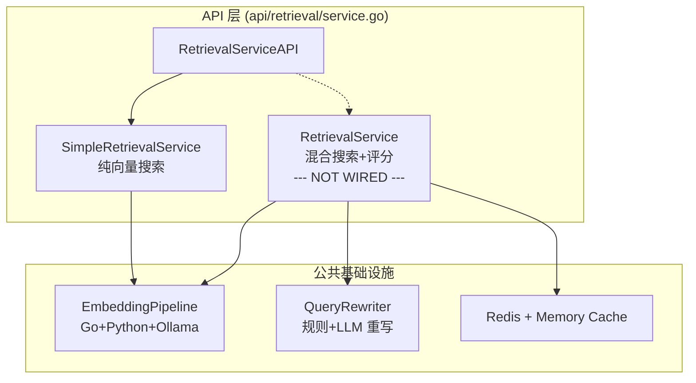
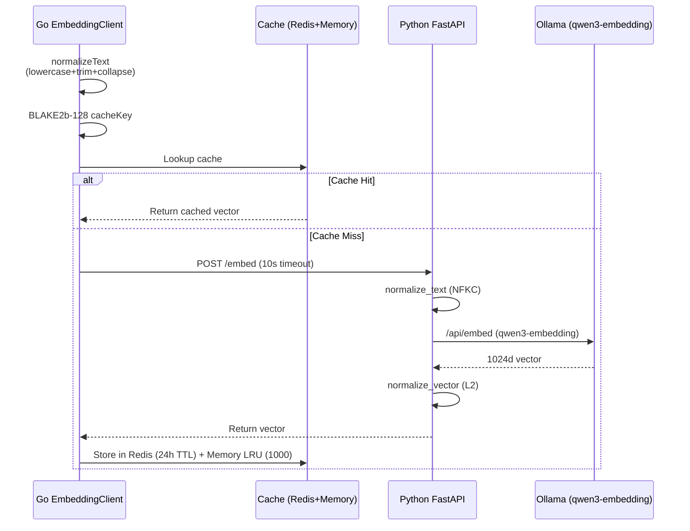
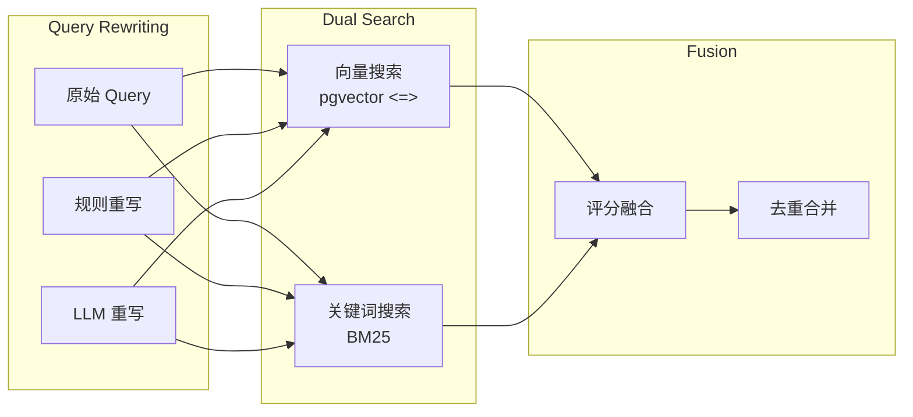
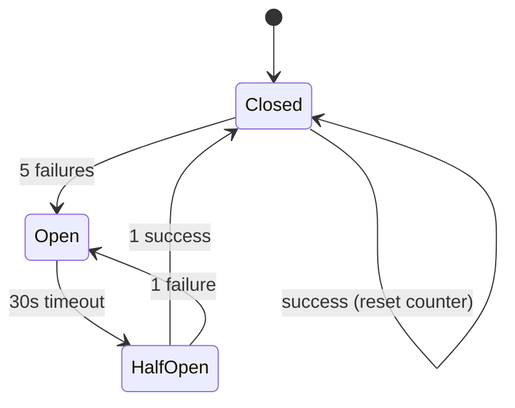

# GoAgentX 架构深度解析（十）：检索系统——混合搜索与评分管线

> Agent 说："根据您过去的经验，我建议……"——但建议的东西根本不相关。
> 比这更惨的是：Agent 明明之前解决过一模一样的问题，这次又从头开始想方案。
> 我当时就在想：Agent 的记忆不是"有没有"的问题，是"能不能找到对的"的问题。
> 一个没有检索能力的 Agent，就是一个金鱼——7 秒记忆，永远在发明轮子。

## 一、先说为什么检索决定 Agent 的智商

写 Agent 有个很残酷的事实：**模型再强，喂的上下文不对就是废物**。

GPT-4 能考进前 10%，但如果我喂进去的是错误的文档、不相关的经验、过时的知识……那输出就是看起来很有道理但实际上是胡说八道的东西。这比直接说"我不知道"更坑——因为用户会相信。

我以前做 embeddings 的时候犯过一个经典错误：所有东西塞一个向量库，搜出来什么就是什么。结果呢？

- 搜"Python 安装依赖报错"，返回的是三个月前的 JavaScript 教程片段——因为全是文本 embeddings，语义混在一起
- 搜"用户登录超时问题"，返回的是"如何优化 PostgreSQL 连接池"——相关但不精确
- Agent 拿着不相关的上下文，编了一个看着很合理的解决方案，浪费用户 40 分钟

所以后来我得出结论：**检索系统不是"向量数据库一把梭"的事情。它需要多层策略、权重评分、信号加权、时间衰减……这一套组合拳下去，才能保证喂到 LLM 嘴里的东西是真正有用的。**

## 二、架构总览：两套检索 + 公共基础设施

GoAgentX 的检索体系分为两层：



**SimpleRetrievalService** 是当前 API 层实际接入的检索方案——纯向量搜索，简单直接，适用于"不求多精准但别翻车"的场景。

**RetrievalService** 则是完整的混合搜索引擎——2069 行代码，覆盖了向量搜索、BM25 关键词搜索、多层权重评分、信号加权、时间衰减、去重合并……一套完整的工业级检索管线。

你猜怎么着？**advancedRetrieval 在 API 层始终是 nil。** 这个问题我们在"坦诚环节"再展开说。

## 三、Embedding Pipeline

先说基础设施——不管哪种检索策略，Embedding 是绕不开的第一步。



### 3.1 文本标准化

Go 端入口：

```go
// internal/storage/postgres/embedding/client.go
func normalizeText(input string) string {
    input = strings.ToLower(input)
    input = strings.TrimSpace(input)
    // 将多个空白字符合并为单个空格
    return regexp.MustCompile(`\s+`).ReplaceAllString(input, " ")
}
```

Python 端进一步处理：

```python
# services/embedding/app.py
import unicodedata

def normalize_text(text: str) -> str:
    text = unicodedata.normalize('NFKC', text)
    # 去除控制字符
    text = ''.join(ch for ch in text if unicodedata.category(ch) != 'Cc')
    text = text.lower().strip()
    return re.sub(r'\s+', ' ', text)
```

为什么要两段标准化？因为 Go 的 `strings.ToLower` 和 Python 的 `str.lower()` 在某些 Unicode 字符（比如 İ、ı）上行为不同。双层标准化确保即使未来某个端改了逻辑，另一个端也能兜住。

### 3.2 缓存策略

Embedding 的计算开销不小——每次请求都要调外部模型。所以缓存是优化第一刀：

- **Redis**: 24 小时 TTL，跨进程共享
- **Memory LRU**: 1000 条上限，进程内热缓存

```go
// internal/storage/postgres/embedding/cache.go
func (c *Cache) getCacheKey(input string) string {
    hash := blake2b.Sum128([]byte(input))
    return fmt.Sprintf("embed:%x", hash)
}
```

BLAKE2b-128 比 MD5 快，比 SHA-256 短，16 字节的摘要作为缓存 key 正好。

### 3.3 模型与向量归一化

Embedding 模型用的是 **qwen3-embedding:0.6b**，输出 1024 维向量。返回前做 L2 归一化：

```python
# services/embedding/app.py
vectors = np.array(vectors)
norms = np.linalg.norm(vectors, axis=1, keepdims=True)
vectors = vectors / norms
```

归一化很关键——它把向量内积变成了余弦相似度的代理。这样用 `<=>` 运算符算出来的结果天然就是 [-1, 1] 之间的相似度值。

### 3.4 降级策略

Embedding 调用有三种结果，对应三种降级：

```go
// internal/storage/postgres/embedding/fallback.go
const (
    FallbackToCache   // 缓存有旧向量，返回但不更新
    FallbackToKeyword // 回退到纯关键词检索
    FallbackToError   // 返回错误，交给上层处理
)
```

这避免了"Embedding 挂了检索就不能用"的恶性依赖。实际上线上最常见的情况是 Ollama 偶尔超时，降级到关键词搜索虽然精度下降，但至少还能用。

## 四、SimpleRetrievalService：纯向量搜索

当前 API 层实际接入了的都是这个服务。它的逻辑非常直接：

```go
// internal/storage/postgres/services/simple_retrieval_service.go
func (s *SimpleRetrievalService) Search(ctx context.Context, 
    query string, limit int, tenantID string) ([]*RetrievalResult, error) {
    
    queryVec, err := s.embedding.GenerateEmbedding(ctx, query)
    if err != nil {
        return nil, fmt.Errorf("generate embedding: %w", err)
    }

    rows, err := s.db.Query(ctx, `
        SELECT content, metadata, 
               1 - (embedding <=> $1) AS similarity
        FROM knowledge_embeddings
        WHERE tenant_id = $2
        ORDER BY embedding <=> $1
        LIMIT $3
    `, queryVec, tenantID, limit)
    // ...
}
```

就三步：生成向量 → `<=>` 余弦距离排序 → 返回 Top-K。没有重写、没有加权、没有去重。简单到令人发指，但够用——只要你的知识库质量高、query 明确。

缺点也很明显：对短 query、歧义 query、拼写错误的 query 毫无抵抗力。因为这些情况下，向量本身就搜不到什么相关的东西。

## 五、RetrievalService：混合搜索引擎

这是真正的重头戏——2069 行代码，覆盖了检索的**全流程**。

### 5.1 混合搜索策略



搜索时对**每个 query 变体**（原始 + 重写版本）同时跑向量搜索和 BM25 关键词搜索，得到的结果统一进入评分管线。

### 5.2 Query 重写

Query 重写有两种方式：

**规则重写**——从 config 读取同义词映射：

```yaml
# configs/synonyms.yaml
synonyms:
  "memory": ["memory", "experience", "distillation", "memories"]
  "tool": ["tool", "function", "capability", "skill"]
  "error": ["error", "bug", "failure", "exception", "crash"]
```

**LLM 重写**——调用模型的文本改写能力，但加了严格约束：

```go
// internal/storage/postgres/services/query_rewriter.go
const (
    maxRewrites      = 2          // 最多生成 2 个 rewrite
    llmTimeout       = 30 * time.Second
    llmTemperature   = 0.3        // 低温度保证稳定性
    jaccardThreshold = 0.6        // 与原始 query 的相似度下限
    rewriteCacheTTL  = 10 * time.Minute
)
```

核心逻辑：

1. 先查缓存——10 分钟内相同的 query 不再重复调用 LLM
2. 调用 LLM 后计算 Jaccard 相似度（字符级别的重合度）
3. 相似度低于 0.6 的 rewrite 直接丢弃——防止 LLM 跑偏
4. 最多保留 2 个 rewrite 结果

为什么定 0.6？试出来的。低于 0.6 的 rewrite 和原文基本不是一个意思了；高于 0.6 说明保留了大部分原始语义信息。

### 5.3 Query 权重

不同的 query 变体在评分时权重不同：

| Query 来源 | 权重 | 说明 |
|-----------|------|------|
| 原始 query | 1.0 | 用户说的就是最重要的 |
| 规则重写 | 0.7 | 同义词扩展，靠谱但不越界 |
| LLM 重写 | 0.5 | 信一半，因为 LLM 不可控因素多 |

这个权重分配传达了一个信号：**机器再怎么猜，也不如用户说的原始 query 重要。**

### 5.4 来源权重

当多个来源同时激活时（比如搜索知识库 + 搜索经验 + 搜索工具），结果需要跨来源排序。这时候用来源权重调节不同 domain 的优先级：

| 来源 | 权重 | 理由 |
|------|------|------|
| Knowledge | 0.4 | 知识库是结构化高质量的 |
| Experience | 0.3 | 经验是历史验证过的 |
| Tools | 0.2 | 工具描述通常较短，语义丰富度有限 |
| TaskResults | 0.1 | 任务结果量太大，噪声多 |

注意：**当只有一个来源时，来源权重不生效**（值为 1.0）。这样设计是因为单来源场景下不需要跨域排序，直接用内部评分就够了。

### 5.5 子来源权重

每个来源内部，向量搜索和关键词搜索的得分也需要调和：

| 子来源 | 权重 |
|--------|------|
| Vector | 1.0 |
| Keyword | 0.8 |

语义匹配优先于字面匹配——但关键词搜索在实体名称、错误消息等场景下又有不可替代的作用。这个 0.8 的配比是为了在两者之间取得平衡。

### 5.6 信号加权

除了静态权重，系统还引入了一组**动态信号**，根据检索结果的元数据动态调整分数：

**Experience 信号：**

| 信号 | 条件 | 乘数 |
|------|------|------|
| 成功经验 | `SuccessCount > 0` | 1.2 |
| 失败经验 | `FailureCount > 0` | 0.7 |
| 快速执行 | `ExecTime < 1s` | 1.2 |
| 慢速执行 | `ExecTime > 5s` | 0.8 |
| 高频复用 | `ReuseCount > 3` | 1.1 |
| 有文档 | `Documented == true` | 1.05 |

**Tool 信号：**

| 信号 | 条件 | 乘数 |
|------|------|------|
| 需要认证 | `AuthRequired == true` | 0.9 |
| 高成功率 | `SuccessRate > 0.9` | 1.1 |
| 低成功率 | `SuccessRate < 0.5` | 0.8 |

这些信号的逻辑很直观：**历史表现好、执行快、被多次复用的结果，应该排在前面。** 反过来，老是失败、执行很慢的结果，给它降权。

### 5.7 时间衰减

信息有时效性。三个月前的经验可能已经过时了，六个月前的工具版本可能已经被废弃了。

```go
func (s *RetrievalService) applyTimeDecay(score float64, 
    createdAt time.Time) float64 {
    
    ageHours := time.Since(createdAt).Hours()
    decay := math.Exp(-0.01 * ageHours)
    if decay < 0.1 {
        decay = 0.1
    }
    return score * decay
}
```

时间衰减公式：`e^(-0.01 × age_hours)`

| 时间 | 衰减系数 |
|------|---------|
| 1 小时 | 0.990 |
| 24 小时 | 0.787 |
| 7 天 | 0.185 |
| 30 天 | 0.011 → 下限 0.1 |
| 更久 | 0.1（下限） |

`math.Exp(-0.01 * age_hours)` 的意思是：1 天衰减到 78%，7 天衰减到 18%，一个月以后基本就是下限 0.1 了。意味着系统天然偏向近期内容。

下限 0.1 是为了保证即使是古董内容，如果其他信号足够强，也还有机会被检索到——不至于因为时间太久就完全消失。

### 5.8 完整评分公式

把上面所有因素串起来，最终的评分公式就是：

```
FinalScore = BaseScore × QueryWeight × SourceWeight × SubSourceWeight 
             × SourceSignals × TimeDecay
```

一个具体的例子：假设用户搜了一个关于"Python 安装依赖报错"的问题，LLM 根据历史经验找到了一个相关的记忆片段：

- BaseScore = 0.85（原始向量相似度）
- QueryWeight = 1.0（用的是原始 query，没有 rewrite）
- SourceWeight = 1.0（只有一个来源，不跨域）
- SubSourceWeight = 1.0（来自向量搜索）
- SourceSignals = 1.2 × 1.1 × 1.05（成功经验 + 高频复用 + 有文档）
- TimeDecay = 0.787（24 小时前创建的）

```
FinalScore = 0.85 × 1.0 × 1.0 × 1.0 × (1.2 × 1.1 × 1.05) × 0.787
           = 0.85 × 1.386 × 0.787
           ≈ 0.927
```

注意：**SourceSignals 是乘法的**。这意味着多个正面信号叠加时效果很明显——1.2 × 1.1 × 1.05 ≈ 1.386，直接拉高了 38.6% 的最终得分。反过来，一个负面信号（比如失败经验 0.7）就能把得分拉低 30%。

这种设计是有意为之的：让"好的证据链"和"坏的迹象"都能在评分中产生显著影响，而不是被平均掉。

### 5.9 去重与合并

不同搜索路径可能返回相同的内容。比如向量搜索和关键词搜索都命中同一段代码。这时候不会简单地去重，而是**累加得分**：

```go
func (s *RetrievalService) deduplicate(results []*ScoredResult) []*ScoredResult {
    seen := make(map[string]*ScoredResult)
    for _, r := range results {
        if existing, ok := seen[r.ID]; ok {
            // 同一段内容被多个搜索路径命中——额外加分
            existing.Score += r.Score * 0.3
        } else {
            seen[r.ID] = r
        }
    }
    // ...
}
```

这是"多路命中信号"：同一段内容被向量搜索和关键词搜索都命中，说明它真的相关。30% 的附加分是一个经过经验调整的值——太高会导致一个内容霸榜，太低又体现不出多路命中的价值。

### 5.10 精确模式

对于某些特殊 query，系统切换到精确匹配模式：

```go
func isPrecisionMode(query string) bool {
    if len([]rune(query)) <= 10 {
        return true
    }
    specialChars := "=+-*/:"
    for _, c := range query {
        if strings.ContainsRune(specialChars, c) {
            return true
        }
    }
    return false
}
```

精确模式下的检索路径是：**精确匹配 → 关键词搜索 → 向量搜索**（兜底）。

什么时候触发？

- Query 很短（<= 10 字符）——"报错 500"、"超时"这类短 query 做向量搜索很坑，词太少语义不明确
- Query 包含特殊符号——"status=error"、"CPU>90%"这类 query 本身带有结构，直接做语义搜索会丢失关键信息

## 六、并发模型与门控系统

### 6.1 并发控制

检索系统涉及多个独立操作（多种 query 变体 × 多种搜索策略），用 `errgroup` 做并发控制：

```go
g, ctx := errgroup.WithContext(ctx)
g.SetLimit(2) // 最多 2 个并发 goroutine

for _, variant := range queryVariants {
    variant := variant
    g.Go(func() error {
        ctx, cancel := context.WithTimeout(ctx, 2*time.Second)
        defer cancel()
        return s.searchSingleVariant(ctx, variant, results)
    })
}
```

`SetLimit(2)` 限制并发数为 2，防止大量搜索请求同时涌入数据库。每个子搜索的 context timeout 是 2 秒——超过这个时间没返回的搜索路径直接丢弃，不影响整体结果。

### 6.2 门控系统

系统集成了三层门控：

```go
type Gate struct {
    rateLimiter      *RateLimiter   // 100 req/s
    circuitBreaker   *CircuitBreaker // 5 次失败后熔断
    dbTimeout        time.Duration  // 30s
}
```

- **RateLimiter**: 每秒最多 100 次检索请求。超过的请求直接返回 429，不走数据库。
- **CircuitBreaker**: 连续 5 次检索失败后进入熔断状态。30 秒后尝试半开恢复。熔断期间直接返回错误，不浪费资源。
- **DB Timeout**: 每次数据库查询的最大等待时间是 30 秒。



这套门控设计得挺谨慎的——检索系统是整个 Agent 的知识命脉，挂了会直接导致 Agent 变智障。宁可返回空结果也别让 Agent 等 60 秒超时。

## 七、调试与可观测性

每个检索请求都可以生成详细的调试信息：

```go
type DebugInfo struct {
    Query           string
    Rewrites        []string
    TotalResults    int
    QueryTime       time.Duration
    ScoreBreakdown  []ScoreDebug
}

type ScoreDebug struct {
    ID              string
    Content         string
    BaseScore       float64
    QueryWeight     float64
    SourceWeight    float64
    SubSourceWeight float64
    SourceSignals   map[string]float64
    TimeDecay       float64
    FinalScore      float64
}
```

`GenerateDebugInfo()` 提供完整的评分链路追踪——每个结果的每个权重因子都有记录。这在调优评分参数或者排查"为什么这个烂结果排第一"时非常有价值。

## 八、坦诚环节

现在来说那个大象在屋里。

**RetrievalService（这个 2069 行的混合搜索引擎）在 API 层始终没有被接入。**

```go
// api/retrieval/service.go
func NewRetrievalService(cfg *Config) (*Service, error) {
    simpleRetrieval, err := NewSimpleRetrievalService(...)
    // advancedRetrieval, err := NewAdvancedRetrievalService(...) // 这一行被注释了
    
    return &Service{
        simpleRetrieval:   simpleRetrieval,
        // advancedRetrieval: advancedRetrieval, // 一直 nil
    }, nil
}
```

hhh，是不是感觉被骗了？

我写这套东西的时候兴奋得不行——"这才叫检索系统"。写完了发现：SimpleRetrievalService 已经跑得很稳了，替换成这套复杂系统需要大量的集成测试、A/B 测试、性能基准。然后就一直拖着。

技术上这个决定有道理：SimpleRetrievalService 对于 80% 的场景已经够用。复杂评分、信号加权、时间衰减这些东西，在数据量不大（< 10 万条）的时候，收益并不明显。

但我也知道，**随着用户数据和经验的积累，这套混合搜索引擎早晚要上线。** 代码已经写好了，就差一把火。

所以这篇不是"你已经在用的功能"的文档——它是"你应该了解的未来"的蓝图。如果你真的踩到了纯向量搜索的天花板（短 query 召回率低、跨域排序不准、经验复用率上不去），这套混合搜索管线就是答案。

反正代码都写好了，等有人真来催的时候再说吧。

## 九、总结

GoAgentX 的检索系统用一句话概括：**底子是纯向量的简单方案，核武器是混合搜索 + 多层评分管线，但核武器的发射按钮还没按下去。**

关键设计点：

1. **Embedding 管线**——Go-Python-Ollama 三层架构，双层标准化 + 三层缓存（Redis + LRU + Fallback）
2. **Query 重写**——规则同义词 + LLM 重写，Jaccard 阈值过滤，10 分钟缓存
3. **多层评分**——静态权重（query/source/sub-source）× 动态信号（成功/失败/速度/复用）× 时间衰减
4. **去重合并**——多路命中 30% 得分加成，识别真正相关的内容
5. **精确模式**——短 query 和结构 query 走精确匹配 + 关键词 + 向量兜底
6. **门控系统**——RateLimit + CircuitBreaker + DB Timeout，防止检索系统被冲垮

Agent 的智商 ≈ 喂给它的上下文质量。而上下文质量，就取决于检索系统能不能在正确的时间、从正确的地方、用正确的权重、捞出正确的内容。

---

> 信息不是力量。检索才是。——这是我在写了一整条检索管线之后的（还在吃灰的）领悟。

**下一篇预告：** 暂时没有下一篇了——这个系列到此暂告一段落。但如果有什么你特别想了解的模块，随时告诉我。
