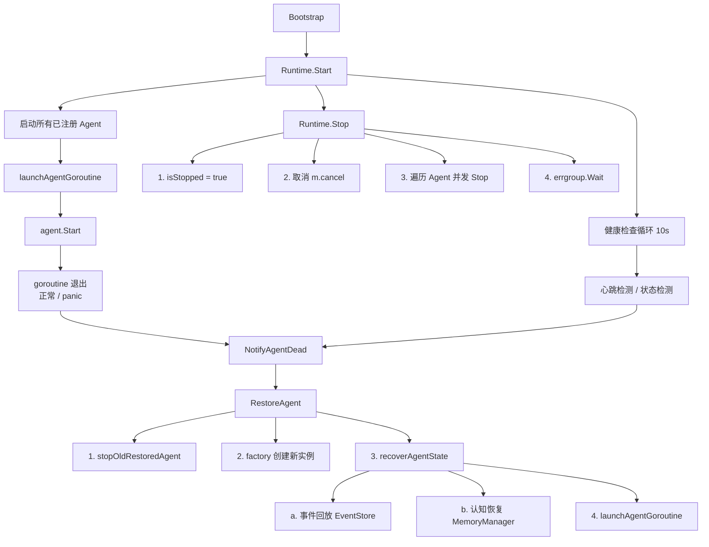

# GoAgentX 架构深度解析（七）：运行时与生命周期 — 出生、死亡与复活

> Agent 会死吗？会。LLM 超时会死、内存溢出会死、panic 会死、宿主重启也会死。
> 但有没有一种机制，能让 Agent 死后带着记忆复活？我管这个叫**秽土转生**。
> 这就是 Runtime 子系统的核心——Agents are disposable executors; the Runtime owns their birth, death, and resurrection.

## 一、Agent 不是永生的

在做 GoAgentX 之前，我用 Python 写过 Agent。Agent 挂了就是挂了——进程退出，所有状态丢失，用户得重新说一遍需求。最崩溃的一次是一个 Agent 跑了两个小时的分析，在最后一步 panic 了。所有工作白费。

我当时就想：**Agent 不能就这么死了。它得能复活，而且复活后得记得之前干到哪了。**

这就是 Runtime 子系统的设计起点。它的哲学写在 `internal/runtime/runtime.go` 的包注释里，一行代码就把态度说清楚了：

```go
// Agents are disposable executors; the Runtime owns their birth, death, and resurrection.
```

翻译过来就是：Agent 是可以扔掉的执行器，但它们的出生、死亡和复活归 Runtime 管。

本文将从源码层面深度剖析 Runtime 子系统的四大模块：**Runtime 核心管理层**、**Agent 接口契约**、**Leader Agent 编排与状态恢复**、**Sub Agent 执行模型**，以及**优雅关闭系统**。

## 二、Runtime 核心接口与 Manager 实现

### 2.1 Runtime 接口

`internal/runtime/runtime.go` 定义了 Runtime 的核心契约：

```go
type Runtime interface {
    StartAgent(ctx context.Context, agent base.Agent) error
    StopAgent(ctx context.Context, agentID string) error
    RestartAgent(ctx context.Context, agentID string) error
    RestoreAgent(ctx context.Context, agentID string, factory AgentFactory) error
    NotifyAgentDead(agentID string, reason string)
    RegisterAgent(agent base.Agent, factory AgentFactory)
    Start(ctx context.Context) error
    Stop() error
    Stats() RuntimeStats
}
```

关键语义：

- `RegisterAgent` 注册 Agent 及其工厂，工厂用于在复活时创建新实例。
- `StartAgent` 启动 Agent，将其放入 errgroup 管理的有 panic 恢复的 goroutine。
- `NotifyAgentDead` 由 Agent 或健康检查调用，触发异步复活流程。
- `RestoreAgent` 执行完整的二阶段状态恢复：操作状态（EventStore 事件回放）+ 认知状态（MemoryManager 对话历史恢复）。

配置常量反映了系统的容错边界：

```go
func DefaultConfig() *Config {
    return &Config{
        HealthCheckInterval: 10 * time.Second,
        MaxRestartsPerAgent: 10,
        MaxReplayEvents:     10000,
        AgentStopTimeout:    10 * time.Second,
        OverallStopTimeout:  30 * time.Second,
        RestoreTimeout:      60 * time.Second,
    }
}
```

### 2.2 Manager 数据结构

`internal/runtime/manager.go` 中的 `Manager` 是 Runtime 接口的默认实现：

```go
type Manager struct {
    mu            sync.RWMutex
    agents        map[string]*managedAgent
    factories     map[string]AgentFactory
    eventStore    events.EventStore
    memManager    memory.MemoryManager
    g             *errgroup.Group
    gctx          context.Context
    cancel        context.CancelFunc
    config        *Config
    totalRestarts int
    startTime     time.Time
    isStarted     bool
    isStopped     bool
}
```

核心设计点：`g` 是 `*errgroup.Group`，但 Manager 的构造器中使用 `errgroup.WithContext(context.Background())` 进行初始化，避免在 `Start()` 之前调用 `m.g.Go()` 导致 panic。当 `Start()` 被调用时，`g` 会被替换为调用者传入 context 的新 errgroup。

### 2.3 managedAgent 元数据

```go
type managedAgent struct {
    agent        base.Agent
    factory      AgentFactory
    cancel       context.CancelFunc
    restarts     int
    stopped      bool      // 自愿停止标记
    resurrecting bool      // 复活进行中标记
}
```

`stopped` 和 `resurrecting` 是两个关键的守卫标记，我们将在后续的"复活守卫模式"中详细讨论。

## 三、Agent 接口层级

`internal/agents/base/agent.go` 定义了多层 Agent 接口：

### 3.1 核心 Agent 接口

```go
type Agent interface {
    ID() string
    Type() models.AgentType
    Status() models.AgentStatus
    Start(ctx context.Context) error
    Stop(ctx context.Context) error
    Process(ctx context.Context, input any) (any, error)
    ProcessStream(ctx context.Context, input any) (<-chan AgentEvent, error)
}
```

### 3.2 可恢复 Agent 接口

```go
type StatefulAgent interface {
    RestoreState(state map[string]any) error
    ReplayEvents(events []*events.Event) error
    Snapshot() (map[string]any, error)
}
```

实现该接口的 Agent 才能在复活时被重建状态。`leaderAgent` 和 `subAgent` 都在编译时通过 `var _ base.StatefulAgent = (*leaderAgent)(nil)` 检查来保证实现。

### 3.3 其他可选接口

```go
type Heartbeater interface {
    Heartbeat(ctx context.Context) error
    IsAlive() bool
}

type Messenger interface {
    SendMessage(ctx context.Context, msg *ahp.AHPMessage) error
    ReceiveMessage(ctx context.Context) (*ahp.AHPMessage, error)
}
```

## 四、Agent 生命周期全景



## 五、死亡与复活机制深究

### 5.1 复活守卫模式（Resurrection Guard）

这是整个系统中最重要的并发安全模式之一，其核心在 `StopAgent` 和 `NotifyAgentDead` 的交互：

```go
func (m *Manager) StopAgent(ctx context.Context, agentID string) error {
    m.mu.Lock()
    ma, exists := m.agents[agentID]
    // 步骤1：先标记为"自愿停止"
    ma.stopped = true
    cancel := ma.cancel
    m.mu.Unlock()

    // 步骤2：再取消 context
    if cancel != nil {
        cancel()    // 这会触发 goroutine 退出
    }
    // ... 优雅停止 agent ...
}
```

为什么必须先设置 `ma.stopped = true` 再调用 `ma.cancel()`？考虑以下时序：

1. 线程 A（StopAgent）调用 `ma.cancel()`。
2. Agent goroutine 检测到 context 取消，调用 `NotifyAgentDead`。
3. 线程 B（NotifyAgentDead）读取 `ma.stopped`，此时如果 `stopped` 尚未被设置为 true，就会错误地触发复活流程。

通过先设置 `stopped = true`，再取消 context，即使 goroutine 在取消后立即调用 `NotifyAgentDead`，也会因为检测到 `ma.stopped == true` 而跳过复活。

### 5.2 NotifyAgentDead 完整守卫逻辑

```go
func (m *Manager) NotifyAgentDead(agentID string, reason string) {
    m.mu.Lock()
    // 四条守卫条件，任意满足则跳过复活：
    if m.isStopped ||               // 运行时已停止
       ma.stopped ||                // Agent 被自愿停止
       ma.resurrecting ||           // 复活已在途中
       ma.restarts >= MaxRestarts   // 超过最大复活次数
    {
        m.mu.Unlock()
        return
    }
    ma.restarts++
    ma.resurrecting = true
    m.totalRestarts++

    // 异步复活，不阻塞调用者
    m.g.Go(func() error {
        defer func() {
            ma.resurrecting = false
        }()
        restoreCtx, cancel := context.WithTimeout(m.gctx, m.config.RestoreTimeout)
        defer cancel()
        return m.RestoreAgent(restoreCtx, agentID, factory)
    })
    m.mu.Unlock()
}
```

### 5.3 二阶段状态恢复

`RestoreAgent` 的核心逻辑在 `recoverAgentState` 方法中：

```go
func (m *Manager) recoverAgentState(ctx context.Context, agentID string, factory AgentFactory) (base.Agent, error) {
    newAgent := factory()  // 工厂创建全新实例

    evts := m.replayEvents(ctx, agentID)  // 阶段A：操作状态恢复

    if sa, ok := newAgent.(base.StatefulAgent); ok {
        // 从事件构建状态
        state := buildStateFromEvents(evts)

        // 阶段B：认知状态恢复
        if m.memManager != nil {
            cognitiveState := m.buildCognitiveState(ctx, agentID, state)
            for k, v := range cognitiveState {
                state[k] = v
            }
        }

        // 先恢复状态快照
        sa.RestoreState(state)
        // 再回放增量事件
        sa.ReplayEvents(evts)
    }
    return newAgent, nil
}
```

**容错策略**：整个恢复链是错误容忍的。EventStore 读取失败 -> 跳过事件回放；MemoryManager 读取失败 -> 跳过认知恢复。Agent 仍然会成功启动。这种设计确保了"部分恢复优于完全不恢复"。

`buildCognitiveState` 方法从 MemoryManager 加载对话历史：

```go
func (m *Manager) buildCognitiveState(ctx context.Context, ...) map[string]any {
    sessionID, _ := operationalState["session_id"].(string)
    if sessionID == "" {
        sid, err := m.memManager.GetLatestSessionForLeader(ctx, agentID)
        sessionID = sid
    }
    messages, _ := m.memManager.GetMessages(ctx, sessionID)
    state["session_id"] = sessionID
    state["conversation_history"] = messages
    return state
}
```

### 5.4 健康检查循环

`healthCheck` 方法在 `Start` 中启动的独立 goroutine 中运行，每 10 秒执行一次：

```go
func (m *Manager) healthCheck() {
    for _, c := range checks {
        if h, ok := c.agent.(base.Heartbeater); ok {
            if !h.IsAlive() {
                m.NotifyAgentDead(c.id, "health check: heartbeat failed")
            }
            continue
        }
        // 回退到状态检查
        status := c.agent.Status()
        if status == models.AgentStatusOffline || status == models.AgentStatusStopping {
            m.NotifyAgentDead(c.id, "health check: status="+string(status))
        }
    }
}
```

## 六、Leader Agent 的生命周期管理

### 6.1 编排管道

`internal/agents/leader/agent.go` 中，Leader Agent 的 `Process` 方法实现了四阶段编排管道：

```
strInput -> parseInput -> string
    |
    v
initMemoryContext (会话恢复/创建 -> 记录消息 -> 构建上下文 -> 搜索相似任务 -> 创建任务记录)
    |
    v
parser.Parse          步骤1: 解析用户画像
    |
    v
planner.Plan          步骤2: 规划子任务
    |
    v
dispatcher.Dispatch   步骤3: 并行分发任务（信号量并发控制）
    |
    v
aggregator.Aggregate  步骤4: 聚合子任务结果
    |
    v
finalizeMemory (更新任务输出 -> 记录助理回复 -> 后台蒸馏)
```

每个步骤之间都有 `stopCh` 检查：

```go
select {
case <-a.stopCh:
    return nil, coreerrors.ErrAgentNotRunning
default:
}
```

这使得 Agent 的停止请求可以被快速响应，而不必等待整个编排管道执行完毕。

### 6.2 安全蒸馏模式（Context Detachment）

`finalizeMemory` 方法中的蒸馏逻辑展示了一个重要的并发安全模式：

```go
func (a *leaderAgent) finalizeMemory(ctx context.Context, sessionID, taskID string, result *models.RecommendResult) {
    // 检查是否在停止中，防止 Add after Wait panic
    a.distillMu.Lock()
    select {
    case <-a.stopCh:
        a.distillMu.Unlock()
        return  // Agent 正在停止，跳过蒸馏
    default:
    }
    a.distillWg.Add(1)
    a.distillMu.Unlock()

    a.distillEg.Go(func() error {
        defer a.distillWg.Done()

        // 使用 context.Background() 脱离父 context
        // 即使客户端断开，蒸馏仍在后台继续
        distillCtx, cancel := context.WithTimeout(context.Background(), 2*time.Minute)
        defer cancel()

        distilled, _ := a.memoryManager.DistillTask(gCtx, taskID)
        return a.memoryManager.StoreDistilledTask(gCtx, taskID, distilled)
    })
}
```

关键设计点：

- **Context 脱离**：蒸馏使用 `context.Background()` 而非传入的 `ctx`。这样即使客户端断开连接或请求超时，蒸馏仍然在后台完成。
- **distillMu 锁**：`stopCh` 的检查和 `WaitGroup.Add(1)` 必须在同一把锁下原子完成。否则可能出现 `Add` 在 `Wait` 之后被调用，导致 `panic: Add after Wait`。
- **Stop 顺序**：`close(stopCh)` -> `distillWg.Wait()` -> `distillEg.Wait()` -> `streamEg.Wait()`，确保所有后台任务先完成再释放资源。

### 6.3 Sub Agent 执行模型

`internal/agents/sub/` 下的 Sub Agent 采用简化的生命周期管理：

```go
type subAgent struct {
    // ... 核心依赖
    stopCh   chan struct{}   // 通知所有 goroutine 停止
    streamWg sync.WaitGroup  // 追踪活跃的 ProcessStream goroutine
}
```

**taskExecutor**（executor.go）实现了带重试和降级机制的 LLM 执行：

```
LLM 执行路径:
  executeWithLLM(ctx, task, profile)
    -> retry loop (maxRetries=3)
       -> executeWithLLMSingle -> 模板渲染 -> LLM调用
       -> validator.ValidateRecommendResult 验证结果
       -> 验证失败时 retryOnFail=true 则重试
       -> strictMode=true 则返回错误，否则使用未验证结果
  => 所有 LLM 调用失败 -> executeByType 降级（fallback）
```

**heartbeatSender**（heartbeat.go）实现了 `sync.Once` 防御性关闭：

```go
func (s *heartbeatSender) Stop() {
    s.stopOnce.Do(func() {
        close(s.stopCh)
    })
}
```

**toolBinder**（tools.go）实现了本地工具 Registry 桥接模式：

```go
func (b *toolBinder) BridgeFromRegistry(registry *core.Registry) {
    for _, name := range registry.List() {
        if _, exists := b.tools[name]; exists {
            continue  // 本地已注册的不会被覆盖
        }
        b.tools[name] = func(ctx context.Context, args map[string]any) (any, error) {
            return t.Execute(ctx, args)
        }
    }
}
```

## 七、Leader Supervisor 故障转移

`internal/agents/leader/supervisor.go` 中的 `LeaderSupervisor` 监控 Leader 心跳并在超时时执行故障转移：

```
handleFailover(leaderID) -- 心跳超时回调
    |
    v
1. 发送 EventFailoverTriggered 事件
    |
    v
2. Agent.Stop(detachedCtx) -- 使用脱离 context 避免取消传播
    |
    v
3. checkpoint.GetLatest() -- 从数据库恢复检查点
    |
    v
4. EventRecovery.RecoverFromEvents() -- 事件回放降级策略
    |
    v
5. 重试循环 (MaxFailoverAttempts=3):
      ColdRestartStrategy.HandleFailover()
        -> factory(ctx, config) 创建新 Agent
        -> 注入 CheckpointRepository
        -> agent.Start(ctx)
    |
    v
6. TaskRecovery.RecoverStaleTasks() -- 清理孤儿任务
    |
    v
7. 注册新 Leader -> 发送 EventFailoverCompleted
```

注意 `EventRecovery`（event_recovery.go）实现了增量重构逻辑，从事件流中重建 Leader 状态，包括会话 ID、待处理任务列表和最后一次故障转移时间：

```go
type RecoveryState struct {
    SessionID     string
    PendingTasks  []string
    LastVersion   int64
    LastFailover  time.Time
}
```

## 八、优雅关闭系统

`internal/shutdown/manager.go` 实现了四阶段关闭管道：

```
PhasePreShutdown  ->  PhaseGraceful  ->  PhaseForce  ->  PhaseDone
    (预关闭,       (正常关闭,        (强制关闭,        (完成,
     资源释放)       逐步停止)        超时回退)         清理)
```

### 8.1 阶段执行器

`PhaseExecutor`（phase.go）支持重试、指数退避和回滚：

```go
func (e *PhaseExecutor) Execute(ctx context.Context, fn func(ctx context.Context) error) error {
    for attempt := 0; attempt <= e.maxRetries; attempt++ {
        if err := fn(ctx); err != nil {
            backoff := time.Duration(1<<uint(attempt)) * time.Second
            if e.onFailure != nil {
                e.onFailure(err)
            }
            continue
        }
        break
    }
    if e.onComplete != nil {
        return e.onComplete()
    }
}
```

### 8.2 回调注册表

`CallbackRegistry`（callbacks.go）支持优先级排序的回调注册：

```go
type RegisteredCallback struct {
    ID       string
    Priority int       // 高优先级先执行
    Fn       Callback
    Timeout  time.Duration
    OnError  func(error)
}
```

### 8.3 信号处理器

`SignalHandler`（signal.go）将 OS 信号转换为关闭流程：

```go
type SignalHandler struct {
    signals []os.Signal  // 默认: SIGINT, SIGTERM
    manager *Manager
}

func (h *SignalHandler) handleSignal(sig os.Signal) {
    switch sig {
    case os.Interrupt, syscall.SIGINT, syscall.SIGTERM:
        shutdownCtx, cancel := context.WithTimeout(context.Background(), h.manager.timeout)
        defer cancel()
        h.manager.StartShutdown(shutdownCtx)
    }
}
```

## 九、Callbacks 生命周期钩子

`internal/callbacks/callbacks.go` 提供了轻量级的事件钩子系统：

```go
const (
    EventLLMStart   Event = "llm.start"
    EventLLMEnd     Event = "llm.end"
    EventLLMError   Event = "llm.error"
    EventLLMToken   Event = "llm.token"
    EventAgentStart Event = "agent.start"
    EventAgentEnd   Event = "agent.end"
    EventToolStart  Event = "tool.start"
    EventToolEnd    Event = "tool.end"
    EventToolError  Event = "tool.error"
)

type Handler func(ctx *Context)

func (r *Registry) Emit(ctx *Context) {
    handlers := r.handlers[ctx.Event]
    for _, h := range handlers {
        func() {
            defer func() {
                if r := recover(); r != nil {
                    slog.Error("handler panicked", "event", ctx.Event)
                }
            }()
            h(ctx)
        }()
    }
}
```

每个 handler 都有独立的 panic 恢复，一个 handler 的 panic 不会影响后续 handler 的执行。

## 十、架构总结

### 设计模式一览

| 模式 | 位置 | 用途 |
|------|------|------|
| 复活守卫（Resurrection Guard） | `manager.go` | `stopped` 先于 `cancel()` 设置，防止竞态 |
| 上下文脱离（Context Detachment） | `leader/agent.go` | 蒸馏使用 `context.Background()` 独立于请求 |
| 信号量并发控制 | `leader/dispatcher.go` | `chan struct{}` 限制并行任务数 |
| 错误容忍恢复链 | `manager.go` | EventStore 和 MemoryManager 独立恢复，失败仍可启动 |
| 双状态恢复 | `manager.go` | 操作状态（事件）+ 认知状态（消息）独立恢复 |
| 工厂模式 | `runtime.go` | `AgentFactory` 创建新实例 |
| sync.Once + 互斥锁 | `leader/agent.go` | 防止 WaitGroup 的 Add after Wait |
| 优先级回调 | `shutdown/callbacks.go` | 按优先级排序的关闭处理函数 |
| 多阶段关闭 | `shutdown/manager.go` | 预关闭 -> 优雅 -> 强制 -> 完成 |

### 关键文件索引

| 文件 | 核心贡献 |
|------|----------|
| `internal/runtime/runtime.go` | Runtime 接口与配置定义 |
| `internal/runtime/manager.go` | 核心生命周期管理：注册、启动、停止、复活、健康检查 |
| `internal/agents/base/agent.go` | Agent 接口层级定义 |
| `internal/agents/leader/agent.go` | Leader Agent 编排管道与状态恢复实现 |
| `internal/agents/leader/dispatcher.go` | 信号量并发任务分发 |
| `internal/agents/leader/supervisor.go` | 故障转移监控与冷重启策略 |
| `internal/agents/leader/event_recovery.go` | 事件日志重构状态 |
| `internal/agents/leader/checkpoint.go` | PostgreSQL 检查点持久化 |
| `internal/agents/leader/recovery.go` | 孤儿任务清理 |
| `internal/agents/sub/agent.go` | Sub Agent 生命周期与流式处理 |
| `internal/agents/sub/executor.go` | LLM 执行引擎（重试+降级） |
| `internal/agents/sub/heartbeat.go` | ID 级别心跳发送器 |
| `internal/agents/sub/tools.go` | 工具绑定与 Registry 桥接 |
| `internal/shutdown/manager.go` | 多阶段关闭管理器 |
| `internal/shutdown/phase.go` | 带重试和回滚的阶段执行器 |
| `internal/shutdown/callbacks.go` | 优先级排序的关闭回调注册表 |
| `internal/shutdown/signal.go` | OS 信号转发 |
| `internal/callbacks/callbacks.go` | LLM/Agent/Tool 生命周期钩子 |

## 十一、结语

Runtime 子系统是我花时间最多、改版次数最多的部分。不是因为技术难——是"Agent 到底该怎么复活"这个问题，我想了很久。

最后的结论很简单：**Agent 是可以扔掉的，但它的状态不能丢。**

复活守卫模式防止了竞态、错误容忍的恢复链确保"部分恢复优于完全不恢复"、多阶段优雅关闭让进程在任何情况下都能有序退出。这一套组合拳下来，单 Agent 崩溃、整个系统重启——Runtime 都能兜住。

最高兴的一次测试是什么？我开了 10 个 Agent 跑分析任务，然后手动 kill -9 了进程。重启后，所有 Agent 自动复活，继续干之前没干完的活。那一刻我知道：**这玩意儿成了。**

下一篇聊**事件系统**——Agent 干的每一件事都被记录为不可变事件。复活靠它，审计靠它，调试也靠它。