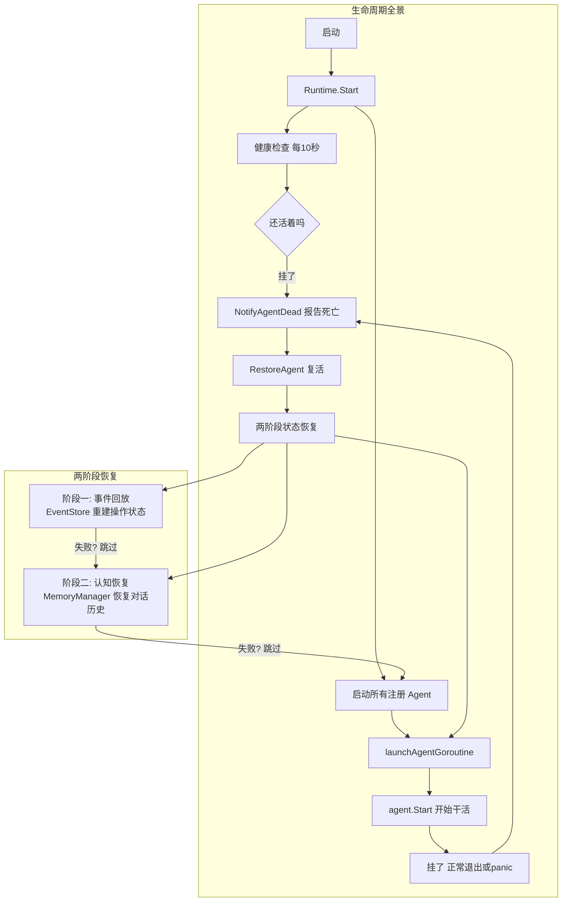
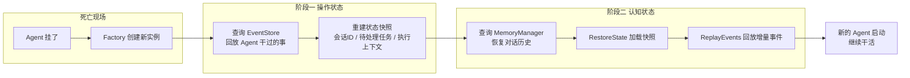
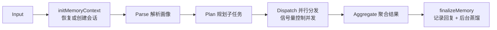
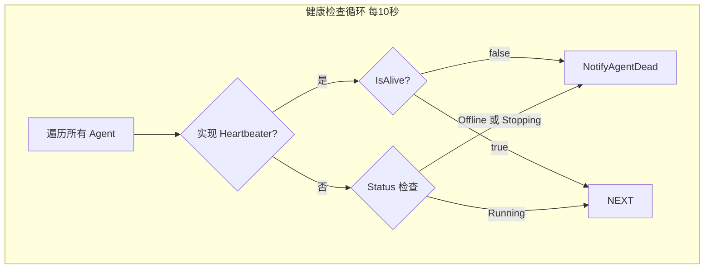
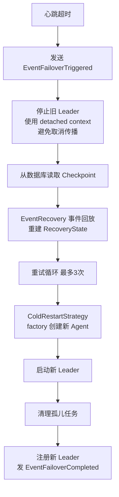
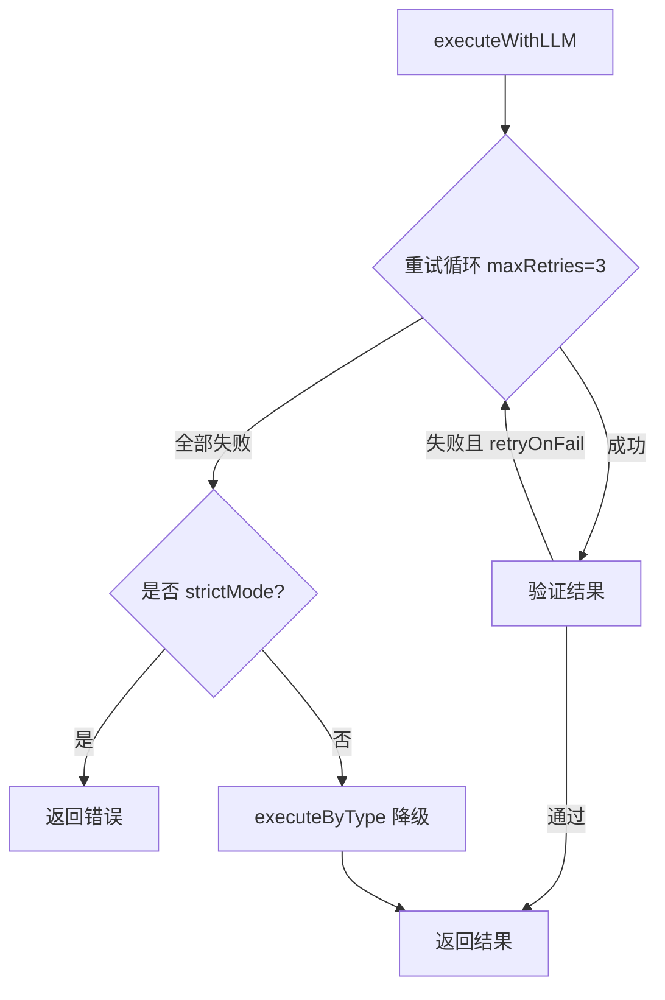
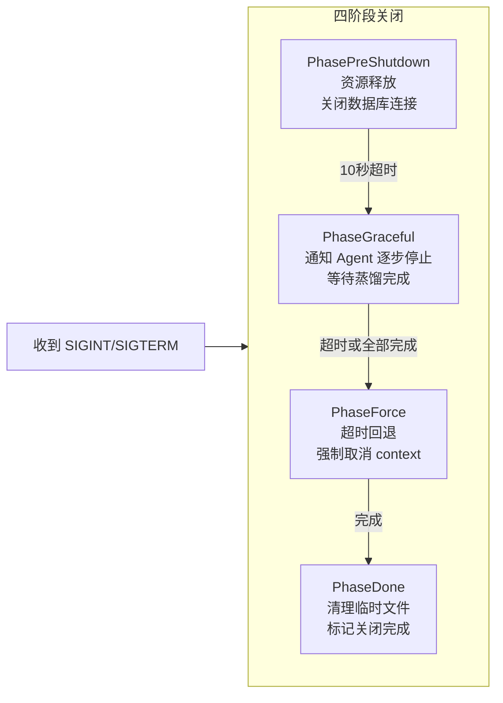

# ares 架构深度解析（七）：运行时与生命周期 — 出生、死亡与复活

> 别的 Agent 框架比谁的功能多、比谁的花哨。我只有一个执念：**菜能接受，坏是绝对不能接受的。**
> 有一天我突然在想，如果现在随便 `kill -9` 一个正在跑的 Agent，怎么把它拉起来？
> 手动拉？先定位是哪个进程，再翻日志分析原因，打补丁，然后 `go run main.go --args`……看着就烦。
> 那有没有一种机制，能让 Agent 死后带着记忆自己爬起来？我管这个叫 **秽土转生**。
> 这就是 Runtime 子系统的核心 —— Agents are disposable executors; the Runtime owns their birth, death, and resurrection.

## 一、纠结的坑

先说说我是怎么**纠结**这个设计的。

最开始的想法很简单：启动一个单独的监控任务，监听所有 Agent 的心跳。挂了就报，报了就去拉。听着不错对吧？结果马上被自己问住了——**监控任务自己凉了怎么办？** 再起一个来监控监控任务？无限套娃，绝了。

那就换个路子。启动一个备用的 Leader，热备，灾备都考虑到了，真棒。问题来了——**Sub Agent 挂了呢？** 总不能也给每个 Sub 配个备份吧？那就启动一群 Sub 轮替呗。COOL，听着真不错。

最后一个问题把我整沉默了：**中断的任务怎么办？**

用户让 Agent 写一个文件，写到一半系统崩了。系统重启后 Agent 自动复活了，然后告诉用户：**"亲，系统刚凉了，我知道你很急，先喝杯茶，咱们从上次断掉的地方继续哦。"**

哪怕用户想问候开发者先人，我觉得都合理。更重要的是——那花掉的 token 呢？从头再来，再花一遍？那可是真金白银的刀乐。

所以整个 Runtime 的设计出发点，不是"怎么让 Agent 不死"，而是三个更现实的问题：

1. **Agent 死了怎么自己爬起来？**（自动复活）
2. **爬起来后怎么记得之前干到哪了？**（状态恢复）
3. **中断的任务怎么续上，不浪费 token？**（续传）

这三个问题回答了，才敢说"坏不了"。

---

## 二、整体架构：Agent 的生死由 Runtime 管



核心哲学就一行代码：

```go
// Agents are disposable executors; the Runtime owns their birth, death, and resurrection.
```

翻译：Agent 是可以随时扔掉的一次性执行器——但它们的出生、死亡、复活，归 Runtime 统一管。

---

## 三、复活守卫模式：为什么 stopped 必须先于 cancel？

这是整个系统里最重要的并发安全细节。先说结论：

```go
func (m *Manager) StopAgent(ctx context.Context, agentID string) error {
    m.mu.Lock()
    // 步骤一：先标记"自愿停止"
    ma.stopped = true
    cancel := ma.cancel
    m.mu.Unlock()

    // 步骤二：再取消 context
    if cancel != nil { cancel() }  // 触发 goroutine 退出
}
```

为什么 `stopped = true` 必须在 `cancel()` 之前？考虑这个竞态：

1. 线程 A 调用 `ma.cancel()`，Agent goroutine 检测到 context 取消
2. goroutine 退出时调用 `NotifyAgentDead`
3. 此时如果 `ma.stopped` 还没被设置为 true，`NotifyAgentDead` 会以为 Agent 是意外死亡，**错误触发复活流程**

先标记、再取消，就是**复活守卫模式**。

完整守卫逻辑有四个条件，任意满足就跳过复活：

```go
if m.isStopped ||         // 运行时自己都停了
   ma.stopped ||           // Agent 是被主动关闭的
   ma.resurrecting ||      // 复活已在路上
   ma.restarts >= MaxRestarts  // 复活太多次了
{
    return  // 不复活
}
```

这里有个**反思**：`MaxRestarts = 10` 这个数字是我拍脑袋定的。为什么是 10 不是 3 不是 20？没有任何理论依据。实际遇到过一个问题：一个 Agent 因为配置错误，启动一秒就挂，挂了被复活，复活了又挂——10 次复活全用完，彻底死掉。日志里全是 resurrection spam，排查的时候很难受。应该改用**指数退避**而不是硬计数，但一直没改。

---

## 四、两阶段状态恢复：挂了不可怕，失忆才可怕

Agent 复活的核心是 `recoverAgentState`：



**最关键的容错设计**：两个阶段互相独立，任何一个失败都**不阻断**整个复活流程。

```go
func (m *Manager) recoverAgentState(ctx context.Context, ...) (base.Agent, error) {
    newAgent := factory()  // 全新实例

    evts := m.replayEvents(ctx, agentID)  // 阶段一
    // replayEvents 失败只会 warn 日志，返回空列表

    if sa, ok := newAgent.(base.StatefulAgent); ok {
        state := buildStateFromEvents(evts)
        sa.RestoreState(state)
        sa.ReplayEvents(evts)
        // 阶段二也容错：MemoryManager 挂了 → 跳过认知恢复
    }
    return newAgent, nil  // 不管有没有恢复成功，Agent 都会启动
}
```

```go
// 认知恢复细节：从 MemoryManager 拉取对话历史
func (m *Manager) buildCognitiveState(ctx context.Context, ...) map[string]any {
    sessionID, _ := operationalState["session_id"].(string)
    if sessionID == "" {
        sid, err := m.memManager.GetLatestSessionForLeader(ctx, agentID)
        sessionID = sid  // 查不到就空着，不致命
    }
    messages, _ := m.memManager.GetMessages(ctx, sessionID)
    state["session_id"] = sessionID
    state["conversation_history"] = messages
    return state
}
```

**反思**：这个"部分恢复优于完全不恢复"的设计是我从 Kubernetes 的 Init Container 策略抄来的灵感，但有一个大问题——如果事件回放只恢复到 80%，Agent 可能以为自己完成了某个任务，实际上没有。怎么判断恢复完整度？目前没有机制。后续应该在事件流里加一个完整性校验位（类似 WAL 的 checksum）。

---

## 五、Leader Agent 的编排管道：stopCh 无处不在

Leader Agent 的 `Process` 方法是四阶段管线：



每个步骤之间都会检查是否收到停止信号：

```go
select {
case <-a.stopCh:
    return nil, ErrAgentNotRunning
default:
}
```

这保证了：就算用户在第 2 步按了 Ctrl+C，Agent 不会傻傻跑完整个管线再停。

### 蒸馏的 Context 脱离：最容易被忽略的坑

`finalizeMemory` 里的蒸馏逻辑藏着一个经典的并发问题：

```go
func (a *leaderAgent) finalizeMemory(...) {
    a.distillMu.Lock()
    select {
    case <-a.stopCh:
        a.distillMu.Unlock()
        return  // 正在停止，跳过蒸馏
    default:
    }
    a.distillWg.Add(1)         // 必须在锁里 Add
    a.distillMu.Unlock()

    a.distillEg.Go(func() error {
        defer a.distillWg.Done()

        // 关键：用 context.Background() 脱离父 context
        // 即使客户端断开，蒸馏仍在后台继续
        distillCtx, cancel := context.WithTimeout(context.Background(), 2*time.Minute)
        defer cancel()

        distilled, _ := a.memoryManager.DistillTask(gCtx, taskID)
        return a.memoryManager.StoreDistilledTask(gCtx, taskID, distilled)
    })
}
```

三个要点：

1. **`distillMu` 保护 `stopCh` 检查和 `Wg.Add(1)` 的原子性**：不加锁的话，可能出现 `Wait` 先跑完，`Add` 后调用 → `panic: Add after Wait`
2. **`context.Background()`**：蒸馏不受客户端断开影响，后台默默跑完
3. **Stop 顺序**：`close(stopCh)` → `distillWg.Wait()` → `distillEg.Wait()`，确保后台蒸馏先完成

**反思**：`context.Background()` 脱离了父 context 的取消传播，但也失去了超时控制——如果蒸馏真跑 2 小时怎么办？虽然设了 `2*time.Minute` 的超时，但这个超时是拍脑袋的。文档里也没告诉用户"蒸馏可能持续 2 分钟，RAM 占用约 X MB"，这是运维层面的缺失。

---

## 六、健康检查与心跳：最薄的保障层



```go
func (m *Manager) healthCheck() {
    for _, c := range checks {
        if h, ok := c.agent.(base.Heartbeater); ok {
            if !h.IsAlive() {
                m.NotifyAgentDead(c.id, "heartbeat failed")
            }
            continue
        }
        // 回退到状态轮询
        status := c.agent.Status()
        if status == models.AgentStatusOffline {
            m.NotifyAgentDead(c.id, "status=offline")
        }
    }
}
```

这里有个很微妙的问题：**`NotifyAgentDead` 是在健康检查 goroutine 里被调用的**，而 `NotifyAgentDead` 内部是异步复活（`m.g.Go(func()...)`）。这意味着健康检查发现 Agent 挂了 -> 触发复活 -> 但健康检查不知道复活成功了没有、花了多久、是否又挂了。

**反思**：健康检查的反馈回路是单向的。它只负责"发现问题 -> 丢给复活流程"，不负责"确认问题已解决"。理想的设计应该是健康检查能感知到复活状态——比如复活成功后更新某个标记，健康检查看到标记后重置计数器。这样还能检测到"反复复活反复失败"的循环，及时告警而不是闷头重试 10 次。

---

## 七、Supervisor 故障转移：冷重启的策略

当 Leader 心跳超时时，`LeaderSupervisor` 执行故障转移：



```go
type RecoveryState struct {
    SessionID     string
    PendingTasks  []string    // 还没干完的活
    LastVersion   int64       // 事件版本号
    LastFailover  time.Time   // 上次故障转移时间
}
```

**反思**：`EventRecovery.RecoverFromEvents()` 的事件回放用的是降级策略——如果事件损坏了某个字段，它会跳过而不是报错。这保证了"尽可能恢复"，但也可能恢复出"看起来正常但逻辑错误"的状态。比如 `PendingTasks` 里有一个任务，实际事件流里已经完成了，但因为某个事件写坏了字段，恢复出来还是待处理。Agent 会重新执行一次，可能导致重复结果。

目前的做法是：**宁可重复执行，不可遗漏任务**。这符合"稳健优先"的原则，但对幂等性要求高——不是所有工具都幂等。后续需要给工具加幂等标记，让恢复系统知道哪些可以安全重试、哪些必须跳过。

---

## 八、Sub Agent：简化版生命周期

Sub Agent 的设计比 Leader 简单得多：

```go
type subAgent struct {
    stopCh   chan struct{}   // 通知所有 goroutine 停
    streamWg sync.WaitGroup  // 追踪活跃的流处理
}
```

Executor 的重试降级逻辑是 Sub 层最值得看的部分：



心跳发送器用 `sync.Once` 防止重复关闭：

```go
func (s *heartbeatSender) Stop() {
    s.stopOnce.Do(func() { close(s.stopCh) })
}
```

**反思**：Sub Agent 的 `executeByType` 降级是一个很粗糙的 fallback——当 LLM 调用全部失败时，根据任务类型走不同的硬编码处理逻辑。比如"分析类"任务返回空结果，"生成类"任务返回缓存版本。这个降级的质量完全取决于 task type 的枚举覆盖了多少场景。目前只覆盖了 4 种类型，很多场景的降级就是直接报错——跟没降级一样。

---

## 九、优雅关闭：四阶段管道



```go
// PhaseExecutor 支持重试和指数退避
func (e *PhaseExecutor) Execute(ctx context.Context, fn func(ctx context.Context) error) error {
    for attempt := 0; attempt <= e.maxRetries; attempt++ {
        if err := fn(ctx); err != nil {
            backoff := time.Duration(1<<uint(attempt)) * time.Second
            if e.onFailure != nil { e.onFailure(err) }
            continue
        }
        break
    }
    if e.onComplete != nil { return e.onComplete() }
}
```

回调注册表支持按优先级排序关闭：

```go
type RegisteredCallback struct {
    ID       string
    Priority int       // 数字越大越先执行
    Fn       Callback
    Timeout  time.Duration
    OnError  func(error)
}
```

---

## 十、Callbacks 生命周期钩子

轻量级的事件钩子系统，每个 handler 独立 panic 恢复：

```go
func (r *Registry) Emit(ctx *Context) {
    handlers := r.handlers[ctx.Event]
    for _, h := range handlers {
        func() {
            defer func() {
                if r := recover(); r != nil {
                    slog.Error("handler panicked", "event", ctx.Event)
                }
            }()
            h(ctx)
        }()
    }
}
```

**反思**：这个系统存活得很尴尬。早期设计，用于 LLM/Agent/Tool 生命周期的事件通知。后来有了 `events.EventStore` 事件溯源系统，功能上是重叠的。之所以还没删，是因为有些地方还在用 callbacks（比如日志、指标上报），迁移成本比收益高。这就是典型的"新系统兼容旧系统"的过渡态——两个都能发出事件，但消费方不一样，排查时需要看两个地方。

---

## 十一、已知问题和设计缺陷

**1. 复活计数没有指数退避**

`MaxRestarts` 是硬计数 10，反复复活失败时会刷爆日志。应该用指数退避（第一次等 1s，第二次 2s，第三次 4s...）逐步降低复活频率。

**2. 健康检查没有反馈回路**

只负责"发现问题说一声"，不关心"问题解决了没有"。反复复活反复失败的循环无法被检测到。

**3. 事件回放的完整度无法验证**

如果事件流损坏或回放不完整，Agent 可能带着"部分失忆"的状态复活，自己以为完成任务了，实际上没有。需要 WAL 级别的完整性校验。

**4. Context 脱离（蒸馏）的用户认知成本**

`context.Background()` 脱离父 context 保证了蒸馏不中断，但也意味着**运维人员不知道蒸馏在跑**。缺乏一个"后台任务进度"的可见性机制。

**5. Sub Agent 降级覆盖不全**

`executeByType` 只有 4 种类型的降级逻辑，大部分场景的降级是直接报错，形同虚设。

**6. 非幂等工具的重试风险**

宁可重做不可遗漏的策略，对非幂等工具（比如下单、发邮件）是灾难性的。需要工具级幂等标记。

**7. Callbacks 和 Events 双系统共存**

两个都能发出事件、两个都能消费事件，但没有统一的事件模型。排查时需要翻两个地方。

---

## 十二、架构总结

| 模式 | 解决问题 | 不足 |
|------|----------|------|
| 复活守卫（stopped 先于 cancel） | 防止自愿停止被误判为意外死亡 | — |
| 错误容忍恢复链 | 部分恢复 > 完全不恢复 | 恢复完整度不可验证 |
| 上下文脱离（Background） | 蒸馏不因请求中断而中断 | 运维不可见 |
| 信号量并发控制 | 限制并行子任务数 | — |
| 工厂模式 + 事件回放 | 状态重建 | 非幂等工具不安全 |
| sync.Once + Mutex | 防止 Add after Wait panic | — |
| 多阶段关闭 | 有序释放资源 | — |

最让我高兴的一次测试：开了 10 个 Agent 跑分析任务，然后手动 `kill -9` 了进程。重启后所有 Agent 自动复活，继续干活。

那一刻我知道：**钱没白花。**

---

**附录：关键文件索引**

| 文件 | 核心职责 |
|------|----------|
| `internal/runtime/runtime.go` | Runtime 接口与配置定义 |
| `internal/runtime/manager.go` | 注册、启动、停止、复活、健康检查 |
| `internal/agents/base/agent.go` | Agent 接口层级：Agent / StatefulAgent / Heartbeater |
| `internal/agents/leader/agent.go` | Leader 编排管线 + 状态恢复 + 安全蒸馏 |
| `internal/agents/leader/dispatcher.go` | 信号量并发分发 |
| `internal/agents/leader/supervisor.go` | 心跳监控 + 故障转移 + 冷重启 |
| `internal/agents/leader/event_recovery.go` | 从事件流重建 RecoveryState |
| `internal/agents/sub/agent.go` | Sub Agent 生命周期 |
| `internal/agents/sub/executor.go` | LLM 执行引擎（重试 + 降级） |
| `internal/agents/sub/heartbeat.go` | 心跳发送 + sync.Once 关闭 |
| `internal/shutdown/manager.go` | 四阶段关闭 |
| `internal/callbacks/callbacks.go` | LLM/Agent/Tool 生命周期钩子 |


Agent 挂了怎么办？这是所有 Agent 框架都绕不开的问题，但很少有人认真回答。这篇文章会带你走一遍 Runtime 子系统的设计历程——从"怎么不让 Agent 
死"到"死了怎么自己爬起来"，再到"爬起来怎么记得之前干到哪了"。你会看到复活守卫的并发陷阱、两阶段状态恢复的容错哲学、Context 脱离的蒸馏设计，以及每个方案背后的纠结和已知缺陷。适合正在做 Agent 稳定性、分布式编排、或有状态服务自动恢复的开发者阅读。