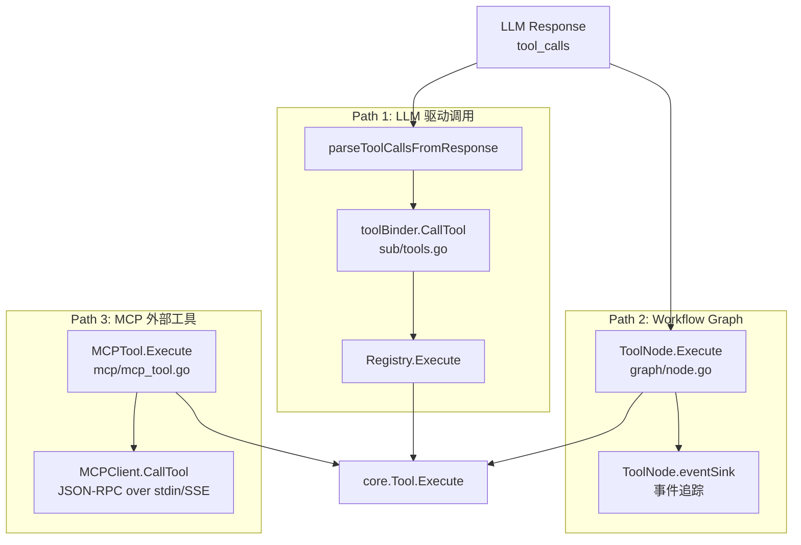
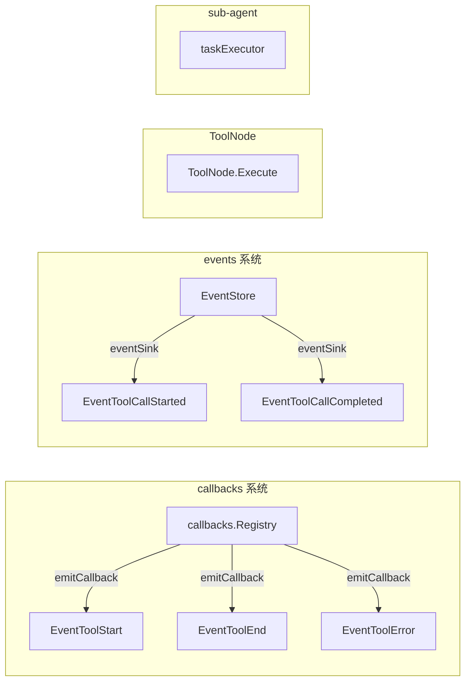

# ares 架构深度解析（五）：工具调用层拆解 -- 三条路径与一个缺口

> 22 个工具注册好之后，我以为万事大吉了。结果第一个集成测试就把我打回了原型——LLM 生成的参数传进去直接 panic，因为类型断言失败了。
> 我意识到一件事：定义工具只是第一步。真正复杂的，是工具**怎么被调起来**的这条链路。
> 参数怎么从 LLM 的 JSON 落到 Go 的函数里？结果怎么回去？谁负责超时？谁负责重试？这些才是工具系统的核心复杂度所在。

## 一、工具调用的三条路径

很多人看完工具注册那一套，以为工具调用就是 `registry.Execute(name, params)` 一把梭。但实际跑起来，你会发现有三条完全不同的调用路径，各有各的考量：



当 LLM 决定调用一个工具时，数据长这样流：

```
LLM 返回 tool_calls (OpenAI JSON)
    ↓
parseToolCallsFromResponse()     [internal/llm/output/openai.go]
    ↓ ToolCallResponse { ToolCalls: [{ID, Name, Arguments}] }
sub-agent executor               [internal/agents/sub/executor.go]
    ↓ 遍历 ToolCalls
toolBinder.CallTool(name, args)  [internal/agents/sub/tools.go]
    ↓ 查找闭包映射
Registry.Execute(ctx, params)    [internal/tools/resources/core/registry.go]
    ↓ 按名查找 Tool
Tool.Execute(ctx, params)        [core/tool.go]
    ↓
core.Result { Success, Data, Error }
```

这是**最常用**的一条路径，也是问题最多的。我们一条条拆。

---

## 二、路径一：LLM 驱动的工具调用

### 2.1 toolBinder：Registry 到 Agent 的桥梁

子 Agent 不能直接拿 `GlobalRegistry` 到处用。中间隔了一层 `toolBinder`：

```go
// internal/agents/sub/tools.go
type toolBinder struct {
    mu       sync.RWMutex
    tools    map[string]func(ctx context.Context, args map[string]any) (any, error)
    registry *core.Registry
}

func (b *toolBinder) BridgeFromRegistry(registry *core.Registry) {
    // 遍历 registry，为每个工具创建闭包
    // 实际效果：b.tools[name] = func(ctx, args) { return t.Execute(ctx, args) }
}
```

为什么多这一层？三个理由：

1. **接口隔离**：子 Agent 不需要知道 `Registry` 的存在，它只需要 "按名字调函数"
2. **本地优先**：`toolBinder.GetTool` 有本地 → Registry 的 fallback 链，支持子 Agent 注入私有工具
3. **测试友好**：测试时可以直接 mock toolBinder，不需要启动整个 Registry

### 2.2 LLM 工具调用协议适配

参数从 LLM 的 JSON 到 Go 的 `map[string]interface{}`，这条链路看起来简单，实际上藏着不少弯弯绕：

```go
// internal/llm/output/openai.go
func parseToolCallsFromResponse(choice *Choice) (*ToolCallResponse, error) {
    // OpenAI 返回的 tool_calls 是这种结构：
    // {
    //   "tool_calls": [{
    //     "id": "call_xxx",
    //     "function": {
    //       "name": "calculator",
    //       "arguments": "{\"expression\": \"1+1\"}"
    //     }
    //   }]
    // }
    // arguments 是 JSON **字符串**，不是对象
    // 需要二次反序列化
}
```

这里有个容易忽略的点：`arguments` 是 JSON `string`，不是 JSON `object`。如果 LLM 返回非法 JSON，就会在这里崩。OpenAI 和 Anthropic 的工具调用格式还不一样——Anthropic 的 content block 里直接带 JSON object。

为了统一，框架内部定义了自己的抽象：

```go
// internal/llm/output/toolcall.go
type ToolCapable interface {
    GenerateWithTools(ctx context.Context, prompt string, 
        tools []ToolDefinition, choice ToolChoice) (*ToolCallResponse, error)
    SendToolResult(ctx context.Context, messages []map[string]interface{},
        toolResults []ToolResult) (*ToolCallResponse, error)
}

type ToolCall struct {
    ID        string `json:"id"`
    Name      string `json:"name"`
    Arguments string `json:"arguments"`  // JSON string
}
```

每一家 LLM 的 adapter 自己负责把供应商格式转成 `ToolCallResponse`。这样一来，**工具注册、调度、执行**对 LLM 供应商完全透明。

### 2.3 参数校验的缺口

这是整个调用链路里最让我睡不着的一个问题。看代码：

```go
// internal/tools/resources/builtin/math/calculator.go
func (t *Calculator) Execute(ctx context.Context, params map[string]interface{}) (core.Result, error) {
    expression, ok := params["expression"].(string)  // 手动类型断言
    if !ok || expression == "" {
        return core.NewErrorResult("invalid_expression"), nil
    }
    // ...
}
```

**问题在哪？** `ParameterSchema` 定义了参数的类型、格式、枚举值，但**没有任何通用代码在调用 Execute 之前去校验参数**。

```go
// core/tool.go - ParameterSchema 定义
type ParameterSchema struct {
    Type       string                `json:"type"`
    Properties map[string]*Parameter `json:"properties"`
    Required   []string              `json:"required"`
}

// core/registry.go - Execute 实现
func (r *Registry) Execute(ctx context.Context, name string, params map[string]interface{}) (Result, error) {
    tool := r.Get(name)
    if tool == nil {
        return NewErrorResult("tool not found"), nil
    }
    return tool.Execute(ctx, params)  // 直接执行，无 schema 校验
}
```

这就是说，`ParameterSchema` 只对 LLM"有参考价值"（用于生成正确的参数），对代码执行没有约束力。每个工具自己用 `params["xxx"].(string)` 手写类型断言。写对了还好，写错了就是 panic。

这个缺口我知道，但一直没堵。原因是：参数校验器要处理嵌套的 JSON Schema、enum、最小/最大值、pattern 等等——这在 Go 里写起来很重。另一个更关键的原因是，有时候 LLM 传的参数在 validate 的边缘情况（比如传了多余字段），宽松的参数处理反而更鲁棒。这是个取舍，我选择了"信任 LLM + 工具自我保护"的策略。

---

## 三、路径二：Workflow Graph 的 ToolNode

这是第二条调用路径，用的是 Workflow 引擎的图执行机制。

```go
// internal/workflow/graph/node.go
type ToolNode struct {
    tool        core.Tool
    nodeID      string
    executionID string
    eventSink   func(ctx context.Context, eventType events.EventType, payload map[string]any)
}

func (n *ToolNode) Execute(ctx context.Context, state *State) error {
    // 1. 生成确定性 inputHash
    inputHash := n.hashInput(params)
    // 2. 生成 tool_call_id
    toolCallID := fmt.Sprintf("tool_%s_%s", n.nodeID, inputHash)
    // 3. Pre-hook: emit EventToolCallStarted
    n.eventSink(ctx, EventToolCallStarted, map[string]any{
        "tool_call_id":  toolCallID,
        "execution_id":  n.executionID,
        "input_hash":    inputHash,
        "tool_name":     n.tool.Name(),
        "params":        params,
    })
    // 4. 执行工具
    result, err := n.tool.Execute(ctx, params)
    // 5. Post-hook: emit EventToolCallCompleted
    status := "success"
    if err != nil || !result.Success { status = "error" }
    n.eventSink(ctx, EventToolCallCompleted, map[string]any{
        "status":      status,
        "summary":     truncateString(fmt.Sprintf("%v", result.Data), 200),
        "duration_ms": time.Since(start).Milliseconds(),
    })
    // 6. 写入 state
    state.Set("node."+toolName, result.Data)
}
```

这条路径和 LLM 驱动的路径有什么不同？

| 维度 | Path 1: LLM 驱动 | Path 2: ToolNode |
|------|-------------------|-------------------|
| **参数来源** | LLM 生成 | Workflow state 或上游节点 |
| **调用时机** | Agent 对话循环中 | 图编排的确定性执行 |
| **事件追踪** | callbacks.EventToolStart/End/Error | eventSink + ToolCallStarted/Completed |
| **结果处理** | 格式化为文本送回 LLM | 写入 state，供下游节点读取 |
| **可重复性** | 每次对话可能不同 | 确定性（同一 inputHash 同一结果） |

ToolNode 的设计暗示了另一种使用场景：**当你不依赖 LLM 决策时**。比如一个固定的 pipeline："抓取网页 → 提取文本 → 总结"，三步不需要 LLM 反复决策，直接用图编排。

---

## 四、路径三：MCP 外部工具适配

MCP（Model Context Protocol）是 Anthropic 提出的工具协议，标准化的 JSON-RPC over stdin/SSE。ares 的 MCP 适配器把外部工具包装成了标准的 `core.Tool`：

```go
// internal/ares_mcp/mcp_tool.go
type MCPTool struct {
    *base.BaseTool
    client     *MCPClient
    serverName string
    toolDef    *MCPToolDef
}

func NewMCPTool(client *MCPClient, serverName string, def *MCPToolDef) *MCPTool {
    // MCP 的 InputSchema 是 JSON Schema 格式
    // 需要转换为 ares 的 ParameterSchema
    params := ConvertJSONSchema(def.InputSchema)
    // 命名约定："mcp.{serverName}.{toolName}"
    name := fmt.Sprintf("mcp.%s.%s", serverName, def.Name)
    return &MCPTool{...}
}

func (t *MCPTool) Execute(ctx context.Context, params map[string]interface{}) (core.Result, error) {
    result, err := t.client.CallTool(ctx, t.toolDef.Name, params)
    if err != nil {
        return core.NewErrorResult(err.Error()), nil
    }
    // MCP 返回的是 Content 数组，提取文本内容
    text := extractText(result.Content)
    return core.NewResult(true, map[string]interface{}{
        "content": text,
        "blocks":  result.Content,
    }), nil
}
```

这里的关键设计：

1. **命名隔离**：`mcp.{serverName}.{toolName}` 避免了和内置工具命名冲突
2. **Schema 转换**：`ConvertJSONSchema()` 把 MCP 的 JSON Schema 转成 `ParameterSchema`——注意，这同样只用于 LLM 的工具定义，不做运行时校验
3. **结果适配**：MCP 返回的是 Content Block 数组（多种类型：text/image/resource），取 text 为主要内容，保留 blocks 供需要

MCP 的好处是**标准化**——一个 MCP server 可以在任何支持 MCP 的框架里复用。坏处是性能——每次工具调用都有一次 JSON-RPC 的序列化/反序列化开销。

---

## 五、结果格式化：被低估的一层

工具执行完返回 `core.Result`，不能直接扔给 LLM——LLM 需要的是**人类可读的文本**。这就是 `ResultFormatter` 的活儿。

```go
// internal/tools/resources/formatter/result_formatter.go
func (rf *ResultFormatter) Format(
    toolName string, 
    params map[string]interface{}, 
    result core.Result, 
    duration time.Duration,
) string {
    if !result.Success {
        return fmt.Sprintf("调用工具 %s 时出错: %s", toolName, result.Error)
    }
    return rf.formatByToolType(toolName, params, result)
}

func (rf *ResultFormatter) formatByToolType(
    toolName string, 
    params map[string]interface{}, 
    result core.Result,
) string {
    switch toolName {
    case "datetime":   return rf.formatDateTime(params, result.Data)
    case "calculator": return rf.formatCalculator(params, result.Data)
    case "file_tools": return rf.formatFileTools(params, result.Data)
    case "web_scraper": return rf.formatWebScraper(params, result.Data)
    // ... 约 15 种类型特定格式化器
    default: return rf.formatDefault(toolName, params, result.Data)
    }
}
```

格式化器有两个层面的考量：

**第一层：格式化结果直接影响 LLM 的理解质量。**

比如 Calculator 的格式化：

```go
func (rf *ResultFormatter) formatCalculator(params map[string]interface{}, data interface{}) string {
    resultMap, _ := data.(map[string]interface{})
    expression, _ := resultMap["expression"].(string)
    result, _ := resultMap["result"].(float64)
    return fmt.Sprintf("表达式 `%s` 的计算结果是：**%s**", expression, formatNumber(result))
}
```

LLM 读到 "表达式 `100*(100+1)/2` 的计算结果是：**5050**"，不需要二次解析——直接能用。

**第二层：格式化器是按工具名硬编码匹配的。**

`switch toolName` 这种方式，新增工具必须同步更新格式化器。如果忘了加，就走 `formatDefault`——纯 JSON dump，LLM 也能读，但体验差一截。

这层我至今不太满意。理想方案应该是基于 `ToolCategory` 或 `Capability` 做格式化路由，可惜一直没排上优先级。

---

## 六、事件与回调：两套系统并存

工具调用过程中有两个独立的事件系统：



为什么会搞出两套？

`callbacks` 系统是早期的设计，通用事件钩子，支持用户在 `EventToolStart` 时打日志、发 metrics。`events` 系统（EventStore）是为了事件溯源和 ReAct Runtime Trace 设计的——它记录了更细粒度的执行上下文（execution_id, tool_call_id, input_hash）。

历史原因：先有 callbacks，后加 events，没来得及合并。目前它们各管各的，互不干扰。

---

## 七、横切关注点

### 7.1 超时控制

目前工具调用的超时完全靠 `context.Context`：

```go
// sub/executor.go
ctx, cancel := context.WithTimeout(parentCtx, 30*time.Second)
defer cancel()
result, err := toolBinder.CallTool(ctx, name, args)
```

但这是**调用方设置**的超时，不是工具层统一的超时。每个调用方可能设不同的 timeout——sub-agent 设 30s，ToolNode 设 60s，没有统一的兜底。如果某个调用方忘了设 timeout，工具可以永远跑下去。

### 7.2 并发与限流

`GlobalRegistry` 本身是并发安全的（`sync.RWMutex`），但它**没有为单个工具提供并发控制**。这意味着：

- 如果 10 个子 Agent 同时掉同一个 `CodeRunner`，没有排队机制
- 没有工具级别的限流（比如 WebScraper 每秒最多调 5 次）
- 没有配额管理（某个用户一天最多调多少次 CodeRunner）

目前的策略是"相信 Agent 的串行调用模式"——在单个 Agent 对话中，工具调用是串行的。但跨 Agent 的并发调用是真实存在并且没有防护的。

### 7.3 日志与追踪

工具调用的日志散布在三个地方：

1. `callbacks.Emit(EventToolStart)` —— 简单的生命周期日志
2. `ToolNode.eventSink` —— 详细的执行追踪（含 execution_id）
3. `events.EventStore` —— 完整的事件溯源

这对调试来说不太友好——你要查一个工具调用出了什么问题，得翻三个地方。

---

## 八、已知问题与设计缺陷

### 8.1 参数校验缺失（最严重）

如前所述，`ParameterSchema` 定义了一大堆类型约束，但**没有任何代码在 `Execute` 之前做校验**。如果 LLM 传了 `"expression": 123` 而不是 `"expression": "1+1"`，`params["expression"].(string)` 直接 panic。

**短期内**的修复方案：在 `Registry.Execute` 里加一层自动 Validate，用 JSON Schema 的 Go 实现（如 `gojsonschema`）。

**长期方案**：让 `ParameterSchema` 支持 `Validate(params) error` 方法，纳入调用链标准流程。

### 8.2 ResultFormatter 硬编码匹配

`formatByToolType` 用 `switch toolName` 硬编码了约 15 种工具的格式化逻辑。新增工具时：

- 要么记得更新格式化器（容易忘）
- 要么走 `formatDefault`（JSON dump，LLM 体验差）

**理想方案**：把格式化逻辑收进工具自己——让 `Tool` 接口加一个 `FormatResult(data interface{}) string` 方法。这样新增工具时，格式化逻辑和工具一起注册，不会漏。

### 8.3 无统一的工具调用重试

当工具调用因网络波动或临时错误失败时，没有任何重试机制。`CodeRunner` 超时了，就是失败了——不会再试一次。

不是所有工具都适合重试（比如 `KnowledgeAdd` 不能重复调），但至少可重试的工具（如 `HTTPRequest`、`WebScraper`）应该有一个统一的 retry middleware。

### 8.4 ToolNode 与 sub-agent 的重叠

两条调用路径（ToolNode 和 sub-agent toolBinder）有大量的功能重叠——参数传递、结果处理、事件追踪。如果把 ToolNode 的事件系统和 sub-agent 打通，可以减少一次适配。

但目前它们在各自的包里，互不知道对方的存在。这个"不知道"是刻意为之——我不想让 agent 层依赖于 workflow 层。但如果后续有人在 agent 层想用 ToolNode 的事件模型，就得自己再搭一套。

### 8.5 MCP 命名冲突风险

`NewMCPTool` 的命名是 `"mcp.{serverName}.{toolName}"`，但 `BridgeFromRegistry` 直接拿 `tool.Name()` 当 key 注册到 `toolBinder.tools`。这意味着：

- Agent 看到的工具名是完整的 `"mcp.weather-server.get_weather"`
- LLM 可能不太理解这个前缀，或者生成的 tool call 里不带 `mcp.` 前缀
- 如果两个 MCP server 暴露了同名的工具（概率不大，但不是不可能），会发生静默覆盖

**好的方面**：命名空间前缀减少了和内置工具的冲突风险。这一点比把所有工具摊在同一个命名空间里强。

---

## 九、总结

回头看，工具调用层比工具**定义**层复杂得多。三条调用路径：

- **LLM 驱动**（sub-agent toolBinder）——最常用，但参数校验裸奔
- **Workflow Graph**（ToolNode）——确定性强，事件追踪完整
- **MCP 外部工具**——标准化接入，但多一层序列化开销

最让我纠结的是参数校验的缺口——`ParameterSchema` 定义了规则，却没人执行校验。这种"定义和执行脱节"的设计，放在其他系统里可能还好，但在工具调用场景里，LLM 生成参数的不确定性让这个问题变得致命。

不过话说回来，这就是做 Agent 框架的现实——你不可能在 LLM 的输出上施加编译时类型安全。你能做的，就是在运行时把错误兜住、把日志记全、把结果格式好。这三件事做好了，工具调用层就算站稳了。

下一篇聊**记忆系统和知识蒸馏**——Agent 怎么在多次对话中记住重要信息，不会每次都是"初次见面"。

---

**附录：关键文件索引**

| 组件 | 文件路径 |
|------|----------|
| 核心 Tool 接口 | `internal/tools/resources/core/tool.go` |
| Registry | `internal/tools/resources/core/registry.go` |
| CapabilityEngine | `internal/tools/resources/core/capability.go` |
| 工具绑定器 | `internal/agents/sub/tools.go` |
| 子 Agent 执行器 | `internal/agents/sub/executor.go` |
| LLM 工具调用协议 | `internal/llm/output/toolcall.go` |
| OpenAI 适配器 | `internal/llm/output/openai.go` |
| 结果格式化器 | `internal/tools/resources/formatter/result_formatter.go` |
| ToolNode (Workflow) | `internal/workflow/graph/node.go` |
| MCP 工具适配器 | `internal/ares_mcp/mcp_tool.go` |
| MCP 客户端 | `internal/ares_mcp/client.go` |
| 回调系统 | `internal/callbacks/callbacks.go` |
| 事件系统 | `internal/ares_events/` |
| 内建工具注册 | `internal/tools/resources/builtin/builtin.go` |