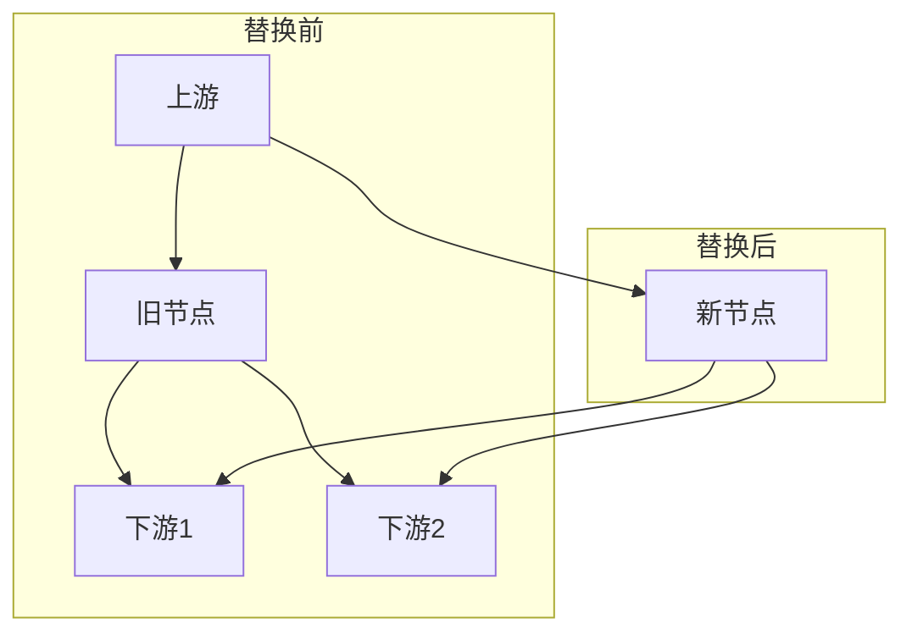
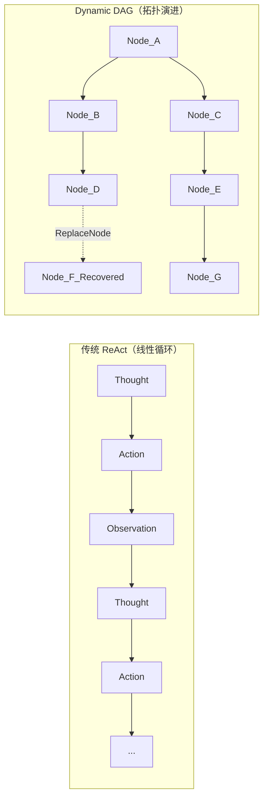
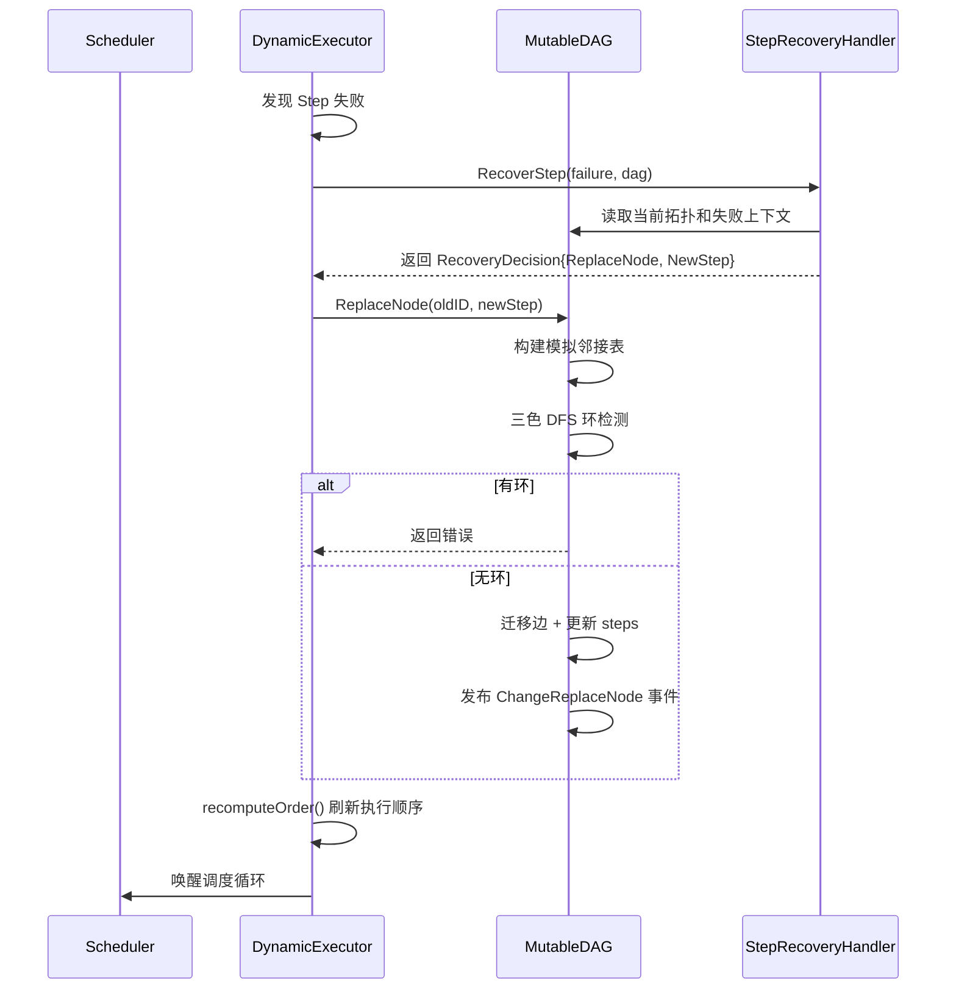
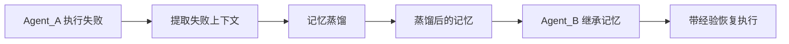
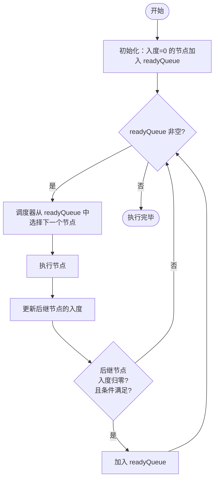

# GoAgentX 架构深度解析（四）：工作流引擎 -- GoAgentX 世界的 ReAct，从 DAG 到动态响应式编排

> 最早写工作流的时候，我用的是硬编码——if step1 done then step2, if step2 done then step3……
> 后来需求越来越多、逻辑越来越绕，代码变成了一坨 spaghetti。
> 我当时就一个想法：**工作流不应该写死在代码里。它应该像乐高一样——随时可以拼、可以拆、可以换。**
> 于是就有了两套工作流系统。你没看错，两套。因为我试了第一种发现不够用，又搞了第二种。

## 一、为什么会有两套工作流？

我先交代一下背景。最早我只写了一套——就是那个基于配置文件的 Workflow Engine。想法很简单：用 YAML 定义任务之间的依赖关系，引擎自动拓扑排序、并行执行、重试、超时……听起来很完美对吧？

但用了一段时间发现一个问题：**配置驱动的灵活性不够**。有些场景我需要用代码动态加减节点、根据条件选边、甚至运行时修改拓扑结构。YAML 文件搞不定这些。

所以我写了第二套——Graph System。这次换成 Fluent Builder API，可以在 Go 代码里直接构建工作流图。条件边、可插拔调度器、运行时拓扑变更……都安排上了。

于是现在项目里就有了两套工作流系统：

1. **Workflow Engine** (`internal/workflow/engine/`) —— 配置驱动的 DAG，强类型，热重载，Human-in-the-Loop。适合运维同学用 YAML 定义的工作流。
2. **Graph System** (`internal/workflow/graph/`) —— 代码驱动的图编排，Fluent Builder，条件边，可插拔调度器。适合开发同学在代码里灵活编排。

两套系统并行存在，各自服务不同的用户群体。代码量确实翻了一倍，但避免了"一刀切"抽象带来的折衷。值不值？我觉得值。

## 二、Workflow Engine：配置驱动的 DAG 执行器

### 2.1 核心类型体系

Workflow Engine 的核心类型定义在 `internal/workflow/engine/types.go` 中。整个系统的数据流路径为：

```
配置文件 (YAML/JSON) --> WorkflowLoader --> Workflow + Step --> DAG --> Executor --> WorkflowResult
```

**Workflow 定义：**

```go
type Workflow struct {
    ID          string            `json:"id"`
    Name        string            `json:"name"`
    Version     string            `json:"version"`
    Description string            `json:"description"`
    Steps       []*Step           `json:"steps"`
    Variables   map[string]string `json:"variables,omitempty"`
    Metadata    map[string]string `json:"metadata,omitempty"`
    CreatedAt   time.Time         `json:"created_at"`
    UpdatedAt   time.Time         `json:"updated_at"`
}
```

**Step 定义 -- 工作流的最小执行单元：**

```go
type Step struct {
    ID          string            `json:"id"`
    Name        string            `json:"name"`
    AgentType   string            `json:"agent_type"`
    Input       string            `json:"input"`
    DependsOn   []string          `json:"depends_on"`
    Timeout     time.Duration     `json:"timeout"`
    RetryPolicy *RetryPolicy      `json:"retry_policy,omitempty"`
    Interrupt   *InterruptConfig  `json:"interrupt,omitempty"`
    Status      StepStatus        `json:"status"`
    Output      string            `json:"output,omitempty"`
    Error       string            `json:"error,omitempty"`
    StartedAt   time.Time         `json:"started_at,omitempty"`
    FinishedAt  time.Time         `json:"finished_at,omitempty"`
    Metadata    map[string]string `json:"metadata,omitempty"`
}
```

每个 Step 包含五个关键维度：
- **依赖关系** (`DependsOn`)：声明式地表达前置步骤
- **重试策略** (`RetryPolicy`)：指数退避重试
- **人为干预** (`Interrupt`)：HITL 支持
- **超时控制** (`Timeout`)：单步超时保护
- **模板变量** (`Input`)：通过 `{{.input}}` 和 `{{.step_id}}` 引用上游输出

**DAG 数据结构：**

```go
type DAG struct {
    Nodes map[string]*DAGNode
    Edges map[string][]string
}

type DAGNode struct {
    StepID    string
    InDegree  int
    OutDegree int
}
```

DAG 的构建函数 `NewDAG()` 执行三项关键校验：
1. **重复 ID 检测**（H4 fix）：防止静默覆盖
2. **依赖有效性校验**：所有 `DependsOn` 引用的 Step 必须存在
3. **循环检测**：使用 DFS 递归栈算法

```go
func NewDAG(steps []*Step) (*DAG, error) {
    dag := &DAG{
        Nodes: make(map[string]*DAGNode),
        Edges: make(map[string][]string),
    }
    for _, step := range steps {
        if _, exists := dag.Nodes[step.ID]; exists {
            return nil, fmt.Errorf("duplicate step ID %q: %w", step.ID, ErrDuplicateID)
        }
        // ... 构建节点和边
    }
    if dag.hasCycle() {
        return nil, ErrCycleDetected
    }
    return dag, nil
}
```

拓扑排序使用经典的 Kahn 算法（BFS 入度法）：

```go
func (d *DAG) GetExecutionOrder() ([]string, error) {
    inDegree := make(map[string]int)
    for node := range d.Nodes {
        inDegree[node] = d.Nodes[node].InDegree
    }
    queue := make([]string, 0)
    for node, degree := range inDegree {
        if degree == 0 {
            queue = append(queue, node)
        }
    }
    // ... BFS 遍历
    if len(result) != len(d.Nodes) {
        return nil, ErrCycleDetected
    }
    return result, nil
}
```

### 2.2 Executor：并发执行的调度核心

Executor 的实现位于 `internal/workflow/engine/executor.go`，是整个引擎最复杂的部分。其并发模型可以概括为：

```
拓扑排序结果 --> 信号量限并发 --> errgroup 管理协程 --> stepDone 通道防死锁
```

**Executor 结构：**

```go
type Executor struct {
    registry    *AgentRegistry
    maxParallel int
    stepTimeout time.Duration
    hitlHandler InterruptHandler
    hitlStore   InterruptStore
}
```

**核心执行流程：**

`runSteps()` 方法维护一个 `stepIndex` 指针遍历拓扑排序结果，对每个 Step 执行以下逻辑：

1. **依赖检查**：调用 `canExecute()` 检查所有前置 Step 是否已完成
2. **死锁检测**：如果依赖未满足但 Step 已处理过，启动 5 秒定时器；超时时报告死锁
3. **信号量获取**：通过 `sem <- struct{}{}` 限制并发数
4. **Panic 保护**：defer 中 recover panic 并在 `wg.Done()` 之前发送结果（C6 fix）
5. **结果收集**：主协程通过 `resultChan` 收集结果，遇到失败立即终止

这里有一个精妙的设计细节：**`stepDone` 通道**（H3 fix）。原始实现使用 `wg.Wait()` 等待所有协程完成，但 `wg.Wait()` 会阻塞直到所有协程结束，导致调度循环无法及时响应。改用带缓冲的 `stepDone` 通道后，每个协程完成时发送信号，调度循环立即重新检查依赖：

```go
// H3 fix: 使用 stepDone 通道替代 wg.Wait()
stepDone := make(chan struct{}, 1)

// 依赖不满足时的等待逻辑
select {
case <-stepDone:
    // 某个协程完成了，重新检查依赖
    continue
case <-deadlockTimer.C:
    // 超时：报告死锁
    errChan <- fmt.Errorf("workflow deadlock detected: step %s...", stepID)
    return
}
```

**模板变量解析：**

`resolveInput()` 方法实现了两层变量替换：
- `{{.input}}` 替换为工作流的初始输入
- `{{.step_id}}` 替换为特定 Step 的完整输出

```go
func (e *Executor) replaceTemplateVariables(input, initialInput string, completed map[string]bool, outputStore *OutputStore) string {
    result := input
    result = strings.ReplaceAll(result, "{{.input}}", initialInput)
    for stepID := range completed {
        if output, exists := outputStore.Get(stepID); exists {
            replacements[fmt.Sprintf("{{.%s}}", stepID)] = output.Output
        }
    }
    // ... 应用替换
}
```

### 2.3 重试策略：指数退避

`executeWithRetry()` 实现了带指数退避的重试逻辑。关键细节：`MaxAttempts` 最小值为 1（M5 fix），防止配置为 0 时跳过执行：

```go
func (e *Executor) executeWithRetry(ctx context.Context, step *Step, input string) (string, error) {
    maxAttempts := 1
    initialDelay := time.Second
    if step.RetryPolicy != nil {
        maxAttempts = step.RetryPolicy.MaxAttempts
        initialDelay = step.RetryPolicy.InitialDelay
    }
    if maxAttempts < 1 {  // M5 fix
        maxAttempts = 1
    }
    // ... 重试循环
    if step.RetryPolicy != nil {
        delay = time.Duration(float64(delay) * step.RetryPolicy.BackoffMultiplier)
        if delay > step.RetryPolicy.MaxDelay {
            delay = step.RetryPolicy.MaxDelay
        }
    }
}
```

**默认常量**（`internal/workflow/engine/constants.go`）：

```go
const (
    DefaultMaxParallel       = 10
    DefaultStepTimeout       = 10 * time.Second
    DefaultInitialDelay      = 10 * time.Millisecond
    DefaultMaxDelay          = 100 * time.Millisecond
    DefaultRetryAttempts     = 3
    DefaultWorkflowTimeout   = 5 * time.Minute
    DefaultMaxWorkflowSize   = 100
    DefaultMaxDependencies   = 10
)
```

## 三、Human-in-the-Loop (HITL)：人为干预机制

HITL 是 Workflow Engine 区别于 Graph System 的核心特性之一。其设计围绕三个抽象展开：

1. **InterruptConfig** -- Step 上的声明式配置，标记需要人为审批
2. **InterruptHandler** -- 阻塞式回调函数，等待人类决策
3. **InterruptStore** -- 持久化中断状态，支持崩溃恢复

实现文件：`internal/workflow/engine/hitl.go`

```go
type InterruptHandler func(ctx context.Context, point *InterruptPoint) (*InterruptResult, error)

type InterruptStore interface {
    Save(ctx context.Context, executionID string, point *InterruptPoint) error
    Load(ctx context.Context, executionID string, stepID string) (*InterruptResult, error)
    Delete(ctx context.Context, executionID string, stepID string) error
    ListPending(ctx context.Context, executionID string) ([]*InterruptPoint, error)
    SaveResult(ctx context.Context, executionID string, stepID string, result *InterruptResult) error
}
```

`MemoryInterruptStore` 是内存实现，使用双层 map（`executionID -> stepID -> point`），并通过 `sync.RWMutex` 保证线程安全。生产环境可以替换为 Redis 或数据库实现。

HITL 集成到执行流程的路径：

```
executeStep()
  --> handleInterrupt()
    --> hitlStore.Save()           // 持久化中断点
    --> hitlHandler(ctx, point)    // 阻塞等待人类决策
    --> hitlStore.Delete()         // 审批通过后清理
```

当人类拒绝时，Step 状态被置为 `StepStatusSkipped`，工作流继续执行剩余步骤，而不是整体失败。

## 四、MutableDAG 与 DynamicExecutor：运行时拓扑变更

这是 Workflow Engine 最强大的能力：**在执行过程中动态修改 DAG 拓扑**。

### 4.1 MutableDAG：线程安全的可变 DAG

实现文件：`internal/workflow/engine/mutable_dag.go`

MutableDAG 通过 `sync.RWMutex` 保护内部 DAG，并提供以下操作：

- `AddNode()` -- 添加节点，自动校验依赖有效性和循环
- `RemoveNode()` -- 删除节点，检查是否有其他节点依赖它
- `ReplaceNode()` -- 替换节点，原子迁移边（见下文详解）
- `AddEdge()` / `RemoveEdge()` -- 添加/删除边，增量循环检测
- `Snapshot()` -- 原子深度拷贝当前拓扑
- `Version()` -- 单调递增的版本计数器，用于检测变更

**增量循环检测**使用 BFS 算法：

```go
func (m *MutableDAG) wouldCreateCycle(from, to string) bool {
    visited := make(map[string]bool)
    queue := []string{to}
    for len(queue) > 0 {
        current := queue[0]
        queue = queue[1:]
        if current == from { return true }
        if visited[current] { continue }
        visited[current] = true
        for _, neighbor := range m.dag.Edges[current] {
            if !visited[neighbor] {
                queue = append(queue, neighbor)
            }
        }
    }
    return false
}
```

**回滚机制**：`AddNode()` 在检测到无效依赖或循环时，会回滚所有已添加的边和节点：

```go
delete(m.dag.Nodes, step.ID)
for _, e := range addedEdges {
    m.removeEdgeFromSlice(e.from, e.to)
    m.dag.Nodes[e.from].OutDegree--
    m.dag.Nodes[e.to].InDegree--
}
```

### 4.2 ReplaceNode：原子的边迁移

`ReplaceNode` 是 MutableDAG 最复杂的操作。它不是简单的"删旧加新"，而需要在保持 DAG 完整性和拓扑合法性的前提下，迁移旧节点的所有入边和出边到新节点。



核心处理两种场景：

**场景一：相同 ID（原地替换）**——新节点使用和旧节点相同的 ID。这意味着所有边不需要迁移，因为边关联的是 ID，而不是对象引用。只需更新 `steps` map 中的 Step 指针。

**场景二：不同 ID（边迁移）**——新节点 ID 不同，需要：
1. 收集旧节点的所有入边（`GetInboundEdges`）和出边（`GetChildren`）
2. 为每个入边调用 `AddEdge(from, newID)`，为每个出边调用 `AddEdge(newID, to)`
3. 调用 `RemoveNode(oldID)` 删除旧节点

**模拟环检测**：在真实修改之前，构建一个**模拟邻接表**，在新图上运行 DFS 环检测。只有模拟通过后才会执行实际修改：

```go
func (m *MutableDAG) hasCycleInAdjList(adjList map[string][]string) bool {
    const (
        white = 0 // 未访问
        gray  = 1 // 正在访问（在当前递归栈中）
        black = 2 // 已完成
    )
    color := make(map[string]int)
    for node := range adjList { color[node] = white }

    var dfs func(node string) bool
    dfs = func(node string) bool {
        color[node] = gray
        for _, neighbor := range adjList[node] {
            switch color[neighbor] {
            case gray: return true       // 反向边 → 有环
            case white:
                if dfs(neighbor) { return true }
            }
        }
        color[node] = black
        return false
    }

    for node := range adjList {
        if color[node] == white && dfs(node) { return true }
    }
    return false
}
```

模拟完成后，`recalculateDegrees` 重新计算所有节点的入度和出度，确保拓扑排序的度信息与新的图结构一致。替换操作会触发一个 `ChangeReplaceNode` 类型的 `GraphEvent`，供事件订阅者（如流式 API）感知拓扑变更。

### 4.3 GraphEventHub：变更事件的发布-订阅

`GraphEventHub` 实现了中介者模式，提供 DAG 变更的 pub/sub 机制。每个订阅者获得一个带缓冲（64 事件）的 channel，非阻塞发布：

```go
type GraphEventHub struct {
    mu          sync.RWMutex
    subscribers map[string]chan GraphEvent
    nextID      int
}

func (h *GraphEventHub) Publish(event GraphEvent) {
    h.mu.RLock()
    defer h.mu.RUnlock()
    for _, ch := range h.subscribers {
        select {
        case ch <- event:
        default:  // 缓冲区满时丢弃
        }
    }
}
```

这一机制被 API 层的流式执行（`ExecuteStream`）利用：通过订阅 MutableDAG 的变更事件，将 Step 状态实时推送给客户端。

### 4.4 DynamicExecutor：两种应用模式

实现文件：`internal/workflow/engine/dynamic_executor.go`

DynamicExecutor 提供两种变更生效模式：

- **`ApplyAtCheckpoint`**：每个 Step 完成后重新计算执行顺序
- **`ApplyImmediate`**：每个 Step 启动前重新计算执行顺序

```go
type ApplyMode int
const (
    ApplyAtCheckpoint ApplyMode = iota
    ApplyImmediate
)
```

**`recomputeOrder()`** 方法负责对比版本号并重新计算执行顺序。注意，它不再是简单的"追加新 Step"，而是**直接替换整个顺序**——因为 Recovery 场景下新节点可能依赖旧拓扑中不存在的依赖关系，追加无法保证拓扑合法性：

```go
func (e *DynamicExecutor) recomputeOrder(
    mutableDAG *MutableDAG, lastVersion *uint64,
    currentOrder *[]string, completed, processed map[string]bool,
    mu *sync.Mutex,
) {
    mu.Lock()
    defer mu.Unlock()
    currentVersion := mutableDAG.Version()
    if *lastVersion == currentVersion { return }
    newOrder, err := mutableDAG.GetExecutionOrder()
    // ...
    *lastVersion = currentVersion
    *currentOrder = newOrder  // 直接替换，而非追加
}
```

M9 fix 确保了 `recomputeOrder` 的原子性：在 mutex 保护下完成版本检查和更新，防止并发调用重复追加。

### 4.5 Step 结果收集的挑战

DynamicExecutor 的结果收集比 Executor 复杂得多，因为 DAG 可以在执行过程中扩展，导致预期的结果数量动态变化：

```go
for {
    mu.Lock()
    expectedResults := len(*currentOrder)
    mu.Unlock()
    if collected >= expectedResults {
        select {
        case result, ok := <-resultChan:
            // 处理结果
        default:
            mu.Lock()
            newExpected := len(*currentOrder)
            mu.Unlock()
            if collected >= newExpected { break }
            continue  // DAG 扩展了，继续收集
        }
    }
    // ... 主 select 循环
}
```

当 Step 在 DAG 中不存在时（H2 fix），发送 `StepStatusSkipped` 的哨兵结果防止收集循环挂起：

```go
if step == nil {
    mu.Lock()
    processed[stepID] = true
    mu.Unlock()
    resultChan <- &StepResult{StepID: stepID, Status: StepStatusSkipped}
    stepIndex++
    continue
}
```

## 五、节点级故障自愈：从 ReAct 到动态演进的 Runtime

> 传统的 ReAct 是微观的、线性的。模型"思考"然后"行动"，再思考再行动——一个死循环走到黑。
> 在 GoAgentX 里，我们不写死循环。我们为智能体提供可以自由演进的 DAG 运行时。
> 如果你的 Agent 挂了，Runtime 能够带着刚才的认知记忆，在图上稳住肉身。

### 5.1 从 ReAct 的死循环到 Dynamic DAG

如果你用过 LangChain 时代的 Agent，ReAct 的典型模式是这样的：

```
Thought → Action → Observation → Thought → Action → ...
```

一个 while 循环，每次迭代输出一段字符串，要么是 Thought，要么是 Action。Agent 的状态？靠堆 prompt 实现。Agent 挂了？重启从头来过。你要在中途插入一个人工审批？不好意思，不支持。

这就是传统 ReAct 的三条死穴：

1. **脆弱单线**：一条路径走到黑，一个环节出错就全盘重来
2. **僵化拓扑**：每一步的"下一步"是在 LlM 输出里自描述的，框架无法感知和控制
3. **无状态恢复**：没有事件溯源，没有 checkpoint，挂了就是真挂了

GoAgentX 的选择是：**把 ReAct 的微观循环升级为宏观的、动态演进的分布式 Runtime**。

模型不再通过字符串来约定"下一步做什么"，而是通过 MutableDAG 来直接操作 DAG 拓扑。Thought 和 Action 不再是 while 循环里的字符串，而是 Dynamic DAG 上的 Node 和 Edge。



这个转变带来的直接好处：
- **拓扑可见**：DAG 的结构就是 Agent 的逻辑，可观察、可审计
- **动态干预**：可以在执行中插入节点、替换节点、甚至挂载 Recovery
- **事件溯源**：每一次拓扑变更都是 Event Sourcing 的记录，可以重放和审计

### 5.2 节点级故障抽象

有了 MutableDAG 的动态替换能力，就可以设计一套节点级的故障恢复机制：

```go
type RecoveryStrategy string

const (
    RecoveryRetry       RecoveryStrategy = "retry"
    RecoveryReplaceNode RecoveryStrategy = "replace_node"
    RecoveryFailFast    RecoveryStrategy = "fail_fast"
)

type RecoveryPolicy struct {
    Strategy         RecoveryStrategy
    MaxAttempts      int
    ReplacementAgent string
}

type StepFailure struct {
    ExecutionID string
    WorkflowID  string
    StepID      string
    Error       string
    Input       string
}

type RecoveryDecision struct {
    Strategy RecoveryStrategy
    NewStep  *Step
}

type StepRecoveryHandler interface {
    RecoverStep(ctx context.Context, failure StepFailure, dag *MutableDAG) (*RecoveryDecision, error)
}
```

三种策略的含义：

| 策略 | 行为 | 典型场景 |
|------|------|----------|
| `RecoveryRetry` | 重试原 Step（全量） | 临时性故障（超时、限流） |
| `RecoveryReplaceNode` | 用新 Step 替换失败的节点 | 逻辑性故障（换模型、换工具） |
| `RecoveryFailFast` | 不恢复，让工作流失败 | 不可恢复的错误（认证失败、参数错误） |

`StepRecoveryHandler` 是恢复决策的入口。它接收失败上下文和 MutableDAG 引用，返回一个恢复决策。典型的实现可以是 LLM 决策：用 Agent 来分析失败原因，判断是重试还是换方案。

### 5.3 RecoveryReplaceNode 的流程

当 `recoveryHandler.RecoverStep` 返回 `RecoveryReplaceNode` 策略时，DynamicExecutor 执行以下流程：



关键实现细节：

**handleStepFailure** 是 DynamicExecutor 的方法。当收集到 `StepStatusFailed` 结果时，它检查 Step 是否配置了 `RecoveryPolicy`。如果有，调用 `recoveryHandler.RecoverStep`。如果返回 `RecoveryReplaceNode`，调用 `mutableDAG.ReplaceNode` 执行替换。

替换成功后，调用 `recomputeOrder()` —— 注意这里不再是前文描述的"追加"，而是**直接替换整个执行顺序**。这是因为新节点可能位于旧顺序中不存在的拓扑位置，追加语义无法保证新节点出现在正确的位置。

**recoveryCh 信号量**：替换完成后，通过 `recoveryCh` 唤醒调度器主循环。调度器检测到新节点后，重置 `stepIndex = 0` 并重新派发。已经执行完成的 Step 通过 `processed` map 跳过，最多支持 5 轮恢复（防止无限循环）。

### 5.4 记忆蒸馏融合："秽土转生"

RecoveryReplaceNode 最强大的场景是在节点替换时结合记忆蒸馏（Memory Distillation）。

传统的 ReAct 里，Agent 挂了就是挂了——上下文丢失，记忆清零。但在 GoAgentX 中，当故障触发 RecoveryReplaceNode 时：

1. 原节点的执行结果和失败上下文被封装为 `StepFailure`
2. `StepRecoveryHandler` 可以读取原节点的 Input、Output 和 Error
3. 新节点可以继承原节点的执行轨迹，**把失败经验提炼为记忆**

这就像《火影忍者》里的"秽土转生"——Agent 虽然挂了，但它的记忆被蒸馏提炼，注入到新的节点里，让它带着经验从头再来：



具体来说，`StepRecoveryHandler` 的实现可以：

- 将原节点的执行记录写入 Memory 系统
- 调用 `DistillationService` 将失败经验提炼为结构化的记忆
- 在新节点的 Step 配置中挂载这些记忆
- 让新节点复用原节点的部分输出，减少重复计算

这种"失败即经验"的设计，使得每一次故障都不是白费的——它们成为 DAG 不断迭代自己的养料。

## 六、热重载系统：FileWatcher 与 WorkflowReloader

热重载是 Workflow Engine 的另一个关键特性，实现在 `internal/workflow/engine/reloader.go` 中。

### 6.1 FileWatcher：双模式文件监控

FileWatcher 采用 **优雅降级** 策略：

1. 优先使用 `fsnotify` 的事件驱动模式（实时性高）
2. 如果 fsnotify 不可用，回退到轮询模式（5 秒间隔）

```go
func NewFileWatcher(loader WorkflowLoader, workflows map[string]*Workflow) *FileWatcher {
    watcher, err := fsnotify.NewWatcher()
    if err != nil {
        slog.Warn("FileWatcher: fsnotify not available, falling back to polling", "error", err)
    }
    // ...
}
```

fsnotify 模式下，会递归监控子目录（`watchDirectory()`），只处理 `Write` 和 `Create` 事件，并过滤非工作流文件。

### 6.2 线程安全的原子重载

`scanAndLoad()` 方法实现了 M6 fix：在整个比较-交换周期持有锁，防止 TOCTOU 竞争：

```go
func (w *FileWatcher) scanAndLoad(ctx context.Context, dir string) error {
    // 先在外面做 I/O（慢操作）
    loaded := make(map[string]loadedEntry)
    for _, entry := range entries { /* 加载文件 */ }
    // 然后在锁内做比较-交换
    w.mu.Lock()
    modified := false
    for id, le := range loaded {
        oldWF, exists := w.workflows[id]
        if !exists || le.modTime.After(oldWF.UpdatedAt) {
            modified = true
            break
        }
    }
    if modified {
        newWorkflows := make(map[string]*Workflow, len(loaded))
        for id, le := range loaded { newWorkflows[id] = le.workflow }
        w.workflows = newWorkflows
    }
    w.mu.Unlock()
    if modified { w.notifyCallbacks() }
    return nil
}
```

**M7 fix** 确保回调函数接收的是 workflows 的深度拷贝，防止回调修改共享状态：

```go
func (w *FileWatcher) notifyCallbacks() {
    w.mu.RLock()
    workflowsCopy := make(map[string]*Workflow, len(w.workflows))
    for k, v := range w.workflows { workflowsCopy[k] = v }
    callbacks := w.callbacks
    w.mu.RUnlock()
    for _, cb := range callbacks { cb.fn(workflowsCopy) }
}
```

### 6.3 WorkflowReloader：高层次管理

WorkflowReloader 封装了 FileLoader、DirectoryLoader 和 FileWatcher，提供统一的生命周期管理：

```
StartWatching()
  --> DirectoryLoader.LoadAll()    // 初始加载
  --> FileWatcher.Watch()          // 启动监控
        --> fsnotify/polling loop  // 监控变更
        --> onReload()             // 重载回调
              --> notifyCallbacks() // 通知订阅者
```

## 七、Graph System：轻量级 Fluent Builder 图编排

与 Workflow Engine 的配置驱动不同，Graph System 提供了 **程序化定义工作流** 的能力，采用 Fluent Builder 模式。

### 7.1 核心抽象

**Node 接口：**

```go
type Node interface {
    Execute(ctx context.Context, state *State) error
    ID() string
}
```

三种内置节点类型：
- `AgentNode` -- 包装 Agent
- `ToolNode` -- 包装 Tool
- `FuncNode` -- 包装任意函数

**Graph 定义：**

```go
type Graph struct {
    id        string
    nodes     map[string]Node
    edges     map[string][]*Edge
    start     string
    scheduler Scheduler
    tracer    observability.Tracer
    limiter   ratelimit.Limiter
}
```

**Fluent Builder 链式调用：**

```go
graph := NewGraph("my-workflow").
    Node("fetch", fetchNode).
    Node("analyze", analyzeNode).
    Node("report", reportNode).
    Edge("fetch", "analyze").
    Edge("analyze", "report", IfFunc(func(state *State) bool {
        result, _ := state.Get("analyze")
        return result != nil
    })).
    Start("fetch").
    SetScheduler(NewPriorityScheduler(priorities))
```

### 7.2 条件边

Edge 可以挂载条件函数（`Condition`），只有条件满足时才会触发下游节点执行：

```go
type Edge struct {
    from string
    to   string
    cond Condition
}

type Condition func(state *State) bool
```

**C7 fix** 修复了条件边的关键问题：当节点的入度降为 0 时，不仅要检查入度，还要检查是否至少有一条入边条件被满足：

```go
if inDegree[edge.to] == 0 && !executed[edge.to] && !readySet[edge.to] {
    if hasAnySatisfiedEdge(g, edge.to, state) {
        readyQueue = append(readyQueue, edge.to)
        readySet[edge.to] = true
    }
}
```

`hasAnySatisfiedEdge` 确保：
- **非条件边**：始终满足条件
- **全条件边但不满足**：节点被跳过（防止幽灵执行）
- **多条入边中至少一条满足**：节点被调度（防止静默丢失）

```go
func hasAnySatisfiedEdge(g *Graph, targetID string, state *State) bool {
    for _, edges := range g.edges {
        for _, edge := range edges {
            if edge.to == targetID {
                if edge.cond == nil || edge.cond(state) {
                    return true
                }
            }
        }
    }
    return false
}
```

### 7.3 可插拔调度器

Graph System 定义了清晰的 `Scheduler` 接口，提供三种实现：

| 调度器 | 策略 | 适用场景 |
|--------|------|----------|
| `DefaultScheduler` | FIFO（先进先出） | 默认，与 Workflow Engine 一致 |
| `PriorityScheduler` | 优先级最高优先 | 需要区分任务重要性 |
| `ShortJobScheduler` | 最短预估耗时优先 | 希望快速反馈的场景 |

```go
type Scheduler interface {
    Select(ready []string) string
}
```

**重要设计约束**：调度器是单线程执行的（在 BFS 主循环中），因此无需考虑并发安全。

### 7.4 BFS 执行器

执行器采用广度优先遍历，维护入度计数和 ready 队列：



State 是 lock-free 的（`internal/workflow/graph/state.go`），因为整个图执行默认是单线程的：

```go
type State struct {
    values map[string]any
}
```

### 7.5 Panic-on-Invalid 哲学

Graph System 的 Fluent Builder 方法采用了激进的 **启动时校验** 策略：违反前置条件的调用会直接 panic。

```go
func NewGraph(id string) *Graph {
    if id == "" {
        panic("graph ID cannot be empty: empty id is a programming error")
    }
    // ...
}

func (g *Graph) Edge(from, to string, cond ...Condition) *Graph {
    if _, ok := g.nodes[from]; !ok {
        panic(fmt.Sprintf("from node %q not found: node must be added via Node() before Edge()", from))
    }
    // ...
}
```

这与其他 Go 项目常见的返回 error 模式不同。设计者的考虑是：这些调用发生在应用启动阶段，参数错误是编程错误，应该立即暴露而非在运行时静默失败。

## 八、Service API 层：统一入口

API 层位于 `api/service/workflow/service.go`，提供了 Workflow Engine 的完整 API，包括：

- `RegisterWorkflow()` -- 注册工作流定义
- `Execute()` -- 同步执行
- `ExecuteStream()` -- 流式执行（通过 GraphEventHub 订阅）
- `ListWorkflows()` -- 列出已注册工作流
- `GetWorkflow()` -- 获取单个工作流定义

流式执行通过 errgroup 管理两个并发协程：

```go
g.Go(func() error {
    // 协程 1: 执行工作流
    r, e := executor.ExecuteDynamic(gctx, wf, req.Input, mutableDAG)
    resultCh <- execResult{result: r, err: e}
    return nil
})

g.Go(func() error {
    // 协程 2: 转发 graph 事件为 step 事件
    for ev := range graphEvents {
        events <- core.WorkflowEvent{
            Type:       core.WorkflowEventStepStarted,
            WorkflowID: req.WorkflowID,
            StepID:     ev.Change.NodeID,
            StepName:   ev.Change.Step.Name,
            Status:     core.WorkflowStatusRunning,
            Timestamp:  ev.Change.Timestamp,
        }
    }
    return nil
})
```

## 九、两套系统的对比与取舍

| 维度 | Workflow Engine | Graph System |
|------|----------------|-------------|
| **定义方式** | YAML/JSON 配置文件 | Fluent Builder API |
| **核心抽象** | Step + DAG | Node (interface) + Edge |
| **执行模型** | 拓扑排序 + 信号量并发 | BFS 单线程 + 可插拔调度器 |
| **并发** | errgroup + WaitGroup + semaphore | 单线程 |
| **HITL** | 原生支持 (InterruptConfig + InterruptStore) | 不支持 |
| **重试** | RetryPolicy (指数退避) | 不支持（需自行包装） |
| **热重载** | FileWatcher + WorkflowReloader | 不支持 |
| **恢复** | RecoveryReplaceNode + StepRecoveryHandler + 记忆蒸馏融合 | 不支持 |
| **动态拓扑** | MutableDAG + DynamicExecutor（含 ReplaceNode） | 不支持 |
| **条件边** | 不支持（依赖关系是静态的） | Condition 函数 |
| **可观测性** | 仅日志 | Tracer 接口 |
| **运行时状态** | OutputStore (线程安全 map) | State (lock-free map) |
| **适用场景** | 生产级、配置驱动的多步工作流 | 轻量级、程序化的 Agent 链 |

**设计哲学差异**：

Workflow Engine 选择了 **重量级、功能丰富** 的路线，适合需要热更新、人为审批、节点级恢复的生产环境。它的配置驱动特性使得非开发人员也能定义工作流。Step 之间通过 `DependsOn` 建立静态依赖，模板变量 `{{.input}}` 和 `{{.step_id}}` 提供了有限但清晰的变量传递机制。`ReplaceNode` 机制和 `RecoveryReplaceNode` 故障自愈能力，使得工作流在运行中也能动态调整拓扑并恢复失败节点——这是 LangChain 时代 ReAct 循环无法触及的能力。

Graph System 选择了 **轻量级、可扩展** 的路线，适合在代码中动态编排 Agent 调用。它的 Fluent Builder 模式让代码阅读者一目了然，条件边机制提供了更灵活的流程控制。Node 通过 `State` 共享运行时数据，这是一种隐式的数据流，比 Workflow Engine 的模板变量更灵活但更难追踪。

## 十、说实话环节——跳出既定范式的代价与收益

这篇文章写到这里，我想抛开技术细节，聊聊几个我一直纠结的设计选择。不是教你怎么做——坦白说，我自己都没把握做对了。纯粹是分享一些思考过程，希望能给同样在搭工作流系统的你提供一点参考。

如果你有不同看法，欢迎来讨论。我很好奇其他人是怎么处理这些问题的。

### 10.1 一套工作流引擎还是两套

先说一个让我头疼了很久的问题。

我一开始想做一个通用工作流引擎，一个方案解决所有问题。但做着做着就发现，工作流的使用方式根本没法统一——有人想写几行 YAML 就搞定一个流程，有人在代码里需要精确控制每一步。用同一套抽象去满足这两种用法，结果两边都不讨好。

所以我拆成了两套：一个是配置驱动的 Workflow Engine，一个是代码驱动的 Graph System。前者写 YAML/JSON，后者用 Fluent Builder。

但我毕竟一个人，两套代码都要写、两套文档都要维护。有时候我会想：如果当初只选一条路，会不会省下一半的功夫？这个问题的答案我到现在也没完全想通。

### 10.2 拓扑能不能在执行中改变

传统工作流的拓扑是定义时定死的。这很省心——定义即执行计划，不会出现运行时意外。

但在 Agent 场景下我遇到了一个问题：工作流的下一步是由模型输出决定的，而模型输出在写代码时根本不知道。用静态拓扑的话，我只有一个选择——把所有可能路径全画出来。结果就是一个巨大的状态机，画完比写代码还累。

所以我做了一个叫 MutableDAG 的东西——允许拓扑在执行过程中发生变化。新增节点、替换节点、挂载恢复逻辑，都不需要停工作流。

这么做带来了一堆麻烦。不能再假设 DAG 构造之后就不变了——每个操作都要加并发安全、环检测、版本锁。ReplaceNode 里的三色 DFS 在教科书上很漂亮，但实践中它会忽略一个问题：如果你的业务逻辑漏了一条边，纯图算法救不了你。它是一个可靠的底层原语，但不是万能药。

回过头想，我可能是在用一个复杂的技术方案来解决一个本可以用更好的抽象层解决的问题。如果你有更优雅的方式在动态场景下管理执行路径，我很想听听。

### 10.3 工作流失败了，一定要全部重试吗

大多数工作流系统的做法是：失败了就全部重试。最多加指数退避、调调重试次数。

我不太接受这个方案。一个 LLM 调用返回了格式错误的 JSON，为什么要回滚整个 Workflow？换一个模型重新跑这个节点不就够了吗？

这个想法其实不是来自工作流领域——我是从操作系统学的。微内核里一个服务挂了，重启那个服务就够了，不需要重启整个内核。那 Agent 系统里为什么不行？

所以我实现了节点级 RecoveryReplaceNode：只替换失败的那个节点，其他节点的执行结果保留。更进一步，我还尝试把失败节点的上下文蒸馏成经验，注入到替代节点里。

但说实话，这个功能目前的成熟度让我不太放心。它需要完整的执行上下文追踪——哪个节点跑了、输出了什么、依赖了谁。恢复策略引擎还是 v0.1，5 轮上限基本是拍脑袋定的。蒸馏管线更是粗糙：把错误塞进 EventSink，然后祈祷蒸馏服务能抽出有用的东西。方向我认同，工程还在路上。

### 10.4 Human-in-the-Loop 应该怎么等人

人机交互在大多数系统里的实现方式是：停下工作流，等人，再继续。人是一个同步阻塞环节。

我一直在想：能不能换个角度，把 HITL 当作工作流图上的一个普通节点？它只是暂停执行、等待异步事件、然后恢复下游。不阻塞调度器，不占用 goroutine，不消耗资源。

这样做的优点是天然支持"先做别的事，等人工回来再续上"。缺点是目前没有审批链、没有超时自动降级、没有多人协作决策——这些都是生产级 HITL 的基本能力，我还没做。MVP 级，不是谦虚。

这个取舍我目前是接受的，因为它至少让 HITL 不成为系统的瓶颈。但如果你的场景需要复杂的审批流程，这个方案大概率不够用。

### 10.5 配置更新一定要重启进程吗

改配置 -> 重启进程，这是最常规的做法。简单，可靠，但服务会断。

我选择了运行时热重载——文件变化后原子替换全量 Workflow map，不重启进程，不丢请求。实现不算复杂：fsnotify 监听 + 锁内 compare-and-swap + 深度拷贝回调。

真正让我意外的是跨平台问题。inotify（Linux）和 kqueue（macOS）行为差异很大，macOS 上有些文件事件根本收不到。最后不得不做了轮询兜底（5 秒间隔），保证可用性，但在某些场景下太慢了。

这个问题让我反思：为了"不重启"这个目标，我增加了多少复杂度？如果业务场景接受秒级的停机，重启方案可能更划算。这个选择不是技术问题，是 SLA 要求的问题。

---

## 十一、结语

上面这些设计，每一个都有它的代价。把代价写出来不是为了证明选对了——只是想把这些真实的权衡过程记录下来。

说到底就是两套工作流系统，一倍的代码量。说实话数量不算多，但每一条路都是被实际需求逼出来的——Workflow Engine 的配置驱动是给"不想写代码的人"准备的，Graph System 的 Fluent Builder 是给"想写代码的人"用的。两套都做了，就不用吵了。

最让我满意的不是功能数量，是并发模型和热重载。errgroup + WaitGroup + semaphore + stepDone 通道这一套组合拳，配合双模式文件监控和原子替换，是我花了最多心思调出来的。虽然中间踩过go并发上的坑，这些坑——但每次修完都更确定一件事：**Go 的并发，设计之初就要想清楚，不能靠后期 Debug 打补丁。**

当然也有很多不完美的地方。熔断和重试的配置不够灵活，Graph System 的调度器只实现了拓扑序和并发两种，Event Trigger 还没有真正落地到生产……但这些都在 TODO 里躺着了，等用户来催的时候再修吧。开源就是这样——你永远不知道用户会怎么用你的系统，等他们发现少了什么，自然会来提 issue。😄

---

下一篇聊 **运行时与生命周期**——Agent 会死吗？会。LLM 超时会死、内存溢出会死、panic 会死、宿主重启也会死。但有没有一种机制，能让 Agent 死后带着记忆复活？下一篇聊聊 Runtime 的"秽土转生"机制。
