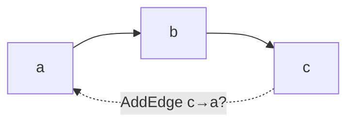
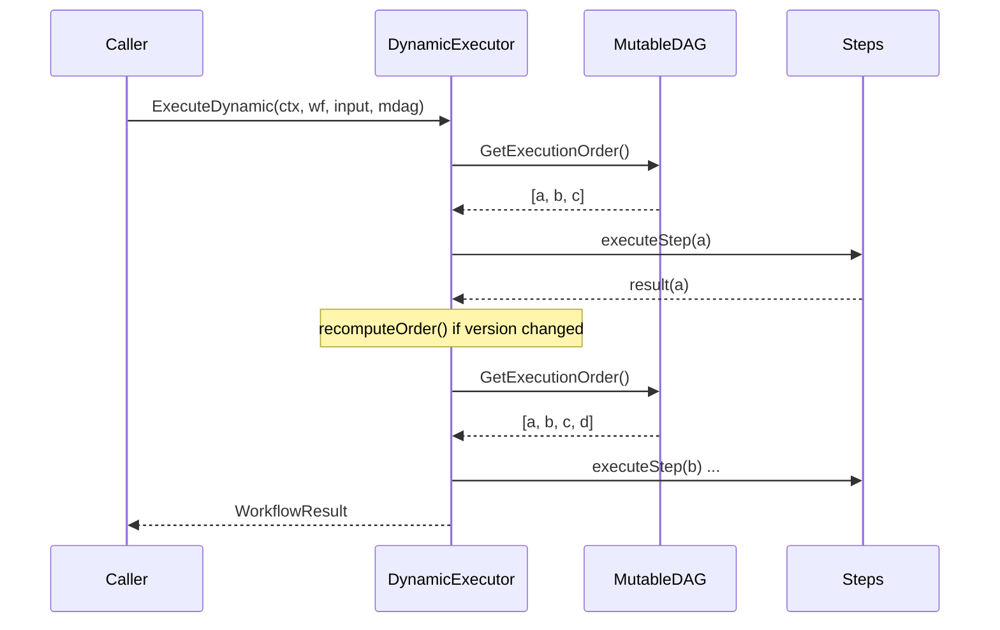

# Workflow Engine Design Document

## 1. Overview

The Workflow Engine handles loading and executing user-defined workflows, implementing DAG-based task orchestration. Users define workflows through YAML/JSON files, and the engine automatically parses dependencies and executes tasks.

## 2. Workflow Definition

### 2.1 Basic Structure

```yaml
# workflow.yaml
id: "workflow-001"
name: "Fashion Recommendation Flow"
version: "1.0.0"
description: "Default fashion recommendation workflow"

variables:
  api_key: "${API_KEY}"

steps:
  - id: leader
    name: "Leader Agent"
    agent_type: "leader"
    input: "{{.input}}"
    
  - id: agent_top
    name: "Top Recommendation"
    agent_type: "sub"
    input: "{{.input}}"
    depends_on: [leader]
    timeout: 60s
    retry_policy:
      max_attempts: 3
      initial_delay: 1s
      max_delay: 10s
      backoff_multiplier: 2.0
      
  - id: agent_bottom
    name: "Bottom Recommendation"
    agent_type: "sub"
    input: "{{.input}}"
    depends_on: [leader]
    
  - id: agent_shoes
    name: "Shoes Recommendation"
    agent_type: "sub"
    input: "{{.agent_top}} + {{.input}}"
    depends_on: [leader, agent_top]
```

### 2.2 Field Description

| Field | Required | Description |
|-------|----------|-------------|
| id | Yes | Workflow unique ID |
| name | Yes | Workflow name |
| version | No | Version number |
| description | No | Description |
| steps | Yes | Step list |
| variables | No | Variable mappings |
| metadata | No | Metadata |

### 2.3 Step Fields

| Field | Required | Description |
|-------|----------|-------------|
| id | Yes | Step unique ID |
| name | No | Step name |
| agent_type | Yes | Agent type |
| input | No | Input template |
| depends_on | No | Dependent step IDs |
| timeout | No | Timeout duration |
| retry_policy | No | Retry policy |

## 3. Core Types

```go
type Workflow struct {
    ID, Name, Version, Description string
    Steps     []*Step
    Variables map[string]string
    Metadata  map[string]string
}

type Step struct {
    ID, Name, AgentType, Input string
    DependsOn   []string
    Timeout     time.Duration
    RetryPolicy *RetryPolicy
}

type RetryPolicy struct {
    MaxAttempts                        int
    InitialDelay, MaxDelay             time.Duration
    BackoffMultiplier                  float64
}
```

## 4. DAG Execution

### 4.1 Automatic Topological Sort

The engine automatically analyzes `depends_on` dependencies, builds a DAG, and executes topological sort.

```
Dependency Graph:
  leader ──┬── agent_top ── agent_shoes
           │
           └── agent_bottom

Execution Order: leader → [agent_top, agent_bottom] → agent_shoes
```

### 4.2 Parallel Execution

Steps without dependencies or with completed dependencies can execute in parallel:

```go
// Max parallel control
maxParallel := 4
```

## 5. Core Modules

### 5.1 Loader

```go
type WorkflowLoader interface {
    Load(ctx context.Context, source string) (*Workflow, error)
}
func NewJSONFileLoader() *FileLoader   // JSON
func NewYAMLFileLoader() *FileLoader   // YAML

type DirectoryLoader struct{ ... }
func (l *DirectoryLoader) LoadAll(ctx context.Context, dir string) (map[string]*Workflow, error)
```

### 5.2 Executor

```go
type Executor struct {
    registry    *AgentRegistry
    outputStore *OutputStore
    maxParallel int
    stepTimeout time.Duration
}
func NewExecutor(registry *AgentRegistry) *Executor
func (e *Executor) Execute(ctx context.Context, workflow *Workflow, initialInput string) (*WorkflowResult, error)

type WorkflowResult struct {
    ExecutionID, WorkflowID string
    Status   WorkflowStatus
    Output   map[string]interface{}
    Error    string
    Duration time.Duration
    Steps    []*StepResult
}
```

### 5.3 AgentRegistry and OutputStore

```go
type AgentRegistry struct{ ... }
func (r *AgentRegistry) Register(agentType string, factory AgentFactory) error
func (r *AgentRegistry) CreateAgent(ctx context.Context, agentType string, config interface{}) (base.Agent, error)

type OutputStore struct{ ... }
func (s *OutputStore) Set(stepID string, output *StepOutput)
func (s *OutputStore) Get(stepID string) (*StepOutput, bool)
```

## 6. Template Variables

Step Input supports template variables:

| Variable | Description |
|----------|-------------|
| `{{.input}}` | Initial input |
| `{{.step_id}}` | Output of specified step |

```yaml
steps:
  - id: summary
    agent_type: "sub"
    input: "Based on {{.agent_top}} and {{.agent_bottom}} summarize"
    depends_on: [agent_top, agent_bottom]
```

## 7. Hot Reload

```go
// HotReloader hot reloads workflows
type HotReloader struct {
    watcher    *fsnotify.Watcher
    registry   *AgentRegistry
    workflows  map[string]*Workflow
    onChange   func(workflow *Workflow)
}

func NewHotReloader(registry *AgentRegistry) *HotReloader
func (r *HotReloader) AddWorkflow(path string) error
func (r *HotReloader) Start(ctx context.Context) error
func (r *HotReloader) Stop() error
```

## 8. Execution Status

```go
// WorkflowStatus workflow status
const (
    WorkflowStatusPending   WorkflowStatus = "pending"
    WorkflowStatusRunning   WorkflowStatus = "running"
    WorkflowStatusCompleted WorkflowStatus = "completed"
    WorkflowStatusFailed    WorkflowStatus = "failed"
    WorkflowStatusCancelled WorkflowStatus = "cancelled"
)

// StepStatus step status
const (
    StepStatusPending   StepStatus = "pending"
    StepStatusRunning   StepStatus = "running"
    StepStatusCompleted StepStatus = "completed"
    StepStatusFailed    StepStatus = "failed"
    StepStatusSkipped   StepStatus = "skipped"
)
```

## 9. Usage Example

```go
// Create Registry and register Agents
registry := engine.NewAgentRegistry()
registry.Register("leader", func(ctx context.Context, cfg interface{}) (base.Agent, error) {
    return leader.New(...), nil
})
registry.Register("sub", func(ctx context.Context, cfg interface{}) (base.Agent, error) {
    return sub.New(...), nil
})

// Create Executor
executor := engine.NewExecutor(registry)

// Load workflow
loader := engine.NewYAMLFileLoader()
workflow, err := loader.Load(ctx, "workflows/default.yaml")

// Execute
result, err := executor.Execute(ctx, workflow, "User input")
```

## 10. MutableDAG -- Runtime Graph Mutation (v2)

`MutableDAG` wraps the static `DAG` with thread-safe mutation operations. All mutations are guarded by `sync.RWMutex`, validated for cycles via incremental BFS, and emit events through `GraphEventHub`.

### 10.1 Construction and Mutation API

```go
steps := []*engine.Step{
    {ID: "a", AgentType: "sub", Input: "start"},
    {ID: "b", AgentType: "sub", Input: "{{.a}}", DependsOn: []string{"a"}},
}
mdag, err := engine.NewMutableDAG(steps)

// Add a node -- validates dependencies, checks cycles, rolls back on failure.
err := mdag.AddNode(ctx, &engine.Step{ID: "c", AgentType: "sub", DependsOn: []string{"b"}})
// Remove a node -- fails if other nodes depend on it.
err := mdag.RemoveNode(ctx, "c")
// Add/remove directed edges with incremental BFS cycle check.
err := mdag.AddEdge(ctx, "a", "b")
err := mdag.RemoveEdge(ctx, "a", "b")
// Read operations (all under RLock).
order, _ := mdag.GetExecutionOrder() // topological sort
snap := mdag.Snapshot()              // deep copy
ver := mdag.Version()                // mutation counter
```

### 10.2 Sentinel Errors

| Error | Condition |
|-------|-----------|
| `ErrNodeNotFound` | Node ID does not exist |
| `ErrNodeHasDependents` | Cannot remove a node that others depend on |
| `ErrDuplicateEdge` | Edge already exists |
| `ErrEdgeNotFound` | Edge does not exist |
| `ErrCycleDetected` | Mutation would create a cycle |
| `ErrInvalidDependency` | Dependency references a non-existent node |

### 10.3 Cycle Detection

BFS from the target node following outgoing edges. If the source node is reachable, the edge would create a cycle.



BFS from `a` visits `b` then `c` -- `c` is reachable, so `AddEdge(ctx, "c", "a")` returns `ErrCycleDetected`.

## 11. DynamicExecutor -- Mid-Execution Graph Changes (v2)

`DynamicExecutor` extends `Executor` to support mutations while a workflow is running. It tracks DAG version and recomputes execution order when the graph changes.

### 11.1 Apply Modes

| Mode | When Order Recomputes | Use Case |
|------|-----------------------|----------|
| `ApplyAtCheckpoint` | After each step completes | Lower overhead, batch-friendly |
| `ApplyImmediate` | Before each step starts | Responsive to external mutations |

### 11.2 Usage and Execution Flow

```go
dyn := engine.NewDynamicExecutor(registry, engine.ApplyAtCheckpoint,
    engine.WithMaxParallel(4), engine.WithStepTimeout(2*time.Minute))
mdag, _ := engine.NewMutableDAG(steps)
result, err := dyn.ExecuteDynamic(ctx, workflow, "input", mdag)
```



The executor snapshots `mutableDAG.Version()` before execution and checks at each checkpoint. When the version changes, `recomputeOrder()` fetches the new topological order and appends newly added steps. Removed steps are skipped.

## 12. GraphEventHub -- Pub/Sub for Mutations (v2)

`GraphEventHub` provides non-blocking pub/sub for graph change events. Each subscriber gets a buffered channel (capacity 64). Publish drops events when the buffer is full.

```go
// Event types: ChangeAddNode, ChangeRemoveNode, ChangeAddEdge, ChangeRemoveEdge
// GraphChange carries Type, NodeID, FromID, ToID, Step, Timestamp
// GraphEvent wraps GraphChange with Success bool and Error

// Subscribe directly from MutableDAG:
ch := mdag.Subscribe()
go func() {
    for event := range ch {
        log.Printf("mutation: type=%d node=%s ok=%v",
            event.Change.Type, event.Change.NodeID, event.Success)
    }
}()
```

Every `AddNode`, `RemoveNode`, `AddEdge`, and `RemoveEdge` publishes a `GraphEvent` through the hub.

## 13. Performance Benchmarks (v2)

All MutableDAG core operations complete in under 1 microsecond (Go 1.22, Apple M2, 100-node DAG, 300 edges).

| Operation | ns/op | Allocs |
|-----------|-------|--------|
| `AddNode` | ~450 | 3 |
| `RemoveNode` | ~380 | 2 |
| `AddEdge` | ~320 | 2 |
| `RemoveEdge` | ~280 | 1 |
| `GetExecutionOrder` | ~850 | 4 |
| `Snapshot` | ~920 | 6 |
| `wouldCreateCycle` BFS | ~150 | 1 |
| `GraphEventHub.Publish` (4 subs) | ~200 | 0 |

Key design choices: `sync.RWMutex` for non-blocking reads, incremental BFS (target-node only), non-blocking publish with buffer drop, value-copy `Snapshot()`.
