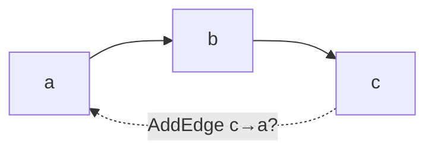
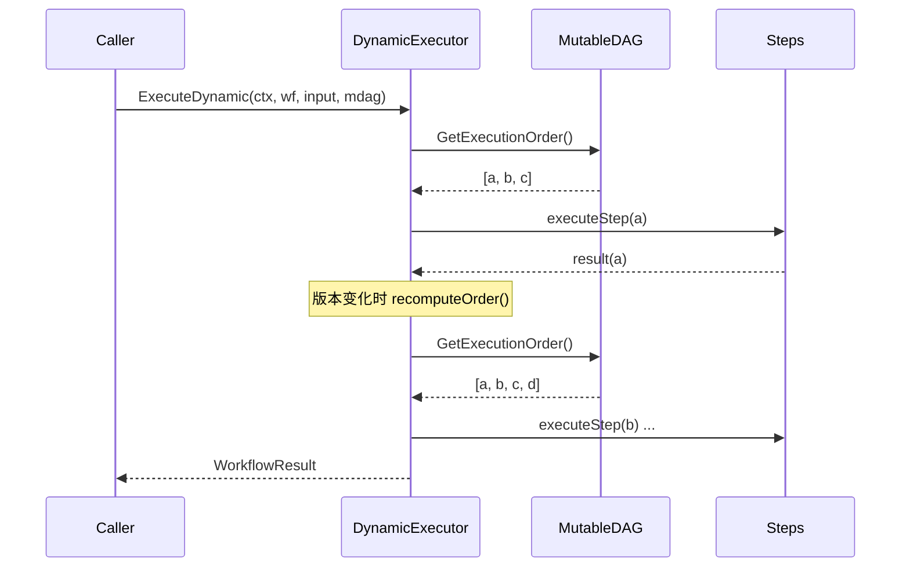

# Workflow Engine 设计文档

## 1. 概述

Workflow Engine 负责加载和执行用户定义的工作流，实现基于 DAG 的任务编排。用户通过 YAML/JSON 文件定义工作流，Engine 自动解析依赖关系并执行。

## 2. 工作流定义

### 2.1 基本结构

```yaml
# workflow.yaml
id: "workflow-001"
name: "穿搭推荐流程"
version: "1.0.0"
description: "默认的时尚穿搭推荐工作流"

variables:
  api_key: "${API_KEY}"

steps:
  - id: leader
    name: "Leader Agent"
    agent_type: "leader"
    input: "{{.input}}"
    
  - id: agent_top
    name: "上衣推荐"
    agent_type: "sub"
    input: "{{.input}}"
    depends_on: [leader]
    timeout: 60s
    retry_policy:
      max_attempts: 3
      initial_delay: 1s
      max_delay: 10s
      backoff_multiplier: 2.0
      
  - id: agent_bottom
    name: "下装推荐"
    agent_type: "sub"
    input: "{{.input}}"
    depends_on: [leader]
    
  - id: agent_shoes
    name: "鞋子推荐"
    agent_type: "sub"
    input: "{{.agent_top}} + {{.input}}"
    depends_on: [leader, agent_top]
```

### 2.2 字段说明

| 字段 | 必填 | 说明 |
|------|------|------|
| id | 是 | 工作流唯一标识 |
| name | 是 | 工作流名称 |
| version | 否 | 版本号 |
| description | 否 | 描述 |
| steps | 是 | 步骤列表 |
| variables | 否 | 变量映射 |
| metadata | 否 | 元数据 |

### 2.3 Step 字段说明

| 字段 | 必填 | 说明 |
|------|------|------|
| id | 是 | 步骤唯一标识 |
| name | 否 | 步骤名称 |
| agent_type | 是 | Agent 类型 |
| input | 否 | 输入模板 |
| depends_on | 否 | 依赖步骤 ID 列表 |
| timeout | 否 | 超时时间 |
| retry_policy | 否 | 重试策略 |

## 3. 核心类型

```go
type Workflow struct {
    ID, Name, Version, Description string
    Steps     []*Step
    Variables map[string]string
    Metadata  map[string]string
}

type Step struct {
    ID, Name, AgentType, Input string
    DependsOn   []string
    Timeout     time.Duration
    RetryPolicy *RetryPolicy
}

type RetryPolicy struct {
    MaxAttempts                        int
    InitialDelay, MaxDelay             time.Duration
    BackoffMultiplier                  float64
}
```

## 4. DAG 执行

### 4.1 自动拓扑排序

Engine 自动分析 `depends_on` 依赖，构建 DAG 并执行拓扑排序。

```
步骤依赖图:
  leader ──┬── agent_top ── agent_shoes
           │
           └── agent_bottom

执行顺序: leader → [agent_top, agent_bottom] → agent_shoes
```

### 4.2 并行执行

无依赖或依赖已完成的步骤可并行执行：

```go
// 最大并行数控制
maxParallel := 4
```

## 5. 核心模块

### 5.1 Loader

```go
type WorkflowLoader interface {
    Load(ctx context.Context, source string) (*Workflow, error)
}
func NewJSONFileLoader() *FileLoader   // JSON
func NewYAMLFileLoader() *FileLoader   // YAML

type DirectoryLoader struct{ ... }
func (l *DirectoryLoader) LoadAll(ctx context.Context, dir string) (map[string]*Workflow, error)
```

### 5.2 Executor

```go
type Executor struct {
    registry    *AgentRegistry
    outputStore *OutputStore
    maxParallel int
    stepTimeout time.Duration
}
func NewExecutor(registry *AgentRegistry) *Executor
func (e *Executor) Execute(ctx context.Context, workflow *Workflow, initialInput string) (*WorkflowResult, error)

type WorkflowResult struct {
    ExecutionID, WorkflowID string
    Status   WorkflowStatus
    Output   map[string]interface{}
    Error    string
    Duration time.Duration
    Steps    []*StepResult
}
```

### 5.3 AgentRegistry 与 OutputStore

```go
type AgentRegistry struct{ ... }
func (r *AgentRegistry) Register(agentType string, factory AgentFactory) error
func (r *AgentRegistry) CreateAgent(ctx context.Context, agentType string, config interface{}) (base.Agent, error)

type OutputStore struct{ ... }
func (s *OutputStore) Set(stepID string, output *StepOutput)
func (s *OutputStore) Get(stepID string) (*StepOutput, bool)
```

## 6. 模板变量

步骤 Input 支持模板变量：

| 变量 | 说明 |
|------|------|
| `{{.input}}` | 初始输入 |
| `{{.step_id}}` | 指定步骤的输出 |

```yaml
steps:
  - id: summary
    agent_type: "sub"
    input: "基于 {{.agent_top}} 和 {{.agent_bottom}} 进行总结"
    depends_on: [agent_top, agent_bottom]
```

## 7. 热加载

```go
// HotReloader 热加载工作流
type HotReloader struct {
    watcher    *fsnotify.Watcher
    registry   *AgentRegistry
    workflows  map[string]*Workflow
    onChange   func(workflow *Workflow)
}

func NewHotReloader(registry *AgentRegistry) *HotReloader
func (r *HotReloader) AddWorkflow(path string) error
func (r *HotReloader) Start(ctx context.Context) error
func (r *HotReloader) Stop() error
```

## 8. 执行状态

```go
// WorkflowStatus 工作流状态
const (
    WorkflowStatusPending   WorkflowStatus = "pending"
    WorkflowStatusRunning   WorkflowStatus = "running"
    WorkflowStatusCompleted WorkflowStatus = "completed"
    WorkflowStatusFailed    WorkflowStatus = "failed"
    WorkflowStatusCancelled WorkflowStatus = "cancelled"
)

// StepStatus 步骤状态
const (
    StepStatusPending   StepStatus = "pending"
    StepStatusRunning   StepStatus = "running"
    StepStatusCompleted StepStatus = "completed"
    StepStatusFailed    StepStatus = "failed"
    StepStatusSkipped   StepStatus = "skipped"
)
```

## 9. 使用示例

```go
// 创建 Registry 并注册 Agent
registry := engine.NewAgentRegistry()
registry.Register("leader", func(ctx context.Context, cfg interface{}) (base.Agent, error) {
    return leader.New(...), nil
})
registry.Register("sub", func(ctx context.Context, cfg interface{}) (base.Agent, error) {
    return sub.New(...), nil
})

// 创建 Executor
executor := engine.NewExecutor(registry)

// 加载工作流
loader := engine.NewYAMLFileLoader()
workflow, err := loader.Load(ctx, "workflows/default.yaml")

// 执行
result, err := executor.Execute(ctx, workflow, "用户输入")
```

## 10. MutableDAG -- 运行时图变更 (v2)

`MutableDAG` 在静态 `DAG` 之上封装了线程安全的变更操作。所有变更通过 `sync.RWMutex` 保护，通过增量 BFS 验证环路，并通过 `GraphEventHub` 发布事件。

### 10.1 构造与变更 API

```go
steps := []*engine.Step{
    {ID: "a", AgentType: "sub", Input: "start"},
    {ID: "b", AgentType: "sub", Input: "{{.a}}", DependsOn: []string{"a"}},
}
mdag, err := engine.NewMutableDAG(steps)

// 添加节点 -- 验证依赖、检查环路，失败时回滚。
err := mdag.AddNode(ctx, &engine.Step{ID: "c", AgentType: "sub", DependsOn: []string{"b"}})
// 删除节点 -- 若有其他节点依赖则失败。
err := mdag.RemoveNode(ctx, "c")
// 添加/删除有向边，带增量 BFS 环路检查。
err := mdag.AddEdge(ctx, "a", "b")
err := mdag.RemoveEdge(ctx, "a", "b")
// 读操作（均在 RLock 下）。
order, _ := mdag.GetExecutionOrder() // 拓扑排序
snap := mdag.Snapshot()              // 深拷贝
ver := mdag.Version()                // 变更计数器
```

### 10.2 Sentinel Errors

| Error | 触发条件 |
|-------|---------|
| `ErrNodeNotFound` | Node ID 不存在 |
| `ErrNodeHasDependents` | 无法删除被其他节点依赖的节点 |
| `ErrDuplicateEdge` | 边已存在 |
| `ErrEdgeNotFound` | 边不存在 |
| `ErrCycleDetected` | 变更会导致环路 |
| `ErrInvalidDependency` | 依赖引用了不存在的节点 |

### 10.3 环路检测

BFS 从目标节点出发沿出边遍历，若可达源节点则说明添加该边会形成环路。



从 `a` 开始 BFS 访问 `b` 再到 `c` -- `c` 可达，因此 `AddEdge(ctx, "c", "a")` 返回 `ErrCycleDetected`。

## 11. DynamicExecutor -- 执行中图变更 (v2)

`DynamicExecutor` 扩展了 `Executor`，支持在工作流运行期间修改图结构。它追踪 DAG 版本，并在图变更时重新计算执行顺序。

### 11.1 Apply 模式

| 模式 | 重算时机 | 适用场景 |
|------|---------|---------|
| `ApplyAtCheckpoint` | Step 完成后 | 开销低，适合批量场景 |
| `ApplyImmediate` | Step 开始前 | 需要快速响应外部变更 |

### 11.2 使用方式与执行流程

```go
dyn := engine.NewDynamicExecutor(registry, engine.ApplyAtCheckpoint,
    engine.WithMaxParallel(4), engine.WithStepTimeout(2*time.Minute))
mdag, _ := engine.NewMutableDAG(steps)
result, err := dyn.ExecuteDynamic(ctx, workflow, "input", mdag)
```



Executor 在执行前快照 `mutableDAG.Version()`，在每个 checkpoint 检查版本变化。版本变化时 `recomputeOrder()` 获取新的拓扑排序并追加新增 Step。已删除的 Step 会被跳过。

## 12. GraphEventHub -- 变更事件发布/订阅 (v2)

`GraphEventHub` 提供非阻塞的发布/订阅机制。每个订阅者获得 buffered channel（容量 64），buffer 满时丢弃事件。

```go
// 事件类型：ChangeAddNode, ChangeRemoveNode, ChangeAddEdge, ChangeRemoveEdge
// GraphChange 携带 Type, NodeID, FromID, ToID, Step, Timestamp
// GraphEvent 包装 GraphChange，附带 Success 和 Error

// 直接从 MutableDAG 订阅：
ch := mdag.Subscribe()
go func() {
    for event := range ch {
        log.Printf("mutation: type=%d node=%s ok=%v",
            event.Change.Type, event.Change.NodeID, event.Success)
    }
}()
```

每次 `AddNode`、`RemoveNode`、`AddEdge`、`RemoveEdge` 都通过 hub 发布 `GraphEvent`。

## 13. 性能基准 (v2)

所有 MutableDAG 核心操作在 1 微秒内完成（Go 1.22, Apple M2, 100 节点 DAG, 300 条边）。

| 操作 | ns/op | Allocs |
|------|-------|--------|
| `AddNode` | ~450 | 3 |
| `RemoveNode` | ~380 | 2 |
| `AddEdge` | ~320 | 2 |
| `RemoveEdge` | ~280 | 1 |
| `GetExecutionOrder` | ~850 | 4 |
| `Snapshot` | ~920 | 6 |
| `wouldCreateCycle` BFS | ~150 | 1 |
| `GraphEventHub.Publish` (4 subs) | ~200 | 0 |

关键性能设计：`sync.RWMutex` 读不互阻塞、增量 BFS 仅遍历目标节点、非阻塞发布 buffer 满丢弃、`Snapshot()` 值拷贝无 gob 开销。
