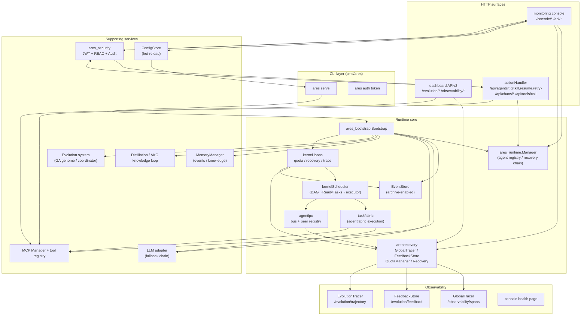
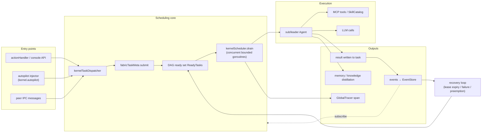
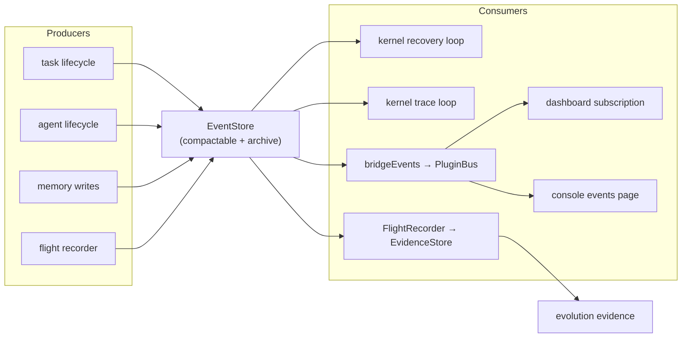
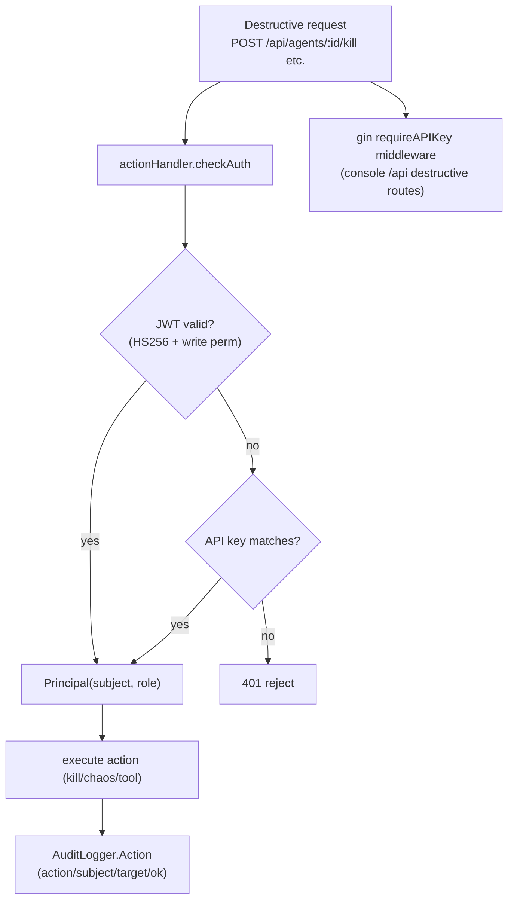
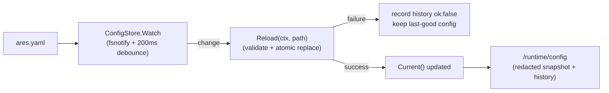

# ARES Runtime Architecture & Data Flows (v0.3.0)

> This document is generated from a 2026-08-19 code walkthrough and reflects
> the **actual component topology** of `ares serve` (not a vision doc). See also
> `ares-runtime.md` (design) and `docs/operator/README.en.md` (runbook).

---

## 1. Overall Architecture

---

## 2. Task Execution Pipeline (Data Flow)

---

## 3. Event Flow

---

## 4. Auth & Audit Flow

---

## 5. Config Hot-Reload Flow (P1, snapshot-level)

---

## 6. Component Responsibilities

| Component | Responsibility | Key dependencies |
|---|---|---|
| `ares_bootstrap` | Assembles all infrastructure (EventStore/Runtime/Memory/MCP/LLM/evolution/distillation) | cfg, EventStore |
| `ares_runtime.Manager` | Agent register/start/stop/recovery chain (lease/requeue) | EventStore, factories |
| `kernelTaskDispatcher` + `kernelScheduler` | Task submit → DAG ready → concurrent drain execution | EventStore, fabric |
| `taskfabric` | Task execution orchestration (preemption/retry/checkpoint) | agentfabric |
| `aresrecovery` | GlobalTracer / FeedbackStore / QuotaManager / recovery | EventStore |
| `agentipc` | Peer message bus (json+gzip evolution policy) | peer registry |
| `ares_security` | JWT(RBAC) + modular audit | stdlib, gin |
| `ares_config.ConfigStore` | Config snapshot + fsnotify hot-reload | fsnotify |
| `monitoring` | Console HTTP (health/actions/config/observability) | plugin, runtime, security |
| `dashboard` | APIv2 (evolution/observability WebSocket hub) | MCP, aresrecovery |

---

## 7. Mapping to the AgentOS Plan

| Plan item | Architecture element | Status |
|---|---|---|
| M1 Multi-agent collaboration | **Scheduler model (OS-thread semantics)**: shared ReadyTasks queue + capability-aware scoring + concurrent drain in `kernelScheduler`; agents are scheduled, not orchestrated, and never self-dispatch (self-dispatch removed in v0.3.0). The `agentipc` collaboration protocols (`DelegateToSpecialist`/`Pipeline`/`Orchestrate`) are wired into the production IPC bridge: `wireEvolutionIPC` dispatches by topic, so `delegate-task`/`pipeline-stage`/`orchestrate-worker` messages reaching a target agent run through its `Execute` capability and reply with the result. | ✅ both scheduler and collaboration protocols wired in prod |
| M2 Resource scheduling/isolation | `EvolutionAwareQuotaManager` + kernel quota loop | ✅ (cgroup deferred) |
| M3 Explainability/feedback | `EvolutionTracer` + `FeedbackStore` + dashboard endpoints | ✅ wired |
| M4 Global observability | `GlobalTracer` + `/observability/spans` + trace loop | ✅ wired |
| M6 Config hot-reload | `ConfigStore` + `/runtime/config` | ✅ (snapshot-level) |
| M7 Security/RBAC | `ares_security` (JWT+RBAC+Audit) | ✅ |
| M8 Versioning | `VERSION` + Makefile injection | ✅ |
| M10 Fault-injection e2e | arena→runtime recovery chain + `agentos_ci.yml` | ✅ (single-process) |
