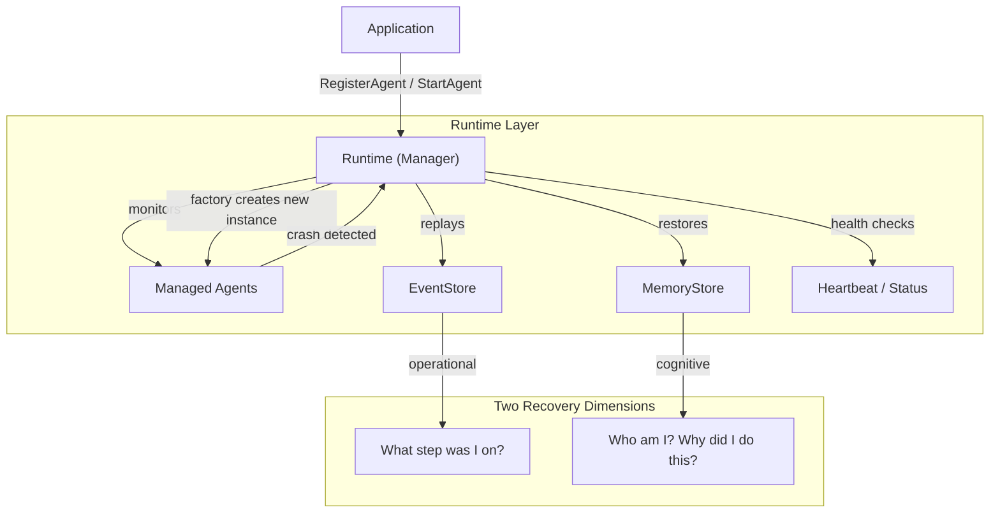
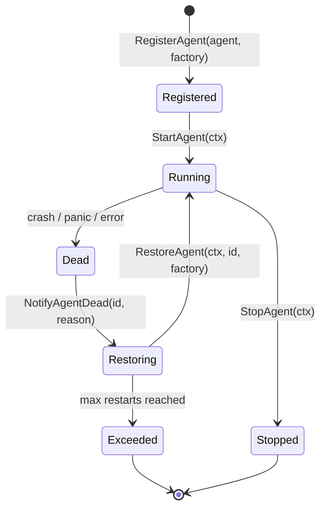
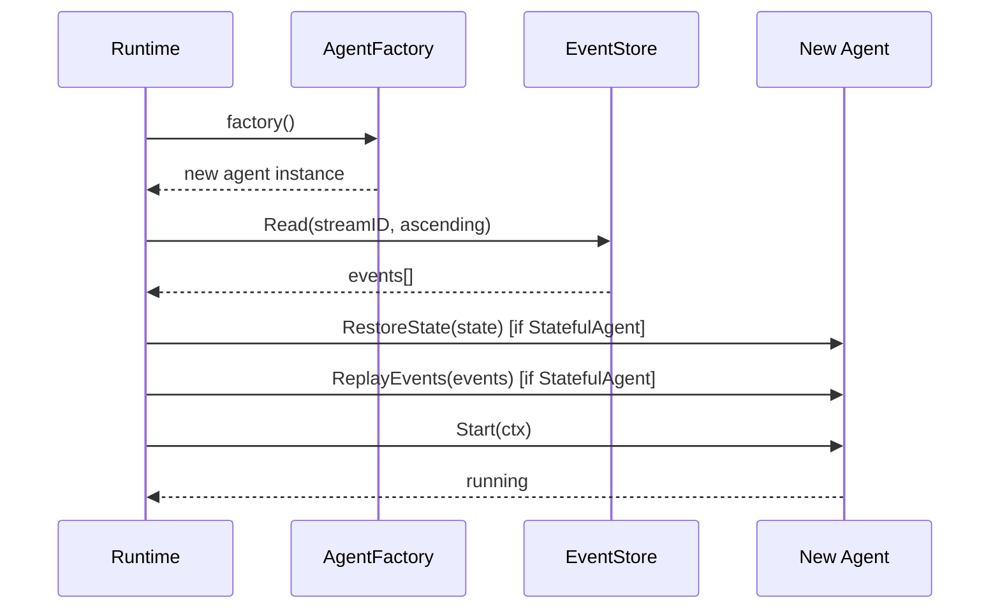

# Runtime Layer

**Updated**: 2026-06-12

## Overview

The Runtime layer manages agent lifecycle. Agents are disposable executors; the Runtime owns their birth, death, and resurrection. When an agent crashes, the Runtime detects the failure, creates a fresh instance from a factory, replays persisted events, restores memory state, and restarts the agent -- all without manual intervention.

This layer sits between the application and individual agents, providing a single point of control for registration, health monitoring, graceful shutdown, and automatic recovery.

## Architecture



## Runtime Interface

The `Runtime` interface defines 9 methods for full agent lifecycle management:

```go
// Runtime manages agent lifecycle. Agents are disposable executors;
// Runtime owns their birth, death, and resurrection.
type Runtime interface {
    // StartAgent launches an agent in a managed goroutine.
    StartAgent(ctx context.Context, agent base.Agent) error

    // StopAgent gracefully stops an agent by ID.
    StopAgent(ctx context.Context, agentID string) error

    // RestartAgent stops and restarts an agent with fresh state.
    RestartAgent(ctx context.Context, agentID string) error

    // RestoreAgent creates a new agent from factory, replays events, and starts it.
    RestoreAgent(ctx context.Context, agentID string, factory AgentFactory) error

    // NotifyAgentDead is called by agents or safety nets when an agent dies.
    // It triggers asynchronous restoration.
    NotifyAgentDead(agentID string, reason string)

    // RegisterAgent registers an agent and its factory for lifecycle management.
    RegisterAgent(agent base.Agent, factory AgentFactory)

    // Start begins the runtime's monitoring loop.
    Start(ctx context.Context) error

    // Stop gracefully shuts down all agents and the runtime.
    Stop() error

    // Stats returns runtime statistics.
    Stats() RuntimeStats
}
```

| Method | Purpose |
|--------|---------|
| `RegisterAgent` | Registers an agent and its factory for later lifecycle management. |
| `StartAgent` | Launches an agent in a managed goroutine with panic recovery. |
| `StopAgent` | Gracefully stops an agent; marks it as intentionally stopped to prevent resurrection. |
| `RestartAgent` | Stops the old agent, creates a fresh instance from factory, and starts it. |
| `RestoreAgent` | Full recovery: factory -> replay events -> restore state -> start. |
| `NotifyAgentDead` | Called when an agent dies; triggers async restoration if a factory is registered. |
| `Start` | Begins the runtime monitoring loop and launches all registered agents. |
| `Stop` | Gracefully shuts down all agents and waits for goroutines to finish. |
| `Stats` | Returns active agent count, total restarts, and uptime. |

## Manager Implementation

`Manager` is the concrete implementation of `Runtime`. It uses `errgroup` for structured concurrency and a `sync.RWMutex` for thread-safe access to agent state.

### Construction

```go
// New creates a new Manager.
func New(config *Config, eventStore events.EventStore, memManager memory.MemoryManager) *Manager
```

| Parameter | Description |
|-----------|-------------|
| `config` | Runtime configuration. Pass `nil` for defaults (`DefaultConfig()`). |
| `eventStore` | Event store for operational recovery. May be `nil`. |
| `memManager` | Memory manager for cognitive recovery. May be `nil`. |

### Internal State

```go
type Manager struct {
    mu            sync.RWMutex
    agents        map[string]*managedAgent   // active agent instances
    factories     map[string]AgentFactory    // factory per agent ID
    eventStore    events.EventStore          // operational recovery
    memManager    memory.MemoryManager       // cognitive recovery
    g             *errgroup.Group            // structured concurrency
    gctx          context.Context            // group context
    cancel        context.CancelFunc
    config        *Config
    totalRestarts int
    startTime     time.Time
    isStarted     bool
    isStopped     bool
}
```

Each managed agent tracks its lifecycle metadata:

```go
type managedAgent struct {
    agent    base.Agent
    factory  AgentFactory
    cancel   context.CancelFunc
    restarts int
    stopped  bool  // prevents resurrection of intentionally stopped agents
}
```

## Agent Lifecycle

The full lifecycle of a managed agent:



### Recovery Flow

When `NotifyAgentDead` is triggered:

1. Check if agent was intentionally stopped (via `StopAgent` or `RestartAgent`). If yes, skip.
2. Check if runtime is stopped. If yes, skip.
3. Check if a factory is registered. If no factory, log warning and skip.
4. Check restart count against `MaxRestartsPerAgent`. If exceeded, log error and skip.
5. Trigger `RestoreAgent` asynchronously via errgroup.

`RestoreAgent` performs the full recovery sequence:

```go
// RestoreAgent recovery flow:
//  1. Create new agent instance from factory.
//  2. Replay events from EventStore for operational recovery.
//  3. RestoreState on the new agent if it implements StatefulAgent.
//  4. Start the new agent.
```



## Two Recovery Dimensions

The Runtime supports two independent recovery dimensions that can be used separately or together.

### Operational Recovery (EventStore)

**Question answered**: "What step was I on?"

The EventStore persists every significant agent action as an immutable event. On recovery, these events are replayed in chronological order to reconstruct the agent's operational state -- which tasks were started, which completed, which failed.

```go
// replayEvents reads all events for the given agent stream from EventStore.
func (m *Manager) replayEvents(ctx context.Context, agentID string) []*events.Event {
    streamID := fmt.Sprintf("agent:%s", agentID)
    evts, err := m.eventStore.Read(ctx, streamID, events.ReadOptions{
        Direction: events.ReadAscending,
    })
    // ...
}
```

Events are read in ascending order and fed to the agent's `ReplayEvents` method if it implements `StatefulAgent`.

### Cognitive Recovery (MemoryStore)

**Question answered**: "Who am I? Why did I do this?"

The MemoryStore preserves the agent's conversational context, task memory, and distilled knowledge. On recovery, this memory is restored so the agent can continue with full awareness of its history.

This dimension is handled by the `MemoryManager` interface, which provides session-level and task-level memory persistence.

### Combined Recovery

When both `EventStore` and `MemoryManager` are provided, the Runtime performs a two-phase recovery:

1. **Phase 1 -- Operational**: Replay events to restore the agent's position in its workflow.
2. **Phase 2 -- Cognitive**: Restore memory so the agent understands context and history.

This ensures the recovered agent is both operationally correct (right step) and cognitively aware (right context).

## Health Monitoring

The Runtime runs a background health check loop at `HealthCheckInterval`:

```go
// healthCheck checks all agents for liveness.
func (m *Manager) healthCheck() {
    // For each non-stopped agent:
    // 1. Prefer Heartbeater.IsAlive() if agent implements Heartbeater
    // 2. Fall back to Status() check (offline/stopping = dead)
    // 3. If dead and factory exists, trigger NotifyAgentDead
}
```

Detection strategies:
- **Heartbeat**: If the agent implements `base.Heartbeater`, the Runtime calls `IsAlive()`.
- **Status**: Falls back to `agent.Status()` checking for `AgentStatusOffline` or `AgentStatusStopping`.
- **Panic recovery**: Every agent goroutine has a `defer recover()` that calls `NotifyAgentDead`.

## Configuration

```go
type Config struct {
    // HealthCheckInterval is the interval between agent liveness checks.
    HealthCheckInterval time.Duration
    // MaxRestartsPerAgent is the maximum number of restarts allowed per agent.
    // A value of 0 means unlimited restarts.
    MaxRestartsPerAgent int
}

func DefaultConfig() *Config {
    return &Config{
        HealthCheckInterval: 10 * time.Second,
        MaxRestartsPerAgent: 10,
    }
}
```

| Field | Default | Description |
|-------|---------|-------------|
| `HealthCheckInterval` | 10s | How often the Runtime checks agent liveness. |
| `MaxRestartsPerAgent` | 10 | Maximum restarts per agent. 0 = unlimited. |

## Integration

### With EventStore

Pass an `events.EventStore` implementation to `New()`. The Runtime reads events from stream `agent:<agentID>` during restoration.

```go
rt := runtime.New(config, eventStore, nil)
```

### With MemoryManager

Pass a `memory.MemoryManager` implementation to `New()`. Agents implementing `StatefulAgent` will have their state restored.

```go
rt := runtime.New(config, eventStore, memManager)
```

### With Existing Agents

Any type implementing `base.Agent` can be managed. For full recovery support, implement `base.StatefulAgent`:

```go
type StatefulAgent interface {
    RestoreState(state map[string]any) error
    ReplayEvents(events []*events.Event) error
    Snapshot() (map[string]any, error)
}
```

### Usage Example

```go
// Create runtime with event store and memory manager.
rt := runtime.New(runtime.DefaultConfig(), eventStore, memManager)

// Register agent with a factory for resurrection.
rt.RegisterAgent(myAgent, func() base.Agent {
    return NewMyAgent(myConfig)
})

// Start the runtime (launches all registered agents).
if err := rt.Start(ctx); err != nil {
    log.Fatal(err)
}

// Graceful shutdown.
defer rt.Stop()

// Check stats.
stats := rt.Stats()
fmt.Printf("Active: %d, Restarts: %d, Uptime: %v\n",
    stats.ActiveAgents, stats.TotalRestarts, stats.Uptime)
```

## Sentinel Errors

| Error | Condition |
|-------|-----------|
| `ErrAgentNotFound` | Requested agent is not registered. |
| `ErrAgentAlreadyRegistered` | Agent with same ID is already running. |
| `ErrRuntimeStopped` | Runtime has been stopped. |
| `ErrMaxRestartsExceeded` | Agent exceeded max restart limit. |
| `ErrNilAgent` | Nil agent passed to StartAgent. |
| `ErrNilFactory` | Nil factory passed to RestoreAgent. |

## Related Documents

- [v2 Architecture](./v2-architecture.md)
- [Event Sourcing](../features/event-sourcing.md)
- [Agent Resurrection](../features/resurrection.md)
- [Agent Definition](../components/agents-definition.md)
