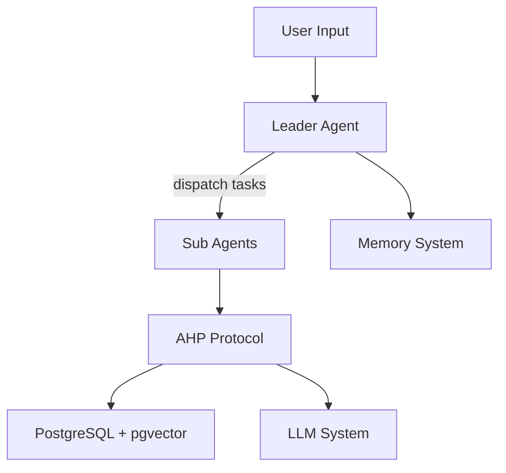
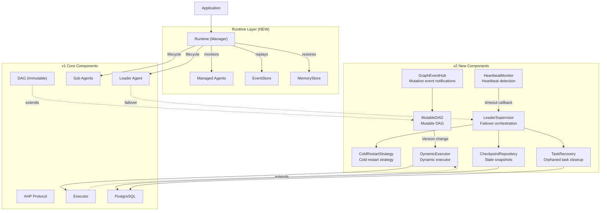
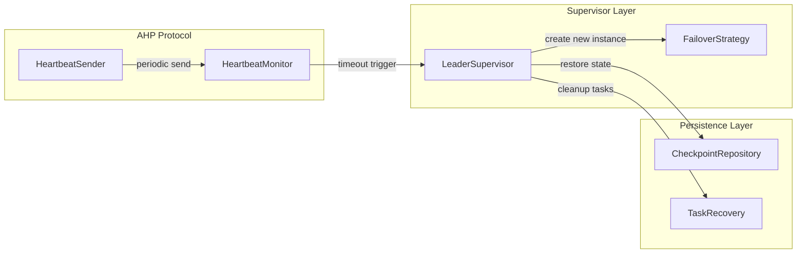
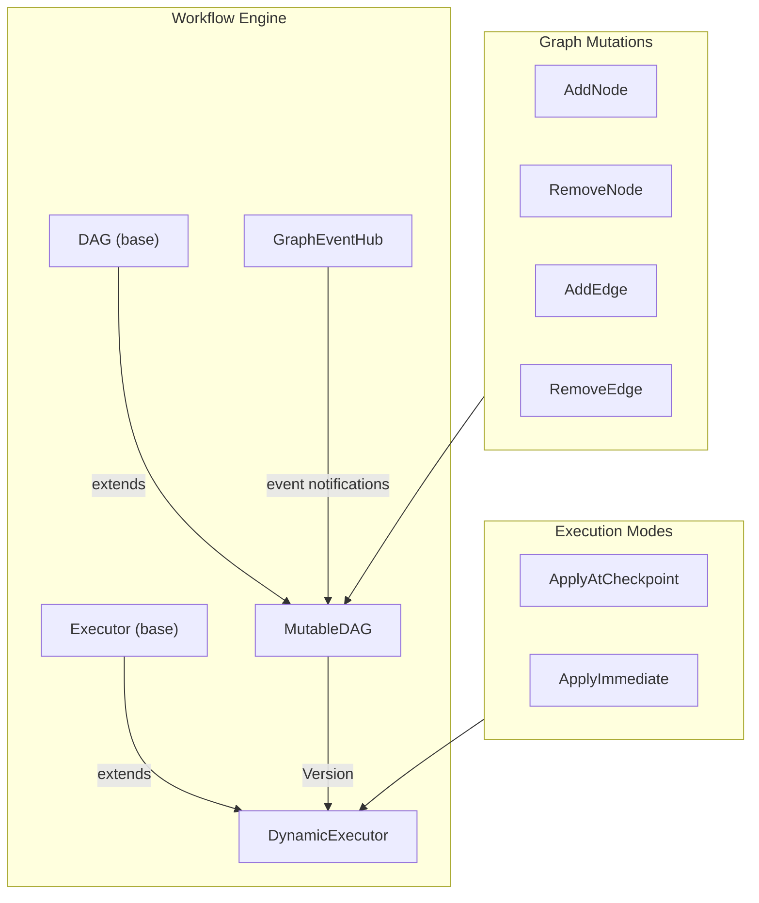
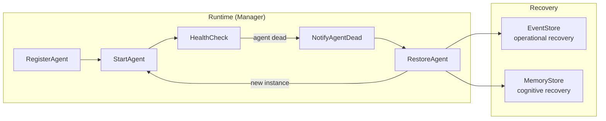
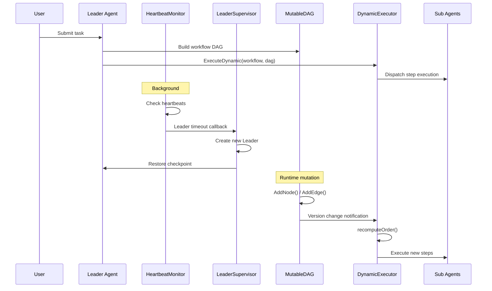

# ARES v2 Architecture

**Updated**: 2026-06-10

## Overview

v2 adds two core capabilities on top of v1:

1. **Leader Failover** - Automatic Leader failure detection and recovery
2. **Runtime Dynamic Graph** - Runtime modification of workflow DAGs

These capabilities enhance system reliability and flexibility.

## v1 Architecture Review

v1 limitations:
- Leader crash = session lost
- DAG immutable after construction
- No automatic failure recovery

## v2 Architecture Extensions

## Leader Failover in the Architecture

Leader Failover inserts monitoring and recovery between the AHP Protocol layer and Leader Agents:

Data flow:
1. `HeartbeatSender` periodically sends heartbeats via AHP message queue
2. `HeartbeatMonitor` detects timeouts and triggers callbacks
3. `LeaderSupervisor` orchestrates failover: stop old instance -> restore checkpoint -> create new instance -> clean orphaned tasks
4. `CheckpointRepository` and `TaskRecovery` persist state via PostgreSQL

## Dynamic Graph in the Architecture

Dynamic Graph extends the Workflow Engine layer:

Data flow:
1. External callers modify graph structure via `MutableDAG` methods
2. Each mutation increments `version` and publishes events via `GraphEventHub`
3. `DynamicExecutor` detects version changes during execution
4. Based on `ApplyMode`, recomputes execution order at checkpoints or immediately
5. Newly added steps are automatically appended to the execution queue

## Runtime Layer

The Runtime layer manages agent lifecycle. Agents are disposable executors; the Runtime owns their birth, death, and resurrection.

Key behaviors:
- **Registration**: Agents are registered with a factory function for resurrection
- **Health monitoring**: Background loop checks agent liveness via heartbeat or status
- **Automatic recovery**: On crash, Runtime creates a new instance, replays events, restores memory, and restarts
- **Two recovery dimensions**: EventStore for operational state ("what step?"), MemoryStore for cognitive state ("who am I?")
- **Graceful shutdown**: Stop cancels all agents and waits for goroutines to finish

See [Runtime Layer Details](./runtime.md) for full documentation.

## Component Interaction

## v1 to v2 Migration

v2 is fully backward compatible with v1. All new components are optional:

| v1 Component | v2 Extension | Required? |
|-------------|-------------|-----------|
| Leader Agent | + LeaderSupervisor | Optional |
| DAG | MutableDAG | Optional |
| Executor | DynamicExecutor | Optional |
| AHP Protocol | + HeartbeatMonitor | Optional |
| (none) | Runtime (Manager) | Optional |

Minimal migration steps:
1. Add `HeartbeatMonitor` and `LeaderSupervisor` for failover capability
2. Replace `DAG` with `MutableDAG` for dynamic graph capability
3. Replace `Executor` with `DynamicExecutor` for runtime reordering capability
4. Wrap agents with `Runtime` for lifecycle management and automatic recovery

## Related Documents

- [Runtime Layer](./runtime.md)
- [Leader Failover Details](../features/leader-failover-en.md)
- [Runtime Dynamic Graph Details](../features/dynamic-graph-en.md)
- [v1 Architecture Design](./arch_en.md)
