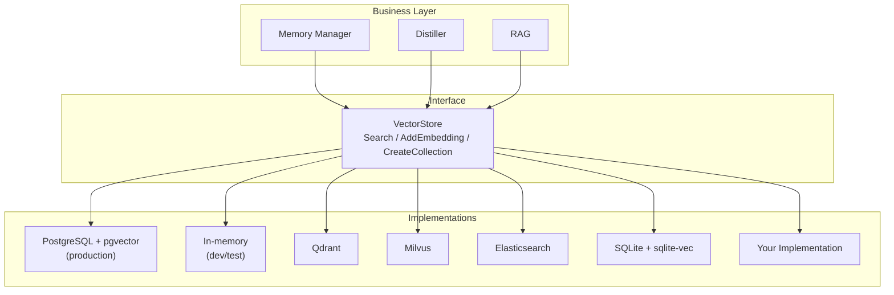

# Custom Vector Store

GoAgent supports pluggable vector backends. You can replace the default PostgreSQL + pgvector with any vector database by implementing a single interface.

## Interface

```go
// internal/storage/vector.go
type VectorStore interface {
    Search(ctx context.Context, table string, embedding []float64, limit int) ([]*SearchResult, error)
    AddEmbedding(ctx context.Context, table, id string, embedding []float64, metadata map[string]any) error
    CreateCollection(ctx context.Context, name string, dimension int) error
}

type SearchResult struct {
    ID       string         `json:"id"`
    Score    float64        `json:"score"`
    Metadata map[string]any `json:"metadata,omitempty"`
}
```

Three methods. That's it.

## Built-in Implementations

| Backend | Package | Use Case |
|---------|---------|----------|
| PostgreSQL + pgvector | `internal/storage/postgres` | Production, full SQL features |
| In-memory | `internal/storage/memory` | Development, testing, prototyping |

## How to Add Your Own

### Step 1: Implement the Interface

```go
package myqdrant

import (
    "context"
    "goagentx/internal/storage"
)

type VectorStore struct {
    host   string
    port   int
    client *http.Client
}

func New(host string, port int) *VectorStore {
    return &VectorStore{host: host, port: port, client: &http.Client{}}
}

func (v *VectorStore) Search(ctx context.Context, table string, embedding []float64, limit int) ([]*storage.SearchResult, error) {
    // Call your vector DB's API
    // Return results sorted by similarity (highest first)
}

func (v *VectorStore) AddEmbedding(ctx context.Context, table, id string, embedding []float64, metadata map[string]any) error {
    // Store the vector in your DB
}

func (v *VectorStore) CreateCollection(ctx context.Context, name string, dimension int) error {
    // Create a collection/table in your DB
}
```

### Step 2: Swap It In

```go
// Option A: Replace on existing repository
repo := postgres.NewRepository(pool)
repo.Vector = myqdrant.New("localhost", 6333)

// Option B: Use in-memory for testing
memStore := memory.NewVectorStore()
repo.Vector = memStore
```

The `Repository.Vector` field is typed as `storage.VectorStore`, so any implementation works. No other code changes needed.

### Step 3: Config-Driven (Recommended)

```yaml
# config.yaml
storage:
  vector_backend: "qdrant"  # or "postgres", "memory", "milvus", "es"
  vector:
    host: "localhost"
    port: 6333
```

```go
switch cfg.Storage.VectorBackend {
case "postgres":
    repo := postgres.NewRepository(pool)
case "qdrant":
    repo.Vector = myqdrant.New(cfg.Storage.Vector.Host, cfg.Storage.Vector.Port)
case "memory":
    repo.Vector = memory.NewVectorStore()
}
```

## Backend Examples

### Qdrant

```go
func (v *QdrantStore) Search(ctx context.Context, table string, embedding []float64, limit int) ([]*storage.SearchResult, error) {
    body := map[string]any{
        "vector": embedding,
        "limit":  limit,
    }
    resp, err := v.post(ctx, "/collections/"+table+"/points/search", body)
    // parse response into []*storage.SearchResult
}
```

### Milvus

```go
func (v *MilvusStore) Search(ctx context.Context, collection string, embedding []float64, limit int) ([]*storage.SearchResult, error) {
    // Use Milvus Go SDK
    results, err := v.client.Search(ctx, collection, embedding, limit)
    // convert to []*storage.SearchResult
}
```

### Elasticsearch

```go
func (v *ESStore) Search(ctx context.Context, index string, embedding []float64, limit int) ([]*storage.SearchResult, error) {
    query := map[string]any{
        "knn": map[string]any{
            "field":        "embedding",
            "query_vector": embedding,
            "k":            limit,
        },
    }
    // Execute search and parse results
}
```

### SQLite + sqlite-vec

```go
func (v *SQLiteStore) Search(ctx context.Context, table string, embedding []float64, limit int) ([]*storage.SearchResult, error) {
    query := fmt.Sprintf(`
        SELECT id, vec_distance_cosine(embedding, ?) as score, metadata
        FROM %s ORDER BY score LIMIT ?
    `, table)
    // Execute and parse
}
```

## SQL Syntax Differences

Each backend writes its own SQL. The business layer never sees SQL.

| Feature | PostgreSQL | SQLite |
|---------|-----------|--------|
| Vector type | `VECTOR(N)` | `vec_float(N)` via sqlite-vec |
| Distance | `embedding <=> $1` | `vec_distance_cosine(embedding, ?)` |
| Index | `ivfflat` / `hnsw` | sqlite-vec built-in |
| JSON | `JSONB` | `TEXT` + `json_extract()` |
| Full-text | `TSVECTOR` + `ts_rank` | `FTS5` |
| Tenant isolation | `RLS` + `SET LOCAL` | `WHERE tenant_id = ?` |
| Queue lock | `FOR UPDATE SKIP LOCKED` | Application mutex |

## Architecture



The business layer only depends on the `VectorStore` interface. Each implementation handles its own SQL/API syntax. Zero coupling.
