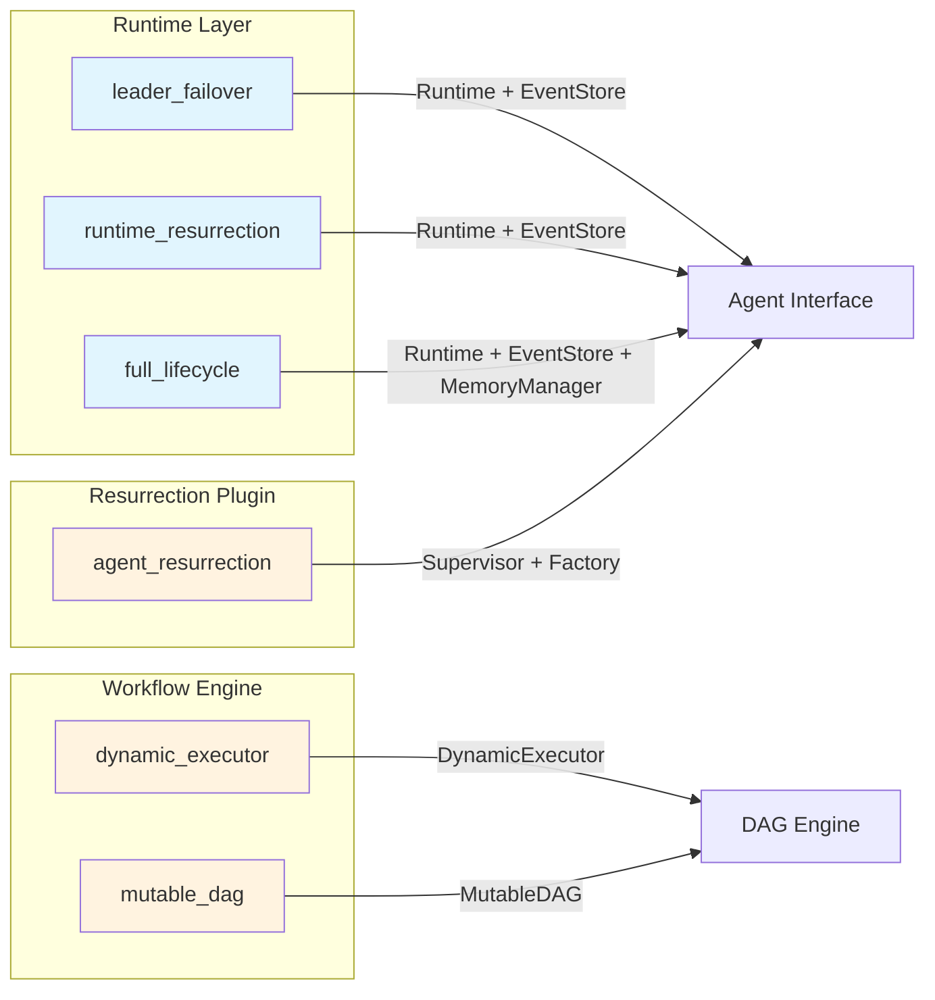

# Advanced Examples

Working examples demonstrating GoAgent v2 features. Each example is self-contained and runnable with `go run`.

## Prerequisites

- Go 1.26+
- No external dependencies required (all examples use in-memory stores)

## Example Overview



| Example | Feature | Key Concepts |
|---------|---------|--------------|
| `full_lifecycle/` | Complete agent lifecycle | Runtime, EventStore, MemoryManager, MutableDAG |
| `leader_failover/` | Leader checkpoint recovery | Runtime, EventStore, Factory, checkpoint replay |
| `agent_resurrection/` | Generic agent resurrection | Supervisor, HealthChecker, Factory, multi-agent monitoring |
| `runtime_resurrection/` | Runtime-managed lifecycle | Runtime, EventStore, event replay, cognitive recovery |
| `dynamic_executor/` | Runtime DAG mutation | DynamicExecutor, ApplyMode, ExecutorOption |
| `mutable_dag/` | Thread-safe DAG operations | MutableDAG, graph events, cycle detection |

---

## full_lifecycle

Demonstrates the complete agent lifecycle with Runtime, EventStore, MemoryManager, and MutableDAG workflow modification.

**What it shows:**
- Create Runtime + EventStore + MemoryManager infrastructure
- Register 4 agents: leader, worker-a, worker-b, planner
- Worker-a processes tasks and emits events to EventStore
- Worker-a crashes (simulated); Runtime detects and resurrects it
- Resurrected worker-a restores state from events and memory
- Planner modifies the workflow DAG at runtime (MutableDAG)

**Key code:**

```go
// Create shared infrastructure.
eventStore := events.NewMemoryEventStore()
// For production distillation support, use NewMemoryManagerWithDistiller
// instead of NewMemoryManager (requires embedding.EmbeddingService and
// distillation.ExperienceRepository).
memManager, _ := memory.NewMemoryManager(memory.DefaultMemoryConfig())
memManager.Start(ctx)

rt := runtime.New(&runtime.Config{
    HealthCheckInterval: 1 * time.Second,
    MaxRestartsPerAgent: 5,
    MaxReplayEvents:     1000,
}, eventStore, memManager)

// Register agents with factories for resurrection.
rt.RegisterAgent(workerA, func() base.Agent {
    return newLifecycleAgent("worker-a", models.AgentTypeBottom, eventStore, memManager)
})

// Start all agents.
rt.Start(ctx)

// Planner modifies workflow at runtime.
dag, _ := engine.NewMutableDAG(initialSteps)
dag.AddNode(ctx, &engine.Step{
    ID: "validate-data", Name: "Validate Data",
    DependsOn: []string{"analyze-data"},
})
```

**Run:**

```bash
go run ./examples/advanced/full_lifecycle/
```

---

## leader_failover

Demonstrates leader agent crash detection and automatic resurrection using the Runtime layer with EventStore-based checkpoint recovery.

**What it shows:**
- Create a `Runtime` with `MemoryEventStore`
- Register a leader agent with a factory for creating replacement instances
- Leader processes tasks and saves checkpoints via events
- Simulate a leader crash (panic via `shouldCrash` flag)
- Runtime detects crash via health check, replays events, restores from last checkpoint

**Key code:**

```go
// Create shared infrastructure.
eventStore := events.NewMemoryEventStore()

// Create Runtime with aggressive health checks for demo.
rtConfig := &runtime.Config{
    HealthCheckInterval: 1 * time.Second,
    MaxRestartsPerAgent: 3,
    MaxReplayEvents:     1000,
}
rt := runtime.New(rtConfig, eventStore, nil)

// Register leader with factory for resurrection.
leader := newLeader("leader-1", eventStore)
rt.RegisterAgent(leader, func() base.Agent {
    return newLeader("leader-1", eventStore)
})

// Start Runtime.
rt.Start(ctx)

// Leader saves checkpoints via events.
leader.emitEvent(ctx, events.EventStepCompleted, map[string]any{
    "task_id": taskID, "checkpoint": cp,
})

// Simulate crash.
leader.shouldCrash = true

// Runtime detects crash, replays events, new leader restores from last checkpoint.
```

**Run:**

```bash
go run ./examples/advanced/leader_failover/
```

---

## agent_resurrection

Demonstrates generic agent resurrection for multiple agent types using the resurrection Supervisor plugin. Any agent type (leader, worker, planner) can be monitored and resurrected using the same Supervisor.

**What it shows:**
- Register 3 agents of different types with a single Supervisor
- Kill one agent, verify resurrection
- Kill a second agent, verify the first remains unaffected
- Per-agent factory functions for type-specific reconstruction

**Key code:**

```go
// Create heartbeat monitor.
hbMon := ahp.NewHeartbeatMonitor(&ahp.HeartbeatConfig{
    Interval:  2 * time.Second,
    Timeout:   3 * time.Second,
    MaxMissed: 2,
})

// Create resurrection plugin.
health := resurrection.NewHeartbeatAdapter(hbMon)
supervisor, _ := resurrection.New(health, resurrection.Config{
    CheckInterval:     3 * time.Second,
    HeartbeatInterval: 2 * time.Second,
}, nil)

// Register 3 different agent types.
for _, d := range defs {
    agent := newWorker(d.id, d.agentType)
    agent.Start(ctx)
    id, at := d.id, d.agentType
    supervisor.Watch(agent, func() base.Agent {
        return newWorker(id, at)
    })
}

// Start monitoring.
supervisor.Start(ctx)

// Kill worker-1, wait for resurrection.
supervisor.Agent("worker-1").Stop(ctx)
time.Sleep(10 * time.Second)

// Verify worker-1 resurrected, worker-2 unaffected.
agent := supervisor.Agent("worker-1")
// agent.Status() == models.AgentStatusReady
```

**Run:**

```bash
go run ./examples/advanced/agent_resurrection/
```

---

## runtime_resurrection

Demonstrates Runtime-managed agent lifecycle with EventStore-based state preservation and cognitive recovery. When an agent crashes, the Runtime detects it, creates a new instance from the factory, and replays events to restore operational state.

**What it shows:**
- Create a `Runtime` with `MemoryEventStore`
- Register agents with factories
- Agents emit lifecycle and task events to EventStore
- Simulate agent crash via `shouldCrash` flag
- Runtime detects crash, resurrects agent, replays events
- Verify resurrected agent continues where the old one left off

**Key code:**

```go
// Create shared infrastructure.
eventStore := events.NewMemoryEventStore()
rt := runtime.New(runtime.DefaultConfig(), eventStore, nil)

// Register agents with factories.
rt.RegisterAgent(worker, func() base.Agent {
    return newWorker("worker-1", eventStore)
})

// Start Runtime.
rt.Start(ctx)

// Agent emits events during work.
worker.emitEvent(ctx, events.EventTaskCreated, map[string]any{
    "task_id": taskID, "agent_id": worker.id,
})

// Simulate crash.
worker.shouldCrash.Store(true)

// Runtime detects crash, creates new agent, replays events.
// New worker continues processing tasks.
```

**Run:**

```bash
go run ./examples/advanced/runtime_resurrection/
```

---

## dynamic_executor

Demonstrates the DynamicExecutor API and ApplyMode configuration for runtime DAG mutation during execution.

**What it shows:**
- Create a `MutableDAG` with initial steps
- Add parallel nodes at runtime
- Configure `DynamicExecutor` with different `ApplyMode` values
- Use `ExecutorOption` for fine-grained control (`WithMaxParallel`, `WithStepTimeout`)
- Cycle detection on edge insertion

**Key code:**

```go
// Create initial DAG: step1 -> step2 -> step3.
dag, _ := engine.NewMutableDAG(initialSteps)

// Add a parallel step: step1 -> step4.
dag.AddNode(ctx, &engine.Step{
    ID:        "step4",
    Name:      "Parallel Step",
    DependsOn: []string{"step1"},
})

// Create executor with options.
executor := engine.NewDynamicExecutor(
    nil,
    engine.ApplyAtCheckpoint,
    engine.WithMaxParallel(5),
    engine.WithStepTimeout(60*time.Second),
)

// Cycle detection rejects invalid edges.
dag.AddEdge(ctx, "step3", "step1") // returns error
```

**Run:**

```bash
go run ./examples/advanced/dynamic_executor/
```

---

## mutable_dag

Demonstrates thread-safe MutableDAG operations: adding/removing nodes and edges, graph event subscriptions, and snapshot-based concurrent reads.

**What it shows:**
- Create a DAG, add nodes and edges at runtime
- Subscribe to graph mutation events
- Cycle detection on edge insertion
- Remove nodes and verify updated execution order
- Take a snapshot for safe concurrent reads

**Key code:**

```go
// Create initial DAG: A -> B -> C.
dag, _ := engine.NewMutableDAG(initialSteps)

// Subscribe to graph events.
events := dag.Subscribe()

// Add node D with dependency on B.
dag.AddNode(ctx, &engine.Step{
    ID: "D", Name: "Step D", DependsOn: []string{"B"},
})

// Try to add a cycle (rejected).
dag.AddEdge(ctx, "D", "A") // error

// Remove node C.
dag.RemoveNode(ctx, "C")

// Snapshot for safe concurrent reads.
snapshot := dag.Snapshot()
```

**Run:**

```bash
go run ./examples/advanced/mutable_dag/
```

---

## Architecture Relationships

The Runtime examples (leader_failover, runtime_resurrection, full_lifecycle) demonstrate three levels of increasing sophistication using the Runtime layer:

1. **leader_failover** -- Single agent, Runtime + EventStore checkpoint recovery
2. **runtime_resurrection** -- Multiple agents, Runtime + EventStore + cognitive recovery
3. **full_lifecycle** -- Full infrastructure: Runtime + EventStore + MemoryManager + MutableDAG

The resurrection plugin example (agent_resurrection) uses the standalone Supervisor pattern:

1. **agent_resurrection** -- Multiple agents, Supervisor + HeartbeatAdapter + Factory

The workflow examples (dynamic_executor, mutable_dag) demonstrate the DAG engine:

1. **mutable_dag** -- Low-level graph operations (add/remove nodes/edges, snapshots)
2. **dynamic_executor** -- High-level execution with mutation during runtime
