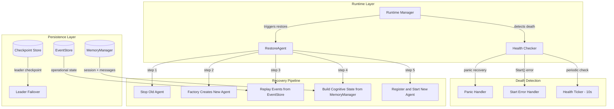
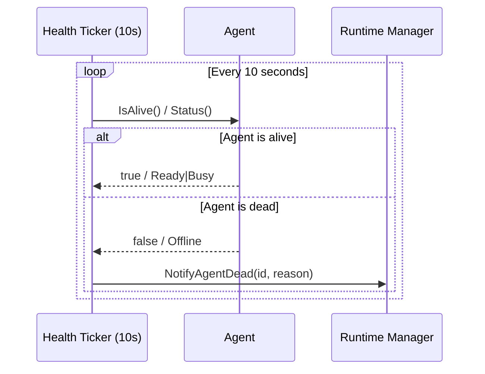
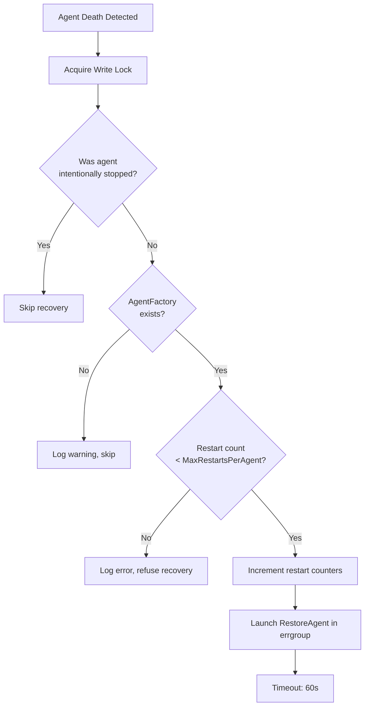
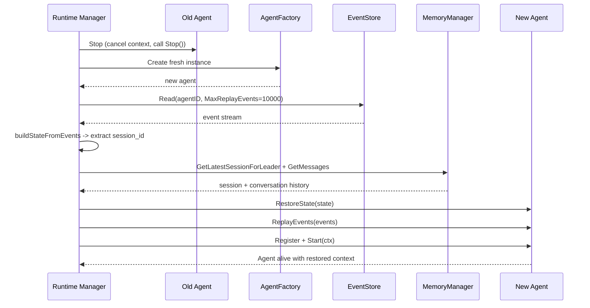
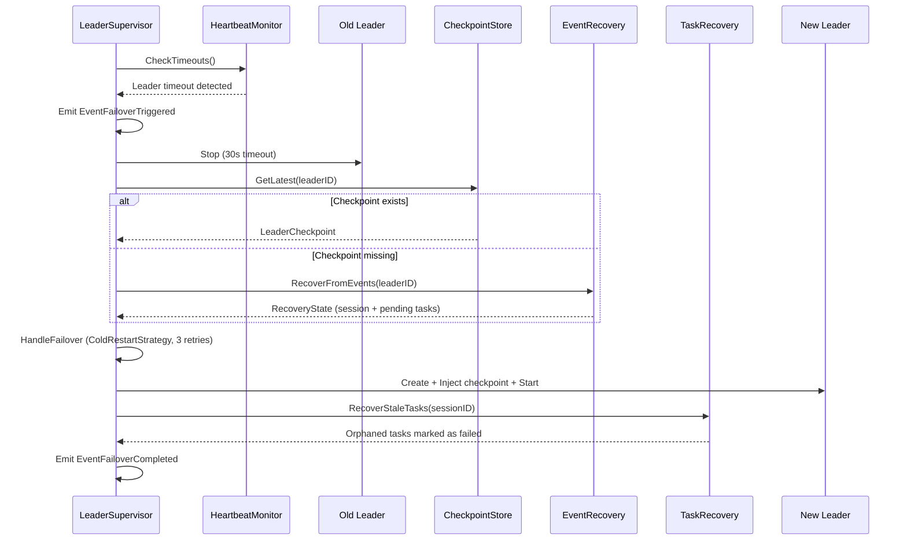
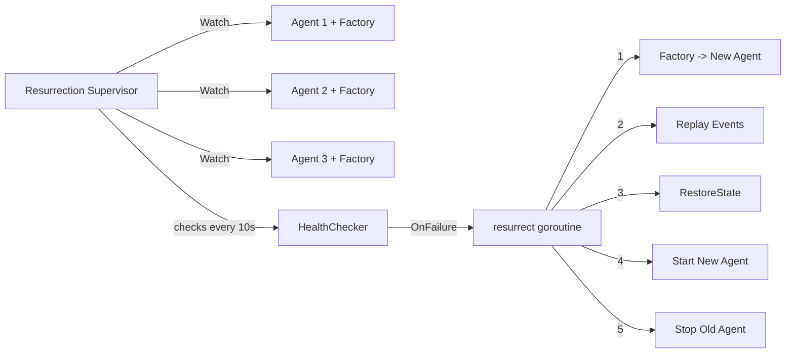

# Agent Crash Recovery

When an agent crashes in ares, the Runtime detects it, creates a fresh instance, replays events to restore operational state, and loads conversation history from the memory store. The agent resumes with full context -- as if nothing happened.

## Recovery Architecture

The recovery system operates across five layers:



## How an Agent Dies

An agent can die in three ways. All are handled in `internal/runtime/manager.go`.

### 1. Panic During Execution

Each agent runs in a goroutine wrapped with `defer recover()`. When a panic is caught, it calls `NotifyAgentDead`:

```go
// internal/runtime/manager.go:146-166
m.g.Go(func() error {
    defer func() {
        if r := recover(); r != nil {
            slog.Error("runtime: agent panicked in Start",
                "agent_id", id, "panic", r,
            )
            m.NotifyAgentDead(id, fmt.Sprintf("panic: %v", r))
        }
    }()

    if err := agent.Start(agentCtx); err != nil {
        if agentCtx.Err() != nil {
            return nil  // intentional stop, do not resurrect
        }
        m.NotifyAgentDead(id, fmt.Sprintf("start failed: %v", err))
        return nil // do not propagate; runtime must keep running
    }
    return nil
})
```

### 2. Start() Returns an Error

If `agent.Start()` returns a non-nil error and the context was not intentionally cancelled, `NotifyAgentDead` is called. The `agentCtx.Err() != nil` check distinguishes intentional stops from crashes.

### 3. Health Check Failure

A background ticker runs every `HealthCheckInterval` (default 10s). It checks agents via two mechanisms:

- **Heartbeat**: If the agent implements `base.Heartbeater`, the checker calls `IsAlive()`. The leader agent returns `true` only when status is `Ready` or `Busy`.
- **Status fallback**: Otherwise, it checks `agent.Status()` for `Offline` or `Stopping`.



## NotifyAgentDead -- The Safety Gate

`NotifyAgentDead` is the central dispatch point. It runs under a write lock and performs several checks before triggering recovery:



The actual code from `internal/runtime/manager.go:416-454`:

```go
func (m *Manager) NotifyAgentDead(agentID string, reason string) {
    // Write lock for check-and-increment to prevent TOCTOU race.
    m.mu.Lock()
    factory, hasFactory := m.factories[agentID]
    ma, hasAgent := m.agents[agentID]
    intentionallyStopped := hasAgent && ma.stopped

    if m.isStopped || intentionallyStopped {
        m.mu.Unlock()
        return
    }
    if !hasFactory {
        m.mu.Unlock()
        return
    }

    // Check restart limit under the same lock.
    if hasAgent && m.config.MaxRestartsPerAgent > 0 &&
        ma.restarts >= m.config.MaxRestartsPerAgent {
        m.mu.Unlock()
        return
    }

    // Increment BEFORE launching goroutine.
    if hasAgent {
        ma.restarts++
    }
    m.totalRestarts++
    // ... launch RestoreAgent via errgroup
}
```

Key design: the restart limit check and increment happen under the same write lock. Two concurrent `NotifyAgentDead` calls could both pass the check under RLock, then both schedule `RestoreAgent`, exceeding the intended restart count.

## The RestoreAgent Pipeline

`RestoreAgent` performs a five-step recovery:



### Step 1: Stop Old Agent

The old agent is marked `stopped = true` under write lock, its context is cancelled, and `agent.Stop()` is called with a 10s timeout.

```go
// internal/runtime/manager.go:310-328
m.mu.Lock()
oldMA, oldExists := m.agents[agentID]
if oldExists && oldMA != nil {
    oldMA.stopped = true
}
m.mu.Unlock()

if oldExists && oldMA != nil {
    if oldMA.cancel != nil {
        oldMA.cancel()
    }
    stopCtx, stopCancel := context.WithTimeout(ctx, m.config.AgentStopTimeout)
    if err := oldMA.agent.Stop(stopCtx); err != nil {
        slog.Warn("runtime: restore stop old agent failed", "agent_id", agentID, "error", err)
    }
    stopCancel()
}
```

### Step 2: Create New Agent

`AgentFactory` (a `func() base.Agent`) creates a fresh instance.

```go
newAgent := factory()
if newAgent == nil {
    return fmt.Errorf("runtime: factory returned nil for agent %s", agentID)
}
```

### Step 3: Replay Events (Operational Recovery)

The `replayEvents` method reads the agent's event stream from the `EventStore`, using the agent ID as the stream ID. It reads up to 10,000 events in ascending order.

### Step 4: Build Cognitive State

Two sub-steps:

- `buildStateFromEvents` extracts `session_id` from `EventSessionCreated` events.
- `buildCognitiveState` loads conversation history from the `MemoryManager`. It first tries the session_id from events, then falls back to `GetLatestSessionForLeader` (5s timeout). Messages are loaded via `GetMessages` (5s timeout).

If the agent implements `StatefulAgent`, both `RestoreState` and `ReplayEvents` are called.

### Step 5: Register and Start

The new agent is registered under write lock, launched in a goroutine with panic recovery, and `agent.Start()` is called.

## StatefulAgent Interface

Agents that need custom recovery logic implement this interface from `internal/agents/base/agent.go`:

```go
type StatefulAgent interface {
    RestoreState(state map[string]any) error
    ReplayEvents(events []*events.Event) error
    Snapshot() (map[string]any, error)
}
```

The leader agent implements all three:

```go
// internal/agents/leader/agent.go:767-816
func (a *LeaderAgent) RestoreState(state map[string]any) error {
    if sid, ok := state["session_id"].(string); ok && sid != "" {
        a.sessionID = sid
        slog.Info("LeaderAgent restored session_id", "session_id", sid)
    }
    return nil
}

func (a *LeaderAgent) ReplayEvents(events []*events.Event) error {
    for _, ev := range events {
        if ev.Type == events.EventSessionCreated {
            if sid, ok := ev.Payload["session_id"].(string); ok {
                a.sessionID = sid
            }
        }
    }
    return nil
}

func (a *LeaderAgent) Snapshot() (map[string]any, error) {
    return map[string]any{
        "session_id": a.sessionID,
        "agent_id":   a.agentID,
        "status":     string(a.Status()),
    }, nil
}
```

## Leader Failover

Leader agents have an additional failover layer via `LeaderSupervisor`. When the leader dies, the supervisor performs checkpoint-based recovery:



### Checkpoint

The `LeaderCheckpoint` stores `leader_id`, `session_id`, `status`, and `metadata`. It is persisted to PostgreSQL with upsert semantics. The leader saves a checkpoint whenever it creates or recovers a session.

### Event Recovery

If the checkpoint is missing or incomplete, `EventRecovery.RecoverFromEvents` reconstructs state by replaying the full event stream:
- `EventSessionCreated` -> captures session ID
- `EventTaskCreated` -> adds task to pending list
- `EventTaskCompleted` -> removes task from pending list

### Orphaned Task Cleanup

`TaskRecovery.RecoverStaleTasks` marks tasks with status `pending` or `running` as `failed` with error `"leader failover: task orphaned"`.

## Resurrection Plugin

The `resurrection.Supervisor` is a generic, agent-type-agnostic resurrection mechanism from `internal/plugins/resurrection/`.



Configuration defaults:
- `CheckInterval`: 10s
- `ResurrectTimeout`: 60s
- `MaxAttempts`: 3
- `HeartbeatInterval`: 5s

## Event Sourcing

All state changes are persisted as events. The `EventStore` interface supports:

- `Append(ctx, streamID, events, expectedVersion)` -- optimistic concurrency control
- `Read(ctx, streamID, opts)` -- read a single stream
- `Subscribe(ctx, filter)` -- real-time event channel

Event types: `agent.started`, `agent.stopped`, `task.created`, `task.dispatched`, `task.completed`, `task.failed`, `session.created`, `message.added`, `memory.distilled`, `failover.triggered`, `failover.completed`, `llm.call`.

## Configuration

| Parameter | Default | Description |
|-----------|---------|-------------|
| `HealthCheckInterval` | 10s | How often to check agent health |
| `MaxRestartsPerAgent` | 10 | Max restarts before giving up |
| `MaxReplayEvents` | 10,000 | Max events to replay during recovery |
| `AgentStopTimeout` | 10s | Timeout for stopping old agent |
| `RestoreTimeout` | 60s | Total timeout for RestoreAgent |
| `OverallStopTimeout` | 30s | Timeout for stopping all agents |
