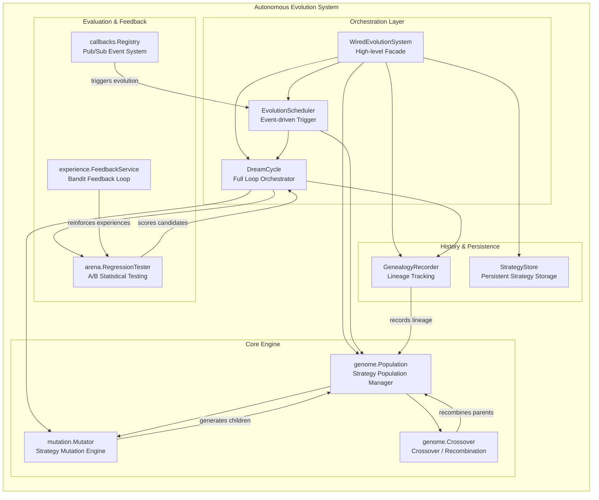
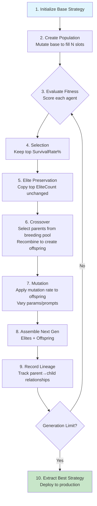

# Autonomous Evolution (Genetic Algorithm)

## Overview

ares's **Autonomous Evolution** system implements a genetic algorithm (GA) for autonomous agent strategy optimization. The system — also known as **Dream Mode** — enables agents to continuously explore, evaluate, and adopt better decision-making strategies without human intervention.

At its core, the system treats agent strategies as a **population of individuals** that evolve over generations through selection, crossover (recombination), and mutation. Each strategy encodes parameters such as LLM temperature, top_k, max_steps, prompt templates, and tool configurations. The GA searches this high-dimensional parameter space to discover strategies that maximize task performance scores.

The system is designed as a **zero-cost background evolution** loop: evolution cycles run during system idle time using pre-computed task scores, requiring no additional LLM API calls for the evolution process itself.

---

## Architecture



---

## Core Components

### 1. Evolution Package (`internal/evolution/`)

The **top-level orchestration package** that wires all components together into a cohesive system.

**Key Types:**

| Type | Description |
|------|-------------|
| `WiredEvolutionSystem` | High-level facade holding all pre-wired components |
| `Strategy` | Evolved strategy with ID, Version, Params, ParentID, Score |
| `StrategyLineage` | Genealogy record: ParentID → ChildID, MutationType, WinRate |
| `RegressionConfig` | Arena test configuration (Candidate, Baseline, TaskSampleSize) |
| `RegressionResult` | Arena test outcome (CandidateScore, BaselineScore, WinRate) |

**Key Interfaces:**

```go
// GenealogyRecorder records strategy evolution history
type GenealogyRecorder interface {
    Record(ctx context.Context, lineage StrategyLineage) error
}

// TesterInterface runs arena regression tests
type TesterInterface interface {
    Run(ctx context.Context, cfg RegressionConfig) (*RegressionResult, error)
}
```

**Key Functions:**

```go
// Create a fully wired system in one call
func NewWiredEvolutionSystem(base *mutation.Strategy, cfg SystemConfig) (*WiredEvolutionSystem, error)

// Bridge between Population and Genealogy recording
func RecordPopulationLineage(ctx context.Context, pop *genome.Population, recorder GenealogyRecorder, prevGeneration int) (int, error)

// Extract best strategy from the wired system
func BestStrategyFromSystem(system *WiredEvolutionSystem) (*mutation.Strategy, error)

// Clean resource release
func Shutdown(system *WiredEvolutionSystem)
```

---

### 2. Genome Package (`internal/evolution/genome/`)

Manages the **population** of strategy agents across generations using genetic algorithm operations.

**`Population`** — The central data structure:

```go
type Population struct {
    Agents   []*mutation.Strategy // Current generation strategies
    Size     int                  // Target population size (constant)
    Generation int               // Current generation number
    cfg      PopulationConfig    // Evolution configuration
    rng      *rand.Rand          // Deterministic RNG source
}
```

**Construction:**

```go
pop, err := genome.NewPopulation(ctx, baseStrategy, mutator,
    genome.WithPopulationSize(20),    // Target population size
    genome.WithEliteCount(3),         // Elite individuals preserved per gen
    genome.WithMutationRate(0.2),     // Post-crossover mutation probability
    genome.WithSurvivalRate(0.6),     // Fraction of top performers to keep
    genome.WithBreedingPoolRatio(0.3),// Top fraction eligible as parents
    genome.WithSeed(42),              // Deterministic seed (optional)
)
```

**Core Methods:**

| Method | Description |
|--------|-------------|
| `EvolveOnIdle(ctx, mutator, crosser)` | Run one generation of idle-time evolution |
| `Stats()` | Returns `PopulationStats` (Size, Generation, BestScore, AvgScore, WorstScore) |
| `Best()` | Returns highest-scoring individual agent |
| `BestStrategy()` | Returns deep-cloned best strategy for deployment |
| `Snapshot()` | Thread-safe copy of all agents + current generation |

**`Crossover`** — Recombines parent strategies:

```go
type CrossoverInterface interface {
    Crossover(ctx context.Context, a, b *mutation.Strategy) (*mutation.Strategy, error)
}

// Uniform crossover: each param independently from A or B (50% each)
crosser.Crossover(ctx, parentA, parentB)

// Multi-point crossover: k split points with contiguous segments
crosser.MultiPointCrossover(ctx, parentA, parentB, k)

// Half-split prompt crossover: first half from A, second half from B
crosser.CrossoverWithHalfSplit(ctx, parentA, parentB)
```

**Adaptive Features:**

- **Adaptive Mutation Rate**: Automatically adjusts between `MinMutationRate` and `MaxMutationRate` based on population diversity and stagnation
- **Stagnation Detection**: After `MaxStagnantGenerations` without improvement, bottom performers are reset to inject fresh genetic material
- **Diversity Monitoring**: When average pairwise distance drops below `DiversityThreshold`, mutation becomes more aggressive

---

### 3. Mutation Package (`internal/evolution/mutation/`)

Generates **child strategies** from a parent by varying parameters or prompt templates.

**`Strategy`** — The mutable strategy representation:

```go
type Strategy struct {
    ID                   string       // Unique identifier
    ParentID             string       // Parent strategy ID (empty for root)
    Version              int          // Monotonically increasing version
    Params               map[string]any // Mutable parameters (temperature, top_k, etc.)
    PromptTemplate       string       // Behavior prompt template
    StrategyMutationType MutationType // How this strategy was created
    MutationDesc         string       // Human-readable description
    Score                float64      // Evaluation score (-1 = unevaluated)
    CreatedAt            time.Time    // Creation timestamp
}
```

**Mutation Types:**

| Type | Probability | Description |
|------|-------------|-------------|
| `MutationParameter` | ~70% | Change one parameter value (e.g., temperature 0.7 → 0.5) |
| `MutationPrompt` | ~15% | Replace prompt template from pool |
| `MutationTool` | ~15% | Replace tool configuration from pool |
| `MutationCrossover` | — | Created via crossover recombination |

**Default Parameter Ranges:**

| Parameter | Candidate Values |
|-----------|-----------------|
| `temperature` | 0.1, 0.3, 0.5, 0.7, 0.9 |
| `top_k` | 10, 20, 40, 80 |
| `max_steps` | 5, 10, 15, 20 |
| `memory_limit` | 3, 5, 10 |
| `conflict_threshold` | 0.85, 0.90, 0.95 |

**Mutator Construction:**

```go
mutator, err := mutation.NewMutator(
    mutation.WithPromptPool([]string{
        "You are a careful assistant. Think step by step.",
        "You are a creative assistant. Explore multiple solutions.",
        "You are a precise assistant. Focus on accuracy.",
    }),
    mutation.WithSeed(42),           // Deterministic for reproducibility
    mutation.WithDeterministicIDs(true), // Counter-based IDs
)
```

**Key Property — Determinism**: With the same seed, `Mutate()` produces identical results every time, enabling reproducible experiments and debugging.

---

### 4. Arena Package (`internal/arena/`)

Provides **statistical A/B testing** for comparing candidate strategies against the current baseline.

**`RegressionTester`** — A/B comparison framework:

```go
type RegressionConfig struct {
    OldStrategy  any      // Baseline strategy
    NewStrategy  any      // Candidate strategy
    BaselineRuns int      // Number of baseline evaluation runs
    CompareRuns  int      // Number of candidate evaluation runs
    TestSuite    string   // Test suite identifier
    Confidence   float64  // Significance level (e.g., 0.05 for 95% confidence)
    MinWinRate   float64  // Minimum win rate to accept (e.g., 0.55)
}

type RegressionResult struct {
    OldAvg     float64   // Baseline average score
    NewAvg     float64   // Candidate average score
    WinRate    float64   // Proportion where candidate ≥ baseline (0–1)
    PValue     float64   // Statistical significance p-value
    Confident  bool      // Whether result is statistically significant
    Samples    int       // Runs per strategy
    TestedAt   time.Time // Test timestamp
    OldScores  []float64 // Individual baseline run scores
    NewScores  []float64 // Individual candidate run scores
}
```

**Statistical Method**: Uses Welch's t-test approximation for determining whether score differences are statistically significant (not due to random chance).

---

### 5. Callbacks Package (`internal/ares_callbacks/`)

**Pub/sub event registry** for monitoring LLM, Tool, and Agent lifecycle events.

**Supported Events:**

| Event | Trigger |
|-------|---------|
| `EventLLMStart` | Before an LLM API call |
| `EventLLMEnd` | After an LLM API call completes |
| `EventLLMError` | When an LLM call fails |
| `EventToolStart` | Before a tool execution |
| `EventToolEnd` | After a tool execution completes |
| `EventAgentStart` | Before an agent begins |
| `EventAgentEnd` | After an agent finishes |

**Usage:**

```go
registry := callbacks.NewRegistry()

registry.On(callbacks.EventAgentEnd, func(ctx *callbacks.Context) {
    slog.Info("Agent finished", "agent_id", ctx.AgentID, "duration", ctx.Duration)
})

registry.Emit(&callbacks.Context{
    Event:   callbacks.EventAgentEnd,
    AgentID: "agent-01",
    Duration: 250 * time.Millisecond,
})
```

**Context Metadata:** Model, Input, Output, ToolName, AgentID, Duration, Error, TokenCount.

**Safety guarantee:** Handler panics are recovered and do not crash the emitter.

---

### 6. Experience Package (`internal/experience/`)

**Bandit feedback service** for experience quality reinforcement.

```go
type FeedbackService struct {
    repo repositories.ExperienceRepositoryInterface
}

// Reinforce on success: increment usage count
func (s *FeedbackService) RecordSuccess(ctx context.Context, id string) error

// Penalize on failure: decrease rank by 10%
func (s *FeedbackService) RecordFailure(ctx context.Context, id string) error
```

This creates a **positive feedback loop**: successful experiences get used more often; failed experiences get deprioritized.

---

## Genetic Algorithm Workflow

The complete evolution flow from initialization through multi-generation optimization:



### Step-by-Step Description

1. **Initialize Base Strategy**: Define the root strategy with initial parameters (temperature, top_k, max_steps, prompt template).

2. **Create Population**: Clone the base strategy and mutate it to fill `PopulationSize` slots. All agents start as variants of the root.

3. **Evaluate Fitness**: Score each agent in the population. In production, this uses arena regression tests or task success metrics. Scores can be assigned externally via `Snapshot()`.

4. **Selection (Survival)**: Sort agents by score descending. Keep the top `SurvivalRate` fraction (default 60%). Bottom performers are eliminated.

5. **Elite Preservation**: Deep-copy the top `EliteCount` strategies unchanged into the next generation. This guarantees the best solutions are never lost.

6. **Crossover (Recombination)**: From the surviving pool, select a **breeding pool** (top `BreedingPoolRatio`, default 30%). Pick two random parents and combine their parameters:
   - **Uniform crossover**: Each parameter independently chosen from parent A or B (50/50)
   - **Multi-point crossover**: Split parameter list at k points, alternate segments
   - **Prompt template**: Inherited from higher-scoring parent (or half-split variant)

7. **Mutation**: Each offspring has `MutationRate` probability (default 20%) of being further mutated:
   - ~70% chance: one parameter changed to a different value from its range
   - ~15% chance: prompt template swapped from pool
   - ~15% chance: tool configuration swapped from pool

8. **Assemble Next Generation**: Combine elites + offspring to form the next generation population at target size.

9. **Record Lineage**: Track parent→child relationships, mutation types, and score improvements for traceability and post-hoc analysis.

10. **Extract Best Strategy**: After evolution completes, clone the highest-scoring strategy for production deployment.

### Adaptive Behavior

The GA includes built-in adaptive mechanisms:

- **Adaptive Mutation Rate**: Increases when diversity is low or stagnation detected; drifts back toward base rate otherwise
- **Stagnation Reset**: If best score doesn't improve for `MaxStagnantGenerations` consecutive generations, bottom performers are replaced with fresh random variants
- **Diversity Threshold**: Monitors average pairwise distance in parameter space; triggers aggressive exploration when diversity drops too low

---

## API Reference

### System Configuration

```go
type SystemConfig struct {
    PopulationSize          int       // Target population size (default: 20)
    EliteCount              int       // Elite strategies preserved (default: 3)
    MutationRate            float64   // Post-crossover mutation prob (default: 0.2)
    SurvivalRate            float64   // Top performer survival frac (default: 0.6)
    EnableDreamCycle        bool      // Enable dream cycle orchestrator
    EnableScheduler         bool      // Enable event-driven scheduler
    MinTasksBeforeEvolve    int       // Min tasks before first evolution (default: 10)
    SchedulerTrigger        EvolutionTrigger // Trigger mode (default: OnIdle)
    MutatorSeed             int64     // Mutator random seed (0 = non-deterministic)
    CrossoverSeed           int64     // Crossover random seed (0 = non-deterministic)
    UseDeterministicIDs     bool      // Counter-based IDs for reproducibility
    MinMutationRate         float64   // Adaptive mutation floor (default: 0.05)
    MaxMutationRate         float64   // Adaptive mutation ceiling (default: 0.5)
    MaxStagnantGenerations  int       // Stagnation reset threshold (default: 10)
    DiversityThreshold      float64   // Min diversity before aggressive mode (default: 0.15)
}

func DefaultSystemConfig() SystemConfig
```

### Population Options

```go
func WithPopulationSize(size int) PopulationOption
func WithEliteCount(count int) PopulationOption
func WithMutationRate(rate float64) PopulationOption
func WithSurvivalRate(rate float64) PopulationOption
func WithBreedingPoolRatio(ratio float64) PopulationOption
func WithPopulationSeed(seed int64) PopulationOption
func WithMinMutationRate(rate float64) PopulationOption
func WithMaxMutationRate(rate float64) PopulationOption
func WithMaxStagnantGenerations(n int) PopulationOption
func WithDiversityThreshold(threshold float64) PopulationOption
```

### Mutator Options

```go
func WithPromptPool(pool []string) MutatorOption
func WithToolPool(pool []string) MutatorOption
func WithParamRanges(ranges map[string]ParamRange) MutatorOption
func WithSeed(seed int64) MutatorOption
func WithDeterministicIDs(enabled bool) MutatorOption
```

### Crossover Options

```go
func WithSeed(seed int64) CrossoverOption
func WithDeterministicIDs(enabled bool) CrossoverOption
```

### Population Statistics

```go
type PopulationStats struct {
    Generation int       // Current generation number
    Size       int       // Number of agents
    AvgScore   float64   // Average score across all agents
    BestScore  float64   // Highest score in population
    WorstScore float64   // Lowest score in population
}
```

---

## Configuration

### Population Parameters

| Parameter | Default | Range | Description |
|-----------|---------|-------|-------------|
| `PopulationSize` | 20 | 1–100+ | Number of strategies per generation |
| `EliteCount` | 3 | 0–Size | Strategies preserved unchanged each generation |
| `SurvivalRate` | 0.6 | 0.1–1.0 | Fraction of top performers that survive selection |
| `MutationRate` | 0.2 | 0.0–1.0 | Probability of mutating each offspring after crossover |
| `BreedingPoolRatio` | 0.3 | 0.01–1.0 | Fraction of survivors eligible as parents |
| `MinMutationRate` | 0.05 | 0.0–1.0 | Floor for adaptive mutation rate |
| `MaxMutationRate` | 0.5 | 0.0–1.0 | Ceiling for adaptive mutation rate |
| `MaxStagnantGenerations` | 10 | 0–100+ | Generations without improvement before reset |
| `DiversityThreshold` | 0.15 | 0.0–1.0 | Minimum diversity before aggressive mode |

### Dream Cycle Parameters

| Parameter | Default | Description |
|-----------|---------|-------------|
| `MinTasksBeforeEvolve` | 10 | Minimum completed tasks before first cycle |
| `MaxMutations` | 3 | Maximum candidates generated per cycle |
| `MinWinRate` | 0.55 | Minimum win rate to accept a candidate |
| `Cooldown` | 5 min | Minimum time between consecutive cycles |
| `TaskSampleSize` | 50 | Scoring runs per strategy for final eval |
| `QuickRejectRuns` | 5 | Runs for first-pass screening |

### Arena Test Parameters

| Parameter | Default | Description |
|-----------|---------|-------------|
| `BaselineRuns` | 5 | Number of baseline strategy evaluations |
| `CompareRuns` | 5 | Number of candidate strategy evaluations |
| `Confidence` | 0.05 | Significance level (α) for t-test |
| `MinWinRate` | 0.55 | Minimum win rate to declare improvement |

### Tuning Guidelines

- **Small populations (10–20)**: Faster generations, suitable for rapid prototyping
- **Large populations (50–100)**: Better diversity, slower convergence
- **Higher mutation rate (0.3–0.5)**: More exploration, useful when stuck in local optima
- **Lower mutation rate (0.05–0.15)**: More exploitation, fine-tuning around good solutions
- **Higher elite count (3–5)**: Preserves more top solutions but reduces diversity
- **Higher survival rate (0.7–0.8)**: Less aggressive selection pressure

---

## Usage Example

### Basic Multi-Generation Evolution

```go
package main

import (
    "context"
    "math/rand"
    "time"

    "ares/internal/evolution"
    "ares/internal/evolution/genome"
    "ares/internal/evolution/mutation"
)

func main() {
    ctx := context.Background()

    // 1. Define the base (root) strategy
    base := &mutation.Strategy{
        ID:      "root-strategy-v1",
        Version: 1,
        Params: map[string]any{
            "temperature":        0.7,
            "top_k":              40,
            "max_steps":          10,
            "memory_limit":       5,
            "conflict_threshold": 0.90,
        },
        PromptTemplate: "You are a helpful assistant.",
        CreatedAt:      time.Now(),
    }

    // 2. Create mutator with prompt pool and deterministic seed
    mutator, _ := mutation.NewMutator(
        mutation.WithPromptPool([]string{
            "You are a careful assistant. Think step by step.",
            "You are a creative assistant. Explore multiple solutions.",
            "You are a precise assistant. Focus on accuracy.",
        }),
        mutation.WithSeed(42),
    )

    // 3. Create crossover engine
    crosser, _ := genome.NewCrossover(genome.WithSeed(42))

    // 4. Create population with GA configuration
    pop, _ := genome.NewPopulation(ctx, base, mutator,
        genome.WithPopulationSize(20),
        genome.WithEliteCount(2),
        genome.WithMutationRate(0.2),
        genome.WithSurvivalRate(0.6),
    )

    rng := rand.New(rand.NewSource(99))
    const nGenerations = 15

    // 5. Run multi-generation evolution loop
    for gen := 1; gen <= nGenerations; gen++ {
        // Assign fitness scores to each agent (external evaluation)
        for _, agent := range pop.SnapshotAsAgents() { // or use Snapshot()
            temp := agent.Params["temperature"].(float64)
            proximity := 1.0 - abs(temp-0.7)*2.5
            agent.Score = 50.0 + rng.Float64()*30.0 + proximity*20.0
        }

        // Evolve one generation: select → elite → crossover → mutate
        pop.EvolveOnIdle(ctx, mutator, crosser)

        stats := pop.Stats()
        printf("Gen %d: Best=%.2f Avg=%.2f Size=%d\n",
            stats.Generation, stats.BestScore, stats.AvgScore, stats.Size)
    }

    // 6. Extract best strategy for deployment
    best := pop.BestStrategy()
    printf("Best Strategy: %s (score=%.2f)\n", best.ID, best.Score)
}
```

### Wired System (High-Level API)

```go
package main

import (
    "context"

    "ares/internal/evolution"
    "ares/internal/evolution/genome"
    "ares/internal/evolution/mutation"
)

func main() {
    ctx := context.Background()

    base := &mutation.Strategy{
        ID: "wired-root-v1", Version: 1,
        Params: map[string]any{
            "temperature": 0.7, "top_k": 40, "max_steps": 10,
        },
        PromptTemplate: "You are a helpful assistant.",
        CreatedAt:      time.Now(),
    }

    // Configure system
    cfg := evolution.DefaultSystemConfig()
    cfg.PopulationSize = 10
    cfg.EliteCount = 1
    cfg.SurvivalRate = 0.5
    cfg.MutationRate = 0.3

    // Wire everything together in one call
    system, err := evolution.NewWiredEvolutionSystem(base, cfg)
    if err != nil {
        panic(err)
    }
    defer evolution.Shutdown(system)

    // Create compatible mutator and crosser
    mutator, _ := mutation.NewMutator(
        mutation.WithPromptPool([]string{"careful", "creative", "precise"}),
        mutation.WithSeed(42),
    )
    genomeMutator, _ := evolution.NewGenomeMutatorAdapter(mutator)
    crosser, _ := genome.NewCrossover(genome.WithSeed(42))

    // Run N generations of idle evolution
    err = evolution.RunIdleEvolution(ctx, system, 10)
    if err != nil {
        panic(err)
    }

    // Deploy the best evolved strategy
    best, _ := evolution.BestStrategyFromSystem(system)
    printf("Deployed: %s v%d (score=%.2f)\n", best.ID, best.Version, best.Score)
}
```

### Bandit Feedback Loop

```go
repo := newMockExperienceRepo()
feedbackSvc := experience.NewFeedbackService(repo)

// On successful task completion
feedbackSvc.RecordSuccess(ctx, "exp-001")  // usage count ++

// On task failure
feedbackSvc.RecordFailure(ctx, "exp-002")  // rank *= 0.9 (−10%)
```

### Callback Event Monitoring

```go
registry := callbacks.NewRegistry()

registry.On(callbacks.EventLLMStart, func(ctx *callbacks.Context) {
    slog.Info("LLM call started", "model", ctx.Model)
})
registry.On(callbacks.EventAgentEnd, func(ctx *callbacks.Context) {
    slog.Info("Agent finished", "id", ctx.AgentID, "duration", ctx.Duration)
})

// Events are emitted throughout the framework automatically
```

---

## Best Practices

### 1. Reproducibility

Always set seeds during development and testing:

```go
mutation.WithSeed(42)
genome.WithSeed(42)
genome.WithPopulationSeed(99)
```

Use `WithDeterministicIDs(true)` for reproducible strategy IDs across runs. This is essential for debugging and comparing experiment results.

### 2. Population Sizing

| Scenario | Recommended Size | Elite Count | Mutation Rate |
|----------|-----------------|-------------|---------------|
| Rapid prototyping | 10–15 | 1–2 | 0.3 |
| Standard evolution | 20–30 | 2–4 | 0.2 |
| Deep search | 50–100 | 3–5 | 0.15 |

### 3. Prompt Pool Design

Provide diverse but meaningful prompt templates:

```go
promptPool := []string{
    "You are a careful assistant. Think step by step.",       // Analytical
    "You are a creative assistant. Explore multiple solutions.", // Creative
    "You are a precise assistant. Focus on accuracy.",         // Precise
    "You are a fast assistant. Be concise and direct.",        // Efficient
}
```

Avoid overly similar templates — they reduce effective mutation diversity.

### 4. Fitness Function Design

The fitness function is the most critical component for GA success:

- **Score range**: Use consistent scales (e.g., 0–100 or 0.0–1.0)
- **Multi-objective**: Combine metrics (accuracy, speed, token efficiency) into a single scalar
- **Noise tolerance**: Use enough samples per evaluation to handle stochastic variation
- **Avoid plateaus**: Ensure small parameter changes produce measurable score differences

### 5. Stagnation Handling

If evolution appears stuck:

1. Increase `MutationRate` temporarily (0.2 → 0.4)
2. Decrease `DiversityThreshold` (0.15 → 0.08) to trigger aggressive mode earlier
3. Reduce `MaxStagnantGenerations` (10 → 5) for faster resets
4. Check if fitness function has sufficient resolution

### 6. Resource Management

- Always call `Shutdown(system)` to release goroutines and resources
- Use `context.Context` for cancellation support in long-running evolutions
- Monitor lineage recorder size — it grows linearly with generations

### 7. Production Deployment

1. Run evolution in background (idle time) — zero additional LLM cost
2. Validate the best strategy with arena regression before deploying
3. Record lineage for audit trail and rollback capability
4. Consider gradual rollout: deploy to subset of traffic first

---

## Demo Scenarios Overview

The example at `examples/autonomous-evolution/main.go` demonstrates 7 core scenarios:

| # | Scenario | Key Component Demonstrated |
|---|----------|---------------------------|
| 1 | Bandit Feedback Loop | `experience.FeedbackService` — success/failure reinforcement |
| 2 | Callback Event System | `callbacks.Registry` — pub/sub lifecycle events |
| 3 | Strategy Mutation Engine | `mutation.Mutator` — parameter & prompt variations |
| 4 | Arena Regression Test | `arena.RegressionTester` — statistical A/B testing |
| 5 | Dream Cycle | `DreamCycle` — full orchestration: mutate → test → genealogy |
| 6 | Multi-Generation GA | `genome.Population` — 15-generation population evolution |
| 7 | Wired Evolution System | `WiredEvolutionSystem` — fully integrated high-level API |

Run the demo:

```bash
cd examples/autonomous-evolution && go run main.go
```

All dependencies use mock implementations — no external services required.

---

**Version**: 1.0
**Last Updated**: 2026-06-21
**Maintainer**: GoAgent Team
