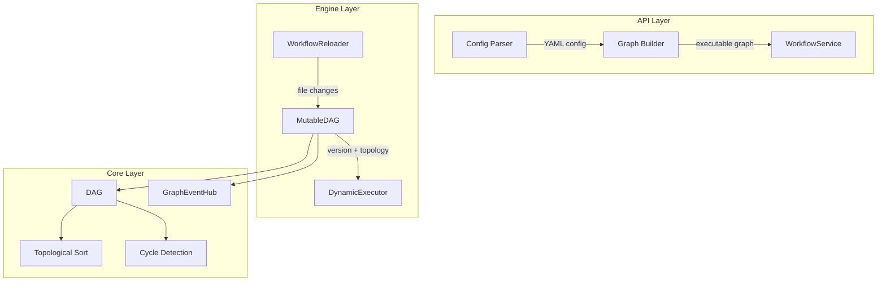
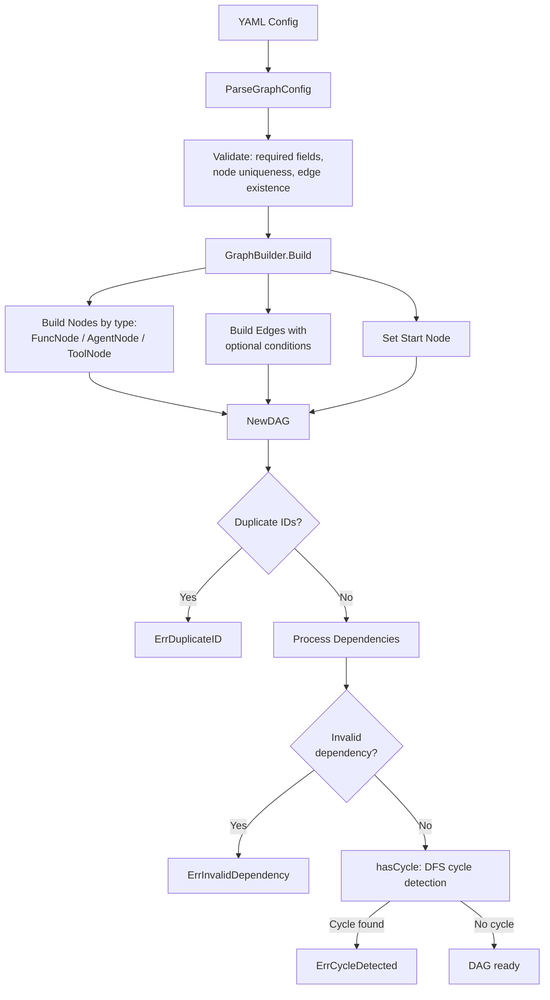
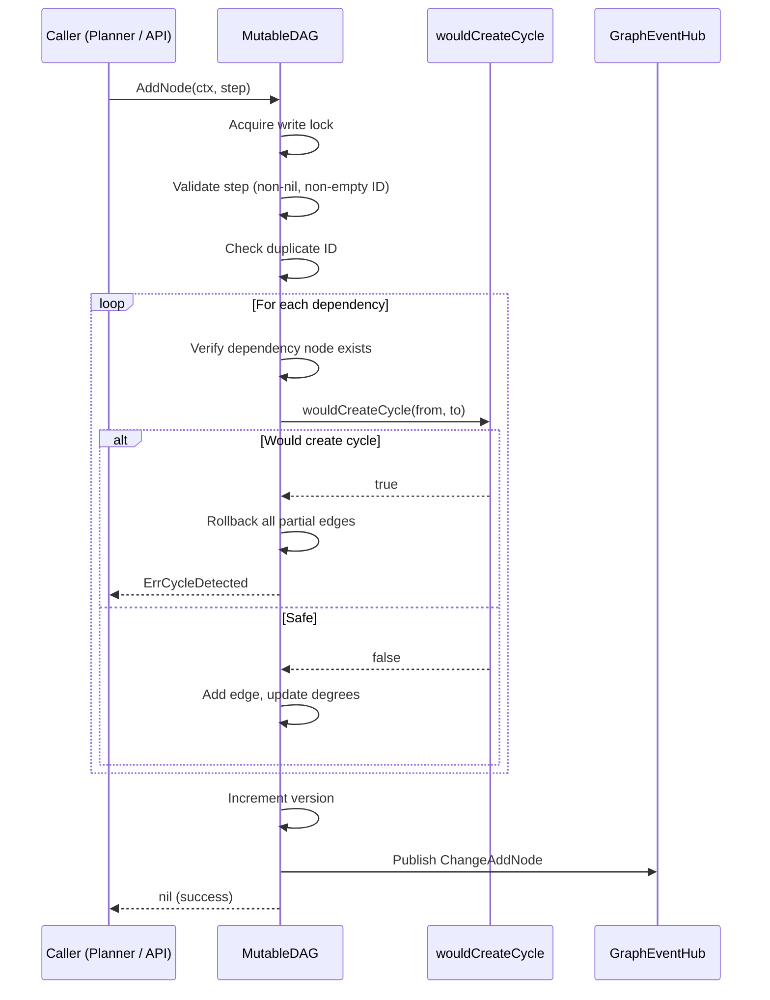
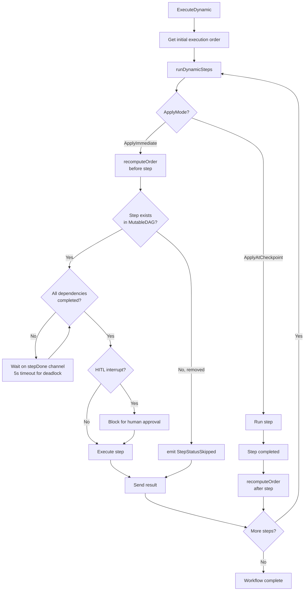
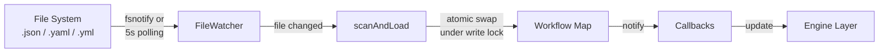
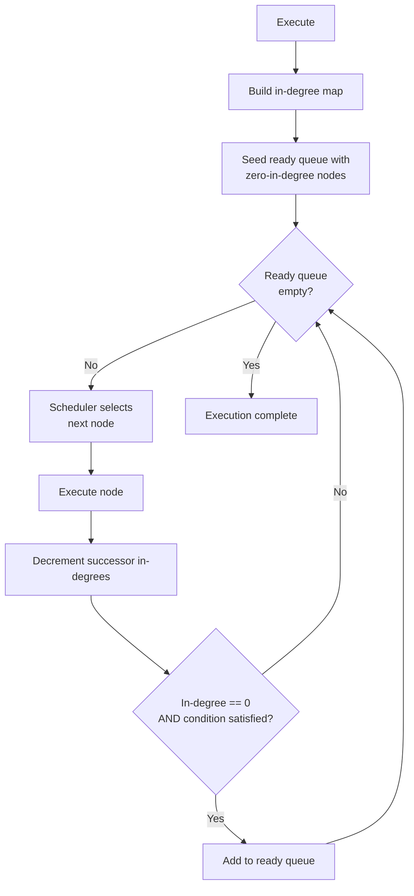
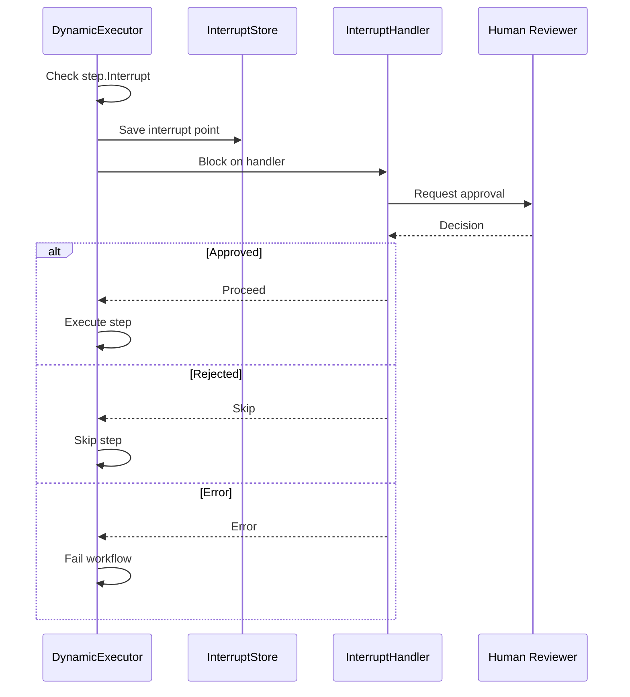

# Dynamic Graph

ares supports runtime graph mutation -- add nodes, remove edges, hot-reload from YAML -- while the workflow is executing. The `DynamicExecutor` recomputes the topological order between steps and applies mutations without stopping.

## Architecture

The dynamic graph system has three layers:



## Core Data Structures

### DAG

The immutable graph representation from `internal/workflow/engine/types.go`:

- `Nodes map[string]*DAGNode` -- node registry
- `Edges map[string][]string` -- adjacency list
- Each `DAGNode` tracks `InDegree` and `OutDegree` for topological sort

### MutableDAG

Thread-safe wrapper from `internal/workflow/engine/mutable_dag.go`:

```go
type MutableDAG struct {
    mu      sync.RWMutex
    dag     *DAG
    steps   map[string]*Step
    version uint64
    hub     *GraphEventHub
}

func NewMutableDAG(steps []*Step) (*MutableDAG, error) {
    dag, err := NewDAG(steps)  // validates + cycle detection
    if err != nil {
        return nil, err
    }
    stepsMap := make(map[string]*Step, len(steps))
    for _, s := range steps {
        stepsMap[s.ID] = s
    }
    return &MutableDAG{dag: dag, steps: stepsMap, hub: NewGraphEventHub()}, nil
}
```

### Step

Workflow step with `ID`, `Name`, `AgentType`, `Input`, `DependsOn []string`, `Timeout`, `RetryPolicy`, `Interrupt` (HITL config), and `Status`.

## Graph Lifecycle

### 1. Construction



`NewDAG` runs `hasCycle()` -- a DFS with recursion stack. If a node in the current DFS path is revisited, a cycle exists.

`GetExecutionOrder()` uses Kahn's algorithm (BFS-based topological sort) from `internal/workflow/engine/types.go:227-249`:

```go
func (d *DAG) GetExecutionOrder() ([]string, error) {
    inDegree := make(map[string]int)
    for node := range d.Nodes {
        inDegree[node] = d.Nodes[node].InDegree
    }

    queue := make([]string, 0)
    for node, degree := range inDegree {
        if degree == 0 {
            queue = append(queue, node)
        }
    }

    result := make([]string, 0, len(d.Nodes))
    for len(queue) > 0 {
        node := queue[0]
        queue = queue[1:]
        result = append(result, node)

        for _, neighbor := range d.Edges[node] {
            inDegree[neighbor]--
            if inDegree[neighbor] == 0 {
                queue = append(queue, neighbor)
            }
        }
    }

    if len(result) != len(d.Nodes) {
        return nil, ErrCycleDetected
    }
    return result, nil
}
```

### 2. Runtime Mutation

All mutations acquire a write lock and are validated before applying:



**Incremental cycle detection** (`wouldCreateCycle`): BFS from `to`, following outgoing edges. If `from` is reachable from `to`, adding edge `from->to` would create a cycle.

The actual AddNode code with rollback from `internal/workflow/engine/mutable_dag.go:80-123`:

```go
for _, dep := range step.DependsOn {
    if _, exists := m.dag.Nodes[dep]; !exists {
        // Rollback: remove the node and any edges added so far.
        delete(m.dag.Nodes, step.ID)
        for _, e := range addedEdges {
            m.removeEdgeFromSlice(e.from, e.to)
            m.dag.Nodes[e.from].OutDegree--
            m.dag.Nodes[e.to].InDegree--
        }
        return ErrInvalidDependency
    }

    // Check for cycle before adding edge.
    if m.wouldCreateCycle(dep, step.ID) {
        // Rollback.
        delete(m.dag.Nodes, step.ID)
        for _, e := range addedEdges {
            m.removeEdgeFromSlice(e.from, e.to)
            m.dag.Nodes[e.from].OutDegree--
            m.dag.Nodes[e.to].InDegree--
        }
        return ErrCycleDetected
    }

    m.dag.Edges[dep] = append(m.dag.Edges[dep], step.ID)
    m.dag.Nodes[step.ID].InDegree++
    m.dag.Nodes[dep].OutDegree++
    addedEdges = append(addedEdges, addedEdge{from: dep, to: step.ID})
}

m.steps[step.ID] = step
m.version++
```

The BFS cycle check from `internal/workflow/engine/mutable_dag.go:407-431`:

```go
func (m *MutableDAG) wouldCreateCycle(from, to string) bool {
    visited := make(map[string]bool)
    queue := []string{to}

    for len(queue) > 0 {
        current := queue[0]
        queue = queue[1:]

        if current == from {
            return true  // from is reachable from to -> cycle
        }

        if visited[current] {
            continue
        }
        visited[current] = true

        for _, neighbor := range m.dag.Edges[current] {
            if !visited[neighbor] {
                queue = append(queue, neighbor)
            }
        }
    }
    return false
}
```

Four mutation operations:

| Operation | Validation | Rollback |
|-----------|-----------|----------|
| `AddNode` | Duplicate ID, dependency existence, cycle check | Removes all partial edges + node |
| `RemoveNode` | No dependents (`ErrNodeHasDependents`) | N/A (fails fast) |
| `AddEdge` | Both nodes exist, no duplicate edge, cycle check | N/A (fails fast) |
| `RemoveEdge` | Both nodes exist, edge exists | N/A (fails fast) |

### 3. Execution with Mutations

The `DynamicExecutor` supports mid-execution graph changes:



**ApplyMode** controls when mutations take effect:
- `ApplyAtCheckpoint` (default): recomputes order after each step completes
- `ApplyImmediate`: recomputes before each step starts

**recomputeOrder** is the mutation integration point. The actual code from `internal/workflow/engine/dynamic_executor.go:576-615`:

```go
func (e *DynamicExecutor) recomputeOrder(
    mutableDAG *MutableDAG,
    lastVersion *uint64,
    currentOrder *[]string,
    completed map[string]bool,
    processed map[string]bool,
    mu *sync.Mutex,
) {
    // M9 fix: hold mu across the entire version-check-and-update
    // to prevent concurrent calls from appending duplicate steps.
    mu.Lock()
    defer mu.Unlock()

    currentVersion := mutableDAG.Version()
    if *lastVersion == currentVersion {
        return
    }

    newOrder, err := mutableDAG.GetExecutionOrder()
    if err != nil {
        slog.Warn("recomputeOrder failed, keeping existing order", "error", err)
        *lastVersion = currentVersion  // prevent repeated detection
        return
    }

    *lastVersion = currentVersion

    // Find steps in newOrder not yet in currentOrder.
    existing := make(map[string]bool, len(*currentOrder))
    for _, id := range *currentOrder {
        existing[id] = true
    }
    for _, id := range newOrder {
        if !existing[id] {
            *currentOrder = append(*currentOrder, id)
        }
    }
}
```

The `mu` lock prevents a race where two concurrent `recomputeOrder` calls both detect the same version change and append duplicate steps.

### 4. Hot-Reload

The `WorkflowReloader` watches a directory for file changes:



- `fsnotify` for real-time file change events
- Falls back to 5-second polling if fsnotify is unavailable
- Atomic swap under write lock prevents TOCTOU races
- Deep-copy of workflow map before passing to callbacks prevents mutation of shared state

## Graph Execution Engine (State-Based)

The `Graph.Execute(ctx, state)` method from `internal/workflow/graph/executor.go`:



Three node types:
- **AgentNode** -- wraps `base.Agent`, calls `Process(ctx, input)`
- **ToolNode** -- wraps `core.Tool`, calls `Execute(ctx, params)`
- **FuncNode** -- wraps `func(context.Context, *State) error`

Three pluggable schedulers:
- **DefaultScheduler** -- FIFO
- **PriorityScheduler** -- highest priority first
- **ShortJobScheduler** -- shortest estimated time first

Condition evaluation: `hasAnySatisfiedEdge` prevents ghost execution (all conditions false) and silent node loss.

## Graph Event Hub

Every mutation publishes a `GraphEvent` through the `GraphEventHub`:

```go
type GraphEvent struct {
    Change  GraphChange
    Success bool
    Error   error
}

type GraphChange struct {
    Type      ChangeType  // ChangeAddNode, ChangeRemoveNode, ChangeAddEdge, ChangeRemoveEdge
    NodeID    string
    FromID    string
    ToID      string
    Step      *Step
    Timestamp time.Time
}
```

- `Subscribe()` returns a buffered channel (buffer size 64)
- `Publish()` is non-blocking: drops events if subscriber buffer is full
- `Unsubscribe()` removes and closes the channel

## HITL (Human-in-the-Loop)

The `DynamicExecutor` checks `step.Interrupt` before dispatching each step:



`InterruptStore` persists interrupt state for crash recovery. `MemoryInterruptStore` is the in-memory implementation.

## YAML Configuration

Example graph config:

```yaml
graph:
  id: my-workflow
  start_node: analyze

  nodes:
    - id: analyze
      type: agent
      description: Analyze input

    - id: decide
      type: function
      description: Route based on analysis

    - id: search
      type: tool
      description: Search knowledge base

    - id: generate
      type: agent
      description: Generate response

  edges:
    - from: analyze
      to: decide

    - from: decide
      to: search
      condition: "confidence < 0.8"

    - from: decide
      to: generate

    - from: search
      to: generate

  agents:
    - id: analyzer
      type: llm
      model: gpt-4

    - id: generator
      type: llm
      model: gpt-4
```

## Configuration Constants

| Parameter | Default | Description |
|-----------|---------|-------------|
| `DefaultMaxParallel` | 10 | Max parallel step executions |
| `DefaultStepTimeout` | 10s | Per-step timeout |
| `DefaultWorkflowTimeout` | 5min | Total workflow timeout |
| `DefaultMaxWorkflowSize` | 100 | Max steps per workflow |
| `DefaultMaxDependencies` | 10 | Max dependencies per step |
