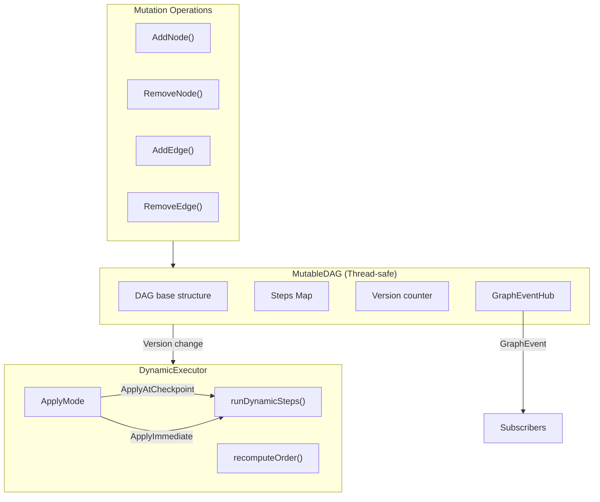

# Runtime Dynamic Graph

**Updated**: 2026-06-10

## Problem

In v1, the DAG (Directed Acyclic Graph) is immutable after construction. Runtime modifications are not possible:

- Cannot add new steps or remove existing ones
- Cannot modify dependencies between steps
- Cannot dynamically adjust the workflow based on execution results

## Solution

v2 introduces `MutableDAG` + `DynamicExecutor`, supporting thread-safe graph mutations and dynamic reordering during execution.

## Architecture



## Key Components

### MutableDAG

Located at `internal/workflow/engine/mutable_dag.go`. Extends `DAG` with thread-safe mutation operations.

```go
// Create initial DAG: A -> B -> C
steps := []*engine.Step{
    {ID: "A", Name: "Step A"},
    {ID: "B", Name: "Step B", DependsOn: []string{"A"}},
    {ID: "C", Name: "Step C", DependsOn: []string{"B"}},
}
dag, err := engine.NewMutableDAG(steps)
```

#### AddNode

Adds a new node, validates dependency existence, and checks for cycles. If a cycle is detected, automatically rolls back added edges.

```go
// Add node D depending on B: A -> B -> C, B -> D
err := dag.AddNode(ctx, &engine.Step{
    ID:        "D",
    Name:      "Step D",
    DependsOn: []string{"B"},
})
```

#### RemoveNode

Removes a node and its associated edges. Returns `ErrNodeHasDependents` if other nodes depend on it.

```go
err := dag.RemoveNode(ctx, "C")
// Returns ErrNodeHasDependents if C is depended on by other nodes
```

#### AddEdge

Adds a directed edge with incremental cycle detection.

```go
err := dag.AddEdge(ctx, "C", "D")
// Attempt to add an edge that would create a cycle
err = dag.AddEdge(ctx, "D", "A") // Returns ErrCycleDetected
```

#### RemoveEdge

Removes a directed edge.

```go
err := dag.RemoveEdge(ctx, "A", "B")
```

### Incremental Cycle Detection

`wouldCreateCycle(from, to)` uses BFS starting from `to` following outgoing edges. If `from` is reachable, adding `from->to` would create a cycle.

```go
func (m *MutableDAG) wouldCreateCycle(from, to string) bool {
    visited := make(map[string]bool)
    queue := []string{to}

    for len(queue) > 0 {
        current := queue[0]
        queue = queue[1:]
        if current == from {
            return true
        }
        if visited[current] {
            continue
        }
        visited[current] = true
        for _, neighbor := range m.dag.Edges[current] {
            if !visited[neighbor] {
                queue = append(queue, neighbor)
            }
        }
    }
    return false
}
```

### DynamicExecutor

Located at `internal/workflow/engine/dynamic_executor.go`. Supports graph mutations during execution.

#### ApplyMode

Two application modes:

```go
type ApplyMode int

const (
    ApplyAtCheckpoint ApplyMode = iota // Recompute order after each step completes
    ApplyImmediate                     // Recompute order before each step starts
)
```

- **ApplyAtCheckpoint**: Checks for DAG version changes after step completion, appends new steps to the execution queue
- **ApplyImmediate**: Checks for DAG version changes before step start, suitable for scenarios requiring fast response to mutations

#### Creation and Configuration

```go
executor := engine.NewDynamicExecutor(
    registry,                  // AgentRegistry (optional)
    engine.ApplyAtCheckpoint,  // apply mode
    engine.WithMaxParallel(5), // max parallelism
    engine.WithStepTimeout(60 * time.Second), // step timeout
)
```

#### Execution

```go
result, err := executor.ExecuteDynamic(ctx, workflow, initialInput, dag)
// ExecuteDynamic tracks DAG version changes internally
// Newly added steps are automatically appended to the execution queue
```

### GraphEventHub

Located at `internal/workflow/engine/graph_events.go`. Provides pub/sub notifications for graph mutations.

```go
// Subscribe to mutation events
events := dag.Subscribe()

// Listen in another goroutine
go func() {
    for event := range events {
        fmt.Printf("Change type: %d, success: %v\n",
            event.Change.Type, event.Success)
    }
}()

// Unsubscribe
id, ch := hub.Subscribe()
hub.Unsubscribe(id)
```

Event types:

| ChangeType | Constant | Description |
|-----------|----------|-------------|
| `ChangeAddNode` | 0 | Node added |
| `ChangeRemoveNode` | 1 | Node removed |
| `ChangeAddEdge` | 2 | Edge added |
| `ChangeRemoveEdge` | 3 | Edge removed |

### Thread Safety

`MutableDAG` uses `sync.RWMutex` to protect all operations:

- Mutation operations (Add/Remove) use write lock
- Read operations (GetExecutionOrder/Snapshot/Steps) use read lock
- `Version()` uses read lock for `DynamicExecutor` to detect changes
- `Snapshot()` returns a deep copy, safe for concurrent reads

## Complete Example

See `examples/v2_demo/mutable_dag/main.go`:

```go
ctx := context.Background()

// Create initial DAG
dag, _ := engine.NewMutableDAG([]*engine.Step{
    {ID: "A", Name: "Step A"},
    {ID: "B", Name: "Step B", DependsOn: []string{"A"}},
    {ID: "C", Name: "Step C", DependsOn: []string{"B"}},
})

// Subscribe to mutation events
events := dag.Subscribe()

// Add node at runtime
dag.AddNode(ctx, &engine.Step{
    ID: "D", DependsOn: []string{"B"},
})

// Add edge at runtime
dag.AddEdge(ctx, "C", "D")

// Cycle detection
dag.AddEdge(ctx, "D", "A") // Returns ErrCycleDetected

// Get snapshot for concurrent reads
snapshot := dag.Snapshot()
```

## Notes

- All mutation operations accept `context.Context` for cancellation support
- `AddNode` automatically rolls back added edges when a cycle is detected
- `RemoveNode` requires no downstream dependencies; remove or re-wire dependency edges first
- `GraphEventHub` uses buffered channels (64); drops events when full
- `DynamicExecutor` detects deadlocks (5 seconds of no progress) and returns an error
