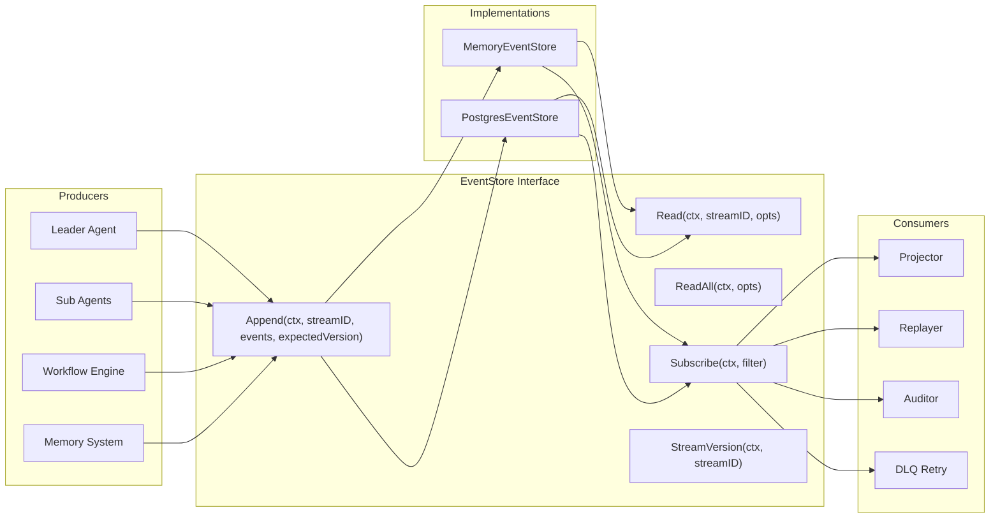
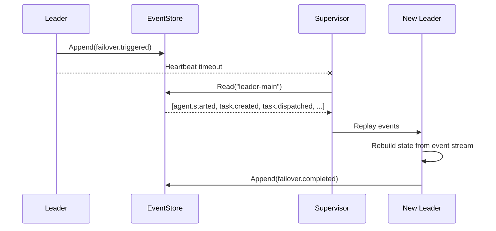

# Event Sourcing

**Updated**: 2026-06-11

## Overview

Event Sourcing captures every state change as an immutable event. Instead of overwriting current state, the system appends events to an ordered log. Current state is derived by replaying events from the beginning (or from a snapshot).

For agent systems this matters because:

- **Auditability**: Every decision, task dispatch, and failover is recorded with a timestamp and version.
- **Replay**: Rebuild any agent's state by replaying its event stream. Critical for leader failover and agent resurrection.
- **Decoupling**: Producers (Leader, Sub-agents, Workflow) write events independently. Consumers (Projector, Auditor, DLQ) subscribe and react asynchronously.
- **Optimistic concurrency**: Version-based conflict detection prevents silent data corruption when multiple agents write to the same stream.

## Architecture



## Event Types

20 event types organized by domain:

### Agent Lifecycle

| Event | Type | Description |
|-------|------|-------------|
| Agent Started | `agent.started` | Agent instance has started |
| Agent Stopped | `agent.stopped` | Agent gracefully stopped |
| Agent Failed | `agent.failed` | Agent encountered a fatal error |
| Agent Recovered | `agent.recovered` | Agent recovered from failure |

### Task Lifecycle

| Event | Type | Description |
|-------|------|-------------|
| Task Created | `task.created` | New task created by Leader |
| Task Dispatched | `task.dispatched` | Task sent to a Sub-agent |
| Task Completed | `task.completed` | Task finished successfully |
| Task Failed | `task.failed` | Task execution failed |

### Session & Memory

| Event | Type | Description |
|-------|------|-------------|
| Session Created | `session.created` | New conversation session started |
| Message Added | `message.added` | Message added to session |
| Memory Distilled | `memory.distilled` | Memory distillation pipeline completed |

### Workflow

| Event | Type | Description |
|-------|------|-------------|
| Workflow Started | `workflow.started` | DAG workflow execution started |
| Step Completed | `step.completed` | Workflow step finished |
| Step Failed | `step.failed` | Workflow step failed |
| Step Skipped | `step.skipped` | Workflow step skipped (dependency failed) |

### Tool & LLM

| Event | Type | Description |
|-------|------|-------------|
| Tool Called | `tool.called` | Emitted when a tool is invoked |
| Tool Failed | `tool.failed` | Emitted when a tool call fails |
| LLM Call | `llm.call` | Emitted when LLM is called |

### Failover

| Event | Type | Description |
|-------|------|-------------|
| Failover Triggered | `failover.triggered` | Leader failover initiated |
| Failover Completed | `failover.completed` | Failover finished, new leader active |

## Core Types

### Event

```go
// Event represents something that happened in the system.
type Event struct {
    ID        string         `json:"id"`
    StreamID  string         `json:"stream_id"`
    Type      EventType      `json:"type"`
    Payload   map[string]any `json:"payload"`
    Metadata  map[string]any `json:"metadata,omitempty"`
    Version   int64          `json:"version"`
    Timestamp time.Time      `json:"timestamp"`
}
```

Each event belongs to a **stream** (identified by `StreamID`). The `Version` field is monotonically increasing per stream and used for optimistic concurrency control.

### EventStore Interface

```go
// EventStore defines the interface for appending, reading, and subscribing to events.
type EventStore interface {
    Append(ctx context.Context, streamID string, events []*Event, expectedVersion int64) error
    Read(ctx context.Context, streamID string, opts ReadOptions) ([]*Event, error)
    ReadAll(ctx context.Context, opts ReadOptions) ([]*Event, error)
    Subscribe(ctx context.Context, filter EventFilter) (<-chan *Event, error)
    StreamVersion(ctx context.Context, streamID string) (int64, error)
}
```

### Sentinel Errors

| Error | Meaning |
|-------|---------|
| `ErrVersionConflict` | Optimistic concurrency violation on append |
| `ErrStreamNotFound` | Requested stream does not exist |
| `ErrEventStoreClosed` | Store is closed, operations rejected |

## Usage

### Creating and Appending Events

```go
store := events.NewMemoryEventStore()

// Create events
evt := &events.Event{
    Type:    events.EventTaskCreated,
    Payload: map[string]any{"task_id": "task-1", "description": "analyze data"},
}

// Append to stream (expectedVersion=0 for new stream)
err := store.Append(ctx, "leader-main", []*events.Event{evt}, 0)
if err != nil {
    log.Fatal(err)
}
```

### Reading Events

```go
// Read all events from a stream
evts, err := store.Read(ctx, "leader-main", events.ReadOptions{})

// Read with pagination and filtering
evts, err := store.Read(ctx, "leader-main", events.ReadOptions{
    FromVersion: 5,
    Limit:       10,
    Direction:   events.ReadAscending,
})

// Read events since a specific time
evts, err := store.Read(ctx, "leader-main", events.ReadOptions{
    Since: time.Now().Add(-1 * time.Hour),
})

// Read across all streams
allEvts, err := store.ReadAll(ctx, events.ReadOptions{
    Direction: events.ReadDescending,
    Limit:     100,
})
```

### Subscribing to Events

```go
filter := events.EventFilter{
    Types: []events.EventType{
        events.EventTaskCompleted,
        events.EventTaskFailed,
    },
}

ch, err := store.Subscribe(ctx, filter)

go func() {
    for evt := range ch {
        fmt.Printf("Task event: %s at %v\n", evt.Type, evt.Timestamp)
    }
}()
```

### Optimistic Concurrency

```go
// Read current version
version, _ := store.StreamVersion(ctx, "leader-main")

// Append with expected version - fails if another writer changed the stream
err := store.Append(ctx, "leader-main", newEvents, version)
if errors.Is(err, events.ErrVersionConflict) {
    // Re-read and retry
}
```

## Implementations

### MemoryEventStore

In-memory store for development, testing, and prototyping. Not for production.

```go
store := events.NewMemoryEventStore()
defer store.Close()

// All operations are thread-safe (sync.RWMutex internally)
_ = store.Append(ctx, "stream-1", events, 0)
evts, _ := store.Read(ctx, "stream-1", events.ReadOptions{})
```

Characteristics:
- Thread-safe via `sync.RWMutex`
- Non-blocking subscriber notifications (drops events if buffer full)
- Automatic cleanup on `Close()` (closes all subscriber channels)

### PostgresEventStore

Production-ready store backed by PostgreSQL with transactional writes.

```go
pool, _ := postgres.NewPool(ctx, cfg)
store := events.NewPostgresEventStore(pool)

// Same interface, persistent storage
_ = store.Append(ctx, "leader-main", events, 0)
```

Characteristics:
- Transactional append with row-level locking
- Unique constraint on `(stream_id, version)` catches concurrent conflicts at the DB level
- Subscription via polling (1-second interval) with cursor-based pagination
- Automatic rollback on error

Requires the `events` table:

```sql
CREATE TABLE events (
    id          TEXT PRIMARY KEY,
    stream_id   TEXT NOT NULL,
    type        TEXT NOT NULL,
    payload     JSONB NOT NULL DEFAULT '{}',
    metadata    JSONB,
    version     BIGINT NOT NULL,
    created_at  TIMESTAMPTZ NOT NULL DEFAULT NOW(),
    UNIQUE (stream_id, version)
);
CREATE INDEX idx_events_stream_version ON events (stream_id, version);
CREATE INDEX idx_events_created_at ON events (created_at);
```

## Integration with Leader Failover

Event sourcing replaces checkpoint-based recovery with a complete event log. Instead of periodic snapshots, every state transition is recorded:



The new leader replays the event stream to reconstruct:
- Which tasks were dispatched but not completed
- Which agents were active
- The last known session state

This is more reliable than checkpoints because no state is lost between snapshots.

## DLQ Auto-Retry

Failed message processing integrates with the Dead Letter Queue (DLQ) in `internal/protocol/ahp/dlq.go`. The `DLQProcessor` retries failed entries on a configurable interval:

```go
dlq := ahp.NewDLQ(10000)
processor := ahp.NewDLQProcessor(dlq)

// Register handler for specific failure reasons
processor.RegisterHandler("timeout", func(ctx context.Context, entry *ahp.DLQEntry) error {
    // Retry the message
    return retryMessage(ctx, entry.Message)
})

// Start background auto-retry (uses errgroup internally)
processor.StartAutoRetry(ctx, 30*time.Second)
```

Key behaviors:
- Entries with `MaxRetries > 0` are skipped once exhausted
- `MaxRetriesUnlimited` (0) means infinite retries
- Successfully processed entries are removed from the DLQ
- Stats available via `processor.Stats()` (processed, failed counts)

## Reliability

### Event Loss Prevention

- **MemoryEventStore**: Events are in-memory only. Lost on process crash. Use for testing.
- **PostgresEventStore**: Events are persisted in PostgreSQL with WAL. Survives crashes. Use for production.
- Subscriber channels are buffered (size 1). Full buffers drop events (non-blocking). Consumers must keep up.

### Version Conflict Handling

When two writers attempt to append to the same stream concurrently:

1. Writer A reads version=5, prepares events
2. Writer B reads version=5, appends first (version becomes 6)
3. Writer A appends with expectedVersion=5, receives `ErrVersionConflict`
4. Writer A re-reads (version=6), retries with expectedVersion=6

This is optimistic concurrency control. No locks are held during the read-modify-write cycle. The PostgreSQL implementation adds a `UNIQUE(stream_id, version)` constraint as a safety net.

## Benchmarks

Platform: darwin/arm64, Apple M3 Max, Go 1.26.4

| Operation | ns/op | allocs/op | Notes |
|-----------|-------|-----------|-------|
| Append (single event) | 489 | 7 | Single stream, 100 round-robin |
| Append (batch 100) | 4,349 | 1 | 100 events per append |
| Read (1000 events) | 5,757 | 11 | Full stream scan |
| ReadAll (10,000 events) | 36,391 | 3 | 10 streams x 1000 events |
| Subscribe (100 subs) | 118,892 | 799 | 100 filtered subscriptions |
| Concurrent Append | 707 | 6 | Parallel writes, 50 streams |

All MemoryEventStore benchmarks. PostgreSQL performance depends on connection pool, disk I/O, and index configuration.

## Configuration

No external configuration required for `MemoryEventStore`.

For `PostgresEventStore`, pass an existing `postgres.Pool`:

```go
pool, err := postgres.NewPool(ctx, &postgres.Config{
    Host:     "localhost",
    Port:     5433,
    Database: "goagent",
    User:     "postgres",
    Password: "postgres",
})
if err != nil {
    log.Fatal(err)
}

store := events.NewPostgresEventStore(pool)
```

## Source Files

| File | Description |
|------|-------------|
| `internal/ares_events/types.go` | Event struct, EventType constants, ReadOptions, EventFilter |
| `internal/ares_events/store.go` | EventStore interface, NewEventID |
| `internal/ares_events/memory_store.go` | In-memory implementation |
| `internal/ares_events/pg_store.go` | PostgreSQL implementation |
