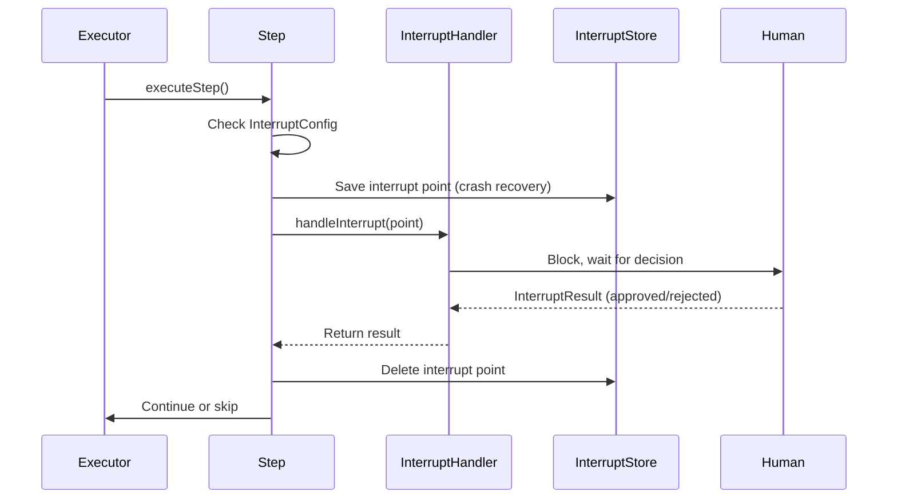

# Human-in-the-Loop (HITL)

**Updated**: 2026-06-11

## Overview

Human-in-the-Loop (HITL) allows workflow steps to pause execution and wait for human approval before proceeding. This is essential for approval workflows, review gates, and any scenario where automated decisions require human oversight.

## Architecture



## Key Components

### InterruptConfig

Marks a step as requiring human approval. Defined on the `Step` struct in `internal/workflow/engine/types.go`:

```go
type InterruptConfig struct {
    Message string         `json:"message"`
    Payload map[string]any `json:"payload,omitempty"`
}
```

Add it to any step:

```go
step := &engine.Step{
    ID:        "deploy-production",
    Name:      "Deploy to Production",
    AgentType: "deployer",
    DependsOn: []string{"staging-test"},
    Interrupt: &engine.InterruptConfig{
        Message: "Ready to deploy to production. Approve?",
        Payload: map[string]any{
            "environment": "production",
            "version":     "v2.1.0",
        },
    },
}
```

### InterruptPoint

Represents a paused execution point. Created automatically by the executor when a step with `Interrupt` config is reached:

```go
type InterruptPoint struct {
    StepID  string         `json:"step_id"`
    Message string         `json:"message"`
    Payload map[string]any `json:"payload,omitempty"`
}
```

### InterruptResult

Carries the human's decision:

```go
type InterruptResult struct {
    Approved bool           `json:"approved"`
    Feedback string         `json:"feedback,omitempty"`
    Data     map[string]any `json:"data,omitempty"`
}
```

### InterruptHandler

A function called when execution reaches an interrupt point. It blocks until the human provides input:

```go
type InterruptHandler func(ctx context.Context, point *InterruptPoint) (*InterruptResult, error)
```

### InterruptStore

Persists interrupt state for crash recovery. If the executor crashes while waiting for human input, the interrupt point survives and can be resumed:

```go
type InterruptStore interface {
    Save(ctx context.Context, executionID string, point *InterruptPoint) error
    Load(ctx context.Context, executionID string, stepID string) (*InterruptResult, error)
    Delete(ctx context.Context, executionID string, stepID string) error
    ListPending(ctx context.Context, executionID string) ([]*InterruptPoint, error)
    SaveResult(ctx context.Context, executionID string, stepID string, result *InterruptResult) error
}
```

A `MemoryInterruptStore` is provided for development and testing.

## Integration with DynamicExecutor

The `Executor` supports HITL via builder methods:

```go
executor := engine.NewExecutor(registry).
    WithHitlHandler(func(ctx context.Context, point *engine.InterruptPoint) (*engine.InterruptResult, error) {
        // Send notification to reviewer
        fmt.Printf("Step %q needs approval: %s\n", point.StepID, point.Message)

        // Block until human responds (e.g., via API, webhook, or CLI)
        result := waitForHumanDecision(point)

        return result, nil
    }).
    WithHitlStore(engine.NewMemoryInterruptStore())
```

The executor calls `handleInterrupt` before executing each step. If the step has no `Interrupt` config, execution proceeds normally. If the human rejects, the step is marked as `skipped`.

## Execution Flow

1. Executor reaches a step with `Interrupt` config
2. Interrupt point is persisted to `InterruptStore` (crash recovery)
3. `InterruptHandler` is called, blocking until human input
4. If approved: step executes normally, interrupt state is cleaned up
5. If rejected: step is skipped with `"rejected by human"` error
6. If handler fails: step fails with the handler error

## Use Cases

**Approval Workflows**
```go
Steps: []*engine.Step{
    {ID: "draft", Name: "Generate Draft", AgentType: "writer"},
    {ID: "review", Name: "Human Review", AgentType: "reviewer",
     Interrupt: &engine.InterruptConfig{
         Message: "Review the draft and approve for publishing",
     }},
    {ID: "publish", Name: "Publish", AgentType: "publisher",
     DependsOn: []string{"review"}},
}
```

**Review Gates**
```go
Steps: []*engine.Step{
    {ID: "code-gen", Name: "Generate Code", AgentType: "coder"},
    {ID: "security-scan", Name: "Security Scan", AgentType: "scanner",
     DependsOn: []string{"code-gen"}},
    {ID: "deploy-gate", Name: "Deploy Approval", AgentType: "deployer",
     DependsOn: []string{"security-scan"},
     Interrupt: &engine.InterruptConfig{
         Message: "Security scan passed. Approve deployment?",
         Payload: map[string]any{"scan_result": "passed"},
     }},
}
```

## Error Handling

| Scenario | Behavior |
|----------|----------|
| No `Interrupt` on step | Normal execution, no pause |
| `InterruptHandler` is nil | Step fails with `ErrInterruptHandlerNil` |
| Human rejects | Step skipped with `ErrInterruptRejected` |
| Handler returns error | Step fails with handler error |
| Handler returns nil result | Step fails with "nil result" error |
| Context cancelled | Handler should respect `ctx.Done()` |

## Configuration

| Component | Location | Description |
|-----------|----------|-------------|
| `InterruptConfig` | `Step.Interrupt` | Marks step for HITL |
| `InterruptHandler` | `Executor.hitlHandler` | Blocks for human input |
| `InterruptStore` | `Executor.hitlStore` | Persists interrupt state |
| `MemoryInterruptStore` | `engine` package | In-memory store (dev/test) |

## Notes

- Interrupt state is cleaned up after approval; no residual data
- The `InterruptStore` is optional; pass nil to skip crash recovery
- The handler runs inside the step goroutine; keep it responsive to context cancellation
- For production, implement a persistent `InterruptStore` (e.g., PostgreSQL-backed)
