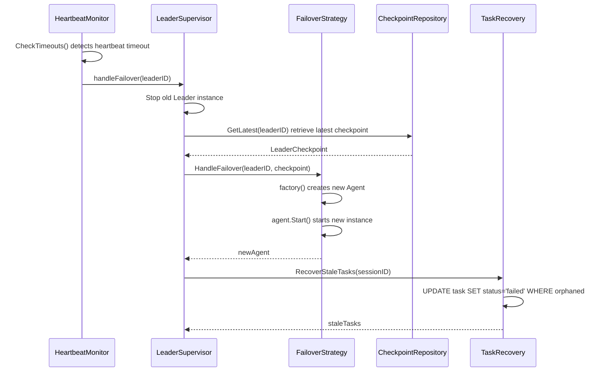

# Leader Failover

**Updated**: 2026-06-10

## Problem

In v1, the Leader Agent is responsible for task dispatch and result aggregation. When the Leader crashes:

- Session state is lost, interrupted tasks cannot be recovered
- No automatic detection mechanism, requires manual intervention
- Orphaned tasks (pending/running) on Sub Agents cannot be cleaned up

## Solution

v2 introduces a complete Leader failover chain:

```
HeartbeatMonitor detects timeout → LeaderSupervisor triggers callback →
ColdRestartStrategy creates new instance → CheckpointRepository restores state → TaskRecovery cleans orphaned tasks
```

## Architecture



## Key Components

### HeartbeatMonitor

Located at `internal/protocol/ahp/heartbeat.go`. Periodically detects agent heartbeats, marks timed-out agents as offline and triggers callbacks.

```go
// Configure heartbeat parameters
hbMon := ahp.NewHeartbeatMonitor(&ahp.HeartbeatConfig{
    Interval:  2 * time.Second,  // heartbeat interval
    Timeout:   5 * time.Second,  // timeout threshold
    MaxMissed: 2,                // max consecutive missed heartbeats
})

// Register timeout callback
hbMon.RegisterCallback(func(agentID string) {
    fmt.Printf("Agent %s timed out\n", agentID)
})
```

Key methods:
- `RecordHeartbeat(agentID)` - Record heartbeat, reset missed count
- `CheckTimeouts()` - Check all agents, mark timed-out ones as offline, trigger callbacks
- `RegisterCallback(fn)` - Register timeout callback

### LeaderSupervisor

Located at `internal/agents/leader/supervisor.go`. Orchestrates the entire failover process.

```go
supervisor, err := leader.NewLeaderSupervisor(
    hbMon,      // HeartbeatMonitor
    strategy,   // FailoverStrategy
    recovery,   // TaskRecovery (optional)
    checkpoint, // CheckpointRepository (optional)
    &leader.LeaderSupervisorConfig{
        CheckInterval:       10 * time.Second,
        FailoverTimeout:     2 * time.Minute,
        MaxFailoverAttempts: 3,
    },
)

supervisor.RegisterLeader("leader-1", agent)
supervisor.Start(ctx)
```

### FailoverStrategy

Interface definition:

```go
type FailoverStrategy interface {
    HandleFailover(ctx context.Context, leaderID string,
        checkpoint *LeaderCheckpoint) (base.Agent, error)
}
```

Built-in implementation `ColdRestartStrategy` - creates a new Agent instance via factory function:

```go
strategy, _ := leader.NewColdRestartStrategy(
    func(ctx context.Context, config interface{}) (base.Agent, error) {
        return NewLeaderAgent(config), nil
    },
    agentConfig,
)
```

### CheckpointRepository

Located at `internal/agents/leader/checkpoint.go`. Persists Leader state snapshots in PostgreSQL.

```go
type LeaderCheckpoint struct {
    LeaderID  string          `json:"leader_id"`
    SessionID string          `json:"session_id"`
    Status    string          `json:"status"`
    Metadata  json.RawMessage `json:"metadata"`
    UpdatedAt time.Time       `json:"updated_at"`
}
```

Operations:
- `Save(ctx, cp)` - UPSERT checkpoint to `leader_checkpoints` table
- `GetLatest(ctx, leaderID)` - Retrieve latest checkpoint
- `Delete(ctx, leaderID)` - Delete checkpoint

### TaskRecovery

Located at `internal/agents/leader/recovery.go`. Cleans up orphaned tasks after Leader crash.

```go
recovery := leader.NewTaskRecovery(pool)
staleTasks, err := recovery.RecoverStaleTasks(ctx, sessionID)
// Marks tasks with status=pending/running and output IS NULL as failed
```

## Failover Flow

1. **Detection**: `HeartbeatMonitor` periodically calls `CheckTimeouts()`. When an agent misses heartbeats exceeding `MaxMissed`, it is marked offline.
2. **Callback**: Triggers `LeaderSupervisor.handleFailover`, executed asynchronously via `errgroup`.
3. **Stop old instance**: Calls `agent.Stop(ctx)` to gracefully stop the old Leader.
4. **Restore state**: Retrieves the latest checkpoint from `CheckpointRepository`.
5. **Create new instance**: Calls `FailoverStrategy.HandleFailover`, retries up to `MaxFailoverAttempts` times.
6. **Clean orphaned tasks**: `TaskRecovery.RecoverStaleTasks` marks orphaned tasks as failed.
7. **Register new Leader**: Updates the supervisor's internal mapping.

## Complete Example

See `examples/v2_demo/leader_failover/main.go`:

```go
// 1. Create heartbeat monitor
hbMon := ahp.NewHeartbeatMonitor(&ahp.HeartbeatConfig{
    Interval:  2 * time.Second,
    Timeout:   5 * time.Second,
    MaxMissed: 2,
})

// 2. Create failover strategy
strategy, _ := leader.NewColdRestartStrategy(
    func(_ context.Context, _ interface{}) (base.Agent, error) {
        return &mockAgent{id: "leader-1"}, nil
    }, nil,
)

// 3. Create supervisor
supervisor, _ := leader.NewLeaderSupervisor(hbMon, strategy, nil, nil, nil)

// 4. Register Leader and start monitoring
supervisor.RegisterLeader("leader-1", agent)
supervisor.Start(ctx)
```

## Configuration

| Parameter | Default | Description |
|-----------|---------|-------------|
| `CheckInterval` | 10s | Supervisor heartbeat check interval |
| `FailoverTimeout` | 2min | Single failover attempt timeout |
| `MaxFailoverAttempts` | 3 | Maximum retry attempts |
| `HeartbeatConfig.Interval` | 5s | Heartbeat send interval |
| `HeartbeatConfig.Timeout` | 30s | Heartbeat timeout threshold |
| `HeartbeatConfig.MaxMissed` | 3 | Max consecutive missed heartbeats |

## Notes

- `CheckpointRepository` and `TaskRecovery` depend on PostgreSQL; pass nil for demos
- Callbacks execute outside locks to prevent deadlocks
- `ColdRestartStrategy` suits stateless recovery scenarios; implement custom `FailoverStrategy` for hot standby
