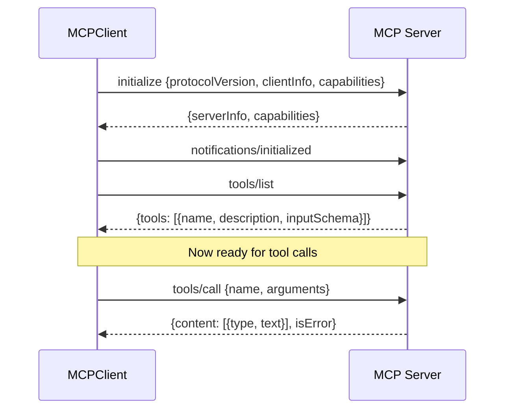
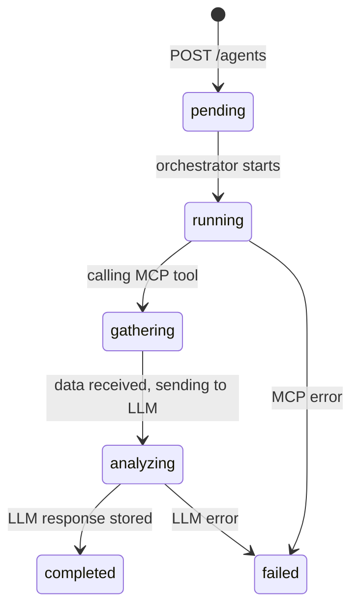
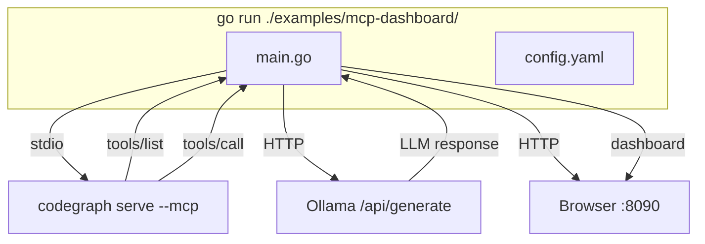

# MCP Client + Web Dashboard

## 1. Why This Design

### Problem

GoAgentX agents need to analyze code, but:
- Built-in tools (calculator, datetime, text) can't understand codebases
- Hardcoding tool integrations means every new source (GitHub, Jira, DB) requires code changes
- No way to see what agents are doing in real-time

### Approach

**MCP Client**: Don't reinvent tool integration. MCP is an open protocol — any server that implements it can plug into GoAgentX. The client auto-discovers tools, so adding a new data source = running a new MCP server, zero code changes.

**Dashboard**: Don't build a complex monitoring system. A single HTTP server with 6 endpoints + WebSocket covers observation (what are agents doing?) and interaction (launch new agents). No database, no message queue, no frontend build step.

### Tradeoffs

| Decision | Chosen | Alternative | Why |
|----------|--------|-------------|-----|
| Tool discovery | Auto via `tools/list` | Manual config per tool | MCP servers know their tools better than we do |
| Tool naming | `mcp.<server>.<tool>` | Flat names | Prevents collisions when two servers have same tool name |
| Transport | stdio + SSE | Only stdio | SSE enables remote servers (HTTP), stdio is simpler for local |
| Schema bridge | Convert JSON Schema → ParameterSchema | Keep JSON Schema | Existing validation pipeline expects ParameterSchema, no reason to change it |
| Dashboard backend | stdlib `net/http` | Gin, Echo, Fiber | No new framework dependency for 6 endpoints |
| Dashboard frontend | Vanilla JS, go:embed | React, Vue, build step | SPA is ~200 lines, not worth a build toolchain |
| State storage | In-memory | PostgreSQL | Dashboard is read-only observability, not a database |
| Agent execution | Goroutine per agent | Worker pool | Agents are I/O-bound (MCP + LLM calls), goroutines are cheap |

### What's NOT Supported (and Why)

- **MCP resource/prompt protocols**: Only tools are implemented. Resources and prompts are MCP extensions that few servers use. Can be added later if needed.
- **Transport reconnection**: If SSE drops, the client stops. Reconnection adds complexity (state replay, duplicate detection). Defer until a real use case needs it.
- **Agent persistence**: Agents live in memory. If the process restarts, history is lost. This is intentional — the dashboard is a dev/debug tool, not a production database.
- **Multi-user auth**: The dashboard has no auth. It's designed for local development. Add a reverse proxy with auth if exposing externally.

---

## 2. MCP Client

### 2.1 Protocol Flow



### 2.2 Tool Discovery vs Customization

**Both are supported.**

Auto-discovery happens at connect time — `tools/list` returns all tools the server exposes. No config needed for individual tools.

Customization happens at the API layer — users can create agents targeting any discovered tool with custom arguments and prompts:

```bash
# Auto-discovered: just use the tool name
curl -X POST /agents -d '{"mcp_tool":"codegraph_search","mcp_args":{"search":"func main"}}'

# Custom prompt: override how the LLM interprets the data
curl -X POST /agents -d '{"mcp_tool":"codegraph_context","mcp_args":{"task":"..."},"llm_prompt":"Your custom analysis instructions..."}'
```

### 2.3 Schema Conversion

MCP uses JSON Schema for tool parameters. GoAgentX uses `ParameterSchema`. The bridge:

```
JSON Schema                    ParameterSchema
─────────────────────────────  ─────────────────────────────
type: "object"            →    Type: "object"
properties.name.type      →    Properties["name"].Type
properties.name.enum      →    Properties["name"].Enum
properties.name.minimum   →    Properties["name"].Min
required: ["name"]        →    Required: []string{"name"}
```

This is a lossy conversion — JSON Schema supports nested objects, arrays, oneOf, etc. that ParameterSchema doesn't. For MCP tools (which typically have flat parameter schemas), this is fine. Complex schemas would need a richer parameter model.

### 2.4 Transport Choice

**stdio**: Launches a subprocess. Simple, no network config. Used for local tools like codegraph.

**SSE**: HTTP-based. Supports remote servers, auth headers. Used when the MCP server runs on a different machine.

The interface is the same — swapping transports is a config change, not a code change.

### 2.5 Adding Your Own MCP Server

Any process that speaks MCP over stdio or HTTP SSE works. Minimum implementation:

1. Respond to `initialize` with server info
2. Respond to `tools/list` with tool definitions
3. Respond to `tools/call` with results

Config:

```yaml
mcp:
  servers:
    - name: my-server
      transport:
        type: stdio
        stdio:
          command: /path/to/my-mcp-server
          args: ["--config", "my-config.json"]
```

---

## 3. Dashboard & Agent Orchestration

### 3.1 API

```
GET  /                → {uptime, agents, mcp_servers, mcp_tools}
GET  /agents          → [{id, name, status, progress, mcp_tool, analysis, ...}]
POST /agents          → create agent {template_id} or {name, mcp_tool, llm_prompt}
GET  /agents/{id}     → full agent detail including LLM analysis text
GET  /mcp             → [{name, connected, tools: [{name, description}]}]
GET  /ws              → WebSocket for real-time updates
```

### 3.2 Agent Lifecycle



Every state change broadcasts via WebSocket to `agents` channel subscribers.

### 3.3 Frontend Orchestration — How It Works

The Orchestrator tab in the dashboard provides:

**Template Selection**: Dropdown with pre-configured analysis types (Architecture Review, Error Handling, Concurrency, Impact, API Surface). Selecting a template auto-fills the MCP tool.

**Custom Agent Creation**: Users can specify:
- Agent name (free text)
- MCP tool (from discovered tools)
- LLM prompt (free text, supports `{{.raw_data}}` placeholder)

**Real-time Status**: Each agent shows:
- Status badge (pending/running/completed/failed)
- Progress bar (10% → 50% → 100%)
- Duration
- Click "View" to see full LLM analysis

**WebSocket Updates**: When an agent completes, the Agents tab auto-refreshes. No manual polling needed.

```mermaid
graph LR
    subgraph "Browser"
        SELECT[Select Template]
        CLICK[Click Launch]
        VIEW[View Results]
    end

    subgraph "API"
        POST[POST /agents]
        GET[GET /agents/:id]
        WS[/ws WebSocket]
    end

    subgraph "Backend"
        ORCH[Orchestrator]
        MCP[MCP Client]
        LLM[LLM]
    end

    SELECT --> CLICK --> POST --> ORCH
    ORCH --> MCP --> ORCH
    ORCH --> LLM --> ORCH
    ORCH -->|broadcast| WS --> VIEW
    VIEW --> GET
```

### 3.4 What You Can Do Right Now

| Action | How |
|--------|-----|
| See all agents | Dashboard → Agents tab, or `GET /agents` |
| Launch a pre-built analysis | Dashboard → Orchestrator → select template → Launch |
| Launch a custom analysis | `POST /agents` with custom `mcp_tool` + `llm_prompt` |
| Watch agent progress | Agents tab auto-refreshes via WebSocket |
| Read full analysis | Click "View" on any completed agent |
| See MCP tools | Dashboard → MCP tab, or `GET /mcp` |
| Filter agents by status | `GET /agents?status=completed` |
| Run periodic reviews | `go run . -interval 300` (every 5 min) |

### 3.5 What Could Be Added

| Feature | Effort | Value |
|---------|--------|-------|
| Agent chaining (output of A → input of B) | Medium | Multi-step analysis pipelines |
| Custom prompt editor in UI | Low | No-code agent creation |
| Result comparison (diff two analyses) | Medium | Track code quality over time |
| Agent cancellation | Low | Stop long-running agents |
| Export results (Markdown, JSON) | Low | Share analysis reports |
| Auth (API key or OAuth) | Medium | Multi-user / external access |

These are not implemented yet. The current system focuses on the core loop: discover tools → launch agents → see results.

---

## 4. Example: Code Review Service

### 4.1 What It Does

Standalone binary. Connects to codegraph MCP + Ollama, runs analysis agents, serves dashboard.



### 4.2 Agent Templates

| Template | MCP Tool | What It Analyzes |
|----------|----------|-----------------|
| Architecture Review | `codegraph_files` | Package organization, dependency flow, entry points |
| Error Handling Review | `codegraph_context` | Error wrapping patterns, sentinel errors, swallowed errors |
| Concurrency Review | `codegraph_context` | Goroutine management, race conditions, mutex usage |
| Change Impact Analysis | `codegraph_impact` | What breaks if an interface changes, migration strategy |
| API Surface Review | `codegraph_search` | Interface size, naming consistency, constructor patterns |

### 4.3 Running

```bash
# Prerequisites
ollama pull llama3.2
npm install -g codegraph && codegraph index /path/to/project

# Start
make demo-mcp TARGET=/path/to/project ADDR=:8090

# Or directly
go run ./examples/mcp-dashboard/ -config ./examples/mcp-dashboard/config.yaml -target /path/to/project -interval 300
```

### 4.4 Config

```yaml
llm:
  provider: "ollama"              # "openai", "ollama", "openrouter"
  base_url: "http://localhost:11434"
  model: "llama3.2"
  timeout: 120

mcp:
  servers:
    - name: codegraph
      transport:
        type: stdio
        stdio:
          command: codegraph
          args: ["serve", "--mcp"]

dashboard:
  addr: ":8090"
```

Dependencies: codegraph binary + Ollama running. No database.

---

## 5. File Layout

```
internal/mcp/               # MCP client implementation
├── jsonrpc.go              # JSON-RPC 2.0 types, encode/decode
├── transport.go            # Transport interface
├── transport_stdio.go      # Stdio subprocess transport
├── transport_sse.go        # HTTP SSE transport
├── types.go                # MCP protocol types
├── client.go               # MCPClient (connect, handshake, call)
├── mcp_tool.go             # MCPTool (core.Tool bridge)
├── schema.go               # JSON Schema → ParameterSchema
├── manager.go              # MCPManager (multi-server)
├── factory.go              # MCPToolFactory (PluginRegistry)
└── *_test.go               # 42 tests

internal/dashboard/          # Dashboard + orchestration
├── api.go                  # Unified API v2 (6 endpoints)
├── orchestrator.go         # Agent lifecycle manager
├── service.go              # DashboardService (legacy bridge)
├── types.go                # View types
├── ws.go                   # WebSocket message types
├── ws_hub.go               # WebSocket hub (channel pub/sub)
├── event_bridge.go         # EventStore → WebSocket
├── static.go               # go:embed
├── static/                 # SPA (HTML + JS + CSS, no build)
└── *_test.go               # 56 tests

examples/mcp-dashboard/      # Standalone service
├── main.go                 # Connects MCP + LLM, serves dashboard
└── config.yaml
```
