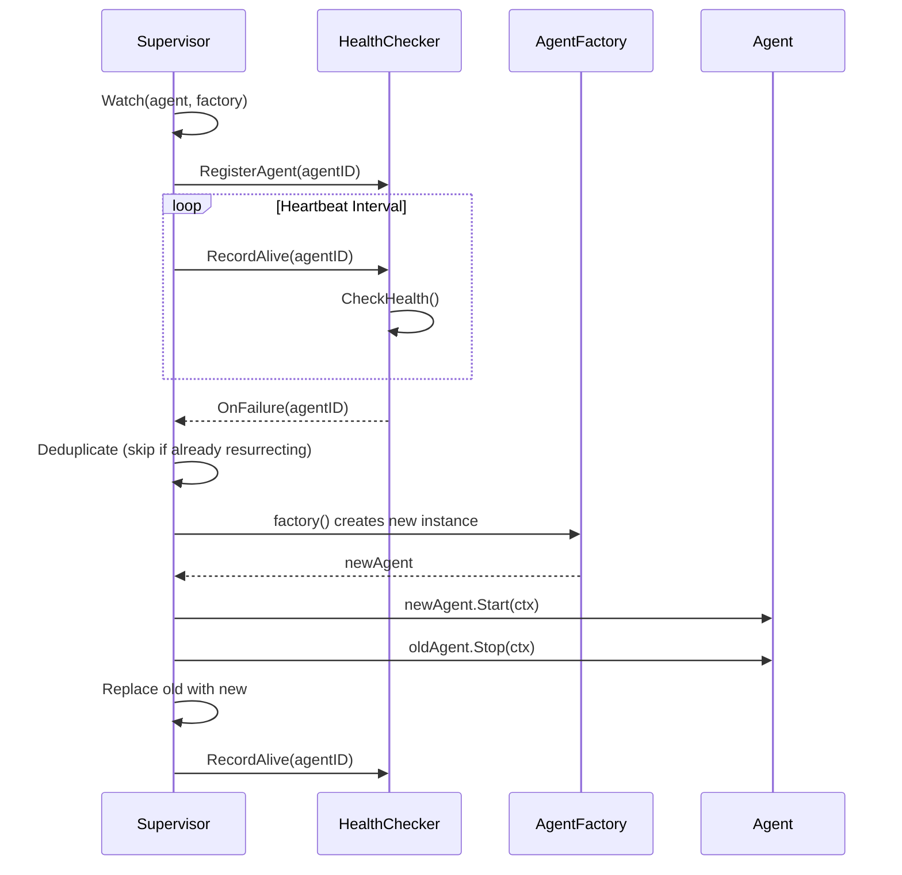

# Agent Resurrection Plugin

**Updated**: 2026-06-11

## Overview

The resurrection plugin provides pluggable agent resurrection. Any agent type can be monitored and automatically recreated on failure. The plugin decouples health detection from resurrection logic via the `HealthChecker` interface.

## Architecture



## Key Components

### HealthChecker Interface

Abstracts health detection. Implementations can be heartbeat monitors, HTTP probes, or process watchers:

```go
type HealthChecker interface {
    RegisterAgent(agentID string)
    UnregisterAgent(agentID string)
    RecordAlive(agentID string)
    CheckHealth() []string
    OnFailure(fn func(agentID string))
}
```

### AgentFactory

Creates a fresh agent instance. Must return a new instance each time -- reusing old instances may carry stale state:

```go
type AgentFactory func() base.Agent
```

### Supervisor

Monitors agents and resurrects them on failure. Depends only on the `HealthChecker` interface:

```go
type Supervisor struct {
    // unexported fields
}
```

Key methods:
- `Watch(agent, factory)` -- register an agent for monitoring
- `Unwatch(agentID)` -- stop monitoring
- `Start(ctx)` -- begin the monitoring loop
- `Stop()` -- gracefully stop
- `Agent(agentID)` -- get current instance
- `Stats()` -- supervisor statistics

### HeartbeatAdapter

Bridges `ahp.HeartbeatMonitor` to the `HealthChecker` interface, decoupling the resurrection plugin from the AHP package:

```go
type HeartbeatAdapter struct {
    mon       *ahp.HeartbeatMonitor
    onFailure func(agentID string)
}

func NewHeartbeatAdapter(mon *ahp.HeartbeatMonitor) *HeartbeatAdapter
```

### Config

```go
type Config struct {
    CheckInterval     time.Duration `yaml:"check_interval"`
    ResurrectTimeout  time.Duration `yaml:"resurrect_timeout"`
    MaxAttempts       int           `yaml:"max_attempts"`
    HeartbeatInterval time.Duration `yaml:"heartbeat_interval"`
}
```

| Parameter | Default | Description |
|-----------|---------|-------------|
| `CheckInterval` | 10s | How often to probe agent health |
| `ResurrectTimeout` | 60s | Max time for a single resurrection |
| `MaxAttempts` | 3 | Max retries per resurrection |
| `HeartbeatInterval` | 5s | How often to send heartbeats |

## Usage Example

```go
// Create heartbeat monitor.
hbMon := ahp.NewHeartbeatMonitor(&ahp.HeartbeatConfig{
    Interval:  2 * time.Second,
    Timeout:   3 * time.Second,
    MaxMissed: 2,
})

// Create resurrection plugin with heartbeat adapter.
health := resurrection.NewHeartbeatAdapter(hbMon)
supervisor, err := resurrection.New(health, resurrection.Config{
    CheckInterval:     3 * time.Second,
    HeartbeatInterval: 2 * time.Second,
})

// Register agents with factories.
agent := newWorker("worker-1", models.AgentTypeBottom)
agent.Start(ctx)

supervisor.Watch(agent, func() base.Agent {
    return newWorker("worker-1", models.AgentTypeBottom)
})

// Start monitoring.
supervisor.Start(ctx)

// On failure: supervisor detects via HealthChecker,
// calls factory, starts new instance, stops old instance.
```

<<<<<<< HEAD
Full example: `examples/v2_demo/agent_resurrection/main.go`
=======
Full example: `examples/advanced/agent_resurrection/main.go`
>>>>>>> 3f3093d ( feat(v2): runtime layer, event sourcing, dynamic workflow, HITL, pluggable vector store + 50 bug fixes)

## Resurrection Flow

1. **Detection**: `HealthChecker.CheckHealth()` returns failed agent IDs
2. **Callback**: `OnFailure` callback triggers `onFailure` in the supervisor
3. **Deduplication**: Skip if already resurrecting this agent
4. **Create new instance**: Call `AgentFactory`, retry up to `MaxAttempts`
5. **Start new instance**: Call `newAgent.Start(ctx)` with timeout
6. **Stop old instance**: Call `oldAgent.Stop(ctx)` to release resources
7. **Replace**: Swap old agent with new one in the watched map
8. **Record alive**: Send heartbeat for the new instance

## Statistics

```go
stats := supervisor.Stats()
// Stats{
//     Watched:    3,
//     Alive:      3,
//     Resurrects: 1,
//     Statuses:   map[string]string{"worker-1": "ready", "worker-2": "ready"},
// }
```

## Error Handling

| Scenario | Behavior |
|----------|----------|
| `HealthChecker` is nil | `New()` returns `ErrNilHealthChecker` |
| Factory returns nil | Retry up to `MaxAttempts`, then log error |
| `Start()` fails | Retry up to `MaxAttempts` |
| All attempts exhausted | Log error, agent remains offline |
| Context cancelled | Stop resurrection attempts |
| Already resurrecting | Skip duplicate (deduplication) |

## Custom HealthChecker

Implement the `HealthChecker` interface for non-heartbeat health detection:

```go
type HTTPProbe struct {
    endpoints map[string]string
    onFailure func(string)
}

func (p *HTTPProbe) RegisterAgent(agentID string)    { /* ... */ }
func (p *HTTPProbe) UnregisterAgent(agentID string)  { /* ... */ }
func (p *HTTPProbe) RecordAlive(agentID string)      { /* ... */ }
func (p *HTTPProbe) CheckHealth() []string           { /* probe endpoints */ }
func (p *HTTPProbe) OnFailure(fn func(string))       { p.onFailure = fn }
```

## Notes

- The plugin depends only on the `HealthChecker` interface, not on AHP
- `HeartbeatAdapter` bridges AHP's `HeartbeatMonitor` to `HealthChecker`
- Concurrent resurrection for the same agent is prevented via deduplication
- The supervisor uses `errgroup` for structured concurrency
- Old agents are stopped with a 10-second timeout before replacement
