# Multi-Agent Framework Deep Comparison

> LangGraph vs CrewAI vs AutoGen vs Semantic Kernel vs GoAgent

---

## 1. Architecture Models

### 1.1 Core Abstractions

| Framework | Core Abstraction | Design Philosophy | Language |
|-----------|-----------------|-------------------|----------|
| **LangGraph** | StateGraph (directed graph) | Graph computation model, node=function, edge=transition | Python/JS |
| **CrewAI** | Crew + Agent + Task | Team collaboration metaphor, role-driven | Python |
| **AutoGen/AG2** | ConversableAgent + GroupChat | Conversation-driven, message passing | Python |
| **Semantic Kernel** | Kernel + Plugin + Function | Enterprise middleware, DI container | C#/Python/Java |
| **GoAgent** | Leader-Sub Agent + DAG + AHP | Distributed task orchestration, protocol-driven | Go |

### 1.2 Architecture Diagrams

#### LangGraph — Directed Graph with Cycles

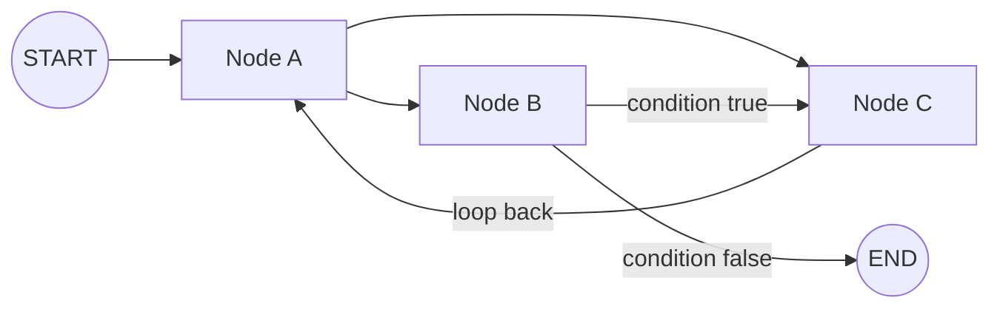

#### CrewAI — Hierarchical Team

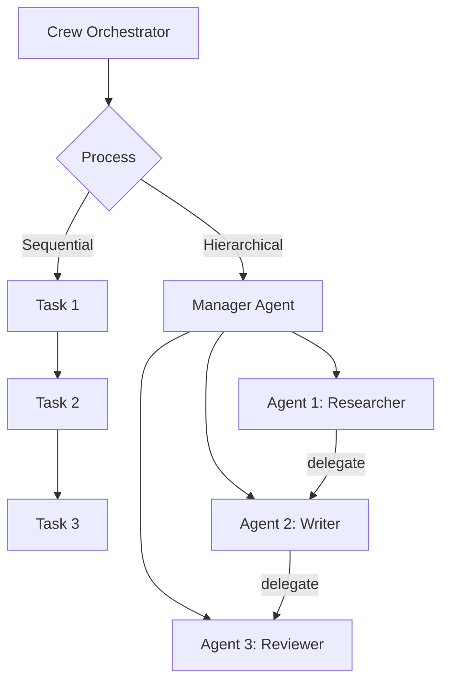

#### AutoGen — Conversation-Driven

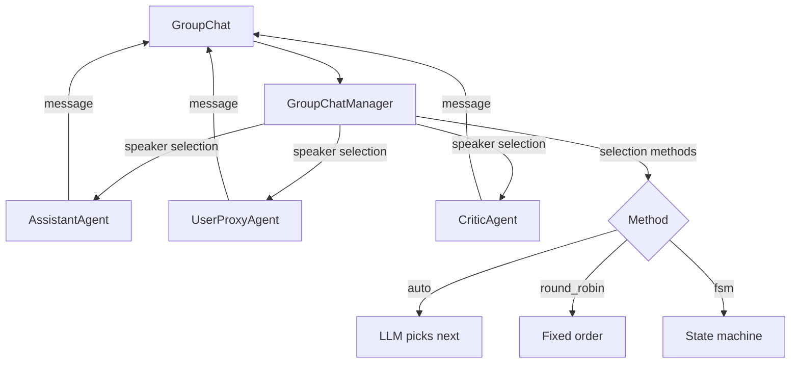

#### Semantic Kernel — Plugin Middleware

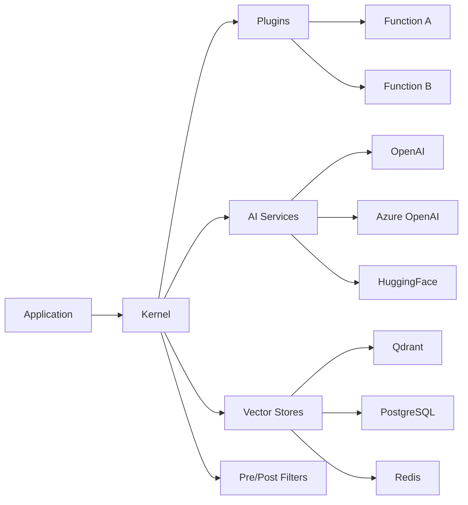

#### GoAgent — Leader-Sub Agent with AHP

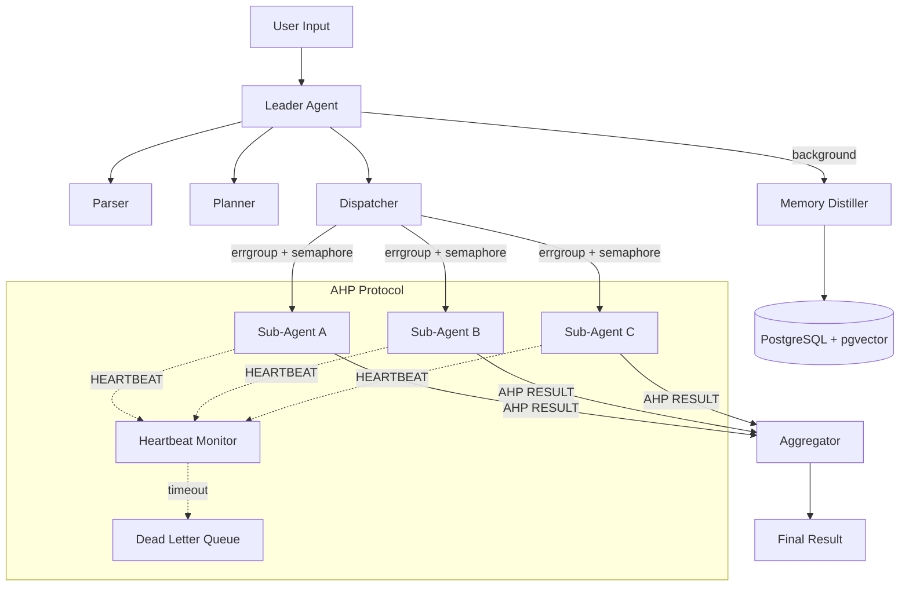

---

## 2. Workflow Orchestration

### 2.1 DAG vs Graph vs Pipeline

| Capability | LangGraph | CrewAI | AutoGen | SK | GoAgent |
|------------|-----------|--------|---------|-----|---------|
| **DAG** | Native | Sequential/Hierarchical only | No (conversation flow) | Planners deprecated | Native |
| **Conditional Edges** | `add_conditional_edges` | None | LLM selects speaker | Function calling | None (TODO) |
| **Cycles/Loops** | Native | Not supported | Natural conversation loops | Function calling loop | Not supported (DAG forbids) |
| **Parallel Execution** | Nodes in same super-step | `async_execution=True` | GroupChat is serial | Parallel function calling | Semaphore-based |
| **Subgraph Nesting** | Supported (node=subgraph) | Flow wraps Crews | Not supported | Plugin composition | Not supported (TODO) |
| **Hot Reload** | Not supported | Not supported | Not supported | Not supported | fsnotify file watcher |
| **Topological Sort** | Implicit (graph traversal) | Not needed | Not needed | Not needed | Kahn's algorithm (explicit) |
| **Cycle Detection** | Not needed (cycles allowed) | Not needed | Not needed | Not needed | DFS + recursion stack |

#### GoAgent DAG — Cycle Detection

```go
// internal/workflow/engine/types.go
func (d *DAG) hasCycle() bool {
    visited := make(map[string]bool)
    recStack := make(map[string]bool)

    var dfs func(node string) bool
    dfs = func(node string) bool {
        visited[node] = true
        recStack[node] = true
        for _, neighbor := range d.Edges[node] {
            if recStack[neighbor] { return true }  // back edge → cycle
            if !visited[neighbor] && dfs(neighbor) { return true }
        }
        recStack[node] = false
        return false
    }
    // ...
}

// Kahn's algorithm for topological sort
func (d *DAG) GetExecutionOrder() ([]string, error) {
    // compute in-degrees → BFS from zero-indegree nodes
    // result count != node count → cycle detected
}
```

#### LangGraph — Cycles by Design

```python
# LangGraph: cycles are a core feature (agentic loop)
graph = StateGraph(State)
graph.add_node("llm", call_llm)
graph.add_node("tools", call_tools)
graph.add_conditional_edges("llm", should_continue, {
    "continue": "tools",
    "end": END
})
graph.add_edge("tools", "llm")  # cycle! tools → llm
```

**Key Difference**: LangGraph allows cycles (agentic loop is core design). GoAgent's DAG explicitly forbids cycles (task orchestration scenario).

#### Workflow Execution Flow Comparison

```mermaid
graph TD
    subgraph "LangGraph Execution"
        LG1[compile graph] --> LG2[invoke/stream]
        LG2 --> LG3[super-step: run all ready nodes]
        LG3 --> LG4[checkpoint state]
        LG4 --> LG5[evaluate edges]
        LG5 -->|more nodes| LG3
        LG5 -->|done| LG6[return result]
    end

    subgraph "GoAgent DAG Execution"
        GA1[NewDAG: build + cycle check] --> GA2[GetExecutionOrder: Kahn's sort]
        GA2 --> GA3[runSteps: semaphore + goroutines]
        GA3 --> GA4[executeWithRetry: exponential backoff]
        GA4 --> GA5[deadlock detection: 5s timeout]
        GA5 -->|more steps| GA3
        GA5 -->|done| GA6[return WorkflowResult]
    end
```

### 2.2 State Management

| Dimension | LangGraph | CrewAI | AutoGen | SK | GoAgent |
|-----------|-----------|--------|---------|-----|---------|
| **State Model** | TypedDict, partial updates | Implicit per-agent | Message history | Kernel DI container | `map[string]any` shared |
| **Checkpointing** | Native (PostgresSaver, SQLite) | Flow uses SQLite | Not supported | Not supported | Not supported (TODO) |
| **Persistence** | PostgreSQL, SQLite, CosmosDB | LanceDB (memory), SQLite (flow) | Not supported | Vector store abstraction | PostgreSQL |
| **State Merging** | Reducers (append vs overwrite) | Not supported | Not supported | Not supported | Not supported |
| **State Replay** | Supported (any checkpoint) | Not supported | Not supported | Not supported | Not supported |
| **Consistency** | 3 durability modes | None | None | None | Transaction-level (PG) |

#### LangGraph Checkpoint Architecture

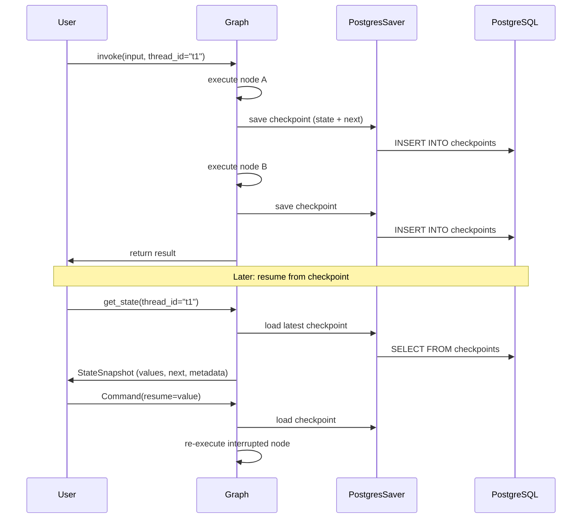

---

## 3. Multi-Agent Collaboration Patterns

### 3.1 Collaboration Paradigms

| Pattern | LangGraph | CrewAI | AutoGen | SK | GoAgent |
|---------|-----------|--------|---------|-----|---------|
| **Supervisor** | Subgraph composition | Hierarchical Process | GroupChatManager | GroupChatOrchestration | Leader Agent |
| **Peer-to-peer** | Shared state nodes | Delegation | Pairwise chat | AgentTool | AHP point-to-point |
| **Swarm** | Handoff mechanism | Not supported | Not supported | Not supported | Not supported |
| **Task Distribution** | Graph node scheduling | Manager agent dynamic | Speaker selection | RoundRobin/custom | Dispatcher + errgroup |
| **Result Aggregation** | State merge | Task output chaining | Conversation convergence | FilterResults | Aggregator (dedupe + sort) |

### 3.2 Leader / Sub-Agent Pattern Comparison

#### GoAgent — Deterministic Task Dispatch

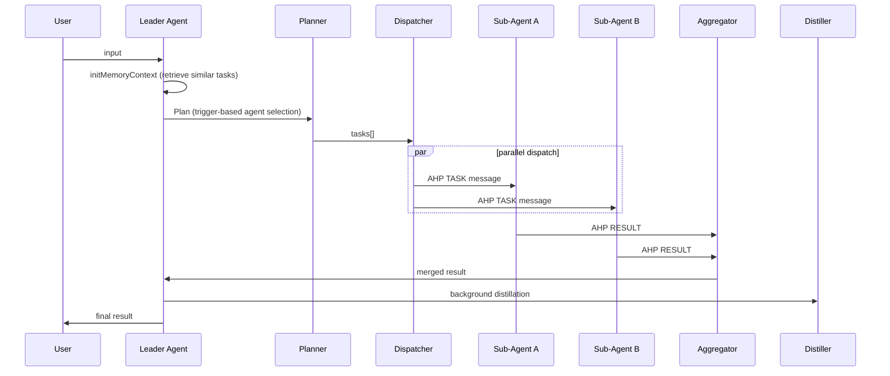

#### CrewAI — Manager-Driven Assignment

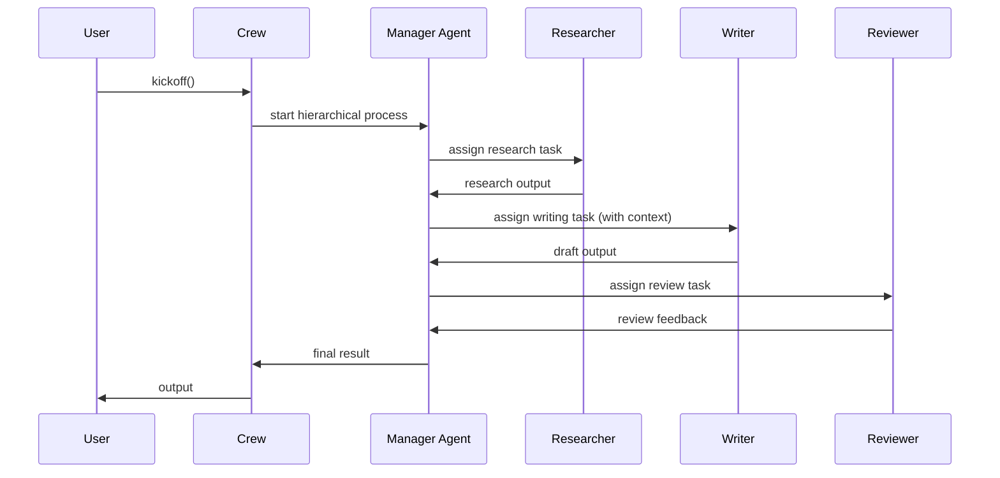

#### AutoGen — LLM-Selected Speaker

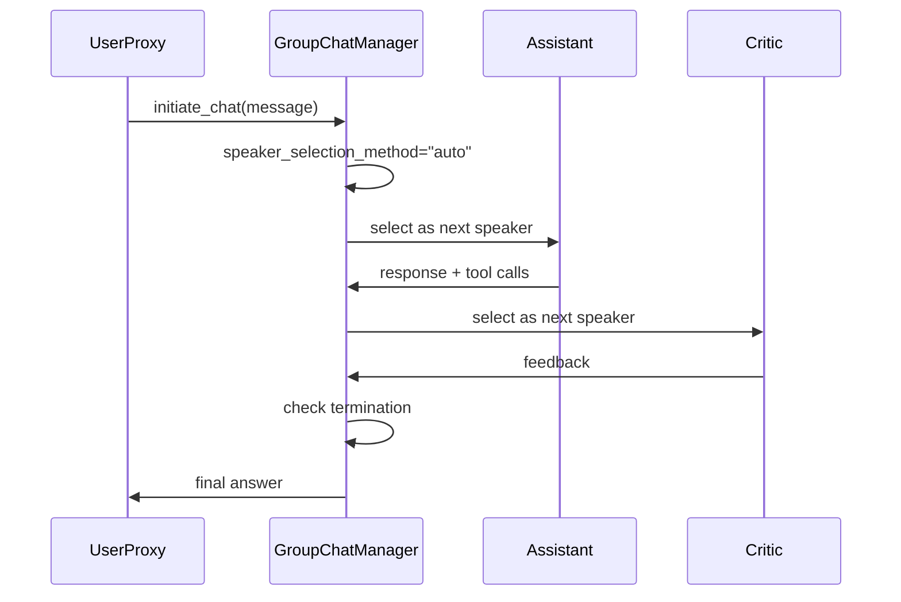

**Key Differences**:
- **GoAgent**: Deterministic dispatch (trigger keywords), deterministic aggregation (dedupe + sort)
- **CrewAI**: Manager agent dynamically assigns, more uncertain
- **AutoGen**: LLM selects speaker, most uncertain but most flexible
- **LangGraph**: Graph structure determines flow, most controllable

---

## 4. Communication Protocols

### 4.1 Message Mechanisms

| Dimension | LangGraph | CrewAI | AutoGen | SK | GoAgent |
|-----------|-----------|--------|---------|-----|---------|
| **Comm Style** | Shared state | Task output chaining | Message queue (chat history) | Shared Kernel | AHP Message Protocol |
| **Message Format** | State dict | Task.output | ChatMessage | KernelArguments | AHPMessage |
| **Message Types** | None (state updates) | None | user/assistant/function | None | TASK/RESULT/PROGRESS/ACK/HEARTBEAT |
| **Heartbeat** | Not supported | Not supported | Not supported | Not supported | 5s interval, 30s timeout |
| **Dead Letter Queue** | Not supported | Not supported | Not supported | Not supported | DLQ (max 10000) |
| **Idempotency** | Checkpoint guarantees | Not supported | Not supported | Not supported | Global unique MessageID |

#### AHP Message Flow

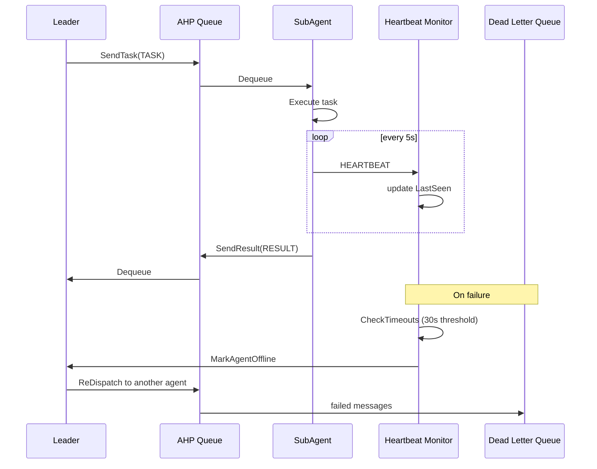

#### AHP Message Structure

```go
// internal/protocol/ahp/message.go
type AHPMessage struct {
    MessageID   string         `json:"message_id"`    // <ts>.<counter>.<rand6>
    Method      AHPMethod      `json:"method"`        // TASK|RESULT|PROGRESS|ACK|HEARTBEAT
    AgentID     string         `json:"agent_id"`      // sender
    TargetAgent string         `json:"target_agent"`  // receiver
    TaskID      string         `json:"task_id"`
    SessionID   string         `json:"session_id"`
    Payload     map[string]any `json:"payload"`
    Timestamp   time.Time      `json:"timestamp"`
}
```

**GoAgent's Unique Advantage**: AHP is the only protocol with **heartbeat detection + dead letter queue + progress reporting**. Other frameworks' messaging is "send→receive" with no agent liveness detection or failure recovery.

---

## 5. Tool Calling Reliability

### 5.1 Error Handling Mechanisms

| Mechanism | LangGraph | CrewAI | AutoGen | SK | GoAgent |
|-----------|-----------|--------|---------|-----|---------|
| **Retry** | None built-in | `max_retry_limit=2` | None built-in | None built-in | 3x exponential backoff |
| **Timeout** | None built-in | `max_execution_time` | None built-in | None built-in | Tiered (LLM 120s, DB 30s, Vector 10s) |
| **Output Validation** | None built-in | `output_pydantic` + Guardrails | None built-in | None built-in | Schema-based Validator |
| **Fallback** | None built-in | None built-in | None built-in | None built-in | FallbackClient (Cache/Keyword/Error) |
| **Circuit Breaker** | Not supported | Not supported | Not supported | Not supported | 3-state machine |
| **Dead Letter Queue** | Not supported | Not supported | Not supported | Not supported | DLQ + DLQProcessor |
| **Human-in-the-loop** | `interrupt()` | `human_input=True` | `human_input_mode` | Filter | Not supported (TODO) |

#### GoAgent — Layered Error Handling

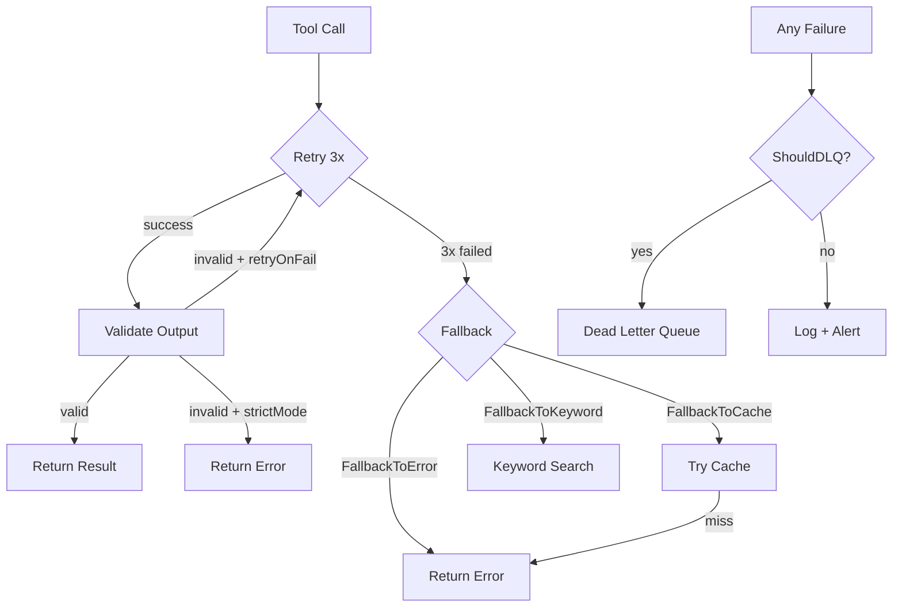

#### GoAgent Circuit Breaker

```go
// internal/storage/postgres/circuit_breaker.go
func (cb *CircuitBreaker) AllowRequest() bool {
    switch cb.state {
    case StateClosed:  return true
    case StateOpen:
        if time.Since(cb.lastFailure) > cb.timeout {
            // CAS transition to HalfOpen
            atomic.CompareAndSwapInt32(&cb.state, StateOpen, StateHalfOpen)
            return true  // allow one probe
        }
        return false
    case StateHalfOpen:
        // only one inflight request via CAS
        return atomic.CompareAndSwapInt32(&cb.halfOpenInflight, 0, 1)
    }
}
```

#### GoAgent Retry with Validation

```go
// internal/agents/sub/executor.go
func (e *taskExecutor) executeWithLLM(ctx context.Context, task *models.Task) (*models.TaskResult, error) {
    for attempt := 0; attempt < e.maxRetries; attempt++ {
        result, err := e.llmClient.Call(ctx, task.Prompt)
        if err != nil { continue }

        if err := e.validator.Validate(result); err != nil {
            if e.strictMode { return nil, err }
            if e.retryOnFail { continue }
        }
        return result, nil
    }
    return e.executeByType(ctx, task)  // fallback
}
```

---

## 6. Memory Systems

### 6.1 Memory Architecture

| Dimension | LangGraph | CrewAI | AutoGen | SK | GoAgent |
|-----------|-----------|--------|---------|-----|---------|
| **Short-term** | Checkpointed state | Current run context | Message history | Kernel state | Session Memory (in-memory) |
| **Long-term** | Store (PostgresStore etc.) | LanceDB vector store | mem0 integration | Vector store abstraction | PostgreSQL + pgvector |
| **Entity Memory** | Not supported | Knowledge Graph | Not supported | Not supported | MemoryProfile type |
| **Deduplication** | Not supported | cosine > 0.85 merge | Not supported | Not supported | cosine > 0.85 conflict detection |
| **Importance Scoring** | Not supported | `0.5*sim + 0.3*recency + 0.2*llm` | Not supported | Not supported | Keyword + type + length rules |
| **Distillation** | Not supported | Not supported | Not supported | Not supported | 6-step Pipeline |
| **Multi-tenancy** | namespace tuple | Not supported | Not supported | Not supported | `SET LOCAL app.tenant_id` |

#### GoAgent Memory Distillation Pipeline

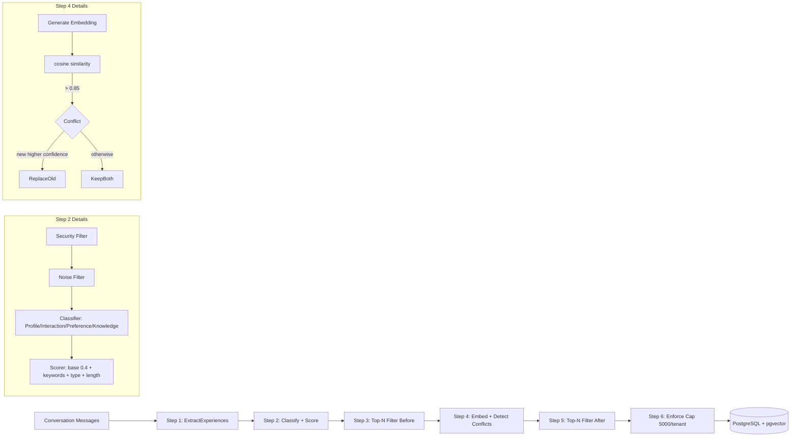

#### CrewAI Memory Recall

```python
# Composite scoring: 0.5*semantic_similarity + 0.3*recency_decay + 0.2*llm_importance
score = 0.5 * semantic_similarity + 0.3 * recency_decay + 0.2 * llm_importance

# On save: dedup check — cosine > 0.85 → LLM decides keep/merge/delete
```

**Key Differences**:
- GoAgent's distillation is an **automated Pipeline** (rule-driven, nanosecond-level), CrewAI's memory is **LLM-assisted** (more accurate but slower and more expensive)
- GoAgent has **multi-tenant isolation** (PostgreSQL `SET LOCAL`), others don't
- LangGraph's Store is most flexible (namespace tuple), but no automatic distillation

---

## 7. Reliability & Production Readiness

### 7.1 Production-Grade Features

| Feature | LangGraph | CrewAI | AutoGen | SK | GoAgent |
|---------|-----------|--------|---------|-----|---------|
| **Language** | Python | Python | Python | C#/Python/Java | Go |
| **Concurrency** | asyncio | asyncio | asyncio | async/await | goroutine + channel |
| **Connection Pool** | Via psycopg | Not supported | Not supported | Driver-dependent | Custom Pool (MaxOpen=25) |
| **Circuit Breaker** | Not supported | Not supported | Not supported | Not supported | 3-state machine |
| **Rate Limiting** | Not supported | Not supported | Not supported | Not supported | TokenBucket/SlidingWindow/Semaphore |
| **Multi-tenancy** | namespace | Not supported | Not supported | Not supported | PostgreSQL RLS + SET LOCAL |
| **PII Redaction** | Not supported | Not supported | Not supported | Not supported | Regex masking (API key/email/phone/SSN) |
| **SQL Injection** | N/A | N/A | N/A | ORM | Table name regex + keyword detection |
| **Observability** | LangSmith (paid) | Basic logging | AutoGen Studio | Application Insights | Tracer + Metrics |
| **Deployment** | LangGraph Platform | Local/container | AutoGen Studio (not prod) | Azure integration | Containerized |

### 7.2 Performance Characteristics

| Dimension | LangGraph | CrewAI | AutoGen | SK | GoAgent |
|-----------|-----------|--------|---------|-----|---------|
| **Startup Overhead** | High (LangChain ecosystem) | Medium | Medium | High (.NET DI) | Low (native Go) |
| **State Serialization** | JsonPlusSerializer + AES | None | None | None | None (in-memory map) |
| **Checkpoint Latency** | Per super-step write | None | None | None | None |
| **Vector Search** | Store-dependent | LanceDB (local) | None | Multi-backend | pgvector (ivfflat index) |
| **Embedding Cache** | Not supported | Not supported | Not supported | Not supported | Two-tier (Redis + memory) |

#### GoAgent Protection Stack

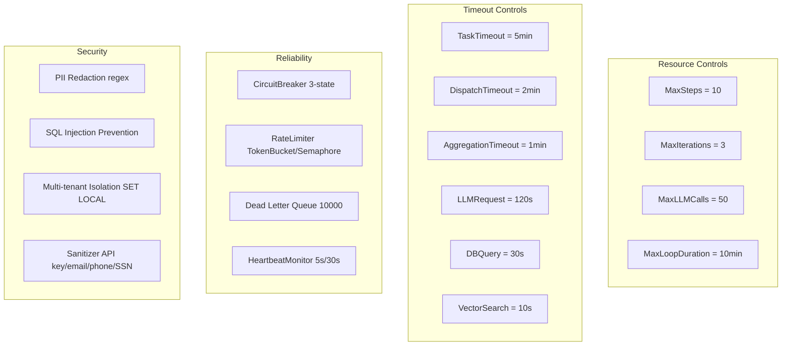

---

## 8. Framework Selection Guide

### 8.1 Decision Tree

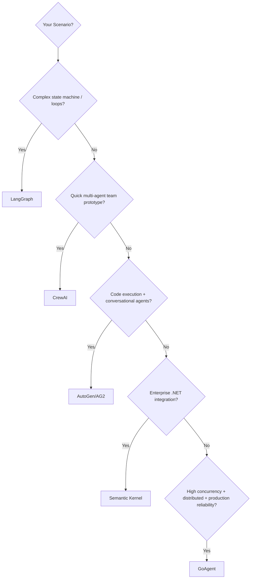

### 8.2 One-Line Positioning

| Framework | Positioning | Best For | Not For |
|-----------|-------------|----------|---------|
| **LangGraph** | Graph computation engine | Complex stateful workflows with cycles and checkpoints | Simple scenarios (overkill) |
| **CrewAI** | Team collaboration simulator | Rapid prototyping, role-play scenarios | Production, high determinism |
| **AutoGen** | Conversational Agent framework | Code generation/execution, research dialogues | Production deployment, structured workflows |
| **Semantic Kernel** | Enterprise AI middleware | .NET ecosystem, Azure, multi-language | Python-only teams, lightweight scenarios |
| **GoAgent** | Distributed Agent orchestration engine | High concurrency, multi-tenancy, protocol-level communication | Scenarios needing cycles/state rollback |

---

## 9. GoAgent's Differentiators

### 9.1 Unique Capabilities

| Capability | Other Frameworks | GoAgent |
|------------|-----------------|---------|
| **Heartbeat Detection** | None | HeartbeatMonitor (5s interval, 30s timeout) |
| **Dead Letter Queue** | None | DLQ (max 10000) + DLQProcessor |
| **Circuit Breaker** | None | 3-state machine (Closed/Open/HalfOpen) |
| **Embedding Cache** | None | Two-tier (Redis + memory), BLAKE2b keys |
| **Memory Distillation** | CrewAI has simple version | 6-step Pipeline (extract→classify→score→denoise→conflict→cap) |
| **Multi-tenant Isolation** | None | PostgreSQL SET LOCAL app.tenant_id |
| **PII Redaction** | None | Regex masking (API key/email/phone/SSN/credit card) |
| **Hot Reload** | None | fsnotify file watcher + polling fallback |
| **Go Concurrency** | Python asyncio | goroutine + channel + errgroup |
| **Topological Sort** | Implicit | Explicit Kahn's algorithm + DFS cycle detection |

### 9.2 Current Gaps (vs Competitors)

| Gap | Competitor Advantage | GoAgent Status |
|-----|---------------------|----------------|
| **State Checkpoint** | LangGraph has PostgresSaver for breakpoint recovery | State in-memory, lost on crash |
| **Cycle/Loop Support** | LangGraph native agentic loop | DAG forbids cycles |
| **Human-in-the-loop** | LangGraph `interrupt()`, CrewAI `human_input` | Not implemented |
| **Conditional Edges** | LangGraph `add_conditional_edges` | Not implemented |
| **Subgraph Nesting** | LangGraph node=subgraph | Not implemented |
| **Output Validation** | CrewAI `output_pydantic` + Guardrails | Schema Validator (basic) |
| **LLM-as-Judge** | CrewAI uses LLM for memory importance scoring | Pure rule-based scoring |
| **Streaming** | LangGraph 7 stream modes | Basic stream support |

---

## 10. Cross-Framework Borrowing: GoAgent v2

### 10.1 From LangGraph

1. **Checkpoint Mechanism**: Persist `StepState` to PostgreSQL for workflow breakpoint recovery
2. **Conditional Edges**: Add `Condition func(*State) bool` to DAG edges for dynamic routing
3. **State Reducers**: Define merge strategies (append vs overwrite) for parallel node conflicts

### 10.2 From CrewAI

1. **Guardrails**: Output validation function chain, failures fed back to agent for retry
2. **Memory Recall Scoring**: Introduce `0.5*similarity + 0.3*recency + 0.2*llm_importance` into ImportanceScorer
3. **Delegation**: Sub-agents can delegate tasks to each other (with infinite-loop protection)

### 10.3 From AutoGen

1. **FSM Speaker Selection**: Use finite state machines to constrain agent transitions
2. **Code Executor**: Docker sandbox for code execution, improving Tool Calling safety
3. **Runtime Abstraction**: SingleThreadedRuntime → DistributedRuntime for distributed readiness

### 10.4 From Semantic Kernel

1. **Filter Mechanism**: IFunctionInvocationFilter (pre/post hooks) for unified Tool call interception
2. **DI Container**: Kernel's dependency injection pattern for decoupling Agent and Service
3. **Vector Store Abstraction**: Unified interface for multi-backend (pgvector, Redis, Qdrant)

---

## 11. 2026 Industry Trends

### 11.1 Framework Evolution Direction

| Trend | Description |
|-------|-------------|
| **Python → Multi-language** | SK already C#/Python/Java, GoAgent using Go is the right direction |
| **Single-node → Distributed** | AutoGen 0.4 added DistributedAgentRuntime, GoAgent's AHP natively supports |
| **Conversation → Workflow** | CrewAI expanded from Crew to Flow, LangGraph's graph model is the ultimate form |
| **Memory becomes core** | All frameworks adding Memory, only GoAgent has automated distillation |
| **Observability becomes standard** | LangSmith binds LangGraph, open-source alternatives emerging |
| **Security from optional to mandatory** | PII redaction, Prompt Injection detection, sandbox execution |

### 11.2 GoAgent's Ecosystem Position

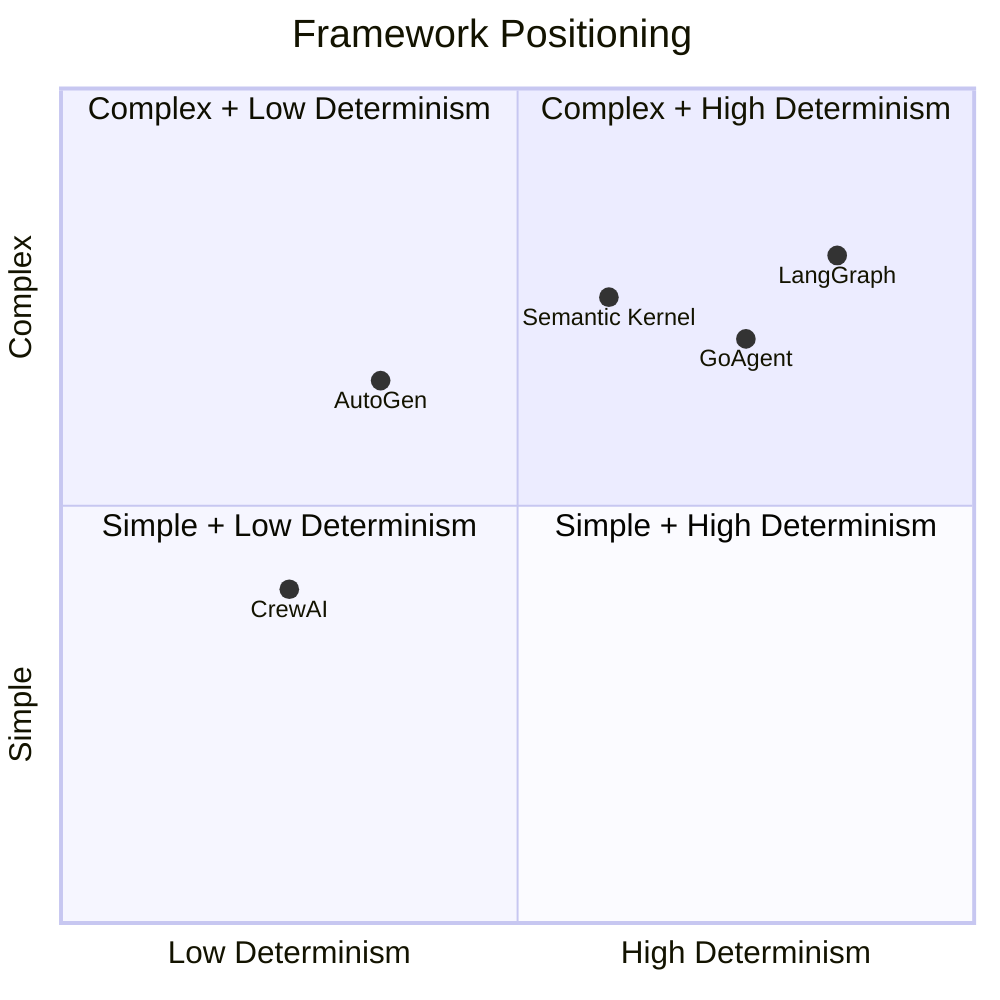

**GoAgent's differentiating position**: Leverage Go's concurrency advantages for **high-reliability, multi-tenant, protocol-level distributed Agent orchestration**. Don't compete with LangGraph on graph computation flexibility, don't compete with CrewAI on out-of-box experience, but play the **"production-grade reliability"** card.

---

## Appendix: Key Code File Index

| Domain | File Path |
|--------|-----------|
| Repository Pattern | `internal/storage/postgres/repository.go` |
| Circuit Breaker | `internal/storage/postgres/circuit_breaker.go` |
| Vector Search | `internal/storage/postgres/vector.go` |
| Connection Pool | `internal/storage/postgres/pool.go` |
| Write Buffer | `internal/storage/postgres/write_buffer.go` |
| Embedding Queue | `internal/storage/postgres/embedding_queue.go` |
| Embedding Cache | `internal/storage/postgres/embedding/cache.go` |
| Embedding Fallback | `internal/storage/postgres/embedding/fallback.go` |
| Retrieval Guard | `internal/storage/postgres/retrieval_guard.go` |
| SQL Injection Prevention | `internal/storage/postgres/security.go` |
| Multi-tenant Isolation | `internal/storage/postgres/tenant_guard.go` |
| DAG Definition | `internal/workflow/engine/types.go` |
| DAG Executor | `internal/workflow/engine/executor.go` |
| Hot Reload | `internal/workflow/engine/reloader.go` |
| Graph Execution | `internal/workflow/graph/executor.go` |
| Graph Scheduler | `internal/workflow/graph/scheduler.go` |
| AHP Message | `internal/protocol/ahp/message.go` |
| AHP Protocol | `internal/protocol/ahp/protocol.go` |
| AHP Queue | `internal/protocol/ahp/queue.go` |
| Heartbeat | `internal/protocol/ahp/heartbeat.go` |
| Dead Letter Queue | `internal/protocol/ahp/dlq.go` |
| Leader Agent | `internal/agents/leader/agent.go` |
| Task Dispatcher | `internal/agents/leader/dispatcher.go` |
| Task Planner | `internal/agents/leader/planner.go` |
| Result Aggregator | `internal/agents/leader/aggregator.go` |
| Result Evaluator | `internal/agents/leader/evaluator.go` |
| Sub Agent | `internal/agents/sub/agent.go` |
| Task Executor | `internal/agents/sub/executor.go` |
| Distiller | `internal/memory/distillation/distiller.go` |
| Importance Scorer | `internal/memory/distillation/scorer.go` |
| Conflict Resolver | `internal/memory/distillation/resolver.go` |
| Experience Extractor | `internal/memory/distillation/extractor.go` |
| Noise Filter | `internal/memory/distillation/filter.go` |
| Memory Manager | `internal/memory/manager.go` |
| Timeout Config | `internal/llm/output/timeout.go` |
| Output Validator | `internal/llm/output/validator.go` |
| LLM Client | `internal/llm/client.go` |
| Rate Limiter | `internal/ratelimit/limiter.go` |
| Error Strategy | `internal/core/errors/code.go`, `strategy.go` |
| PII Sanitizer | `internal/security/sanitizer.go` |
