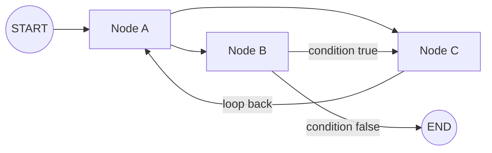
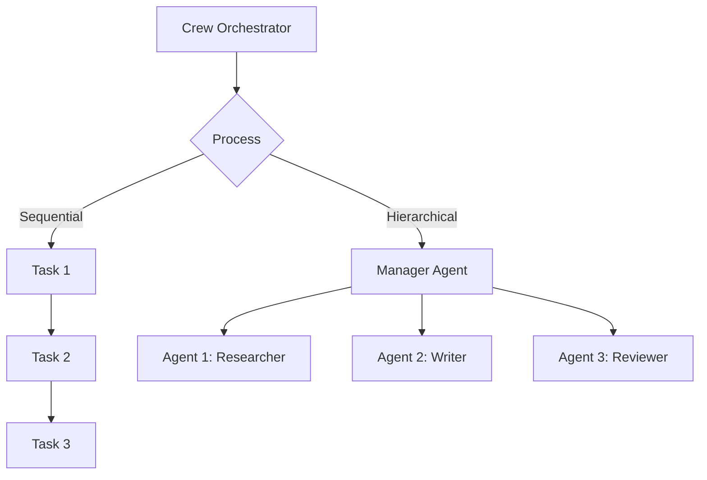
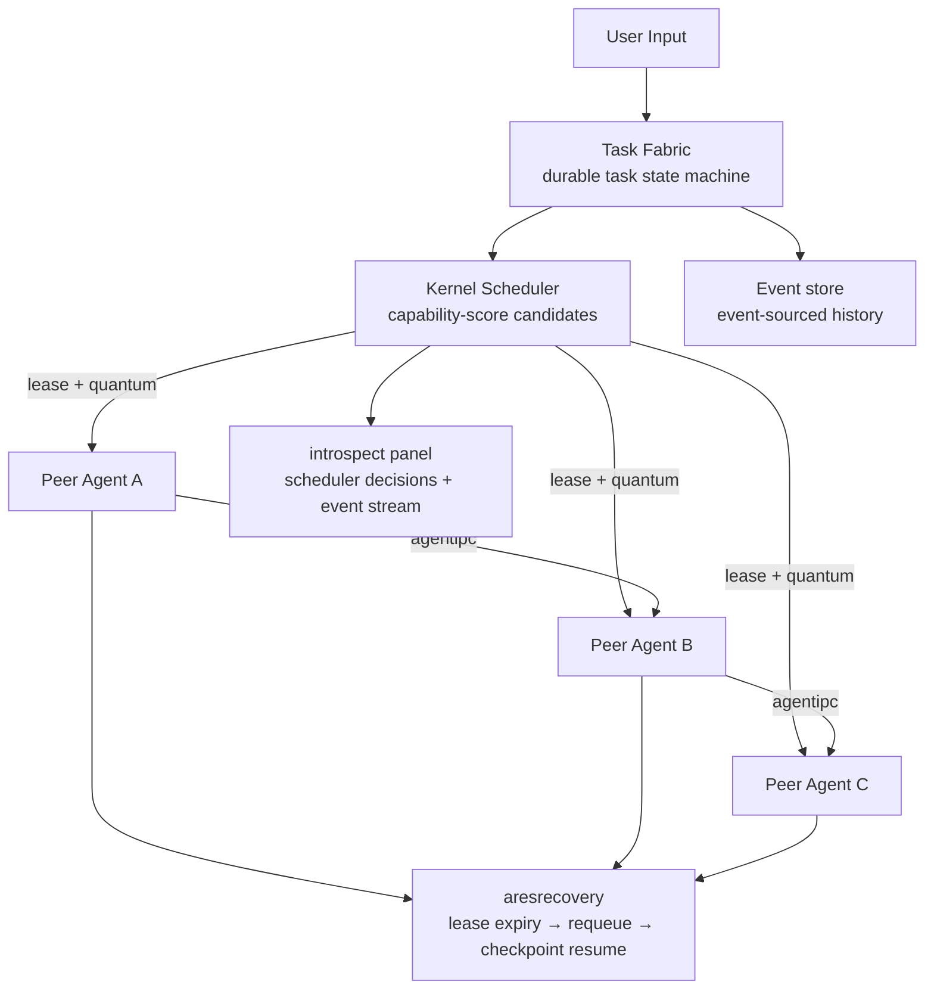
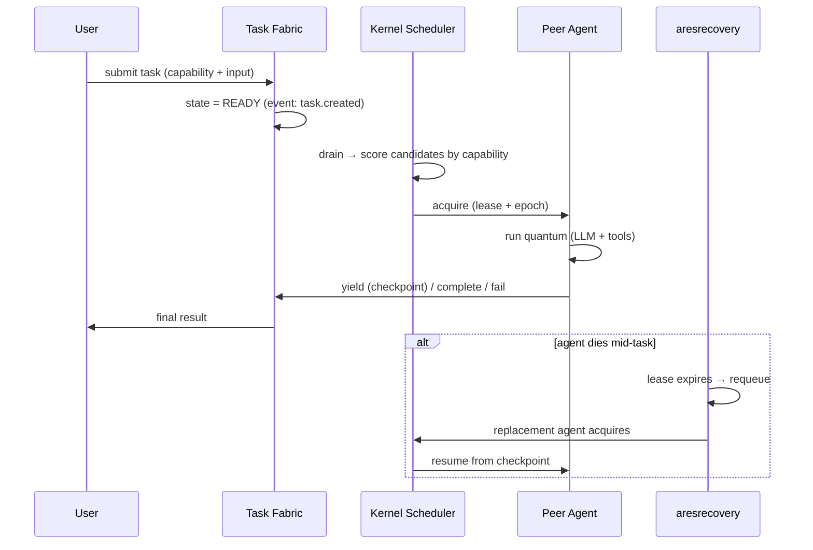
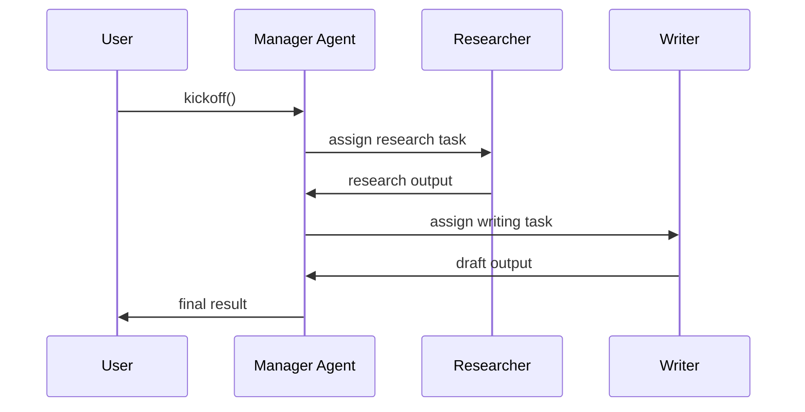
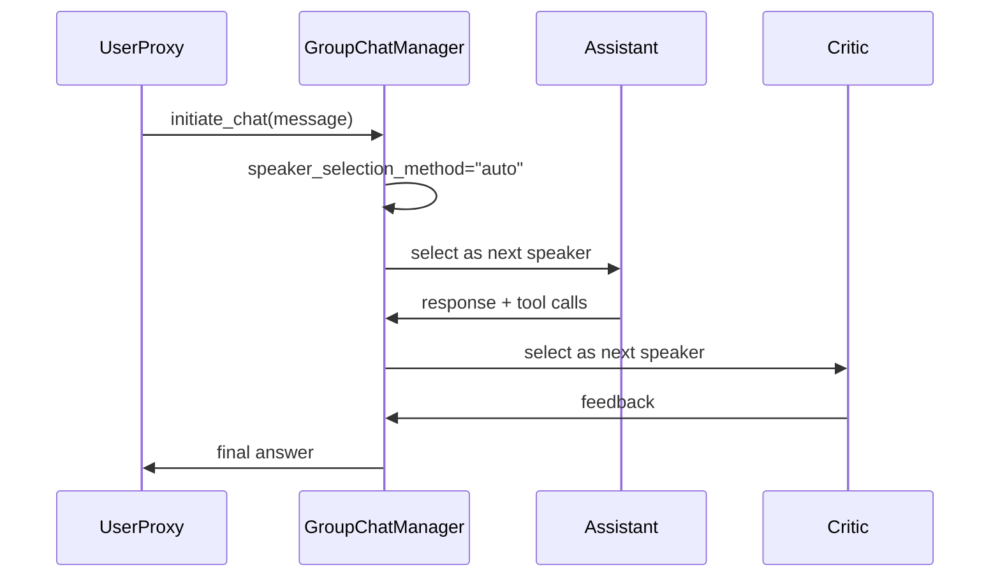
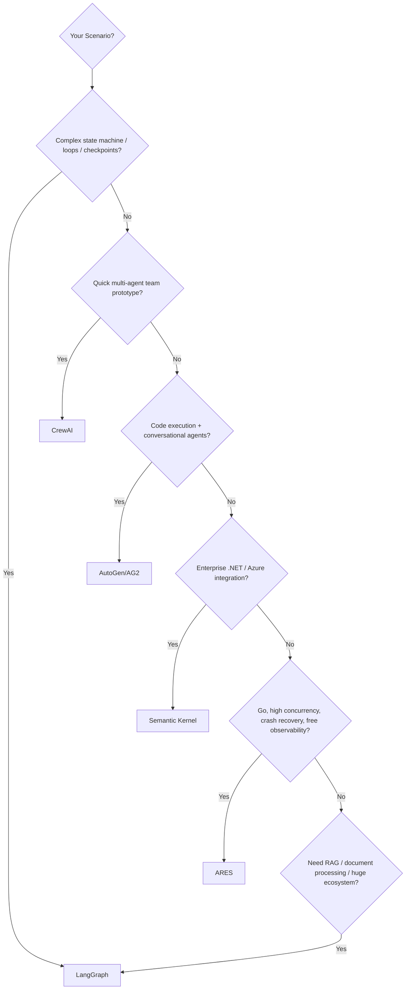

# Multi-Agent Framework Deep Comparison

> LangGraph vs CrewAI vs AutoGen vs Semantic Kernel vs ARES

---

## 1. Architecture Models

### 1.1 Core Abstractions

| Framework | Core Abstraction | Design Philosophy | Language |
|-----------|-----------------|------------------|----------|
| **LangGraph** | StateGraph (directed graph) | Graph computation model, node=function, edge=transition | Python/JS |
| **CrewAI** | Crew + Agent + Task | Team collaboration metaphor, role-driven | Python |
| **AutoGen/AG2** | ConversableAgent + GroupChat | Conversation-driven, message passing | Python |
| **Semantic Kernel** | Kernel + Plugin + Function | Enterprise middleware, DI container | C#/Python/Java |
| **ARES** | Peer Agent + Kernel Scheduler + Task Fabric | Agent OS, peer-to-peer, capability-scheduled, event-sourced | Go |

> **Scope note**: ARES is a research-oriented Agent OS under active development (dev branch, ~1300 commits). Features marked "implemented but not wired" exist in code but are not reachable from the production `ares serve` path. The v0.3.0 review documented ~20 such "open circuits".

### 1.2 Architecture Diagrams

#### LangGraph — Directed Graph with Cycles


```mermaid
graph LR
    START((START)) --> NodeA[Node A]
    NodeA --> NodeB[Node B]
    NodeA --> NodeC[Node C]
    NodeB -->|condition true| NodeC
    NodeB -->|condition false| END((END))
    NodeC -->|loop back| NodeA
```

#### CrewAI — Hierarchical Team


```mermaid
graph TD
    Crew[Crew Orchestrator] --> Process{Process}
    Process -->|Sequential| T1[Task 1] --> T2[Task 2] --> T3[Task 3]
    Process -->|Hierarchical| Manager[Manager Agent]
    Manager --> A1[Agent 1: Researcher]
    Manager --> A2[Agent 2: Writer]
    Manager --> A3[Agent 3: Reviewer]
```

#### ARES — Flat Peer + Kernel Scheduler (current, dev branch)


```mermaid
graph TD
    User[User Input] --> Fabric[Task Fabric<br/>durable task state machine]
    Fabric --> Sched[Kernel Scheduler<br/>capability-score candidates]
    Sched -->|lease + quantum| A1[Peer Agent A]
    Sched -->|lease + quantum| A2[Peer Agent B]
    Sched -->|lease + quantum| A3[Peer Agent C]
    A1 -->|agentipc| A2
    A2 -->|agentipc| A3
    A1 --> Recovery[aresrecovery<br/>lease expiry → requeue → checkpoint resume]
    A2 --> Recovery
    A3 --> Recovery
    Fabric --> Events[Event store<br/>event-sourced history]
    Sched --> Panel[introspect panel<br/>scheduler decisions + event stream]
```

The legacy Leader-Sub architecture (v0.2.x) has been removed. There is no `leader` package, no dispatcher/aggregator, and no production dead-letter queue. Agents are flat peers scheduled by the kernel.

---

## 2. Workflow Orchestration

### 2.1 DAG vs Graph vs Pipeline

| Capability | LangGraph | CrewAI | AutoGen | SK | ARES |
|------------|-----------|--------|---------|-----|---------|
| **DAG** | Native | Sequential/Hierarchical only | No (conversation flow) | Planners deprecated | Task fabric dependencies |
| **Conditional Edges** | `add_conditional_edges` | None | LLM selects speaker | Function calling | Runtime routing via kernel dispatch |
| **Cycles/Loops** | Native | Not supported | Natural conversation loops | Function calling loop | Not supported (no arbitrary cycles) |
| **Parallel Execution** | Nodes in same super-step | `async_execution=True` | GroupChat is serial | Parallel function calling | Scheduler maxConcurrent (goroutine) |
| **Subgraph Nesting** | Supported (node=subgraph) | Flow wraps Crews | Not supported | Plugin composition | Not in production path |
| **Hot Reload** | Not supported | Not supported | Not supported | Not supported | Config watcher (cfgStore) only |
| **Topological Sort** | Implicit (graph traversal) | Not needed | Not needed | Not needed | Explicit in task fabric scheduler |

> Note on ARES workflow: the `internal/workflow/engine` package (MutableDAG, DynamicExecutor, HITL, LoopConfig, Subgraph) is implemented but **not wired into production** — it exists as a capability reserve for the evolution system. The production orchestration path is the task fabric + kernel scheduler.

#### LangGraph — Cycles by Design

```python
graph = StateGraph(State)
graph.add_node("llm", call_llm)
graph.add_node("tools", call_tools)
graph.add_conditional_edges("llm", should_continue, {
    "continue": "tools",
    "end": END
})
graph.add_edge("tools", "llm")  # cycle! tools → llm
```

**Key Difference**: LangGraph allows cycles (the agentic loop is core design). ARES's production task fabric forbids arbitrary cycles — tasks are a DAG with dependencies, and each task runs to completion through lease/epoch/quantum.

### 2.2 State Management

| Dimension | LangGraph | CrewAI | AutoGen | SK | ARES |
|-----------|-----------|--------|---------|-----|---------|
| **State Model** | TypedDict, partial updates | Implicit per-agent | Message history | Kernel DI container | `map[string]any` shared |
| **Checkpointing** | Native (PostgresSaver, SQLite) | Flow uses SQLite | Not supported | Not supported | Task checkpoint (in-memory fabric) |
| **Persistence** | PostgreSQL, SQLite, CosmosDB | LanceDB (memory), SQLite (flow) | Not supported | Vector store abstraction | PostgreSQL |
| **State Merging** | Reducers (append vs overwrite) | Not supported | Not supported | Not supported | Not supported |
| **State Replay** | Supported (any checkpoint) | Not supported | Not supported | Not supported | Not supported |
| **Consistency** | 3 durability modes | None | None | None | Transaction-level (PG) |

LangGraph has the most advanced state management. ARES's task fabric checkpoints durable progress per task (survives agent death via aresrecovery), but does not offer arbitrary graph-state replay like LangGraph.

---

## 3. Multi-Agent Collaboration Patterns

### 3.1 Collaboration Paradigms

| Pattern | LangGraph | CrewAI | AutoGen | SK | ARES |
|---------|-----------|--------|---------|-----|---------|
| **Supervisor** | Subgraph composition | Hierarchical Process | GroupChatManager | GroupChatOrchestration | None (flat peer) |
| **Peer-to-peer** | Shared state nodes | Delegation | Pairwise chat | AgentTool | agentipc bus (real IPC) |
| **Swarm** | Handoff mechanism | Not supported | Not supported | Not supported | Not supported |
| **Task Distribution** | Graph node scheduling | Manager agent dynamic | Speaker selection | RoundRobin/custom | Kernel scheduler (capability score) |
| **Result Aggregation** | State merge | Task output chaining | Conversation convergence | FilterResults | Each task completes independently |

### 3.2 ARES — Capability-Scheduled Dispatch


```mermaid
sequenceDiagram
    participant User
    participant Fabric as Task Fabric
    participant Sched as Kernel Scheduler
    participant A as Peer Agent
    participant R as aresrecovery

    User->>Fabric: submit task (capability + input)
    Fabric->>Fabric: state = READY (event: task.created)
    Sched->>Sched: drain → score candidates by capability
    Sched->>A: acquire (lease + epoch)
    A->>A: run quantum (LLM + tools)
    A->>Fabric: yield (checkpoint) / complete / fail
    Fabric->>User: final result

    alt agent dies mid-task
        R->>R: lease expires → requeue
        R->>Sched: replacement agent acquires
        Sched->>A: resume from checkpoint
    end
```

ARES's dispatch is deterministic: candidates are scored by capability overlap × load × confidence, the highest wins, and a lease+epoch fence prevents stale holders. CrewAI's manager and AutoGen's speaker selection are LLM-driven and less predictable.

### 3.3 CrewAI — Manager-Driven Assignment


```mermaid
sequenceDiagram
    participant User
    participant Manager as Manager Agent
    participant Researcher
    participant Writer

    User->>Manager: kickoff()
    Manager->>Researcher: assign research task
    Researcher->>Manager: research output
    Manager->>Writer: assign writing task
    Writer->>Manager: draft output
    Manager->>User: final result
```

### 3.4 AutoGen — LLM-Selected Speaker


```mermaid
sequenceDiagram
    participant User as UserProxy
    participant GSM as GroupChatManager
    participant Assistant
    participant Critic

    User->>GSM: initiate_chat(message)
    GSM->>GSM: speaker_selection_method="auto"
    GSM->>Assistant: select as next speaker
    Assistant->>GSM: response + tool calls
    GSM->>Critic: select as next speaker
    Critic->>GSM: feedback
    GSM->>User: final answer
```

**Key Differences**:
- **ARES**: deterministic dispatch (capability score), deterministic task completion
- **CrewAI**: manager agent dynamically assigns, more uncertain
- **AutoGen**: LLM selects speaker, most uncertain but most flexible
- **LangGraph**: graph structure determines flow, most controllable

---

## 4. Communication Protocols

### 4.1 Message Mechanisms

| Dimension | LangGraph | CrewAI | AutoGen | SK | ARES |
|-----------|-----------|--------|---------|-----|---------|
| **Comm Style** | Shared state | Task output chaining | Message queue (chat history) | Shared Kernel | agentipc (current), AHP (legacy) |
| **Message Format** | State dict | Task.output | ChatMessage | KernelArguments | agentipc.Message |
| **Heartbeat** | Not supported | Not supported | Not supported | Not supported | AHP only (legacy, not in production) |
| **Dead Letter Queue** | Not supported | Not supported | Not supported | Not supported | AHP only (legacy, not in production) |

**Important correction**: ARES's production agent communication uses `agentipc.Bus` (Send/Request/Reply/Delegate/Handoff/Subscribe). The AHP protocol with heartbeat + DLQ exists in `internal/ares_protocol/ahp` but is **not wired into production** — it is used only for evolution IPC bridging. The heartbeat monitor and dead-letter queue have zero production call sites. Claims that "AHP provides protocol-level heartbeat + DLQ guarantees" are not accurate for the production path.

---

## 5. Tool Calling Reliability

### 5.1 Error Handling Mechanisms

| Mechanism | LangGraph | CrewAI | AutoGen | SK | ARES |
|-----------|-----------|--------|---------|-----|---------|
| **Retry** | None built-in | `max_retry_limit=2` | None built-in | None built-in | 3x exponential backoff (task executor) |
| **Timeout** | None built-in | `max_execution_time` | None built-in | None built-in | Tiered (LLM 120s, DB 30s, Vector 10s) |
| **Output Validation** | None built-in | `output_pydantic` + Guardrails | None built-in | None built-in | Schema-based Validator |
| **Fallback** | None built-in | None built-in | None built-in | None built-in | FailoverClient (multi-provider + cooldown) |
| **Circuit Breaker** | Not supported | Not supported | Not supported | Not supported | PostgreSQL retrieval guard only |
| **Dead Letter Queue** | Not supported | Not supported | Not supported | Not supported | Implemented in AHP, not wired to production |
| **Human-in-the-loop** | `interrupt()` | `human_input=True` | `human_input_mode` | Filter | Implemented in workflow/engine, not in production |

**Note on ARES reliability claims**: The 3-state circuit breaker in `internal/storage/postgres/circuit_breaker.go` is specific to the PostgreSQL retrieval guard, not a general-purpose breaker. The LLM failover uses cooldown-based switching (a provider that errors, e.g. 429, is cooled down and the next is tried) — this is production-wired and real, but it is a simpler mechanism than a full circuit-breaker FSM.

---

## 6. Memory Systems

### 6.1 Memory Architecture

| Dimension | LangGraph | CrewAI | AutoGen | SK | ARES |
|-----------|-----------|--------|---------|-----|---------|
| **Short-term** | Checkpointed state | Current run context | Message history | Kernel state | Session Memory (in-memory) |
| **Long-term** | Store (PostgresStore etc.) | LanceDB vector store | mem0 integration | Vector store abstraction | PostgreSQL + pgvector |
| **Entity Memory** | Not supported | Knowledge Graph | Not supported | Not supported | MemoryProfile type |
| **Deduplication** | Not supported | cosine > 0.85 merge | Not supported | Not supported | cosine > 0.85 conflict detection |
| **Importance Scoring** | Not supported | `0.5*sim + 0.3*recency + 0.2*llm` | Not supported | Not supported | Rule-based (keyword + type + length) |
| **Distillation** | Not supported | Not supported | Not supported | Not supported | 6-step rule pipeline |
| **Multi-tenancy** | namespace tuple | Not supported | Not supported | Not supported | Application-level tenantID predicates |

### 6.2 ARES Memory Distillation

ARES has an automated 6-step memory distillation pipeline (extract → classify+score → filter → embed+conflict → filter → cap). It is rule-driven (no LLM call per step) so it is fast but less accurate than LLM-assisted scoring. The scoring uses keyword + type + length rules with a base score of 0.4.

Claims of "nanosecond latency" for this pipeline are misleading — it involves SQLite reads/writes and embedding generation, which take milliseconds, not nanoseconds.

### 6.3 Multi-tenancy

ARES uses application-level tenantID predicates on all repository queries. The previous PostgreSQL RLS approach (`SET LOCAL app.tenant_id`) was removed in v0.3.1 (tenant_isolation.md, #36 descoped).

---

## 7. Reliability & Production Readiness

### 7.1 Production-Grade Features

| Feature | LangGraph | CrewAI | AutoGen | SK | ARES |
|---------|-----------|--------|---------|-----|---------|
| **Language** | Python | Python | Python | C#/Python/Java | Go |
| **Concurrency** | asyncio | asyncio | asyncio | async/await | goroutine + channel |
| **Connection Pool** | Via psycopg | Not supported | Not supported | Driver-dependent | Custom Pool |
| **Rate Limiting** | Not supported | Not supported | Not supported | Not supported | TokenBucket/SlidingWindow/Semaphore |
| **Multi-tenancy** | namespace | Not supported | Not supported | Not supported | App-level tenantID |
| **PII Redaction** | Not supported | Not supported | Not supported | Not supported | Regex masking (API key/email/phone/SSN) |
| **Observability** | LangSmith (paid) | Basic logging | AutoGen Studio | Application Insights | introspect panel (6 pages, free) |
| **Deployment** | LangGraph Platform | Local/container | AutoGen Studio (not prod) | Azure integration | Containerized |

### 7.2 Performance Characteristics

| Dimension | LangGraph | CrewAI | AutoGen | SK | ARES |
|-----------|-----------|--------|---------|-----|---------|
| **Startup Overhead** | High (LangChain ecosystem) | Medium | Medium | High (.NET DI) | Low (native Go) |
| **State Serialization** | JsonPlusSerializer + AES | None | None | None | In-memory map |
| **Vector Search** | Store-dependent | LanceDB (local) | None | Multi-backend | pgvector (ivfflat index) |

---

## 8. Framework Selection Guide

### 8.1 Decision Tree


```mermaid
graph TD
    START{Your Scenario?} --> Q1{Complex state machine / loops / checkpoints?}
    Q1 -->|Yes| LG[LangGraph]
    Q1 -->|No| Q2{Quick multi-agent team prototype?}
    Q2 -->|Yes| CA[CrewAI]
    Q2 -->|No| Q3{Code execution + conversational agents?}
    Q3 -->|Yes| AG[AutoGen/AG2]
    Q3 -->|No| Q4{Enterprise .NET / Azure integration?}
    Q4 -->|Yes| SK[Semantic Kernel]
    Q4 -->|No| Q5{Go, high concurrency, crash recovery, free observability?}
    Q5 -->|Yes| ARES[ARES]
    Q5 -->|No| Q6{Need RAG / document processing / huge ecosystem?}
    Q6 -->|Yes| LG[LangGraph]
```

### 8.2 One-Line Positioning

| Framework | Positioning | Best For | Not For |
|-----------|-------------|----------|---------|
| **LangGraph** | Graph computation engine | Complex stateful workflows with cycles and checkpoints | Simple scenarios (overkill) |
| **CrewAI** | Team collaboration simulator | Rapid prototyping, role-play scenarios | Production, high determinism |
| **AutoGen** | Conversational Agent framework | Code generation/execution, research dialogues | Production deployment, structured workflows |
| **Semantic Kernel** | Enterprise AI middleware | .NET ecosystem, Azure, multi-language | Python-only teams, lightweight scenarios |
| **ARES** | Go-native Agent OS with kernel scheduler | High concurrency, crash recovery, free observability | RAG/document processing, large ecosystem, stable production-proven APIs |

---

## 9. ARES's Honest Differentiators

### 9.1 What ARES Actually Does Differently (production-wired)

| Capability | Other Frameworks | ARES (production) |
|------------|-----------------|---------|
| **Agent-as-Thread architecture** | Role-based teams | Flat peer agents scheduled by kernel, tasks durable |
| **Crash recovery** | None built-in | lease expiry → requeue → checkpoint resume (aresrecovery) |
| **Real agent IPC** | Shared state / message queues | agentipc bus (Send/Request/Reply/Delegate/Handoff) |
| **Event-sourced observability** | LangSmith (paid) / basic logging | introspect panel: scheduler decisions, task state machines, event stream (free) |
| **Go concurrency** | Python asyncio | goroutine + channel, no GIL |
| **Chaos isolation** | None | Shadow sandbox + live mode with six guardrails |

### 9.2 Honest Gaps (vs Competitors)

| Gap | Competitor Advantage | ARES Status |
|-----|---------------------|----------------|
| **Ecosystem** | LangChain has 1000+ integrations | ~20 built-in tools, ~2 contributors, near-zero third-party integrations |
| **RAG / Document Processing** | LangChain has 100+ document loaders | None |
| **LLM Provider Coverage** | LangChain 50+ providers | OpenAI + Ollama (well-tested) |
| **State Checkpoint** | LangGraph PostgresSaver for breakpoint recovery | Task-level checkpoint (crash recovery) but no arbitrary graph-state replay |
| **Cycle/Loop Support** | LangGraph native agentic loop | Production fabric forbids cycles |
| **Human-in-the-loop** | LangGraph `interrupt()`, CrewAI `human_input` | Implemented in workflow/engine but not wired to production |
| **Streaming** | LangGraph 7 stream modes | Basic |
| **Maturity** | LangChain (2022), CrewAI (2023) | 2025, architecture still evolving (dev branch ~1300 commits) |

---

## 10. 2026 Industry Trends

| Trend | Description |
|-------|-------------|
| **Python → Multi-language** | SK already C#/Python/Java; ARES using Go aligns with this direction |
| **Single-node → Distributed** | AutoGen 0.4 added distributed runtime; ARES is single-process in-memory (multi-node not yet supported) |
| **Conversation → Workflow** | CrewAI expanded from Crew to Flow; graph/task models are becoming the norm |
| **Memory becomes core** | All frameworks adding Memory; ARES has a rule-based distillation pipeline (fast but less accurate than LLM-assisted) |
| **Observability becomes standard** | LangSmith binds LangGraph; ARES offers a free introspect panel |
| **Security from optional to mandatory** | PII redaction, sandbox execution becoming standard |

---

## Appendix: Key Code File Index (current dev branch)

| Domain | File Path | Production-Wired |
|--------|-----------|-----------------|
| Task Fabric | `internal/taskfabric/fabric.go` | ✅ |
| Kernel Scheduler | `internal/kernelscheduler/scheduler.go` | ✅ |
| Agent Fabric | `internal/agentfabric/lifecycle.go` | ✅ |
| Crash Recovery | `internal/aresrecovery/recovery.go` | ✅ |
| Agent IPC | `internal/agentipc/bus.go` | ✅ |
| Introspect Panel | `internal/introspect/web/panel.html` | ✅ |
| Chaos Isolation | `cmd/ares/serve_chaos.go` | ✅ |
| Failover LLM | `internal/llm/failover.go` | ✅ |
| Memory Distillation | `internal/ares_memory/distillation/` | ✅ |
| Circuit Breaker (PG guard) | `internal/storage/postgres/circuit_breaker.go` | ✅ (retrieval guard only) |
| PII Sanitizer | `internal/ares_security/sanitizer.go` | ✅ |
| Rate Limiter | `internal/ares_ratelimit/` | ✅ |
| AHP Protocol (legacy) | `internal/ares_protocol/ahp/` | ❌ (evolution IPC only) |
| Mutable DAG | `internal/workflow/engine/` | ❌ (not wired) |
| HITL | `internal/workflow/engine/hitl.go` | ❌ (not wired) |
| Evolution (v0.2.9) | `internal/evolution/` | Partial (being replaced) |
| Evolution (new) | `internal/ares_evolution/` | Partial |
| Leader-Sub (legacy) | `internal/agents/leader/` | ❌ (removed) |
| Multi-tenant RLS | `internal/storage/postgres/tenant_guard.go` | ❌ (removed, app-level predicates) |