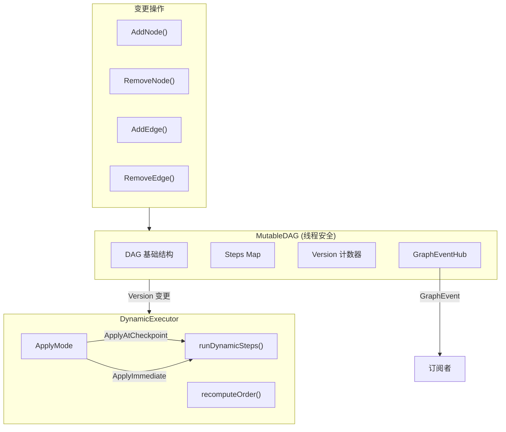

# 运行时动态图（Runtime Dynamic Graph）

**更新日期**: 2026-06-10

## 问题

v1 的 DAG（有向无环图）在构建后不可变。运行时无法：

- 添加新步骤或移除已有步骤
- 修改步骤间的依赖关系
- 根据执行结果动态调整工作流

## 方案

v2 引入 `MutableDAG` + `DynamicExecutor`，支持线程安全的图结构变更和执行期间的动态重排。

## 架构图



## 核心组件

### MutableDAG

位于 `internal/workflow/engine/mutable_dag.go`。在 `DAG` 基础上增加线程安全的变更操作。

```go
// 创建初始 DAG: A → B → C
steps := []*engine.Step{
    {ID: "A", Name: "Step A"},
    {ID: "B", Name: "Step B", DependsOn: []string{"A"}},
    {ID: "C", Name: "Step C", DependsOn: []string{"B"}},
}
dag, err := engine.NewMutableDAG(steps)
```

#### AddNode

添加新节点，验证依赖存在性并检测环路。如果检测到环，自动回滚已添加的边。

```go
// 添加节点 D，依赖 B: A → B → C, B → D
err := dag.AddNode(ctx, &engine.Step{
    ID:        "D",
    Name:      "Step D",
    DependsOn: []string{"B"},
})
```

#### RemoveNode

移除节点及其关联边。如果其他节点依赖该节点，返回 `ErrNodeHasDependents`。

```go
err := dag.RemoveNode(ctx, "C")
// 如果 C 被其他节点依赖，返回 ErrNodeHasDependents
```

#### AddEdge

添加有向边，增量检测环路。

```go
err := dag.AddEdge(ctx, "C", "D")
// 尝试添加会形成环的边
err = dag.AddEdge(ctx, "D", "A") // 返回 ErrCycleDetected
```

#### RemoveEdge

移除有向边。

```go
err := dag.RemoveEdge(ctx, "A", "B")
```

### 增量环检测

`wouldCreateCycle(from, to)` 使用 BFS 从 `to` 出发沿出边遍历，如果能到达 `from` 则说明添加 `from→to` 会形成环。

```go
func (m *MutableDAG) wouldCreateCycle(from, to string) bool {
    visited := make(map[string]bool)
    queue := []string{to}

    for len(queue) > 0 {
        current := queue[0]
        queue = queue[1:]
        if current == from {
            return true
        }
        if visited[current] {
            continue
        }
        visited[current] = true
        for _, neighbor := range m.dag.Edges[current] {
            if !visited[neighbor] {
                queue = append(queue, neighbor)
            }
        }
    }
    return false
}
```

### DynamicExecutor

位于 `internal/workflow/engine/dynamic_executor.go`。支持执行期间的图变更。

#### ApplyMode

两种应用模式：

```go
type ApplyMode int

const (
    ApplyAtCheckpoint ApplyMode = iota // 每步完成后重算执行顺序
    ApplyImmediate                     // 每步开始前重算执行顺序
)
```

- **ApplyAtCheckpoint**: 步骤完成后检查 DAG 版本变更，追加新步骤到执行队列
- **ApplyImmediate**: 步骤开始前检查 DAG 版本变更，适用于需要尽快响应变更的场景

#### 创建与配置

```go
executor := engine.NewDynamicExecutor(
    registry,                  // AgentRegistry (可选)
    engine.ApplyAtCheckpoint,  // 应用模式
    engine.WithMaxParallel(5), // 最大并行数
    engine.WithStepTimeout(60 * time.Second), // 步骤超时
)
```

#### 执行

```go
result, err := executor.ExecuteDynamic(ctx, workflow, initialInput, dag)
// ExecuteDynamic 内部会跟踪 DAG 版本变更
// 新增的步骤会被自动追加到执行队列
```

### GraphEventHub

位于 `internal/workflow/engine/graph_events.go`。提供图变更的 pub/sub 通知。

```go
// 订阅变更事件
events := dag.Subscribe()

// 在另一个 goroutine 中监听
go func() {
    for event := range events {
        fmt.Printf("Change type: %d, success: %v\n",
            event.Change.Type, event.Success)
    }
}()

// 取消订阅
id, ch := hub.Subscribe()
hub.Unsubscribe(id)
```

事件类型：

| ChangeType | 常量 | 说明 |
|-----------|------|------|
| `ChangeAddNode` | 0 | 节点添加 |
| `ChangeRemoveNode` | 1 | 节点移除 |
| `ChangeAddEdge` | 2 | 边添加 |
| `ChangeRemoveEdge` | 3 | 边移除 |

### 线程安全

`MutableDAG` 使用 `sync.RWMutex` 保护所有操作：

- 变更操作（Add/Remove）使用写锁
- 读取操作（GetExecutionOrder/Snapshot/Steps）使用读锁
- `Version()` 使用读锁，供 `DynamicExecutor` 检测变更
- `Snapshot()` 返回深拷贝，适合并发读取

## 完整示例

参考 `examples/v2_demo/mutable_dag/main.go`：

```go
ctx := context.Background()

// 创建初始 DAG
dag, _ := engine.NewMutableDAG([]*engine.Step{
    {ID: "A", Name: "Step A"},
    {ID: "B", Name: "Step B", DependsOn: []string{"A"}},
    {ID: "C", Name: "Step C", DependsOn: []string{"B"}},
})

// 订阅变更事件
events := dag.Subscribe()

// 运行时添加节点
dag.AddNode(ctx, &engine.Step{
    ID: "D", DependsOn: []string{"B"},
})

// 运行时添加边
dag.AddEdge(ctx, "C", "D")

// 环检测
dag.AddEdge(ctx, "D", "A") // 返回 ErrCycleDetected

// 获取快照用于并发读
snapshot := dag.Snapshot()
```

## 注意事项

- 所有变更操作接受 `context.Context`，支持取消
- `AddNode` 在检测到环时会自动回滚已添加的边
- `RemoveNode` 要求无下游依赖，需先移除或重新连接依赖边
- `GraphEventHub` 使用带缓冲 channel（64），满时丢弃事件
- `DynamicExecutor` 会检测死锁（5 秒无进展），返回错误
