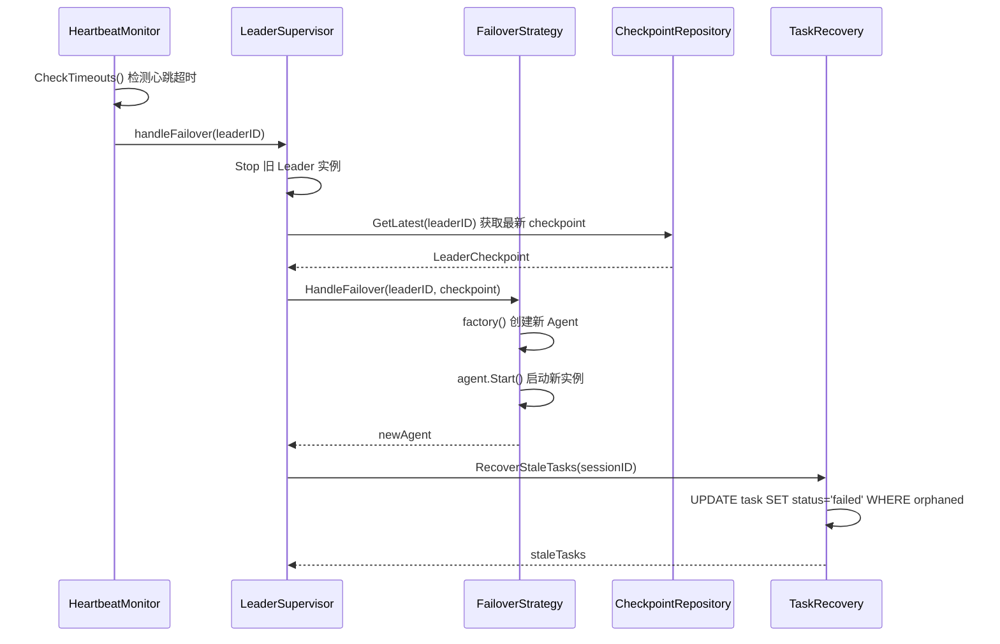

# Leader Failover（Leader 故障转移）

**更新日期**: 2026-06-10

## 问题

在 v1 架构中，Leader Agent 负责任务分发和结果聚合。当 Leader 崩溃时：

- 会话状态丢失，无法恢复中断的任务
- 无自动检测机制，需要人工介入
- Sub Agent 的孤立任务（pending/running）无法清理

## 方案

v2 引入完整的 Leader 故障转移链路：

```
HeartbeatMonitor 检测超时 → LeaderSupervisor 触发回调 →
ColdRestartStrategy 创建新实例 → CheckpointRepository 恢复状态 → TaskRecovery 清理孤立任务
```

## 架构图



## 核心组件

### HeartbeatMonitor

位于 `internal/protocol/ahp/heartbeat.go`。定期检测 Agent 心跳，超时后标记为 offline 并触发回调。

```go
// 配置心跳参数
hbMon := ahp.NewHeartbeatMonitor(&ahp.HeartbeatConfig{
    Interval:  2 * time.Second,  // 心跳间隔
    Timeout:   5 * time.Second,  // 超时阈值
    MaxMissed: 2,                // 最大连续丢失次数
})

// 注册超时回调
hbMon.RegisterCallback(func(agentID string) {
    fmt.Printf("Agent %s timed out\n", agentID)
})
```

关键方法：
- `RecordHeartbeat(agentID)` - 记录心跳，重置 missed count
- `CheckTimeouts()` - 检查所有 Agent，标记超时的为 offline，触发回调
- `RegisterCallback(fn)` - 注册超时回调函数

### LeaderSupervisor

位于 `internal/agents/leader/supervisor.go`。编排整个故障转移流程。

```go
supervisor, err := leader.NewLeaderSupervisor(
    hbMon,     // HeartbeatMonitor
    strategy,  // FailoverStrategy
    recovery,  // TaskRecovery (可选)
    checkpoint,// CheckpointRepository (可选)
    &leader.LeaderSupervisorConfig{
        CheckInterval:       10 * time.Second,
        FailoverTimeout:     2 * time.Minute,
        MaxFailoverAttempts: 3,
    },
)

supervisor.RegisterLeader("leader-1", agent)
supervisor.Start(ctx)
```

### FailoverStrategy

接口定义：

```go
type FailoverStrategy interface {
    HandleFailover(ctx context.Context, leaderID string,
        checkpoint *LeaderCheckpoint) (base.Agent, error)
}
```

内置实现 `ColdRestartStrategy` - 通过工厂函数创建新 Agent 实例：

```go
strategy, _ := leader.NewColdRestartStrategy(
    func(ctx context.Context, config interface{}) (base.Agent, error) {
        return NewLeaderAgent(config), nil
    },
    agentConfig,
)
```

### CheckpointRepository

位于 `internal/agents/leader/checkpoint.go`。基于 PostgreSQL 持久化 Leader 状态快照。

```go
type LeaderCheckpoint struct {
    LeaderID  string          `json:"leader_id"`
    SessionID string          `json:"session_id"`
    Status    string          `json:"status"`
    Metadata  json.RawMessage `json:"metadata"`
    UpdatedAt time.Time       `json:"updated_at"`
}
```

操作：
- `Save(ctx, cp)` - UPSERT checkpoint 到 `leader_checkpoints` 表
- `GetLatest(ctx, leaderID)` - 获取最新 checkpoint
- `Delete(ctx, leaderID)` - 删除 checkpoint

### TaskRecovery

位于 `internal/agents/leader/recovery.go`。清理 Leader 崩溃时的孤立任务。

```go
recovery := leader.NewTaskRecovery(pool)
staleTasks, err := recovery.RecoverStaleTasks(ctx, sessionID)
// 将 status=pending/running 且 output IS NULL 的任务标记为 failed
```

## 故障转移流程

1. **检测**: `HeartbeatMonitor` 定期调用 `CheckTimeouts()`，当 Agent 连续丢失心跳超过 `MaxMissed` 次，标记为 offline
2. **回调**: 触发 `LeaderSupervisor.handleFailover`，通过 `errgroup` 异步执行
3. **停止旧实例**: 调用 `agent.Stop(ctx)` 优雅停止旧 Leader
4. **恢复状态**: 从 `CheckpointRepository` 获取最新 checkpoint
5. **创建新实例**: 调用 `FailoverStrategy.HandleFailover`，最多重试 `MaxFailoverAttempts` 次
6. **清理孤立任务**: `TaskRecovery.RecoverStaleTasks` 将孤儿任务标记为 failed
7. **注册新 Leader**: 更新 supervisor 内部映射

## 完整示例

参考 `examples/advanced/leader_failover/main.go`：

```go
// 1. 创建心跳监控
hbMon := ahp.NewHeartbeatMonitor(&ahp.HeartbeatConfig{
    Interval:  2 * time.Second,
    Timeout:   5 * time.Second,
    MaxMissed: 2,
})

// 2. 创建故障转移策略
strategy, _ := leader.NewColdRestartStrategy(
    func(_ context.Context, _ interface{}) (base.Agent, error) {
        return &mockAgent{id: "leader-1"}, nil
    }, nil,
)

// 3. 创建 supervisor
supervisor, _ := leader.NewLeaderSupervisor(hbMon, strategy, nil, nil, nil)

// 4. 注册 Leader 并启动监控
supervisor.RegisterLeader("leader-1", agent)
supervisor.Start(ctx)
```

## 配置参数

| 参数 | 默认值 | 说明 |
|------|--------|------|
| `CheckInterval` | 10s | Supervisor 检查心跳的间隔 |
| `FailoverTimeout` | 2min | 单次故障转移超时 |
| `MaxFailoverAttempts` | 3 | 最大重试次数 |
| `HeartbeatConfig.Interval` | 5s | 心跳发送间隔 |
| `HeartbeatConfig.Timeout` | 30s | 心跳超时阈值 |
| `HeartbeatConfig.MaxMissed` | 3 | 最大连续丢失次数 |

## 注意事项

- `CheckpointRepository` 和 `TaskRecovery` 依赖 PostgreSQL，demo 中可传 nil
- 回调函数在锁外执行，避免死锁
- `ColdRestartStrategy` 适用于无状态恢复场景，如需热备可自定义 `FailoverStrategy`
