# Multi-Agent Framework Deep Comparison

> LangChain vs CrewAI vs AgentScope vs ARES (ARES) vs tRPC-Agent-Go

---

## 1. Overview

This document provides a thorough, honest technical comparison of five mainstream AI Agent frameworks: **LangChain (incl. LangGraph)**, **CrewAI**, **AgentScope**, **ARES (ARES)**, and **tRPC-Agent-Go**. The comparison covers tech stack, architecture, workflow orchestration, multi-agent collaboration, memory systems, production reliability, deployment, and community maturity.

---

## 2. Tech Stack Comparison

| Dimension | LangChain / LangGraph | CrewAI | AgentScope | ARES (ARES) | tRPC-Agent-Go |
|-----------|----------------------|--------|------------|----------------|---------------|
| **Primary Language** | Python, JavaScript/TypeScript | Python | Python | Go (1.26+) | Go (1.21+) |
| **Core Dependencies** | pydantic, langchain-core, langgraph, langserve | pydantic, crewaillm, langchain | alibaba/mpip (Kubernetes), Flask, etcd | pgx, gorilla/websocket, sqlite, mmh3, blake2b | openai-go v1.12.0, otel v1.29.0, trpc-a2a-go, trpc-mcp-go, ants/v2, zap |
| **LLM Providers** | 50+ (OpenAI, Anthropic, Google, Cohere, Hugging Face, AWS Bedrock, etc.) | OpenAI, Anthropic, Google, Ollama, Groq, Azure, etc. | OpenAI, ModelScope, DashScope, etc. | OpenAI, Ollama, OpenRouter, etc. (plugin-based) | OpenAI, Ollama, etc. |
| **Vector DB** | 30+ (Pinecone, Chroma, Weaviate, Qdrant, FAISS, Milvus, PGVector, etc.) | LanceDB, Chroma | Built-in | PostgreSQL + pgvector (ivfflat index) | Built-in memory store, knowledge retrieval, SQLite with vector extension |
| **Document Loaders** | 100+ (PDF, HTML, LaTeX, Markdown, CSV, JSON, DB, S3, Web) | Few built-in | Moderate | None (code/task focused, not document) | None |
| **Communication Protocol** | REST (LangServe), SSE, limited gRPC | In-process function calls | Service Hub messaging, gRPC | AHP Protocol (TASK/RESULT/PROGRESS/ACK/HEARTBEAT) | tRPC (native), A2A Agent-to-Agent, AG-UI, MCP, OpenAI-compatible API |
| **Dependency Mgmt** | Layered: langchain-core, -community, -langchain, -experimental | Single: crewaillm, crewai | Single + distributed deps | Single module + Go modules | tRPC-Go service modules |

### 2.1 Key Tech Stack Differences

**LangChain** has the largest ecosystem (1000+ integrations), which is both its core strength and its burden. Layered package design complicates installation and dependency management.

**CrewAI** is lightweight and emphasizes out-of-box experience. It uses some LangChain components internally (e.g., LLM calling).

**AgentScope** leverages Alibaba's tech stack with built-in distributed communication (RPC, messaging) and good Kubernetes support.

**ARES** is pure Go with zero Python dependencies. It takes advantage of Go's static compilation and goroutine concurrency, resulting in millisecond-level startup overhead.

---

## 3. Architecture Design

### 3.1 Core Abstractions

| Framework | Core Abstraction | Design Philosophy | Architecture Style |
|-----------|-----------------|-------------------|-------------------|
| **LangGraph** | StateGraph (cyclic directed graph) | Graph computation model, node=function, edge=transition | Stateful graph execution engine |
| **CrewAI** | Crew + Agent + Task | Team collaboration metaphor, role-driven | Linear/hierarchical pipeline |
| **AgentScope** | Agent + Service Hub | Distributed message passing, service-oriented | Distributed message-driven |
| **ARES (ARES)** | Leader-Sub Agent + DAG + AHP | Distributed task orchestration, protocol-driven | Leader-subordinate architecture |
| **tRPC-Agent-Go** | GraphAgent + Runner + Agent | Service-friendly, tRPC-native agent architecture | Go-native agent runtime with Pregel-style graph workflows |

### 3.2 Architecture Diagrams

#### LangGraph — Directed Graph with Cycles

#### LangGraph — Directed Cyclic Graph

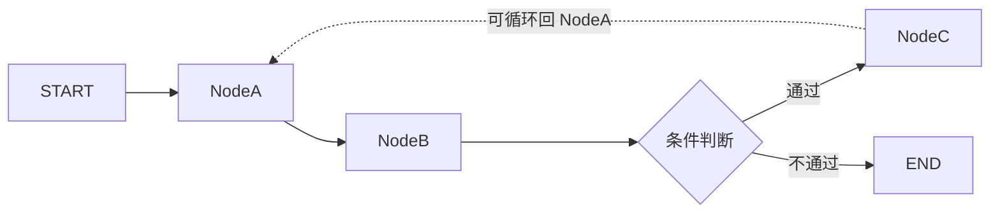

LangGraph's core is a **directed graph**. Nodes are processing steps, edges are control flow, supporting **conditional branches** and **cycles**. The checkpointing mechanism allows pausing and resuming at any node.

#### CrewAI — Team Collaboration Pipeline

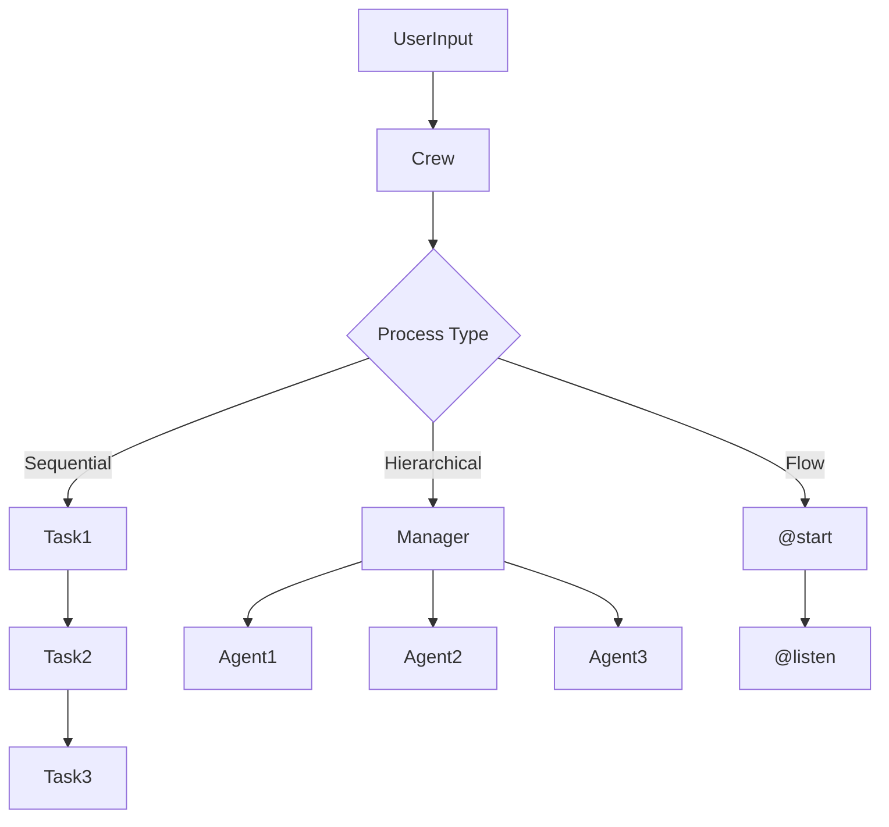

CrewAI organizes around "teams". A Crew defines Agent sets and Process types:
- **Sequential**: Tasks execute in order, output chains
- **Hierarchical**: Manager Agent dynamically assigns tasks
- **Flow**: `@start`/`@listen` decorator-driven event pipeline

#### AgentScope — Distributed Message Passing

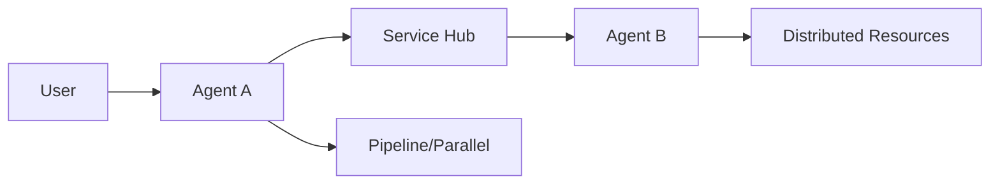

AgentScope uses Service Hub for message routing and decoupling between agents. Supports single-node multi-process and distributed multi-node deployments. Built-in Pipeline pattern for DAG execution.

#### ARES — Leader-Sub with AHP

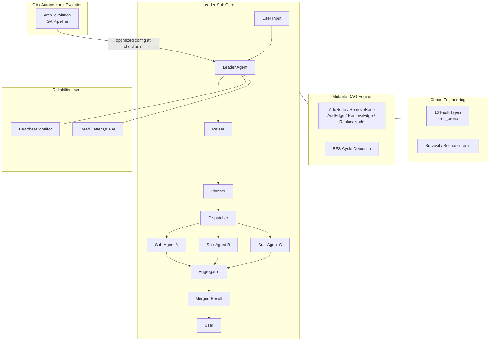

ARES uses a Leader-Sub architecture communicating via the AHP (Agent Heartbeat Protocol). The Leader handles planning, dispatching, and aggregation; Sub-Agents execute tasks in parallel.

### tRPC-Agent-Go — Go-Native Agent Runtime + Graph Workflows

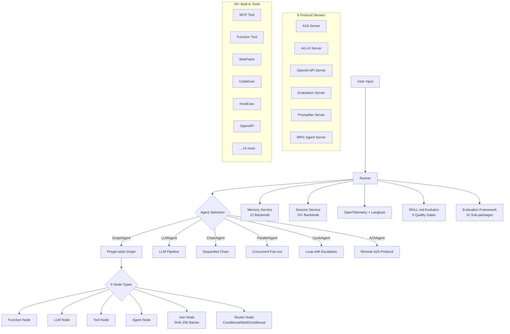

### 3.3 Architecture Key Differences

**LangGraph**'s graph model is the most flexible, supporting complex state machines, cycles, and conditional routing. The cost is a steep learning curve.

**CrewAI**'s team metaphor is the most intuitive, even for non-technical users. However, flexibility is limited.

**AgentScope**'s distributed architecture suits enterprise deployments. But the community is small and documentation is primarily Chinese.

**ARES**'s Leader-Sub pattern is best for deterministic task distribution. The AHP protocol provides **protocol-level reliability guarantees** (heartbeat + dead letter queue) absent from all three other frameworks.

**tRPC-Agent-Go**'s Runner + GraphAgent architecture is the most service-friendly, integrating natively with tRPC-Go microservices. The Pregel-style graph engine with 6 node types offers full workflow coverage while remaining type-safe and deterministic.

---

## 4. Workflow Orchestration

### 4.1 Workflow Capabilities

| Capability | LangGraph | CrewAI | AgentScope | ARES (ARES) | tRPC-Agent-Go |
|-----------|-----------|--------|------------|----------------|---------------|
| **DAG Support** | Native | Sequential/Hierarchical only | Pipeline mode | Native DAG | GraphAgent (Pregel-style graph, 6 node types) |
| **Conditional Edges** | `add_conditional_edges` | None | Pipeline condition nodes | `Step.Condition` + `Step.Router` (runtime dynamic routing) | `ConditionalFunc` / `MultiConditionalFunc` routing |
| **Cycles/Loops** | Native | Not supported | Not supported | `LoopConfig` (controlled loops with MaxIterations/UntilCondition) | ChainAgent (sequential), CycleAgent (loop with EscalationFunc), ParallelAgent (concurrent) |
| **Parallel Execution** | Same super-step nodes | `async_execution=True` | Pipeline parallel | errgroup + semaphore | Concurrent with sync.WaitGroup + mutex |
| **Subgraph Nesting** | Supported (node=subgraph) | Flow wraps Crews | Not supported | `Step.SubWorkflow` + `SubGraphNode` (isolated state, recursive execution) | Supported (agent-as-node in StateGraph) |
| **Topological Sort** | Implicit (graph traversal) | Not needed | Implicit | Kahn's algorithm (explicit) | Implicit (graph traversal via Pregel channels) |
| **Hot Reload** | Not supported | Not supported | Not supported | fsnotify file watcher + polling | Not documented |
| **Cycle Detection** | Not needed (cycles allowed) | Not needed | Not needed | DFS + recursion stack | Not needed (GraphAgent supports cycles) |
| **Live Graph Mutation** | Not supported | Not supported | Not supported | 5 ops | Not supported |
| **Human-in-the-loop** | `interrupt()` | `human_input=True` | Supported | InterruptPoint + InterruptStore | Supported (session-based interrupts) |
| **Step Recovery** | Checkpoint replay | Not supported | Not supported | 3 strategies | Not documented |
| **Self Evolution** | Not native | Not supported | Not supported | GA-based strategy evolution | Hermes-style SKILL.md evolution pipeline with 5 quality gates |
| **MCP Support** | Via LangChain MCP | Not native | Not native | Native WithMCP | Native mcptool integration |
| **Protocol Support** | LangServe | None | gRPC | AHP | tRPC, A2A, AG-UI, MCP, OpenAI-compatible, Evaluation, PromptIter |

### 4.2 ARES DAG Features

ARES's DAG engine has unique characteristics:
- **Explicit cycle detection**: DFS + recursion stack at build time
- **Kahn's topological sort**: Explicit computation of execution order
- **Semaphore concurrency control**: Same-level independent nodes execute in parallel
- **Deadlock detection**: 5-second timeout with automatic rollback
- **Hot reload**: fsnotify file watcher auto-reloads workflow config without restart

#### Conditional Edges & Dynamic Routing (v0.2.6+)

ARES supports two mechanisms for conditional execution:

| Mechanism | When Evaluated | Behavior on false |
|-----------|---------------|-------------------|
| `Step.Condition` | Before step execution | Step is **skipped** (marked `StepStatusSkipped`), downstream deps see it as completed |
| `Step.Router` | After step completes | Dynamically enqueues **any** step ID for next execution based on step output |

`Step.Router` is a `NodeRouter` callback `func(ctx, stepID, vars, output) string` that receives the step's output at runtime and returns the next step to execute. This enables LLM-driven branching without pre-declaring all conditional paths.

```go
step := &Step{
    ID: "classify", AgentType: "router-agent",
    Router: func(ctx context.Context, stepID string, vars map[string]any, output string) string {
        if strings.Contains(output, "urgent") {
            return "fast_path"   // route to fast_path
        }
        return "standard_path"  // default route
    },
}
```

#### Controlled Loops (v0.2.6+)

`LoopConfig` provides bounded, safe iteration — unlike LangGraph's arbitrary cycles:

```go
workflow := &Workflow{
    LoopConfig: &LoopConfig{
        MaxIterations:  5,
        UntilCondition: func(vars map[string]any, iter int) bool { return done },
        LoopSteps:      []string{"collect", "process"},
    },
}
```

Key safety guarantees:
- **Hard upper bound**: `MaxIterations` prevents infinite loops
- **Conditional exit**: `UntilCondition` receives current iteration count
- **State preservation**: Results accumulate across iterations; loop state persists in checkpoint
- **DAG integrity**: Loop body is declared explicitly; no arbitrary back-edges

#### Subgraph Nesting (v0.2.6+)

Steps can embed a complete sub-workflow via `Step.SubWorkflow` (engine package) or `SubGraphNode` (graph package):

```go
// Engine package
step := &Step{
    ID: "validate", SubWorkflow: &Workflow{
        Steps: []*Step{
            {ID: "check", AgentType: "validator"},
            {ID: "enrich", AgentType: "enricher", DependsOn: []string{"check"}},
        },
    },
}

// Graph package
subGraph, _ := wfgraph.NewGraph("sub")
subGraph.Node("a", fnA).Node("b", fnB).Edge("a", "b")
subNode, _ := wfgraph.NewSubGraphNode("sub", subGraph)
parent.Node("sub", subNode)
```

Sub-graphs have **isolated state space** — execution results merge back to parent only after completion, preventing accidental state pollution.

#### State Checkpointing (v0.2.6+)

Both engines support pluggable checkpoint persistence:

- **Engine**: `WithCheckpointStore(store)` on executor → auto-saves `StepResult` list after each step via `saveCheckpoint`
- **Graph**: `SetCheckpointStore(store)` on graph → auto-saves executed node IDs + state snapshot after each node via `saveGraphCheckpoint`
- **Non-blocking**: Checkpoint failures are logged as warnings and do not interrupt execution

```go
// DFS cycle detection
func (d *DAG) hasCycle() bool {
    visited := make(map[string]bool)
    recStack := make(map[string]bool)
    for _, neighbor := range d.Edges[node] {
        if recStack[neighbor] { return true }  // back edge → cycle
        if !visited[neighbor] && dfs(neighbor) { return true }
    }
    return false
}

// Kahn's topological sort
func (d *DAG) GetExecutionOrder() ([]string, error) {
    // compute in-degree → BFS from zero-indegree nodes
    // result count != node count → cycle detected
}
```

#### Mutable DAG — Runtime Graph Mutation (ARES Exclusive)

ARES supports **live DAG mutation** during execution — no other framework allows modifying the workflow graph at runtime:

| Mutation Operation | Description | Safety Check |
|-------------------|-------------|-------------|
| AddNode | Insert a new node into the graph | Rollback on failure |
| RemoveNode | Remove a node from the graph | Checks for dependent nodes first |
| AddEdge | Add a directed edge between nodes | BFS cycle detection |
| RemoveEdge | Remove an edge from the graph | Updates topological order |
| ReplaceNode | Swap one node implementation for another | Preserves dependency context |

**BFS Cycle Detection** (avoids DFS stack overflow on deep graphs):
```go
func (d *MutableDAG) wouldCreateCycle(from, to string) bool {
    // BFS from 'to' node — if 'from' is reachable, adding edge (from→to) creates a cycle
    queue := []string{to}
    visited := map[string]bool{to: true}
    for len(queue) > 0 {
        current := queue[0]
        queue = queue[1:]
        for _, neighbor := range d.adjacencyList[current] {
            if neighbor == from { return true }
            if !visited[neighbor] {
                visited[neighbor] = true
                queue = append(queue, neighbor)
            }
        }
    }
    return false
}
```

**GraphEventHub** — pub/sub for graph change notifications:
```go
type GraphEventHub struct {
    subscribers map[string]chan GraphChangeEvent
    bufferSize  int // 64 per channel
    mu          sync.RWMutex
}

// Non-blocking publish with 5 change types:
// NodeAdded / NodeRemoved / EdgeAdded / EdgeRemoved / NodeReplaced
```

### 4.3 LangGraph Checkpointing

LangGraph's state management is the most advanced among the four:
- **Checkpoint persistence**: State auto-saved to PostgreSQL/SQLite after each super-step
- **State replay**: Resume from any checkpoint
- **Human-in-the-loop**: Pause via `interrupt_before`/`interrupt_after` for manual input
- **3 durability modes**: `durable`, `recent`, `off`

This is ARES's main gap—state is in-memory and lost on crash. **Addressed in v0.2.6**: `saveCheckpoint` persist step results via pluggable `CheckpointStore` (PostgreSQL/SQLite/Redis) after each step. The graph package also saves state per-node via `saveGraphCheckpoint`.

### 4.4 Dynamic Executor & Step Recovery (ARES Exclusive)

ARES's DynamicExecutor provides runtime workflow mutation that no other framework offers:

```go
type ApplyMode int
const (
    ApplyAtCheckpoint ApplyMode = iota // apply changes at safe points
    ApplyImmediate                      // apply changes immediately
)

type StepRecoveryHandler struct {
    Strategy    RecoveryStrategy // retry / replace_node / fail_fast
    MaxRetries  int              // exponential backoff, max 3
    Fallback    string           // fallback node ID for replace strategy
}
```

**Three Recovery Strategies**:
- **retry**: Exponential backoff retry (max 3 attempts) with jitter
- **replace_node**: Swap failed node with a specified fallback node (preserving dependency context)
- **fail_fast**: Immediately fail the entire workflow with detailed error context

#### Human-in-the-Loop (HITL)

ARES's HITL system uses `InterruptPoint` + `InterruptStore` for crash-resilient pauses:

```go
type InterruptPoint struct {
    NodeID      string
    State       WorkflowState // serialized workflow state snapshot
    CreatedAt   time.Time
    ResumeToken string
}
```

`InterruptStore` persists to disk for crash survival — a paused workflow survives process restarts.

---

## 5. Multi-Agent Collaboration

### 5.1 Collaboration Patterns

| Pattern | LangGraph | CrewAI | AgentScope | ARES (ARES) | tRPC-Agent-Go |
|---------|-----------|--------|------------|----------------|---------------|
| **Supervisor/Orchestrator** | Subgraph composition | Hierarchical Process | Service Hub | Leader Agent | Runner + chain/parallel/cycle agent composition |
| **Peer-to-peer** | Shared state nodes | Task output chaining | Message routing | AHP point-to-point | Sub-agent composition, A2A remote agent protocol |
| **Task Distribution** | Graph node scheduling | Manager Agent dynamic assignment | Pipeline dispatch | Dispatcher + errgroup | Chain/parallel/cycle execution patterns |
| **Result Aggregation** | State merge | Task output chaining | Message aggregation | Aggregator (dedup + sort) | Runner result collection via event channels |
| **Determinism** | High (graph-defined) | Low (LLM-driven) | Medium (Pipeline-defined) | High (keyword-triggered dispatch) | High (type-safe graph, deterministic routing) |

### 5.2 Collaboration Determinism

**ARES** has the highest determinism:
- Agent selection based on **trigger keywords** (`trigger_on`)
- Planning based on **rules**, not LLM
- Aggregation uses **deterministic algorithms** (dedup + sort)

**CrewAI** has the lowest determinism:
- Manager Agent uses LLM for dynamic task assignment
- Output format depends on LLM generation quality
- Complex, uncontrollable context dependency chains

**LangGraph**'s graph structure provides deterministic control flow, but node-level LLM calls remain non-deterministic.

**AgentScope** provides medium determinism through pre-defined Pipeline message routes.

### 5.3 AHP Protocol

ARES's AHP protocol is the **only protocol-level communication guarantee** among the four:

| Message Type | Purpose | Frequency |
|-------------|---------|-----------|
| TASK | Leader dispatches to Sub | On demand |
| RESULT | Sub returns result to Leader | On demand |
| PROGRESS | Sub reports progress | Optional, configurable |
| ACK | Message acknowledgement | Per message |
| HEARTBEAT | Liveness check | Every 5 seconds |

**Heartbeat detection**: 5s interval, 30s timeout → agent marked offline → task redispatch.
**Dead Letter Queue (DLQ)**: Failed messages enter DLQ (max 10000), DLQProcessor retries or records.

---

## 6. Memory Systems

### 6.1 Memory Capabilities

| Dimension | LangChain/LangGraph | CrewAI | AgentScope | ARES (ARES) | tRPC-Agent-Go |
|-----------|-------------------|--------|------------|----------------|---------------|
| **Short-term** | Checkpointed state | Current run context | Session message history | Session Memory (in-memory) | Session state (10+ backends) |
| **Long-term** | Store (PostgresStore, etc.) | LanceDB vector store | Built-in storage | PostgreSQL + pgvector | Memory service with 12 backends |
| **Entity Memory** | Not supported | Knowledge Graph | Not supported | MemoryProfile type | Artifact system, knowledge base |
| **Deduplication** | Not supported | cosine > 0.85 + LLM decision | Not supported | cosine > 0.85 conflict detection | Not documented |
| **Importance Scoring** | Not supported | `0.5*sim + 0.3*recency + 0.2*llm` | Not supported | Keyword + type + length rules | Not documented |
| **Distillation** | Not supported | Not supported | Not supported | 6-step automated pipeline | Not documented |
| **Multi-tenancy** | namespace tuple | Not supported | Not supported | PostgreSQL `SET LOCAL` | Session isolation, per-user/per-app segmentation |

### 6.2 ARES Memory Distillation Pipeline

ARES's automated distillation pipeline is a unique differentiator:

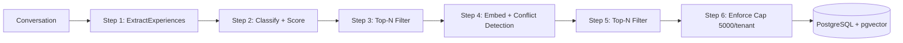

**Step 2 Details**: SecurityFilter → NoiseFilter → Classifier (Profile/Interaction/Preference/Knowledge) → Scorer (base 0.4 + keywords + type + length)

**Step 4 Details**: Generate embedding → cosine similarity → >0.85 triggers conflict detection → replace old if new has higher confidence / otherwise keep both

### 6.3 CrewAI Memory Recall

```python
# Composite scoring: 0.5*semantic_similarity + 0.3*recency_decay + 0.2*llm_importance
score = 0.5 * semantic_similarity + 0.3 * recency_decay + 0.2 * llm_importance
```

**Key Differences**:
- ARES's memory is an **automated pipeline** (rule-driven, nanosecond latency), CrewAI's is **LLM-assisted** (more accurate but slower and costlier)
- ARES has **multi-tenant isolation** (PostgreSQL `SET LOCAL`), others don't
- LangGraph's Store is most flexible (namespace tuples), but has no automated distillation
- AgentScope's memory is the most basic

### 6.4 Autonomous Evolution (ARES Exclusive)

ARES is the **only framework** with a built-in Genetic Algorithm (GA) pipeline for autonomous agent evolution. The `ares_evolution` package enables agents to self-improve through selection, crossover, mutation, and scoring cycles.

#### Selection: TournamentSelection

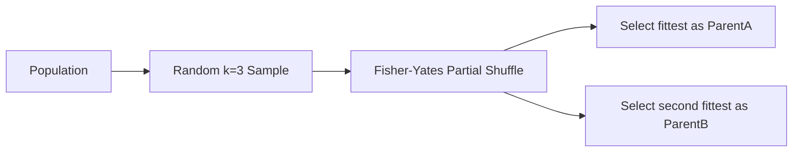

K=3 tournament with Fisher-Yates partial shuffle (stops after `k*selectCount` iterations for O(k) efficiency).

#### Crossover: UniformCrossover

- **Per-parameter probability**: 50% chance to inherit from ParentA vs ParentB
- **Prompt modes**: Concatenate / Interleave / Structured template merge

#### Mutation: 5 Types

| Mutation Type | Value | Description |
|--------------|-------|-------------|
| ParameterMutation | 1 | Tweak numeric parameters (temperature, top_p, max_tokens) |
| PromptMutation | 2 | Modify agent instruction prompts |
| ToolMutation | 3 | Add/remove/swap tool configurations |
| CrossoverMutation | 4 | Recombine two parent genomes |
| RootMutation | 5 | High-impact structural changes |

#### AdaptiveDistribution

Dynamically adjusts mutation probabilities based on historical success:

```
P_new = P_old + LR × (reward - baseline)
Clipped to [MinProbability, MaxProbability]
ExplorationFloor = 0.03 (minimum probability for each mutation type)
```

#### Scoring: TieredScorer (3-Level)

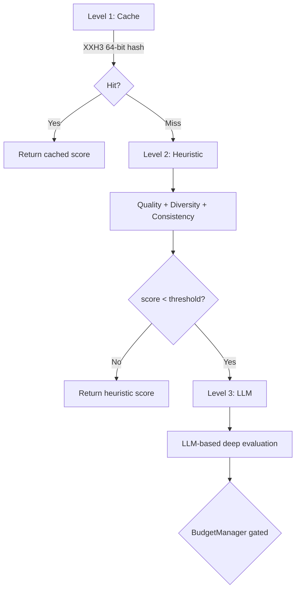

**MemoryAwareScorer** formula:
```
totalScore = 0.6 × quality + 0.2 × memoryBonus - 0.1 × costPenalty - 0.05 × latencyPenalty - 0.1 × regressionPenalty
```

#### DreamCycle (Two-Phase Evaluation)

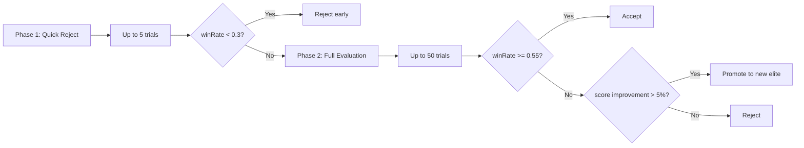

#### EvolutionGuardrails

| Guardrail | Threshold | Action |
|-----------|-----------|--------|
| Baseline Regression | < 80% of baseline | Critical — stop evolution |
| Stagnation | 10 generations without improvement | Warning — boost mutation rate |
| Score Volatility | StdDev > 0.3 | Warning — reduce mutation rate |
| Max Generations | Configurable | Hard stop |

#### Population & Lineage

- **Population config**: Size=20, SurvivalRate=0.6, MutationRate=0.2, EliteCount=3, FitnessSharingSigma=0.3, NicheRadius=0.15
- **Lineage tracking**: ParentID → ChildID → MutationType → WinRate → ScoreImprovement → Timestamp

---

## 7. Tool Calling & Reliability

### 7.1 Error Handling Mechanisms

| Mechanism | LangGraph | CrewAI | AgentScope | ARES | tRPC-Agent-Go |
|-----------|-----------|--------|------------|---------|---------------|
| **Retry** | None built-in | `max_retry_limit=2` | Basic retry | 3x exponential backoff | Supported via evolution pipeline |
| **Timeout** | None built-in | `max_execution_time` | None built-in | Tiered (LLM 120s, DB 30s, Vector 10s) | Not documented |
| **Output Validation** | None built-in | `output_pydantic` + Guardrails | None built-in | Schema Validator | Schema-based output validation |
| **Fallback** | Fallbacks param | None built-in | None built-in | FailoverClient (multi-provider + rate-limit cooldown) | Not documented |
| **Circuit Breaker** | Not supported | Not supported | Not supported | 3-state FSM (Closed/Open/HalfOpen) | Not documented |
| **Dead Letter Queue** | Not supported | Not supported | Not supported | DLQ + DLQProcessor | Supported (via Runner event routing) |
| **Human-in-the-loop** | `interrupt()` | `human_input=True` | Supported | InterruptPoint + InterruptStore (crash-resilient) | Supported |
| **Chaos Engineering** | Not supported | Not supported | Not supported | 13 fault types, Survival/Scenario modes | Not documented |

### 7.2 ARES Circuit Breaker

```go
func (cb *CircuitBreaker) AllowRequest() bool {
    switch cb.state {
    case StateClosed:
        return true
    case StateOpen:
        if time.Since(cb.lastFailure) > cb.timeout {
            atomic.CompareAndSwapInt32(&cb.state, StateOpen, StateHalfOpen)
            return true  // allow one probe request
        }
        return false
    case StateHalfOpen:
        return atomic.CompareAndSwapInt32(&cb.halfOpenInflight, 0, 1)
    }
}
```

### 7.3 ARES Retry with Validation

```go
func (e *taskExecutor) executeWithLLM(ctx context.Context, task *models.Task) (*models.TaskResult, error) {
    for attempt := 0; attempt < e.maxRetries; attempt++ {
        result, err := e.llmClient.Generate(ctx, task.Prompt)
        if err != nil { continue }

        if err := e.validator.Validate(result); err != nil {
            if e.strictMode { return nil, err }
            if e.retryOnFail { continue }
        }
        return result, nil
    }
    return e.executeByType(ctx, task)  // fallback
}
```

**Verdict: ARES leads by a significant margin in tool calling reliability**. Circuit breaker, DLQ, tiered timeouts, and automatic fallback are completely absent from the other three frameworks.

### 7.4 Chaos Engineering (ARES Exclusive)

ARES is the **only framework** with built-in Chaos Engineering for multi-agent systems. The `ares_arena` package provides systematic fault injection for testing resilience of agent workflows.

**13 Fault Injection Types**:

| Fault Type | Target | Description |
|-----------|--------|-------------|
| KillLeader | Leader Agent | Force-kill the leader to test failover |
| KillAgent | Sub-Agent | Kill a specific sub-agent mid-task |
| RemoveNode | DAG | Remove a live DAG node and observe recovery |
| RemoveEdge | DAG | Remove a DAG edge to break connectivity |
| PauseAgent | Sub-Agent | Pause agent execution indefinitely |
| ResumeAgent | Sub-Agent | Resume a paused agent |
| SlowAgent | Sub-Agent | Inject artificial latency (configurable) |
| KillOrchestrator | Orchestrator | Kill the orchestrator process |
| NetworkPartition | Network | Simulate network disconnection between agents |
| ToolTimeout | Tool | Force a tool call to timeout |
| MemoryCorrupt | Memory | Corrupt agent memory/state |
| MCPDisconnect | MCP | Disconnect MCP server mid-session |
| LLMFailure | LLM | Simulate LLM API failure or garbage response |

**Two Operation Modes**:

**Survival Mode** — Random attacks at configurable intervals, returns `ResilienceScore`:
```go
type SurvivalConfig struct {
    AgentCount        int           // number of agents in the test
    MinAgents         int           // minimum agents before declaring failure
    AttackInterval    time.Duration // interval between random attacks
    AttackTypes       []ActionType  // subset of 13 fault types to randomize
}
```

**Scenario Mode** — YAML-defined sequential fault injection with validation:
```yaml
scenario:
  - action: KillAgent
    target: "data-collector"
    expect: "task-redirected"
  - action: NetworkPartition
    target: "analyzer"
    duration: 30s
    expect: "degraded-but-functional"
```

**Market-making Chaos** (`api/marketmaking/chaos.go`): Specialized chaos for trading systems with 6 market-specific fault types (OrderDelay, PriceFeedHalt, PositionFreeze, BalanceSkew, MarginCall, LiquidationHalt).

---

## 8. Production Readiness

### 8.1 Production-Grade Features

| Feature | LangChain/LangGraph | CrewAI | AgentScope | ARES (ARES) | tRPC-Agent-Go |
|---------|--------------------|--------|------------|----------------|---------------|
| **Language** | Python | Python | Python | Go | Go |
| **Concurrency** | asyncio | asyncio | asyncio + multi-process | goroutine + channel | goroutine + channel + goroutine pool (ants/v2) |
| **Connection Pool** | Via psycopg, etc. | Not supported | Built-in | Custom Pool (MaxOpen=25) | tRPC connection pool |
| **Circuit Breaker** | Not supported | Not supported | Not supported | 3-state FSM | Not documented |
| **Rate Limiting** | None built-in | Not supported | None built-in | TokenBucket/SlidingWindow/Semaphore | Not documented |
| **Multi-tenancy** | namespace | Not supported | Not supported | PostgreSQL RLS + SET LOCAL | Session isolation, per-user segmentation |
| **PII Redaction** | None built-in | None built-in | None built-in | Regex masking | Not documented |
| **SQL Injection Prevention** | N/A | N/A | N/A | Table name regex + keyword detection | N/A |
| **Observability** | LangSmith (paid) | Basic logging | Basic logging | Tracer + Metrics (Prometheus) | OpenTelemetry (trace+metric) + Langfuse tracing, 7 sub-packages |
| **Chaos Engineering** | Not supported | Not supported | Not supported | 13 fault types, Survival/Scenario modes, ResilienceScore | Not documented |
| **Autonomous Evolution (GA)** | Not supported | Not supported | Not supported | TournamentSelection, UniformCrossover, 5 mutations, TieredScorer, DreamCycle | Hermes-style SKILL.md evolution pipeline with 5 quality gates |
| **Deployment** | LangGraph Platform | Local/container | Kubernetes-first | Docker containerized | tRPC service deployment, 6 protocol servers |
| **Startup Overhead** | High (LangChain ecosystem load) | Medium | Medium | Low (native Go binary) | Low (native Go binary) |
| **Error Wrapping** | None specific | None specific | None specific | Error wrapping (69ns/op, 0 alloc) | tRPC error handling conventions |

### 8.2 ARES Protection Stack

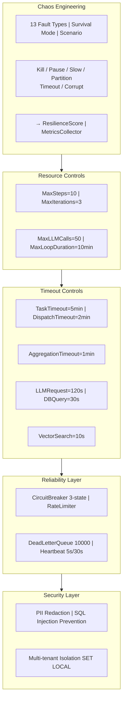

### 8.3 Observability

**LangChain/LangGraph**: LangSmith provides the most comprehensive observability—full tracing, evaluation management, model comparison, replay debugging. But it's **paid** software.

**CrewAI**: Basic logging only, no dedicated observability platform.

**AgentScope**: Basic logging and monitoring.

**ARES**: Built-in OpenTelemetry tracing + Prometheus metrics (counters/histograms/gauges/summary) + cost tracking. All open source and free.

---

## 9. Community & Ecosystem Maturity

| Metric | LangChain | CrewAI | AgentScope | ARES (ARES) | tRPC-Agent-Go |
|--------|----------|--------|------------|----------------|---------------|
| **GitHub Stars** | ~100,000+ | ~40,000 | ~4,000 | Private/early | ~1,500 |
| **Main Contributors** | 1,200+ | 300+ | ~50 | 2 | ~20 |
| **License** | MIT | MIT | Apache 2.0 | Apache 2.0 | Apache 2.0 |
| **First Release** | Oct 2022 | 2023 | 2024 | 2025 | 2025 |
| **Current Version** | v0.3.x (Python) | v0.8x+ | v0.x | v0.3.0 | v0.x |
| **Integration Ecosystem** | 1,000+ official + community | 50+ built-in tools | Limited | Extensible plugin | MCP tools, function tools, 20+ built-in tools |
| **Monthly Downloads** | >15M | >5M | Unknown | Unknown | Unknown |
| **Funding** | Benchmark A $25-35M | Independent development | Alibaba Group | Open source project | tRPC Group (Tencent) |
| **Enterprise Adoption** | JPMorgan, IBM, Salesforce, Airbnb | SMBs primarily | Alibaba internal + partners | Growing | tRPC ecosystem users |
| **Documentation** | Broad but inconsistent (old/new API) | Clear, beginner-friendly | Chinese primarily | Improving (EN + CN) | EN + CN |

---

## 10. Strengths & Weaknesses

### 10.1 LangChain/LangGraph

**Strengths**:
- Largest ecosystem (1000+ integrations), maximum model agnosticism
- LCEL `|` pipe syntax is elegant and intuitive
- Most advanced state management (checkpointing, replay, HITL)
- Most comprehensive RAG pipeline supporting all major strategies
- Largest community, most learning resources

**Weaknesses**:
- Too many abstraction layers, error messages are hard to trace
- Frequent breaking API changes, high maintenance burden
- Performance overhead (deep abstraction call stack)
- "Jack of all trades" — broad but shallow in some areas
- LangSmith is paid

### 10.2 CrewAI

**Strengths**:
- Low barrier to entry, intuitive team metaphor
- Role-driven design makes agent behavior understandable
- 50+ built-in tools, out-of-box experience
- Flow mode (`@start`/`@listen`) improves flexibility

**Weaknesses**:
- Low determinism, LLM decisions are uncontrollable
- No production-grade features (circuit breaker, DLQ, etc.)
- Python GIL limits concurrent performance
- Insufficient flexibility for complex scenarios
- Memory relies on LLM, which is costly

### 10.3 AgentScope

**Strengths**:
- Native distributed architecture for multi-node deployment
- Deep integration with Alibaba Cloud / ModelScope ecosystem
- Message-driven design suits loosely coupled systems
- Pipeline mode is friendly for deterministic tasks

**Weaknesses**:
- Small community, limited international influence
- Documentation primarily in Chinese
- Lacks production reliability mechanisms (circuit breaker, DLQ, etc.)
- Basic memory system
- Difficult to integrate outside Alibaba ecosystem

### 10.4 ARES (ARES)

**Strengths**:
- **Go-native concurrency**: goroutines + channels, full multi-core utilization, no GIL
- **AHP Protocol**: Only protocol-level communication guarantees — heartbeat + DLQ + message ACK
- **Highest production readiness**: Circuit breaker, rate limiter, PII redaction, SQL injection prevention, multi-tenant isolation — all built-in
- **Automated memory distillation**: 6-step rule pipeline, nanosecond latency, no LLM call cost
- **Low startup overhead**: Go static compilation, millisecond startup
- **Hot reload**: fsnotify file watcher, zero-restart config updates
- **Chaos Engineering**: 13 fault injection types, Survival/Scenario modes — only framework with built-in Chaos Engineering
- **Autonomous Evolution**: Full GA pipeline with TournamentSelection, UniformCrossover, 5 mutation types, TieredScorer, DreamCycle, Guardrails — only framework with GA-driven self-improvement
- **Mutable DAG**: Runtime DAG mutation (AddNode/RemoveNode/AddEdge/RemoveEdge/ReplaceNode) with BFS cycle detection and GraphEventHub — only framework with live graph mutation

**Weaknesses**:
- **Early stage project**: v0.3.0, 2 contributors, ecosystem far from established
- **State checkpointing**: Added in v0.2.6 (step-level + graph-level persistence), `ExecuteFromCheckpoint` supports resume-from-crash. `saveGraphCheckpoint` persists per-node state via pluggable `CheckpointStore`
- **Controlled loops**: Added in v0.2.6 (`LoopConfig` with MaxIterations/UntilCondition) but only supports bounded iteration — no LangGraph-style arbitrary cycles
- **Conditional edges**: Added in v0.2.6 (`Step.Condition` for pre-execution skip, `Step.Router` for post-execution dynamic routing) covering most branching needs. `graph.Condition` + `NodeRouter` provide conditional branching and additive dynamic routing
- **Small community**: Few learning resources, third-party integrations, or plugin ecosystem
- **GA/Evolution still early**: GA pipeline exists but needs more real-world validation and optimization
- **Data race fixes**: v0.3.0 resolved `SetHTTPHandler` race, `NewCollector` nil-vs-error contract, `Configure` lock, and `Rank` silent-error path
- **Storage hardening**: v0.3.0 unified table validation to whitelist + quote, replaced `redis.Keys` with `SCAN` cursor iteration, fixed 5 occurrences of bypassed SQL injection prevention
- **FeedbackService wired**: v0.3.0 connects `FeedbackService` from bootstrap `EvolutionComponents` to `leader.New()` via `WithFeedbackService()`, closing the bandit feedback loop
- **Scheduler variety**: 5 pluggable schedulers (FIFO/Priority/ShortJob/RoundRobin/WeightedFair), all thread-safe

### 10.5 tRPC-Agent-Go

tRPC-Agent-Go is positioned as a **Go-native production-grade agent framework integrated with the tRPC ecosystem**.

**Strengths**:
- **Go-native**: Full goroutine concurrency model, static compilation, no GIL
- **tRPC ecosystem integration**: Native tRPC protocol support, seamless integration with tRPC-Go microservices
- **Rich agent types**: 6 built-in types (GraphAgent, LLMAgent, ChainAgent, ParallelAgent, CycleAgent, A2AAgent) covering all major multi-agent patterns
- **Pregel-style graph engine**: 6 node types, SHA-256 barrier synchronization, conditional routing, full state graph with 30+ options
- **Production observability**: OpenTelemetry + Langfuse tracing, Prometheus metrics, all 7 telemetry sub-packages
- **Complete tool system**: 3-tier interfaces (Tool/CallableTool/StreamableTool), 20+ built-in tools, MCP-native
- **12 memory backends**: inmemory, mysql/mysqlvec, pgvector/postgres, redis, sqlite/sqlitevec, tencentdb, mem0, extractor, tool
- **6 protocol servers**: A2A, AG-UI, OpenAI-compatible, Evaluation, PromptIter, tRPC — full protocol coverage
- **Complete infrastructure**: Evaluation framework (10 sub-packages), Session management (10+ backends), Skill/Evolution system

**Weaknesses**:
- **Early stage**: First released 2025, smaller community and ecosystem compared to established frameworks
- **Limited LLM providers**: Primarily OpenAI/Ollama, fewer integrations than LangChain's 50+
- **No document loaders**: No built-in document processing (code/task focused)
- **Some reliability features undocumented**: Circuit breaker, rate limiting, retry/timeout details not fully documented
- **Dependency on tRPC ecosystem**: Best value realized within tRPC-Go service infrastructure

---

## 11. Selection Guide

### Decision Tree

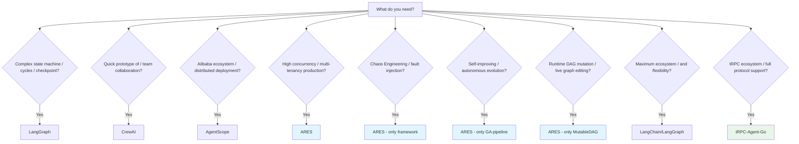

### One-Line Positioning

| Framework | Positioning | Best For | Not For |
|-----------|-------------|----------|---------|
| **LangChain/LangGraph** | Largest-ecosystem graph compute engine | Complex stateful workflows, RAG pipelines | Lightweight scenarios (overkill) |
| **CrewAI** | Team collaboration simulator | Rapid prototyping, role-play scenarios | Production, high determinism |
| **AgentScope** | Distributed agent framework | Alibaba ecosystem, multi-node deployment | Non-Alibaba environments, international teams |
| **ARES** | Distributed Agent orchestration engine | High concurrency, multi-tenancy, protocol-level communication, Chaos Engineering, Autonomous Evolution, Mutable DAG | Scenarios needing cycles/state rollback |
| **tRPC-Agent-Go** | tRPC-native Go agent framework with full protocol support | tRPC ecosystem teams, Go-native graph workflows, A2A/MCP protocol bridging | Non-tRPC environments, document-heavy scenarios |

---

## 12. 2026 Industry Trends

| Trend | Description |
|-------|-------------|
| **Python → Multi-language** | SK already supports C#/Python/Java, ARES's choice aligns with the direction |
| **Single-node → Distributed** | AutoGen 0.4 added distributed runtime, ARES's AHP natively supports it |
| **Conversation → Workflow** | CrewAI expanded from Crew to Flow, graph model is the ultimate form |
| **Memory becomes core** | All frameworks adding Memory, only ARES has automated distillation |
| **Observability as standard** | LangSmith binds LangGraph, open-source alternatives emerging |
| **Security from optional to mandatory** | PII redaction, injection detection, sandbox execution becoming standard |
| **Chaos Engineering** | Automated fault injection for agent systems — ARES is the only framework with built-in support (13 fault types, Survival/Scenario modes) |
| **Autonomous Evolution (GA)** | Self-improving agent pipelines via genetic algorithms — ARES is the pioneer with TournamentSelection, UniformCrossover, TieredScorer, DreamCycle |
| **Live Graph Mutation** | Runtime DAG mutation without restart — ARES introduces 5 mutation operations with BFS cycle detection and GraphEventHub |

### ARES's Differentiation Strategy

Leverage Go's concurrency advantages and play the **"production-grade reliability"** card. Don't compete with LangGraph on graph computation flexibility, don't compete with CrewAI on out-of-box experience, don't compete with AgentScope on Alibaba ecosystem depth. Focus on:

> **High-reliability, multi-tenant, protocol-level distributed Agent orchestration engine.**

ARES's differentiation — **circuit breaker, heartbeat, DLQ, automated distillation, multi-tenant isolation, Chaos Engineering, Autonomous Evolution, Mutable DAG, Conditional Edges, Controlled Loops, Subgraph Nesting, and State Checkpointing** — are characteristics that competitors cannot easily replicate.

---

## Appendix: Key Code File Index

| Domain | File Path |
|--------|-----------|
| DAG Definition | `internal/workflow/engine/types.go` |
| DAG Executor | `internal/workflow/engine/executor.go` |
| Hot Reload | `internal/workflow/engine/reloader.go` |
| AHP Message | `internal/ares_protocol/ahp/message.go` |
| Heartbeat | `internal/ares_protocol/ahp/heartbeat.go` |
| Dead Letter Queue | `internal/ares_protocol/ahp/dlq.go` |
| Leader Agent | `internal/agents/leader/agent.go` |
| Task Dispatcher | `internal/agents/leader/dispatcher.go` |
| Result Aggregator | `internal/agents/leader/aggregator.go` |
| Sub Agent | `internal/agents/sub/agent.go` |
| Task Executor | `internal/agents/sub/executor.go` |
| Circuit Breaker | `internal/storage/postgres/circuit_breaker.go` |
| Rate Limiter | `internal/ratelimit/` |
| PII Sanitizer | `internal/security/sanitizer.go` |
| Memory Distillation | `internal/ares_memory/distillation/` |
| Multi-tenant Isolation | `internal/storage/postgres/tenant_guard.go` |
| Chaos Engineering Injector | `internal/ares_arena/injector.go` |
| Chaos Engineering Scenario | `internal/ares_arena/scenario.go` |
| Chaos Engineering Survival | `internal/ares_arena/survival.go` |
| Market-making Chaos | `api/marketmaking/chaos.go` |
| Mutable DAG | `internal/workflow/engine/mutable_dag.go` |
| Dynamic Executor | `internal/workflow/engine/dynamic_executor.go` |
| Graph Event Hub | `internal/workflow/engine/graph_events.go` |
| Human-in-the-loop | `internal/workflow/engine/hitl.go` |
| GA Population Mgmt | `internal/ares_evolution/genome/population.go` |
| GA Tournament Selection | `internal/ares_evolution/genome/selection.go` |
| GA Uniform Crossover | `internal/ares_evolution/genome/crossover.go` |
| GA Fitness Sharing | `internal/ares_evolution/genome/adaptive.go` |
| Mutation Engine | `internal/ares_evolution/mutation/types.go` |
| Adaptive Distribution | `internal/ares_evolution/mutation/adaptive_distribution.go` |
| Guided Mutator | `internal/ares_evolution/mutation/guided_mutator.go` |
| Tiered Scorer | `internal/ares_evolution/scoring/tiered_scorer.go` |
| Memory-Aware Scorer | `internal/ares_evolution/scoring/memory_aware_scorer.go` |
| Dream Cycle | `internal/ares_evolution/dream_cycle.go` |
| Evolution Guardrails | `internal/ares_evolution/guardrails.go` |
| Evolution Scheduler | `internal/ares_evolution/scheduler.go` |
| Genome Wiring | `internal/ares_evolution/genome_wiring.go` |
