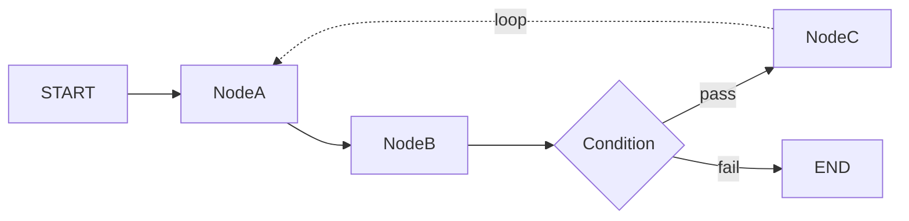
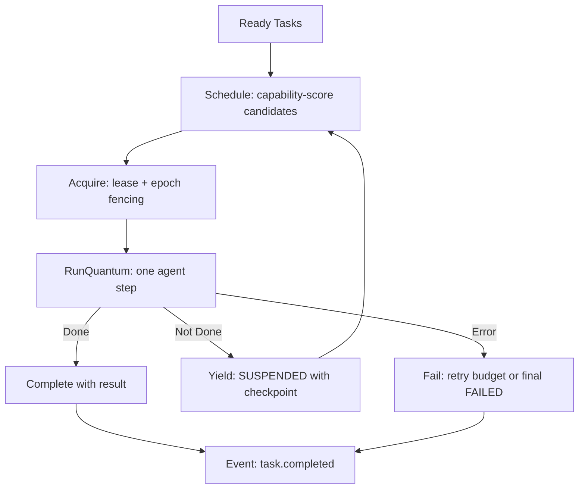

# Multi-Agent Framework Deep Comparison

> LangChain vs CrewAI vs AgentScope vs ARES vs tRPC-Agent-Go

---

## 1. Overview

This document compares five AI Agent frameworks: **LangChain (incl. LangGraph)**, **CrewAI**, **AgentScope**, **ARES**, and **tRPC-Agent-Go**. The comparison covers tech stack, architecture, workflow orchestration, multi-agent collaboration, memory systems, production reliability, deployment, and community maturity.

**Note on scope**: ARES is a research-oriented Agent OS under active development (dev branch, ~1300 commits). Many features described here exist in code but are not yet wired into production paths. This document distinguishes between "implemented" and "production-wired" where possible.

---

## 2. Tech Stack Comparison

| Dimension | LangChain / LangGraph | CrewAI | AgentScope | ARES | tRPC-Agent-Go |
|-----------|----------------------|--------|------------|------|---------------|
| **Primary Language** | Python, JavaScript/TypeScript | Python | Python | Go (1.26+) | Go (1.21+) |
| **Core Dependencies** | pydantic, langchain-core, langgraph, langserve | pydantic, crewaillm, langchain | alibaba/mpip (Kubernetes), Flask, etcd | pgx, gorilla/websocket, sqlite, mmh3, blake2b | openai-go, otel, ants/v2, zap |
| **LLM Providers** | 50+ (OpenAI, Anthropic, Google, Cohere, Hugging Face, AWS Bedrock, etc.) | OpenAI, Anthropic, Google, Ollama, Groq, Azure, etc. | OpenAI, ModelScope, DashScope, etc. | OpenAI, Ollama (plugin-based) | OpenAI, Ollama, etc. |
| **Vector DB** | 30+ (Pinecone, Chroma, Weaviate, Qdrant, FAISS, Milvus, PGVector, etc.) | LanceDB, Chroma | Built-in | PostgreSQL + pgvector (ivfflat index) | Built-in memory store, SQLite with vector extension |
| **Document Loaders** | 100+ (PDF, HTML, LaTeX, Markdown, CSV, JSON, DB, S3, Web) | Few built-in | Moderate | None (code/task focused) | None |
| **Communication Protocol** | REST (LangServe), SSE, limited gRPC | In-process function calls | Service Hub messaging, gRPC | AHP (legacy), agentipc (current) | tRPC (native), A2A, AG-UI, MCP, OpenAI-compatible API |
| **Dependency Mgmt** | Layered: langchain-core, -community, -langchain, -experimental | Single: crewaillm, crewai | Single + distributed deps | Single module + Go modules | tRPC-Go service modules |

### Key Differences

**LangChain** has the largest ecosystem (1000+ integrations), which is both its core strength and its heaviest burden. Layered packages complicate dependency management.

**CrewAI** is lightweight and emphasizes out-of-box experience. Uses some LangChain components internally.

**AgentScope** leverages Alibaba's tech stack with built-in distributed communication and good Kubernetes support.

**ARES** is pure Go with zero Python dependencies. Go's static compilation gives fast startup, but the trade-off is a tiny ecosystem — no document loaders, few LLM providers, no pre-built RAG pipelines. The codebase is in active development with ~1300 commits on the dev branch.

**tRPC-Agent-Go** is a Go-native framework integrated with the tRPC ecosystem from Tencent.

---

## 3. Architecture

### 3.1 Core Abstractions

| Framework | Core Abstraction | Design Philosophy | Architecture Style |
|-----------|-----------------|-------------------|-------------------|
| **LangGraph** | StateGraph (cyclic directed graph) | Graph computation model, node=function, edge=transition | Stateful graph execution engine |
| **CrewAI** | Crew + Agent + Task | Team collaboration metaphor, role-driven | Linear/hierarchical pipeline |
| **AgentScope** | Agent + Service Hub | Distributed message passing, service-oriented | Distributed message-driven |
| **ARES (dev)** | Peer Agent + Kernel Scheduler + Task Fabric | Agent OS: agents are disposable execution threads, tasks are durable, scheduler drives dispatch | Flat peer-to-peer, capability-scheduled, event-sourced |
| **tRPC-Agent-Go** | GraphAgent + Runner + Agent | Service-friendly, tRPC-native agent architecture | Go-native agent runtime with Pregel-style graph workflows |

### 3.2 ARES Architecture (Current, dev branch)

The current ARES (goagent dev branch) has replaced the legacy Leader-Sub model with a flat peer architecture:

```
User submits task → Task Fabric (durable state machine)
                         ↓
                 Kernel Scheduler (capability-score, lease, quantum)
                         ↓
                ┌─── peer agent A (code) ──┐
                │   peer agent B (review)  │  parallel execution
                │   peer agent C (test)    │  with agentipc IPC
                └──────────────────────────┘
                         ↓
                 aresrecovery (lease expiry → requeue → checkpoint resume)
                         ↓
                 introspect panel (observability: scheduler decisions, event stream)
```

Key components in production serve:
- **taskfabric**: durable task state machine (Create/Acquire/Yield/Complete/Checkpoint), with event sourcing
- **agentfabric**: agent lifecycle (Spawn/Kill/Suspend/Recover), dynamic population
- **kernelscheduler**: drain loop, capability-based candidate scoring, lease/epoch fencing, quantum execution
- **aresrecovery**: crash recovery (lease expiry → requeue → replacement agent → checkpoint resume)
- **agentipc**: peer-to-peer message bus for real agent collaboration
- **introspect**: 6-page observability panel (Overview/Tasks/Agents/Scheduler/Execution/Events)

The legacy Leader-Sub architecture (v0.2.x) has been removed. The current codebase has no `leader` package, no dispatcher/aggregator, and no dead-letter queue in production.

### 3.3 Language Graph — LangGraph


```mermaid
flowchart LR
    START --> NodeA
    NodeA --> NodeB
    NodeB --> Condition{Condition}
    Condition -->|pass| NodeC
    Condition -->|fail| END
    NodeC -.->|loop| NodeA
```

LangGraph's core is a directed graph with cycles. Nodes are processing steps, edges are control flow. Supports conditional branches and cycles. Checkpointing allows pausing and resuming at any node.

### 3.4 ARES Scheduler (dev branch)


```mermaid
flowchart TD
    Ready[Ready Tasks] --> Schedule[Schedule: capability-score candidates]
    Schedule --> Acquire[Acquire: lease + epoch fencing]
    Acquire --> Quantum[RunQuantum: one agent step]
    Quantum -->|Done| Complete[Complete with result]
    Quantum -->|Not Done| Yield[Yield: SUSPENDED with checkpoint]
    Quantum -->|Error| Fail[Fail: retry budget or final FAILED]
    Yield --> Schedule
    Complete --> Event[Event: task.completed]
    Fail --> Event
```

### 3.5 Architecture Key Differences

- **LangGraph**'s graph model is the most flexible, supporting complex state machines, cycles, and conditional routing. The cost is a steep learning curve.
- **CrewAI**'s team metaphor is the most intuitive. However, flexibility is limited.
- **AgentScope**'s distributed architecture suits enterprise deployments. But the community is small and documentation is primarily Chinese.
- **ARES**'s flat peer architecture with kernel scheduler is unique among these frameworks — it treats agents as disposable execution threads rather than fixed roles. The trade-off is that the architecture is still evolving (dev branch, ~1300 commits) and the ecosystem is minimal.
- **tRPC-Agent-Go**'s Runner + GraphAgent architecture is the most service-friendly within the tRPC ecosystem.

---

## 4. Workflow Orchestration

### 4.1 Workflow Capabilities

| Capability | LangGraph | CrewAI | AgentScope | ARES (dev) | tRPC-Agent-Go |
|-----------|-----------|--------|------------|------------|---------------|
| **DAG Support** | Native | Sequential/Hierarchical only | Pipeline mode | Task fabric dependencies (node DAG) | GraphAgent (Pregel-style) |
| **Conditional Edges** | `add_conditional_edges` | None | Pipeline condition nodes | Runtime router (via kernel dispatch) | ConditionalFunc routing |
| **Cycles/Loops** | Native | Not supported | Not supported | Not supported (no arbitrary cycles) | CycleAgent (loop with EscalationFunc) |
| **Parallel Execution** | Same super-step nodes | `async_execution=True` | Pipeline parallel | Scheduler maxConcurrent (goroutine) | Concurrent with sync.WaitGroup |
| **Subgraph Nesting** | Supported (node=subgraph) | Flow wraps Crews | Not supported | Not in production | Supported |
| **Hot Reload** | Not supported | Not supported | Not supported | Config watcher (cfgStore only) | Not documented |
| **Live Graph Mutation** | Not supported | Not supported | Not supported | Not in production | Not supported |
| **Human-in-the-loop** | `interrupt()` | `human_input=True` | Supported | Not in production | Supported (session-based) |
| **Step Recovery** | Checkpoint replay | Not supported | Not supported | aresrecovery (lease expiry → requeue) | Not documented |
| **Self Evolution** | Not native | Not supported | Not supported | Two evolution packages exist (old v0.2.9, new `internal/ares_evolution`); both are partially wired | SKILL.md evolution pipeline |
| **MCP Support** | Via LangChain MCP | Not native | Not native | Native WithMCP | Native mcptool integration |
| **Protocol Support** | LangServe | None | gRPC | AHP (legacy), agentipc (current) | tRPC, A2A, AG-UI, MCP, OpenAI-compatible |

### 4.2 Notes on ARES Workflow

ARES's workflow capabilities are split across two packages:

1. **production (task fabric + kernel scheduler)**: The real production path uses `taskfabric` for task state machines and `kernelscheduler` for dispatch. Tasks have DAG dependencies, epochs, leases, and checkpoints. This is what powers `ares serve`.

2. **not-in-production (workflow/engine)**: The `internal/workflow/engine` package (MutableDAG, DynamicExecutor, HITL, LoopConfig, Subgraph) is implemented but **not wired into production** — it exists as a capability reserve for the evolution system's DAG mutation patches. The v0.3.0 review found it "zero production calls" (outstanding_tasks.md → open circuit list).

The evolution system has two packages: `internal/evolution` (v0.2.9 six-genome pipeline, being replaced) and `internal/ares_evolution` (newer, partially wired). Neither is fully production-proven.

---

## 5. Multi-Agent Collaboration

### 5.1 Collaboration Patterns

| Pattern | LangGraph | CrewAI | AgentScope | ARES (dev) | tRPC-Agent-Go |
|---------|-----------|--------|------------|------------|---------------|
| **Supervisor/Orchestrator** | Subgraph composition | Hierarchical Process | Service Hub | No orchestrator (flat peer) | Runner + agents |
| **Peer-to-peer** | Shared state nodes | Task output chaining | Message routing | agentipc bus (real IPC) | A2A remote agent protocol |
| **Task Distribution** | Graph node scheduling | Manager Agent assignment | Pipeline dispatch | Kernel scheduler (capability score) | Chain/parallel/cycle patterns |
| **Result Aggregation** | State merge | Task output chaining | Message aggregation | Scheduler completes each task independently | Runner result collection |

### 5.2 ARES Collaboration

ARES's peer-to-peer collaboration uses `agentipc.Bus` — a real in-process message bus with Send/Request/Reply/Delegate/Handoff/Subscribe primitives. Agents communicate via direct IPC messages, not through an orchestrator. This is wired into the production serve path.

The legacy AHP (Agent Heartbeat Protocol) exists in `internal/ares_protocol/ahp` but is only used for evolution IPC bridging, not for production scheduling. The AHP heartbeat and DLQ (dead letter queue) are implemented but **not wired into production** — there are zero production call sites for DLQ.

---

## 6. Memory Systems

### 6.1 Memory Capabilities

| Dimension | LangChain/LangGraph | CrewAI | AgentScope | ARES | tRPC-Agent-Go |
|-----------|-------------------|--------|------------|------|---------------|
| **Short-term** | Checkpointed state | Current run context | Session message history | Session Memory (in-memory) | Session state (10+ backends) |
| **Long-term** | Store (PostgresStore, etc.) | LanceDB vector store | Built-in storage | PostgreSQL + pgvector | Memory service with 12 backends |
| **Entity Memory** | Not supported | Knowledge Graph | Not supported | MemoryProfile type | Artifact system, knowledge base |
| **Deduplication** | Not supported | cosine > 0.85 + LLM decision | Not supported | cosine > 0.85 conflict detection | Not documented |
| **Importance Scoring** | Not supported | `0.5*sim + 0.3*recency + 0.2*llm` | Not supported | Rule-based (keyword + type + length) | Not documented |
| **Distillation** | Not supported | Not supported | Not supported | 6-step automated pipeline | Not documented |
| **Multi-tenancy** | namespace tuple | Not supported | Not supported | Application-level tenantID predicates | Session isolation |

### 6.2 ARES Memory Distillation

ARES has an automated memory distillation pipeline (6 steps: extract → classify+score → filter → embed+conflict → filter → cap). The pipeline is rule-driven (no LLM call per step), which means it is fast but less accurate than LLM-assisted approaches. The scoring uses keyword + type + length rules with a base score of 0.4.

The "nanosecond latency" claim sometimes associated with this pipeline is misleading — the pipeline involves SQLite reads/writes and embedding generation, which take milliseconds, not nanoseconds.

### 6.3 Multi-tenancy

ARES uses application-level tenantID predicates on all repository queries (tenantID parameter on every `KnowledgeRepository.*`, `ExperienceRepository.*`, etc.). The previous PostgreSQL RLS approach (`SET LOCAL`) was removed in v0.3.1 (tenant_isolation.md, #36 descoped).

---

## 7. Reliability & Production Features

### 7.1 Error Handling

| Mechanism | LangGraph | CrewAI | AgentScope | ARES | tRPC-Agent-Go |
|-----------|-----------|--------|------------|------|---------------|
| **Retry** | None built-in | `max_retry_limit=2` | Basic retry | 3x exponential backoff (task executor) | Supported via evolution pipeline |
| **Timeout** | None built-in | `max_execution_time` | None built-in | Tiered (LLM 120s, DB 30s, Vector 10s) | Not documented |
| **Output Validation** | None built-in | `output_pydantic` + Guardrails | None built-in | Schema Validator | Schema-based output validation |
| **Fallback** | Fallbacks param | None built-in | None built-in | FailoverClient (multi-provider + rate-limit cooldown) | Not documented |
| **Circuit Breaker** | Not supported | Not supported | Not supported | LLM failover (cooldown-based) | Not documented |
| **Dead Letter Queue** | Not supported | Not supported | Not supported | Implemented in AHP (DLQ) but not wired into production | Not documented |
| **Human-in-the-loop** | `interrupt()` | `human_input=True` | Supported | Implementation exists in workflow/engine but not wired into production | Supported |
| **Chaos Engineering** | Not supported | Not supported | Not supported | `ares_arena` (13 fault types) — wired into cmd/ares/arena.go | Not documented |

### 7.2 Notes on ARES Reliability

- **FailoverClient**: ARES has a multi-provider LLM failover client with cooldown-based circuit breaking. When a provider returns errors (e.g., 429 rate limit), it is cooled down and the next provider is tried. This is production-wired in `ares serve`.
- **Circuit Breaker**: The `internal/storage/postgres/circuit_breaker.go` is a PostgreSQL-specific circuit breaker for the retrieval guard, not a general-purpose mechanism.
- **DLQ**: The AHP dead letter queue is implemented in `internal/ares_protocol/ahp/dlq.go` but has zero production call sites outside the AHP package itself.
- **Chaos Engineering**: `internal/ares_arena` has 13 fault injection types and survival/scenario modes. The `cmd/ares/arena.go` entry point wires a subset of these into the serve binary.
- **Chaos Isolation** (v0.3.1): Shadow sandbox mode (scratch fabric, zero production impact) + live mode with six guardrails (rate limit, cooldown, fail-safe latch, GA quiet window, target whitelist, emergency stop). Wired into `ares serve`.

---

## 8. Community & Ecosystem

| Metric | LangChain | CrewAI | AgentScope | ARES | tRPC-Agent-Go |
|--------|----------|--------|------------|------|---------------|
| **GitHub Stars** | ~100,000+ | ~40,000 | ~4,000 | Private/early | ~1,500 |
| **Main Contributors** | 1,200+ | 300+ | ~50 | 2 | ~20 |
| **License** | MIT | MIT | Apache 2.0 | Apache 2.0 | Apache 2.0 |
| **First Release** | Oct 2022 | 2023 | 2024 | 2025 | 2025 |
| **Current Version** | v0.3.x (Python) | v0.8x+ | v0.x | dev branch (v0.3.x) | v0.x |
| **Integration Ecosystem** | 1,000+ official + community | 50+ built-in tools | Limited | ~20 built-in tools, MCP plugin | MCP tools, 20+ built-in tools |
| **Monthly Downloads** | >15M | >5M | Unknown | Unknown | Unknown |
| **Funding** | Benchmark A $25-35M | Independent development | Alibaba Group | Open source project (2 contributors) | tRPC Group (Tencent) |
| **Enterprise Adoption** | JPMorgan, IBM, Salesforce, Airbnb | SMBs primarily | Alibaba internal + partners | Early stage | tRPC ecosystem users |
| **Documentation** | Broad but inconsistent (old/new API) | Clear, beginner-friendly | Chinese primarily | Improving (EN + CN), limited | EN + CN |

---

## 9. Honest Assessment

### 9.1 LangChain/LangGraph

**Strengths**:
- Largest ecosystem (1000+ integrations), maximum model agnosticism
- Most advanced state management (checkpointing, replay, HITL)
- Most comprehensive RAG pipeline supporting all major strategies
- Largest community, most learning resources

**Weaknesses**:
- Too many abstraction layers, error messages are hard to trace
- Frequent breaking API changes, high maintenance burden
- Performance overhead (deep abstraction call stack)
- LangSmith is paid

### 9.2 CrewAI

**Strengths**:
- Low barrier to entry, intuitive team metaphor
- Role-driven design makes agent behavior understandable
- 50+ built-in tools, out-of-box experience

**Weaknesses**:
- Low determinism, LLM decisions are uncontrollable
- No production-grade reliability features
- Python GIL limits concurrent performance
- Insufficient flexibility for complex scenarios

### 9.3 AgentScope

**Strengths**:
- Native distributed architecture for multi-node deployment
- Deep integration with Alibaba Cloud / ModelScope ecosystem
- Message-driven design suits loosely coupled systems

**Weaknesses**:
- Small community, limited international influence
- Documentation primarily in Chinese
- Lacks production reliability mechanisms
- Difficult to integrate outside Alibaba ecosystem

### 9.4 ARES

**Strengths**:
- **Go-native concurrency**: goroutines + channels, no GIL
- **Unique architecture**: flat peer agents with kernel scheduler, task fabric durability, event sourcing — this is genuinely different from the role-based team model
- **Observability**: 6-page introspect panel shows real-time scheduler decisions, task state machines, agent lifecycle, and event stream — all open source and free
- **Crash recovery**: lease expiry → requeue → checkpoint resume, wired into production
- **Real agent IPC**: agentipc bus for peer-to-peer collaboration (not orchestrated)
- **Chaos isolation**: shadow sandbox verification mode with six guardrails, production-wired
- **Failover LLM client**: multi-provider with cooldown, production-wired

**Weaknesses (honest)**:
- **Tiny ecosystem**: 2 contributors, ~20 built-in tools, no document loaders, few LLM providers. LangChain has 1000+ integrations — ARES has essentially zero third-party integrations.
- **Very early stage**: dev branch, 2025 first release, architecture still evolving. The `ares serve` command was only stabilized in recent months.
- **Many features are "implemented but not wired"**: The workflow engine (MutableDAG, HITL, Subgraph, LoopConfig), AHP DLQ, and parts of the evolution system exist in code but are not in production paths. The v0.3.0 review documented ~20 such "open circuits".
- **No RAG pipeline**: Unlike LangChain, ARES has no built-in document loading, chunking, or retrieval-augmented generation pipeline.
- **Limited LLM support**: OpenAI and Ollama are the only well-tested providers. No Anthropic, Google, Cohere, or local model support through a unified API.
- **Documentation is limited**: With 2 contributors, the docs are sparse compared to any established framework.
- **Evolution system is unproven at scale**: Two evolution packages exist, neither has been validated on large production workloads.

### 9.5 tRPC-Agent-Go

**Strengths**:
- Go-native, full goroutine concurrency model
- Rich agent types (6 built-in types)
- 6 protocol servers (A2A, AG-UI, OpenAI-compatible, etc.)
- 12 memory backends
- Production observability (OpenTelemetry + Langfuse)

**Weaknesses**:
- Early stage, smaller community
- Limited LLM providers
- No document loaders
- Best value within tRPC ecosystem

---

## 10. Selection Guide

| Scenario | Recommended Framework | Why |
|----------|---------------------|-----|
| Complex stateful workflows, RAG, large ecosystem | LangChain/LangGraph | 1000+ integrations, best state management |
| Quick prototype, team collaboration metaphor | CrewAI | Lowest barrier to entry |
| Alibaba ecosystem, distributed deployment | AgentScope | Native Kubernetes support |
| High concurrency, crash recovery, observability | ARES | Unique peer scheduler, durable tasks, free observability |
| tRPC ecosystem, Go-native, A2A/MCP protocols | tRPC-Agent-Go | tRPC ecosystem integration |
| **Need third-party integrations** | **Not ARES** | ARES has almost no ecosystem |
| **Need document processing / RAG** | **Not ARES** | ARES has no document loaders or RAG pipelines |
| **Need a stable, production-proven framework** | **LangChain or CrewAI** | ARES is too early stage |

---

## 11. Appendix: Implementation Status of Key ARES Features

| Feature | Implemented | Production-Wired | Notes |
|---------|------------|-----------------|-------|
| Kernel Scheduler (task fabric) | ✅ | ✅ | `ares serve` production path |
| Agent Fabric (lifecycle) | ✅ | ✅ | `ares serve` production path |
| Crash Recovery (aresrecovery) | ✅ | ✅ | `ares serve` production path |
| Agent IPC (agentipc) | ✅ | ✅ | `ares serve` production path |
| Introspect Panel (6 pages) | ✅ | ✅ | `ares serve` production path |
| Chaos Isolation (shadow/live) | ✅ | ✅ | `ares serve` production path |
| Failover LLM Client | ✅ | ✅ | `ares serve` production path |
| Memory Distillation | ✅ | ✅ | Bootstrap-wired |
| Event Sourcing | ✅ | ✅ | Task fabric + event store |
| Mutable DAG (workflow/engine) | ✅ | ❌ | Zero production call sites |
| HITL (workflow/engine) | ✅ | ❌ | Zero production call sites |
| AHP DLQ | ✅ | ❌ | No production call sites outside AHP |
| Evolution (v0.2.9 six-genome) | ✅ | Partial | Being replaced |
| Evolution (internal/ares_evolution) | ✅ | Partial | Partially wired |
| Leader-Sub legacy | ❌ | N/A | Removed in v0.3.x |
| Multi-tenant RLS (SET LOCAL) | ❌ | N/A | Descoped, replaced by app-level predicates |